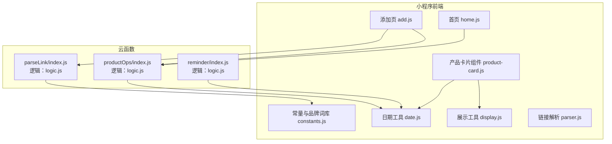
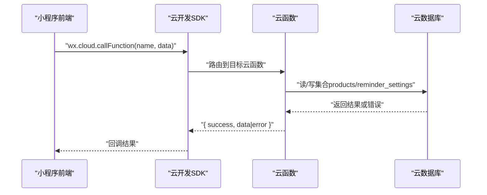
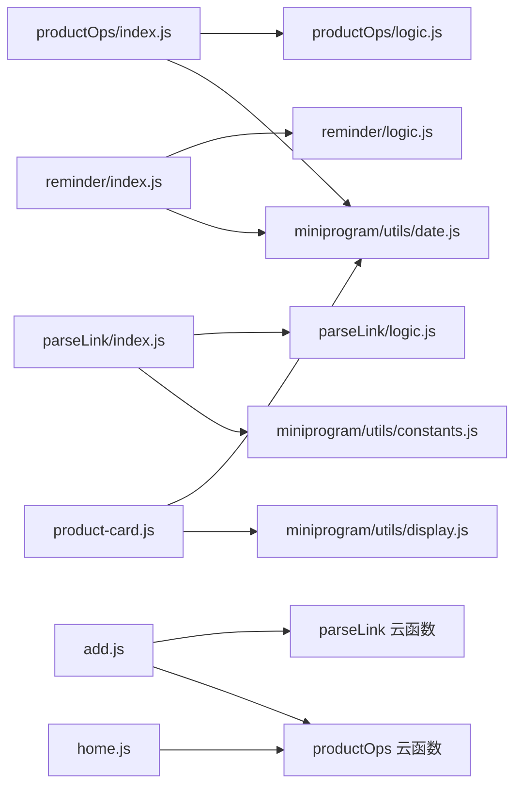

# API参考手册

<cite>
**本文档引用的文件**
- [cloudfunctions/productOps/index.js](file://cloudfunctions/productOps/index.js)
- [cloudfunctions/productOps/logic.js](file://cloudfunctions/productOps/logic.js)
- [cloudfunctions/parseLink/index.js](file://cloudfunctions/parseLink/index.js)
- [cloudfunctions/parseLink/logic.js](file://cloudfunctions/parseLink/logic.js)
- [cloudfunctions/reminder/index.js](file://cloudfunctions/reminder/index.js)
- [cloudfunctions/reminder/logic.js](file://cloudfunctions/reminder/logic.js)
- [miniprogram/utils/constants.js](file://miniprogram/utils/constants.js)
- [miniprogram/utils/date.js](file://miniprogram/utils/date.js)
- [miniprogram/utils/display.js](file://miniprogram/utils/display.js)
- [miniprogram/utils/parser.js](file://miniprogram/utils/parser.js)
- [miniprogram/components/product-card/product-card.js](file://miniprogram/components/product-card/product-card.js)
- [miniprogram/pages/add/add.js](file://miniprogram/pages/add/add.js)
- [miniprogram/pages/home/home.js](file://miniprogram/pages/home/home.js)
- [package.json](file://package.json)
- [tests/productOps.test.js](file://tests/productOps.test.js)
- [tests/parseLink.test.js](file://tests/parseLink.test.js)
- [tests/reminder.test.js](file://tests/reminder.test.js)
</cite>

## 目录
1. [简介](#简介)
2. [项目结构](#项目结构)
3. [核心组件](#核心组件)
4. [架构总览](#架构总览)
5. [详细组件分析](#详细组件分析)
6. [依赖关系分析](#依赖关系分析)
7. [性能考虑](#性能考虑)
8. [故障排查指南](#故障排查指南)
9. [结论](#结论)
10. [附录](#附录)

## 简介
本API参考手册面向开发者，系统性梳理了微信小程序后端云函数与前端组件的公开接口规范，覆盖以下主题：
- 云函数API：productOps、parseLink、reminder 的完整接口定义、请求/响应模式与错误处理
- 工具函数API：日期计算、展示辅助、链接解析等纯函数的函数签名、参数与返回值
- 组件API：产品卡片组件的属性、事件与方法调用规范
- 请求示例、响应格式与错误策略
- 版本管理、向后兼容与迁移建议

## 项目结构
项目采用“云函数 + 小程序前端”的分层架构，云函数负责数据持久化与定时任务，小程序前端通过云函数实现业务能力。

图表来源
- [miniprogram/pages/add/add.js:1-260](file://miniprogram/pages/add/add.js#L1-L260)
- [miniprogram/pages/home/home.js:1-119](file://miniprogram/pages/home/home.js#L1-L119)
- [miniprogram/components/product-card/product-card.js:1-51](file://miniprogram/components/product-card/product-card.js#L1-L51)
- [miniprogram/utils/constants.js:1-100](file://miniprogram/utils/constants.js#L1-L100)
- [miniprogram/utils/date.js:1-76](file://miniprogram/utils/date.js#L1-L76)
- [miniprogram/utils/display.js:1-76](file://miniprogram/utils/display.js#L1-L76)
- [miniprogram/utils/parser.js:1-70](file://miniprogram/utils/parser.js#L1-L70)
- [cloudfunctions/productOps/index.js:1-171](file://cloudfunctions/productOps/index.js#L1-L171)
- [cloudfunctions/productOps/logic.js:1-105](file://cloudfunctions/productOps/logic.js#L1-L105)
- [cloudfunctions/parseLink/index.js:1-112](file://cloudfunctions/parseLink/index.js#L1-L112)
- [cloudfunctions/parseLink/logic.js:1-78](file://cloudfunctions/parseLink/logic.js#L1-L78)
- [cloudfunctions/reminder/index.js:1-106](file://cloudfunctions/reminder/index.js#L1-L106)
- [cloudfunctions/reminder/logic.js:1-45](file://cloudfunctions/reminder/logic.js#L1-L45)

章节来源
- [package.json:1-20](file://package.json#L1-L20)

## 核心组件
本节概述三大云函数与相关工具函数的职责与交互。

- productOps：产品生命周期管理，支持新增、查询、获取、更新、更新状态、删除；内置输入校验与状态重算逻辑。
- parseLink：淘宝/天猫链接解析，支持短链与淘口令识别，降级抓取页面标题并解析品牌、规格与分类。
- reminder：定时任务，批量更新产品状态并发送订阅消息。
- 工具函数：日期计算、展示辅助、链接解析、品牌词库与规格提取。

章节来源
- [cloudfunctions/productOps/index.js:1-171](file://cloudfunctions/productOps/index.js#L1-L171)
- [cloudfunctions/parseLink/index.js:1-112](file://cloudfunctions/parseLink/index.js#L1-L112)
- [cloudfunctions/reminder/index.js:1-106](file://cloudfunctions/reminder/index.js#L1-L106)
- [miniprogram/utils/date.js:1-76](file://miniprogram/utils/date.js#L1-L76)
- [miniprogram/utils/display.js:1-76](file://miniprogram/utils/display.js#L1-L76)
- [miniprogram/utils/parser.js:1-70](file://miniprogram/utils/parser.js#L1-L70)
- [miniprogram/utils/constants.js:1-100](file://miniprogram/utils/constants.js#L1-L100)

## 架构总览
云函数与小程序前端通过云开发SDK进行通信，遵循统一的请求/响应模式与错误处理策略。

图表来源
- [miniprogram/pages/add/add.js:70-108](file://miniprogram/pages/add/add.js#L70-L108)
- [miniprogram/pages/home/home.js:33-42](file://miniprogram/pages/home/home.js#L33-L42)
- [cloudfunctions/productOps/index.js:40-64](file://cloudfunctions/productOps/index.js#L40-L64)
- [cloudfunctions/parseLink/index.js:11-56](file://cloudfunctions/parseLink/index.js#L11-L56)
- [cloudfunctions/reminder/index.js:15-105](file://cloudfunctions/reminder/index.js#L15-L105)

## 详细组件分析

### 云函数API

#### productOps 云函数
- 作用：产品全生命周期管理
- 支持操作：add、list、get、update、updateStatus、delete
- 认证：基于云开发上下文OPENID鉴权，记录归属ownerOpenid/_openid
- 数据库：products、reminder_settings

请求/响应模式
- 请求
  - 通用字段：action（必填）、OPENID（由云环境注入）
  - add：name、brand、category、specification、imageUrl、sourceLink、productionDate、shelfLifeMonths、openedDate、openedShelfLifeMonths
  - list：category、status、keyword、page、pageSize
  - get/update/delete：_id
  - updateStatus：_id、status（仅允许used_up、discarded）
- 响应
  - 成功：{ success: true, data: ... }
  - 失败：{ success: false, error: string }

鉴权与安全
- 除list外，其他操作均校验记录归属（ownerOpenid或_openid）与OPENID一致，否则返回无权访问

状态与重算
- 新增/更新时根据生产日期、保质期与开封信息计算过期日期与状态
- 支持按提前提醒天数（来自reminder_settings）动态调整展示状态

错误处理
- 输入校验失败：返回具体错误信息
- 数据库异常：捕获并返回错误消息
- 未知操作：返回未知操作提示

章节来源
- [cloudfunctions/productOps/index.js:40-171](file://cloudfunctions/productOps/index.js#L40-L171)
- [cloudfunctions/productOps/logic.js:1-105](file://cloudfunctions/productOps/logic.js#L1-L105)

#### parseLink 云函数
- 作用：解析淘宝/天猫链接，提取商品ID，抓取页面标题并解析品牌、规格与分类
- 支持类型：taobao_link、short_link、taokou_ling
- 降级策略：短链解析失败时返回错误；淘口令当前不支持；抓取失败时返回错误

请求/响应模式
- 请求：{ type: 'taobao_link'|'short_link'|'taokou_ling', value: string }
- 响应：{ name: string, brand: string, specification: string, category: string, imageUrl: string }

错误处理
- 缺少必要参数：返回缺少必要参数
- 短链解析失败：返回短链解析失败
- 淘口令：返回淘口令解析暂不支持
- 抓取失败：返回无法获取商品信息
- 其他异常：返回解析失败及错误信息

章节来源
- [cloudfunctions/parseLink/index.js:1-112](file://cloudfunctions/parseLink/index.js#L1-L112)
- [cloudfunctions/parseLink/logic.js:1-78](file://cloudfunctions/parseLink/logic.js#L1-L78)

#### reminder 云函数
- 作用：定时任务，每日08:00执行，批量更新产品状态并发送订阅消息
- 触发：云函数定时触发器
- 逻辑：查询活跃产品（in_use/expiring_soon），按用户设置的提前提醒天数分类，批量更新状态，对启用推送的用户发送订阅消息

请求/响应模式
- 请求：无（定时触发）
- 响应：{ updated: number, expired: number, expiringSoon: number, pushed: number } 或 { error: string }

错误处理
- 捕获异常并返回错误消息；无活跃产品时返回提示信息

章节来源
- [cloudfunctions/reminder/index.js:1-106](file://cloudfunctions/reminder/index.js#L1-L106)
- [cloudfunctions/reminder/logic.js:1-45](file://cloudfunctions/reminder/logic.js#L1-L45)

### 工具函数API

#### 日期计算工具（date.js）
- addMonths(dateStr, months)
  - 输入：日期字符串、月份数
  - 输出：YYYY-MM-DD（处理月末溢出）
- calcExpirationDate(product)
  - 输入：{ productionDate, shelfLifeMonths, openedDate?, openedShelfLifeMonths? }
  - 输出：过期日期字符串（未开封与开封后取较小者）
- calcRemainingDays(expirationDate, today?)
  - 输入：过期日期、可选今日日期
  - 输出：剩余天数（正数=还剩X天，0=今天过期，负数=已过期X天）
- getProductDisplayStatus(remainingDays, advanceDays)
  - 输入：剩余天数、提前提醒天数
  - 输出：展示状态（in_use/expiring_soon/expired）
- formatDate(date)
  - 输入：Date对象
  - 输出：YYYY-MM-DD

章节来源
- [miniprogram/utils/date.js:1-76](file://miniprogram/utils/date.js#L1-L76)

#### 展示辅助工具（display.js）
- calcProgressPercent(productionDate, expirationDate, now?)
  - 输入：生产日期、过期日期、可选当前日期
  - 输出：进度百分比（0-100）
- formatRemainingText(remainingDays)
  - 输入：剩余天数
  - 输出：展示文本（剩余X天/今天过期/已过期X天）
- getStatusLabel(status)
  - 输入：状态枚举
  - 输出：中文标签
- getStatusColorClass(status)
  - 输入：状态枚举
  - 输出：颜色类名（safe/warning/danger/secondary）

章节来源
- [miniprogram/utils/display.js:1-76](file://miniprogram/utils/display.js#L1-L76)

#### 链接解析工具（parser.js）
- identifyLinkType(text)
  - 输入：用户粘贴文本
  - 输出：taobao_link/short_link/taokou_ling/unknown
- extractUrl(text, type)
  - 输入：原始文本、类型
  - 输出：提取的URL或淘口令代码
- parseInput(text)
  - 输入：原始文本
  - 输出：{ type, value }

章节来源
- [miniprogram/utils/parser.js:1-70](file://miniprogram/utils/parser.js#L1-L70)

#### 常量与品牌词库（constants.js）
- PRODUCT_STATUS：状态枚举（in_use、expiring_soon、expired、used_up、discarded）
- PRESET_CATEGORIES：预设分类列表
- BRAND_LIST：品牌词库（国际高端、彩妆、中端、日韩、欧美平价、国货、功效护肤、身体护理/香水、美发等）
- matchBrand(title)
  - 输入：标题
  - 输出：匹配到的品牌（优先最长匹配，大小写不敏感）
- extractSpecification(title)
  - 输入：标题
  - 输出：规格（数字+单位，匹配ml/g/片/支/对）

章节来源
- [miniprogram/utils/constants.js:1-100](file://miniprogram/utils/constants.js#L1-L100)

### 组件API

#### 产品卡片组件（product-card.js）
- 属性
  - product: Object，默认 {}
  - advanceDays: Number，默认 30
- 观察器
  - 监听 product 与 advanceDays，计算剩余天数、展示状态、进度百分比并更新内部数据
- 数据
  - remainingText: 剩余天数文本
  - statusLabel: 状态中文标签
  - colorClass: 颜色类名
  - progressPercent: 进度百分比
- 方法
  - onCardTap(): 跳转至详情页（若存在_id）

章节来源
- [miniprogram/components/product-card/product-card.js:1-51](file://miniprogram/components/product-card/product-card.js#L1-L51)

### 前端页面与云函数对接

#### 添加页（add.js）
- 双模式：链接导入与手动录入
- 链接导入流程
  - 识别链接类型与提取URL/淘口令
  - 调用 parseLink 云函数解析
  - 自动填充表单并预览过期日期
- 保存流程
  - 前端基础校验
  - 调用 productOps 云函数执行 add 操作
  - 错误处理：云开发未配置、超时、通用错误分别提示

章节来源
- [miniprogram/pages/add/add.js:1-260](file://miniprogram/pages/add/add.js#L1-L260)

#### 首页（home.js）
- 加载仪表盘数据
  - 调用 productOps 云函数获取产品列表
  - 前端实时计算展示状态、统计安全率与即将过期产品
  - 支持跳转详情、库存与添加页

章节来源
- [miniprogram/pages/home/home.js:1-119](file://miniprogram/pages/home/home.js#L1-L119)

## 依赖关系分析

图表来源
- [cloudfunctions/productOps/index.js:1-171](file://cloudfunctions/productOps/index.js#L1-L171)
- [cloudfunctions/productOps/logic.js:1-105](file://cloudfunctions/productOps/logic.js#L1-L105)
- [cloudfunctions/parseLink/index.js:1-112](file://cloudfunctions/parseLink/index.js#L1-L112)
- [cloudfunctions/parseLink/logic.js:1-78](file://cloudfunctions/parseLink/logic.js#L1-L78)
- [cloudfunctions/reminder/index.js:1-106](file://cloudfunctions/reminder/index.js#L1-L106)
- [cloudfunctions/reminder/logic.js:1-45](file://cloudfunctions/reminder/logic.js#L1-L45)
- [miniprogram/utils/date.js:1-76](file://miniprogram/utils/date.js#L1-L76)
- [miniprogram/utils/display.js:1-76](file://miniprogram/utils/display.js#L1-L76)
- [miniprogram/utils/constants.js:1-100](file://miniprogram/utils/constants.js#L1-L100)
- [miniprogram/components/product-card/product-card.js:1-51](file://miniprogram/components/product-card/product-card.js#L1-L51)
- [miniprogram/pages/add/add.js:1-260](file://miniprogram/pages/add/add.js#L1-L260)
- [miniprogram/pages/home/home.js:1-119](file://miniprogram/pages/home/home.js#L1-L119)

## 性能考虑
- 云函数
  - productOps：分页查询与关键字检索需配合索引优化；批量更新状态时建议限制单次更新数量以避免超时
  - parseLink：抓取页面标题设置合理超时与降级策略，避免阻塞主线程
  - reminder：限制每次查询与更新数量，避免大范围扫描
- 前端
  - 仪表盘实时计算展示状态时，建议缓存计算结果并在数据变化时再刷新
  - 列表渲染使用组件化与观察器减少不必要的setData

## 故障排查指南
- 云开发未配置或权限不足
  - 现象：调用云函数报错，提示无权限或未配置
  - 处理：在微信开发者工具中开通云开发，确认云函数已部署，检查app.js中的云环境ID
- 云函数超时
  - 现象：保存或解析超时
  - 处理：检查云函数部署状态、网络连通性与数据库权限，适当增加超时时间或优化查询条件
- 解析失败
  - 现象：parseLink返回无法获取商品信息或解析失败
  - 处理：确认链接类型与有效性，检查降级抓取是否可用
- 权限校验失败
  - 现象：返回无权访问
  - 处理：确认OPENID与记录归属一致，检查ownerOpenid/_openid字段

章节来源
- [miniprogram/pages/add/add.js:212-234](file://miniprogram/pages/add/add.js#L212-L234)
- [cloudfunctions/productOps/index.js:117-131](file://cloudfunctions/productOps/index.js#L117-L131)
- [cloudfunctions/parseLink/index.js:14-55](file://cloudfunctions/parseLink/index.js#L14-L55)

## 结论
本手册提供了从云函数到前端组件的完整API规范与最佳实践。开发者可据此快速集成产品管理、链接解析与定时提醒功能，并在保证性能与稳定性的前提下扩展新特性。

## 附录

### API版本管理、向后兼容与迁移指南
- 版本号
  - 项目版本：1.0.0（package.json）
- 向后兼容
  - 云函数返回结构保持success/error与data字段一致性，便于客户端兼容
  - 工具函数均为纯函数，新增字段不影响既有调用
- 迁移建议
  - 若扩展状态枚举，需同步更新PRODUCT_STATUS与前端状态映射
  - 若调整数据库字段，需在云函数与前端同时兼容旧字段
  - 若引入新链接类型，需在parser.js中扩展识别规则并更新parseLink逻辑

章节来源
- [package.json:1-20](file://package.json#L1-L20)
- [miniprogram/utils/constants.js:6-12](file://miniprogram/utils/constants.js#L6-L12)
- [miniprogram/utils/parser.js:17-25](file://miniprogram/utils/parser.js#L17-L25)
- [cloudfunctions/parseLink/logic.js:13-17](file://cloudfunctions/parseLink/logic.js#L13-L17)

### 请求与响应示例（路径引用）
- productOps.add
  - 请求路径：[miniprogram/pages/add/add.js:177-199](file://miniprogram/pages/add/add.js#L177-L199)
  - 响应路径：[cloudfunctions/productOps/index.js:86-89](file://cloudfunctions/productOps/index.js#L86-L89)
- productOps.list
  - 请求路径：[miniprogram/pages/home/home.js:33-35](file://miniprogram/pages/home/home.js#L33-L35)
  - 响应路径：[cloudfunctions/productOps/index.js](file://cloudfunctions/productOps/index.js#L109)
- parseLink
  - 请求路径：[miniprogram/pages/add/add.js:70-76](file://miniprogram/pages/add/add.js#L70-L76)
  - 响应路径：[cloudfunctions/parseLink/index.js:46-52](file://cloudfunctions/parseLink/index.js#L46-L52)
- reminder
  - 触发路径：[cloudfunctions/reminder/index.js:15-15](file://cloudfunctions/reminder/index.js#L15-L15)
  - 响应路径：[cloudfunctions/reminder/index.js:96-101](file://cloudfunctions/reminder/index.js#L96-L101)