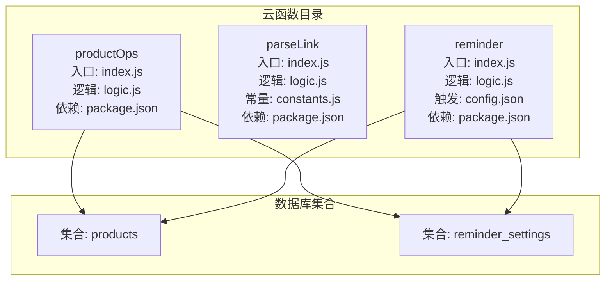
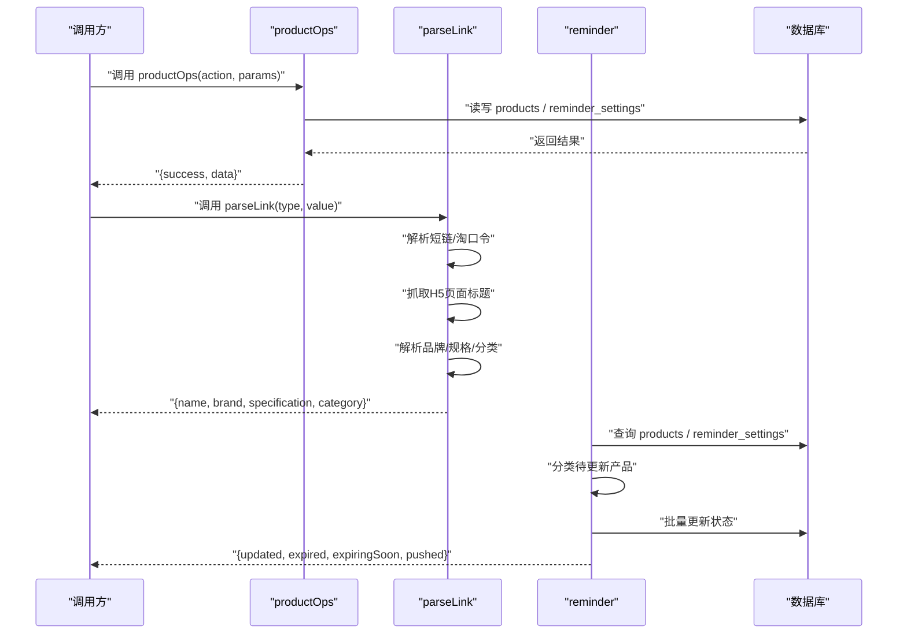
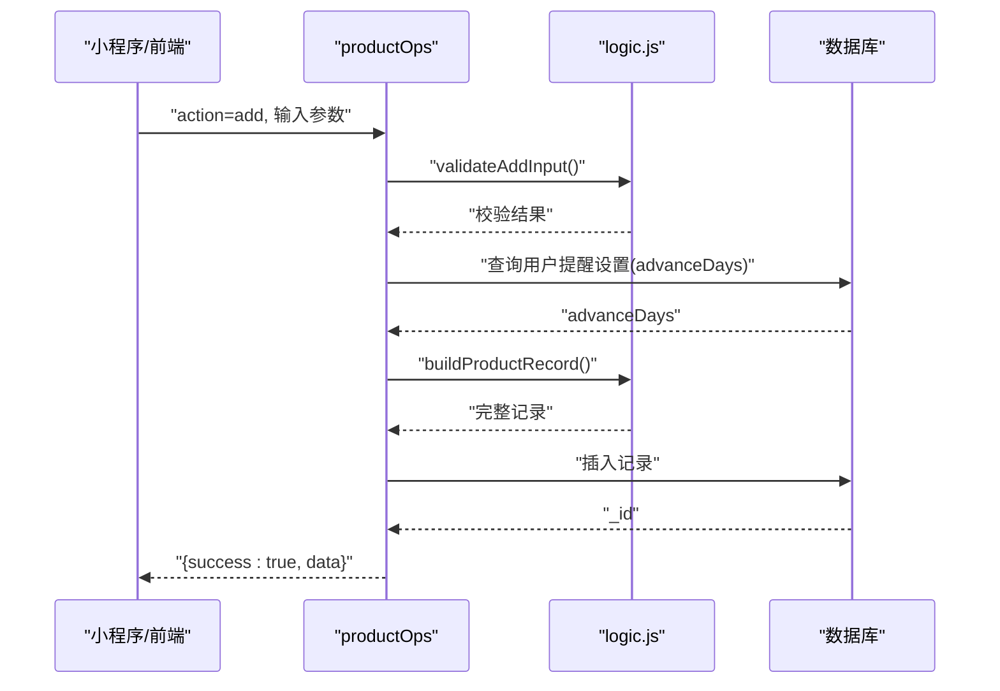
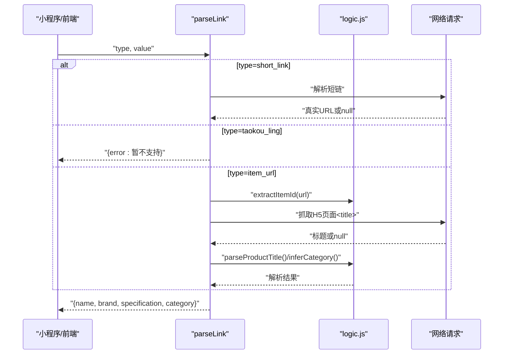
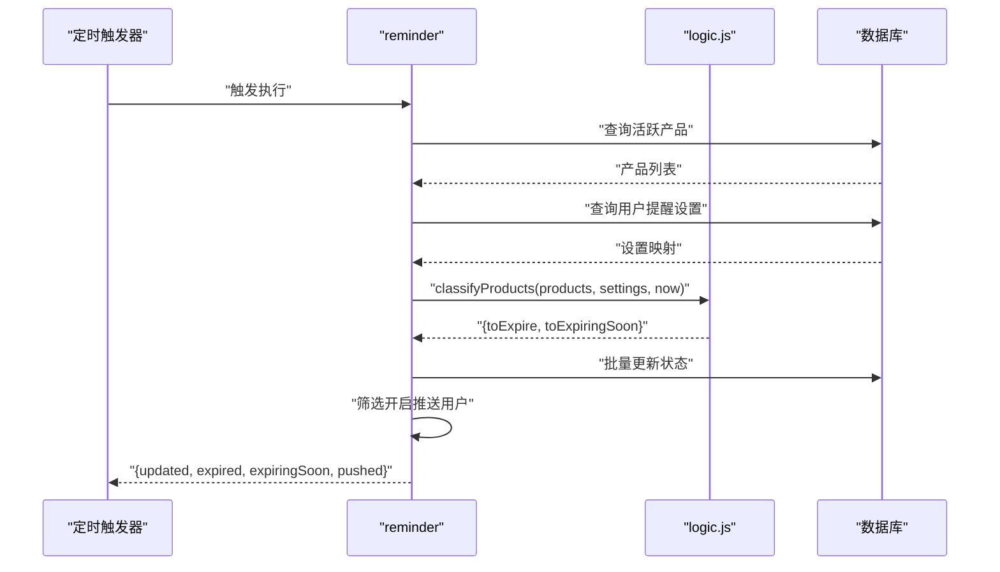
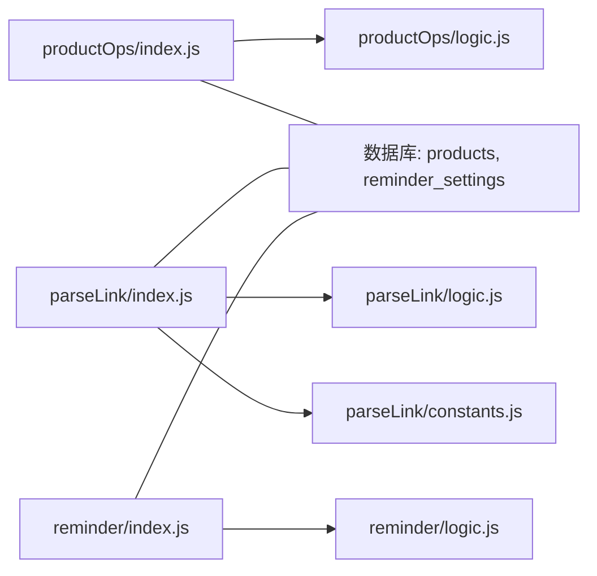

# 云函数API

<cite>
**本文档引用的文件**
- [cloudfunctions/productOps/index.js](file://cloudfunctions/productOps/index.js)
- [cloudfunctions/productOps/logic.js](file://cloudfunctions/productOps/logic.js)
- [cloudfunctions/productOps/package.json](file://cloudfunctions/productOps/package.json)
- [cloudfunctions/parseLink/index.js](file://cloudfunctions/parseLink/index.js)
- [cloudfunctions/parseLink/logic.js](file://cloudfunctions/parseLink/logic.js)
- [cloudfunctions/parseLink/constants.js](file://cloudfunctions/parseLink/constants.js)
- [cloudfunctions/parseLink/package.json](file://cloudfunctions/parseLink/package.json)
- [cloudfunctions/reminder/index.js](file://cloudfunctions/reminder/index.js)
- [cloudfunctions/reminder/logic.js](file://cloudfunctions/reminder/logic.js)
- [cloudfunctions/reminder/config.json](file://cloudfunctions/reminder/config.json)
- [cloudfunctions/reminder/package.json](file://cloudfunctions/reminder/package.json)
- [tests/productOps.test.js](file://tests/productOps.test.js)
- [tests/parseLink.test.js](file://tests/parseLink.test.js)
- [tests/reminder.test.js](file://tests/reminder.test.js)
</cite>

## 目录
1. [简介](#简介)
2. [项目结构](#项目结构)
3. [核心组件](#核心组件)
4. [架构总览](#架构总览)
5. [详细组件分析](#详细组件分析)
6. [依赖关系分析](#依赖关系分析)
7. [性能考虑](#性能考虑)
8. [故障排查指南](#故障排查指南)
9. [结论](#结论)
10. [附录](#附录)

## 简介
本文件为微信小程序云开发环境下的云函数API文档，覆盖以下三个云函数的完整接口规范与实现细节：
- productOps：产品生命周期管理，支持新增、查询列表、获取详情、更新、更新状态、删除等操作。
- parseLink：链接解析，支持淘宝/天猫短链、淘口令（提示降级）、抓取H5页面标题并解析品牌、规格、分类。
- reminder：定时提醒，每日固定时间触发，批量检查产品状态并发送订阅消息。

文档包含HTTP方法、URL路径、请求参数、响应格式、错误处理、部署配置、权限控制与性能优化建议，并提供请求/响应示例与错误码说明。

## 项目结构
云函数采用按功能模块划分的目录结构，每个云函数包含入口文件、业务逻辑文件与依赖声明文件；定时触发器通过独立配置文件定义。

图表来源
- [cloudfunctions/productOps/index.js:1-171](file://cloudfunctions/productOps/index.js#L1-L171)
- [cloudfunctions/parseLink/index.js:1-112](file://cloudfunctions/parseLink/index.js#L1-L112)
- [cloudfunctions/reminder/index.js:1-106](file://cloudfunctions/reminder/index.js#L1-L106)
- [cloudfunctions/reminder/config.json:1-9](file://cloudfunctions/reminder/config.json#L1-L9)

章节来源
- [cloudfunctions/productOps/package.json:1-9](file://cloudfunctions/productOps/package.json#L1-L9)
- [cloudfunctions/parseLink/package.json:1-9](file://cloudfunctions/parseLink/package.json#L1-L9)
- [cloudfunctions/reminder/package.json:1-9](file://cloudfunctions/reminder/package.json#L1-L9)

## 核心组件
本节概述三个云函数的职责与对外接口形态（以云函数调用为准，非HTTP直连）：

- productOps
  - 职责：基于 action 参数分发至具体操作，封装数据库读写与状态计算。
  - 关键能力：新增产品、查询列表、获取详情、更新产品、更新状态、删除产品。
  - 数据校验：输入参数校验与状态转换规则。
  - 权限控制：通过 ownerOpenid/_openid 限制访问范围。

- parseLink
  - 职责：解析淘宝/天猫链接，提取商品ID，抓取H5页面标题，解析品牌、规格、分类。
  - 支持类型：短链、淘口令（提示降级）、普通商品链接。
  - 降级策略：API解析失败则回退到页面抓取，再回退到标题解析。

- reminder
  - 职责：每日定时触发，批量检查产品状态并发送订阅消息。
  - 触发条件：定时触发器配置（每日08:00）。
  - 逻辑：查询活跃产品、合并用户提醒设置、分类待更新产品、批量更新状态、发送订阅消息。

章节来源
- [cloudfunctions/productOps/index.js:40-64](file://cloudfunctions/productOps/index.js#L40-L64)
- [cloudfunctions/parseLink/index.js:11-56](file://cloudfunctions/parseLink/index.js#L11-L56)
- [cloudfunctions/reminder/index.js:15-105](file://cloudfunctions/reminder/index.js#L15-L105)
- [cloudfunctions/reminder/config.json:1-9](file://cloudfunctions/reminder/config.json#L1-L9)

## 架构总览
下图展示云函数与数据库集合之间的交互关系及调用流程。

图表来源
- [cloudfunctions/productOps/index.js:40-171](file://cloudfunctions/productOps/index.js#L40-L171)
- [cloudfunctions/parseLink/index.js:11-112](file://cloudfunctions/parseLink/index.js#L11-L112)
- [cloudfunctions/reminder/index.js:15-106](file://cloudfunctions/reminder/index.js#L15-L106)

## 详细组件分析

### productOps 云函数API
- 适用场景
  - 小程序端增删改查产品信息，自动计算过期时间与状态，支持“开盖”场景下的二次保质期计算。
- 接口形态
  - 调用方式：云函数调用（非HTTP直连）
  - 入口：[cloudfunctions/productOps/index.js:40-64](file://cloudfunctions/productOps/index.js#L40-L64)
- 请求参数（公共）
  - action：字符串，必填，取值见“操作类型”
  - OPENID：由云环境注入，用于权限校验
- 响应格式
  - 成功：{ success: true, data: ... }
  - 失败：{ success: false, error: string }
- 操作类型与参数

1) 新增产品（action=add）
- 请求参数
  - name：字符串，必填，产品名称
  - category：字符串，必填，分类
  - productionDate：日期字符串，必填，生产日期
  - shelfLifeMonths：数值，必填且>0，保质期（月）
  - brand、specification、imageUrl、sourceLink、openedDate、openedShelfLifeMonths：可选
- 数据校验
  - 名称/分类非空；保质期>0；其他字段按需清洗
- 返回值
  - { success: true, data: { _id, ...新建记录 } }

2) 查询列表（action=list）
- 请求参数
  - category：可选，按分类过滤
  - status：可选，按状态过滤
  - keyword：可选，模糊匹配名称
  - page：可选，默认1
  - pageSize：可选，默认20
- 返回值
  - { success: true, data: { list, total, page, pageSize } }
  - 若当前ownerOpenid无数据，会回退到兼容旧字段_openid继续查询

3) 获取详情（action=get）
- 请求参数
  - _id：字符串，必填
- 返回值
  - { success: true, data: 记录对象 } 或 { success: false, error: "无权访问" }

4) 更新产品（action=update）
- 请求参数
  - _id：字符串，必填
  - 其余字段与新增一致；未提供的字段保持不变
- 数据校验与重算
  - 若涉及生产日期/保质期/开盖日期/开盖保质期任一字段变化，则重新计算expirationDate与status
  - 总是更新updatedAt
- 返回值
  - { success: true, data: { _id, ...更新后的字段 } }

5) 更新状态（action=updateStatus）
- 请求参数
  - _id：字符串，必填
  - status：枚举，仅允许"used_up"或"discarded"
- 返回值
  - { success: true } 或 { success: false, error }

6) 删除产品（action=delete）
- 请求参数
  - _id：字符串，必填
- 返回值
  - { success: true } 或 { success: false, error }

- 错误处理
  - 未知action：返回错误
  - 通用异常捕获：返回错误消息
  - 权限校验：仅允许记录的ownerOpenid或_openid匹配当前OPENID

- 请求示例（云函数调用）
  - 新增：{ action: "add", name: "...", category: "...", productionDate: "...", shelfLifeMonths: 36, ... }
  - 列表：{ action: "list", category: "护肤", keyword: "精华", page: 1, pageSize: 20 }
  - 更新：{ action: "update", _id: "xxx", specification: "50ml" }
  - 更新状态：{ action: "updateStatus", _id: "xxx", status: "used_up" }
  - 删除：{ action: "delete", _id: "xxx" }

- 响应示例
  - 成功：{ success: true, data: { _id: "...", name: "...", status: "in_use" } }
  - 失败：{ success: false, error: "缺少产品ID" }

- 错误码说明
  - "缺少产品ID"：_id缺失
  - "无权访问"：记录归属校验失败
  - "未知操作: ..."：action不在支持列表
  - "解析失败: ..."：内部异常

- 数据模型（部分关键字段）
  - products集合：name, category, brand, specification, imageUrl, sourceLink, productionDate, shelfLifeMonths, expirationDate, status, openedDate, openedShelfLifeMonths, ownerOpenid/_openid, createdAt, updatedAt
  - reminder_settings集合：_openid, advanceDays, enablePush

- 时序图（新增流程）

图表来源
- [cloudfunctions/productOps/index.js:75-90](file://cloudfunctions/productOps/index.js#L75-L90)
- [cloudfunctions/productOps/logic.js:11-17](file://cloudfunctions/productOps/logic.js#L11-L17)
- [cloudfunctions/productOps/logic.js:45-71](file://cloudfunctions/productOps/logic.js#L45-L71)

章节来源
- [cloudfunctions/productOps/index.js:40-171](file://cloudfunctions/productOps/index.js#L40-L171)
- [cloudfunctions/productOps/logic.js:1-105](file://cloudfunctions/productOps/logic.js#L1-L105)
- [tests/productOps.test.js:1-202](file://tests/productOps.test.js#L1-L202)

### parseLink 云函数API
- 适用场景
  - 将淘宝/天猫短链、淘口令或普通商品链接解析为标准化的商品信息（名称、品牌、规格、分类）。
- 接口形态
  - 调用方式：云函数调用（非HTTP直连）
  - 入口：[cloudfunctions/parseLink/index.js:11-56](file://cloudfunctions/parseLink/index.js#L11-L56)
- 请求参数
  - type：字符串，必填，取值："short_link" | "taokou_ling" | "item_url"
  - value：字符串，必填，对应类型的输入值
- 响应格式
  - 成功：{ name, brand, specification, category, imageUrl }
  - 失败：{ error: string }

- 支持的链接格式与解析算法
  - 短链（type="short_link"）
    - 通过云调用容器解析短链为真实URL（降级：返回null）
  - 淘口令（type="taokou_ling"）
    - 当前版本提示降级：请复制商品链接
  - 普通商品链接（type="item_url"）
    - 从URL中提取商品ID
    - 抓取H5页面<title>，若失败则返回错误
    - 标题解析：品牌匹配、规格提取、分类推断

- 商品信息提取规则
  - 商品ID：从URL参数?id=提取
  - 品牌：优先匹配最长品牌名（大小写不敏感）
  - 规格：匹配“数字+单位（ml/g/片/支/对）”
  - 分类：根据标题关键词映射到预设分类（护肤、彩妆、美发、身体护理、香水）

- 请求示例（云函数调用）
  - 短链：{ type: "short_link", value: "https://c.tb.cn/..." }
  - 普通链接：{ type: "item_url", value: "https://item.taobao.com/..." }

- 响应示例
  - 成功：{ name: "小黑瓶精华", brand: "兰蔻", specification: "50ml", category: "护肤", imageUrl: "" }
  - 失败：{ error: "无法获取商品信息" }

- 错误码说明
  - "缺少必要参数"：type或value缺失
  - "短链解析失败"：短链解析为null
  - "淘口令解析暂不支持，请复制商品链接"：提示降级
  - "无法获取商品信息"：抓取页面标题失败
  - "解析失败: ..."：内部异常

- 时序图（解析流程）

图表来源
- [cloudfunctions/parseLink/index.js:11-56](file://cloudfunctions/parseLink/index.js#L11-L56)
- [cloudfunctions/parseLink/logic.js:13-43](file://cloudfunctions/parseLink/logic.js#L13-L43)
- [cloudfunctions/parseLink/constants.js:64-92](file://cloudfunctions/parseLink/constants.js#L64-L92)

章节来源
- [cloudfunctions/parseLink/index.js:11-112](file://cloudfunctions/parseLink/index.js#L11-L112)
- [cloudfunctions/parseLink/logic.js:1-78](file://cloudfunctions/parseLink/logic.js#L1-L78)
- [cloudfunctions/parseLink/constants.js:1-101](file://cloudfunctions/parseLink/constants.js#L1-L101)
- [tests/parseLink.test.js:1-111](file://tests/parseLink.test.js#L1-L111)

### reminder 云函数API
- 适用场景
  - 每日定时检查产品状态，批量更新为过期或即将过期，并向开启推送的用户发送订阅消息。
- 接口形态
  - 调用方式：定时触发器触发（非HTTP直连）
  - 入口：[cloudfunctions/reminder/index.js:15-105](file://cloudfunctions/reminder/index.js#L15-L105)
  - 触发配置：[cloudfunctions/reminder/config.json:1-9](file://cloudfunctions/reminder/config.json#L1-L9)
- 触发条件
  - 定时触发器：0 0 8 * * * *（每日08:00）
- 请求参数
  - 无显式入参；通过云环境上下文获取当前时间
- 响应格式
  - 成功：{ updated, expired, expiringSoon, pushed }
  - 失败：{ error: string }

- 提醒逻辑与配置参数
  - 查询活跃产品：status为"in_use"或"expiring_soon"
  - 合并用户提醒设置：advanceDays（默认30天），enablePush
  - 分类待更新产品：基于剩余天数与advanceDays比较
  - 批量更新状态：过期或今天过期标记为"expired"，在提醒窗口内标记为"expiring_soon"
  - 发送订阅消息：仅对enablePush=true的用户发送

- 请求示例（定时触发）
  - 无需手动调用，由平台定时触发

- 响应示例
  - { updated: 120, expired: 45, expiringSoon: 75, pushed: 12 }

- 错误码说明
  - { error: ... }：内部异常

- 时序图（定时提醒流程）

图表来源
- [cloudfunctions/reminder/index.js:15-105](file://cloudfunctions/reminder/index.js#L15-L105)
- [cloudfunctions/reminder/logic.js:17-40](file://cloudfunctions/reminder/logic.js#L17-L40)

章节来源
- [cloudfunctions/reminder/index.js:15-105](file://cloudfunctions/reminder/index.js#L15-L105)
- [cloudfunctions/reminder/logic.js:1-45](file://cloudfunctions/reminder/logic.js#L1-L45)
- [cloudfunctions/reminder/config.json:1-9](file://cloudfunctions/reminder/config.json#L1-L9)
- [tests/reminder.test.js:1-87](file://tests/reminder.test.js#L1-L87)

## 依赖关系分析
- 依赖声明
  - 三个云函数均依赖 wx-server-sdk，版本约束见各自package.json
- 内部依赖
  - productOps：依赖自身logic.js（纯函数，便于测试）
  - parseLink：依赖logic.js与constants.js（品牌、规格、分类相关常量）
  - reminder：依赖自身logic.js与date.js（状态分类与剩余天数计算）
- 数据库依赖
  - 两个云函数共享数据库集合：products、reminder_settings

图表来源
- [cloudfunctions/productOps/index.js:13-19](file://cloudfunctions/productOps/index.js#L13-L19)
- [cloudfunctions/parseLink/index.js:6-7](file://cloudfunctions/parseLink/index.js#L6-L7)
- [cloudfunctions/reminder/index.js:8-9](file://cloudfunctions/reminder/index.js#L8-L9)

章节来源
- [cloudfunctions/productOps/package.json:1-9](file://cloudfunctions/productOps/package.json#L1-L9)
- [cloudfunctions/parseLink/package.json:1-9](file://cloudfunctions/parseLink/package.json#L1-L9)
- [cloudfunctions/reminder/package.json:1-9](file://cloudfunctions/reminder/package.json#L1-L9)

## 性能考虑
- productOps
  - 列表查询支持分页与关键字模糊匹配，建议前端合理设置pageSize与关键词长度，避免全表扫描。
  - 更新时仅在涉及日期相关字段时重算过期时间与状态，减少不必要的数据库写入。
  - 建议在小程序端缓存用户提醒设置（advanceDays），降低云函数查询次数。
- parseLink
  - 短链解析与H5页面抓取存在网络延迟与失败风险，建议前端做好超时与重试策略。
  - 标题解析为纯函数，可在本地缓存品牌与规格正则，提升解析效率。
- reminder
  - 限制每次查询数量（如1000），避免一次性处理过多数据导致超时。
  - 批量更新使用循环逐条更新，建议评估批量更新策略以减少事务开销。
  - 订阅消息发送失败静默忽略，避免阻塞主流程。

## 故障排查指南
- productOps
  - 常见问题：缺少_id、无权访问、输入校验失败、未知操作。
  - 排查要点：确认OPENID归属、检查action值、核对必填字段。
- parseLink
  - 常见问题：短链解析失败、无法获取页面标题、淘口令不支持。
  - 排查要点：确认type与value正确性、检查网络可达性、确认URL格式。
- reminder
  - 常见问题：定时触发失败、订阅消息发送失败。
  - 排查要点：检查定时触发器配置、确认模板ID与用户授权状态。

章节来源
- [cloudfunctions/productOps/index.js:112-171](file://cloudfunctions/productOps/index.js#L112-L171)
- [cloudfunctions/parseLink/index.js:14-56](file://cloudfunctions/parseLink/index.js#L14-L56)
- [cloudfunctions/reminder/index.js:80-94](file://cloudfunctions/reminder/index.js#L80-L94)

## 结论
本文档系统化梳理了三个云函数的接口规范、数据模型、处理流程与错误处理策略。通过明确的参数约定、响应格式与触发机制，开发者可稳定地集成产品管理、链接解析与定时提醒能力。建议在生产环境中结合缓存、限流与监控，持续优化性能与可靠性。

## 附录
- 部署配置
  - 云函数依赖：wx-server-sdk
  - 定时触发器：按需在微信公众平台配置定时触发器，cron表达式参考[cloudfunctions/reminder/config.json](file://cloudfunctions/reminder/config.json#L6)
- 权限控制
  - productOps：通过ownerOpenid/_openid与OPENID比对实现数据隔离
  - parseLink：无用户态权限控制，仅做输入校验
  - reminder：按用户设置控制订阅消息推送
- 最佳实践
  - 前端传参与校验：确保必填字段与格式正确
  - 错误处理：统一捕获并返回错误信息
  - 性能优化：合理分页、批量更新、缓存常用配置