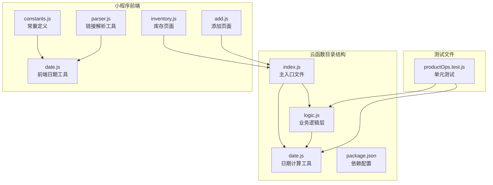
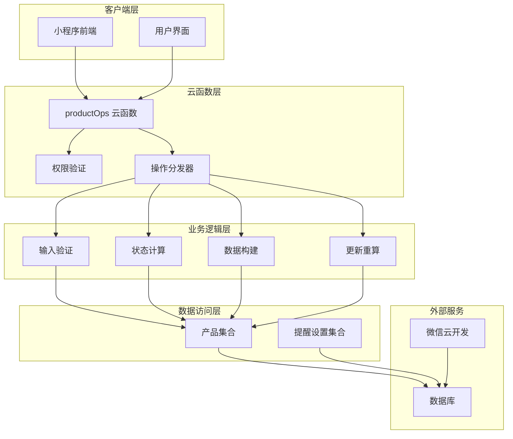
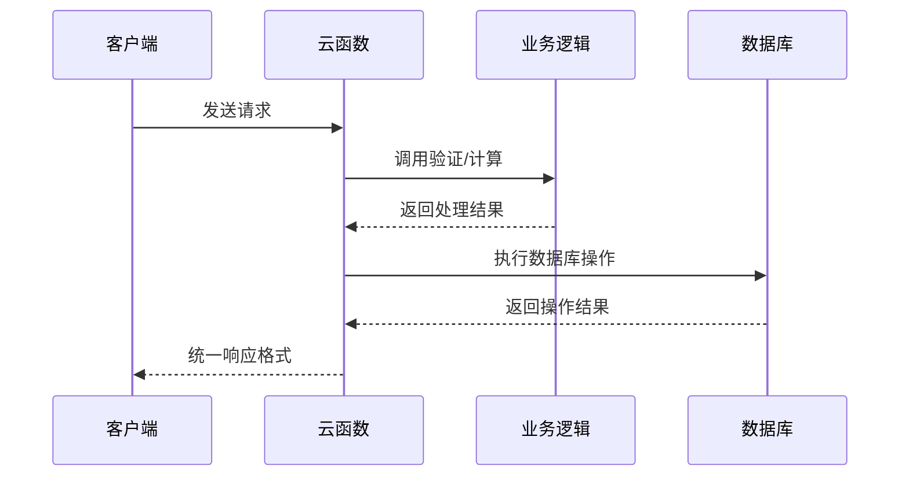
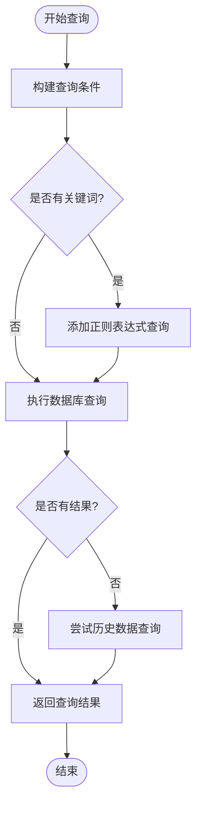
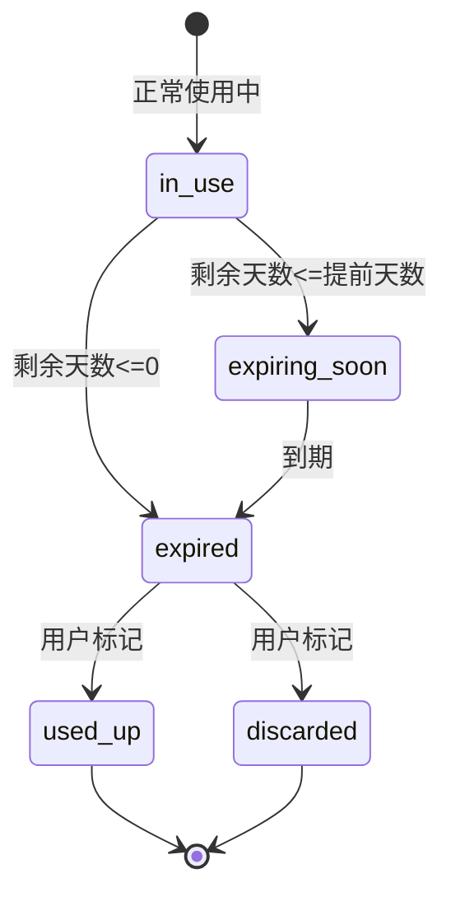
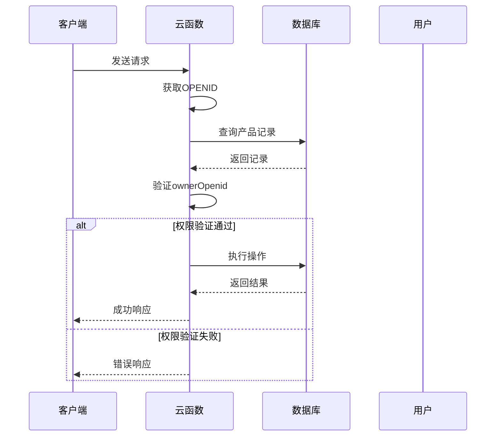
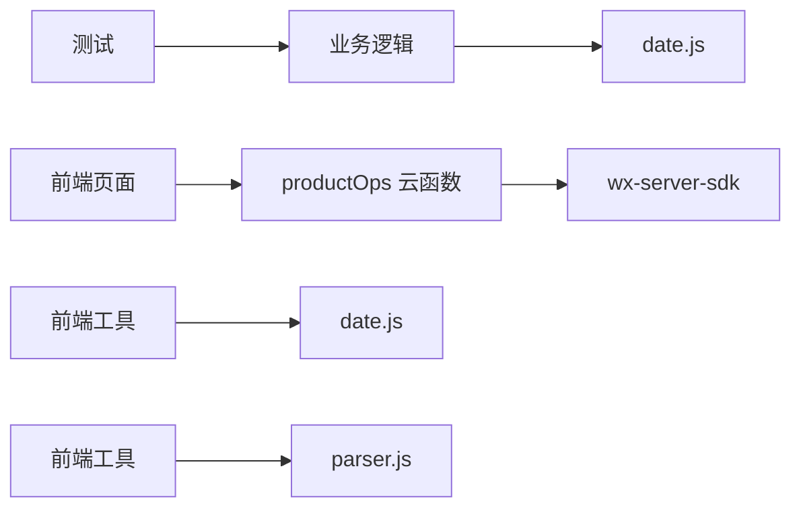
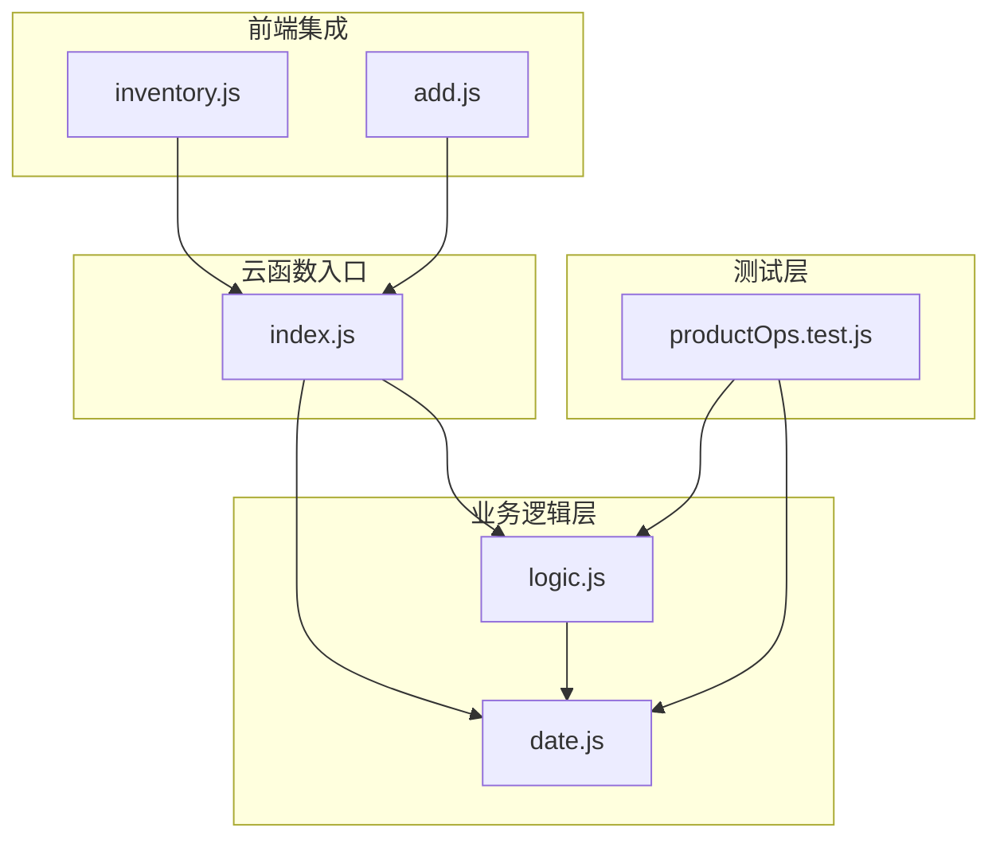

# 产品操作API

<cite>
**本文档引用的文件**
- [index.js](file://cloudfunctions/productOps/index.js)
- [logic.js](file://cloudfunctions/productOps/logic.js)
- [date.js](file://cloudfunctions/productOps/date.js)
- [package.json](file://cloudfunctions/productOps/package.json)
- [productOps.test.js](file://tests/productOps.test.js)
- [constants.js](file://miniprogram/utils/constants.js)
- [inventory.js](file://miniprogram/pages/inventory/inventory.js)
- [add.js](file://miniprogram/pages/add/add.js)
- [date.js](file://miniprogram/utils/date.js)
- [parser.js](file://miniprogram/utils/parser.js)
</cite>

## 目录
1. [简介](#简介)
2. [项目结构](#项目结构)
3. [核心组件](#核心组件)
4. [架构概览](#架构概览)
5. [详细组件分析](#详细组件分析)
6. [依赖关系分析](#依赖关系分析)
7. [性能考虑](#性能考虑)
8. [故障排除指南](#故障排除指南)
9. [结论](#结论)

## 简介

产品操作云函数是微信小程序"产品保质期管理系统"的核心后端服务，提供完整的产品生命周期管理功能。该系统允许用户添加、查询、更新和删除个人产品信息，支持过期提醒、状态管理和智能分类功能。

该API基于微信云开发平台构建，采用云函数架构，提供RESTful风格的接口设计，支持多种操作模式包括手动录入和链接导入两种产品添加方式。

## 项目结构

产品操作云函数位于`cloudfunctions/productOps/`目录下，采用模块化设计，将业务逻辑与云函数入口分离：



**图表来源**
- [index.js:1-171](file://cloudfunctions/productOps/index.js#L1-L171)
- [logic.js:1-105](file://cloudfunctions/productOps/logic.js#L1-L105)
- [date.js:1-77](file://cloudfunctions/productOps/date.js#L1-L77)

**章节来源**
- [index.js:1-171](file://cloudfunctions/productOps/index.js#L1-L171)
- [package.json:1-9](file://cloudfunctions/productOps/package.json#L1-L9)

## 核心组件

### 云函数入口组件

云函数入口文件负责接收客户端请求、进行权限验证和路由分发到具体操作函数。

**主要功能特性：**
- 微信开放平台身份认证
- 请求参数解析和验证
- 操作类型分发
- 错误处理和异常捕获
- 数据库操作封装

**章节来源**
- [index.js:40-64](file://cloudfunctions/productOps/index.js#L40-L64)

### 业务逻辑组件

业务逻辑层包含所有纯函数，用于处理产品数据的验证、计算和转换。

**核心逻辑函数：**
- 输入验证函数
- 状态计算函数  
- 数据构建函数
- 更新重算函数

**章节来源**
- [logic.js:11-17](file://cloudfunctions/productOps/logic.js#L11-L17)
- [logic.js:23-29](file://cloudfunctions/productOps/logic.js#L23-L29)
- [logic.js:45-71](file://cloudfunctions/productOps/logic.js#L45-L71)
- [logic.js:77-96](file://cloudfunctions/productOps/logic.js#L77-L96)

### 日期计算组件

专门处理产品过期日期计算和状态判断的工具模块。

**计算规则：**
- 月末日期溢出处理
- 未开封和开封双重过期时间计算
- 剩余天数精确计算
- 状态智能判定

**章节来源**
- [date.js:26-37](file://cloudfunctions/productOps/date.js#L26-L37)
- [date.js:43-49](file://cloudfunctions/productOps/date.js#L43-L49)
- [date.js:54-58](file://cloudfunctions/productOps/date.js#L54-L58)

## 架构概览

产品操作API采用分层架构设计，确保职责分离和代码可维护性：



**图表来源**
- [index.js:5-11](file://cloudfunctions/productOps/index.js#L5-L11)
- [index.js:40-64](file://cloudfunctions/productOps/index.js#L40-L64)
- [logic.js:5-6](file://cloudfunctions/productOps/logic.js#L5-L6)

## 详细组件分析

### API操作接口规范

#### 通用响应格式

所有API操作都遵循统一的响应格式：



**图表来源**
- [index.js:40-64](file://cloudfunctions/productOps/index.js#L40-L64)
- [index.js:75-90](file://cloudfunctions/productOps/index.js#L75-L90)

#### 添加产品 (add) 操作

**请求参数：**
- `action`: 必填，固定值为 "add"
- `name`: 必填，产品名称，不能为空
- `category`: 必填，产品分类，不能为空
- `productionDate`: 必填，生产日期，格式为YYYY-MM-DD
- `shelfLifeMonths`: 必填，保质期（月），必须大于0
- `brand`: 可选，品牌信息
- `specification`: 可选，规格信息
- `imageUrl`: 可选，产品图片URL
- `sourceLink`: 可选，来源链接
- `openedDate`: 可选，开封日期
- `openedShelfLifeMonths`: 可选，开封后保质期（月）

**数据验证规则：**
- 产品名称必须存在且非空
- 分类必须存在且非空
- 生产日期必须存在
- 保质期必须为正数
- 可选字段进行适当的格式处理

**响应格式：**
```javascript
{
  success: true,
  data: {
    _id: "产品唯一标识",
    name: "产品名称",
    category: "分类",
    productionDate: "YYYY-MM-DD",
    shelfLifeMonths: 月份数,
    expirationDate: "过期日期",
    status: "产品状态",
    createdAt: "创建时间",
    updatedAt: "更新时间"
  }
}
```

**错误处理：**
- 输入验证失败：返回错误信息字符串
- 数据库操作异常：捕获并返回错误消息

**章节来源**
- [index.js:75-90](file://cloudfunctions/productOps/index.js#L75-L90)
- [logic.js:11-17](file://cloudfunctions/productOps/logic.js#L11-L17)
- [logic.js:45-71](file://cloudfunctions/productOps/logic.js#L45-L71)

#### 获取产品列表 (list) 操作

**请求参数：**
- `action`: 必填，固定值为 "list"
- `category`: 可选，按分类筛选
- `status`: 可选，按状态筛选
- `keyword`: 可选，按名称关键词搜索
- `page`: 可选，默认1，当前页码
- `pageSize`: 可选，默认20，每页数量

**查询逻辑：**
- 支持多条件组合查询
- 关键词搜索使用正则表达式（大小写不敏感）
- 自动处理历史数据兼容性（支持旧版字段）

**响应格式：**
```javascript
{
  success: true,
  data: {
    list: [/* 产品数组 */],
    total: 总记录数,
    page: 当前页码,
    pageSize: 每页数量
  }
}
```

**分页查询实现：**


**图表来源**
- [index.js:92-110](file://cloudfunctions/productOps/index.js#L92-L110)

**章节来源**
- [index.js:92-110](file://cloudfunctions/productOps/index.js#L92-L110)

#### 获取单个产品 (get) 操作

**请求参数：**
- `_id`: 必填，产品文档ID

**权限验证：**
- 验证产品归属权，确保用户只能访问自己的产品
- 检查ownerOpenid或_openid字段

**响应格式：**
```javascript
{
  success: true,
  data: {
    // 产品完整信息
  }
}
```

**错误处理：**
- 缺少产品ID：返回明确的错误信息
- 权限不足：返回"无权访问"错误

**章节来源**
- [index.js:112-121](file://cloudfunctions/productOps/index.js#L112-L121)

#### 更新产品 (update) 操作

**请求参数：**
- `_id`: 必填，产品文档ID
- 其他字段：可选，要更新的产品字段

**更新逻辑：**
- 支持部分字段更新
- 自动重算过期时间和状态
- 保持createdAt不变，更新updatedAt

**重算规则：**
当以下字段发生变化时自动重算：
- productionDate
- shelfLifeMonths  
- openedDate
- openedShelfLifeMonths

**响应格式：**
```javascript
{
  success: true,
  data: {
    _id: "更新后的文档ID",
    // 更新后的字段
  }
}
```

**章节来源**
- [index.js:123-139](file://cloudfunctions/productOps/index.js#L123-L139)
- [logic.js:77-96](file://cloudfunctions/productOps/logic.js#L77-L96)

#### 更新产品状态 (updateStatus) 操作

**请求参数：**
- `_id`: 必填，产品文档ID
- `status`: 必填，目标状态

**允许的状态值：**
- `used_up`: 已用完
- `discarded`: 已丢弃

**状态限制：**
- 不允许直接设置为`in_use`、`expiring_soon`、`expired`
- 必须通过重算逻辑自动确定

**响应格式：**
```javascript
{
  success: true
}
```

**章节来源**
- [index.js:141-157](file://cloudfunctions/productOps/index.js#L141-L157)
- [logic.js:23-29](file://cloudfunctions/productOps/logic.js#L23-L29)

#### 删除产品 (delete) 操作

**请求参数：**
- `_id`: 必填，产品文档ID

**权限验证：**
- 同样进行所有权验证
- 确保用户只能删除自己的产品

**响应格式：**
```javascript
{
  success: true
}
```

**章节来源**
- [index.js:159-170](file://cloudfunctions/productOps/index.js#L159-L170)

### 数据模型和状态管理

#### 产品状态枚举



**状态计算规则：**
- `in_use`: 剩余天数 > 提前天数
- `expiring_soon`: 0 < 剩余天数 <= 提前天数  
- `expired`: 剩余天数 <= 0
- `used_up`/`discarded`: 用户手动标记

**章节来源**
- [constants.js:6-12](file://miniprogram/utils/constants.js#L6-L12)
- [logic.js:34-40](file://cloudfunctions/productOps/logic.js#L34-L40)

#### 产品字段定义

| 字段名 | 类型 | 必填 | 描述 | 默认值 |
|--------|------|------|------|--------|
| name | string | 是 | 产品名称 | - |
| brand | string | 否 | 品牌 | 空字符串 |
| category | string | 是 | 分类 | - |
| specification | string | 否 | 规格 | 空字符串 |
| productionDate | string(date) | 是 | 生产日期 | - |
| shelfLifeMonths | number | 是 | 保质期(月) | - |
| expirationDate | string(date) | 否 | 过期日期 | 自动生成 |
| status | enum | 否 | 产品状态 | 自动生成 |
| openedDate | string(date) | 否 | 开封日期 | null |
| openedShelfLifeMonths | number | 否 | 开封后保质期(月) | null |
| imageUrl | string | 否 | 图片URL | 空字符串 |
| sourceLink | string | 否 | 来源链接 | 空字符串 |
| ownerOpenid | string | 否 | 所有者标识 | 自动设置 |
| createdAt | string(datetime) | 否 | 创建时间 | 自动设置 |
| updatedAt | string(datetime) | 否 | 更新时间 | 自动设置 |

**章节来源**
- [logic.js:55-70](file://cloudfunctions/productOps/logic.js#L55-L70)

### 权限验证机制

系统采用基于微信OPENID的权限控制：



**图表来源**
- [index.js:41](file://cloudfunctions/productOps/index.js#L41)
- [index.js:117-119](file://cloudfunctions/productOps/index.js#L117-L119)

**章节来源**
- [index.js:21-23](file://cloudfunctions/productOps/index.js#L21-L23)
- [index.js:117-119](file://cloudfunctions/productOps/index.js#L117-L119)

## 依赖关系分析

### 外部依赖



**图表来源**
- [package.json:5-7](file://cloudfunctions/productOps/package.json#L5-L7)
- [logic.js:5](file://cloudfunctions/productOps/logic.js#L5)

### 内部模块依赖



**图表来源**
- [index.js:13-19](file://cloudfunctions/productOps/index.js#L13-L19)
- [logic.js:5](file://cloudfunctions/productOps/logic.js#L5)

**章节来源**
- [package.json:1-9](file://cloudfunctions/productOps/package.json#L1-L9)

## 性能考虑

### 数据库查询优化

1. **索引策略建议：**
   - 在`ownerOpenid`字段建立索引
   - 在`category`字段建立索引
   - 在`status`字段建立索引
   - 在`name`字段建立全文索引（正则查询）

2. **查询优化：**
   - 使用投影减少数据传输
   - 合理使用分页避免全量查询
   - 避免不必要的字段选择

### 业务逻辑优化

1. **状态计算缓存：**
   - 对于频繁查询的计算结果可以考虑缓存
   - 减少重复的日期计算开销

2. **批量操作：**
   - 支持批量删除和批量状态更新
   - 减少网络往返次数

## 故障排除指南

### 常见错误及解决方案

| 错误类型 | 错误码 | 描述 | 解决方案 |
|----------|--------|------|----------|
| 输入验证错误 | 400 | 必填字段缺失或格式不正确 | 检查请求参数完整性 |
| 权限验证失败 | 403 | 无权访问目标资源 | 确认用户登录状态 |
| 数据库操作异常 | 500 | 数据库连接或操作失败 | 检查云开发配置 |
| 云函数超时 | 504 | 云函数执行超时 | 优化查询逻辑或增加超时时间 |

### 调试技巧

1. **日志记录：**
   - 在关键节点添加调试日志
   - 记录请求参数和响应结果
   - 监控数据库查询性能

2. **测试覆盖：**
   - 单元测试覆盖所有边界情况
   - 集成测试验证完整流程
   - 性能测试评估系统负载

**章节来源**
- [productOps.test.js:13-46](file://tests/productOps.test.js#L13-L46)
- [productOps.test.js:48-68](file://tests/productOps.test.js#L48-L68)

## 结论

产品操作API提供了完整的产品生命周期管理解决方案，具有以下特点：

**技术优势：**
- 清晰的分层架构设计
- 完善的输入验证和错误处理
- 智能的状态计算和重算机制
- 支持多种查询和筛选方式

**功能特色：**
- 支持手动录入和链接导入两种添加方式
- 智能过期提醒和状态管理
- 完整的CRUD操作支持
- 用户友好的分页查询体验

**扩展建议：**
- 添加批量操作功能
- 增加数据导出功能
- 优化移动端用户体验
- 增强数据统计和分析能力

该API为微信小程序产品保质期管理提供了稳定可靠的技术基础，能够满足用户日常使用需求并具备良好的扩展性。