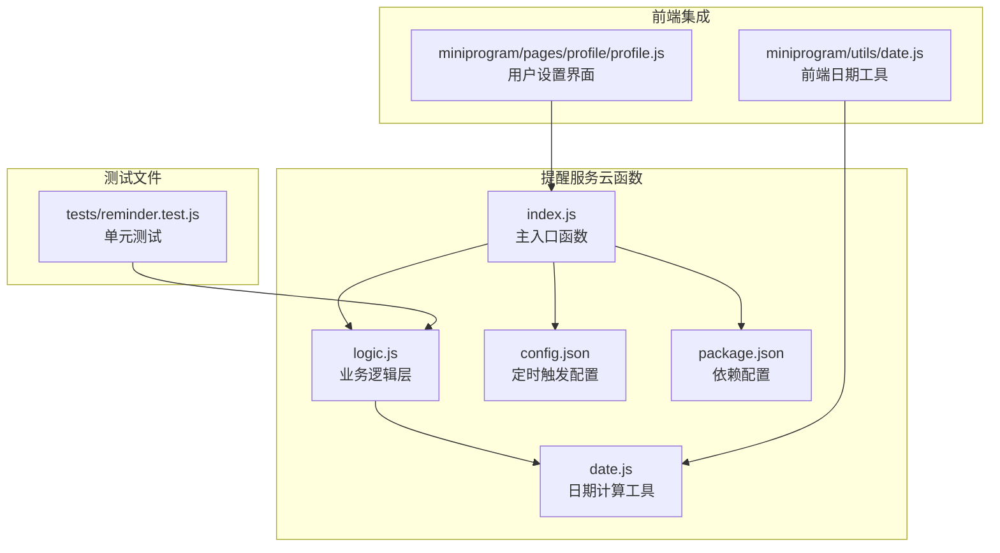
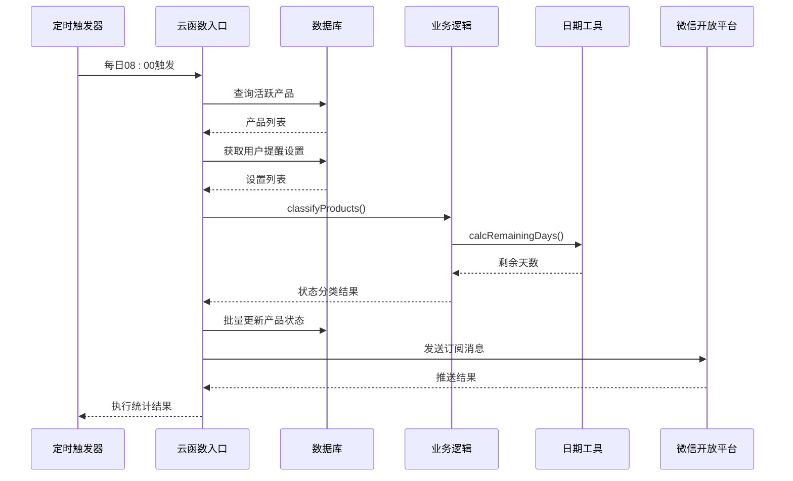
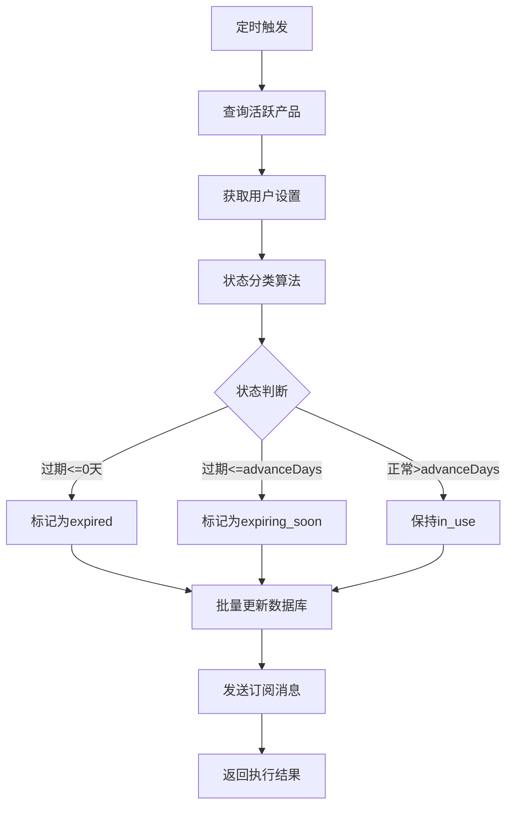
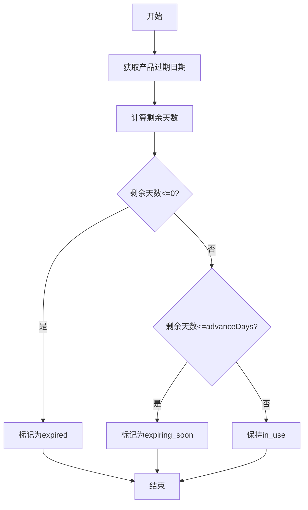
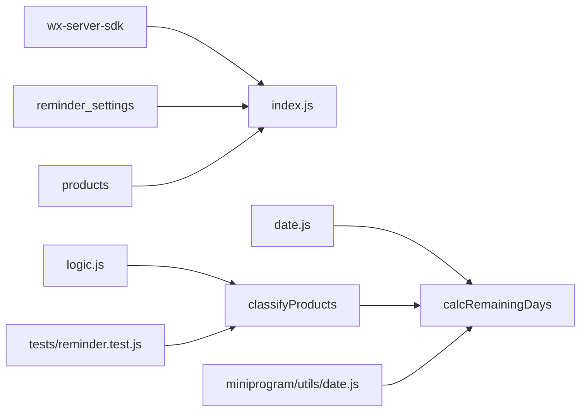

# 提醒服务API

<cite>
**本文档引用的文件**
- [cloudfunctions/reminder/index.js](file://cloudfunctions/reminder/index.js)
- [cloudfunctions/reminder/logic.js](file://cloudfunctions/reminder/logic.js)
- [cloudfunctions/reminder/date.js](file://cloudfunctions/reminder/date.js)
- [cloudfunctions/reminder/config.json](file://cloudfunctions/reminder/config.json)
- [cloudfunctions/reminder/package.json](file://cloudfunctions/reminder/package.json)
- [tests/reminder.test.js](file://tests/reminder.test.js)
- [miniprogram/utils/date.js](file://miniprogram/utils/date.js)
- [miniprogram/pages/profile/profile.js](file://miniprogram/pages/profile/profile.js)
</cite>

## 目录
1. [简介](#简介)
2. [项目结构](#项目结构)
3. [核心组件](#核心组件)
4. [架构概览](#架构概览)
5. [详细组件分析](#详细组件分析)
6. [依赖关系分析](#依赖关系分析)
7. [性能考虑](#性能考虑)
8. [故障排除指南](#故障排除指南)
9. [结论](#结论)

## 简介

提醒服务是一个基于微信云开发的定时提醒云函数，专门用于监控和管理产品的过期状态。该服务通过每日定时执行，自动检测即将过期的产品，更新其状态，并向用户发送订阅消息提醒。

该系统的核心功能包括：
- **定时提醒机制**：每天08:00自动执行，检查所有活跃产品的过期状态
- **智能过期检测**：根据用户自定义的提醒天数和产品实际过期时间进行判断
- **批量状态更新**：自动将过期产品标记为`expired`，即将过期产品标记为`expiring_soon`
- **用户通知推送**：向开启推送权限的用户发送订阅消息提醒
- **个性化提醒设置**：支持每个用户独立设置提醒天数和推送偏好

## 项目结构

提醒服务位于`cloudfunctions/reminder/`目录下，采用模块化设计，包含以下核心文件：

**图表来源**
- [cloudfunctions/reminder/index.js:1-106](file://cloudfunctions/reminder/index.js#L1-L106)
- [cloudfunctions/reminder/logic.js:1-45](file://cloudfunctions/reminder/logic.js#L1-L45)
- [cloudfunctions/reminder/date.js:1-77](file://cloudfunctions/reminder/date.js#L1-L77)

**章节来源**
- [cloudfunctions/reminder/index.js:1-106](file://cloudfunctions/reminder/index.js#L1-L106)
- [cloudfunctions/reminder/config.json:1-9](file://cloudfunctions/reminder/config.json#L1-L9)

## 核心组件

### 主入口函数 (index.js)

主入口函数是整个提醒服务的核心控制器，负责协调各个组件的工作流程。它实现了完整的定时提醒生命周期：

1. **环境初始化**：使用微信云开发SDK初始化运行环境
2. **数据查询**：获取所有活跃产品（状态为`in_use`或`expiring_soon`）
3. **用户设置获取**：查询相关用户的提醒偏好设置
4. **状态分类**：调用业务逻辑对产品进行过期状态分类
5. **批量更新**：更新数据库中产品的状态
6. **通知推送**：向有权限的用户发送订阅消息

### 业务逻辑层 (logic.js)

业务逻辑层实现了纯函数式的过期状态判断算法，具有以下特点：
- **纯函数设计**：不依赖外部SDK，便于单元测试
- **个性化算法**：支持每个用户独立的提醒天数设置
- **默认值处理**：当用户没有设置时使用30天作为默认提醒天数
- **状态跳过优化**：避免重复更新相同状态的产品

### 日期计算工具 (date.js)

提供了完整的日期计算功能，包括：
- **月份加法**：正确处理月末溢出问题（如1月31日+1月=2月28/29日）
- **过期日期计算**：综合考虑未开封和开封后的过期时间
- **剩余天数计算**：精确计算距离过期的天数
- **格式化工具**：统一日期格式处理

**章节来源**
- [cloudfunctions/reminder/index.js:15-105](file://cloudfunctions/reminder/index.js#L15-L105)
- [cloudfunctions/reminder/logic.js:17-40](file://cloudfunctions/reminder/logic.js#L17-L40)
- [cloudfunctions/reminder/date.js:11-49](file://cloudfunctions/reminder/date.js#L11-L49)

## 架构概览

提醒服务采用分层架构设计，确保了良好的可维护性和扩展性：

**图表来源**
- [cloudfunctions/reminder/index.js:15-105](file://cloudfunctions/reminder/index.js#L15-L105)
- [cloudfunctions/reminder/logic.js:17-40](file://cloudfunctions/reminder/logic.js#L17-L40)

### 数据流图

**图表来源**
- [cloudfunctions/reminder/logic.js:17-40](file://cloudfunctions/reminder/logic.js#L17-L40)
- [cloudfunctions/reminder/index.js:54-94](file://cloudfunctions/reminder/index.js#L54-L94)

## 详细组件分析

### 过期检测算法

过期检测算法是提醒服务的核心，采用了双层判断机制：

#### 算法流程

#### 关键特性

1. **精确时间计算**：使用`calcRemainingDays`函数精确计算剩余天数
2. **用户个性化**：每个用户可以设置不同的提醒天数
3. **状态跳过优化**：避免对已经是目标状态的产品进行重复更新
4. **默认值保护**：当用户没有设置时，默认使用30天提醒

**图表来源**
- [cloudfunctions/reminder/logic.js:21-37](file://cloudfunctions/reminder/logic.js#L21-L37)

### 定时任务配置

提醒服务通过云开发的定时触发器实现自动化执行：

#### 触发器配置

| 参数 | 值 | 描述 |
|------|-----|------|
| 名称 | dailyReminder | 触发器标识符 |
| 类型 | timer | 定时触发器 |
| 配置 | 0 0 8 * * * * | 每天08:00执行 |

#### Cron表达式解析

Cron表达式`0 0 8 * * * *`表示：
- 秒：0
- 分钟：0  
- 小时：8
- 日期：*（每天）
- 月份：*（每月）
- 星期：*（每周）
- 年份：*（每年）

**章节来源**
- [cloudfunctions/reminder/config.json:1-9](file://cloudfunctions/reminder/config.json#L1-L9)

### 批量提醒处理流程

批量处理流程确保了高效的数据更新和通知发送：

#### 处理步骤

1. **产品筛选**：从数据库查询状态为`in_use`或`expiring_soon`的产品
2. **用户去重**：提取所有相关用户的唯一标识
3. **设置获取**：批量查询用户的提醒偏好设置
4. **状态分类**：根据算法对产品进行状态分类
5. **批量更新**：使用循环方式批量更新数据库状态
6. **通知发送**：向有权限的用户发送订阅消息

#### 性能优化

- **限制查询数量**：使用`limit(1000)`防止大量数据查询
- **批量操作**：减少数据库往返次数
- **异步处理**：使用`await`确保操作顺序

**章节来源**
- [cloudfunctions/reminder/index.js:19-94](file://cloudfunctions/reminder/index.js#L19-L94)

### 通知推送机制

通知推送采用微信订阅消息API实现：

#### 推送条件

1. **用户授权**：用户必须开启推送权限（`enablePush: true`）
2. **状态变更**：产品状态发生过期或即将过期的变化
3. **模板配置**：需要在微信公众平台配置订阅消息模板

#### 推送内容

| 字段 | 值 | 说明 |
|------|-----|------|
| 模板ID | TEMPLATE_ID_PLACEHOLDER | 需要在微信公众平台申请 |
| 页面路径 | `/pages/home/home` | 用户点击消息跳转页面 |
| 动态数据 | 用户警告数量和日期 | 实际推送时会替换具体值 |

#### 错误处理

推送失败会被静默忽略，不会影响整体执行流程，确保系统的稳定性。

**章节来源**
- [cloudfunctions/reminder/index.js:72-94](file://cloudfunctions/reminder/index.js#L72-L94)

### 用户偏好设置

用户偏好设置存储在`reminder_settings`集合中，包含以下字段：

#### 设置字段

| 字段名 | 类型 | 默认值 | 描述 |
|--------|------|--------|------|
| advanceDays | Number | 30 | 提前提醒天数 |
| enablePush | Boolean | false | 是否启用推送 |
| pushFrequency | String | 'daily' | 推送频率 |

#### 设置管理

用户可以通过个人中心页面管理自己的提醒偏好：
- **提醒天数**：设置从过期到提醒的天数
- **推送开关**：控制是否接收订阅消息
- **推送频率**：当前版本固定为每日推送

**章节来源**
- [miniprogram/pages/profile/profile.js:57-106](file://miniprogram/pages/profile/profile.js#L57-L106)

## 依赖关系分析

提醒服务的依赖关系清晰明确，遵循单一职责原则：

**图表来源**
- [cloudfunctions/reminder/package.json:5-7](file://cloudfunctions/reminder/package.json#L5-L7)
- [cloudfunctions/reminder/index.js:8](file://cloudfunctions/reminder/index.js#L8)

### 外部依赖

| 依赖包 | 版本 | 用途 |
|--------|------|------|
| wx-server-sdk | ~2.6.3 | 微信云开发SDK |
| jest | ^30.3.0 | 单元测试框架 |

### 内部依赖

- **index.js** 依赖 **logic.js** 和 **date.js**
- **logic.js** 依赖 **date.js** 中的日期计算函数
- **测试文件** 依赖 **logic.js** 的纯函数接口

**章节来源**
- [cloudfunctions/reminder/package.json:1-9](file://cloudfunctions/reminder/package.json#L1-L9)
- [cloudfunctions/reminder/index.js:8-9](file://cloudfunctions/reminder/index.js#L8-L9)

## 性能考虑

### 查询优化

1. **索引利用**：建议在`products`集合的`status`字段建立索引
2. **查询限制**：使用`limit(1000)`防止大数据集查询
3. **批量操作**：减少数据库连接次数

### 内存管理

1. **对象复用**：合理使用JavaScript对象，避免内存泄漏
2. **数组过滤**：使用`filter`和`map`进行数据转换
3. **异步处理**：使用`async/await`避免回调地狱

### 扩展性设计

1. **模块化**：清晰的模块分离便于功能扩展
2. **配置化**：通过配置文件管理定时任务
3. **测试覆盖**：完善的单元测试确保代码质量

## 故障排除指南

### 常见问题及解决方案

#### 1. 云函数执行超时

**症状**：云函数执行超过最大时间限制
**原因**：查询到的产品数量过多
**解决方案**：
- 检查数据库中活跃产品的数量
- 调整查询条件或增加分页
- 优化数据库索引

#### 2. 订阅消息发送失败

**症状**：推送权限用户未收到消息
**原因**：用户取消了推送授权或模板配置错误
**解决方案**：
- 检查用户`enablePush`设置
- 验证订阅消息模板ID
- 查看微信开放平台的推送记录

#### 3. 状态更新异常

**症状**：产品状态未按预期更新
**原因**：过期检测算法计算错误
**解决方案**：
- 检查`calcRemainingDays`函数的日期计算
- 验证用户设置中的`advanceDays`值
- 查看测试用例验证算法正确性

#### 4. 数据库查询错误

**症状**：云函数抛出数据库查询异常
**原因**：权限不足或集合不存在
**解决方案**：
- 检查云开发数据库的权限配置
- 确认`reminder_settings`和`products`集合存在
- 验证集合的访问权限

**章节来源**
- [cloudfunctions/reminder/index.js:102-104](file://cloudfunctions/reminder/index.js#L102-L104)

### 调试技巧

1. **日志输出**：在关键节点添加console.log输出
2. **单元测试**：运行测试套件验证业务逻辑
3. **数据库检查**：直接查询数据库验证数据状态
4. **权限验证**：确认云函数执行权限

## 结论

提醒服务云函数是一个设计精良的定时提醒系统，具有以下优势：

### 技术优势

1. **模块化设计**：清晰的分层架构便于维护和扩展
2. **算法优化**：高效的过期检测算法和批量处理机制
3. **用户体验**：个性化的提醒设置和及时的通知推送
4. **可靠性**：完善的错误处理和性能优化

### 功能完整性

- 支持多用户个性化提醒
- 提供灵活的提醒天数设置
- 实现智能的状态分类和更新
- 集成微信订阅消息推送
- 具备完整的测试覆盖

### 扩展建议

1. **推送频率控制**：支持更灵活的推送频率设置
2. **通知渠道扩展**：支持多种通知渠道（短信、邮件等）
3. **批量处理优化**：支持更大规模的数据处理
4. **监控告警**：添加执行状态监控和异常告警

该提醒服务为用户提供了可靠的过期产品管理解决方案，通过自动化的方式帮助用户及时关注产品状态，避免浪费和健康风险。