# 链接解析API

<cite>
**本文档引用的文件**
- [cloudfunctions/parseLink/index.js](file://cloudfunctions/parseLink/index.js)
- [cloudfunctions/parseLink/logic.js](file://cloudfunctions/parseLink/logic.js)
- [cloudfunctions/parseLink/constants.js](file://cloudfunctions/parseLink/constants.js)
- [cloudfunctions/parseLink/package.json](file://cloudfunctions/parseLink/package.json)
- [miniprogram/utils/parser.js](file://miniprogram/utils/parser.js)
- [miniprogram/pages/add/add.js](file://miniprogram/pages/add/add.js)
- [tests/parseLink.test.js](file://tests/parseLink.test.js)
- [miniprogram/utils/constants.js](file://miniprogram/utils/constants.js)
</cite>

## 目录
1. [简介](#简介)
2. [项目结构](#项目结构)
3. [核心组件](#核心组件)
4. [架构概览](#架构概览)
5. [详细组件分析](#详细组件分析)
6. [依赖关系分析](#依赖关系分析)
7. [性能考虑](#性能考虑)
8. [故障排除指南](#故障排除指南)
9. [结论](#结论)

## 简介

链接解析API是一个基于微信云开发的云函数服务，专门用于解析淘宝、天猫等电商平台的商品链接，提取商品的核心信息。该API提供了完整的链接识别、解析和数据提取功能，支持多种链接格式，包括标准商品链接、短链和淘口令。

该服务采用多层降级策略，确保在各种网络环境下都能提供稳定的解析能力。主要功能包括：
- 支持多种链接格式识别（淘宝、天猫标准链接、短链、淘口令）
- 商品ID提取和验证
- 商品标题抓取和解析
- 品牌识别和规格提取
- 商品分类推断
- 错误处理和降级机制

## 项目结构

该项目采用模块化设计，将链接解析功能分解为多个独立的模块：

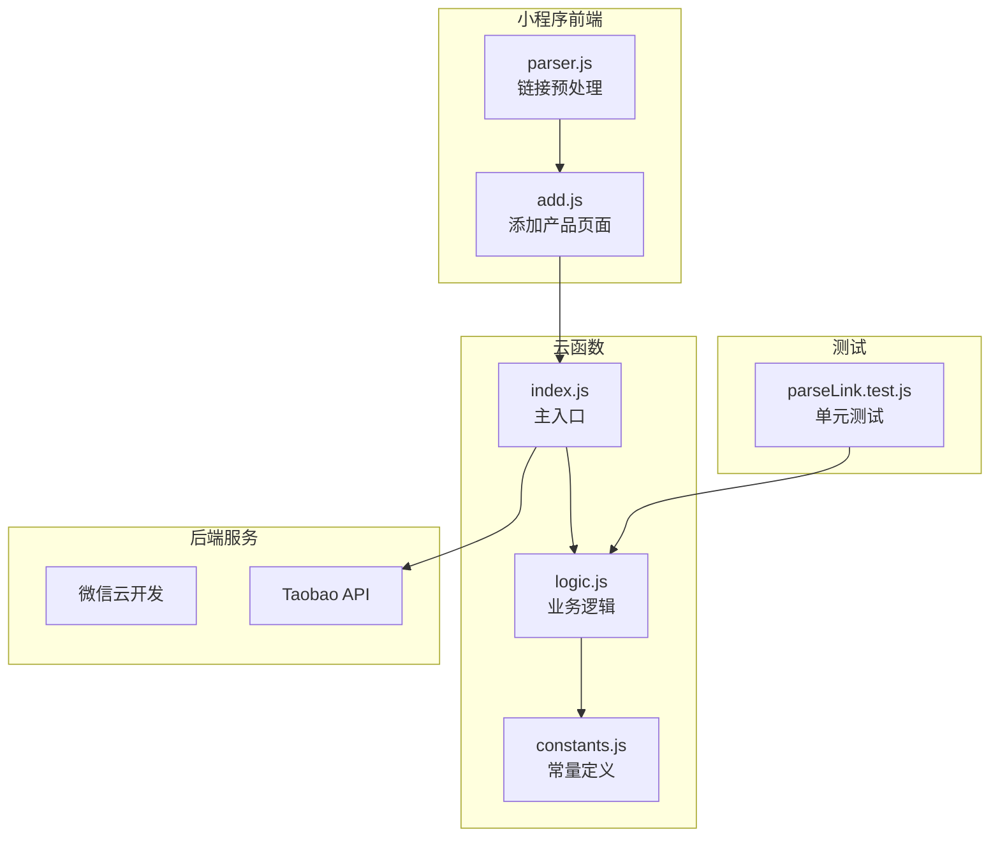

**图表来源**
- [cloudfunctions/parseLink/index.js:1-112](file://cloudfunctions/parseLink/index.js#L1-L112)
- [cloudfunctions/parseLink/logic.js:1-78](file://cloudfunctions/parseLink/logic.js#L1-L78)
- [miniprogram/utils/parser.js:1-70](file://miniprogram/utils/parser.js#L1-L70)

**章节来源**
- [cloudfunctions/parseLink/index.js:1-112](file://cloudfunctions/parseLink/index.js#L1-L112)
- [cloudfunctions/parseLink/logic.js:1-78](file://cloudfunctions/parseLink/logic.js#L1-L78)
- [miniprogram/utils/parser.js:1-70](file://miniprogram/utils/parser.js#L1-L70)

## 核心组件

### 云函数入口 (parseLink)

parseLink云函数是整个链接解析系统的核心入口点，负责处理来自小程序前端的请求。该函数实现了完整的链接解析流程，包括参数验证、链接类型识别、短链解析、商品信息抓取和数据提取。

**主要特性：**
- 支持三种链接类型：标准淘宝链接、短链、淘口令
- 多层降级策略：API → 页面抓取 → 标题解析
- 完善的错误处理和异常捕获
- 异步处理机制，支持长时间运行的操作

**章节来源**
- [cloudfunctions/parseLink/index.js:11-56](file://cloudfunctions/parseLink/index.js#L11-L56)

### 业务逻辑模块 (logic.js)

logic.js模块包含了链接解析的核心业务逻辑，采用纯函数设计，便于测试和维护。该模块专注于商品信息的提取和处理，不依赖于微信云开发SDK。

**核心功能：**
- 商品ID提取：从URL中提取商品标识符
- 标题解析：提取品牌、规格和商品名称
- 分类推断：根据关键词推断商品类别
- 数据清洗：清理和标准化提取的信息

**章节来源**
- [cloudfunctions/parseLink/logic.js:8-78](file://cloudfunctions/parseLink/logic.js#L8-L78)

### 常量定义模块 (constants.js)

constants.js模块定义了链接解析所需的所有常量和配置，包括品牌列表、分类关键词和匹配规则。由于云函数部署限制，该文件是小程序常量文件的本地副本。

**关键内容：**
- 品牌词库：包含50+个国际和国内知名化妆品品牌
- 分类关键词：涵盖护肤、彩妆、美发、身体护理、香水等类别
- 规格提取规则：支持ml、g、片、支、对等单位
- 品牌匹配算法：优先匹配最长的品牌名称

**章节来源**
- [cloudfunctions/parseLink/constants.js:24-92](file://cloudfunctions/parseLink/constants.js#L24-L92)

### 前端链接预处理 (parser.js)

parser.js模块位于小程序前端，负责在用户输入时进行初步的链接识别和提取。该模块使用正则表达式识别不同类型的链接，并提取有效的URL或淘口令代码。

**识别能力：**
- 标准淘宝链接：item.taobao.com、detail.tmall.com
- 短链：m.tb.cn
- 淘口令：包含¥符号的文本

**章节来源**
- [miniprogram/utils/parser.js:7-25](file://miniprogram/utils/parser.js#L7-L25)

## 架构概览

链接解析系统的整体架构采用了前后端分离的设计模式，确保了良好的可维护性和扩展性：

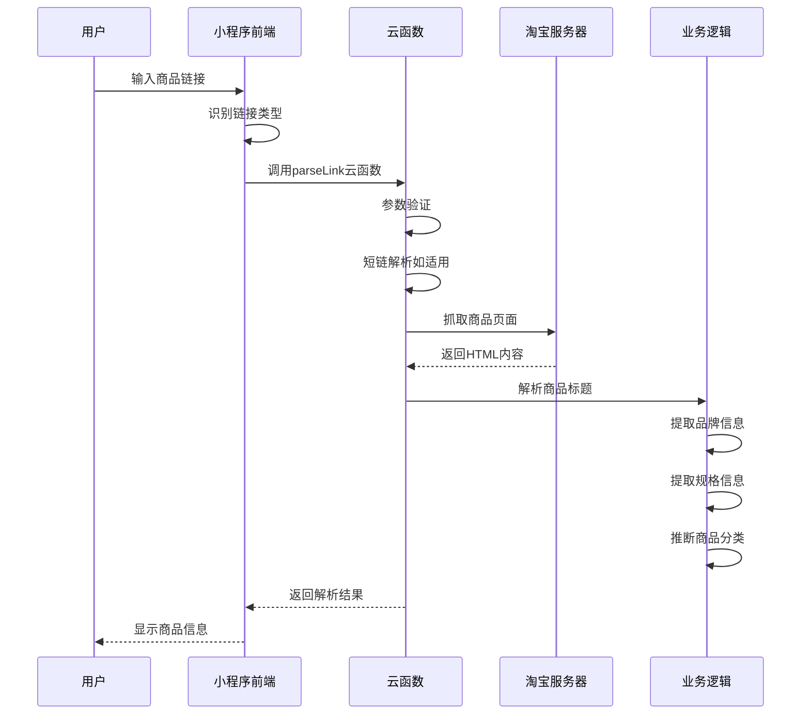

**图表来源**
- [cloudfunctions/parseLink/index.js:11-56](file://cloudfunctions/parseLink/index.js#L11-L56)
- [cloudfunctions/parseLink/logic.js:24-43](file://cloudfunctions/parseLink/logic.js#L24-L43)

### 数据流架构

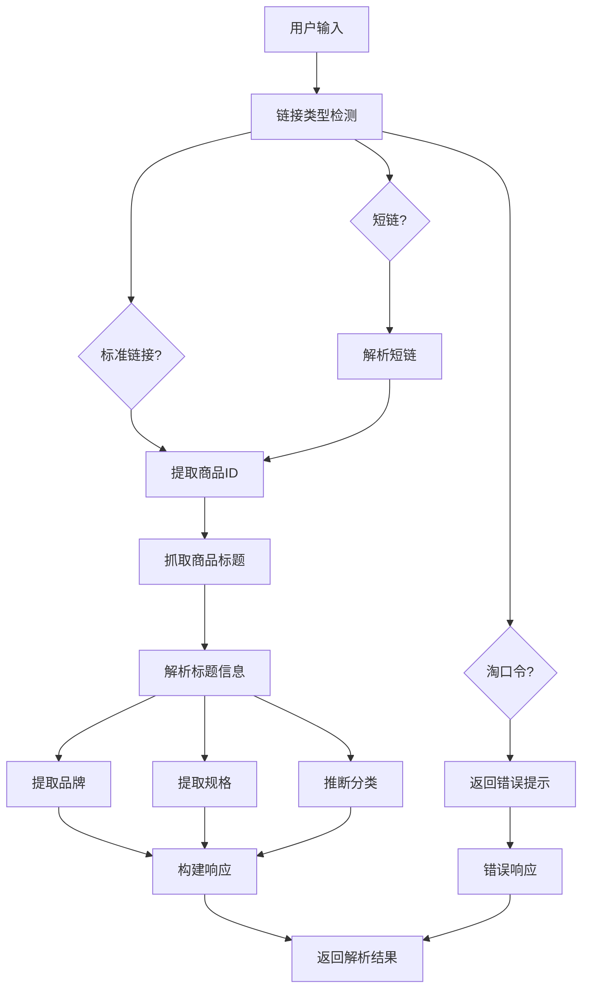

**图表来源**
- [cloudfunctions/parseLink/index.js:18-56](file://cloudfunctions/parseLink/index.js#L18-L56)
- [cloudfunctions/parseLink/logic.js:13-71](file://cloudfunctions/parseLink/logic.js#L13-L71)

## 详细组件分析

### 链接识别与预处理

#### 正则表达式匹配

系统使用精确的正则表达式来识别不同类型的链接：

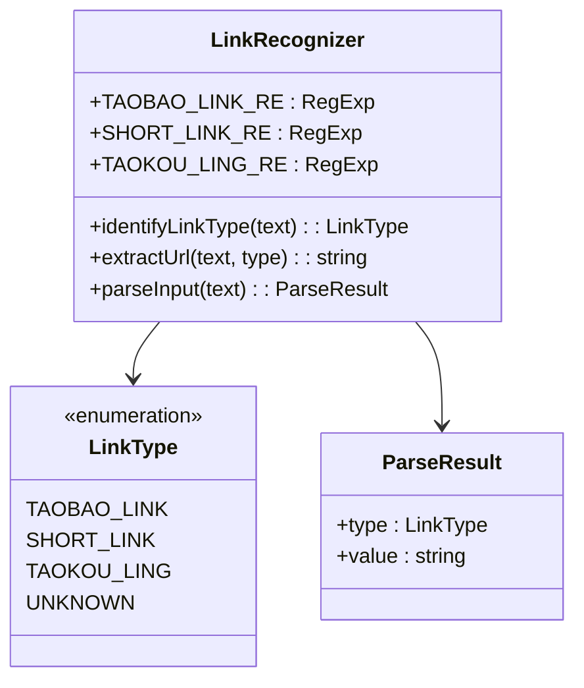

**图表来源**
- [miniprogram/utils/parser.js:7-25](file://miniprogram/utils/parser.js#L7-L25)
- [miniprogram/utils/parser.js:59-63](file://miniprogram/utils/parser.js#L59-L63)

#### 链接类型识别机制

系统支持三种主要的链接类型识别：

1. **标准淘宝链接**：识别 `item.taobao.com` 和 `detail.tmall.com` 的完整URL
2. **短链**：识别 `m.tb.cn` 开头的短链接
3. **淘口令**：识别包含 `¥` 或 `￥` 符号的淘口令文本

**章节来源**
- [miniprogram/utils/parser.js:17-25](file://miniprogram/utils/parser.js#L17-L25)
- [miniprogram/utils/parser.js:33-52](file://miniprogram/utils/parser.js#L33-L52)

### 商品ID提取算法

#### URL标准化与解析

商品ID提取是链接解析的关键步骤，系统通过以下算法实现：

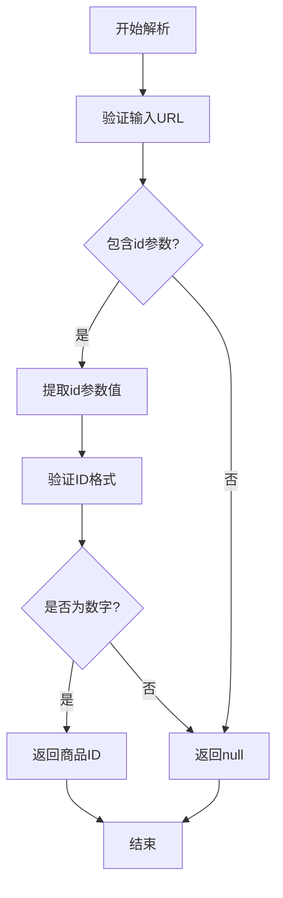

**图表来源**
- [cloudfunctions/parseLink/logic.js:13-17](file://cloudfunctions/parseLink/logic.js#L13-L17)

#### ID提取规则

系统采用灵活的URL解析策略：
- 支持 `?id=123456` 格式
- 支持 `&id=123456&other=abc` 多参数URL
- 自动过滤非数字字符
- 返回第一个匹配的数字ID

**章节来源**
- [cloudfunctions/parseLink/logic.js:13-17](file://cloudfunctions/parseLink/logic.js#L13-L17)

### 商品标题解析与信息提取

#### 品牌识别算法

品牌识别采用最长匹配策略，确保准确识别品牌名称：

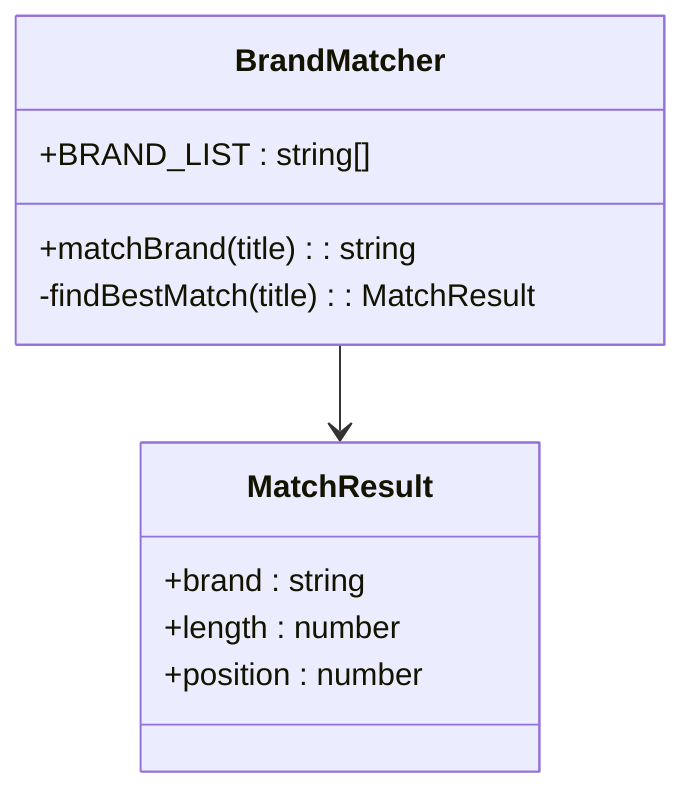

**图表来源**
- [cloudfunctions/parseLink/constants.js:64-79](file://cloudfunctions/parseLink/constants.js#L64-L79)

#### 品牌匹配策略

系统采用以下匹配策略：
- **大小写不敏感**：支持英文品牌的大写/小写组合
- **最长优先**：优先匹配最长的品牌名称，避免部分匹配
- **位置验证**：确保品牌名称在标题中的合理位置
- **性能优化**：一次遍历完成所有品牌匹配

**章节来源**
- [cloudfunctions/parseLink/constants.js:64-79](file://cloudfunctions/parseLink/constants.js#L64-L79)

#### 规格信息提取

规格信息提取采用正则表达式匹配，支持多种单位格式：

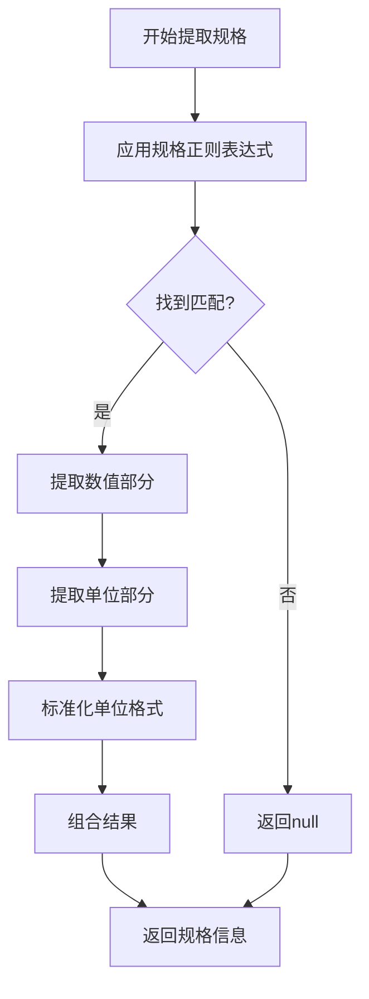

**图表来源**
- [cloudfunctions/parseLink/constants.js:85-92](file://cloudfunctions/parseLink/constants.js#L85-L92)

#### 规格提取规则

规格信息提取遵循以下规则：
- **数值匹配**：支持连续的数字字符
- **单位识别**：支持 `ml`、`g`、`片`、`支`、`对` 等单位
- **格式标准化**：统一单位格式（如 `ml` 转换为小写）
- **空格处理**：自动处理数值和单位之间的空格

**章节来源**
- [cloudfunctions/parseLink/constants.js:85-92](file://cloudfunctions/parseLink/constants.js#L85-L92)

### 商品分类推断

#### 分类关键词映射

系统建立了完整的分类关键词映射表，用于智能推断商品类别：

| 分类 | 关键词示例 |
|------|------------|
| 护肤 | 精华、面霜、水乳、乳液、化妆水、爽肤水、面膜、洁面、卸妆、防晒、眼霜、肌底液、安瓶、原液、保湿、补水、抗皱、美白 |
| 彩妆 | 口红、唇釉、唇膏、粉底、气垫、眼影、睫毛膏、眼线、腮红、高光、修容、蜜粉、散粉、定妆、遮瑕、妆前、哑光、雾面 |
| 美发 | 洗发、护发、发膜、染发、造型、发蜡、发胶、弹力素、护发素 |
| 身体护理 | 身体乳、沐浴、护手霜、磨砂、脱毛、止汗、润肤、身体霜 |
| 香水 | 香水、香氛、淡香、浓香、EDT、EDP、古龙 |

**章节来源**
- [cloudfunctions/parseLink/logic.js:46-71](file://cloudfunctions/parseLink/logic.js#L46-L71)

### 短链解析机制

#### 短链处理策略

系统对短链提供了专门的解析机制：

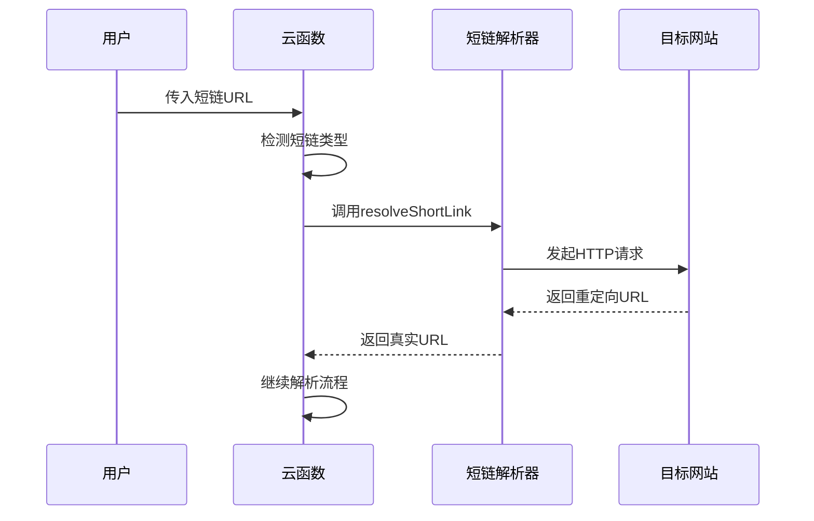

**图表来源**
- [cloudfunctions/parseLink/index.js:61-71](file://cloudfunctions/parseLink/index.js#L61-L71)

#### 短链解析实现

短链解析采用降级策略：
- **首选方案**：调用云托管服务解析短链
- **降级方案**：直接返回null，继续后续解析流程
- **错误处理**：捕获所有异常，确保系统稳定性

**章节来源**
- [cloudfunctions/parseLink/index.js:61-71](file://cloudfunctions/parseLink/index.js#L61-L71)

### 商品页面抓取与标题提取

#### 页面抓取策略

系统采用多阶段的页面抓取策略：

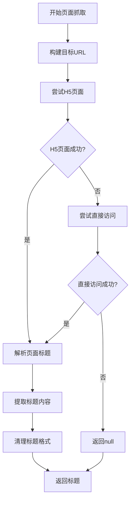

**图表来源**
- [cloudfunctions/parseLink/index.js:77-111](file://cloudfunctions/parseLink/index.js#L77-L111)

#### 抓取实现细节

页面抓取具有以下特点：
- **User-Agent伪装**：使用iPhone浏览器的User-Agent
- **超时控制**：5秒超时限制，防止长时间等待
- **错误处理**：捕获网络异常和超时情况
- **HTML解析**：使用正则表达式提取`<title>`标签内容

**章节来源**
- [cloudfunctions/parseLink/index.js:77-111](file://cloudfunctions/parseLink/index.js#L77-L111)

## 依赖关系分析

### 模块依赖图

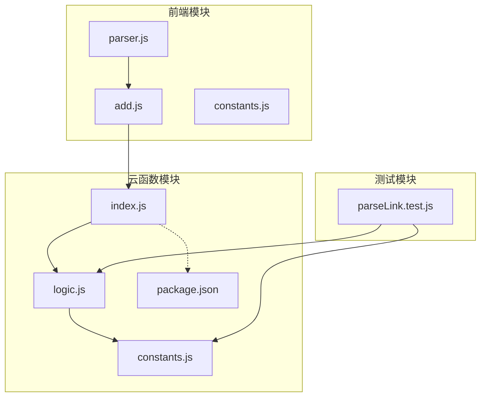

**图表来源**
- [cloudfunctions/parseLink/index.js:6](file://cloudfunctions/parseLink/index.js#L6)
- [cloudfunctions/parseLink/logic.js:6](file://cloudfunctions/parseLink/logic.js#L6)

### 外部依赖

#### 微信云开发SDK

系统依赖微信云开发SDK提供的核心功能：
- **云函数调用**：`wx.cloud.callFunction`
- **数据库操作**：`cloud.database()`
- **环境初始化**：`cloud.init()`
- **上下文获取**：`cloud.getWXContext()`

#### Node.js内置模块

系统使用Node.js标准库进行HTTP请求：
- **http/https模块**：发起HTTP/HTTPS请求
- **Promise封装**：异步操作的现代化处理
- **超时控制**：防止无限等待

**章节来源**
- [cloudfunctions/parseLink/index.js:85-87](file://cloudfunctions/parseLink/index.js#L85-L87)

## 性能考虑

### 内存使用优化

系统在设计时充分考虑了内存使用效率：

1. **纯函数设计**：logic.js模块完全无副作用，便于内存回收
2. **按需加载**：云函数只加载必要的模块和依赖
3. **及时释放**：HTTP请求完成后立即释放资源

### 网络请求优化

#### 超时控制

系统设置了合理的超时限制：
- **页面抓取超时**：5秒，防止长时间阻塞
- **短链解析超时**：根据具体实现设置
- **自动降级**：超时后自动使用备用方案

#### 缓存策略

虽然当前版本未实现缓存，但系统设计支持未来添加缓存机制：
- **商品信息缓存**：缓存解析后的商品信息
- **品牌词库缓存**：缓存品牌匹配结果
- **分类关键词缓存**：缓存分类推断结果

### 并发处理

系统采用异步处理模式，支持并发请求：
- **Promise链式调用**：避免回调地狱
- **错误隔离**：单个请求失败不影响其他请求
- **资源管理**：合理管理网络连接和内存资源

## 故障排除指南

### 常见错误类型

#### 参数验证错误

当缺少必要参数时，系统会返回明确的错误信息：

```javascript
// 错误示例
{
  "error": "缺少必要参数"
}
```

**解决方案：**
- 确保同时提供 `type` 和 `value` 参数
- 检查参数格式是否正确
- 验证链接格式的有效性

#### 短链解析失败

当短链无法解析时：

```javascript
// 错误示例
{
  "error": "短链解析失败"
}
```

**解决方案：**
- 检查短链的有效性
- 确认网络连接正常
- 考虑直接使用标准链接

#### 商品信息获取失败

当无法获取商品信息时：

```javascript
// 错误示例
{
  "error": "无法获取商品信息"
}
```

**解决方案：**
- 检查商品链接的有效性
- 确认商品页面可访问
- 验证网络连接状态

### 错误处理机制

系统实现了多层次的错误处理：

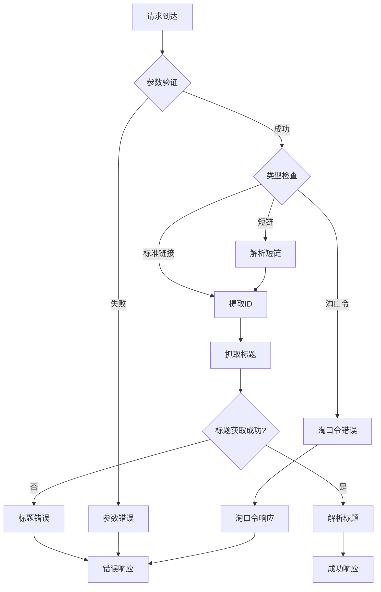

**图表来源**
- [cloudfunctions/parseLink/index.js:14-55](file://cloudfunctions/parseLink/index.js#L14-L55)

### 调试建议

#### 前端调试

在小程序端可以使用以下方法进行调试：
- 检查 `parseInput` 函数的返回值
- 验证云函数调用的参数传递
- 监控网络请求的状态

#### 云函数调试

在云函数端可以：
- 查看微信开发者工具的云函数日志
- 检查网络请求的响应状态
- 验证正则表达式的匹配结果

**章节来源**
- [cloudfunctions/parseLink/index.js:14-55](file://cloudfunctions/parseLink/index.js#L14-L55)

## 结论

链接解析API是一个设计精良的微服务系统，具有以下显著特点：

### 技术优势

1. **模块化设计**：清晰的职责分离，便于维护和扩展
2. **多层降级**：确保在各种网络环境下都能提供稳定服务
3. **完善的错误处理**：全面的异常捕获和用户友好的错误提示
4. **性能优化**：异步处理和资源管理，提高系统响应速度

### 功能完整性

系统提供了完整的链接解析功能，包括：
- 支持多种链接格式识别
- 商品信息的准确提取
- 智能分类推断
- 完善的数据清洗和验证

### 扩展潜力

系统设计具有良好的扩展性：
- 可以轻松添加新的链接格式支持
- 支持自定义品牌词库和分类规则
- 可以集成更多电商平台的API
- 支持缓存机制的实现

该API为微信小程序提供了强大的商品链接解析能力，能够有效提升用户体验，减少手动输入的工作量，是化妆品和个人护理产品管理应用的理想选择。