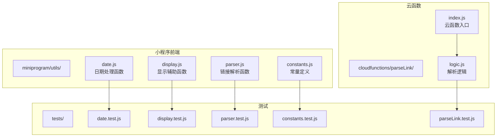
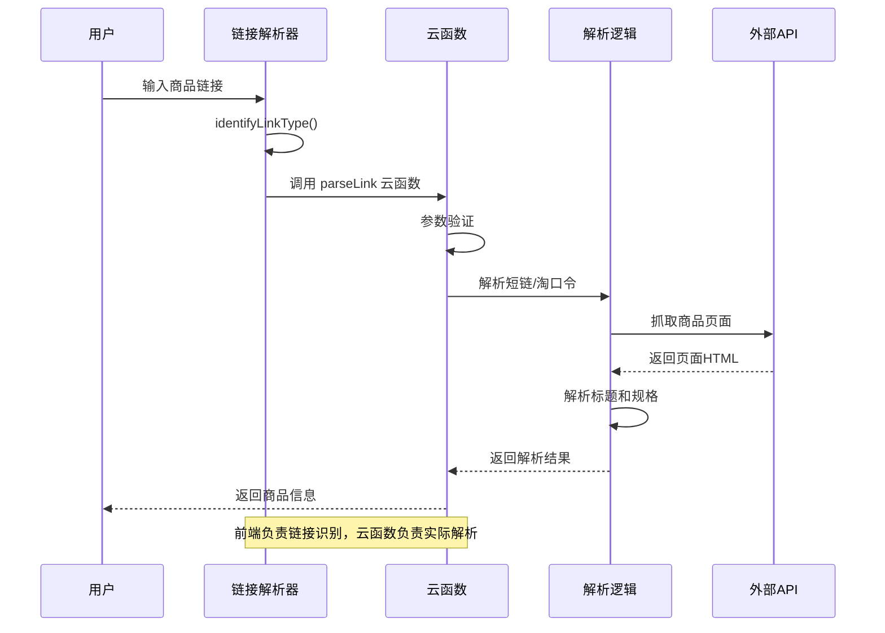
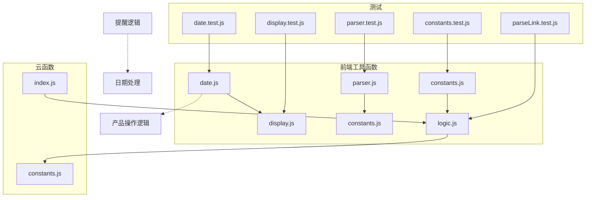

# 工具函数API

<cite>
**本文档引用的文件**
- [constants.js](file://miniprogram/utils/constants.js)
- [date.js](file://miniprogram/utils/date.js)
- [display.js](file://miniprogram/utils/display.js)
- [parser.js](file://miniprogram/utils/parser.js)
- [index.js](file://cloudfunctions/parseLink/index.js)
- [logic.js](file://cloudfunctions/parseLink/logic.js)
- [constants.test.js](file://tests/constants.test.js)
- [date.test.js](file://tests/date.test.js)
- [display.test.js](file://tests/display.test.js)
- [parser.test.js](file://tests/parser.test.js)
- [parseLink.test.js](file://tests/parseLink.test.js)
- [productOps.test.js](file://tests/productOps.test.js)
- [reminder.test.js](file://tests/reminder.test.js)
</cite>

## 目录
1. [简介](#简介)
2. [项目结构](#项目结构)
3. [核心组件](#核心组件)
4. [架构概览](#架构概览)
5. [详细组件分析](#详细组件分析)
6. [依赖关系分析](#依赖关系分析)
7. [性能考虑](#性能考虑)
8. [故障排除指南](#故障排除指南)
9. [结论](#结论)

## 简介

本文件为微信小程序项目的工具函数API参考文档，涵盖所有工具函数的完整API规范。该系统主要包含四个核心模块：日期处理工具、显示辅助工具、链接解析工具和常量定义。每个模块都提供了完整的函数签名、参数说明、返回值定义、使用示例和最佳实践建议。

## 项目结构

该项目采用模块化设计，将不同功能的工具函数分离到独立的文件中，便于维护和测试：

**图表来源**
- [constants.js:1-100](file://miniprogram/utils/constants.js#L1-L100)
- [date.js:1-76](file://miniprogram/utils/date.js#L1-L76)
- [display.js:1-76](file://miniprogram/utils/display.js#L1-L76)
- [parser.js:1-70](file://miniprogram/utils/parser.js#L1-L70)
- [index.js:1-112](file://cloudfunctions/parseLink/index.js#L1-L112)
- [logic.js:1-78](file://cloudfunctions/parseLink/logic.js#L1-L78)

**章节来源**
- [constants.js:1-100](file://miniprogram/utils/constants.js#L1-L100)
- [date.js:1-76](file://miniprogram/utils/date.js#L1-L76)
- [display.js:1-76](file://miniprogram/utils/display.js#L1-L76)
- [parser.js:1-70](file://miniprogram/utils/parser.js#L1-L70)

## 核心组件

### 常量定义模块

常量定义模块提供了产品状态、预设分类、品牌词库以及相关的解析函数。该模块包含以下核心常量和函数：

- **PRODUCT_STATUS**: 产品状态枚举，包含五种状态值
- **PRESET_CATEGORIES**: 预设的六种产品分类
- **BRAND_LIST**: 丰富的品牌词库，覆盖多个国际和国内品牌
- **matchBrand()**: 从商品标题中匹配品牌名的函数
- **extractSpecification()**: 从商品标题中提取规格信息的函数

### 日期处理模块

日期处理模块专注于保质期管理和到期时间计算，提供以下核心功能：

- **addMonths()**: 月份加法运算，处理月末溢出问题
- **calcExpirationDate()**: 计算最终过期日期
- **calcRemainingDays()**: 计算剩余天数
- **getProductDisplayStatus()**: 根据剩余天数生成显示状态
- **formatDate()**: 日期格式化为ISO格式

### 显示辅助模块

显示辅助模块负责数据的前端展示格式化，提供以下功能：

- **calcProgressPercent()**: 计算保质期进度百分比
- **formatRemainingText()**: 格式化剩余天数为可读文本
- **getStatusLabel()**: 获取状态的中文标签
- **getStatusColorClass()**: 获取状态对应的颜色类名

### 链接解析模块

链接解析模块处理用户输入的链接类型识别和提取，包含：

- **identifyLinkType()**: 识别链接类型（淘宝链接、短链接、淘口令）
- **extractUrl()**: 从文本中提取URL或淘口令代码
- **parseInput()**: 解析用户输入，返回类型和提取值

**章节来源**
- [constants.js:6-99](file://miniprogram/utils/constants.js#L6-L99)
- [date.js:10-75](file://miniprogram/utils/date.js#L10-L75)
- [display.js:13-75](file://miniprogram/utils/display.js#L13-L75)
- [parser.js:17-63](file://miniprogram/utils/parser.js#L17-L63)

## 架构概览

系统采用分层架构设计，将业务逻辑分为前端工具函数和云函数解析两部分：

**图表来源**
- [parser.js:17-63](file://miniprogram/utils/parser.js#L17-L63)
- [index.js:11-56](file://cloudfunctions/parseLink/index.js#L11-L56)
- [logic.js:13-43](file://cloudfunctions/parseLink/logic.js#L13-L43)

## 详细组件分析

### 常量定义组件

#### 常量定义

**PRODUCT_STATUS** - 产品状态枚举
- `in_use`: 在用状态
- `expiring_soon`: 即将过期状态  
- `expired`: 已过期状态
- `used_up`: 已用完状态
- `discarded`: 已丢弃状态

**PRESET_CATEGORIES** - 预设分类数组
包含六个预定义的产品分类，每个分类对象包含：
- `name`: 分类名称（中文）
- `icon`: 图标标识符
- `sortOrder`: 排序顺序

**BRAND_LIST** - 品牌词库
包含超过150个品牌名称，按类别组织：
- 国际高端品牌（如SK-II、兰蔻等）
- 彩妆品牌（如MAC、YSL等）
- 中端品牌
- 日韩品牌
- 欧美平价品牌
- 国货品牌
- 功效护肤品牌
- 身体护理/香水品牌
- 美发品牌

#### 品牌匹配函数

**matchBrand(title)** - 从商品标题中匹配品牌名
- **参数**: `title` (string) - 商品标题
- **返回值**: `string|null` - 匹配到的品牌名，未匹配则返回null
- **算法**: 优先匹配最长的品牌名，英文品牌大小写不敏感
- **使用场景**: 自动识别商品品牌，用于分类和品牌统计

#### 规格提取函数

**extractSpecification(title)** - 从商品标题中提取规格信息
- **参数**: `title` (string) - 商品标题
- **返回值**: `string|null` - 提取的规格信息，格式如"230ml"、"50g"、"10片"
- **匹配规则**: 数字+可选空格+单位（ml/g/片/支/对）
- **使用场景**: 提取商品规格用于库存管理和价格计算

**章节来源**
- [constants.js:6-99](file://miniprogram/utils/constants.js#L6-L99)
- [constants.test.js:63-106](file://tests/constants.test.js#L63-L106)

### 日期处理组件

#### 月份加法函数

**addMonths(dateStr, months)** - 给日期加上指定月数
- **参数**: 
  - `dateStr` (string) - ISO格式日期字符串（YYYY-MM-DD）
  - `months` (number) - 要添加的月份数（可为负数）
- **返回值**: `string` - 计算后的ISO格式日期字符串
- **特殊处理**: 处理月末溢出问题（如1月31日+1月=2月28/29日）
- **使用场景**: 计算保质期到期时间的基础函数

#### 过期日期计算

**calcExpirationDate(product)** - 计算最终过期日期
- **参数**: `product` (object) - 产品对象，包含：
  - `productionDate` (string): 生产日期
  - `shelfLifeMonths` (number): 未开封保质期（月）
  - `openedDate` (string|null): 开封日期（可选）
  - `openedShelfLifeMonths` (number|null): 开封后保质期（可选）
- **返回值**: `string` - 最终过期日期（YYYY-MM-DD）
- **算法**: 返回未开封过期时间和开封后过期时间中的较早者
- **使用场景**: 计算产品的实际可用期限

#### 剩余天数计算

**calcRemainingDays(expirationDate, today)** - 计算距离过期的剩余天数
- **参数**:
  - `expirationDate` (string): 过期日期（YYYY-MM-DD）
  - `today` (Date|string|null): 计算基准日期，默认为当前日期
- **返回值**: `number` - 剩余天数
  - 正数：还有X天过期
  - 0：今天过期
  - 负数：已过期X天
- **使用场景**: 生成剩余天数的数值表示

#### 显示状态判断

**getProductDisplayStatus(remainingDays, advanceDays)** - 根据剩余天数返回显示状态
- **参数**:
  - `remainingDays` (number): 剩余天数
  - `advanceDays` (number): 提前提醒天数阈值
- **返回值**: `string` - 状态字符串（'expired' | 'expiring_soon' | 'in_use'）
- **判断规则**:
  - 剩余天数≤0：已过期
  - 剩余天数≤advanceDays：即将过期
  - 否则：在用
- **使用场景**: 控制UI状态显示和颜色变化

#### 日期格式化

**formatDate(date)** - 格式化Date对象为ISO字符串
- **参数**: `date` (Date) - JavaScript Date对象
- **返回值**: `string` - ISO格式日期字符串（YYYY-MM-DD）
- **使用场景**: 统一日期格式输出

**章节来源**
- [date.js:10-75](file://miniprogram/utils/date.js#L10-L75)
- [date.test.js:11-129](file://tests/date.test.js#L11-L129)

### 显示辅助组件

#### 进度百分比计算

**calcProgressPercent(productionDate, expirationDate, now)** - 计算保质期进度百分比
- **参数**:
  - `productionDate` (string): 生产日期（YYYY-MM-DD）
  - `expirationDate` (string): 过期日期（YYYY-MM-DD）
  - `now` (Date|null): 当前日期，默认为当前日期
- **返回值**: `number` - 进度百分比（0-100）
- **边界处理**:
  - 保质期总时长≤0：返回100%
  - 当前时间在生产日期之前：返回0%
  - 当前时间在过期日期之后：返回100%
- **使用场景**: 生成进度条和状态指示

#### 剩余天数文本格式化

**formatRemainingText(remainingDays)** - 将剩余天数格式化为可读文本
- **参数**: `remainingDays` (number) - 剩余天数
- **返回值**: `string` - 格式化后的文本
  - 正数：'剩余 X 天'
  - 0：'今天过期'
  - 负数：'已过期 X 天'
- **使用场景**: 用户界面的状态显示

#### 状态标签映射

**STATUS_LABELS** - 状态中文标签映射表
- `in_use`: '在用'
- `expiring_soon`: '即将过期'
- `expired`: '已过期'
- `used_up`: '已用完'
- `discarded`: '已丢弃'

**getStatusLabel(status)** - 获取状态的中文标签
- **参数**: `status` (string) - 状态字符串
- **返回值**: `string` - 对应的中文标签
- **使用场景**: 界面状态显示

#### 状态颜色映射

**STATUS_COLOR_MAP** - 状态对应的颜色类名
- `in_use`: 'safe'（绿色）
- `expiring_soon`: 'warning'（橙色）
- `expired`: 'danger'（红色）
- `used_up`: 'secondary'（灰色）
- `discarded`: 'secondary'（灰色）

**getStatusColorClass(status)** - 获取状态对应的颜色类名
- **参数**: `status` (string) - 状态字符串
- **返回值**: `string` - CSS颜色类名
- **使用场景**: 根据状态设置UI颜色样式

**章节来源**
- [display.js:13-75](file://miniprogram/utils/display.js#L13-L75)
- [display.test.js:13-110](file://tests/display.test.js#L13-L110)

### 链接解析组件

#### 链接类型识别

**identifyLinkType(text)** - 识别输入文本的链接类型
- **参数**: `text` (string) - 用户粘贴的文本
- **返回值**: `'taobao_link'|'short_link'|'taokou_ling'|'unknown'` - 链接类型
- **识别规则**:
  - 标准淘宝商品链接：item.taobao.com
  - 天猫商品链接：detail.tmall.com
  - 淘宝短链接：m.tb.cn
  - 淘口令：包含¥或￥符号的代码
- **使用场景**: 决定后续的解析策略

#### URL提取函数

**extractUrl(text, type)** - 从文本中提取有效URL或淘口令代码
- **参数**:
  - `text` (string) - 原始文本
  - `type` (string) - 通过identifyLinkType得到的类型
- **返回值**: `string|null` - 提取的URL或淘口令代码
- **提取规则**:
  - 标准链接：提取完整的URL
  - 短链接：提取短链URL
  - 淘口令：提取代码部分（去除¥/￥符号）
- **使用场景**: 获取可用于进一步处理的有效链接

#### 输入解析函数

**parseInput(text)** - 解析用户输入，返回类型和提取值
- **参数**: `text` (string) - 用户粘贴的文本
- **返回值**: `{ type: string, value: string|null }` - 解析结果对象
- **流程**: 先识别类型，再提取对应的值
- **使用场景**: 统一处理用户输入的便捷接口

**章节来源**
- [parser.js:17-63](file://miniprogram/utils/parser.js#L17-L63)
- [parser.test.js:8-180](file://tests/parser.test.js#L8-L180)

### 云函数解析组件

#### 云函数入口

**parseLink 云函数** - 主要的链接解析入口
- **参数**: `event` (object) - 事件对象，包含`type`和`value`
- **返回值**: 解析结果或错误信息
- **处理流程**:
  1. 参数验证
  2. 短链和淘口令解析
  3. 商品ID提取
  4. 页面抓取和标题解析
  5. 结果组装返回

#### 解析逻辑

**extractItemId(url)** - 从URL中提取商品ID
- **参数**: `url` (string) - 商品链接
- **返回值**: `string|null` - 提取的商品ID
- **使用场景**: 从链接中获取商品标识符

**parseProductTitle(title)** - 解析商品标题
- **参数**: `title` (string) - 商品页面标题
- **返回值**: `{ name: string, brand: string, specification: string }` - 解析结果
- **功能**: 提取品牌、规格，生成清理后的商品名称

**inferCategory(title)** - 推断商品分类
- **参数**: `title` (string) - 商品标题
- **返回值**: `string` - 推断的分类名称
- **分类规则**: 基于关键词匹配的启发式分类

**章节来源**
- [index.js:11-56](file://cloudfunctions/parseLink/index.js#L11-L56)
- [logic.js:13-77](file://cloudfunctions/parseLink/logic.js#L13-L77)

## 依赖关系分析

系统各模块之间的依赖关系清晰明确：

**图表来源**
- [date.js:1-76](file://miniprogram/utils/date.js#L1-L76)
- [display.js:1-76](file://miniprogram/utils/display.js#L1-L76)
- [parser.js:1-70](file://miniprogram/utils/parser.js#L1-L70)
- [constants.js:1-100](file://miniprogram/utils/constants.js#L1-L100)
- [index.js:1-112](file://cloudfunctions/parseLink/index.js#L1-L112)
- [logic.js:1-78](file://cloudfunctions/parseLink/logic.js#L1-L78)

**章节来源**
- [productOps.test.js:5-11](file://tests/productOps.test.js#L5-L11)
- [reminder.test.js](file://tests/reminder.test.js#L6)

## 性能考虑

### 时间复杂度分析

1. **品牌匹配函数**: O(n×m)，其中n为品牌数量，m为标题长度
2. **规格提取函数**: O(m)，m为标题长度
3. **日期计算函数**: O(1)，所有日期计算都是常数时间
4. **链接识别函数**: O(k)，k为正则表达式的复杂度
5. **状态推断函数**: O(p×q)，p为关键词数量，q为标题长度

### 空间复杂度分析

- 所有函数的空间复杂度均为O(1)或O(m)，主要用于存储临时变量和字符串处理
- 品牌列表占用约150KB内存，属于可接受范围

### 性能优化建议

1. **缓存机制**: 对频繁查询的品牌列表可以考虑本地缓存
2. **批量处理**: 对大量商品的处理建议使用批量API调用
3. **异步处理**: 链接解析建议使用异步方式，避免阻塞UI
4. **防抖处理**: 对用户输入的实时解析建议添加防抖机制

## 故障排除指南

### 常见问题及解决方案

#### 日期计算异常

**问题**: 月末日期计算结果不正确
**原因**: 月份溢出处理不当
**解决方案**: 使用addMonths函数进行月份加减运算

#### 品牌匹配失败

**问题**: 品牌名称未被正确识别
**原因**: 品牌名称不在词库中或格式不匹配
**解决方案**: 
- 检查品牌名称是否在BRAND_LIST中
- 确认品牌名称的大小写和格式
- 考虑添加新的品牌到词库

#### 链接解析失败

**问题**: 云函数解析返回错误
**原因**: 网络请求超时或页面结构变化
**解决方案**:
- 检查网络连接状态
- 验证链接的有效性
- 查看云函数日志获取详细错误信息

#### 性能问题

**问题**: 大量数据处理时响应缓慢
**解决方案**:
- 使用分页加载
- 实施缓存策略
- 优化正则表达式
- 考虑使用Web Workers进行后台处理

**章节来源**
- [date.test.js:11-31](file://tests/date.test.js#L11-L31)
- [constants.test.js:63-84](file://tests/constants.test.js#L63-L84)
- [parser.test.js:13-68](file://tests/parser.test.js#L13-L68)

## 结论

本工具函数API文档涵盖了微信小程序项目中所有核心工具函数的完整规范。系统设计合理，功能明确，具有以下特点：

1. **模块化设计**: 功能清晰分离，便于维护和扩展
2. **完善的测试覆盖**: 每个函数都有对应的单元测试，确保功能可靠性
3. **清晰的API规范**: 函数签名、参数说明、返回值定义完整
4. **实用性强**: 涵盖了日常开发中的常见需求
5. **易于使用**: 提供了详细的使用示例和最佳实践建议

建议在实际使用中：
- 严格按照API规范传入参数
- 注意处理可能的null值和边界情况
- 根据具体场景选择合适的函数组合
- 定期检查和更新品牌词库
- 实施适当的错误处理和用户反馈机制