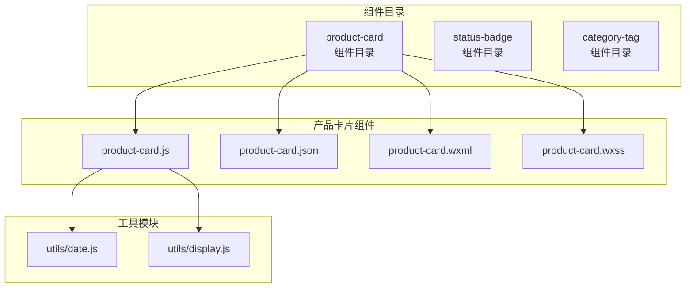
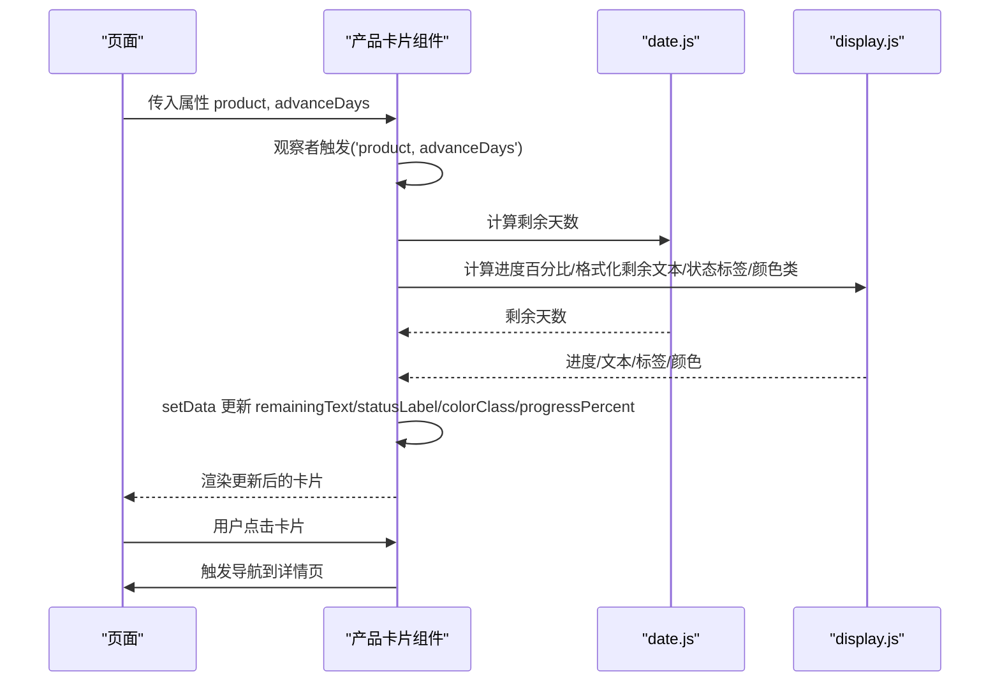
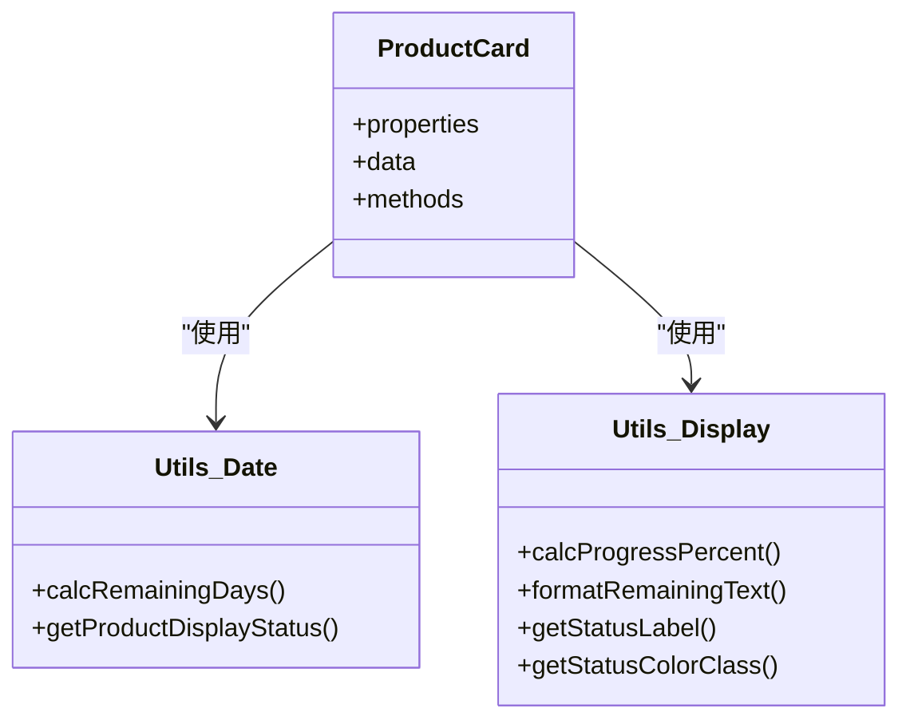
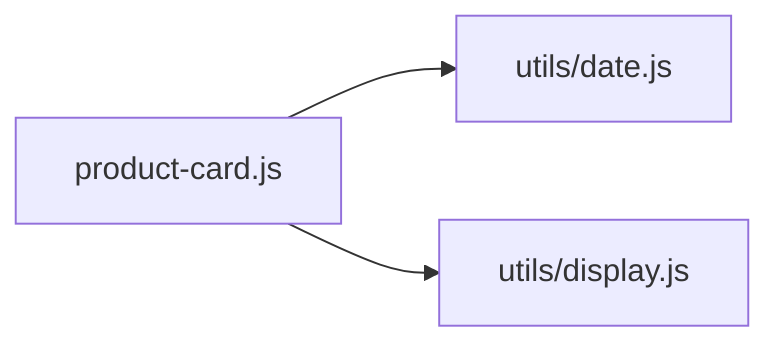

# 组件API

<cite>
**本文引用的文件**
- [miniprogram/components/product-card/product-card.js](file://miniprogram/components/product-card/product-card.js)
- [miniprogram/components/product-card/product-card.json](file://miniprogram/components/product-card/product-card.json)
- [miniprogram/components/product-card/product-card.wxml](file://miniprogram/components/product-card/product-card.wxml)
- [miniprogram/components/product-card/product-card.wxss](file://miniprogram/components/product-card/product-card.wxss)
- [miniprogram/utils/date.js](file://miniprogram/utils/date.js)
- [miniprogram/utils/display.js](file://miniprogram/utils/display.js)
</cite>

## 目录
1. [简介](#简介)
2. [项目结构](#项目结构)
3. [核心组件](#核心组件)
4. [架构总览](#架构总览)
5. [详细组件分析](#详细组件分析)
6. [依赖关系分析](#依赖关系分析)
7. [性能考虑](#性能考虑)
8. [故障排查指南](#故障排查指南)
9. [结论](#结论)
10. [附录](#附录)

## 简介
本文件为微信小程序UI组件API的组件参考文档，聚焦以下三个组件：
- 产品卡片组件（product-card）：用于展示产品基础信息、状态标签与保质期进度，支持点击跳转详情页。
- 状态标签组件（status-badge）：用于展示状态标签，支持颜色与文本映射。
- 分类标签组件（category-tag）：用于展示分类标签，支持交互与状态管理。

当前仓库中已实现“产品卡片组件”的全部文件；“状态标签组件”与“分类标签组件”在目录中存在但缺少对应JS实现文件。本文将基于现有代码对“产品卡片组件”进行完整API说明，并对“状态标签组件”和“分类标签组件”给出可扩展的API设计建议与最佳实践。

## 项目结构
组件位于 miniprogram/components 目录下，采用按组件分目录的组织方式。产品卡片组件包含完整的 WXML、WXSS、JS与JSON声明文件；状态标签与分类标签组件目录存在但尚未包含JS实现文件。

**图表来源**
- [miniprogram/components/product-card/product-card.js:1-51](file://miniprogram/components/product-card/product-card.js#L1-L51)
- [miniprogram/components/product-card/product-card.json:1-3](file://miniprogram/components/product-card/product-card.json#L1-L3)
- [miniprogram/components/product-card/product-card.wxml:1-29](file://miniprogram/components/product-card/product-card.wxml#L1-L29)
- [miniprogram/components/product-card/product-card.wxss:1-122](file://miniprogram/components/product-card/product-card.wxss#L1-L122)
- [miniprogram/utils/date.js](file://miniprogram/utils/date.js)
- [miniprogram/utils/display.js](file://miniprogram/utils/display.js)

**章节来源**
- [miniprogram/components/product-card/product-card.js:1-51](file://miniprogram/components/product-card/product-card.js#L1-L51)
- [miniprogram/components/product-card/product-card.json:1-3](file://miniprogram/components/product-card/product-card.json#L1-L3)
- [miniprogram/components/product-card/product-card.wxml:1-29](file://miniprogram/components/product-card/product-card.wxml#L1-L29)
- [miniprogram/components/product-card/product-card.wxss:1-122](file://miniprogram/components/product-card/product-card.wxss#L1-L122)

## 核心组件
本节对已实现的“产品卡片组件”进行API规范说明，包括属性、数据绑定、事件与样式定制。对“状态标签组件”和“分类标签组件”，将在后续章节提供API设计建议与扩展指南。

- 产品卡片组件（product-card）
  - 组件属性
    - product: 对象类型，表示产品数据，包含名称、分类、规格、生产日期、过期日期、状态等字段。
    - advanceDays: 数字类型，用于计算剩余天数与显示状态的阈值。
  - 数据绑定
    - remainingText: 剩余天数文本。
    - statusLabel: 状态标签文本。
    - colorClass: 颜色类别（safe/warning/danger/secondary），用于样式选择器。
    - progressPercent: 保质期进度百分比。
  - 事件
    - onCardTap(): 卡片点击事件，跳转到详情页。
  - 插槽
    - 无插槽。
  - 方法
    - 无公开方法（内部方法仅限组件自身使用）。
  - 样式定制
    - 支持通过颜色类别类名（如 icon-safe、tag-safe、text-safe）与CSS变量进行主题化定制。
    - 提供进度条填充样式与状态标签背景色、文字色的差异化样式。

**章节来源**
- [miniprogram/components/product-card/product-card.js:7-50](file://miniprogram/components/product-card/product-card.js#L7-L50)
- [miniprogram/components/product-card/product-card.wxml:5-28](file://miniprogram/components/product-card/product-card.wxml#L5-L28)
- [miniprogram/components/product-card/product-card.wxss:1-122](file://miniprogram/components/product-card/product-card.wxss#L1-L122)

## 架构总览
产品卡片组件通过WXML渲染结构，WXSS提供样式，JS负责属性监听与数据计算，并调用工具模块完成日期与显示逻辑的处理。组件对外暴露属性与事件，内部通过setData更新视图。

**图表来源**
- [miniprogram/components/product-card/product-card.js:19-33](file://miniprogram/components/product-card/product-card.js#L19-L33)
- [miniprogram/utils/date.js](file://miniprogram/utils/date.js)
- [miniprogram/utils/display.js](file://miniprogram/utils/display.js)
- [miniprogram/components/product-card/product-card.wxml:5-28](file://miniprogram/components/product-card/product-card.wxml#L5-L28)

## 详细组件分析

### 产品卡片组件（product-card）
- 组件职责
  - 展示产品基础信息（名称、分类、规格）、状态标签与保质期进度。
  - 处理用户点击事件，跳转至详情页。
- 属性定义
  - product: 对象，必填。包含字段如名称、分类、规格、生产日期、过期日期、状态等。
  - advanceDays: 数字，默认30。用于判断剩余天数与显示状态的阈值。
- 数据绑定
  - remainingText: 剩余天数文本，由工具模块格式化。
  - statusLabel: 状态标签文本，根据剩余天数与状态生成。
  - colorClass: 颜色类别，决定图标、标签与文字的颜色风格。
  - progressPercent: 保质期进度百分比，用于进度条宽度。
- 事件处理
  - onCardTap(): 当存在有效产品ID时，跳转到详情页。
- 插槽
  - 无插槽。
- 方法
  - 无公开方法。
- 样式定制
  - 通过颜色类别类名（icon-*, tag-*, text-*）与CSS变量控制主题。
  - 提供进度条填充样式（progress-*）以适配不同颜色类别。

**图表来源**
- [miniprogram/components/product-card/product-card.js:4-5](file://miniprogram/components/product-card/product-card.js#L4-L5)
- [miniprogram/components/product-card/product-card.js:19-33](file://miniprogram/components/product-card/product-card.js#L19-L33)

**章节来源**
- [miniprogram/components/product-card/product-card.js:7-50](file://miniprogram/components/product-card/product-card.js#L7-L50)
- [miniprogram/components/product-card/product-card.wxml:5-28](file://miniprogram/components/product-card/product-card.wxml#L5-L28)
- [miniprogram/components/product-card/product-card.wxss:1-122](file://miniprogram/components/product-card/product-card.wxss#L1-L122)

### 状态标签组件（status-badge）API设计建议
- 组件职责
  - 展示状态标签，支持状态值到标签文本与颜色的映射。
- 属性定义（建议）
  - value: 状态值（字符串或数字）。
  - mapping: 映射表，键为状态值，值为标签文本与颜色配置。
  - colorMode: 颜色模式（安全/警告/危险/次要）。
- 数据绑定（建议）
  - label: 根据映射表生成的标签文本。
  - colorClass: 根据映射表生成的颜色类别。
- 事件处理（建议）
  - onClick(): 点击事件回调。
- 插槽（建议）
  - default: 自定义标签内容。
- 方法（建议）
  - updateValue(newValue): 动态更新状态值。
- 样式定制（建议）
  - 通过颜色类别类名与CSS变量实现主题化。
  - 支持禁用态、圆角、尺寸等样式变体。

### 分类标签组件（category-tag）API设计建议
- 组件职责
  - 展示分类标签，支持交互（选中/取消）、状态管理与事件回调。
- 属性定义（建议）
  - category: 分类对象，包含分类ID与名称。
  - selected: 布尔值，是否选中。
  - disabled: 布尔值，是否禁用。
- 数据绑定（建议）
  - label: 分类名称。
  - colorClass: 根据选中/禁用状态切换颜色类别。
- 事件处理（建议）
  - onSelect(): 选中事件回调。
  - onToggle(): 切换事件回调。
- 插槽（建议）
  - icon: 自定义图标。
- 方法（建议）
  - toggle(): 切换选中状态。
  - select(): 设置为选中。
  - deselect(): 取消选中。
- 样式定制（建议）
  - 通过颜色类别类名与CSS变量实现主题化。
  - 支持选中态、禁用态、悬停态等样式变体。

## 依赖关系分析
产品卡片组件依赖两个工具模块：
- utils/date.js：提供日期计算能力（剩余天数、显示状态）。
- utils/display.js：提供显示相关能力（进度百分比、剩余文本格式化、状态标签与颜色类）。

**图表来源**
- [miniprogram/components/product-card/product-card.js:4-5](file://miniprogram/components/product-card/product-card.js#L4-L5)

**章节来源**
- [miniprogram/components/product-card/product-card.js:4-5](file://miniprogram/components/product-card/product-card.js#L4-L5)

## 性能考虑
- 属性监听与计算
  - 使用观察者监听复合属性（product与advanceDays），避免重复计算与不必要的setData调用。
- 数据绑定
  - 将计算结果聚合到data中，减少WXML中的表达式复杂度。
- 事件处理
  - 点击事件仅在存在有效ID时执行导航，避免无效跳转。
- 样式优化
  - 使用CSS变量与颜色类别类名，便于主题化与缓存渲染结果。
- 工具函数复用
  - 将日期与显示逻辑抽取到独立模块，提升可测试性与可维护性。

## 故障排查指南
- 未显示状态标签或颜色异常
  - 检查产品状态值与advanceDays参数是否正确传入。
  - 确认颜色类别类名与对应样式是否存在。
- 进度条不显示或百分比异常
  - 检查生产日期与过期日期字段是否有效。
  - 确认进度百分比计算逻辑与WXML中的样式绑定。
- 点击卡片无响应
  - 确认产品ID存在且页面路由配置正确。
- 样式未生效
  - 检查CSS变量与颜色类别类名是否匹配组件WXML结构。

## 结论
产品卡片组件提供了清晰的属性接口、稳定的事件处理与可定制的样式体系。对于“状态标签组件”和“分类标签组件”，建议按照本文提供的API设计建议进行扩展，确保一致的属性命名、事件模型与样式策略，从而提升整体组件库的可用性与一致性。

## 附录
- 使用示例（路径指引）
  - 在页面中引入产品卡片组件并在WXML中使用，传入产品数据与advanceDays参数。
  - 在页面逻辑中监听卡片点击事件并处理导航。
- 最佳实践
  - 将组件属性保持为轻量级数据结构，避免在属性中传递复杂对象。
  - 使用CSS变量统一管理主题色彩，便于全局主题切换。
  - 为组件提供默认值与边界条件处理，增强健壮性。
- 性能优化建议
  - 合理拆分计算逻辑，避免在观察者中执行昂贵操作。
  - 使用WXML中的简单表达式，减少setData频率。
  - 对频繁更新的数据采用批量更新策略。