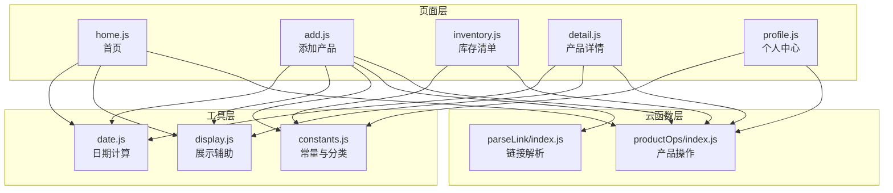
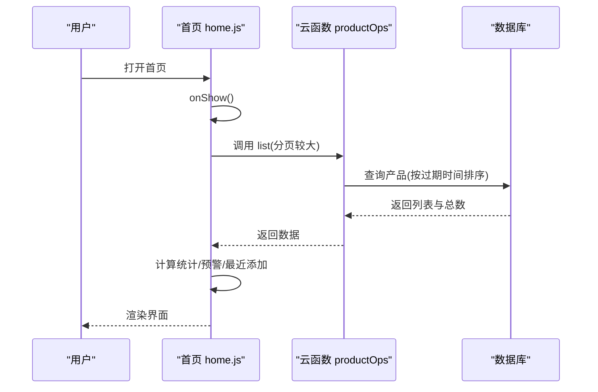
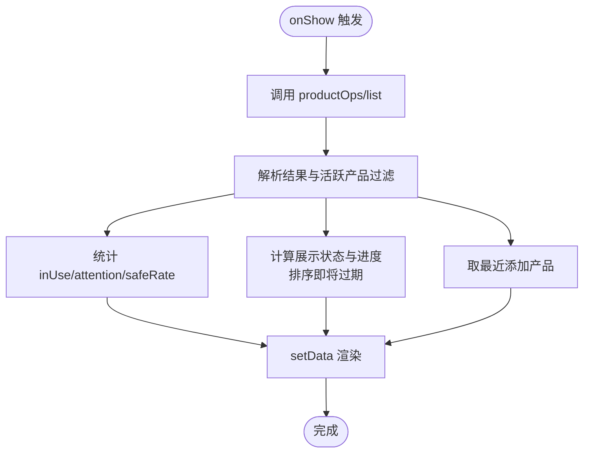
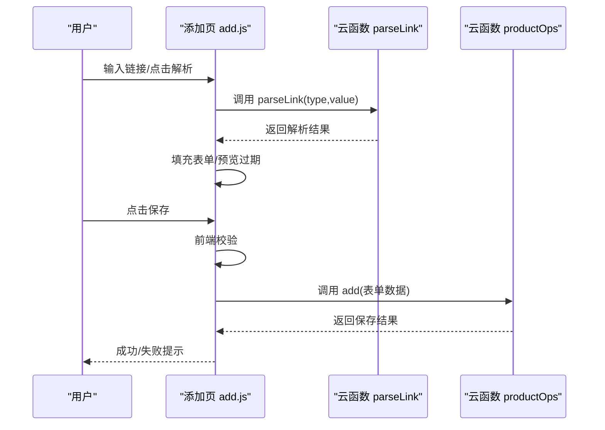
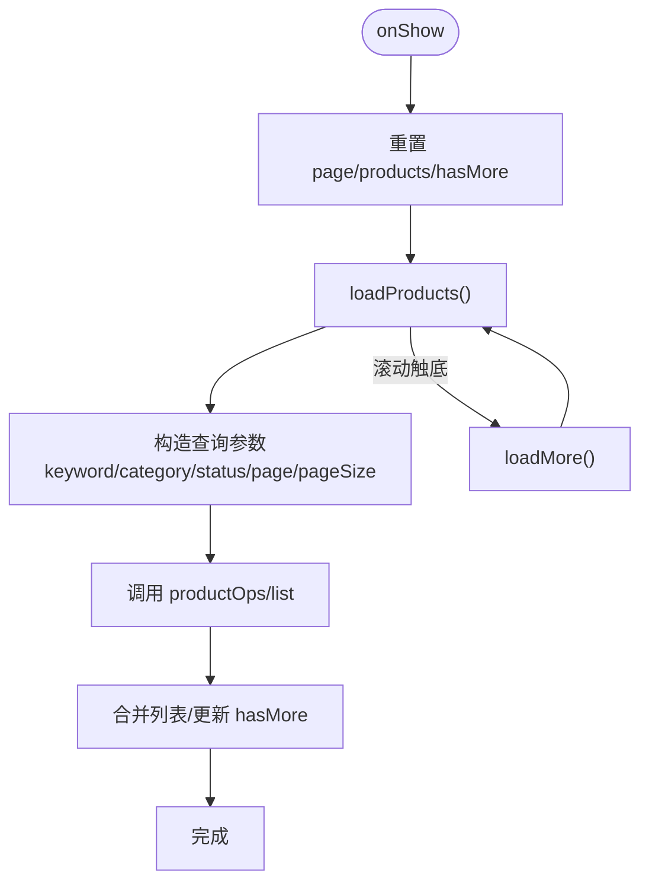
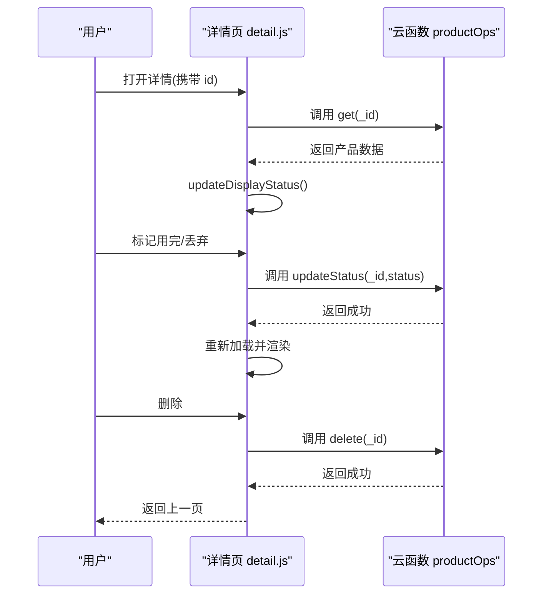
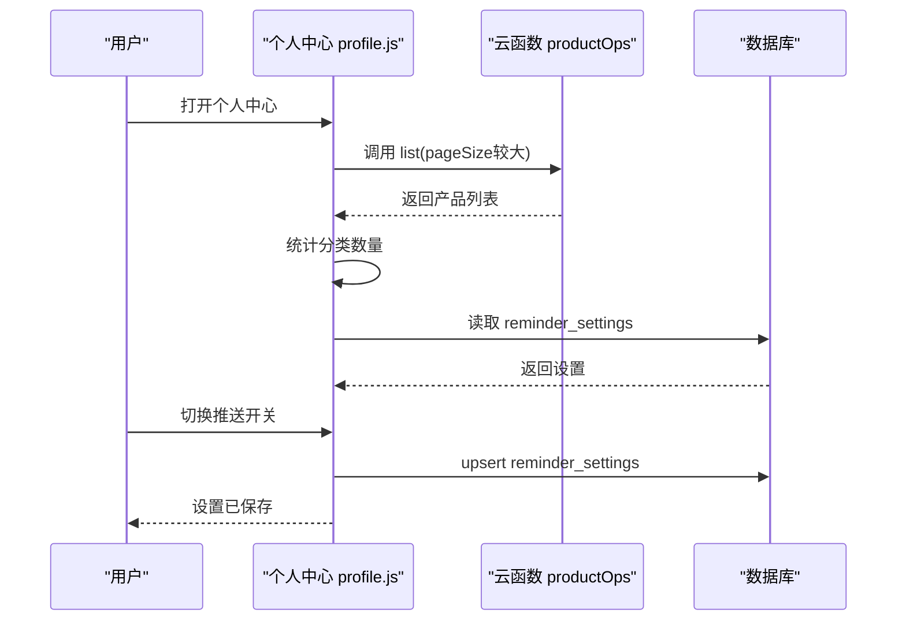
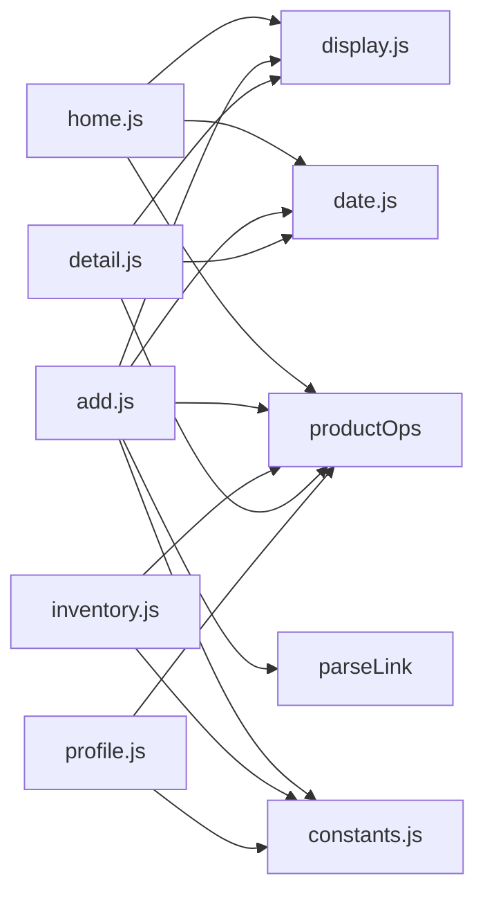

# 页面API

<cite>
**本文引用的文件**
- [miniprogram/pages/home/home.js](file://miniprogram/pages/home/home.js)
- [miniprogram/pages/home/home.json](file://miniprogram/pages/home/home.json)
- [miniprogram/pages/add/add.js](file://miniprogram/pages/add/add.js)
- [miniprogram/pages/add/add.json](file://miniprogram/pages/add/add.json)
- [miniprogram/pages/inventory/inventory.js](file://miniprogram/pages/inventory/inventory.js)
- [miniprogram/pages/inventory/inventory.json](file://miniprogram/pages/inventory/inventory.json)
- [miniprogram/pages/detail/detail.js](file://miniprogram/pages/detail/detail.js)
- [miniprogram/pages/detail/detail.json](file://miniprogram/pages/detail/detail.json)
- [miniprogram/pages/profile/profile.js](file://miniprogram/pages/profile/profile.js)
- [miniprogram/pages/profile/profile.json](file://miniprogram/pages/profile/profile.json)
- [cloudfunctions/productOps/index.js](file://cloudfunctions/productOps/index.js)
- [cloudfunctions/parseLink/index.js](file://cloudfunctions/parseLink/index.js)
- [miniprogram/utils/constants.js](file://miniprogram/utils/constants.js)
- [miniprogram/utils/date.js](file://miniprogram/utils/date.js)
- [miniprogram/utils/display.js](file://miniprogram/utils/display.js)
</cite>

## 目录
1. [简介](#简介)
2. [项目结构](#项目结构)
3. [核心组件](#核心组件)
4. [架构总览](#架构总览)
5. [详细组件分析](#详细组件分析)
6. [依赖关系分析](#依赖关系分析)
7. [性能考虑](#性能考虑)
8. [故障排查指南](#故障排查指南)
9. [结论](#结论)
10. [附录](#附录)

## 简介
本文件为页面API的系统化文档，覆盖以下页面的生命周期、数据绑定、事件处理与导航接口，并深入记录：
- 首页仪表盘：统计数据、图表渲染、即将过期警告、最近添加、快捷操作与数据更新机制
- 添加产品：双模式导入与手动录入、表单验证、实时预览、数据提交与错误处理
- 库存清单：列表渲染、分页加载、筛选搜索、批量操作与状态同步
- 产品详情：数据展示、状态管理、编辑功能与删除确认
- 个人中心：用户统计、设置管理、帮助支持与账户操作
同时提供页面间数据传递、路由跳转与状态同步的API规范，并总结性能优化、内存管理与用户体验最佳实践。

## 项目结构
页面与云函数分布清晰，采用“页面逻辑 + 工具函数 + 云函数”三层结构：
- 页面层：各页面的 JS/WXML/JSON/WXSS 文件，负责生命周期、事件与UI交互
- 工具层：日期、展示、常量等通用工具函数，供页面与云函数复用
- 云函数层：统一的产品操作与链接解析服务，提供安全与业务逻辑封装

图示来源
- [miniprogram/pages/home/home.js:1-119](file://miniprogram/pages/home/home.js#L1-L119)
- [miniprogram/pages/add/add.js:1-260](file://miniprogram/pages/add/add.js#L1-L260)
- [miniprogram/pages/inventory/inventory.js:1-117](file://miniprogram/pages/inventory/inventory.js#L1-L117)
- [miniprogram/pages/detail/detail.js:1-122](file://miniprogram/pages/detail/detail.js#L1-L122)
- [miniprogram/pages/profile/profile.js:1-113](file://miniprogram/pages/profile/profile.js#L1-L113)
- [cloudfunctions/productOps/index.js:1-171](file://cloudfunctions/productOps/index.js#L1-L171)
- [cloudfunctions/parseLink/index.js:1-112](file://cloudfunctions/parseLink/index.js#L1-L112)
- [miniprogram/utils/date.js:1-76](file://miniprogram/utils/date.js#L1-L76)
- [miniprogram/utils/display.js:1-76](file://miniprogram/utils/display.js#L1-L76)
- [miniprogram/utils/constants.js:1-100](file://miniprogram/utils/constants.js#L1-L100)

章节来源
- [miniprogram/pages/home/home.json:1-6](file://miniprogram/pages/home/home.json#L1-L6)
- [miniprogram/pages/add/add.json:1-3](file://miniprogram/pages/add/add.json#L1-L3)
- [miniprogram/pages/inventory/inventory.json:1-6](file://miniprogram/pages/inventory/inventory.json#L1-L6)
- [miniprogram/pages/detail/detail.json:1-3](file://miniprogram/pages/detail/detail.json#L1-L3)
- [miniprogram/pages/profile/profile.json:1-3](file://miniprogram/pages/profile/profile.json#L1-L3)

## 核心组件
- 首页仪表盘：统计卡片、即将过期警告、最近添加；基于过期日期实时计算展示状态
- 添加产品：双模式导入（链接/手动）；表单校验与实时预览；调用云函数保存
- 库存清单：关键词搜索、分类/状态筛选、分页加载；渲染产品卡片
- 产品详情：加载单个产品、状态计算与展示、标记用完/丢弃、删除确认
- 个人中心：库存统计、提醒设置读取与保存、跳转分类管理

章节来源
- [miniprogram/pages/home/home.js:11-119](file://miniprogram/pages/home/home.js#L11-L119)
- [miniprogram/pages/add/add.js:10-260](file://miniprogram/pages/add/add.js#L10-L260)
- [miniprogram/pages/inventory/inventory.js:10-117](file://miniprogram/pages/inventory/inventory.js#L10-L117)
- [miniprogram/pages/detail/detail.js:9-122](file://miniprogram/pages/detail/detail.js#L9-L122)
- [miniprogram/pages/profile/profile.js:7-113](file://miniprogram/pages/profile/profile.js#L7-L113)

## 架构总览
页面通过云函数进行数据持久化与业务处理，工具函数提供日期与展示逻辑复用。页面间通过路由进行跳转，部分页面使用组件化渲染提升复用性。

图示来源
- [miniprogram/pages/home/home.js:24-101](file://miniprogram/pages/home/home.js#L24-L101)
- [cloudfunctions/productOps/index.js:92-110](file://cloudfunctions/productOps/index.js#L92-L110)

## 详细组件分析

### 首页仪表盘页面 API
- 生命周期与数据绑定
  - onShow：每次展示时触发，加载仪表盘数据
  - data：loading、stats、warningProducts、recentProducts、advanceDays
- 数据加载与计算
  - 调用云函数 productOps/list，pageSize 较大以覆盖活跃产品
  - 过滤非终态产品（排除 used_up、discarded），统计 inUse、attention、safeRate
  - 基于剩余天数与提前提醒天数，计算展示状态与进度
  - 对即将过期产品按剩余天数排序，最近添加按创建时间倒序取前若干
- 导航接口
  - goDetail：根据产品ID跳转详情
  - goInventory：跳转库存清单（switchTab）
  - goAdd：跳转添加产品（switchTab）

图示来源
- [miniprogram/pages/home/home.js:29-101](file://miniprogram/pages/home/home.js#L29-L101)
- [miniprogram/utils/date.js:42-57](file://miniprogram/utils/date.js#L42-L57)
- [miniprogram/utils/display.js:13-27](file://miniprogram/utils/display.js#L13-L27)

章节来源
- [miniprogram/pages/home/home.js:11-119](file://miniprogram/pages/home/home.js#L11-L119)
- [miniprogram/pages/home/home.json:1-6](file://miniprogram/pages/home/home.json#L1-L6)

### 添加产品页面 API
- 生命周期与数据绑定
  - onLoad：初始化 today 字段
  - data：mode、linkText、parsing、parseStatus、parsedName、parseError、saving、showOpened、categories、form
- 双模式导入与手动录入
  - switchMode/switchToManual：切换导入/手动模式
  - onLinkInput/onParseTap：解析链接，调用 parseLink 云函数，回填表单字段
  - onFormInput/onDateChange：表单输入与日期变更，联动过期时间预览
  - onCategoryTap/toggleOpened：选择分类与展开/收起开封信息
- 实时预览
  - updateExpiryPreview：根据生产日期、保质期与开封信息计算过期日期
- 保存与错误处理
  - onSaveTap：前端基础校验后调用 productOps/add，捕获云函数错误并弹窗提示
  - resetForm：清空表单与解析状态
- 导航接口
  - 无页面跳转（通过 tab 切换）

图示来源
- [miniprogram/pages/add/add.js:56-235](file://miniprogram/pages/add/add.js#L56-L235)
- [cloudfunctions/parseLink/index.js:11-56](file://cloudfunctions/parseLink/index.js#L11-L56)
- [cloudfunctions/productOps/index.js:75-90](file://cloudfunctions/productOps/index.js#L75-L90)

章节来源
- [miniprogram/pages/add/add.js:10-260](file://miniprogram/pages/add/add.js#L10-L260)
- [miniprogram/pages/add/add.json:1-3](file://miniprogram/pages/add/add.json#L1-L3)

### 库存清单页面 API
- 生命周期与数据绑定
  - onShow：重置分页与列表，首次加载
  - data：products、categories、keyword、activeCategory、activeStatus、loading、hasMore、page、advanceDays
- 搜索与筛选
  - onSearchInput/onSearch：关键词搜索，重置分页并重新加载
  - onCategoryFilter：按分类筛选，重置分页并重新加载
  - onStatusFilter：按状态筛选，支持取消已选状态，重置分页并重新加载
- 列表加载与分页
  - loadProducts：构造查询参数，调用 productOps/list，拼接新页数据，更新 hasMore
  - loadMore：hasMore 且非 loading 时翻页继续加载
- 导航接口
  - goAdd：跳转添加产品（switchTab）

图示来源
- [miniprogram/pages/inventory/inventory.js:23-110](file://miniprogram/pages/inventory/inventory.js#L23-L110)
- [cloudfunctions/productOps/index.js:92-110](file://cloudfunctions/productOps/index.js#L92-L110)

章节来源
- [miniprogram/pages/inventory/inventory.js:10-117](file://miniprogram/pages/inventory/inventory.js#L10-L117)
- [miniprogram/pages/inventory/inventory.json:1-6](file://miniprogram/pages/inventory/inventory.json#L1-L6)

### 产品详情页面 API
- 生命周期与数据绑定
  - onLoad：接收产品ID，加载产品并计算展示状态
  - data：product、loadError、remainingDaysAbs、remainingUnit、remainingText、colorClass、progressPercent、advanceDays
- 数据加载与状态计算
  - loadProduct：调用 productOps/get，校验所有权后设置 product 并更新展示状态
  - updateDisplayStatus：计算剩余天数、展示状态、颜色类与进度百分比
- 状态管理与删除
  - onMarkUsedUp/onMarkDiscarded：弹窗确认后调用 productOps/updateStatus 更新状态
  - onDelete：弹窗确认后调用 productOps/delete，成功后返回上一页

图示来源
- [miniprogram/pages/detail/detail.js:31-120](file://miniprogram/pages/detail/detail.js#L31-L120)
- [cloudfunctions/productOps/index.js:112-121](file://cloudfunctions/productOps/index.js#L112-L121)
- [cloudfunctions/productOps/index.js:141-157](file://cloudfunctions/productOps/index.js#L141-L157)
- [cloudfunctions/productOps/index.js:159-170](file://cloudfunctions/productOps/index.js#L159-L170)

章节来源
- [miniprogram/pages/detail/detail.js:9-122](file://miniprogram/pages/detail/detail.js#L9-L122)
- [miniprogram/pages/detail/detail.json:1-3](file://miniprogram/pages/detail/detail.json#L1-L3)

### 个人中心页面 API
- 生命周期与数据绑定
  - onShow：加载统计与设置
  - data：totalProducts、categoryStats、advanceDays、enablePush、pushFrequency
- 统计与设置
  - loadStats：调用 productOps/list 获取全部产品，统计分类数量
  - loadSettings：读取本地提醒设置集合，初始化页面状态
  - onPushToggle/saveSettings：开关推送并保存设置
- 导航接口
  - goCategory：跳转分类管理

图示来源
- [miniprogram/pages/profile/profile.js:21-106](file://miniprogram/pages/profile/profile.js#L21-L106)
- [cloudfunctions/productOps/index.js:92-110](file://cloudfunctions/productOps/index.js#L92-L110)

章节来源
- [miniprogram/pages/profile/profile.js:7-113](file://miniprogram/pages/profile/profile.js#L7-L113)
- [miniprogram/pages/profile/profile.json:1-3](file://miniprogram/pages/profile/profile.json#L1-L3)

## 依赖关系分析
- 页面与工具函数
  - 首页/详情：依赖日期与展示工具，用于剩余天数、状态与进度计算
  - 添加页：依赖日期工具与解析器，用于过期时间预览与标题解析
  - 库存/个人中心：依赖预设分类常量
- 页面与云函数
  - 首页/库存/详情/个人中心：统一通过 productOps 云函数进行 CRUD 与查询
  - 添加页：解析链接调用 parseLink 云函数
- 组件化
  - 首页与库存使用产品卡片组件，提升渲染一致性与复用性

图示来源
- [miniprogram/pages/home/home.js:6-7](file://miniprogram/pages/home/home.js#L6-L7)
- [miniprogram/pages/add/add.js:6-8](file://miniprogram/pages/add/add.js#L6-L8)
- [miniprogram/pages/inventory/inventory.js](file://miniprogram/pages/inventory/inventory.js#L6)
- [miniprogram/pages/detail/detail.js:6-7](file://miniprogram/pages/detail/detail.js#L6-L7)
- [miniprogram/pages/profile/profile.js](file://miniprogram/pages/profile/profile.js#L5)
- [cloudfunctions/productOps/index.js:1-24](file://cloudfunctions/productOps/index.js#L1-L24)
- [cloudfunctions/parseLink/index.js:1-112](file://cloudfunctions/parseLink/index.js#L1-L112)

章节来源
- [miniprogram/utils/date.js:1-76](file://miniprogram/utils/date.js#L1-L76)
- [miniprogram/utils/display.js:1-76](file://miniprogram/utils/display.js#L1-L76)
- [miniprogram/utils/constants.js:1-100](file://miniprogram/utils/constants.js#L1-L100)
- [cloudfunctions/productOps/index.js:1-171](file://cloudfunctions/productOps/index.js#L1-L171)
- [cloudfunctions/parseLink/index.js:1-112](file://cloudfunctions/parseLink/index.js#L1-L112)

## 性能考虑
- 首页数据加载
  - 使用较大的分页大小一次性获取活跃产品，避免多次往返；后续在前端做状态计算与排序
- 库存分页加载
  - 默认每页固定条目，滚动触底再加载，减少首屏压力
- 重复渲染优化
  - 仅在必要字段变化时 setData，避免全量更新
- 云函数幂等与索引
  - 建议在数据库层面为 ownerOpenid、expirationDate、name 等常用查询字段建立索引，降低查询成本
- 错误与超时处理
  - 对云函数超时、未配置等情况进行明确提示，引导用户检查云开发配置与网络

## 故障排查指南
- 云开发未配置/权限不足
  - 添加页保存与解析：出现特定错误码时弹出模态框提示开通云开发与检查云函数部署
  - 详情/库存/个人中心：读取/写入失败时弹出 toast 或 modal
- 网络超时
  - 保存与列表加载均可能触发超时提示，建议重试或检查网络
- 权限校验
  - 详情与更新/删除操作会校验记录归属，跨用户访问会被拒绝
- 解析失败
  - 链接解析失败时提示“无法获取商品信息”，引导手动录入

章节来源
- [miniprogram/pages/add/add.js:212-234](file://miniprogram/pages/add/add.js#L212-L234)
- [miniprogram/pages/detail/detail.js:94-96](file://miniprogram/pages/detail/detail.js#L94-L96)
- [cloudfunctions/productOps/index.js:117-120](file://cloudfunctions/productOps/index.js#L117-L120)
- [cloudfunctions/parseLink/index.js:14-16](file://cloudfunctions/parseLink/index.js#L14-L16)

## 结论
该页面体系以清晰的生命周期与事件驱动为核心，结合工具函数与云函数实现高内聚低耦合的设计。首页强调实时状态与快速导航，添加页兼顾自动化与人工校验，库存页提供强大的筛选与分页能力，详情页聚焦状态管理与安全保障，个人中心承担统计与设置入口。整体API设计注重可维护性与扩展性，适合进一步引入缓存、离线策略与更丰富的提醒机制。

## 附录
- 页面间数据传递与路由跳转
  - 首页跳转详情：通过 URL 参数传递产品 ID
  - 首页/库存/个人中心：使用 switchTab 切换 Tab 页面
  - 详情页：使用 navigateBack 返回
- 状态同步
  - 通过 onShow/onLoad 触发重新加载，确保数据一致性
  - 标记状态与删除操作完成后主动刷新当前页面或返回上一页