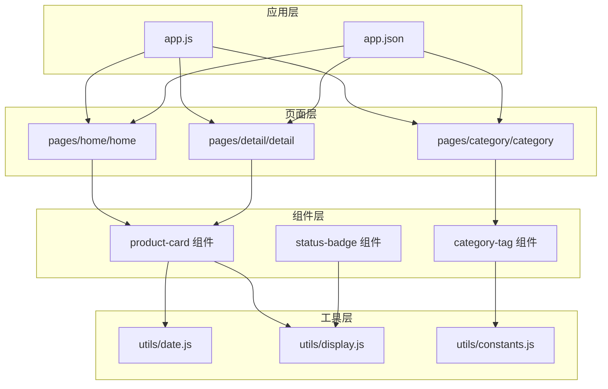
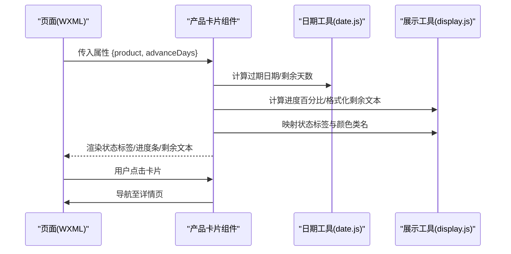
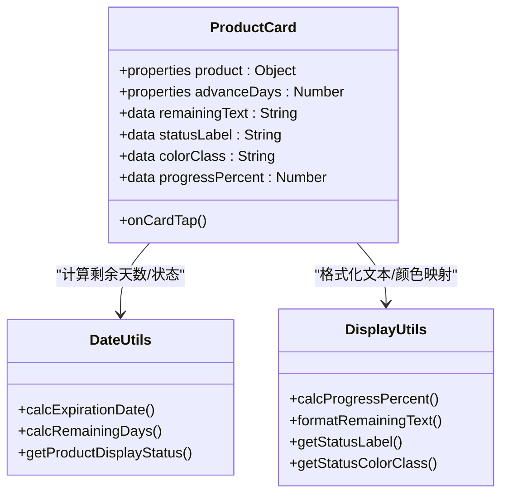
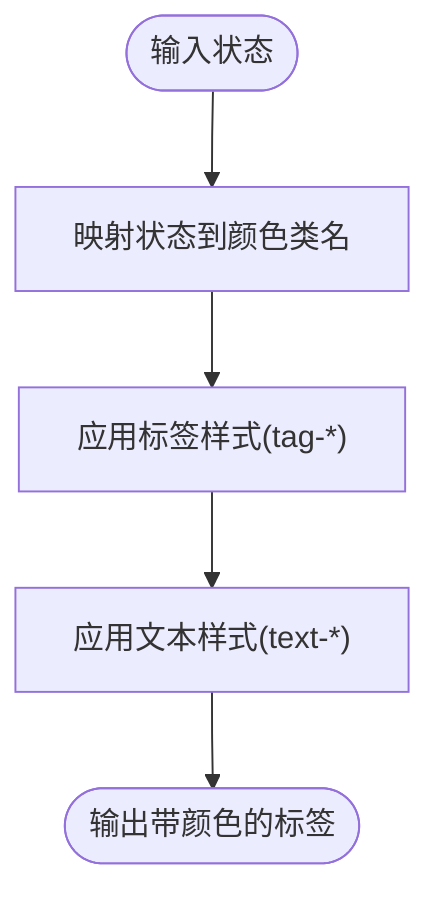
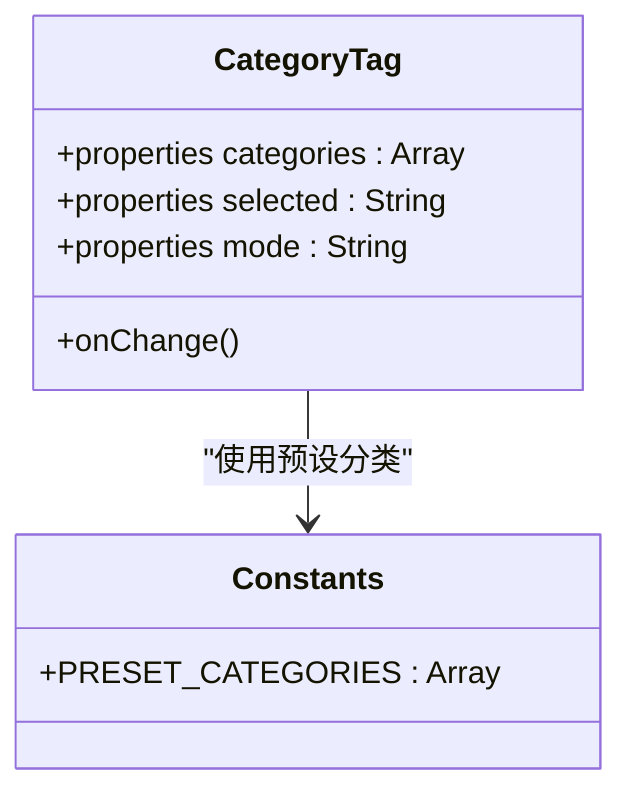
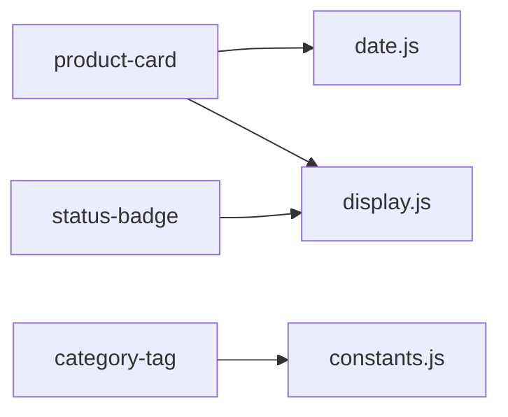

# UI组件系统

<cite>
**本文引用的文件**
- [miniprogram/components/product-card/product-card.js](file://miniprogram/components/product-card/product-card.js)
- [miniprogram/components/product-card/product-card.json](file://miniprogram/components/product-card/product-card.json)
- [miniprogram/components/product-card/product-card.wxml](file://miniprogram/components/product-card/product-card.wxml)
- [miniprogram/components/product-card/product-card.wxss](file://miniprogram/components/product-card/product-card.wxss)
- [miniprogram/utils/date.js](file://miniprogram/utils/date.js)
- [miniprogram/utils/display.js](file://miniprogram/utils/display.js)
- [miniprogram/utils/constants.js](file://miniprogram/utils/constants.js)
- [miniprogram/app.js](file://miniprogram/app.js)
- [miniprogram/app.json](file://miniprogram/app.json)
</cite>

## 目录
1. [简介](#简介)
2. [项目结构](#项目结构)
3. [核心组件](#核心组件)
4. [架构总览](#架构总览)
5. [详细组件分析](#详细组件分析)
6. [依赖关系分析](#依赖关系分析)
7. [性能考量](#性能考量)
8. [故障排查指南](#故障排查指南)
9. [结论](#结论)
10. [附录](#附录)

## 简介
本文件面向“UI组件系统”的使用者与贡献者，聚焦于三个核心UI组件：产品卡片、状态标签与分类标签。文档从设计理念、数据绑定、状态显示、交互逻辑、属性与事件、插槽与样式扩展、到组合使用模式与最佳实践进行系统性阐述，帮助快速理解与高效集成。

## 项目结构
- 组件层：位于 miniprogram/components 下，按功能拆分，便于复用与维护。
- 工具层：位于 miniprogram/utils，封装日期计算、展示格式化与常量定义，供组件与页面共享。
- 页面层：位于 miniprogram/pages，承载业务场景，通过 WXML 引用组件。
- 应用层：miniprogram/app.js 与 app.json 提供全局初始化与页面路由配置。

图表来源
- [miniprogram/app.js:13-31](file://miniprogram/app.js#L13-L31)
- [miniprogram/app.json:2-51](file://miniprogram/app.json#L2-L51)
- [miniprogram/components/product-card/product-card.js:7-50](file://miniprogram/components/product-card/product-card.js#L7-L50)
- [miniprogram/utils/date.js:6-75](file://miniprogram/utils/date.js#L6-L75)
- [miniprogram/utils/display.js:6-75](file://miniprogram/utils/display.js#L6-L75)
- [miniprogram/utils/constants.js:6-99](file://miniprogram/utils/constants.js#L6-L99)

章节来源
- [miniprogram/app.js:13-31](file://miniprogram/app.js#L13-L31)
- [miniprogram/app.json:2-51](file://miniprogram/app.json#L2-L51)

## 核心组件
本节概述三个核心UI组件的职责与协作方式：
- 产品卡片组件：负责展示产品基本信息、状态标签与保质期进度，支持点击跳转详情页。
- 状态标签组件：根据状态映射颜色与文本，提供统一的视觉反馈。
- 分类标签组件：用于分类筛选与交互式展示，结合预设分类常量使用。

章节来源
- [miniprogram/components/product-card/product-card.js:7-50](file://miniprogram/components/product-card/product-card.js#L7-L50)
- [miniprogram/utils/display.js:40-75](file://miniprogram/utils/display.js#L40-L75)
- [miniprogram/utils/constants.js:14-21](file://miniprogram/utils/constants.js#L14-L21)

## 架构总览
组件与工具之间的调用关系如下：

图表来源
- [miniprogram/components/product-card/product-card.js:19-33](file://miniprogram/components/product-card/product-card.js#L19-L33)
- [miniprogram/utils/date.js:25-57](file://miniprogram/utils/date.js#L25-L57)
- [miniprogram/utils/display.js:13-27](file://miniprogram/utils/display.js#L13-L27)
- [miniprogram/utils/display.js:34-68](file://miniprogram/utils/display.js#L34-L68)

## 详细组件分析

### 产品卡片组件
- 设计理念
  - 以“信息密度高、状态可视化”为核心，通过颜色类名与进度条直观传达产品状态。
  - 支持点击进入详情页，提升用户操作效率。
- 数据绑定
  - 输入属性：product（对象）、advanceDays（数字）。
  - 观察器：监听 product 与 advanceDays 的变化，重新计算剩余天数、状态标签、颜色类名与进度百分比。
  - 输出数据：remainingText、statusLabel、colorClass、progressPercent。
- 状态显示
  - 颜色编码：安全/警告/危险/次要，分别映射不同背景与文本颜色。
  - 文本提示：剩余天数、今日到期、已过期等人性化文案。
- 交互逻辑
  - 点击卡片触发导航至详情页，依据 product._id 进行路由拼接。
- 属性定义
  - product：必填，包含名称、分类、规格、生产日期、保质期、开封日期与开封后保质期等字段。
  - advanceDays：可选，默认30，决定“即将过期”的阈值。
- 事件处理
  - onCardTap：点击卡片时触发，执行页面跳转。
- 插槽使用
  - 当前模板未使用插槽；若需扩展，可在 WXML 中增加 slot 容器并配合 JS setData 动态渲染。
- 自定义样式选项
  - 通过 colorClass 动态绑定类名，结合 WXSS 中的 icon-*、tag-*、text-* 与 progress-* 类实现主题化。
- 组合使用模式
  - 在首页与库存页列表中批量渲染，结合分页或滚动加载优化性能。
  - 与状态标签组件组合，统一状态呈现风格。
- 最佳实践
  - 保持 product 结构一致性，避免空值导致的异常。
  - 合理设置 advanceDays，平衡提醒及时性与信息噪音。
  - 在 WXML 中对长文本进行截断，保证布局稳定。

图表来源
- [miniprogram/components/product-card/product-card.js:8-49](file://miniprogram/components/product-card/product-card.js#L8-L49)
- [miniprogram/utils/date.js:25-57](file://miniprogram/utils/date.js#L25-L57)
- [miniprogram/utils/display.js:13-68](file://miniprogram/utils/display.js#L13-L68)

章节来源
- [miniprogram/components/product-card/product-card.js:7-50](file://miniprogram/components/product-card/product-card.js#L7-L50)
- [miniprogram/components/product-card/product-card.wxml:5-28](file://miniprogram/components/product-card/product-card.wxml#L5-L28)
- [miniprogram/components/product-card/product-card.wxss:27-121](file://miniprogram/components/product-card/product-card.wxss#L27-L121)

### 状态标签组件
- 设计理念
  - 以“状态即语言”为目标，通过颜色与文本快速传达产品状态。
- 颜色编码系统
  - 安全：绿色系，表示可用状态。
  - 警告：橙色系，表示即将过期。
  - 危险：红色系，表示已过期。
  - 次要：灰色系，表示已用完或已丢弃。
- 动态样式更新
  - 通过状态映射函数返回颜色类名，结合 WXSS 中的 tag-* 与 text-* 类实现动态样式切换。
- 视觉反馈机制
  - 圆角背景、紧凑字号与对比色文本，确保在小尺寸标签中的可读性。
- 属性与事件
  - 推荐属性：status（枚举值），可扩展为 label、colorClass 等。
  - 事件：可扩展点击回调，用于状态切换或筛选联动。
- 插槽与样式
  - 若需要自定义图标或文案，可在模板中预留 slot 并通过 JS setData 控制显示。
- 组合使用模式
  - 与产品卡片并列展示，或作为筛选条件的一部分。
- 最佳实践
  - 保持状态枚举与映射表一致，避免未知状态导致的样式缺失。
  - 在多处使用时集中管理样式变量，确保视觉一致性。

图表来源
- [miniprogram/utils/display.js:55-68](file://miniprogram/utils/display.js#L55-L68)
- [miniprogram/utils/display.js:40-53](file://miniprogram/utils/display.js#L40-L53)

章节来源
- [miniprogram/utils/display.js:40-75](file://miniprogram/utils/display.js#L40-L75)

### 分类标签组件
- 设计理念
  - 以“可筛选、可交互”为核心，支持分类维度的快速选择与状态管理。
- 筛选功能
  - 基于预设分类列表，提供分类名称与排序字段，便于构建筛选面板。
- 交互式设计
  - 支持选中态与禁用态，结合颜色与边框突出当前筛选项。
- 状态管理
  - 维护当前选中分类与可用分类集合，支持多选或单选模式。
- 属性与事件
  - 推荐属性：categories（预设分类数组）、selected（当前选中分类）、mode（单选/多选）。
  - 事件：onChange(selectedCategories)，用于通知父级更新筛选结果。
- 插槽与样式
  - 可扩展图标插槽与徽标插槽，增强分类表达力。
- 组合使用模式
  - 与产品卡片列表组合，实现“分类筛选 + 列表展示”的完整流程。
- 最佳实践
  - 保持 categories 与业务分类一致，避免无效分类导致的筛选异常。
  - 在页面中缓存筛选状态，提升用户体验。

图表来源
- [miniprogram/utils/constants.js:14-21](file://miniprogram/utils/constants.js#L14-L21)

章节来源
- [miniprogram/utils/constants.js:14-21](file://miniprogram/utils/constants.js#L14-L21)

## 依赖关系分析
- 组件与工具的耦合
  - 产品卡片组件强依赖日期与展示工具，确保状态与进度的准确性。
  - 状态标签与分类标签组件依赖展示工具与常量定义，保证视觉与数据的一致性。
- 外部依赖
  - 微信小程序框架提供的组件化机制、WXML/WXSS 语法与云开发能力。
- 潜在风险
  - 若 product 字段缺失或格式不规范，可能导致计算异常。
  - 状态枚举与映射表不一致会引发样式缺失或文案空白。

图表来源
- [miniprogram/components/product-card/product-card.js:4-5](file://miniprogram/components/product-card/product-card.js#L4-L5)
- [miniprogram/utils/date.js:6-75](file://miniprogram/utils/date.js#L6-L75)
- [miniprogram/utils/display.js:6-75](file://miniprogram/utils/display.js#L6-L75)
- [miniprogram/utils/constants.js:6-99](file://miniprogram/utils/constants.js#L6-L99)

章节来源
- [miniprogram/components/product-card/product-card.js:4-5](file://miniprogram/components/product-card/product-card.js#L4-L5)
- [miniprogram/utils/date.js:6-75](file://miniprogram/utils/date.js#L6-L75)
- [miniprogram/utils/display.js:6-75](file://miniprogram/utils/display.js#L6-L75)
- [miniprogram/utils/constants.js:6-99](file://miniprogram/utils/constants.js#L6-L99)

## 性能考量
- 计算开销
  - 日期计算与进度百分比在每次属性变更时重算，建议在高频更新场景中考虑节流或缓存策略。
- 渲染优化
  - 使用 observers 精准监听必要字段，避免不必要的 setData。
  - 在列表中使用虚拟滚动或分页，减少一次性渲染压力。
- 样式体积
  - 将颜色类名与尺寸变量集中管理，避免重复定义导致的WXSS膨胀。

## 故障排查指南
- 产品卡片无状态显示
  - 检查 product 是否包含生产日期、过期日期与状态字段。
  - 确认 advanceDays 设置是否合理，避免“即将过期”阈值过大或过小。
- 状态标签颜色异常
  - 核对状态枚举是否在映射表中存在，确保颜色类名正确。
- 分类标签筛选无效
  - 确认 categories 与 selected 的数据类型一致，检查 onChange 事件是否正确传递。
- 点击卡片无法跳转
  - 检查 product._id 是否存在，确认详情页路由配置正确。

章节来源
- [miniprogram/components/product-card/product-card.js:19-33](file://miniprogram/components/product-card/product-card.js#L19-L33)
- [miniprogram/utils/display.js:55-68](file://miniprogram/utils/display.js#L55-L68)
- [miniprogram/utils/constants.js:14-21](file://miniprogram/utils/constants.js#L14-L21)

## 结论
本UI组件系统通过清晰的职责划分与工具化封装，实现了状态可视化与交互体验的统一。产品卡片组件承担信息展示与导航，状态标签组件提供一致的视觉反馈，分类标签组件支撑筛选与交互。遵循本文的最佳实践与组合模式，可在保证性能的同时，快速构建高质量的界面与交互。

## 附录
- 全局配置
  - 应用初始化与云开发环境配置见 app.js。
  - 页面路由与 tabbar 配置见 app.json。
- 组件清单
  - 产品卡片组件：product-card
  - 状态标签组件：status-badge
  - 分类标签组件：category-tag

章节来源
- [miniprogram/app.js:13-31](file://miniprogram/app.js#L13-L31)
- [miniprogram/app.json:2-51](file://miniprogram/app.json#L2-L51)