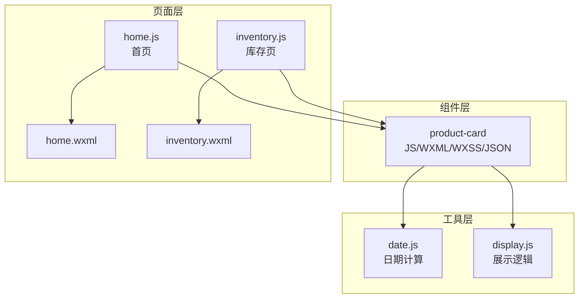
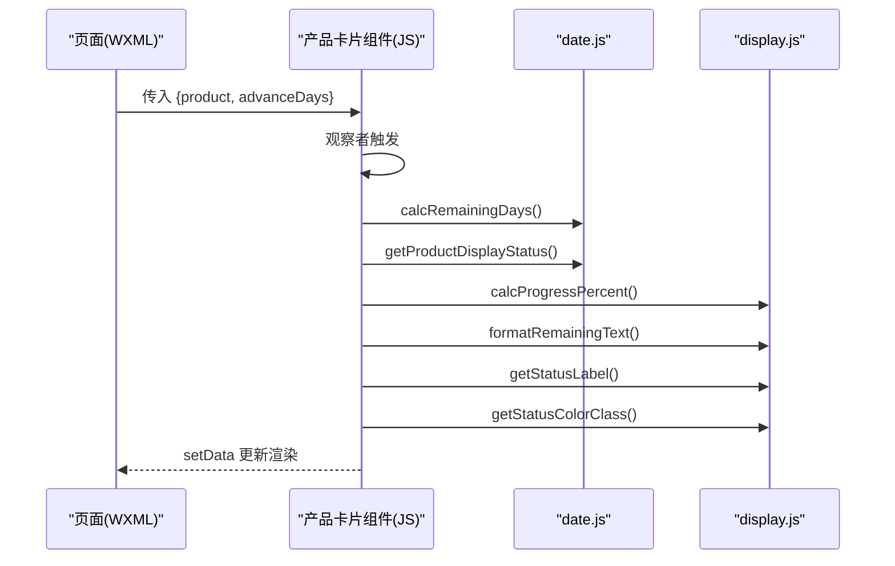
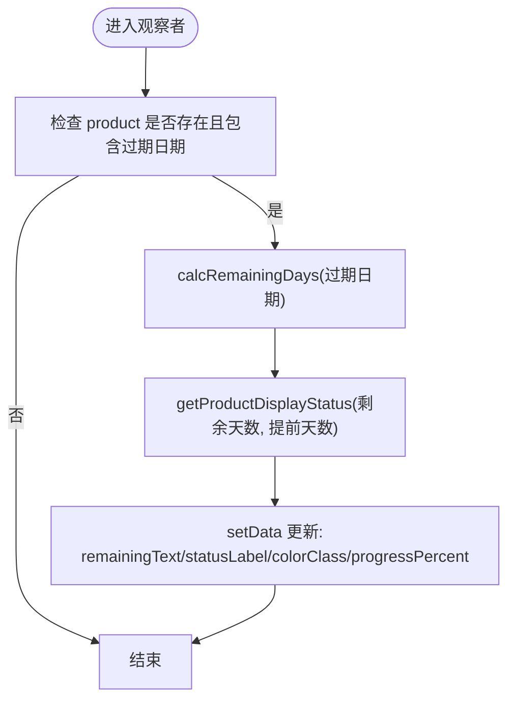
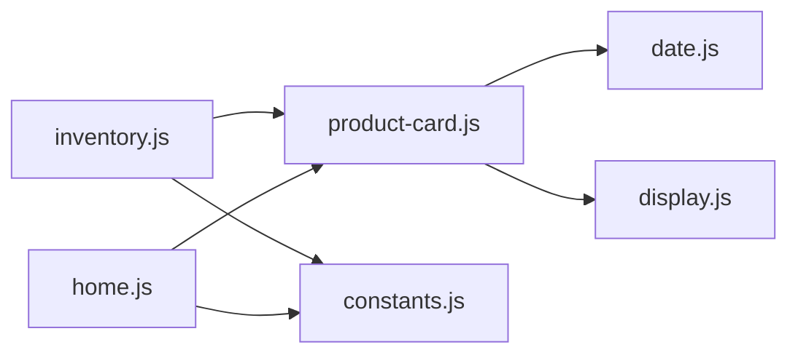

# 产品卡片组件

<cite>
**本文引用的文件**
- [product-card.js](file://miniprogram/components/product-card/product-card.js)
- [product-card.json](file://miniprogram/components/product-card/product-card.json)
- [product-card.wxml](file://miniprogram/components/product-card/product-card.wxml)
- [product-card.wxss](file://miniprogram/components/product-card/product-card.wxss)
- [date.js](file://miniprogram/utils/date.js)
- [display.js](file://miniprogram/utils/display.js)
- [constants.js](file://miniprogram/utils/constants.js)
- [home.js](file://miniprogram/pages/home/home.js)
- [inventory.js](file://miniprogram/pages/inventory/inventory.js)
- [home.wxml](file://miniprogram/pages/home/home.wxml)
- [inventory.wxml](file://miniprogram/pages/inventory/inventory.wxml)
</cite>

## 目录
1. [简介](#简介)
2. [项目结构](#项目结构)
3. [核心组件](#核心组件)
4. [架构总览](#架构总览)
5. [详细组件分析](#详细组件分析)
6. [依赖关系分析](#依赖关系分析)
7. [性能考虑](#性能考虑)
8. [故障排查指南](#故障排查指南)
9. [结论](#结论)
10. [附录](#附录)

## 简介
产品卡片组件用于在小程序中展示单个产品的关键信息与状态，包括产品名称、分类与规格、状态标签、进度条以及剩余保质期提示。组件通过观察者模式监听输入属性的变化，实时计算并更新展示状态；同时支持点击跳转到详情页的交互行为。组件采用模块化的工具函数进行日期与展示逻辑的封装，保证了可维护性与复用性。

## 项目结构
产品卡片组件位于组件目录中，并与通用工具函数共同协作：
- 组件层：product-card（JS/WXML/WXSS/JSON）
- 工具层：date.js（日期计算）、display.js（展示逻辑）
- 页面层：home/inventory 等页面通过 WXML 引入组件并传入数据

图表来源
- [product-card.js:1-51](file://miniprogram/components/product-card/product-card.js#L1-L51)
- [date.js:1-76](file://miniprogram/utils/date.js#L1-L76)
- [display.js:1-76](file://miniprogram/utils/display.js#L1-L76)
- [home.js:1-119](file://miniprogram/pages/home/home.js#L1-L119)
- [inventory.js:1-117](file://miniprogram/pages/inventory/inventory.js#L1-L117)
- [home.wxml:1-105](file://miniprogram/pages/home/home.wxml#L1-L105)
- [inventory.wxml:1-89](file://miniprogram/pages/inventory/inventory.wxml#L1-L89)

章节来源
- [product-card.js:1-51](file://miniprogram/components/product-card/product-card.js#L1-L51)
- [product-card.json:1-3](file://miniprogram/components/product-card/product-card.json#L1-L3)
- [product-card.wxml:1-29](file://miniprogram/components/product-card/product-card.wxml#L1-L29)
- [product-card.wxss:1-122](file://miniprogram/components/product-card/product-card.wxss#L1-L122)
- [date.js:1-76](file://miniprogram/utils/date.js#L1-L76)
- [display.js:1-76](file://miniprogram/utils/display.js#L1-L76)
- [home.js:1-119](file://miniprogram/pages/home/home.js#L1-L119)
- [inventory.js:1-117](file://miniprogram/pages/inventory/inventory.js#L1-L117)
- [home.wxml:1-105](file://miniprogram/pages/home/home.wxml#L1-L105)
- [inventory.wxml:1-89](file://miniprogram/pages/inventory/inventory.wxml#L1-L89)

## 核心组件
- 组件职责：接收产品对象与提前天数参数，基于日期与展示工具计算状态标签、颜色类名、进度百分比与剩余天数文本，并在 WXML 中渲染。
- 输入属性：
  - product：Object 类型，表示单个产品对象，包含生产日期、过期日期、状态等字段。
  - advanceDays：Number 类型，表示“即将过期”的判定阈值，默认 30 天。
- 观察者：监听 product 与 advanceDays 的变化，触发内部数据更新。
- 方法：onCardTap，用于点击卡片后跳转至详情页。

章节来源
- [product-card.js:7-50](file://miniprogram/components/product-card/product-card.js#L7-L50)

## 架构总览
组件通过观察者模式驱动数据更新，调用工具函数完成业务逻辑计算，再由 WXML/WXSS 渲染最终 UI。页面层通过 WXML 将数据传入组件，实现列表渲染与交互。

图表来源
- [product-card.js:19-33](file://miniprogram/components/product-card/product-card.js#L19-L33)
- [date.js:42-57](file://miniprogram/utils/date.js#L42-L57)
- [display.js:13-68](file://miniprogram/utils/display.js#L13-L68)
- [inventory.wxml:60-66](file://miniprogram/pages/inventory/inventory.wxml#L60-L66)

## 详细组件分析

### 数据绑定与状态管理
- 输入属性：
  - product：包含生产日期、过期日期、状态等字段的对象。
  - advanceDays：提前天数阈值，决定“即将过期”状态的边界。
- 观察者：
  - 监听 product 与 advanceDays 的组合变化，当任一属性为空或缺失过期日期时直接返回。
  - 计算剩余天数、展示状态、进度百分比、剩余天数文本、状态标签与颜色类名，并通过 setData 更新组件内部 data。
- 内部 data：
  - remainingText：剩余天数文本
  - statusLabel：状态标签
  - colorClass：颜色类名（safe/warning/danger/secondary）
  - progressPercent：进度百分比

章节来源
- [product-card.js:8-40](file://miniprogram/components/product-card/product-card.js#L8-L40)

### 工具函数与算法
- 日期计算（date.js）：
  - addMonths：给日期字符串加指定月数，处理月末溢出问题。
  - calcExpirationDate：根据未开封保质期与开封后保质期，取较小值作为实际过期日期。
  - calcRemainingDays：计算距离过期的天数（正数=剩余天，0=当天过期，负数=已过期天数）。
  - getProductDisplayStatus：根据剩余天数与提前天数返回展示状态（in_use/expiring_soon/expired）。
  - formatDate：格式化日期为 YYYY-MM-DD。
- 展示逻辑（display.js）：
  - calcProgressPercent：计算已用时间占总保质期的百分比。
  - formatRemainingText：将剩余天数格式化为中文提示文本。
  - getStatusLabel：根据状态码返回中文标签。
  - getStatusColorClass：根据状态码返回颜色类名。

图表来源
- [product-card.js:19-33](file://miniprogram/components/product-card/product-card.js#L19-L33)
- [date.js:42-57](file://miniprogram/utils/date.js#L42-L57)
- [display.js:13-68](file://miniprogram/utils/display.js#L13-L68)

章节来源
- [date.js:10-57](file://miniprogram/utils/date.js#L10-L57)
- [display.js:13-68](file://miniprogram/utils/display.js#L13-L68)

### WXML 模板结构
- 结构组成：
  - 顶部区域：图标容器（根据 colorClass 应用不同渐变背景）、产品名称、分类与规格信息、状态标签。
  - 底部区域：进度条（根据 progressPercent 设置宽度）、剩余天数文本。
- 绑定规则：
  - 图标类名：icon-{{colorClass}}
  - 状态标签类名：tag-{{colorClass}}
  - 文本颜色：text-{{colorClass}}
  - 进度条宽度：style="width: {{progressPercent}}%"
  - 点击事件：bindtap="onCardTap"

章节来源
- [product-card.wxml:5-28](file://miniprogram/components/product-card/product-card.wxml#L5-L28)

### WXSS 样式设计
- 主题变量：使用 CSS 自定义属性（如 --space-md、--font-h3-size 等）统一间距与字号。
- 颜色体系：
  - 安全（safe）：绿色系渐变背景与深绿文字
  - 警告（warning）：橙黄色系渐变背景与深橙文字
  - 危险（danger）：浅红背景与深红文字
  - 次要（secondary）：浅灰背景与次要文字色
- 布局要点：
  - 顶部 flex 布局，图标、信息、标签三段式排列
  - 底部 flex 布局，进度条自适应宽度，剩余文本固定宽度
  - 文本截断与省略号处理，确保在窄屏下可读

章节来源
- [product-card.wxss:5-122](file://miniprogram/components/product-card/product-card.wxss#L5-L122)

### 组件生命周期与事件处理
- 生命周期：组件初始化后，观察者会根据传入的 product 与 advanceDays 自动计算并渲染。
- 点击事件：onCardTap 在组件内捕获点击，若存在有效产品 ID，则跳转到详情页。

章节来源
- [product-card.js:42-49](file://miniprogram/components/product-card/product-card.js#L42-L49)

### 页面集成与使用示例
- 库存页（inventory）：
  - 使用 wx:for 列表渲染产品卡片，逐项传入 product 与 advanceDays。
  - 支持搜索、分类筛选、状态过滤与分页加载。
- 首页（home）：
  - 首页使用原生 WXML 组件展示“即将过期”与“最近添加”，但产品卡片组件同样可在此处复用。

章节来源
- [inventory.wxml:58-66](file://miniprogram/pages/inventory/inventory.wxml#L58-L66)
- [home.wxml:34-58](file://miniprogram/pages/home/home.wxml#L34-L58)

## 依赖关系分析
- 组件对工具函数的依赖：
  - date.js：calcRemainingDays、getProductDisplayStatus
  - display.js：calcProgressPercent、formatRemainingText、getStatusLabel、getStatusColorClass
- 页面对组件的依赖：
  - inventory 页面通过 WXML 引入并传参
- 常量与状态：
  - constants.js 定义了产品状态枚举与预设分类，供页面层使用

图表来源
- [product-card.js:4-5](file://miniprogram/components/product-card/product-card.js#L4-L5)
- [date.js:69-76](file://miniprogram/utils/date.js#L69-L76)
- [display.js:70-76](file://miniprogram/utils/display.js#L70-L76)
- [inventory.js](file://miniprogram/pages/inventory/inventory.js#L6)
- [home.js](file://miniprogram/pages/home/home.js#L6)
- [constants.js:6-12](file://miniprogram/utils/constants.js#L6-L12)

章节来源
- [product-card.js:4-5](file://miniprogram/components/product-card/product-card.js#L4-L5)
- [date.js:69-76](file://miniprogram/utils/date.js#L69-L76)
- [display.js:70-76](file://miniprogram/utils/display.js#L70-L76)
- [inventory.js](file://miniprogram/pages/inventory/inventory.js#L6)
- [home.js](file://miniprogram/pages/home/home.js#L6)
- [constants.js:6-12](file://miniprogram/utils/constants.js#L6-L12)

## 性能考虑
- 观察者触发频率控制：仅在 product 或 advanceDays 发生变化时触发计算，避免不必要的重复渲染。
- 计算范围最小化：工具函数均以日期字符串与数值为主，计算复杂度低，适合频繁调用。
- 列表渲染优化：页面侧应合理设置 wx:key，减少节点重排；必要时可引入虚拟滚动以提升长列表性能。
- 样式复用：通过颜色类名与主题变量统一风格，减少样式计算开销。

## 故障排查指南
- 无数据显示：
  - 检查传入的 product 是否包含过期日期字段；若缺失则观察者不会更新。
  - 确认 advanceDays 为合法数值。
- 状态显示异常：
  - 检查日期格式是否为 YYYY-MM-DD；工具函数依赖该格式。
  - 确认产品状态字段是否为受支持的状态枚举值。
- 点击无响应：
  - 确认 product._id 存在且有效；组件仅在存在有效 ID 时执行跳转。
- 样式错乱：
  - 检查 colorClass 是否为 safe/warning/danger/secondary 之一；否则将使用默认 secondary 样式。

章节来源
- [product-card.js:19-49](file://miniprogram/components/product-card/product-card.js#L19-L49)
- [date.js:42-57](file://miniprogram/utils/date.js#L42-L57)
- [display.js:66-68](file://miniprogram/utils/display.js#L66-L68)

## 结论
产品卡片组件通过清晰的数据流与工具函数解耦，实现了高内聚、低耦合的展示层设计。其观察者模式确保了数据变更的即时反映，配合 WXSS 的主题化样式体系，提供了良好的用户体验与可维护性。在实际使用中，建议结合页面层的筛选与分页能力，进一步提升性能与交互体验。

## 附录

### 组件属性与方法速览
- 属性
  - product：Object，必填
  - advanceDays：Number，默认 30
- 内部 data
  - remainingText：String
  - statusLabel：String
  - colorClass：String（safe/warning/danger/secondary）
  - progressPercent：Number（0-100）
- 方法
  - onCardTap()：点击卡片跳转详情页

章节来源
- [product-card.js:8-49](file://miniprogram/components/product-card/product-card.js#L8-L49)

### 使用示例（路径指引）
- 在库存页中使用组件：
  - WXML：在 wx:for 循环中引入 product-card，并传入 product 与 advanceDays。
  - JS：页面数据中包含 products 列表与 advanceDays。
- 在首页中使用组件：
  - 首页可直接使用原生 WXML 展示“即将过期”与“最近添加”，但产品卡片组件亦可按相同方式复用。

章节来源
- [inventory.wxml:58-66](file://miniprogram/pages/inventory/inventory.wxml#L58-L66)
- [home.wxml:34-58](file://miniprogram/pages/home/home.wxml#L34-L58)

### 最佳实践
- 保持 product 字段完整性：确保包含生产日期、过期日期与状态字段。
- 合理设置 advanceDays：根据业务需求调整阈值，平衡“即将过期”提醒的敏感度。
- 统一日期格式：严格使用 YYYY-MM-DD，避免解析错误。
- 控制列表长度与分页：在长列表场景中启用分页或虚拟滚动，降低渲染压力。
- 样式一致性：遵循 colorClass 与主题变量命名规范，确保视觉一致。