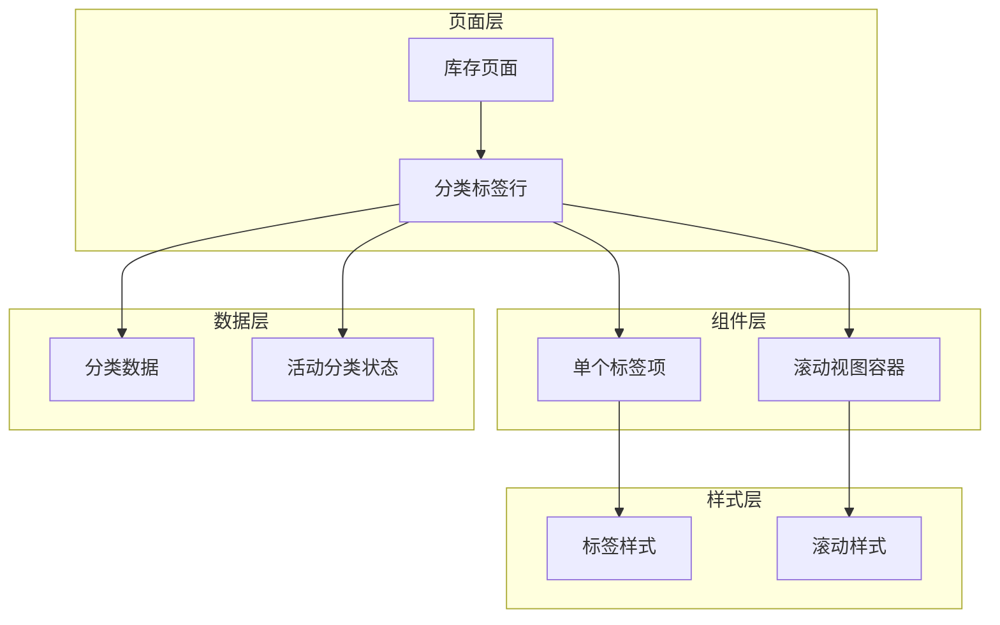
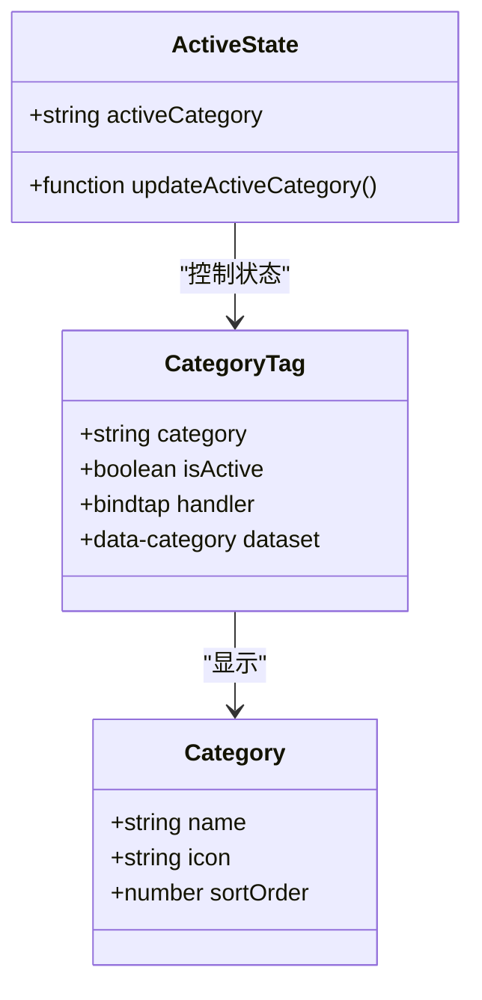
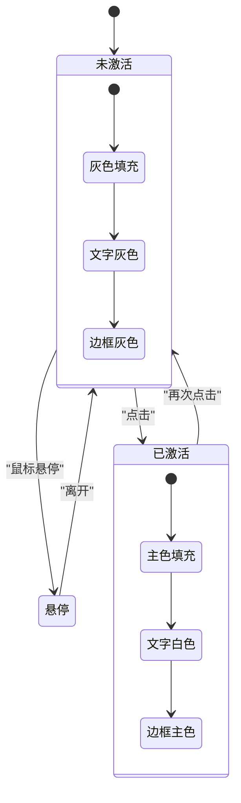
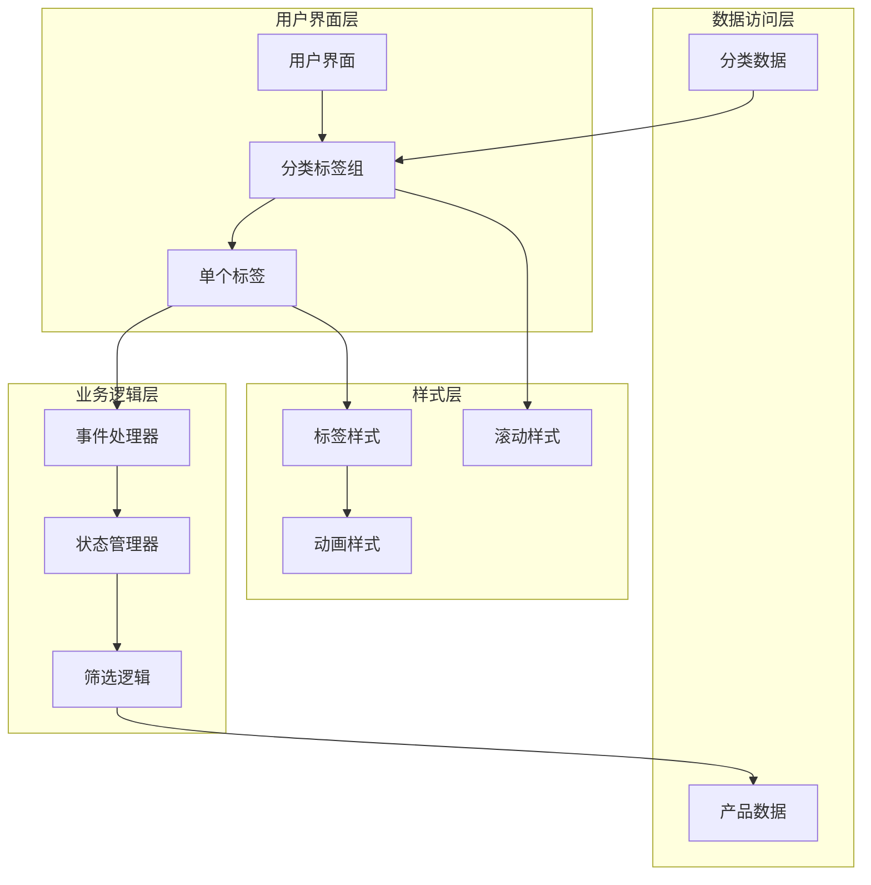
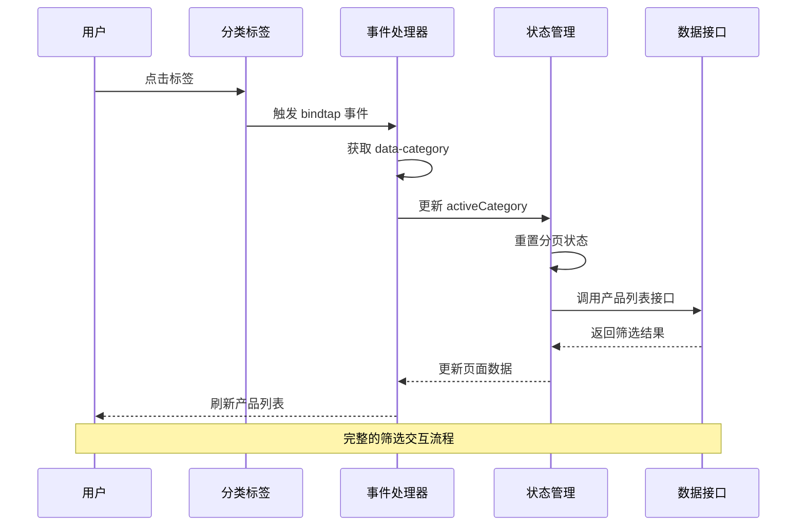
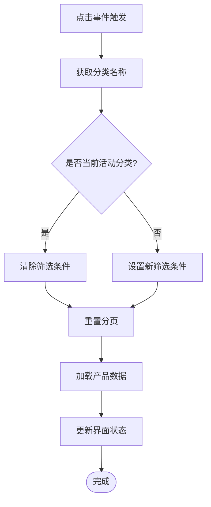
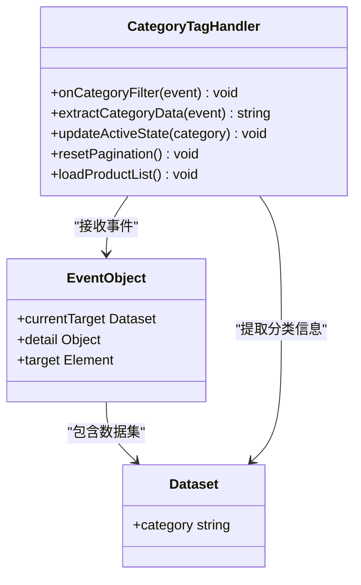
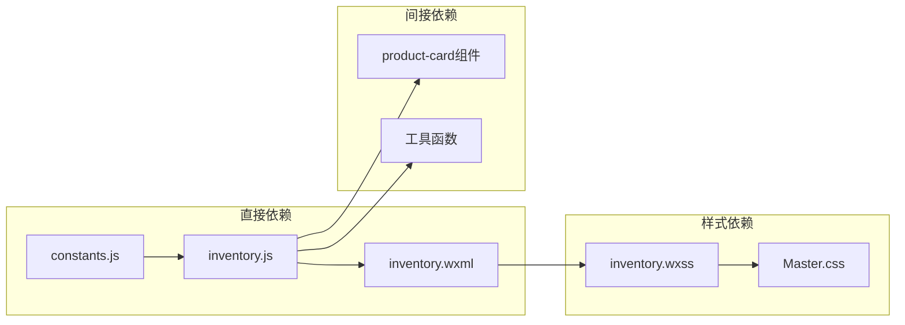
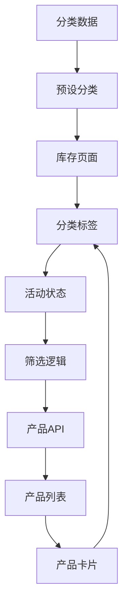

# 分类标签组件

<cite>
**本文档引用的文件**
- [inventory.js](file://miniprogram/pages/inventory/inventory.js)
- [inventory.wxml](file://miniprogram/pages/inventory/inventory.wxml)
- [inventory.wxss](file://miniprogram/pages/inventory/inventory.wxss)
- [constants.js](file://miniprogram/utils/constants.js)
- [Master.md](file://design-system/Master.md)
- [inventory.md](file://design-system/pages/inventory.md)
- [product-card.js](file://miniprogram/components/product-card/product-card.js)
- [product-card.wxml](file://miniprogram/components/product-card/product-card.wxml)
- [product-card.wxss](file://miniprogram/components/product-card/product-card.wxss)
</cite>

## 目录
1. [简介](#简介)
2. [项目结构](#项目结构)
3. [核心组件](#核心组件)
4. [架构概览](#架构概览)
5. [详细组件分析](#详细组件分析)
6. [依赖分析](#依赖分析)
7. [性能考虑](#性能考虑)
8. [故障排除指南](#故障排除指南)
9. [结论](#结论)
10. [附录](#附录)

## 简介

分类标签组件是化妆品库存管理系统中的核心筛选组件，负责实现产品的分类筛选功能。该组件采用胶囊式标签设计，支持横向滚动展示，提供直观的视觉反馈和流畅的交互体验。

组件实现了完整的筛选状态管理机制，包括：
- 分类选择状态的可视化反馈
- 动态数据绑定和状态切换
- 事件传递和回调机制
- 响应式布局和用户体验优化

## 项目结构

分类标签组件位于库存管理页面中，采用微信小程序原生组件架构：



**图表来源**
- [inventory.wxml:23-37](file://miniprogram/pages/inventory/inventory.wxml#L23-L37)
- [inventory.wxss:42-65](file://miniprogram/pages/inventory/inventory.wxss#L42-L65)

**章节来源**
- [inventory.wxml:1-89](file://miniprogram/pages/inventory/inventory.wxml#L1-L89)
- [inventory.wxss:1-72](file://miniprogram/pages/inventory/inventory.wxss#L1-L72)

## 核心组件

### 数据结构定义

组件使用预设分类数组作为数据源，每个分类对象包含以下属性：
- `name`: 分类名称（字符串）
- `icon`: 图标标识（字符串）
- `sortOrder`: 排序权重（数字）



**图表来源**
- [constants.js:14-21](file://miniprogram/utils/constants.js#L14-L21)
- [inventory.js:11-21](file://miniprogram/pages/inventory/inventory.js#L11-L21)

### 状态管理机制

组件采用双向数据绑定实现状态同步：



**图表来源**
- [inventory.wxss:61-65](file://miniprogram/pages/inventory/inventory.wxss#L61-L65)
- [inventory.wxml:26-36](file://miniprogram/pages/inventory/inventory.wxml#L26-L36)

**章节来源**
- [constants.js:14-21](file://miniprogram/utils/constants.js#L14-L21)
- [inventory.js:11-21](file://miniprogram/pages/inventory/inventory.js#L11-L21)

## 架构概览

### 整体架构设计



**图表来源**
- [inventory.js:40-49](file://miniprogram/pages/inventory/inventory.js#L40-L49)
- [inventory.wxml:24-36](file://miniprogram/pages/inventory/inventory.wxml#L24-L36)

### 交互流程



**图表来源**
- [inventory.js:40-49](file://miniprogram/pages/inventory/inventory.js#L40-L49)
- [inventory.wxml:27-36](file://miniprogram/pages/inventory/inventory.wxml#L27-L36)

## 详细组件分析

### 标签渲染机制

组件采用模板循环渲染方式，支持动态数据绑定：

```mermaid
flowchart TD
Start([开始渲染]) --> InitData[初始化分类数据]
InitData --> CheckEmpty{是否有分类数据?}
CheckEmpty --> |否| ShowEmpty[显示空状态]
CheckEmpty --> |是| RenderAll[渲染"全部"标签]
RenderAll --> LoopCategories[遍历分类数组]
LoopCategories --> CreateTag[创建标签元素]
CreateTag --> BindEvents[绑定点击事件]
BindEvents --> SetClasses[设置样式类]
SetClasses --> CheckActive{是否为活动状态?}
CheckActive --> |是| AddActiveClass[添加激活样式]
CheckActive --> |否| SkipActive[保持默认样式]
AddActiveClass --> NextTag[下一个标签]
SkipActive --> NextTag
NextTag --> MoreTags{还有标签吗?}
MoreTags --> |是| LoopCategories
MoreTags --> |否| Complete[渲染完成]
ShowEmpty --> Complete
Complete --> End([结束])
```

**图表来源**
- [inventory.wxml:24-36](file://miniprogram/pages/inventory/inventory.wxml#L24-L36)
- [constants.js:14-21](file://miniprogram/utils/constants.js#L14-L21)

### 状态切换算法



**图表来源**
- [inventory.js:40-49](file://miniprogram/pages/inventory/inventory.js#L40-L49)

### 样式设计原则

组件遵循设计系统的统一规范：

| 设计属性 | 值 | 用途 |
|---------|-----|------|
| 圆角半径 | 8px | 标签胶囊形状 |
| 字体大小 | 12px | 标签文字 |
| 字体重量 | 600 | 半粗体强调 |
| 内边距 | 4px 10px | 文字与边框距离 |
| 动画时长 | 200ms | 状态切换反馈 |

**章节来源**
- [inventory.wxss:48-65](file://miniprogram/pages/inventory/inventory.wxss#L48-L65)
- [Master.md:161-165](file://design-system/Master.md#L161-L165)

### 事件处理机制

组件采用微信小程序的标准事件处理模式：



**图表来源**
- [inventory.js:40-49](file://miniprogram/pages/inventory/inventory.js#L40-L49)
- [inventory.wxml:27-36](file://miniprogram/pages/inventory/inventory.wxml#L27-L36)

**章节来源**
- [inventory.js:40-49](file://miniprogram/pages/inventory/inventory.js#L40-L49)

## 依赖分析

### 组件间依赖关系



**图表来源**
- [constants.js:14-21](file://miniprogram/utils/constants.js#L14-L21)
- [inventory.js](file://miniprogram/pages/inventory/inventory.js#L6)
- [inventory.wxml](file://miniprogram/pages/inventory/inventory.wxml#L1)

### 数据流依赖



**图表来源**
- [constants.js:14-21](file://miniprogram/utils/constants.js#L14-L21)
- [inventory.js:11-21](file://miniprogram/pages/inventory/inventory.js#L11-L21)

**章节来源**
- [constants.js:14-21](file://miniprogram/utils/constants.js#L14-L21)
- [inventory.js](file://miniprogram/pages/inventory/inventory.js#L6)

## 性能考虑

### 渲染优化策略

1. **虚拟滚动优化**: 当分类数量较多时，采用横向滚动避免布局重排
2. **按需加载**: 仅在用户交互时触发数据请求
3. **状态缓存**: 缓存筛选状态减少重复计算
4. **事件节流**: 防止快速点击导致的重复请求

### 内存管理

- 使用 `wx:key` 优化列表渲染性能
- 及时清理事件监听器
- 合理使用数据绑定避免不必要的重渲染

## 故障排除指南

### 常见问题及解决方案

| 问题类型 | 症状 | 解决方案 |
|---------|------|----------|
| 标签不响应点击 | 无任何交互反馈 | 检查 bindtap 事件绑定和 data-category 数据集 |
| 状态样式不正确 | 激活状态显示异常 | 验证 activeCategory 状态更新和样式类应用 |
| 数据不刷新 | 点击标签后产品列表不变 | 确认 loadProducts 方法调用和分页状态重置 |
| 性能问题 | 页面滚动卡顿 | 检查 wx:key 使用和列表渲染优化 |

**章节来源**
- [inventory.js:40-49](file://miniprogram/pages/inventory/inventory.js#L40-L49)
- [inventory.wxss:61-65](file://miniprogram/pages/inventory/inventory.wxss#L61-L65)

## 结论

分类标签组件通过简洁的架构设计和完善的交互机制，为用户提供直观高效的分类筛选体验。组件具备以下优势：

1. **设计理念统一**: 严格遵循设计系统规范，保证视觉一致性
2. **交互反馈完善**: 提供即时的状态切换反馈和视觉提示
3. **性能优化到位**: 采用多种优化策略确保流畅的用户体验
4. **扩展性强**: 模块化设计便于功能扩展和定制开发

该组件为整个库存管理系统的数据筛选提供了坚实的基础，是提升用户体验的关键组件之一。

## 附录

### 使用示例

#### 基础用法
```html
<!-- 在页面WXML中引入 -->
<scroll-view class="category-scroll" scroll-x enable-flex>
  <view
    class="filter-tag {{activeCategory === '' ? 'filter-tag-active' : ''}}"
    bindtap="onCategoryFilter"
    data-category=""
  >全部</view>
  <view
    wx:for="{{categories}}"
    wx:key="name"
    class="filter-tag {{activeCategory === item.name ? 'filter-tag-active' : ''}}"
    bindtap="onCategoryFilter"
    data-category="{{item.name}}"
  >{{item.name}}</view>
</scroll-view>
```

#### 样式定制
```css
/* 自定义标签样式 */
.custom-filter-tag {
  background-color: var(--color-surface);
  border: 1px solid var(--color-border);
  color: var(--color-text-secondary);
}

.custom-filter-tag-active {
  background-color: var(--color-primary);
  color: #FFFFFF;
  border-color: var(--color-primary);
}
```

### 扩展定制指南

#### 功能扩展
1. **多级分类支持**: 在数据结构中添加父级分类字段
2. **搜索集成**: 添加分类搜索功能
3. **批量筛选**: 支持多个分类同时筛选
4. **自定义排序**: 允许用户自定义分类显示顺序

#### 样式定制
1. **主题适配**: 支持深色模式和浅色模式
2. **尺寸调整**: 提供大中小三种尺寸规格
3. **动画效果**: 自定义激活和取消激活的动画效果
4. **图标集成**: 支持在标签中显示分类图标

**章节来源**
- [inventory.wxml:24-36](file://miniprogram/pages/inventory/inventory.wxml#L24-L36)
- [inventory.wxss:48-65](file://miniprogram/pages/inventory/inventory.wxss#L48-L65)
- [Master.md:161-165](file://design-system/Master.md#L161-L165)