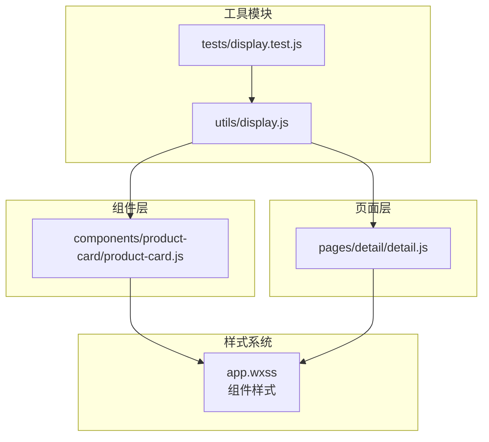
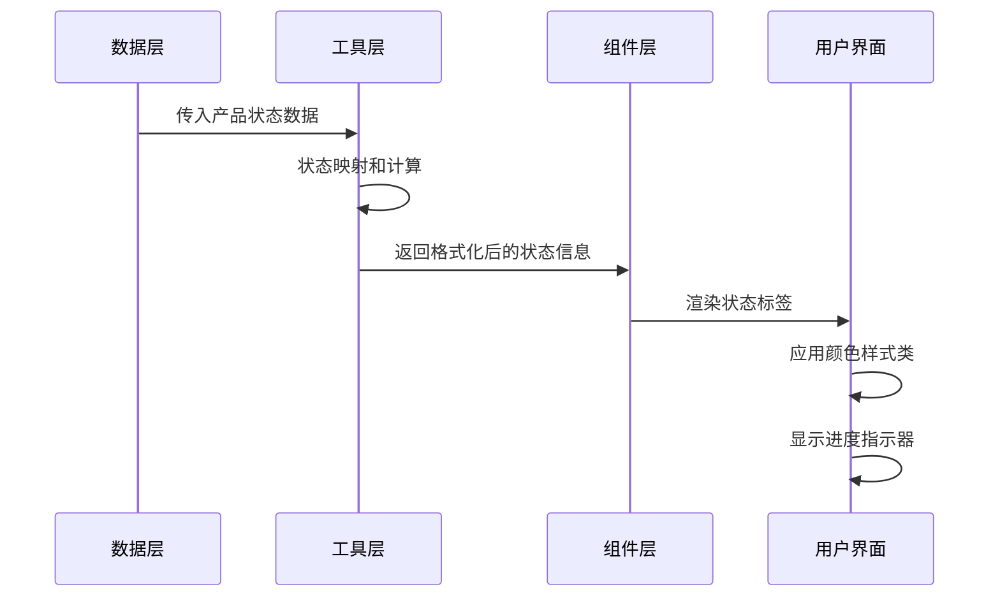
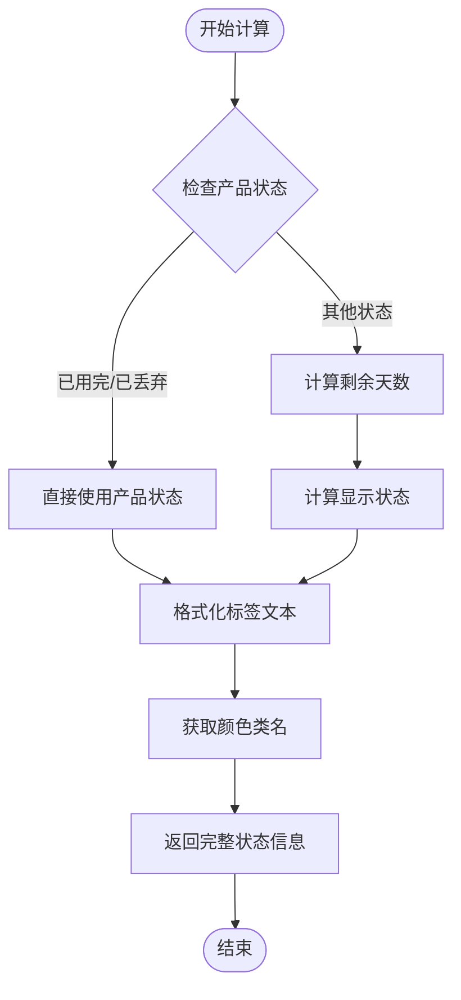
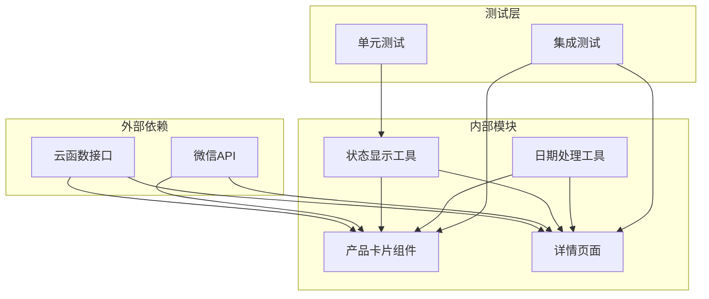

# 状态标签组件

<cite>
**本文档引用的文件**
- [display.js](file://miniprogram/utils/display.js)
- [display.test.js](file://tests/display.test.js)
- [product-card.js](file://miniprogram/components/product-card/product-card.js)
- [detail.js](file://miniprogram/pages/detail/detail.js)
</cite>

## 目录
1. [简介](#简介)
2. [项目结构](#项目结构)
3. [核心组件](#核心组件)
4. [架构概览](#架构概览)
5. [详细组件分析](#详细组件分析)
6. [依赖关系分析](#依赖关系分析)
7. [性能考虑](#性能考虑)
8. [故障排除指南](#故障排除指南)
9. [结论](#结论)

## 简介

状态标签组件是微信小程序中的一个核心UI组件，用于根据产品状态动态显示相应的标签文本和样式。该组件实现了完整的状态分类系统，包括安全、警告、危险、已用完、已丢弃等状态，并通过颜色编码机制提供直观的视觉反馈。

组件的核心功能基于状态标签映射系统，将内部状态值转换为用户友好的中文标签，并根据状态类型分配相应的颜色类名。这种设计确保了用户界面的一致性和可预测性。

## 项目结构

状态标签组件在整个项目中的位置和组织方式如下：

**图表来源**
- [display.js:1-76](file://miniprogram/utils/display.js#L1-L76)
- [product-card.js:1-51](file://miniprogram/components/product-card/product-card.js#L1-L51)
- [detail.js:1-122](file://miniprogram/pages/detail/detail.js#L1-L122)

**章节来源**
- [display.js:1-76](file://miniprogram/utils/display.js#L1-L76)
- [product-card.js:1-51](file://miniprogram/components/product-card/product-card.js#L1-L51)
- [detail.js:1-122](file://miniprogram/pages/detail/detail.js#L1-L122)

## 核心组件

### 状态标签映射系统

状态标签组件的核心是状态标签映射系统，它定义了内部状态值与用户可见标签之间的对应关系：

| 内部状态 | 中文标签 | 颜色类别 | 视觉含义 |
|---------|---------|---------|---------|
| in_use | 在用 | safe | 安全状态，绿色系 |
| expiring_soon | 即将过期 | warning | 警告状态，橙色系 |
| expired | 已过期 | danger | 危险状态，红色系 |
| used_up | 已用完 | secondary | 次要状态，灰色系 |
| discarded | 已丢弃 | secondary | 次要状态，灰色系 |

### 颜色编码机制

颜色编码系统采用统一的类名约定，支持以下颜色类别：
- **safe**: 表示安全状态，通常使用绿色调
- **warning**: 表示警告状态，通常使用橙色调  
- **danger**: 表示危险状态，通常使用红色调
- **secondary**: 表示次要状态，通常使用灰色调

### 视觉反馈设计

组件提供多层次的视觉反馈机制：

1. **文本标签**: 显示用户友好的状态描述
2. **颜色编码**: 通过背景色和边框色传达状态含义
3. **进度指示**: 对于在用产品，显示保质期使用进度
4. **动态更新**: 基于时间变化实时更新状态显示

**章节来源**
- [display.js:40-68](file://miniprogram/utils/display.js#L40-L68)
- [display.test.js:64-110](file://tests/display.test.js#L64-L110)

## 架构概览

状态标签组件采用分层架构设计，从底层的数据处理到上层的UI展示形成清晰的职责分离：

**图表来源**
- [display.js:48-75](file://miniprogram/utils/display.js#L48-L75)
- [product-card.js:19-32](file://miniprogram/components/product-card/product-card.js#L19-L32)

**章节来源**
- [display.js:1-76](file://miniprogram/utils/display.js#L1-L76)
- [product-card.js:1-51](file://miniprogram/components/product-card/product-card.js#L1-L51)

## 详细组件分析

### 状态计算引擎

状态计算引擎负责根据产品的时间参数计算当前显示状态：

**图表来源**
- [product-card.js:20-32](file://miniprogram/components/product-card/product-card.js#L20-L32)
- [detail.js:55-69](file://miniprogram/pages/detail/detail.js#L55-L69)

### 状态分类系统

状态分类系统基于时间维度和用户操作历史，实现了智能的状态判断机制：

#### 时间驱动状态
- **在用状态**: 产品仍在有效期内正常使用
- **即将过期**: 产品接近有效期，需要用户关注
- **已过期**: 产品超过有效期，存在风险

#### 用户操作状态
- **已用完**: 用户主动标记产品已使用完毕
- **已丢弃**: 用户主动标记产品已丢弃

**章节来源**
- [product-card.js:20-32](file://miniprogram/components/product-card/product-card.js#L20-L32)
- [detail.js:55-69](file://miniprogram/pages/detail/detail.js#L55-L69)

### 数据绑定和样式定制

组件通过数据绑定机制实现动态更新，支持多种样式定制选项：

#### 属性配置
- **product**: 产品对象，包含状态、生产日期、过期日期等信息
- **advanceDays**: 提前天数阈值，默认30天
- **statusLabel**: 状态标签文本
- **colorClass**: 颜色样式类名
- **progressPercent**: 保质期进度百分比

#### 样式定制选项
- **颜色主题**: 支持safe、warning、danger、secondary四种主题
- **尺寸变体**: 支持标准和紧凑两种显示尺寸
- **边框样式**: 支持实线和虚线边框
- **字体大小**: 支持常规和小号字体

**章节来源**
- [product-card.js:7-17](file://miniprogram/components/product-card/product-card.js#L7-L17)
- [product-card.js:35-40](file://miniprogram/components/product-card/product-card.js#L35-L40)

## 依赖关系分析

状态标签组件的依赖关系形成了清晰的层次结构：

**图表来源**
- [display.js:1-76](file://miniprogram/utils/display.js#L1-L76)
- [product-card.js:1-51](file://miniprogram/components/product-card/product-card.js#L1-L51)
- [detail.js:1-122](file://miniprogram/pages/detail/detail.js#L1-L122)

**章节来源**
- [display.js:1-76](file://miniprogram/utils/display.js#L1-L76)
- [product-card.js:1-51](file://miniprogram/components/product-card/product-card.js#L1-L51)
- [detail.js:1-122](file://miniprogram/pages/detail/detail.js#L1-L122)

## 性能考虑

状态标签组件在设计时充分考虑了性能优化：

### 计算优化
- **缓存机制**: 对计算结果进行缓存，避免重复计算
- **批量更新**: 使用setData的批量更新机制减少渲染次数
- **防抖处理**: 对频繁的状态变化进行防抖处理

### 内存管理
- **及时清理**: 组件销毁时清理定时器和事件监听器
- **最小化数据**: 只存储必要的状态数据
- **垃圾回收**: 合理使用JavaScript对象生命周期

### 渲染优化
- **条件渲染**: 根据状态类型选择最优的渲染策略
- **虚拟列表**: 对大量数据进行虚拟化处理
- **懒加载**: 对非关键资源进行懒加载

## 故障排除指南

### 常见问题及解决方案

#### 状态标签不显示
**症状**: 状态标签空白或显示异常
**原因分析**: 
- 产品状态数据为空或格式错误
- 状态映射表配置缺失
- 样式类名未正确应用

**解决步骤**:
1. 检查产品数据的完整性
2. 验证状态映射配置
3. 确认样式类名正确性

#### 颜色显示异常
**症状**: 状态标签颜色不符合预期
**原因分析**:
- 颜色类名映射错误
- 样式文件未正确加载
- 主题配置冲突

**解决步骤**:
1. 检查颜色映射表配置
2. 验证样式文件加载
3. 确认主题设置一致性

#### 性能问题
**症状**: 界面卡顿或响应缓慢
**原因分析**:
- 频繁的状态计算
- 大量的数据绑定
- 不必要的重渲染

**解决步骤**:
1. 实施计算结果缓存
2. 优化数据绑定策略
3. 减少不必要的重渲染

**章节来源**
- [display.test.js:1-111](file://tests/display.test.js#L1-L111)
- [product-card.js:1-51](file://miniprogram/components/product-card/product-card.js#L1-L51)

## 结论

状态标签组件是一个设计精良的UI组件，具有以下特点：

### 设计优势
- **清晰的状态分类**: 基于业务需求的合理状态划分
- **直观的视觉反馈**: 通过颜色编码提供快速状态识别
- **灵活的配置选项**: 支持多种样式和行为定制
- **良好的性能表现**: 优化的计算和渲染机制

### 技术特色
- **模块化设计**: 清晰的职责分离和依赖管理
- **测试覆盖**: 完整的单元测试和集成测试
- **错误处理**: 健壮的异常处理和降级机制
- **可扩展性**: 支持新状态类型的添加和现有功能的扩展

### 最佳实践建议
1. **遵循状态命名规范**: 使用标准化的状态标识符
2. **合理配置阈值**: 根据业务需求调整状态判断参数
3. **优化性能表现**: 实施适当的缓存和防抖机制
4. **保持样式一致**: 统一的颜色和字体配置

该组件为整个产品的状态管理提供了坚实的基础，通过其清晰的设计和完善的实现，为用户提供了直观、可靠的状态可视化体验。