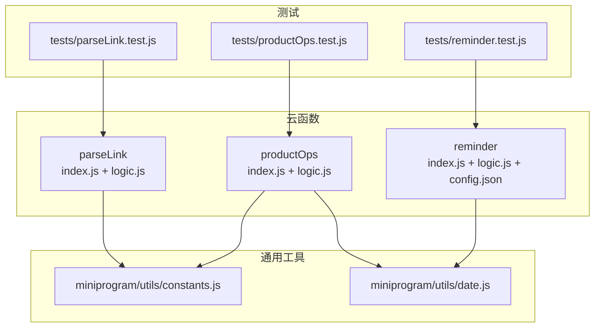
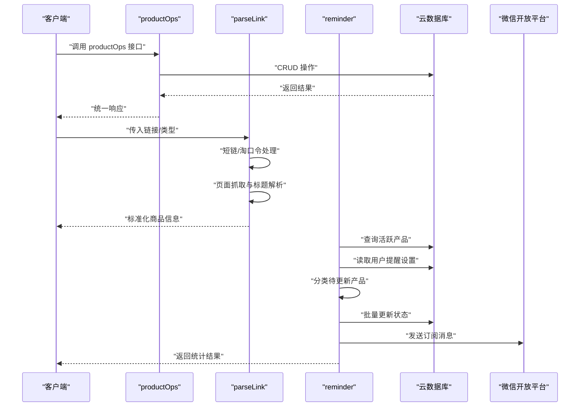
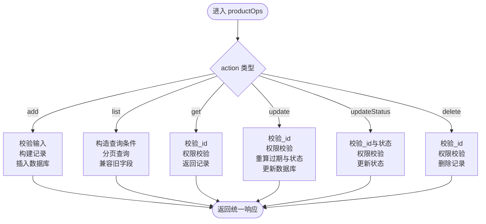
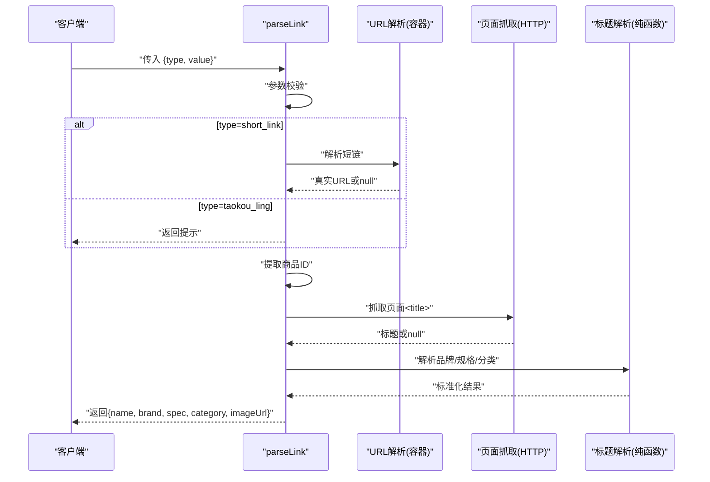
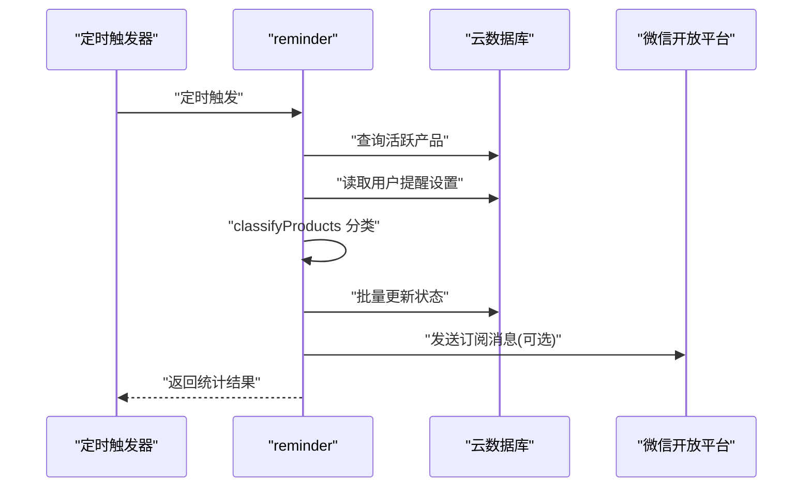
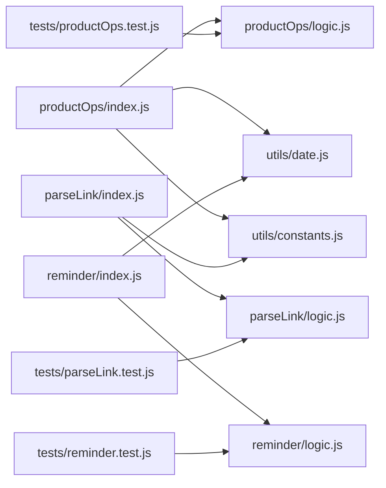

# 云函数系统

<cite>
**本文引用的文件**
- [cloudfunctions/productOps/index.js](file://cloudfunctions/productOps/index.js)
- [cloudfunctions/productOps/logic.js](file://cloudfunctions/productOps/logic.js)
- [cloudfunctions/parseLink/index.js](file://cloudfunctions/parseLink/index.js)
- [cloudfunctions/parseLink/logic.js](file://cloudfunctions/parseLink/logic.js)
- [cloudfunctions/reminder/index.js](file://cloudfunctions/reminder/index.js)
- [cloudfunctions/reminder/logic.js](file://cloudfunctions/reminder/logic.js)
- [cloudfunctions/reminder/config.json](file://cloudfunctions/reminder/config.json)
- [cloudfunctions/parseLink/package.json](file://cloudfunctions/parseLink/package.json)
- [cloudfunctions/productOps/package.json](file://cloudfunctions/productOps/package.json)
- [cloudfunctions/reminder/package.json](file://cloudfunctions/reminder/package.json)
- [tests/parseLink.test.js](file://tests/parseLink.test.js)
- [tests/productOps.test.js](file://tests/productOps.test.js)
- [tests/reminder.test.js](file://tests/reminder.test.js)
- [miniprogram/utils/constants.js](file://miniprogram/utils/constants.js)
- [miniprogram/utils/date.js](file://miniprogram/utils/date.js)
</cite>

## 目录
1. [简介](#简介)
2. [项目结构](#项目结构)
3. [核心组件](#核心组件)
4. [架构总览](#架构总览)
5. [详细组件分析](#详细组件分析)
6. [依赖关系分析](#依赖关系分析)
7. [性能考虑](#性能考虑)
8. [故障排查指南](#故障排查指南)
9. [结论](#结论)
10. [附录](#附录)

## 简介
本文件为云函数系统的API文档与实现指南，聚焦于三个核心云函数：productOps、parseLink、reminder。内容涵盖设计目标、接口规范、实现细节、数据校验、错误处理、定时任务配置、通知推送机制、部署与调试建议以及性能优化策略。文档同时提供面向开发与非技术读者的渐进式说明，并辅以可视化图示帮助理解。

## 项目结构
云函数采用按功能模块划分的目录结构，每个云函数包含独立的入口文件、业务逻辑文件与依赖声明文件；测试用例位于tests目录，便于单元测试与回归验证；通用工具位于miniprogram/utils目录，供云函数与小程序共享。

图表来源
- [cloudfunctions/productOps/index.js:1-171](file://cloudfunctions/productOps/index.js#L1-L171)
- [cloudfunctions/productOps/logic.js:1-105](file://cloudfunctions/productOps/logic.js#L1-L105)
- [cloudfunctions/parseLink/index.js:1-112](file://cloudfunctions/parseLink/index.js#L1-L112)
- [cloudfunctions/parseLink/logic.js:1-78](file://cloudfunctions/parseLink/logic.js#L1-L78)
- [cloudfunctions/reminder/index.js:1-106](file://cloudfunctions/reminder/index.js#L1-L106)
- [cloudfunctions/reminder/logic.js:1-45](file://cloudfunctions/reminder/logic.js#L1-L45)
- [cloudfunctions/reminder/config.json:1-9](file://cloudfunctions/reminder/config.json#L1-L9)
- [miniprogram/utils/date.js:1-76](file://miniprogram/utils/date.js#L1-L76)
- [miniprogram/utils/constants.js:1-100](file://miniprogram/utils/constants.js#L1-L100)
- [tests/parseLink.test.js:1-111](file://tests/parseLink.test.js#L1-L111)
- [tests/productOps.test.js:1-202](file://tests/productOps.test.js#L1-L202)
- [tests/reminder.test.js:1-87](file://tests/reminder.test.js#L1-L87)

章节来源
- [cloudfunctions/productOps/index.js:1-171](file://cloudfunctions/productOps/index.js#L1-L171)
- [cloudfunctions/parseLink/index.js:1-112](file://cloudfunctions/parseLink/index.js#L1-L112)
- [cloudfunctions/reminder/index.js:1-106](file://cloudfunctions/reminder/index.js#L1-L106)
- [cloudfunctions/reminder/config.json:1-9](file://cloudfunctions/reminder/config.json#L1-L9)

## 核心组件
- productOps：提供产品全生命周期管理能力，包括新增、查询、详情、更新、状态变更与删除；内置输入校验、状态推断与过期重算逻辑。
- parseLink：解析淘宝/天猫商品链接，支持短链与淘口令提示、页面抓取与标题解析，输出标准化的商品信息。
- reminder：定时任务，每日批量检查产品状态并推送订阅消息，支持用户自定义提醒窗口。

章节来源
- [cloudfunctions/productOps/index.js:40-64](file://cloudfunctions/productOps/index.js#L40-L64)
- [cloudfunctions/parseLink/index.js:11-56](file://cloudfunctions/parseLink/index.js#L11-L56)
- [cloudfunctions/reminder/index.js:15-105](file://cloudfunctions/reminder/index.js#L15-L105)

## 架构总览
云函数通过微信云开发SDK连接数据库与服务端能力；parseLink在解析失败时具备降级策略；reminder通过定时触发器执行，结合订阅消息向用户推送通知。

图表来源
- [cloudfunctions/productOps/index.js:40-171](file://cloudfunctions/productOps/index.js#L40-L171)
- [cloudfunctions/parseLink/index.js:11-112](file://cloudfunctions/parseLink/index.js#L11-L112)
- [cloudfunctions/reminder/index.js:15-105](file://cloudfunctions/reminder/index.js#L15-L105)

## 详细组件分析

### productOps 云函数
- 设计目的
  - 提供产品全生命周期管理，确保数据一致性与状态正确性。
- 接口规范
  - 入口：云函数 main(event, context)
  - 动作分发：根据 event.action 调用对应处理器
  - 统一响应：success(boolean) + data 或 error(string)
- 主要动作与参数
  - 新增(add)
    - 必填：name、category、productionDate、shelfLifeMonths
    - 可选：brand、specification、imageUrl、sourceLink、openedDate、openedShelfLifeMonths
    - 返回：包含新建记录_id与完整数据
  - 列表(list)
    - 支持过滤：category、status、keyword(模糊)
    - 支持分页：page、pageSize
    - 返回：list、total、page、pageSize
  - 详情(get)
    - 必填：_id
    - 返回：单条记录（仅限本人）
  - 更新(update)
    - 必填：_id + 待更新字段
    - 自动重算：当涉及生产/开封日期或保质期时，重新计算expirationDate与status
    - 返回：更新后的数据
  - 状态变更(updateStatus)
    - 必填：_id、status(仅允许used_up或discarded)
    - 返回：成功与否
  - 删除(delete)
    - 必填：_id
    - 返回：成功与否
- 数据验证与业务逻辑
  - 输入校验：名称/分类/生产日期/保质期等必填项与范围校验
  - 状态推断：基于expirationDate与用户提醒天数计算当前状态
  - 过期重算：仅在日期相关字段变更时触发
- 错误处理
  - 参数缺失/非法：返回错误信息
  - 权限不足：无权访问
  - 通用异常：捕获并返回错误消息
- 使用示例
  - 新增产品：传入name/category/productionDate/shelfLifeMonths等，接收包含_id与完整字段的响应
  - 列表查询：传入page/pageSize与可选过滤条件，接收分页结果
  - 更新产品：传入_id与需变更字段，若涉及日期字段会自动重算状态
  - 状态变更：传入_id与合法状态值，完成标记
  - 删除产品：传入_id，完成删除

图表来源
- [cloudfunctions/productOps/index.js:40-171](file://cloudfunctions/productOps/index.js#L40-L171)
- [cloudfunctions/productOps/logic.js:11-96](file://cloudfunctions/productOps/logic.js#L11-L96)

章节来源
- [cloudfunctions/productOps/index.js:40-171](file://cloudfunctions/productOps/index.js#L40-L171)
- [cloudfunctions/productOps/logic.js:11-96](file://cloudfunctions/productOps/logic.js#L11-L96)
- [tests/productOps.test.js:1-202](file://tests/productOps.test.js#L1-L202)

### parseLink 云函数
- 设计目的
  - 将淘宝/天猫链接转换为结构化的商品信息，辅助快速录入与去重。
- 接口规范
  - 入口：云函数 main(event)
  - 必填：type、value
  - 支持类型：
    - short_link：短链，需解析为真实URL
    - taokou_ling：淘口令，当前提示请复制商品链接
- 处理流程
  1) 参数校验
  2) 若为短链，调用容器解析为真实URL
  3) 从URL提取商品ID
  4) 抓取商品页面标题（H5或HTTP降级）
  5) 标题解析：品牌匹配、规格提取、名称清洗
  6) 分类推断：基于关键词映射
  7) 返回标准化字段：name、brand、specification、category、imageUrl
- 错误处理
  - 缺少参数：返回错误
  - 短链解析失败：返回错误
  - 淘口令：返回提示信息
  - 无法获取标题：返回错误
  - 异常：统一包装为错误消息
- 使用示例
  - 传入type=short_link与短链，返回解析后的商品信息
  - 传入type=taokou_ling，返回提示信息

图表来源
- [cloudfunctions/parseLink/index.js:11-112](file://cloudfunctions/parseLink/index.js#L11-L112)
- [cloudfunctions/parseLink/logic.js:13-77](file://cloudfunctions/parseLink/logic.js#L13-L77)

章节来源
- [cloudfunctions/parseLink/index.js:11-112](file://cloudfunctions/parseLink/index.js#L11-L112)
- [cloudfunctions/parseLink/logic.js:13-77](file://cloudfunctions/parseLink/logic.js#L13-L77)
- [tests/parseLink.test.js:1-111](file://tests/parseLink.test.js#L1-L111)

### reminder 云函数
- 设计目的
  - 每日定时检查产品状态，自动更新过期状态并推送订阅消息，提升用户体验。
- 定时触发器
  - 配置：每天08:00触发
- 处理流程
  1) 查询所有状态为in_use或expiring_soon的产品
  2) 读取用户提醒设置（advanceDays）
  3) 分类：即将过期/已过期（考虑用户提醒窗口）
  4) 批量更新状态并记录updatedAt
  5) 对开启推送的用户发送订阅消息
- 关键逻辑
  - classifyProducts：根据用户设置与剩余天数分类
  - 状态更新：仅在状态变化时更新，避免无效写入
  - 订阅消息：失败静默，不影响整体执行
- 使用示例
  - 触发器自动执行，返回updated/expired/expiringSoon/pushed统计

图表来源
- [cloudfunctions/reminder/index.js:15-105](file://cloudfunctions/reminder/index.js#L15-L105)
- [cloudfunctions/reminder/logic.js:17-40](file://cloudfunctions/reminder/logic.js#L17-L40)
- [cloudfunctions/reminder/config.json:1-9](file://cloudfunctions/reminder/config.json#L1-L9)

章节来源
- [cloudfunctions/reminder/index.js:15-105](file://cloudfunctions/reminder/index.js#L15-L105)
- [cloudfunctions/reminder/logic.js:17-40](file://cloudfunctions/reminder/logic.js#L17-L40)
- [cloudfunctions/reminder/config.json:1-9](file://cloudfunctions/reminder/config.json#L1-L9)
- [tests/reminder.test.js:1-87](file://tests/reminder.test.js#L1-L87)

## 依赖关系分析
- 云函数依赖
  - wx-server-sdk：云函数运行环境与数据库、容器、开放接口能力
  - 通用工具：date.js（日期计算）、constants.js（品牌/规格解析）
- 内聚与耦合
  - productOps：入口与逻辑分离，逻辑层可独立测试
  - parseLink：入口与解析逻辑分离，解析逻辑可独立测试
  - reminder：定时触发器与业务逻辑分离，逻辑层可独立测试
- 外部依赖
  - 容器解析短链（parseLink）
  - 微信订阅消息（reminder）

图表来源
- [cloudfunctions/productOps/index.js:1-19](file://cloudfunctions/productOps/index.js#L1-L19)
- [cloudfunctions/productOps/logic.js:1-105](file://cloudfunctions/productOps/logic.js#L1-L105)
- [cloudfunctions/parseLink/index.js:6-7](file://cloudfunctions/parseLink/index.js#L6-L7)
- [cloudfunctions/parseLink/logic.js:6-7](file://cloudfunctions/parseLink/logic.js#L6-L7)
- [cloudfunctions/reminder/index.js:8-9](file://cloudfunctions/reminder/index.js#L8-L9)
- [cloudfunctions/reminder/logic.js:6-7](file://cloudfunctions/reminder/logic.js#L6-L7)
- [miniprogram/utils/date.js:1-76](file://miniprogram/utils/date.js#L1-L76)
- [miniprogram/utils/constants.js:1-100](file://miniprogram/utils/constants.js#L1-L100)
- [tests/productOps.test.js:1-11](file://tests/productOps.test.js#L1-L11)
- [tests/parseLink.test.js:1-10](file://tests/parseLink.test.js#L1-L10)
- [tests/reminder.test.js:1-6](file://tests/reminder.test.js#L1-L6)

章节来源
- [cloudfunctions/productOps/package.json:1-9](file://cloudfunctions/productOps/package.json#L1-L9)
- [cloudfunctions/parseLink/package.json:1-9](file://cloudfunctions/parseLink/package.json#L1-L9)
- [cloudfunctions/reminder/package.json:1-9](file://cloudfunctions/reminder/package.json#L1-L9)

## 性能考虑
- productOps
  - 分页查询：列表接口支持分页，避免一次性加载过多数据
  - 权限校验前置：在数据库查询前进行_id与owner校验，减少无效查询
  - 重算条件：仅在日期相关字段变更时触发重算，降低写放大
- parseLink
  - 降级策略：短链解析失败时返回提示；页面抓取失败时返回错误，避免长时间阻塞
  - 超时控制：HTTP请求设置超时，防止阻塞
- reminder
  - 限制查询数量：限制每次查询活跃产品数量，避免大事务
  - 批量更新：按分类批量更新，减少多次往返
  - 订阅消息：失败静默，不影响主流程

## 故障排查指南
- productOps
  - 常见问题：缺少_id、无权访问、输入校验失败
  - 排查要点：确认OPENID、owner字段、action参数；查看返回的error字段
- parseLink
  - 常见问题：短链解析失败、无法获取标题、淘口令提示
  - 排查要点：确认type与value；检查网络连通性与容器配置；确认URL有效性
- reminder
  - 常见问题：定时未触发、订阅消息发送失败
  - 排查要点：确认定时触发器配置；检查用户授权状态；查看返回的error字段

章节来源
- [cloudfunctions/productOps/index.js:112-171](file://cloudfunctions/productOps/index.js#L112-L171)
- [cloudfunctions/parseLink/index.js:14-56](file://cloudfunctions/parseLink/index.js#L14-L56)
- [cloudfunctions/reminder/index.js:102-105](file://cloudfunctions/reminder/index.js#L102-L105)

## 结论
本云函数系统通过清晰的职责划分与完善的错误处理机制，实现了产品管理、链接解析与定时提醒的核心能力。配合测试用例与降级策略，系统具备良好的可维护性与稳定性。建议在生产环境中关注数据库索引、查询限制与订阅消息权限管理，持续优化性能与用户体验。

## 附录
- 部署与调试
  - 部署：在微信开发者工具中上传云函数，配置定时触发器与容器访问权限
  - 调试：使用云函数本地调试工具与日志输出定位问题；利用测试用例验证逻辑正确性
- 依赖安装
  - 云函数根目录package.json中声明wx-server-sdk，确保运行环境一致
- 最佳实践
  - 输入校验前置、权限校验前置
  - 业务逻辑纯函数化，便于测试与复用
  - 定时任务分批处理，避免超时与资源占用过高