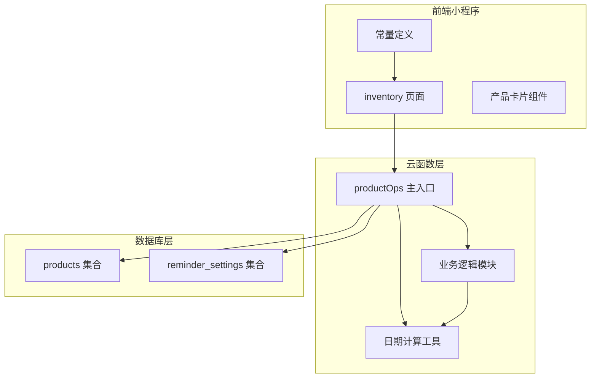
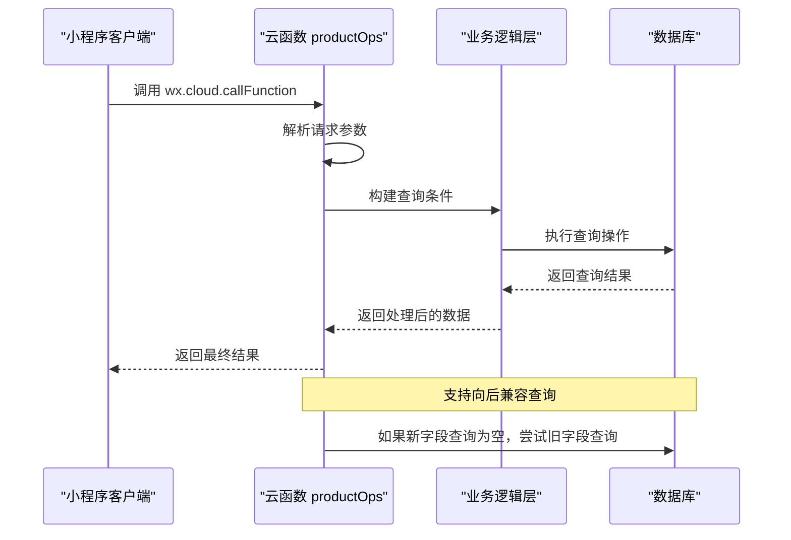
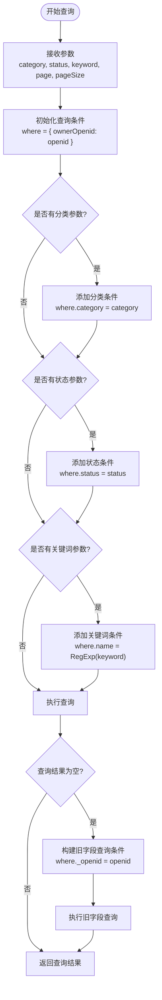
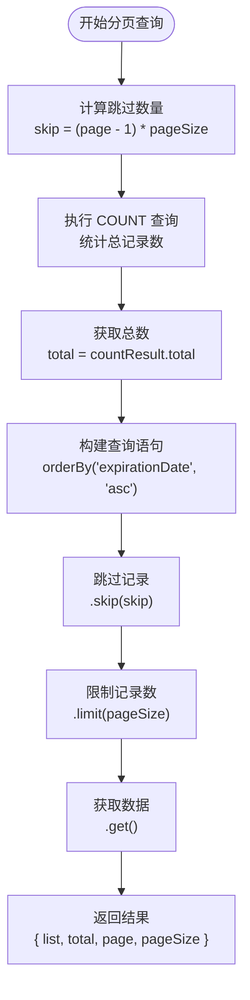
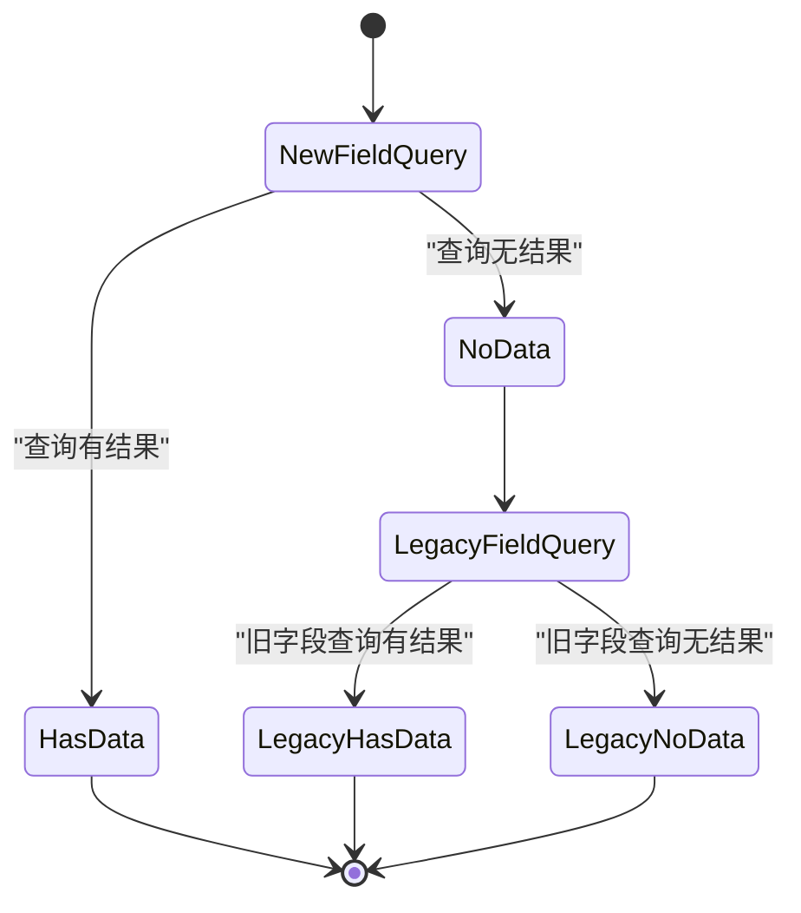
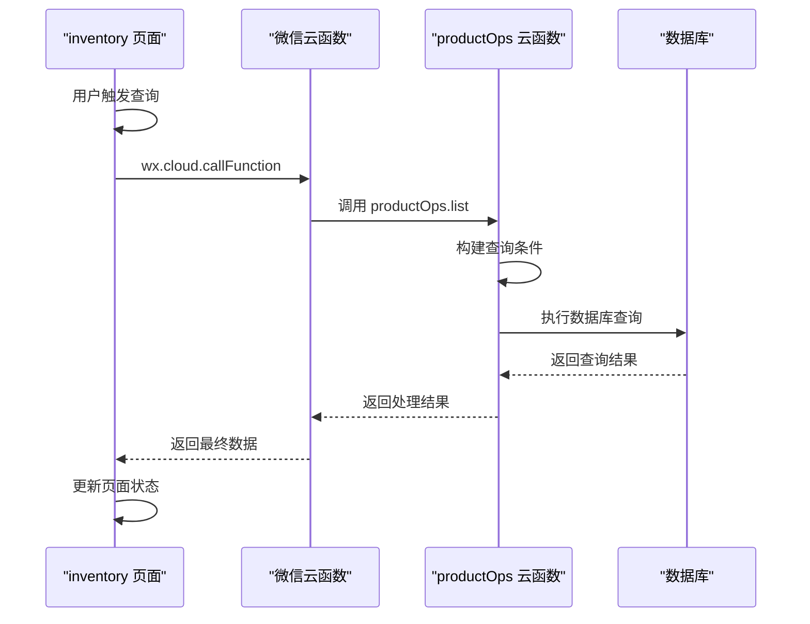
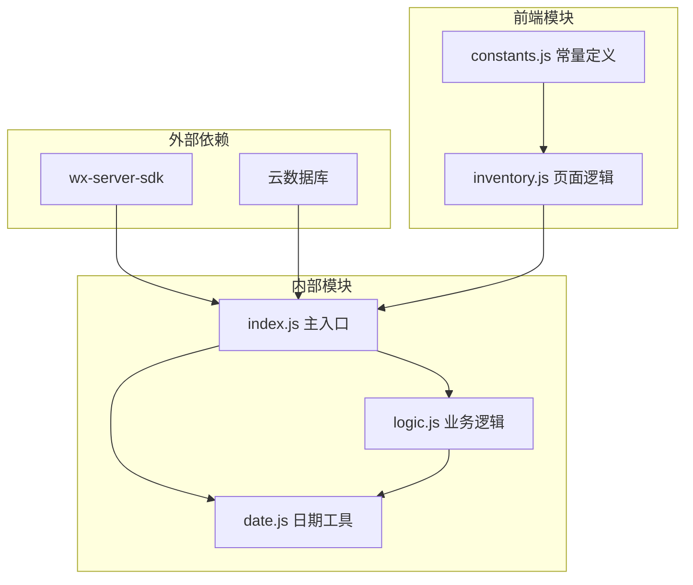

# 产品列表查询操作 (handleList)

<cite>
**本文档引用的文件**
- [cloudfunctions/productOps/index.js](file://cloudfunctions/productOps/index.js)
- [cloudfunctions/productOps/logic.js](file://cloudfunctions/productOps/logic.js)
- [cloudfunctions/productOps/date.js](file://cloudfunctions/productOps/date.js)
- [miniprogram/pages/inventory/inventory.js](file://miniprogram/pages/inventory/inventory.js)
- [miniprogram/utils/constants.js](file://miniprogram/utils/constants.js)
- [tests/productOps.test.js](file://tests/productOps.test.js)
</cite>

## 目录
1. [简介](#简介)
2. [项目结构](#项目结构)
3. [核心组件](#核心组件)
4. [架构概览](#架构概览)
5. [详细组件分析](#详细组件分析)
6. [依赖关系分析](#依赖关系分析)
7. [性能考虑](#性能考虑)
8. [故障排除指南](#故障排除指南)
9. [结论](#结论)

## 简介

本文档详细说明了微信小程序中产品列表查询操作的实现指南，重点分析 `handleList` 函数的查询逻辑。该功能支持多条件筛选（分类、状态、关键词搜索）、分页处理、排序规则以及向后兼容性处理。系统采用云函数架构，通过微信云开发 SDK 进行数据库操作，前端通过云函数调用实现产品列表的查询和展示。

## 项目结构

该项目采用分层架构设计，主要包含以下关键模块：

**图表来源**
- [cloudfunctions/productOps/index.js:1-171](file://cloudfunctions/productOps/index.js#L1-L171)
- [miniprogram/pages/inventory/inventory.js:1-117](file://miniprogram/pages/inventory/inventory.js#L1-L117)

**章节来源**
- [cloudfunctions/productOps/index.js:1-171](file://cloudfunctions/productOps/index.js#L1-L171)
- [miniprogram/pages/inventory/inventory.js:1-117](file://miniprogram/pages/inventory/inventory.js#L1-L117)

## 核心组件

### 云函数主入口 (productOps)

云函数采用单一入口设计，通过 `action` 参数分发到不同的操作函数：

- **主入口函数**: `exports.main` - 处理所有云函数请求
- **操作分发器**: 根据 `action` 参数调用对应处理函数
- **错误处理**: 统一的异常捕获和错误返回机制

### 查询处理组件

- **查询构建器**: `handleList` - 构建查询条件和处理筛选逻辑
- **分页查询器**: `queryProducts` - 实现分页查询和总数统计
- **兼容性处理器**: 自动回退机制处理新旧字段兼容

**章节来源**
- [cloudfunctions/productOps/index.js:40-110](file://cloudfunctions/productOps/index.js#L40-L110)

## 架构概览

系统采用前后端分离架构，通过云函数作为中间层连接前端和数据库：

**图表来源**
- [cloudfunctions/productOps/index.js:92-110](file://cloudfunctions/productOps/index.js#L92-L110)
- [cloudfunctions/productOps/index.js:25-38](file://cloudfunctions/productOps/index.js#L25-L38)

## 详细组件分析

### handleList 函数实现

`handleList` 函数是产品列表查询的核心实现，负责构建动态查询条件和处理向后兼容性：

#### 查询条件构建流程

**图表来源**
- [cloudfunctions/productOps/index.js:92-110](file://cloudfunctions/productOps/index.js#L92-L110)

#### 关键实现细节

1. **动态条件构建**: 根据传入参数动态添加查询条件
2. **模糊搜索**: 使用正则表达式实现不区分大小写的关键词搜索
3. **向后兼容**: 自动处理新旧字段差异 (`ownerOpenid` vs `_openid`)
4. **默认参数**: 提供合理的默认值（page=1, pageSize=20）

**章节来源**
- [cloudfunctions/productOps/index.js:92-110](file://cloudfunctions/productOps/index.js#L92-L110)

### queryProducts 函数实现

分页查询函数实现了完整的分页逻辑：

#### 分页查询算法

**图表来源**
- [cloudfunctions/productOps/index.js:25-38](file://cloudfunctions/productOps/index.js#L25-L38)

#### 排序规则

- **排序字段**: `expirationDate`
- **排序方向**: 升序 (`'asc'`)
- **排序意义**: 按过期时间从近到远排列，便于用户优先处理即将过期的产品

**章节来源**
- [cloudfunctions/productOps/index.js:25-38](file://cloudfunctions/productOps/index.js#L25-L38)

### 向后兼容性处理机制

系统实现了智能的向后兼容性处理：

**图表来源**
- [cloudfunctions/productOps/index.js:103-107](file://cloudfunctions/productOps/index.js#L103-L107)

#### 兼容性策略

1. **字段优先级**: 优先使用新字段 `ownerOpenid`
2. **自动回退**: 当新字段查询为空时，自动使用旧字段 `_openid`
3. **条件转换**: 将新字段条件转换为旧字段条件
4. **透明处理**: 对调用方完全透明，无需手动处理兼容性

**章节来源**
- [cloudfunctions/productOps/index.js:103-107](file://cloudfunctions/productOps/index.js#L103-L107)

### 前端集成实现

前端页面通过云函数调用实现产品列表查询：

#### 前端调用流程

**图表来源**
- [miniprogram/pages/inventory/inventory.js:80-102](file://miniprogram/pages/inventory/inventory.js#L80-L102)

#### 前端参数处理

- **参数传递**: 自动包含 `action: 'list'` 和分页参数
- **条件过滤**: 根据用户交互动态添加筛选条件
- **结果处理**: 合并新数据，更新分页状态

**章节来源**
- [miniprogram/pages/inventory/inventory.js:70-102](file://miniprogram/pages/inventory/inventory.js#L70-L102)

## 依赖关系分析

### 组件依赖图

**图表来源**
- [cloudfunctions/productOps/index.js:5-19](file://cloudfunctions/productOps/index.js#L5-L19)
- [cloudfunctions/productOps/logic.js:1-5](file://cloudfunctions/productOps/logic.js#L1-L5)

### 数据流分析

系统遵循清晰的数据流向：

1. **输入层**: 前端页面收集用户参数
2. **处理层**: 云函数验证和构建查询条件
3. **存储层**: 数据库执行查询操作
4. **输出层**: 格式化结果返回给前端

**章节来源**
- [cloudfunctions/productOps/index.js:1-171](file://cloudfunctions/productOps/index.js#L1-L171)

## 性能考虑

### 查询优化策略

1. **索引利用**: 建议在常用查询字段上建立索引
2. **分页限制**: 合理设置 `pageSize` 避免一次性返回大量数据
3. **条件优化**: 优先使用精确匹配而非模糊查询
4. **排序优化**: `expirationDate` 字段建议建立索引以提升排序性能

### 内存管理

- **批量处理**: 分页查询避免一次性加载所有数据
- **对象复用**: 合理使用 JavaScript 对象避免内存泄漏
- **及时清理**: 页面卸载时清理定时器和事件监听器

## 故障排除指南

### 常见问题及解决方案

#### 查询结果为空

**可能原因**:
1. 用户没有权限访问任何产品
2. 查询条件过于严格
3. 数据库中确实没有匹配记录

**解决方法**:
1. 检查用户身份验证
2. 简化查询条件或清除筛选
3. 验证数据库中是否存在数据

#### 向后兼容性问题

**可能原因**:
1. 新旧字段都不存在数据
2. 权限配置错误

**解决方法**:
1. 检查用户 OpenID 是否正确
2. 验证数据库中字段命名
3. 确认用户数据完整性

#### 性能问题

**可能原因**:
1. 查询条件缺乏索引
2. 分页参数过大
3. 频繁的重复查询

**解决方法**:
1. 优化查询条件和索引
2. 合理设置分页大小
3. 实现查询缓存机制

**章节来源**
- [cloudfunctions/productOps/index.js:103-107](file://cloudfunctions/productOps/index.js#L103-L107)

## 结论

产品列表查询操作通过 `handleList` 函数实现了完整的多条件筛选、分页查询和向后兼容性处理。系统设计具有以下特点：

1. **功能完整性**: 支持分类、状态、关键词等多种筛选方式
2. **用户体验**: 按过期时间排序，便于用户优先处理即将过期的产品
3. **技术先进性**: 实现智能向后兼容，确保系统升级的平滑过渡
4. **性能优化**: 采用分页查询和合理的数据结构设计

该实现为微信小程序提供了稳定可靠的产品管理功能，为后续的功能扩展奠定了良好的基础。