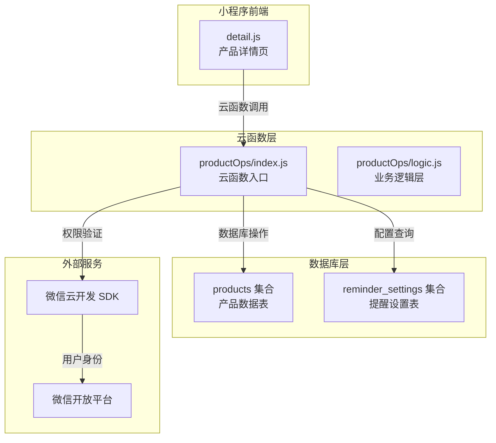
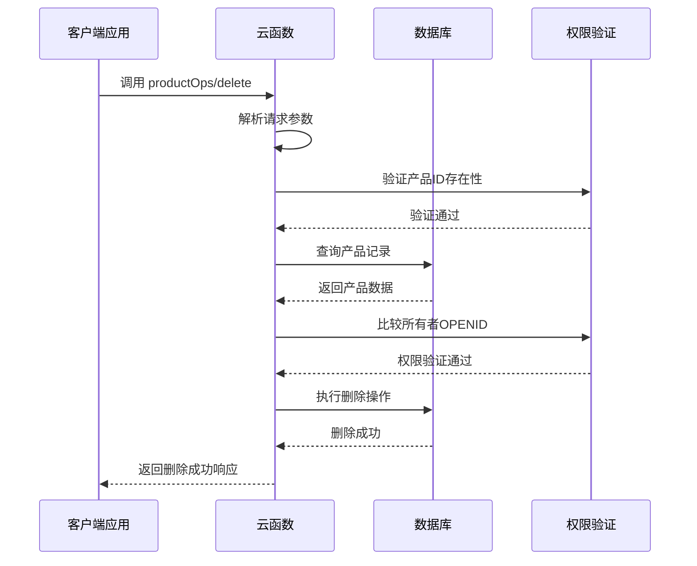
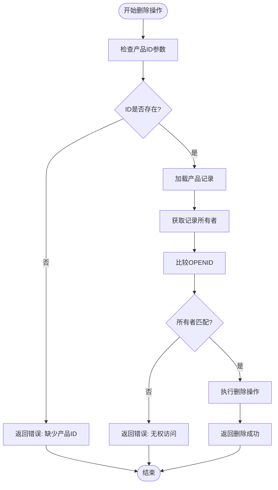
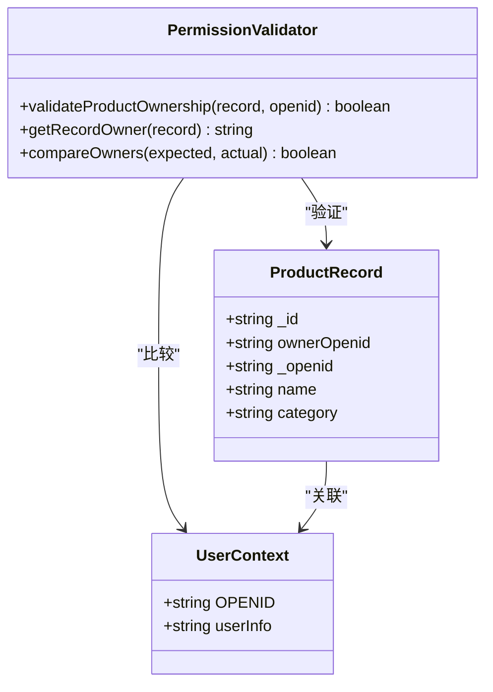
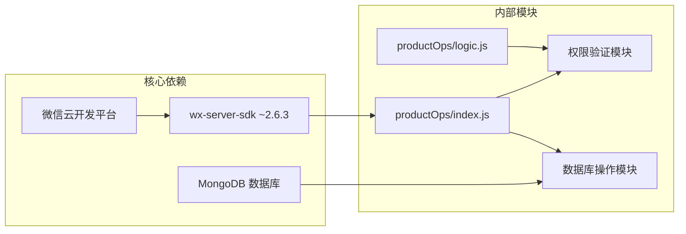

# 产品删除操作 (handleDelete)

<cite>
**本文档引用的文件**
- [cloudfunctions/productOps/index.js](file://cloudfunctions/productOps/index.js)
- [cloudfunctions/productOps/logic.js](file://cloudfunctions/productOps/logic.js)
- [cloudfunctions/productOps/package.json](file://cloudfunctions/productOps/package.json)
- [miniprogram/pages/detail/detail.js](file://miniprogram/pages/detail/detail.js)
- [tests/productOps.test.js](file://tests/productOps.test.js)
</cite>

## 目录
1. [简介](#简介)
2. [项目结构](#项目结构)
3. [核心组件](#核心组件)
4. [架构概览](#架构概览)
5. [详细组件分析](#详细组件分析)
6. [依赖分析](#依赖分析)
7. [性能考虑](#性能考虑)
8. [故障排除指南](#故障排除指南)
9. [结论](#结论)

## 简介

本文档详细介绍了微信小程序中产品删除操作的实现指南，重点分析了 `handleDelete` 函数的删除逻辑。该系统采用云函数架构，通过微信云开发平台提供安全的产品管理功能。删除操作包含完整的权限验证机制，确保只有产品所有者才能删除其拥有的产品记录。

系统的核心设计原则是数据安全性和用户体验的平衡，通过严格的权限控制和清晰的错误处理来保证操作的可靠性。

## 项目结构

产品删除功能位于云函数 `productOps` 中，采用模块化设计，将业务逻辑与云函数入口分离：

**图表来源**
- [cloudfunctions/productOps/index.js:1-171](file://cloudfunctions/productOps/index.js#L1-L171)
- [cloudfunctions/productOps/logic.js:1-105](file://cloudfunctions/productOps/logic.js#L1-L105)

**章节来源**
- [cloudfunctions/productOps/index.js:1-171](file://cloudfunctions/productOps/index.js#L1-L171)
- [cloudfunctions/productOps/package.json:1-9](file://cloudfunctions/productOps/package.json#L1-L9)

## 核心组件

### 云函数入口组件

`productOps` 云函数是整个删除功能的入口点，负责接收前端请求、分发操作类型并执行相应的业务逻辑。

**主要职责：**
- 接收和解析前端传入的事件参数
- 获取当前用户的 OPENID 作为身份标识
- 根据 action 参数分发到对应的处理器函数
- 统一的错误处理和响应格式化

**章节来源**
- [cloudfunctions/productOps/index.js:40-64](file://cloudfunctions/productOps/index.js#L40-L64)

### 权限验证组件

权限验证是删除操作的核心安全保障，通过 `getRecordOwner` 函数实现。

**验证机制：**
- 从数据库记录中提取所有者标识（优先使用 `ownerOpenid`，否则回退到 `_openid`）
- 将记录的所有者标识与当前用户 OPENID 进行严格匹配
- 不匹配时拒绝访问，防止越权操作

**章节来源**
- [cloudfunctions/productOps/index.js:21-23](file://cloudfunctions/productOps/index.js#L21-L23)
- [cloudfunctions/productOps/index.js:163-165](file://cloudfunctions/productOps/index.js#L163-L165)

### 数据库操作组件

删除操作直接针对 MongoDB 集合进行，使用微信云开发提供的数据库 API。

**操作特性：**
- 使用文档级删除，一次性移除指定 ID 的完整记录
- 自动返回删除结果状态
- 无需额外的清理或关联数据处理

**章节来源**
- [cloudfunctions/productOps/index.js:168](file://cloudfunctions/productOps/index.js#L168)

## 架构概览

产品删除操作采用典型的三层架构设计，确保了系统的可维护性和安全性：

**图表来源**
- [cloudfunctions/productOps/index.js:159-170](file://cloudfunctions/productOps/index.js#L159-L170)

**章节来源**
- [cloudfunctions/productOps/index.js:159-170](file://cloudfunctions/productOps/index.js#L159-L170)

## 详细组件分析

### handleDelete 函数实现

`handleDelete` 函数是删除功能的核心实现，遵循严格的三步验证流程：

#### 第一步：参数验证

**图表来源**
- [cloudfunctions/productOps/index.js:159-170](file://cloudfunctions/productOps/index.js#L159-L170)

#### 第二步：所有权验证

所有权验证通过 `getRecordOwner` 函数实现，支持两种兼容的存储格式：

**验证逻辑：**
- 优先使用 `ownerOpenid` 字段（新版本格式）
- 回退到 `_openid` 字段（兼容旧版本数据）
- 空值处理：如果记录为空或没有所有者标识，返回空字符串

**章节来源**
- [cloudfunctions/productOps/index.js:21-23](file://cloudfunctions/productOps/index.js#L21-L23)
- [cloudfunctions/productOps/index.js:163-165](file://cloudfunctions/productOps/index.js#L163-L165)

#### 第三步：数据库删除操作

删除操作使用 MongoDB 的文档删除 API，确保原子性操作：

**操作特性：**
- 单文档删除，避免影响其他记录
- 自动返回删除结果状态
- 支持事务性操作（在云函数环境中）

**章节来源**
- [cloudfunctions/productOps/index.js:168](file://cloudfunctions/productOps/index.js#L168)

### 权限验证机制详解

权限验证是系统安全性的关键防线，采用多层验证策略：

**图表来源**
- [cloudfunctions/productOps/index.js:21-23](file://cloudfunctions/productOps/index.js#L21-L23)
- [cloudfunctions/productOps/index.js:159-170](file://cloudfunctions/productOps/index.js#L159-L170)

**章节来源**
- [cloudfunctions/productOps/index.js:21-23](file://cloudfunctions/productOps/index.js#L21-L23)
- [cloudfunctions/productOps/index.js:159-170](file://cloudfunctions/productOps/index.js#L159-L170)

### 前端集成实现

前端通过云函数调用实现删除操作，提供良好的用户体验：

**前端调用流程：**
1. 用户点击删除按钮触发确认对话框
2. 显示删除确认提示，强调不可恢复性
3. 用户确认后调用云函数执行删除
4. 处理删除结果，显示相应反馈
5. 成功后导航返回上一页

**章节来源**
- [miniprogram/pages/detail/detail.js:101-121](file://miniprogram/pages/detail/detail.js#L101-L121)

## 依赖分析

### 外部依赖关系

系统依赖于多个外部服务和库：

**图表来源**
- [cloudfunctions/productOps/package.json:5-7](file://cloudfunctions/productOps/package.json#L5-L7)
- [cloudfunctions/productOps/index.js:5-11](file://cloudfunctions/productOps/index.js#L5-L11)

**章节来源**
- [cloudfunctions/productOps/package.json:1-9](file://cloudfunctions/productOps/package.json#L1-L9)
- [cloudfunctions/productOps/index.js:5-11](file://cloudfunctions/productOps/index.js#L5-L11)

### 内部模块耦合度分析

删除功能的模块间耦合度较低，便于维护和测试：

**模块职责分离：**
- `index.js`: 云函数入口和业务协调
- `logic.js`: 纯函数业务逻辑（可独立测试）
- 前端页面: 只负责用户交互和云函数调用

**章节来源**
- [cloudfunctions/productOps/index.js:13-19](file://cloudfunctions/productOps/index.js#L13-L19)
- [cloudfunctions/productOps/logic.js:1-105](file://cloudfunctions/productOps/logic.js#L1-105)

## 性能考虑

### 数据库性能优化

删除操作的性能特点：
- 单文档删除操作，复杂度 O(1)
- 直接基于主键索引查找，查询效率高
- 无需额外的索引维护操作

### 网络传输优化

前端到云函数的通信优化：
- 请求体仅包含必要的 `_id` 参数
- 响应体简洁，只返回操作结果状态
- 错误信息格式统一，便于前端处理

## 故障排除指南

### 常见错误及解决方案

**1. 无权访问错误**
- **症状**: 返回 `{ success: false, error: '无权访问' }`
- **原因**: 产品记录的所有者OPENID与当前用户不匹配
- **解决方案**: 确认用户登录状态正确，检查产品归属关系

**2. 缺少产品ID错误**
- **症状**: 返回 `{ success: false, error: '缺少产品ID' }`
- **原因**: 请求参数中未包含 `_id` 字段
- **解决方案**: 确保前端传递正确的产品ID参数

**3. 产品不存在错误**
- **症状**: 数据库查询返回空结果
- **原因**: 产品ID无效或已被删除
- **解决方案**: 前端应避免对已删除产品发起删除请求

**章节来源**
- [cloudfunctions/productOps/index.js:160-166](file://cloudfunctions/productOps/index.js#L160-L166)

### 调试建议

**开发环境调试：**
1. 在云函数中添加日志输出，记录删除操作的关键信息
2. 使用微信开发者工具的云函数调试功能
3. 检查数据库连接状态和权限配置

**生产环境监控：**
1. 监控删除操作的成功率和错误率
2. 记录异常情况的日志信息
3. 设置适当的告警机制

## 结论

产品删除操作 `handleDelete` 函数实现了完整的权限验证和安全删除流程。通过三步验证机制（参数验证、所有权验证、数据库操作）确保了操作的安全性和可靠性。

系统的设计体现了以下优势：
- **安全性**: 严格的权限控制防止越权操作
- **可靠性**: 清晰的错误处理和状态返回
- **可维护性**: 模块化设计便于代码维护和测试
- **用户体验**: 前后端配合提供友好的操作反馈

该实现为类似的数据删除场景提供了良好的参考模式，特别是在需要严格权限控制的应用场景中。