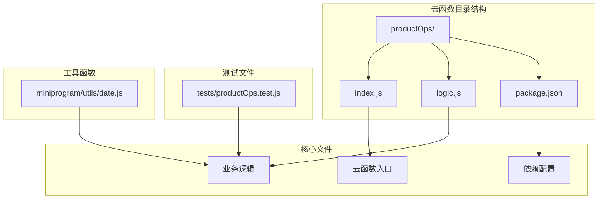
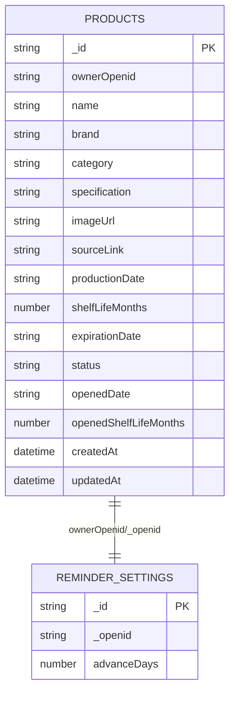
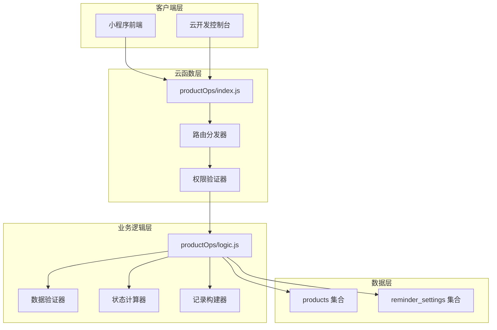
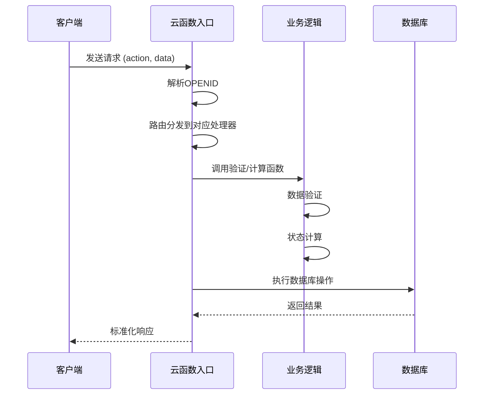
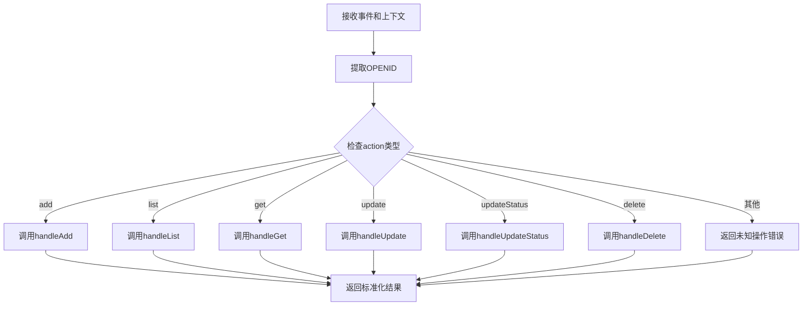
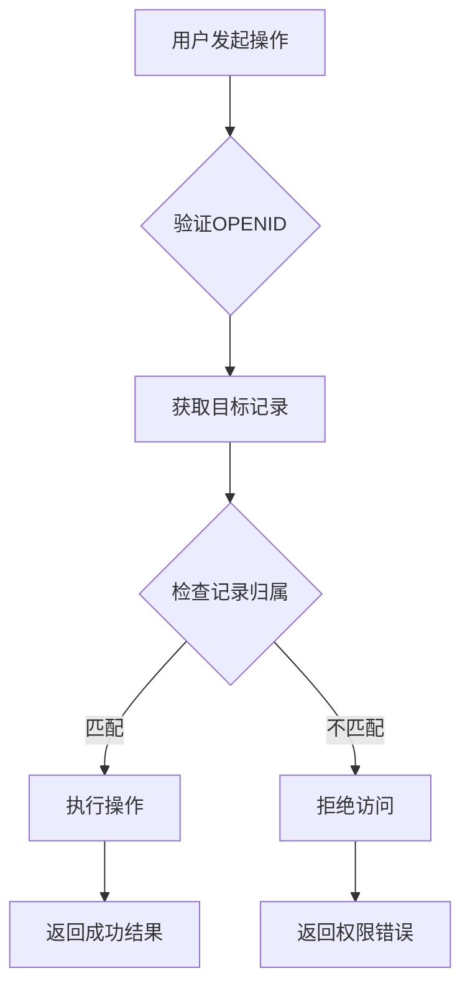
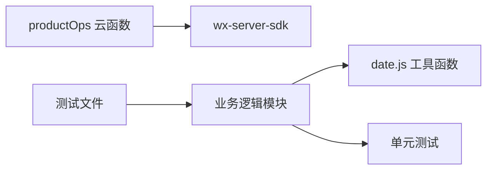
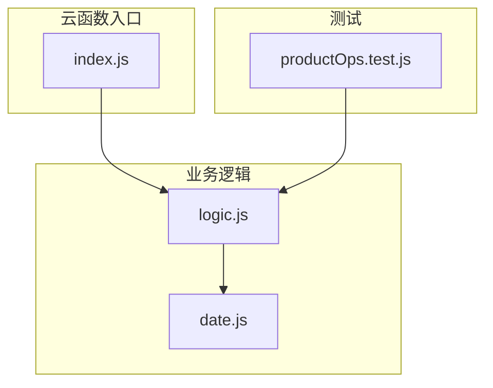

# 产品操作云函数 (productOps)

<cite>
**本文档引用的文件**
- [index.js](file://cloudfunctions/productOps/index.js)
- [logic.js](file://cloudfunctions/productOps/logic.js)
- [package.json](file://cloudfunctions/productOps/package.json)
- [date.js](file://miniprogram/utils/date.js)
- [productOps.test.js](file://tests/productOps.test.js)
</cite>

## 目录
1. [简介](#简介)
2. [项目结构](#项目结构)
3. [核心组件](#核心组件)
4. [架构概览](#架构概览)
5. [详细组件分析](#详细组件分析)
6. [依赖关系分析](#依赖关系分析)
7. [性能考虑](#性能考虑)
8. [故障排除指南](#故障排除指南)
9. [结论](#结论)

## 简介

产品操作云函数（productOps）是微信小程序后端服务的核心模块，专门用于管理用户的产品库存信息。该云函数提供了完整的CRUD操作，包括产品添加、查询、更新、删除等功能，并集成了智能过期时间计算和状态管理机制。

该系统采用模块化设计，将业务逻辑与云函数入口分离，确保代码的可测试性和可维护性。通过与小程序前端的紧密集成，为用户提供便捷的产品管理体验。

## 项目结构

产品操作云函数位于 `cloudfunctions/productOps/` 目录下，采用清晰的模块化组织结构：

**图表来源**
- [index.js:1-171](file://cloudfunctions/productOps/index.js#L1-L171)
- [logic.js:1-105](file://cloudfunctions/productOps/logic.js#L1-L105)

**章节来源**
- [index.js:1-171](file://cloudfunctions/productOps/index.js#L1-L171)
- [package.json:1-9](file://cloudfunctions/productOps/package.json#L1-L9)

## 核心组件

### 数据库集合

系统主要依赖两个数据库集合：

1. **products 集合**：存储产品信息，包括基础属性、过期时间、状态等
2. **reminder_settings 集合**：存储用户提醒设置，包括提前天数配置

### 主要数据模型

**图表来源**
- [index.js:8-11](file://cloudfunctions/productOps/index.js#L8-L11)
- [logic.js:45-71](file://cloudfunctions/productOps/logic.js#L45-L71)

### 核心功能特性

- **智能过期计算**：基于生产日期和保质期自动计算过期时间
- **多状态管理**：支持 in_use、expiring_soon、expired 等状态
- **权限控制**：基于 ownerOpenid 的数据访问控制
- **模糊搜索**：支持按关键词进行产品名称搜索
- **分页查询**：支持分页浏览产品列表

**章节来源**
- [index.js:25-38](file://cloudfunctions/productOps/index.js#L25-L38)
- [logic.js:45-71](file://cloudfunctions/productOps/logic.js#L45-L71)

## 架构概览

产品操作云函数采用分层架构设计，将云函数入口与业务逻辑分离：

**图表来源**
- [index.js:40-64](file://cloudfunctions/productOps/index.js#L40-L64)
- [logic.js:11-17](file://cloudfunctions/productOps/logic.js#L11-L17)

### 请求处理流程

**图表来源**
- [index.js:40-64](file://cloudfunctions/productOps/index.js#L40-L64)
- [index.js:75-90](file://cloudfunctions/productOps/index.js#L75-L90)

## 详细组件分析

### 云函数入口 (index.js)

#### 主要职责
- 接收和解析客户端请求
- 提取用户身份信息 (OPENID)
- 根据 action 参数分发到相应处理器
- 统一错误处理和响应格式

#### 核心方法

##### 主处理函数 (exports.main)

**图表来源**
- [index.js:40-64](file://cloudfunctions/productOps/index.js#L40-L64)

##### 权限验证辅助函数
- `getRecordOwner(record)`: 提取记录的所有者标识
- `queryProducts(where, page, pageSize)`: 统一分页查询逻辑

**章节来源**
- [index.js:40-64](file://cloudfunctions/productOps/index.js#L40-L64)
- [index.js:21-38](file://cloudfunctions/productOps/index.js#L21-L38)

### 业务逻辑模块 (logic.js)

#### 数据验证器

##### 输入验证函数 (validateAddInput)
验证产品添加的基本要求：
- 产品名称不能为空
- 分类不能为空  
- 生产日期不能为空
- 保质期必须大于0

##### 状态验证函数 (validateUpdateStatusInput)
验证状态更新的合法性：
- 状态不能为空
- 只允许 used_up 和 discarded 两种状态

**章节来源**
- [logic.js:11-29](file://cloudfunctions/productOps/logic.js#L11-L29)

#### 状态计算器

##### 状态解析函数 (resolveStatus)
根据过期日期和提前天数确定产品状态：
- 过期或今天过期：expired
- 在提前天数范围内：expiring_soon  
- 其他情况：in_use

##### 过期时间计算 (calcExpirationDate)
计算最终过期时间，取未开封和开封后的较小值：
- 未开封过期时间：productionDate + shelfLifeMonths
- 开封后过期时间：openedDate + openedShelfLifeMonths
- 最终过期时间：min(两者)

**章节来源**
- [logic.js:34-40](file://cloudfunctions/productOps/logic.js#L34-L40)
- [date.js:25-36](file://miniprogram/utils/date.js#L25-L36)

#### 记录构建器

##### 产品记录构建 (buildProductRecord)
构建完整的产品记录，包含：
- 基础信息：name、brand、category、specification
- 图片链接：imageUrl、sourceLink
- 时间信息：productionDate、shelfLifeMonths、expirationDate
- 状态信息：status、openedDate、openedShelfLifeMonths
- 时间戳：createdAt、updatedAt

##### 更新重计算 (recalcOnUpdate)
当日期相关字段更新时，自动重新计算：
- expirationDate：重新计算过期时间
- status：根据新过期时间更新状态
- updatedAt：更新修改时间

**章节来源**
- [logic.js:45-71](file://cloudfunctions/productOps/logic.js#L45-L71)
- [logic.js:77-96](file://cloudfunctions/productOps/logic.js#L77-L96)

### 数据验证规则

#### 添加操作验证
| 字段 | 验证规则 | 错误信息 |
|------|----------|----------|
| name | 必填且非空 | 产品名称不能为空 |
| category | 必填且非空 | 分类不能为空 |
| productionDate | 必填 | 生产日期不能为空 |
| shelfLifeMonths | 必须 > 0 | 保质期必须大于0 |

#### 状态更新验证
| 字段 | 验证规则 | 错误信息 |
|------|----------|----------|
| status | 必填且为枚举值 | 状态不能为空 |
| status | 仅允许 used_up/discarded | 只能标记为 used_up 或 discarded |

**章节来源**
- [logic.js:11-29](file://cloudfunctions/productOps/logic.js#L11-L29)

### 权限控制机制

系统采用基于 ownerOpenid 的权限控制：

**图表来源**
- [index.js:117-131](file://cloudfunctions/productOps/index.js#L117-L131)

**章节来源**
- [index.js:112-170](file://cloudfunctions/productOps/index.js#L112-L170)

## 依赖关系分析

### 外部依赖

**图表来源**
- [package.json:5-7](file://cloudfunctions/productOps/package.json#L5-L7)
- [logic.js:5](file://cloudfunctions/productOps/logic.js#L5)

### 内部依赖关系

**图表来源**
- [index.js:13-19](file://cloudfunctions/productOps/index.js#L13-L19)
- [logic.js:5](file://cloudfunctions/productOps/logic.js#L5)

**章节来源**
- [package.json:1-9](file://cloudfunctions/productOps/package.json#L1-L9)
- [index.js:13-19](file://cloudfunctions/productOps/index.js#L13-L19)

## 性能考虑

### 数据库查询优化

1. **索引策略**：建议在以下字段建立索引
   - `ownerOpenid`：用户数据隔离
   - `expirationDate`：过期时间排序
   - `status`：状态过滤
   - `name`：关键词搜索

2. **分页查询**：默认每页20条记录，支持自定义pageSize

3. **查询优化**：使用复合查询条件减少数据扫描

### 缓存策略

- `getAdvanceDays` 函数对用户提醒设置进行缓存
- 避免重复查询相同用户的设置信息

### 错误处理优化

- 统一的错误响应格式
- 具体的错误信息便于调试
- 异常捕获防止云函数崩溃

## 故障排除指南

### 常见错误及解决方案

#### 权限相关错误
- **错误**：无权访问
- **原因**：尝试访问不属于当前用户的数据
- **解决**：确认用户登录状态和数据归属

#### 数据验证错误
- **错误**：缺少必要字段或字段格式不正确
- **原因**：请求参数不符合验证规则
- **解决**：检查必填字段和数据类型

#### 数据库操作错误
- **错误**：数据库连接失败或查询超时
- **原因**：网络问题或数据库负载过高
- **解决**：重试请求或检查数据库状态

### 调试技巧

1. **启用详细日志**：在开发环境中开启更详细的日志输出
2. **单元测试**：运行测试套件验证业务逻辑正确性
3. **数据库监控**：监控查询性能和索引使用情况

**章节来源**
- [index.js:61-63](file://cloudfunctions/productOps/index.js#L61-L63)
- [productOps.test.js:13-46](file://tests/productOps.test.js#L13-L46)

## 结论

产品操作云函数 (productOps) 是一个设计精良、功能完整的后端服务模块。其主要特点包括：

### 技术优势
- **模块化设计**：清晰的职责分离，便于维护和测试
- **完善的验证机制**：多层次的数据验证确保数据完整性
- **智能状态管理**：自动化的过期时间计算和状态更新
- **安全的权限控制**：基于 ownerOpenid 的数据访问控制

### 功能完整性
- 支持完整的 CRUD 操作
- 提供灵活的查询和筛选功能
- 集成用户提醒设置管理
- 标准化的错误处理和响应格式

### 扩展性考虑
- 业务逻辑与云函数入口分离，便于功能扩展
- 模块化的工具函数支持复用
- 清晰的接口定义便于前端集成

该云函数为小程序提供了可靠的产品管理能力，通过智能的过期管理和状态跟踪，帮助用户更好地管理个人物品和库存。