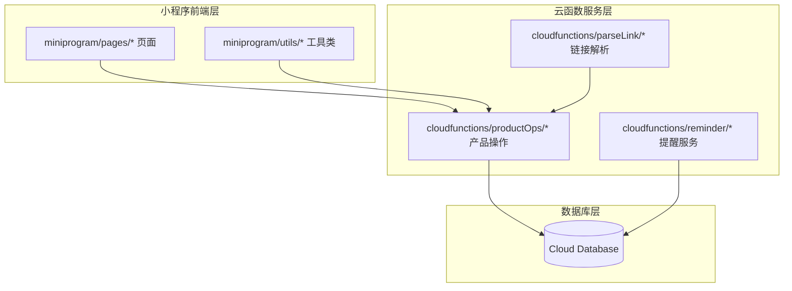
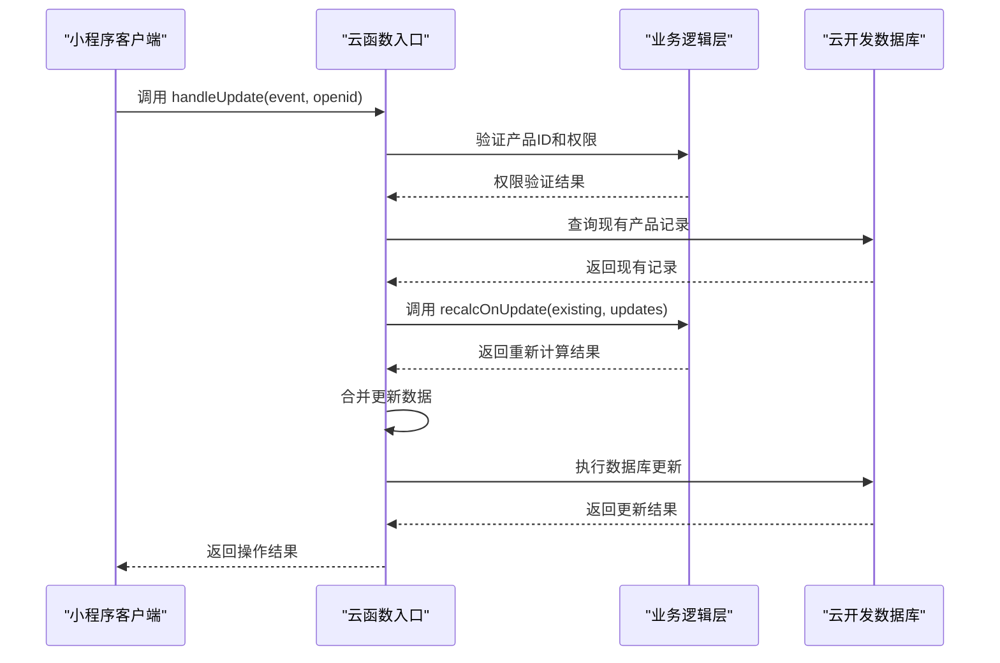
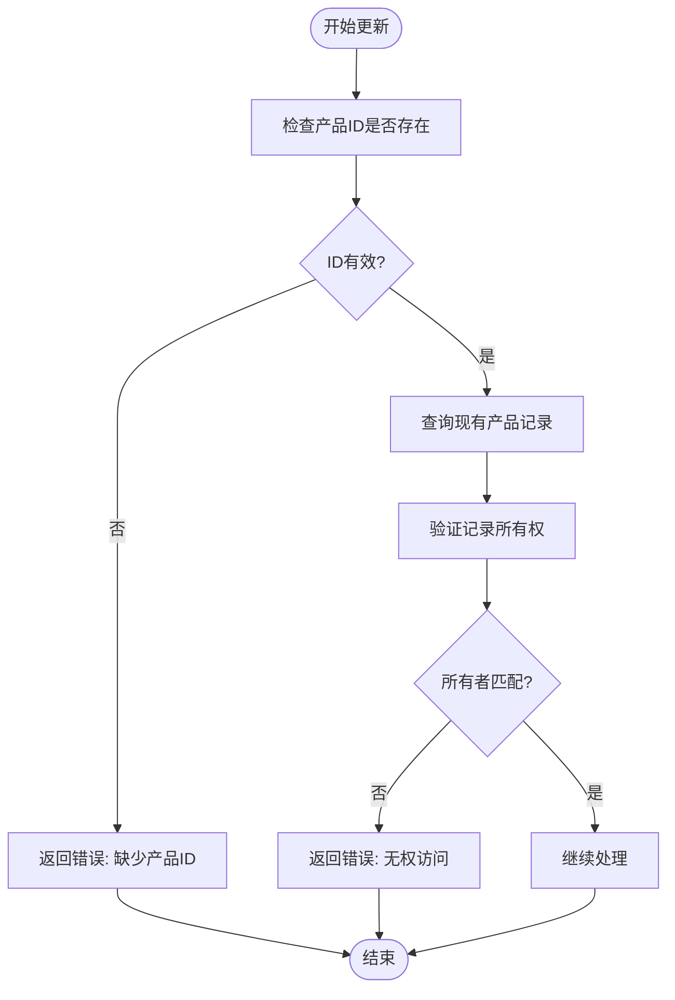
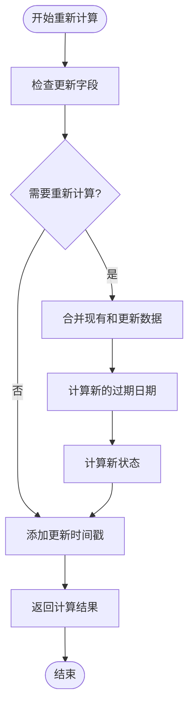
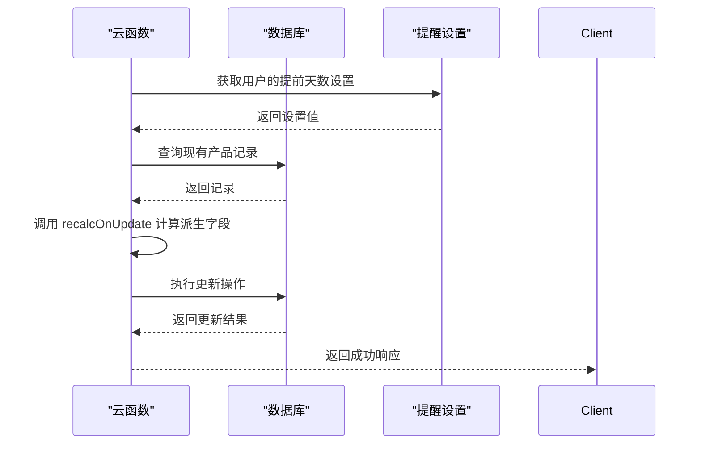
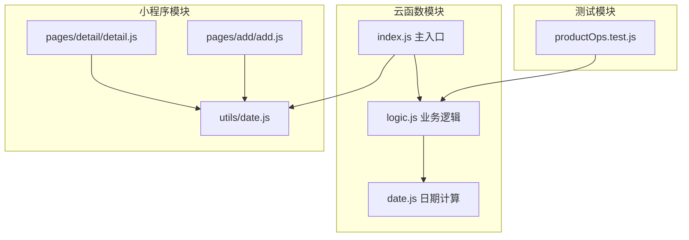

# 产品更新操作 (handleUpdate)

<cite>
**本文档引用的文件**
- [cloudfunctions/productOps/index.js](file://cloudfunctions/productOps/index.js)
- [cloudfunctions/productOps/logic.js](file://cloudfunctions/productOps/logic.js)
- [cloudfunctions/productOps/date.js](file://cloudfunctions/productOps/date.js)
- [tests/productOps.test.js](file://tests/productOps.test.js)
- [miniprogram/utils/date.js](file://miniprogram/utils/date.js)
- [miniprogram/pages/detail/detail.js](file://miniprogram/pages/detail/detail.js)
- [miniprogram/pages/add/add.js](file://miniprogram/pages/add/add.js)
</cite>

## 目录
1. [简介](#简介)
2. [项目结构](#项目结构)
3. [核心组件](#核心组件)
4. [架构概览](#架构概览)
5. [详细组件分析](#详细组件分析)
6. [依赖关系分析](#依赖关系分析)
7. [性能考虑](#性能考虑)
8. [故障排除指南](#故障排除指南)
9. [结论](#结论)

## 简介

本文档详细介绍了微信小程序"美妆保质期管理"应用中产品更新操作的实现指南。重点分析了 `handleUpdate` 函数的完整更新流程，包括权限验证、数据合并、重新计算（recalcOnUpdate）和数据库更新操作。该系统采用云函数架构，通过云开发数据库存储产品信息，并提供完整的生命周期管理功能。

## 项目结构

该项目采用前后端分离的架构设计，主要分为以下层次：



**图表来源**
- [cloudfunctions/productOps/index.js:1-171](file://cloudfunctions/productOps/index.js#L1-L171)
- [miniprogram/pages/detail/detail.js:1-122](file://miniprogram/pages/detail/detail.js#L1-L122)

**章节来源**
- [cloudfunctions/productOps/index.js:1-171](file://cloudfunctions/productOps/index.js#L1-L171)
- [miniprogram/pages/detail/detail.js:1-122](file://miniprogram/pages/detail/detail.js#L1-L122)

## 核心组件

### 云函数入口模块

`productOps` 云函数是整个产品管理的核心入口，提供了完整的 CRUD 操作：

- **权限验证**：通过 `getRecordOwner` 函数验证产品所有权
- **操作分发**：根据 `action` 参数分发到不同处理函数
- **数据库操作**：统一的数据库连接和查询接口

### 业务逻辑模块

业务逻辑完全封装在 `logic.js` 文件中，采用纯函数设计，便于测试和维护：

- **输入验证**：`validateAddInput` 和 `validateUpdateStatusInput`
- **状态计算**：`resolveStatus` 根据剩余天数计算产品状态
- **数据构建**：`buildProductRecord` 构建完整的产品记录
- **重新计算**：`recalcOnUpdate` 处理更新时的派生字段计算

**章节来源**
- [cloudfunctions/productOps/index.js:13-64](file://cloudfunctions/productOps/index.js#L13-L64)
- [cloudfunctions/productOps/logic.js:1-105](file://cloudfunctions/productOps/logic.js#L1-L105)

## 架构概览

系统采用三层架构设计，确保职责分离和可维护性：



**图表来源**
- [cloudfunctions/productOps/index.js:123-139](file://cloudfunctions/productOps/index.js#L123-L139)
- [cloudfunctions/productOps/logic.js:77-96](file://cloudfunctions/productOps/logic.js#L77-L96)

## 详细组件分析

### handleUpdate 函数实现

`handleUpdate` 函数是产品更新操作的核心实现，遵循严格的验证和更新流程：

#### 权限验证机制



**图表来源**
- [cloudfunctions/productOps/index.js:123-131](file://cloudfunctions/productOps/index.js#L123-L131)

#### 数据重新计算逻辑

`recalcOnUpdate` 函数实现了智能的派生字段重新计算：



**图表来源**
- [cloudfunctions/productOps/logic.js:77-96](file://cloudfunctions/productOps/logic.js#L77-L96)

#### 关键字段重新计算规则

当以下字段发生变化时，系统会触发重新计算：

| 字段 | 触发条件 | 计算逻辑 |
|------|----------|----------|
| productionDate | 发生变化 | 重新计算未开封过期日期 |
| shelfLifeMonths | 发生变化 | 重新计算未开封过期日期 |
| openedDate | 设置或变化 | 与未开封过期日期比较，取较小值 |
| openedShelfLifeMonths | 设置或变化 | 与未开封过期日期比较，取较小值 |

**章节来源**
- [cloudfunctions/productOps/logic.js:77-96](file://cloudfunctions/productOps/logic.js#L77-L96)
- [cloudfunctions/productOps/logic.js:80-81](file://cloudfunctions/productOps/logic.js#L80-L81)

### 数据库更新操作

更新操作采用原子性数据库事务，确保数据一致性：



**图表来源**
- [cloudfunctions/productOps/index.js:123-139](file://cloudfunctions/productOps/index.js#L123-L139)

**章节来源**
- [cloudfunctions/productOps/index.js:123-139](file://cloudfunctions/productOps/index.js#L123-L139)

### 完整更新流程示例

以下是一个典型的更新操作示例：

1. **前端发起请求**
   ```javascript
   wx.cloud.callFunction({
     name: 'productOps',
     data: {
       action: 'update',
       _id: 'product_id',
       productionDate: '2025-06-01',
       shelfLifeMonths: 24
     }
   })
   ```

2. **权限验证阶段**
   - 验证 `_id` 参数存在性
   - 查询数据库获取现有记录
   - 检查 `ownerOpenid` 与当前用户匹配

3. **数据重新计算阶段**
   - 检测到 `productionDate` 和 `shelfLifeMonths` 发生变化
   - 合并现有数据和更新数据
   - 计算新的过期日期：`calcExpirationDate({productionDate: '2025-06-01', shelfLifeMonths: 24})`
   - 计算新状态：`resolveStatus(newExpiryDate, advanceDays, now)`

4. **数据库更新阶段**
   - 合并更新数据和重新计算结果
   - 执行原子性更新操作
   - 返回更新后的完整记录

**章节来源**
- [tests/productOps.test.js:165-177](file://tests/productOps.test.js#L165-L177)
- [tests/productOps.test.js:179-187](file://tests/productOps.test.js#L179-L187)

## 依赖关系分析

系统采用模块化设计，各组件间依赖关系清晰：



**图表来源**
- [cloudfunctions/productOps/index.js:13-19](file://cloudfunctions/productOps/index.js#L13-L19)
- [cloudfunctions/productOps/logic.js:5](file://cloudfunctions/productOps/logic.js#L5)

### 关键依赖关系

1. **逻辑层依赖**：`index.js` 依赖 `logic.js` 提供的业务逻辑
2. **日期计算共享**：云函数和小程序共享相同的日期计算逻辑
3. **测试隔离**：业务逻辑完全独立，便于单元测试

**章节来源**
- [cloudfunctions/productOps/index.js:13-19](file://cloudfunctions/productOps/index.js#L13-L19)
- [cloudfunctions/productOps/logic.js:5](file://cloudfunctions/productOps/logic.js#L5)

## 性能考虑

### 数据库查询优化

- **索引策略**：建议在 `ownerOpenid` 和 `createdAt` 字段建立索引
- **查询限制**：使用 `limit` 和 `skip` 实现分页查询
- **字段选择**：仅查询必要的字段，避免全表扫描

### 内存使用优化

- **数据合并**：使用扩展运算符 `{...existing, ...updates}` 进行数据合并
- **临时变量**：合理使用临时变量避免重复计算
- **异步处理**：采用 Promise 链式调用减少回调嵌套

### 缓存策略

- **用户设置缓存**：`getAdvanceDays` 函数已实现默认值缓存
- **计算结果缓存**：对于频繁查询的计算结果可考虑本地缓存

## 故障排除指南

### 常见错误及解决方案

| 错误类型 | 错误码 | 描述 | 解决方案 |
|----------|--------|------|----------|
| 权限错误 | 403 | 无权访问产品 | 检查 `ownerOpenid` 是否匹配当前用户 |
| 参数错误 | 400 | 缺少产品ID | 确保 `_id` 参数存在且有效 |
| 数据库错误 | 500 | 数据库操作失败 | 检查云开发权限和数据库连接 |
| 业务逻辑错误 | 400 | 输入数据无效 | 验证 `productionDate` 和 `shelfLifeMonths` 格式 |

### 调试技巧

1. **日志记录**：在关键节点添加详细的日志输出
2. **单元测试**：利用现有的测试用例验证业务逻辑
3. **断点调试**：在云函数中设置断点进行逐步调试

**章节来源**
- [cloudfunctions/productOps/index.js:128-131](file://cloudfunctions/productOps/index.js#L128-L131)
- [cloudfunctions/productOps/index.js:148-151](file://cloudfunctions/productOps/index.js#L148-L151)

## 结论

产品更新操作 (`handleUpdate`) 实现了一个完整的、安全的、可扩展的数据更新流程。通过严格的权限验证、智能的数据重新计算和原子性的数据库操作，确保了系统的数据一致性和用户体验。

### 主要优势

1. **安全性**：完善的权限验证机制防止数据越权访问
2. **智能化**：自动重新计算派生字段，减少手动维护成本
3. **可维护性**：模块化设计便于代码维护和功能扩展
4. **可靠性**：完整的错误处理和测试覆盖保证系统稳定性

### 最佳实践建议

1. **输入验证**：始终在前端和后端进行双重验证
2. **错误处理**：提供友好的错误提示和重试机制
3. **性能监控**：定期监控云函数执行时间和数据库查询性能
4. **安全审计**：定期审查权限控制和数据访问日志