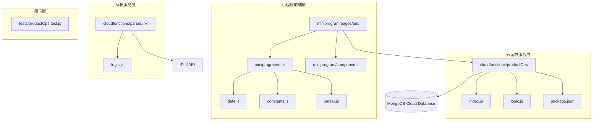
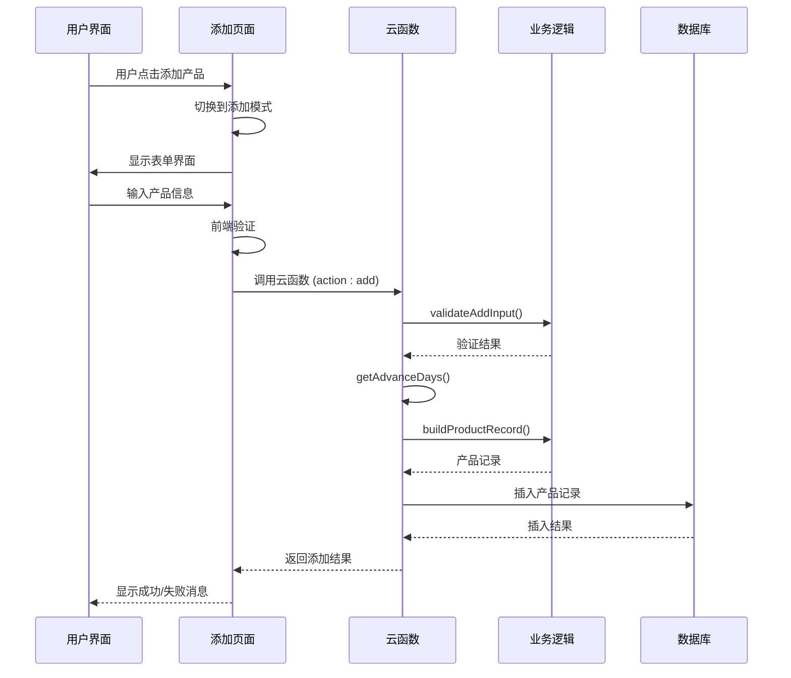
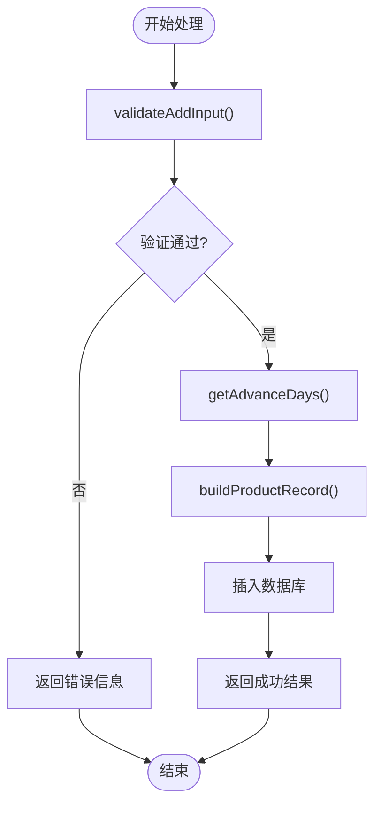
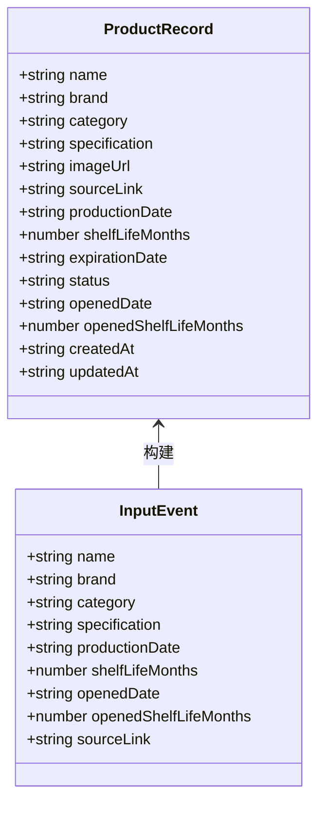
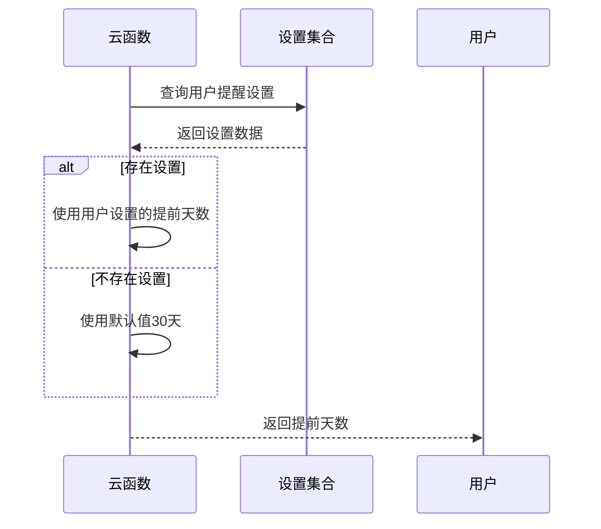
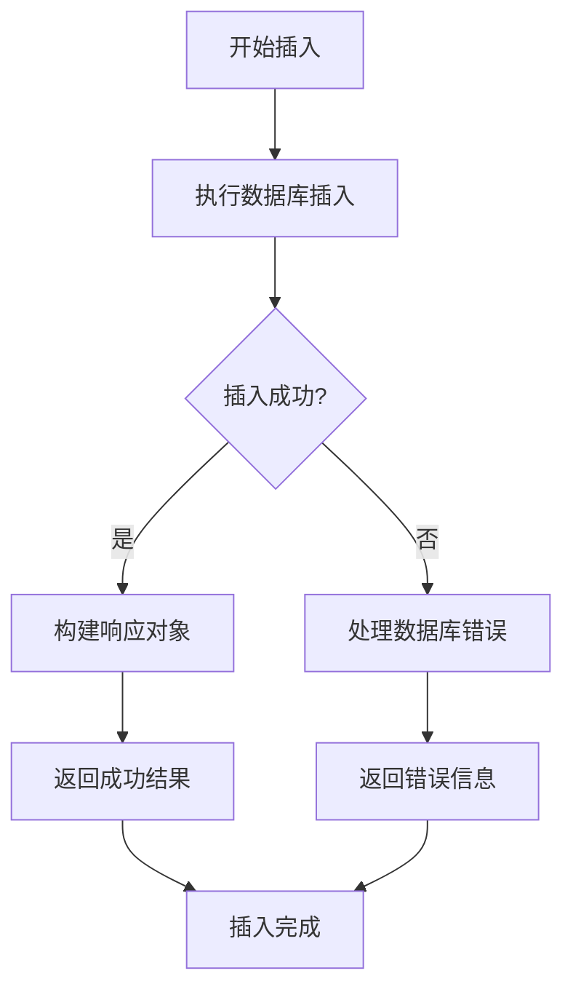
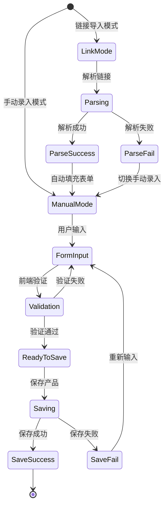
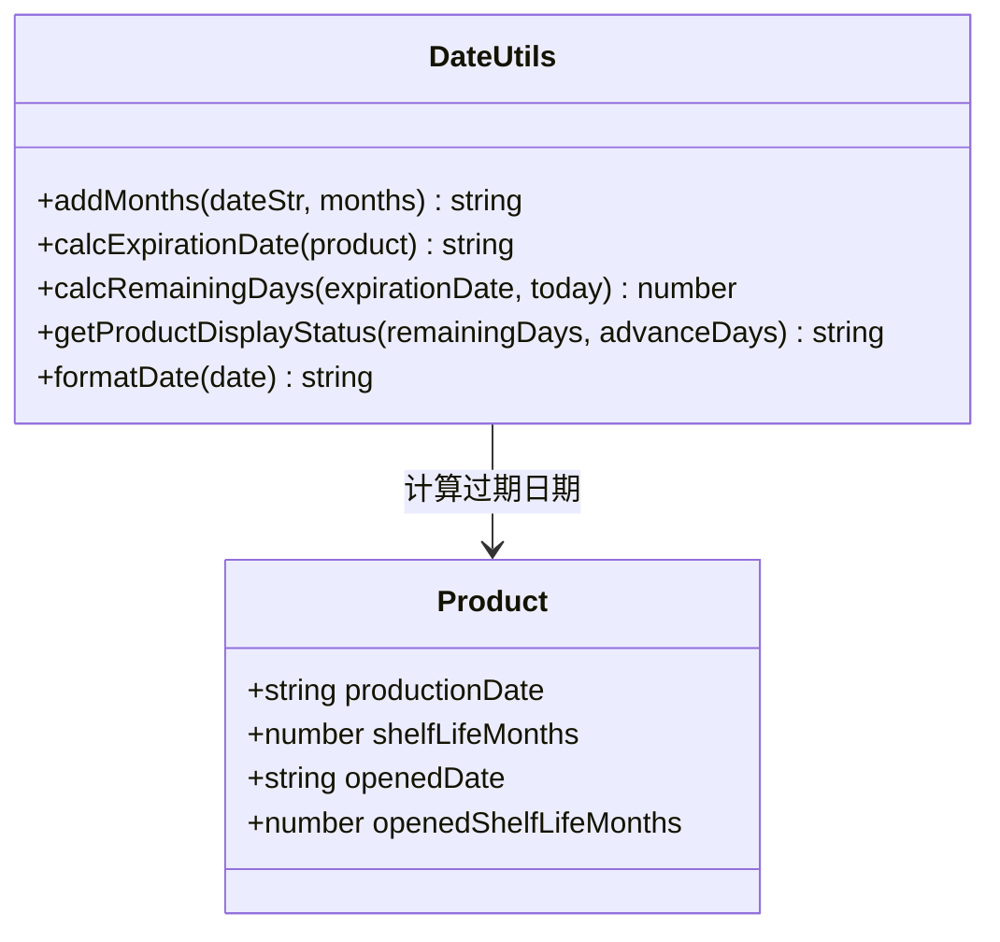
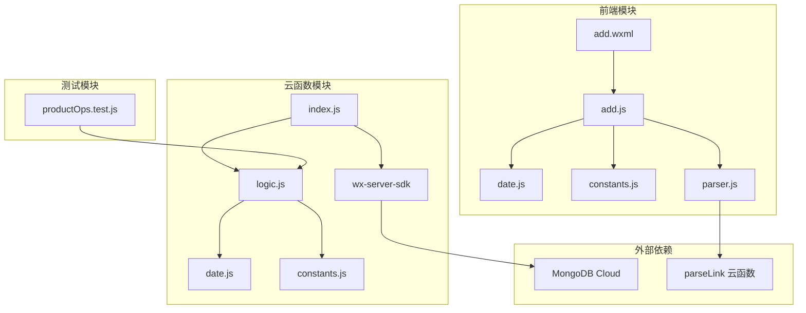

# 产品添加操作 (handleAdd)

<cite>
**本文档引用的文件**
- [cloudfunctions/productOps/index.js](file://cloudfunctions/productOps/index.js)
- [cloudfunctions/productOps/logic.js](file://cloudfunctions/productOps/logic.js)
- [cloudfunctions/productOps/package.json](file://cloudfunctions/productOps/package.json)
- [miniprogram/pages/add/add.js](file://miniprogram/pages/add/add.js)
- [miniprogram/pages/add/add.wxml](file://miniprogram/pages/add/add.wxml)
- [miniprogram/pages/add/add.json](file://miniprogram/pages/add/add.json)
- [miniprogram/utils/date.js](file://miniprogram/utils/date.js)
- [miniprogram/utils/constants.js](file://miniprogram/utils/constants.js)
- [miniprogram/utils/parser.js](file://miniprogram/utils/parser.js)
- [cloudfunctions/parseLink/logic.js](file://cloudfunctions/parseLink/logic.js)
- [tests/productOps.test.js](file://tests/productOps.test.js)
</cite>

## 目录
1. [简介](#简介)
2. [项目结构](#项目结构)
3. [核心组件](#核心组件)
4. [架构概览](#架构概览)
5. [详细组件分析](#详细组件分析)
6. [依赖关系分析](#依赖关系分析)
7. [性能考虑](#性能考虑)
8. [故障排除指南](#故障排除指南)
9. [结论](#结论)
10. [附录](#附录)

## 简介

本文档详细介绍了微信小程序中产品添加操作的完整实现指南，重点围绕 `handleAdd` 函数的工作原理。该功能支持两种添加模式：链接导入和手动录入，通过云函数实现数据验证、记录构建和数据库存储。

产品添加操作涉及完整的前端交互界面、云函数处理逻辑和数据库存储，形成了一个完整的 CRUD 操作流程。本文将深入解释每个组件的作用、数据流和错误处理机制。

## 项目结构

项目采用前后端分离的架构设计，主要分为以下层次：



**图表来源**
- [cloudfunctions/productOps/index.js:1-171](file://cloudfunctions/productOps/index.js#L1-L171)
- [miniprogram/pages/add/add.js:1-260](file://miniprogram/pages/add/add.js#L1-L260)

**章节来源**
- [cloudfunctions/productOps/index.js:1-171](file://cloudfunctions/productOps/index.js#L1-L171)
- [miniprogram/pages/add/add.js:1-260](file://miniprogram/pages/add/add.js#L1-L260)

## 核心组件

### 云函数入口模块

`cloudfunctions/productOps/index.js` 是整个产品操作的核心入口，负责：
- 初始化微信云开发环境
- 定义数据库连接和集合
- 实现操作分发器
- 提供具体的业务操作函数

### 业务逻辑模块

`cloudfunctions/productOps/logic.js` 包含纯函数实现：
- 输入验证函数
- 产品记录构建函数
- 状态计算函数
- 更新逻辑函数

### 前端添加页面

`miniprogram/pages/add/add.js` 提供用户交互界面：
- 支持链接导入和手动录入两种模式
- 实时过期时间计算预览
- 表单验证和错误提示
- 云函数调用和结果处理

**章节来源**
- [cloudfunctions/productOps/index.js:13-64](file://cloudfunctions/productOps/index.js#L13-L64)
- [cloudfunctions/productOps/logic.js:1-105](file://cloudfunctions/productOps/logic.js#L1-L105)
- [miniprogram/pages/add/add.js:10-260](file://miniprogram/pages/add/add.js#L10-L260)

## 架构概览

产品添加操作的整体架构遵循三层设计模式：



**图表来源**
- [cloudfunctions/productOps/index.js:75-90](file://cloudfunctions/productOps/index.js#L75-L90)
- [cloudfunctions/productOps/logic.js:11-17](file://cloudfunctions/productOps/logic.js#L11-L17)
- [cloudfunctions/productOps/logic.js:45-71](file://cloudfunctions/productOps/logic.js#L45-L71)

## 详细组件分析

### handleAdd 函数详解

`handleAdd` 函数是产品添加操作的核心实现，包含完整的处理流程：

#### 函数签名和参数
```javascript
async function handleAdd(event, openid)
```

**参数说明：**
- `event`: 客户端传递的事件参数，包含产品相关信息
- `openid`: 当前用户的唯一标识符

#### 处理流程



**图表来源**
- [cloudfunctions/productOps/index.js:75-90](file://cloudfunctions/productOps/index.js#L75-L90)

#### 输入验证机制 (validateAddInput)

验证规则严格确保数据完整性：

| 字段 | 验证规则 | 错误信息 |
|------|----------|----------|
| name | 必填且非空 | 产品名称不能为空 |
| category | 必填且非空 | 分类不能为空 |
| productionDate | 必填 | 生产日期不能为空 |
| shelfLifeMonths | 必须大于0 | 保质期必须大于0 |

验证逻辑使用严格的条件判断，确保每个必填字段都得到正确验证。

#### 产品记录构建 (buildProductRecord)

`buildProductRecord` 函数根据输入事件构建完整的产品记录：



**图表来源**
- [cloudfunctions/productOps/logic.js:45-71](file://cloudfunctions/productOps/logic.js#L45-L71)

#### 提前天数获取 (getAdvanceDays)

`getAdvanceDays` 函数用于获取用户的提醒设置：



**图表来源**
- [cloudfunctions/productOps/index.js:66-73](file://cloudfunctions/productOps/index.js#L66-L73)

#### 数据库插入操作

插入操作包含完整的错误处理和结果返回：



**图表来源**
- [cloudfunctions/productOps/index.js:85-89](file://cloudfunctions/productOps/index.js#L85-L89)

**章节来源**
- [cloudfunctions/productOps/index.js:75-90](file://cloudfunctions/productOps/index.js#L75-L90)
- [cloudfunctions/productOps/logic.js:11-17](file://cloudfunctions/productOps/logic.js#L11-L17)
- [cloudfunctions/productOps/logic.js:45-71](file://cloudfunctions/productOps/logic.js#L45-L71)
- [cloudfunctions/productOps/index.js:66-73](file://cloudfunctions/productOps/index.js#L66-L73)

### 前端交互组件

#### 添加页面 (add.js)

前端页面提供完整的用户交互体验：



**图表来源**
- [miniprogram/pages/add/add.js:154-235](file://miniprogram/pages/add/add.js#L154-L235)

#### 表单验证和错误处理

前端提供双重验证机制：

1. **实时验证**：用户输入时即时验证
2. **提交验证**：保存时进行完整验证

验证规则与后端保持一致，确保数据一致性。

**章节来源**
- [miniprogram/pages/add/add.js:154-235](file://miniprogram/pages/add/add.js#L154-L235)
- [miniprogram/pages/add/add.wxml:1-195](file://miniprogram/pages/add/add.wxml#L1-L195)

### 工具函数分析

#### 日期计算工具

`miniprogram/utils/date.js` 提供核心的日期计算功能：



**图表来源**
- [miniprogram/utils/date.js:25-48](file://miniprogram/utils/date.js#L25-L48)

#### 常量定义

`miniprogram/utils/constants.js` 定义了产品状态和预设分类：

| 常量 | 值 | 用途 |
|------|-----|------|
| PRODUCT_STATUS.IN_USE | in_use | 正常使用中 |
| PRODUCT_STATUS.EXPIRING_SOON | expiring_soon | 即将过期 |
| PRODUCT_STATUS.EXPIRED | expired | 已过期 |
| PRODUCT_STATUS.USED_UP | used_up | 已用完 |
| PRODUCT_STATUS.DISCARDED | discarded | 已丢弃 |

**章节来源**
- [miniprogram/utils/date.js:1-76](file://miniprogram/utils/date.js#L1-L76)
- [miniprogram/utils/constants.js:1-100](file://miniprogram/utils/constants.js#L1-L100)

## 依赖关系分析

### 模块依赖图



**图表来源**
- [cloudfunctions/productOps/index.js:5-19](file://cloudfunctions/productOps/index.js#L5-L19)
- [cloudfunctions/productOps/logic.js:5](file://cloudfunctions/productOps/logic.js#L5)

### 关键依赖关系

1. **云函数依赖**：`index.js` 依赖 `logic.js` 提供的业务逻辑
2. **工具函数依赖**：业务逻辑依赖日期计算和常量定义
3. **前端依赖**：页面逻辑依赖工具函数和云函数
4. **测试依赖**：单元测试直接依赖业务逻辑函数

**章节来源**
- [cloudfunctions/productOps/package.json:1-9](file://cloudfunctions/productOps/package.json#L1-L9)
- [tests/productOps.test.js:1-202](file://tests/productOps.test.js#L1-L202)

## 性能考虑

### 优化策略

1. **数据库查询优化**
   - 使用索引字段 `ownerOpenid` 和 `createdAt`
   - 合理的分页查询避免大量数据传输

2. **内存使用优化**
   - 避免在内存中存储大量临时数据
   - 及时清理不需要的数据结构

3. **网络通信优化**
   - 合并多次 API 调用
   - 使用适当的缓存策略

4. **前端性能优化**
   - 表单输入时的实时验证减少无效请求
   - 预计算过期时间避免重复计算

## 故障排除指南

### 常见错误及解决方案

#### 云函数部署问题

| 错误类型 | 错误码 | 解决方案 |
|----------|--------|----------|
| 云开发未配置 | -601034 | 在微信开发者工具中开通云开发 |
| 权限不足 | 没有权限 | 检查云函数权限配置 |
| 超时 | timeout | 检查网络连接和数据库性能 |

#### 数据验证错误

| 错误类型 | 触发条件 | 解决方案 |
|----------|----------|----------|
| 产品名称为空 | name 为空 | 确保用户输入有效的产品名称 |
| 分类为空 | category 为空 | 选择有效的分类选项 |
| 生产日期缺失 | productionDate 为空 | 选择正确的生产日期 |
| 保质期无效 | shelfLifeMonths ≤ 0 | 输入大于0的保质期月份 |

#### 数据库操作错误

| 错误类型 | 可能原因 | 解决方案 |
|----------|----------|----------|
| 插入失败 | 数据格式错误 | 检查字段类型和格式 |
| 权限错误 | 用户身份验证失败 | 重新登录小程序 |
| 网络错误 | 网络连接中断 | 检查网络状态后重试 |

**章节来源**
- [miniprogram/pages/add/add.js:212-234](file://miniprogram/pages/add/add.js#L212-L234)
- [cloudfunctions/productOps/index.js:61-63](file://cloudfunctions/productOps/index.js#L61-L63)

## 结论

产品添加操作 (`handleAdd`) 实现了一个完整的 CRUD 流程，具有以下特点：

1. **模块化设计**：清晰的职责分离，便于维护和测试
2. **数据完整性**：严格的前后端双重验证机制
3. **用户体验**：友好的界面设计和实时反馈
4. **扩展性**：基于云函数的架构便于功能扩展
5. **可靠性**：完善的错误处理和异常恢复机制

该实现为类似的产品管理场景提供了良好的参考模板，具有较强的实用价值和学习意义。

## 附录

### API 请求示例

#### 成功请求示例
```json
{
  "action": "add",
  "name": "SK-II 神仙水",
  "brand": "SK-II",
  "category": "护肤",
  "specification": "230ml",
  "productionDate": "2025-01-01",
  "shelfLifeMonths": 36,
  "sourceLink": "https://item.taobao.com/item.htm?id=123456789"
}
```

#### 响应示例
```json
{
  "success": true,
  "data": {
    "_id": "5f9d8c3b9f1a2b0017c8d456",
    "name": "SK-II 神仙水",
    "brand": "SK-II",
    "category": "护肤",
    "productionDate": "2025-01-01",
    "shelfLifeMonths": 36,
    "expirationDate": "2028-01-01",
    "status": "in_use",
    "createdAt": "2026-03-31T10:00:00.000Z",
    "updatedAt": "2026-03-31T10:00:00.000Z",
    "ownerOpenid": "o5f9d8c3b9f1a2b0017c8d456"
  }
}
```

### 字段说明

| 字段名 | 类型 | 必填 | 说明 |
|--------|------|------|------|
| action | string | 是 | 操作类型，固定为 "add" |
| name | string | 是 | 产品名称 |
| brand | string | 否 | 产品品牌 |
| category | string | 是 | 产品分类 |
| specification | string | 否 | 产品规格 |
| productionDate | string | 是 | 生产日期 (YYYY-MM-DD) |
| shelfLifeMonths | number | 是 | 保质期（月） |
| openedDate | string | 否 | 开封日期 (YYYY-MM-DD) |
| openedShelfLifeMonths | number | 否 | 开封后保质期（月） |
| sourceLink | string | 否 | 来源链接 |

### 状态说明

| 状态值 | 含义 | 说明 |
|--------|------|------|
| in_use | 正常使用中 | 距离过期还有较长时间 |
| expiring_soon | 即将过期 | 距离过期天数小于等于提前天数 |
| expired | 已过期 | 距离过期天数小于等于0 |