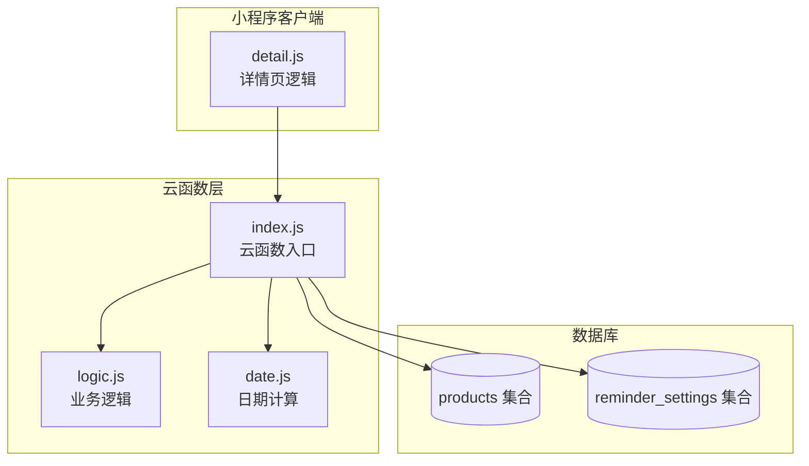
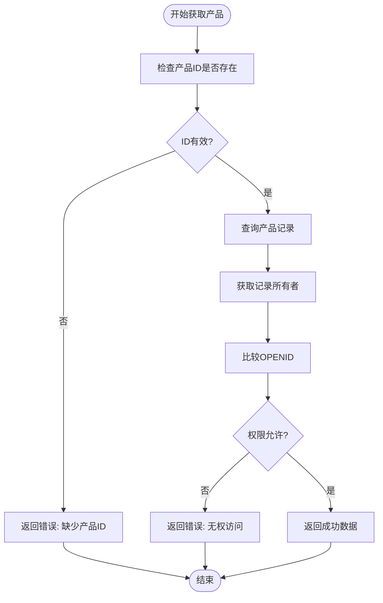
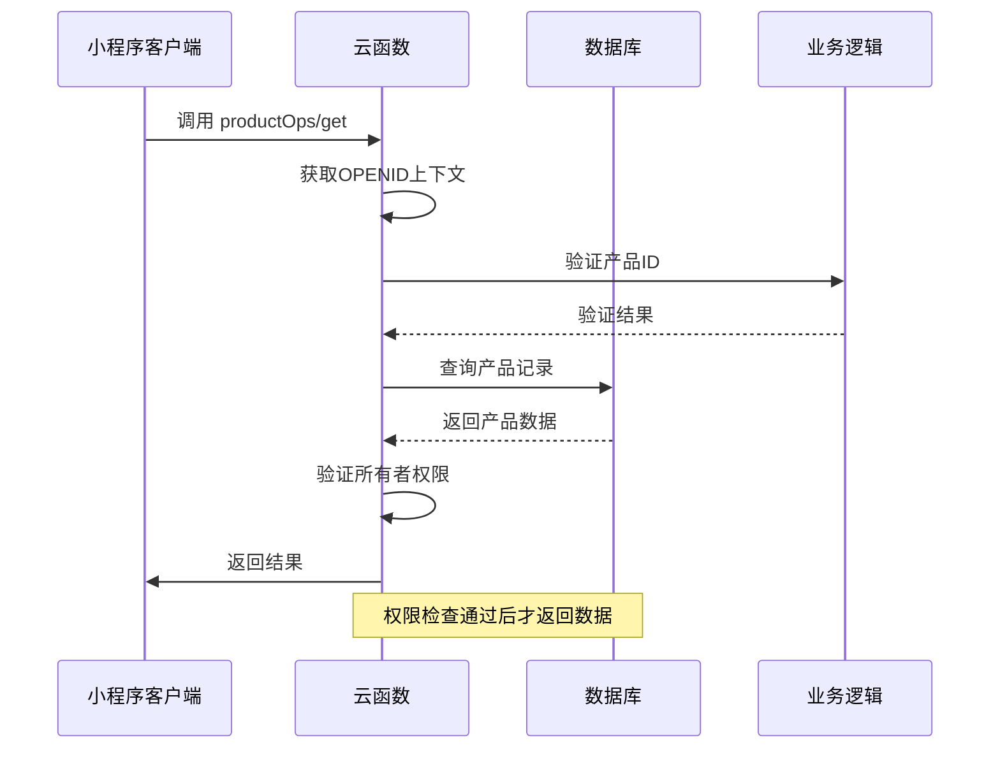
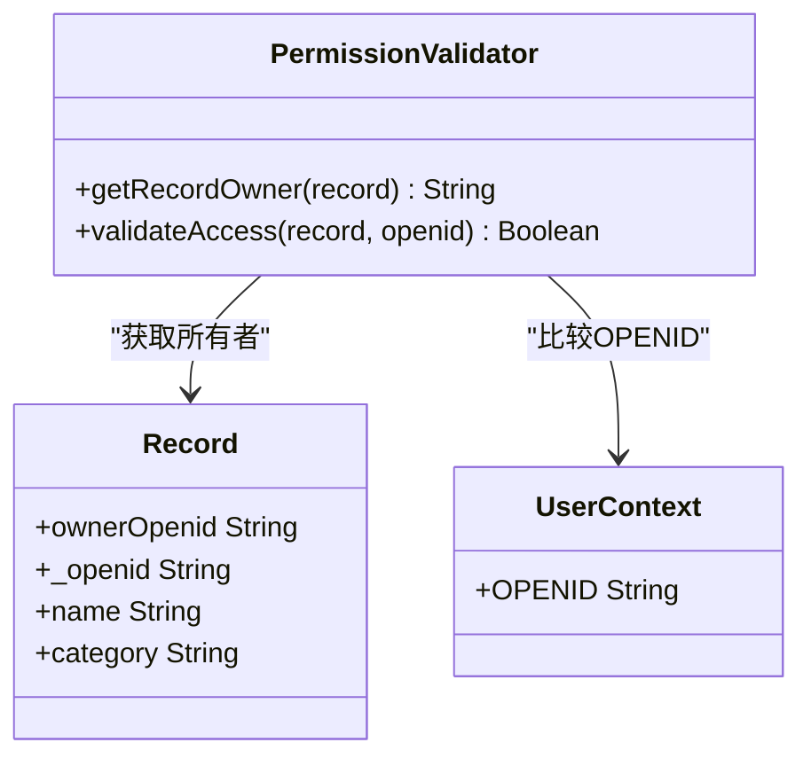
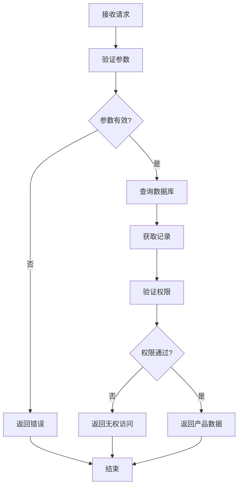
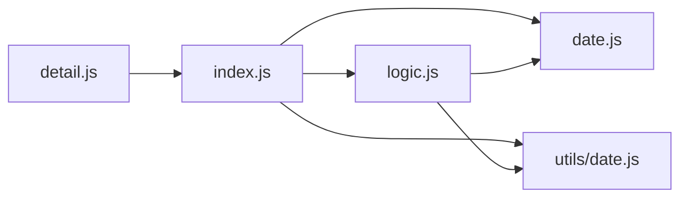

# 产品获取操作 (handleGet)

<cite>
**本文档引用的文件**
- [cloudfunctions/productOps/index.js](file://cloudfunctions/productOps/index.js)
- [cloudfunctions/productOps/logic.js](file://cloudfunctions/productOps/logic.js)
- [cloudfunctions/productOps/date.js](file://cloudfunctions/productOps/date.js)
- [miniprogram/pages/detail/detail.js](file://miniprogram/pages/detail/detail.js)
- [tests/productOps.test.js](file://tests/productOps.test.js)
</cite>

## 目录
1. [简介](#简介)
2. [项目结构](#项目结构)
3. [核心组件](#核心组件)
4. [架构概览](#架构概览)
5. [详细组件分析](#详细组件分析)
6. [依赖关系分析](#依赖关系分析)
7. [性能考虑](#性能考虑)
8. [故障排除指南](#故障排除指南)
9. [结论](#结论)

## 简介

本文档详细介绍了微信小程序中产品获取操作（handleGet）的实现指南。该功能负责单个产品查询逻辑，包括产品ID验证、权限检查（ownerOpenid验证）和数据获取流程。系统采用严格的权限控制机制，确保用户只能访问自己的产品数据，并提供了完善的错误处理机制。

## 项目结构

产品获取操作位于云函数 `productOps` 中，采用模块化设计，将业务逻辑与云函数入口分离：



**图表来源**
- [cloudfunctions/productOps/index.js:1-171](file://cloudfunctions/productOps/index.js#L1-L171)
- [cloudfunctions/productOps/logic.js:1-105](file://cloudfunctions/productOps/logic.js#L1-L105)

**章节来源**
- [cloudfunctions/productOps/index.js:1-171](file://cloudfunctions/productOps/index.js#L1-L171)
- [cloudfunctions/productOps/package.json:1-9](file://cloudfunctions/productOps/package.json#L1-L9)

## 核心组件

### 权限控制机制

系统实现了双重权限验证机制：

1. **产品ID验证**：确保请求包含有效的 `_id` 参数
2. **所有者验证**：通过 `getRecordOwner` 函数获取产品记录的所有者标识，与当前用户OPENID进行对比



**图表来源**
- [cloudfunctions/productOps/index.js:112-121](file://cloudfunctions/productOps/index.js#L112-L121)

**章节来源**
- [cloudfunctions/productOps/index.js:21-23](file://cloudfunctions/productOps/index.js#L21-L23)
- [cloudfunctions/productOps/index.js:112-121](file://cloudfunctions/productOps/index.js#L112-L121)

## 架构概览

产品获取操作在整个系统中的位置和交互关系：



**图表来源**
- [cloudfunctions/productOps/index.js:40-64](file://cloudfunctions/productOps/index.js#L40-L64)
- [cloudfunctions/productOps/index.js:112-121](file://cloudfunctions/productOps/index.js#L112-L121)

## 详细组件分析

### handleGet 函数实现

`handleGet` 函数是产品获取操作的核心实现，具有以下特点：

#### 参数验证规则

| 参数 | 必填 | 类型 | 验证规则 | 错误信息 |
|------|------|------|----------|----------|
| _id | 是 | String | 必须存在且非空 | 缺少产品ID |
| action | 是 | String | 必须等于 'get' | 未知操作 |

#### 权限检查机制



**图表来源**
- [cloudfunctions/productOps/index.js:21-23](file://cloudfunctions/productOps/index.js#L21-L23)
- [cloudfunctions/productOps/index.js:112-121](file://cloudfunctions/productOps/index.js#L112-L121)

#### 数据获取流程



**图表来源**
- [cloudfunctions/productOps/index.js:112-121](file://cloudfunctions/productOps/index.js#L112-L121)

**章节来源**
- [cloudfunctions/productOps/index.js:112-121](file://cloudfunctions/productOps/index.js#L112-L121)

### getRecordOwner 函数

该函数负责从产品记录中提取所有者标识，支持两种兼容的字段：

```javascript
// 支持的字段顺序
function getRecordOwner(record) {
  return (record && (record.ownerOpenid || record._openid)) || '';
}
```

这种设计确保了向后兼容性，可以处理不同版本的数据格式。

**章节来源**
- [cloudfunctions/productOps/index.js:21-23](file://cloudfunctions/productOps/index.js#L21-L23)

### 错误处理机制

系统提供了多层次的错误处理：

| 错误类型 | 触发条件 | 错误信息 | 返回格式 |
|----------|----------|----------|----------|
| 参数错误 | 缺少 _id 参数 | 缺少产品ID | `{ success: false, error: '缺少产品ID' }` |
| 权限错误 | 所有者不匹配 | 无权访问 | `{ success: false, error: '无权访问' }` |
| 数据错误 | 产品不存在 | 产品不存在 | `{ success: false, error: '产品不存在' }` |
| 系统错误 | 异常捕获 | 错误消息 | `{ success: false, error: err.message }` |

**章节来源**
- [cloudfunctions/productOps/index.js:112-121](file://cloudfunctions/productOps/index.js#L112-L121)
- [cloudfunctions/productOps/index.js:61-63](file://cloudfunctions/productOps/index.js#L61-L63)

### 响应格式规范

成功的响应格式：
```javascript
{
  success: true,
  data: {
    _id: "产品ID",
    name: "产品名称",
    brand: "品牌",
    category: "分类",
    specification: "规格",
    imageUrl: "图片URL",
    sourceLink: "来源链接",
    productionDate: "生产日期",
    shelfLifeMonths: 保质期(月),
    expirationDate: "过期日期",
    status: "状态",
    openedDate: "开封日期",
    openedShelfLifeMonths: 开封后保质期,
    createdAt: "创建时间",
    updatedAt: "更新时间",
    ownerOpenid: "所有者OPENID"
  }
}
```

失败的响应格式：
```javascript
{
  success: false,
  error: "错误描述"
}
```

**章节来源**
- [cloudfunctions/productOps/index.js:112-121](file://cloudfunctions/productOps/index.js#L112-L121)

## 依赖关系分析

### 内部依赖关系



**图表来源**
- [cloudfunctions/productOps/index.js:13-19](file://cloudfunctions/productOps/index.js#L13-L19)
- [cloudfunctions/productOps/logic.js:5](file://cloudfunctions/productOps/logic.js#L5)

### 外部依赖

- **wx-server-sdk**: 微信云开发SDK，提供数据库操作和环境变量获取
- **数据库集合**: `products` 和 `reminder_settings`

**章节来源**
- [cloudfunctions/productOps/package.json:5-7](file://cloudfunctions/productOps/package.json#L5-L7)
- [cloudfunctions/productOps/index.js:5](file://cloudfunctions/productOps/index.js#L5)

## 性能考虑

### 查询优化

1. **直接ID查询**: 使用 `productsCollection.doc(_id).get()` 进行精确查询
2. **索引利用**: 建议在 `ownerOpenid` 字段建立索引以提高权限检查效率
3. **最小化数据传输**: 只返回必要的产品字段

### 缓存策略

- **客户端缓存**: 小程序端可以缓存最近访问的产品数据
- **数据库查询缓存**: 对于频繁访问的热门产品可以考虑应用层缓存

## 故障排除指南

### 常见问题及解决方案

| 问题类型 | 症状 | 可能原因 | 解决方案 |
|----------|------|----------|----------|
| 权限拒绝 | 返回 "无权访问" | 用户尝试访问其他用户的產品 | 检查OPENID是否正确传递 |
| 产品不存在 | 返回 "产品不存在" | _id参数错误或产品已被删除 | 验证产品ID的有效性 |
| 参数缺失 | 返回 "缺少产品ID" | 请求中缺少 _id 参数 | 确保调用时包含正确的参数 |
| 数据库连接失败 | 抛出异常 | 云函数环境配置问题 | 检查云开发环境配置 |

### 调试建议

1. **启用日志**: 在云函数中添加适当的日志输出
2. **参数验证**: 在客户端和服务端都进行参数验证
3. **错误监控**: 设置适当的错误监控和告警机制

**章节来源**
- [cloudfunctions/productOps/index.js:61-63](file://cloudfunctions/productOps/index.js#L61-L63)

## 结论

产品获取操作（handleGet）实现了安全可靠的产品查询功能。通过严格的参数验证、权限检查和错误处理机制，确保了用户只能访问自己的产品数据。系统的设计充分考虑了安全性、性能和可维护性，为后续的功能扩展奠定了良好的基础。

该实现遵循了微服务架构的最佳实践，将业务逻辑与云函数入口分离，便于单元测试和维护。同时，通过模块化的代码组织，提高了代码的可读性和可扩展性。