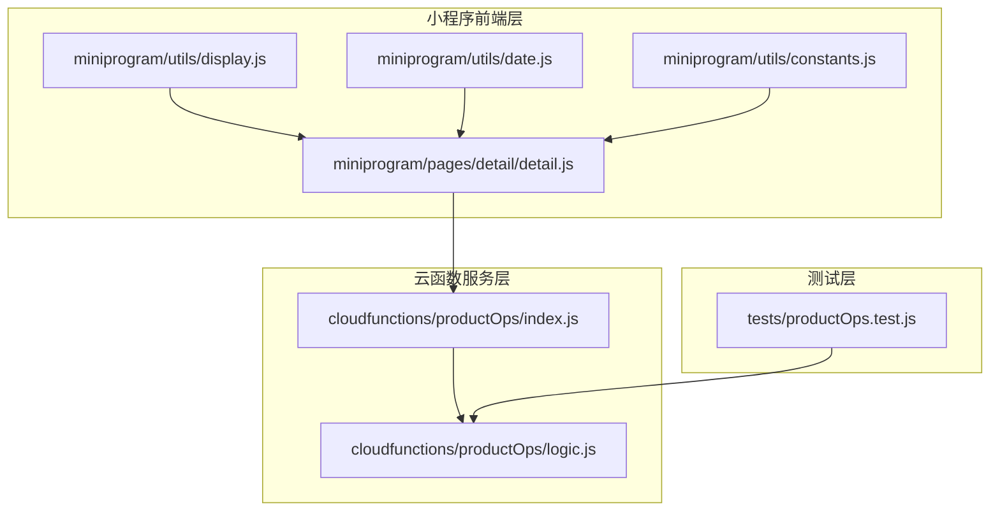
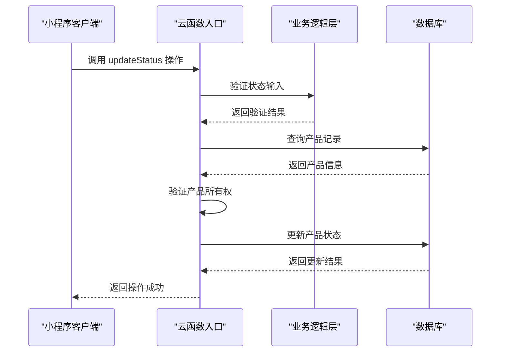
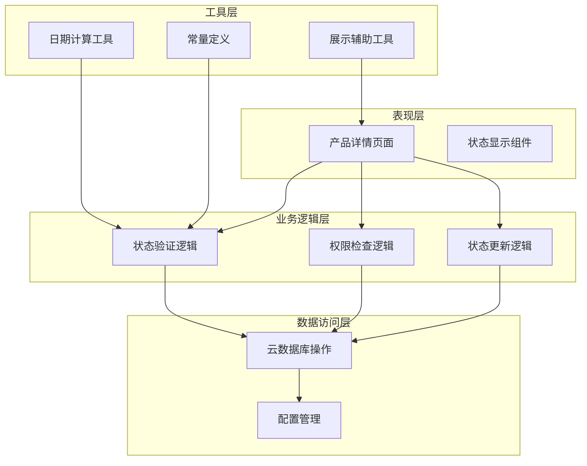
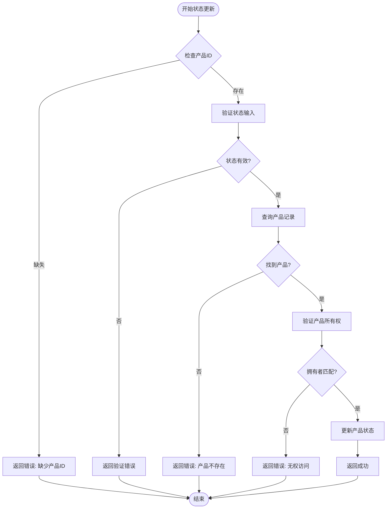
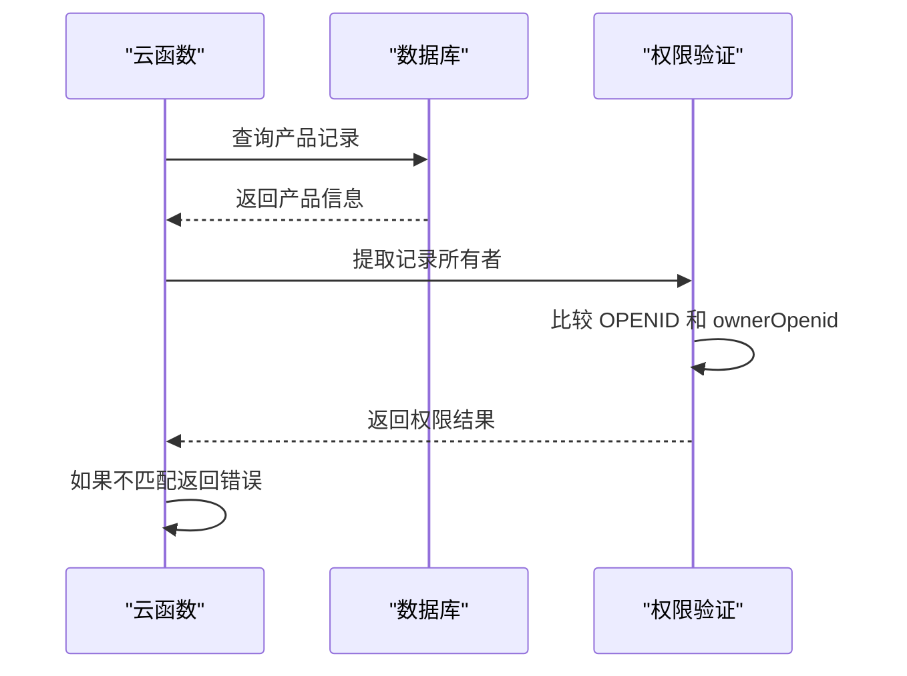
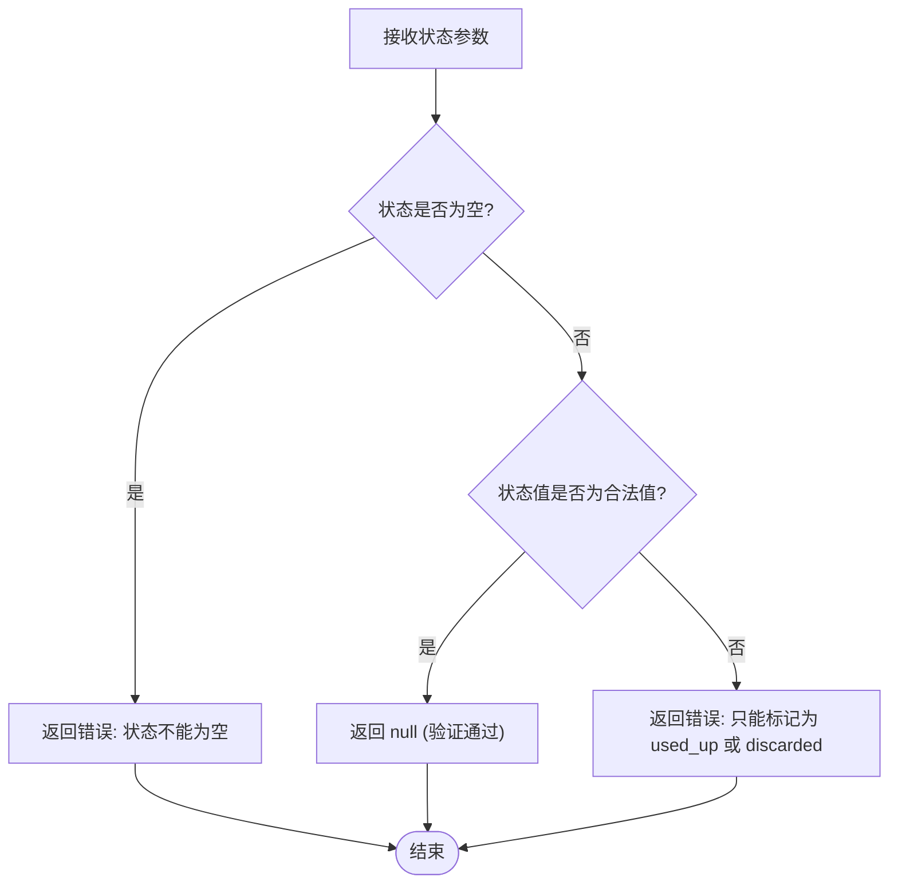
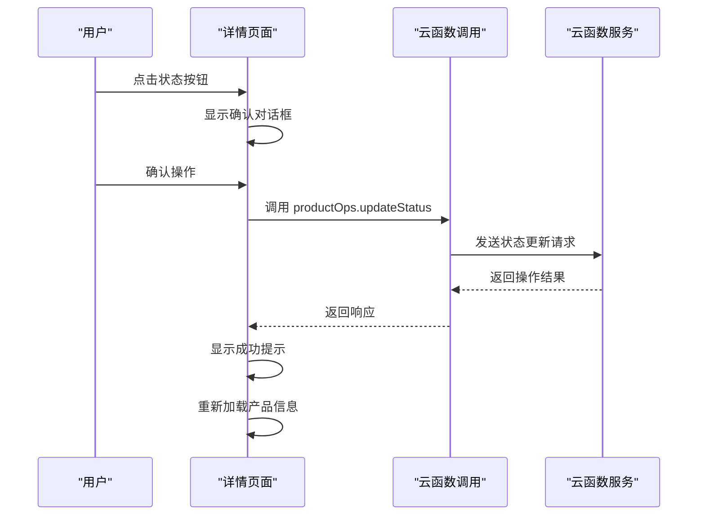
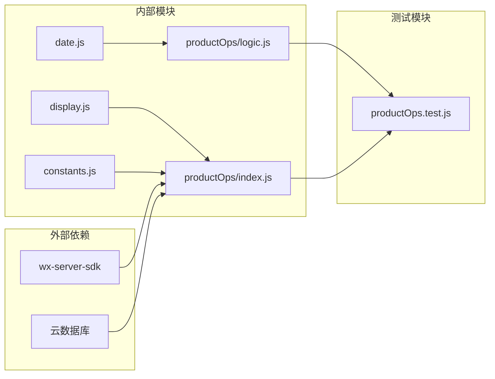

# 状态更新操作 (handleUpdateStatus)

<cite>
**本文档引用的文件**
- [cloudfunctions/productOps/index.js](file://cloudfunctions/productOps/index.js)
- [cloudfunctions/productOps/logic.js](file://cloudfunctions/productOps/logic.js)
- [tests/productOps.test.js](file://tests/productOps.test.js)
- [miniprogram/pages/detail/detail.js](file://miniprogram/pages/detail/detail.js)
- [miniprogram/utils/constants.js](file://miniprogram/utils/constants.js)
- [miniprogram/utils/display.js](file://miniprogram/utils/display.js)
- [miniprogram/utils/date.js](file://miniprogram/utils/date.js)
</cite>

## 目录
1. [简介](#简介)
2. [项目结构](#项目结构)
3. [核心组件](#核心组件)
4. [架构概览](#架构概览)
5. [详细组件分析](#详细组件分析)
6. [依赖关系分析](#依赖关系分析)
7. [性能考虑](#性能考虑)
8. [故障排除指南](#故障排除指南)
9. [结论](#结论)

## 简介

本文档详细介绍了微信小程序中状态更新操作的实现指南，重点分析了 `handleUpdateStatus` 函数的状态更新逻辑。该功能允许用户将产品标记为"用完"或"丢弃"状态，实现了完整的状态验证、权限检查和状态更新流程。

系统采用云函数架构，通过云开发提供的云函数服务处理业务逻辑，确保数据安全性和一致性。状态更新操作遵循严格的验证机制，包括输入验证、权限验证和状态转换规则。

## 项目结构

项目采用模块化设计，主要分为以下几个层次：

**图表来源**
- [cloudfunctions/productOps/index.js:1-171](file://cloudfunctions/productOps/index.js#L1-L171)
- [cloudfunctions/productOps/logic.js:1-105](file://cloudfunctions/productOps/logic.js#L1-L105)

**章节来源**
- [cloudfunctions/productOps/index.js:1-171](file://cloudfunctions/productOps/index.js#L1-L171)
- [cloudfunctions/productOps/logic.js:1-105](file://cloudfunctions/productOps/logic.js#L1-L105)

## 核心组件

### 状态更新云函数入口

`handleUpdateStatus` 函数是状态更新操作的核心入口点，负责协调整个状态更新流程：

**图表来源**
- [cloudfunctions/productOps/index.js:141-157](file://cloudfunctions/productOps/index.js#L141-L157)

### 状态验证机制

状态验证通过 `validateUpdateStatusInput` 函数实现，确保只允许特定的状态值：

| 状态值 | 含义 | 验证规则 |
|--------|------|----------|
| `used_up` | 已用完 | 必须存在且等于 "used_up" |
| `discarded` | 已丢弃 | 必须存在且等于 "discarded" |
| 其他值 | 非法状态 | 返回错误信息 |

**章节来源**
- [cloudfunctions/productOps/logic.js:23-29](file://cloudfunctions/productOps/logic.js#L23-L29)
- [tests/productOps.test.js:48-68](file://tests/productOps.test.js#L48-L68)

## 架构概览

系统采用分层架构设计，确保职责分离和代码可维护性：

**图表来源**
- [cloudfunctions/productOps/index.js:13-19](file://cloudfunctions/productOps/index.js#L13-L19)
- [cloudfunctions/productOps/logic.js:1-105](file://cloudfunctions/productOps/logic.js#L1-L105)

## 详细组件分析

### handleUpdateStatus 函数实现

`handleUpdateStatus` 函数实现了完整的状态更新流程，包含三个关键步骤：

#### 1. 输入参数验证

函数首先验证必需的参数：
- `_id`: 产品唯一标识符
- `status`: 目标状态值

**图表来源**
- [cloudfunctions/productOps/index.js:141-157](file://cloudfunctions/productOps/index.js#L141-L157)

#### 2. 权限检查机制

权限检查通过 `getRecordOwner` 函数实现，确保只有产品所有者才能修改状态：

**图表来源**
- [cloudfunctions/productOps/index.js:21-23](file://cloudfunctions/productOps/index.js#L21-L23)
- [cloudfunctions/productOps/index.js:148-151](file://cloudfunctions/productOps/index.js#L148-L151)

#### 3. 状态更新流程

状态更新操作包含以下步骤：
- 更新 `status` 字段为目标状态
- 设置 `updatedAt` 字段为当前时间戳
- 执行数据库更新操作

**章节来源**
- [cloudfunctions/productOps/index.js:141-157](file://cloudfunctions/productOps/index.js#L141-L157)

### 状态验证函数详解

`validateUpdateStatusInput` 函数提供了严格的状态验证机制：

**图表来源**
- [cloudfunctions/productOps/logic.js:23-29](file://cloudfunctions/productOps/logic.js#L23-L29)

**章节来源**
- [cloudfunctions/productOps/logic.js:23-29](file://cloudfunctions/productOps/logic.js#L23-L29)
- [tests/productOps.test.js:48-68](file://tests/productOps.test.js#L48-L68)

### 前端集成实现

小程序前端通过 `detail.js` 页面实现状态更新的用户交互：

**图表来源**
- [miniprogram/pages/detail/detail.js:81-99](file://miniprogram/pages/detail/detail.js#L81-L99)

**章节来源**
- [miniprogram/pages/detail/detail.js:71-99](file://miniprogram/pages/detail/detail.js#L71-L99)

### 状态枚举值说明

系统支持多种状态类型，但状态更新操作仅允许以下两种状态：

| 状态键 | 状态值 | 中文含义 | 使用场景 |
|--------|--------|----------|----------|
| `IN_USE` | `in_use` | 在用 | 产品正常使用中 |
| `EXPIRING_SOON` | `expiring_soon` | 即将过期 | 产品接近过期但仍在有效期内 |
| `EXPIRED` | `expired` | 已过期 | 产品已超过有效期 |
| `USED_UP` | `used_up` | 已用完 | 用户标记产品已完全使用完毕 |
| `DISCARDED` | `discarded` | 已丢弃 | 用户标记产品已丢弃 |

**章节来源**
- [miniprogram/utils/constants.js:6-12](file://miniprogram/utils/constants.js#L6-L12)

## 依赖关系分析

系统各组件之间的依赖关系如下：

**图表来源**
- [cloudfunctions/productOps/index.js:5-19](file://cloudfunctions/productOps/index.js#L5-L19)
- [cloudfunctions/productOps/logic.js:5](file://cloudfunctions/productOps/logic.js#L5)

**章节来源**
- [cloudfunctions/productOps/index.js:5-19](file://cloudfunctions/productOps/index.js#L5-L19)
- [cloudfunctions/productOps/logic.js:5](file://cloudfunctions/productOps/logic.js#L5)

## 性能考虑

### 数据库查询优化

状态更新操作仅进行单次数据库查询，然后立即执行更新操作，避免了不必要的查询开销。

### 内存使用优化

- 使用纯函数设计，避免全局状态污染
- 输入验证在内存中完成，无需额外存储
- 状态更新操作只更新必要的字段

### 网络传输优化

- 云函数调用采用异步处理，避免阻塞主线程
- 前端只接收必要的响应数据，减少网络传输

## 故障排除指南

### 常见错误及解决方案

| 错误类型 | 错误信息 | 可能原因 | 解决方案 |
|----------|----------|----------|----------|
| 参数错误 | "缺少产品ID" | 未提供产品ID或ID格式错误 | 确保传递正确的 `_id` 参数 |
| 验证错误 | "状态不能为空" | 状态参数为空 | 提供有效的状态值 (`used_up` 或 `discarded`) |
| 权限错误 | "无权访问" | 产品不属于当前用户 | 检查用户登录状态和产品所有权 |
| 数据库错误 | "产品不存在" | 产品ID无效或已被删除 | 验证产品ID的有效性 |

### 调试建议

1. **前端调试**：在小程序开发者工具中查看云函数调用结果
2. **后端调试**：检查云函数日志，确认参数传递和处理流程
3. **数据库调试**：验证产品记录的存在性和所有权信息

**章节来源**
- [cloudfunctions/productOps/index.js:141-157](file://cloudfunctions/productOps/index.js#L141-L157)

## 结论

状态更新操作 `handleUpdateStatus` 实现了一个完整、安全、高效的用户状态标记功能。通过严格的输入验证、完善的权限检查和清晰的错误处理机制，确保了系统的可靠性和用户体验。

该实现具有以下优势：
- **安全性**：严格的权限验证防止越权操作
- **可靠性**：完整的错误处理和边界条件检查
- **可维护性**：模块化设计便于代码维护和扩展
- **用户体验**：简洁直观的操作流程和及时的反馈

未来可以考虑的功能增强包括：
- 支持更多状态类型的扩展
- 添加操作审计日志
- 实现批量状态更新功能
- 增强状态历史追踪能力