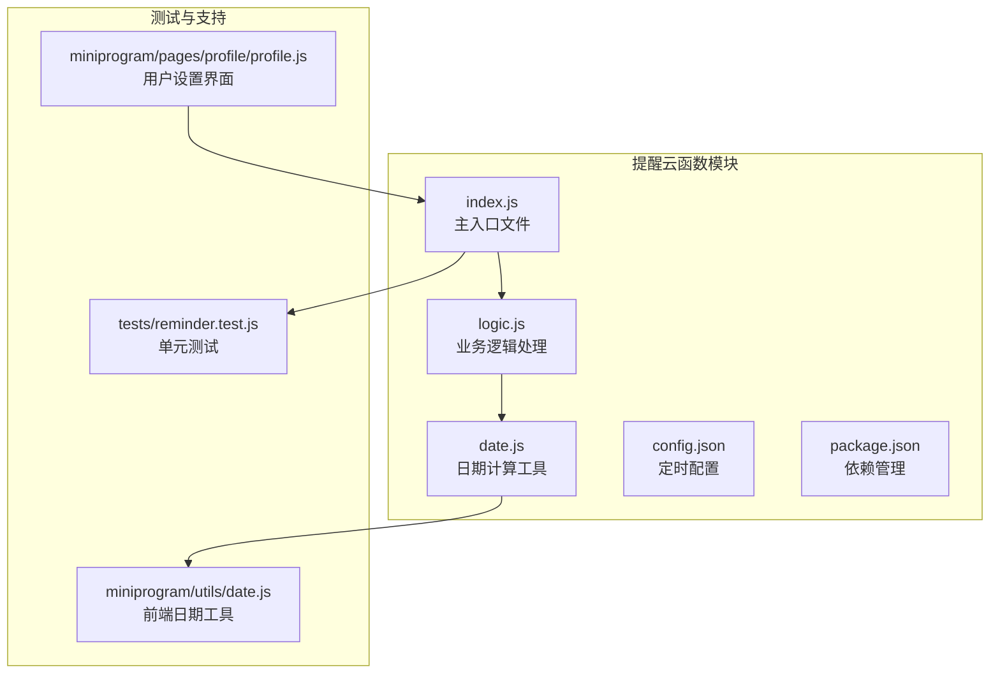
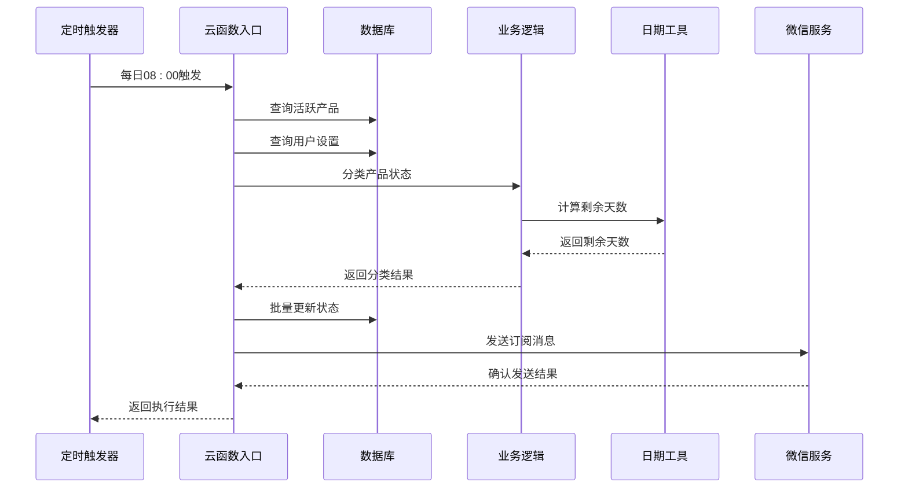
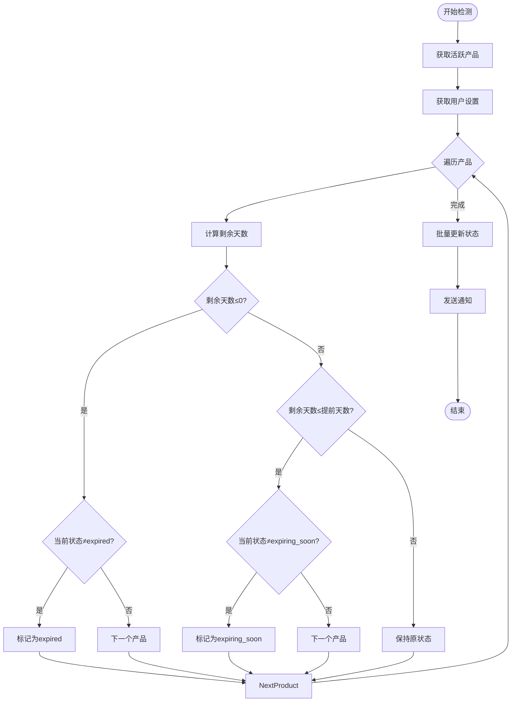
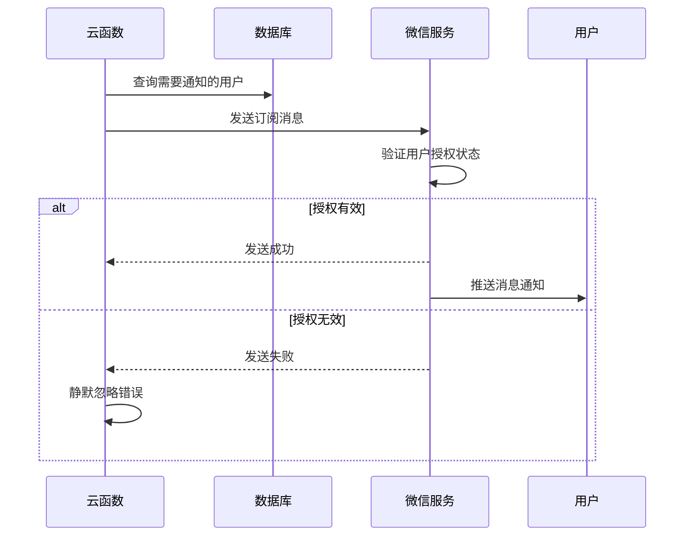
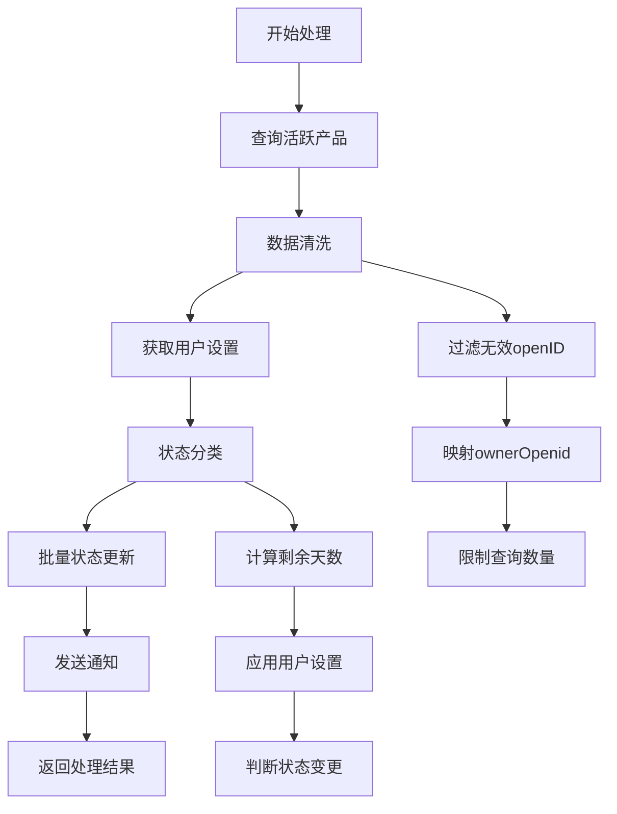
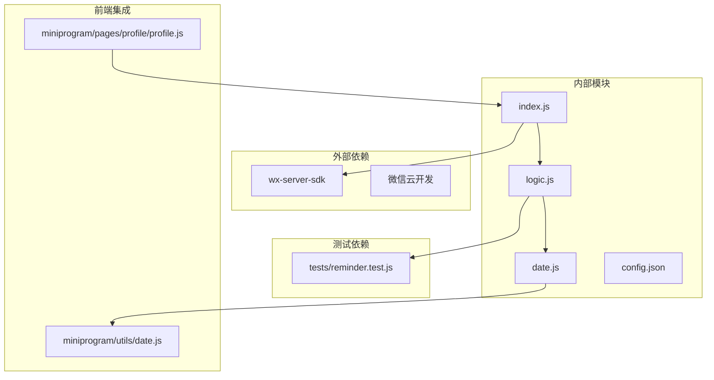

# 提醒云函数 (reminder)

<cite>
**本文档引用的文件**
- [cloudfunctions/reminder/index.js](file://cloudfunctions/reminder/index.js)
- [cloudfunctions/reminder/logic.js](file://cloudfunctions/reminder/logic.js)
- [cloudfunctions/reminder/date.js](file://cloudfunctions/reminder/date.js)
- [cloudfunctions/reminder/config.json](file://cloudfunctions/reminder/config.json)
- [cloudfunctions/reminder/package.json](file://cloudfunctions/reminder/package.json)
- [tests/reminder.test.js](file://tests/reminder.test.js)
- [miniprogram/utils/date.js](file://miniprogram/utils/date.js)
- [miniprogram/pages/profile/profile.js](file://miniprogram/pages/profile/profile.js)
- [miniprogram/utils/constants.js](file://miniprogram/utils/constants.js)
</cite>

## 目录
1. [简介](#简介)
2. [项目结构](#项目结构)
3. [核心组件](#核心组件)
4. [架构概览](#架构概览)
5. [详细组件分析](#详细组件分析)
6. [依赖关系分析](#依赖关系分析)
7. [性能考虑](#性能考虑)
8. [故障排除指南](#故障排除指南)
9. [结论](#结论)
10. [附录](#附录)

## 简介

提醒云函数是微信小程序库存管理系统中的核心定时任务组件，负责每日自动检测产品的过期状态并发送提醒通知。该系统通过智能的过期检测算法和灵活的通知推送机制，帮助用户及时管理过期产品，避免浪费和健康风险。

系统采用分层架构设计，包含定时触发器、业务逻辑处理、数据状态管理和通知推送等核心功能模块。通过配置化的提前提醒天数设置，用户可以个性化定制自己的提醒策略。

## 项目结构

提醒云函数位于 `cloudfunctions/reminder/` 目录下，采用模块化设计，每个功能模块职责明确：



**图表来源**
- [cloudfunctions/reminder/index.js:1-106](file://cloudfunctions/reminder/index.js#L1-L106)
- [cloudfunctions/reminder/logic.js:1-45](file://cloudfunctions/reminder/logic.js#L1-L45)
- [cloudfunctions/reminder/date.js:1-77](file://cloudfunctions/reminder/date.js#L1-L77)

**章节来源**
- [cloudfunctions/reminder/index.js:1-106](file://cloudfunctions/reminder/index.js#L1-L106)
- [cloudfunctions/reminder/config.json:1-9](file://cloudfunctions/reminder/config.json#L1-L9)

## 核心组件

### 主入口组件 (index.js)

主入口文件负责整个提醒系统的协调工作，包括数据查询、状态分类、批量更新和通知推送等功能。

**主要职责：**
- 初始化微信云开发环境
- 查询活跃产品列表
- 获取用户提醒设置
- 调用业务逻辑进行状态分类
- 批量更新产品状态
- 发送订阅消息通知

### 业务逻辑组件 (logic.js)

业务逻辑组件实现了核心的状态分类算法，是一个纯函数设计，便于测试和维护。

**关键特性：**
- 支持用户自定义提前提醒天数
- 默认提前提醒天数为30天
- 智能状态判断逻辑
- 批量处理优化

### 日期计算组件 (date.js)

日期计算组件提供了精确的过期时间计算和剩余天数统计功能。

**核心功能：**
- 月末溢出处理
- 未开封和开封后过期时间计算
- 剩余天数精确计算
- 日期格式化工具

**章节来源**
- [cloudfunctions/reminder/index.js:15-105](file://cloudfunctions/reminder/index.js#L15-L105)
- [cloudfunctions/reminder/logic.js:17-40](file://cloudfunctions/reminder/logic.js#L17-L40)
- [cloudfunctions/reminder/date.js:11-49](file://cloudfunctions/reminder/date.js#L11-L49)

## 架构概览

提醒云函数采用分层架构设计，确保各组件职责清晰、耦合度低：



**图表来源**
- [cloudfunctions/reminder/index.js:15-105](file://cloudfunctions/reminder/index.js#L15-L105)
- [cloudfunctions/reminder/logic.js:17-40](file://cloudfunctions/reminder/logic.js#L17-L40)
- [cloudfunctions/reminder/date.js:42-49](file://cloudfunctions/reminder/date.js#L42-L49)

## 详细组件分析

### 定时任务配置

提醒云函数通过 `config.json` 文件配置定时触发器，采用Cron表达式实现精确的时间控制。

**配置详情：**
- 触发器名称：`dailyReminder`
- 触发类型：`timer`
- 执行时间：`0 0 8 * * * *` (每天08:00:00)
- 执行频率：每日一次
- 调度策略：云端自动调度

**章节来源**
- [cloudfunctions/reminder/config.json:1-9](file://cloudfunctions/reminder/config.json#L1-L9)

### 过期检测算法

过期检测算法是系统的核心逻辑，通过综合考虑产品状态、剩余天数和用户设置来确定最终状态。



**图表来源**
- [cloudfunctions/reminder/logic.js:17-40](file://cloudfunctions/reminder/logic.js#L17-L40)

#### 算法复杂度分析

- **时间复杂度：** O(n)，其中n为活跃产品数量
- **空间复杂度：** O(n)，用于存储待更新的产品列表
- **查询复杂度：** O(k)，k为用户数量（去重后的openID数量）

#### 关键参数说明

| 参数 | 类型 | 默认值 | 描述 |
|------|------|--------|------|
| advanceDays | Number | 30 | 提前提醒天数 |
| status | String | in_use/expiring_soon | 产品状态枚举 |
| expirationDate | Date | YYYY-MM-DD | 产品过期日期 |

**章节来源**
- [cloudfunctions/reminder/logic.js:8-40](file://cloudfunctions/reminder/logic.js#L8-L40)

### 通知推送机制

系统支持基于微信订阅消息的自动化通知推送，为用户提供及时的产品状态提醒。



**图表来源**
- [cloudfunctions/reminder/index.js:72-94](file://cloudfunctions/reminder/index.js#L72-L94)

#### 消息内容格式化

系统使用固定的模板消息格式，包含以下关键信息：
- 提醒数量统计
- 日期信息
- 页面跳转路径

**章节来源**
- [cloudfunctions/reminder/index.js:80-89](file://cloudfunctions/reminder/index.js#L80-L89)

### 数据处理流程

系统采用分阶段的数据处理策略，确保数据一致性和处理效率。



**图表来源**
- [cloudfunctions/reminder/index.js:19-70](file://cloudfunctions/reminder/index.js#L19-L70)

**章节来源**
- [cloudfunctions/reminder/index.js:15-105](file://cloudfunctions/reminder/index.js#L15-L105)

## 依赖关系分析

提醒云函数的依赖关系清晰明确，遵循单一职责原则：



**图表来源**
- [cloudfunctions/reminder/package.json:5-7](file://cloudfunctions/reminder/package.json#L5-L7)
- [cloudfunctions/reminder/index.js:8](file://cloudfunctions/reminder/index.js#L8)

### 外部依赖说明

- **wx-server-sdk:** 微信云开发SDK，提供数据库操作和云函数运行环境
- **微信云开发:** 提供数据库、存储和云函数托管服务

### 内部模块依赖

- **index.js** 依赖 **logic.js** 和 **date.js**
- **logic.js** 依赖 **date.js** 的日期计算功能
- **date.js** 独立运行，提供通用日期处理能力

**章节来源**
- [cloudfunctions/reminder/package.json:1-9](file://cloudfunctions/reminder/package.json#L1-L9)
- [cloudfunctions/reminder/index.js:8-9](file://cloudfunctions/reminder/index.js#L8-L9)

## 性能考虑

### 查询优化策略

1. **限制查询数量：** 使用 `.limit(1000)` 限制单次查询的产品数量
2. **索引优化：** 建议在 `products` 表的 `status` 字段建立索引
3. **批量操作：** 使用批量更新减少数据库往返次数

### 内存使用优化

1. **流式处理：** 对于大量数据，考虑分批处理而非一次性加载
2. **对象复用：** 合理使用JavaScript对象，避免内存泄漏
3. **及时清理：** 处理完成后及时释放不需要的变量

### 错误处理优化

1. **渐进式错误处理：** 单个产品状态更新失败不影响整体流程
2. **通知发送降级：** 订阅消息发送失败时静默处理
3. **超时控制：** 设置合理的数据库操作超时时间

## 故障排除指南

### 常见问题及解决方案

#### 1. 产品状态未正确更新

**可能原因：**
- 产品过期日期计算错误
- 用户设置未正确读取
- 数据库连接异常

**排查步骤：**
1. 检查产品表中的 `expirationDate` 字段
2. 验证 `reminder_settings` 表中用户设置
3. 查看云函数日志中的错误信息

#### 2. 订阅消息发送失败

**可能原因：**
- 用户取消了订阅授权
- 模板ID配置错误
- 网络连接异常

**解决方案：**
1. 检查微信公众平台的模板消息配置
2. 验证 `templateId` 是否正确
3. 确认用户授权状态

#### 3. 性能问题

**症状：** 云函数执行超时或响应缓慢

**优化方案：**
1. 添加数据库索引
2. 减少不必要的查询
3. 实现分页处理大数据集

**章节来源**
- [cloudfunctions/reminder/index.js:102-104](file://cloudfunctions/reminder/index.js#L102-L104)
- [cloudfunctions/reminder/index.js:90-92](file://cloudfunctions/reminder/index.js#L90-L92)

## 结论

提醒云函数是一个设计精良的定时任务系统，具有以下优势：

1. **模块化设计：** 清晰的职责分离，便于维护和扩展
2. **智能化算法：** 基于用户偏好的个性化提醒机制
3. **高可用性：** 完善的错误处理和降级策略
4. **可扩展性：** 支持灵活的配置和自定义

系统通过精确的过期检测算法和及时的通知推送，有效帮助用户管理产品生命周期，减少浪费和健康风险。建议在生产环境中配合监控和告警机制，确保系统的稳定运行。

## 附录

### API接口规范

#### 云函数入口

**函数名称：** `reminder.main`

**触发条件：**
- 定时触发：每天08:00:00
- 手动触发：通过微信开发者工具或云函数控制台

**请求参数：**
```javascript
// 无参数，自动获取当前时间
```

**返回值：**
```javascript
{
  updated: number,      // 总共更新的产品数量
  expired: number,      // 标记为过期的产品数量
  expiringSoon: number, // 标记为即将过期的产品数量
  pushed: number,       // 发送通知的用户数量
  error?: string       // 错误信息（如有）
}
```

#### 业务逻辑接口

**函数名称：** `classifyProducts`

**参数说明：**
- `products`: 活跃产品数组
- `settings`: 用户设置映射 `{ openid: { advanceDays } }`
- `now`: 当前时间对象

**返回值：**
```javascript
{
  toExpire: Array,        // 需要标记为过期的产品
  toExpiringSoon: Array   // 需要标记为即将过期的产品
}
```

### 配置示例

#### 用户提醒设置

```javascript
// reminder_settings 表结构
{
  _openid: string,           // 用户标识
  advanceDays: number,       // 提前提醒天数，默认30
  enablePush: boolean,       // 是否启用推送通知，默认false
  pushFrequency: string      // 推送频率，默认'daily'
}
```

#### 定时任务配置

```json
{
  "triggers": [
    {
      "name": "dailyReminder",
      "type": "timer",
      "config": "0 0 8 * * * *"
    }
  ]
}
```

### 使用场景

1. **个人资产管理：** 管理化妆品、药品等有有效期的产品
2. **企业库存管理：** 大批量产品的过期监控
3. **供应链管理：** 供应商产品的质量跟踪
4. **健康管理：** 药品和保健品的有效期提醒

### 最佳实践

1. **定期备份：** 建议定期备份产品和设置数据
2. **监控告警：** 设置云函数执行监控和错误告警
3. **性能优化：** 根据数据量调整查询限制和索引策略
4. **用户体验：** 提供灵活的提醒设置选项
5. **安全考虑：** 确保用户数据的安全存储和传输