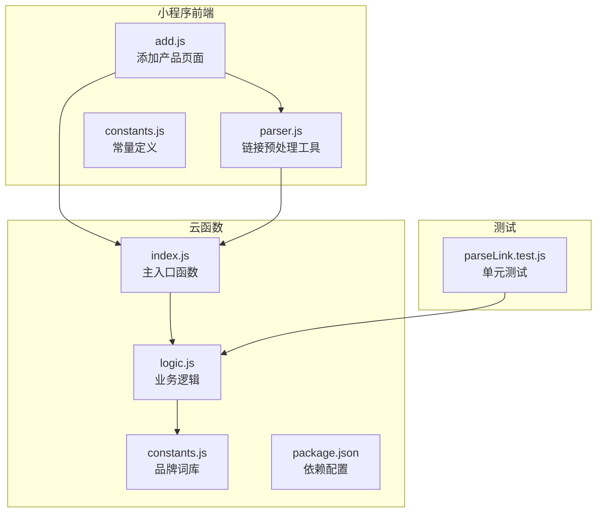
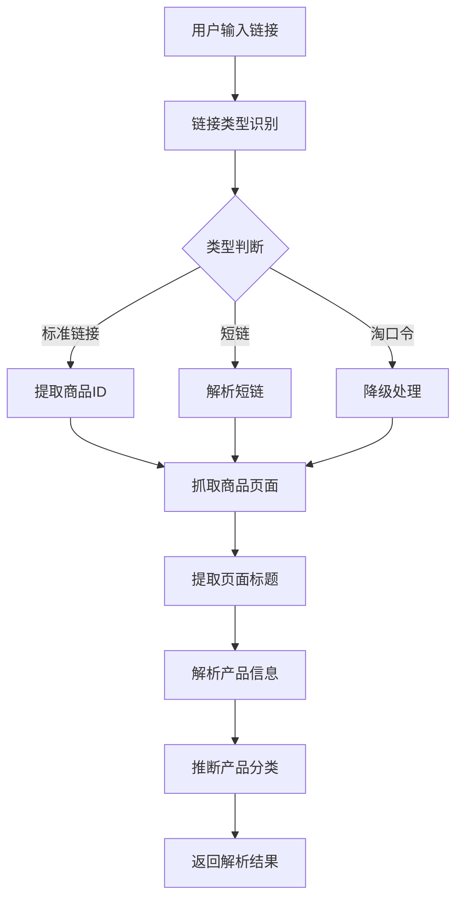
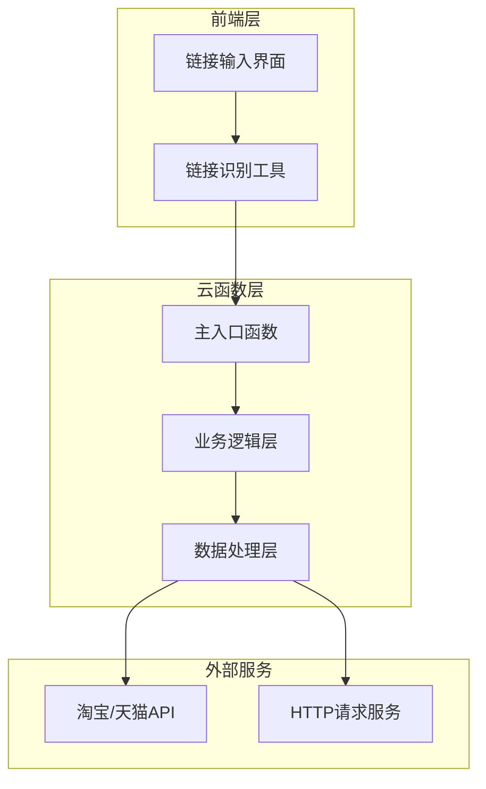
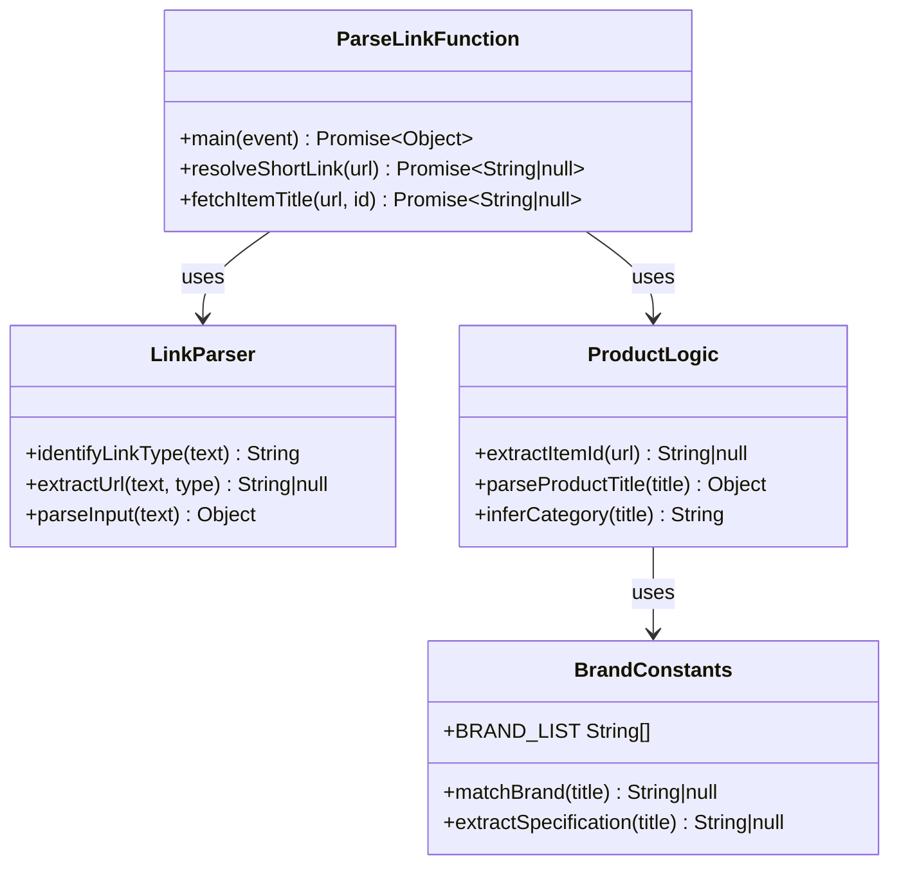
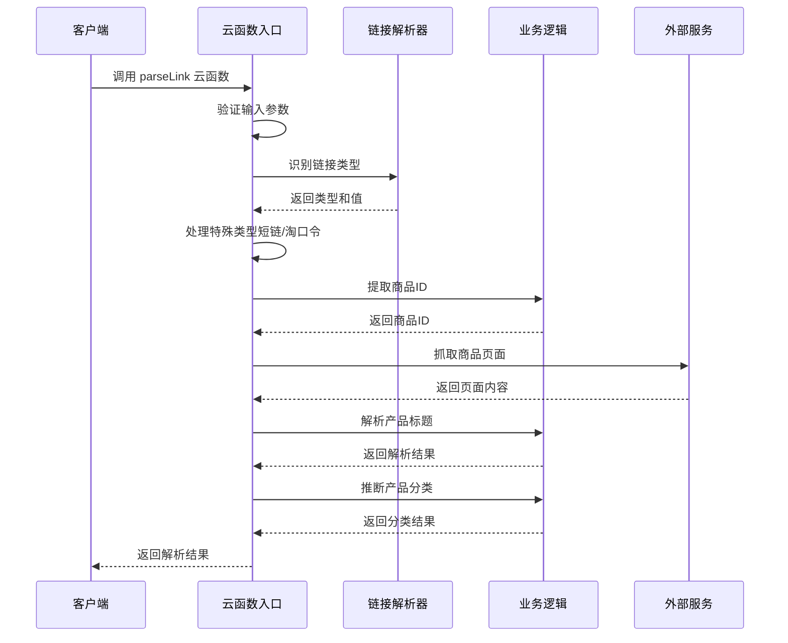
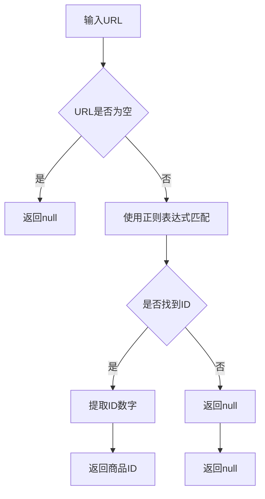
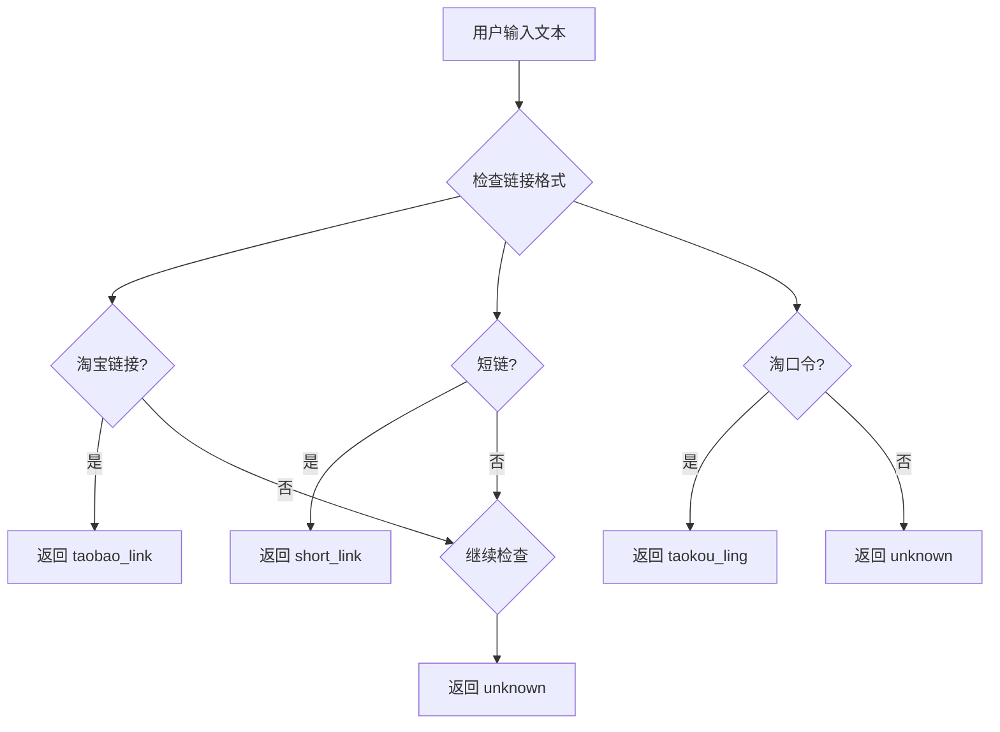
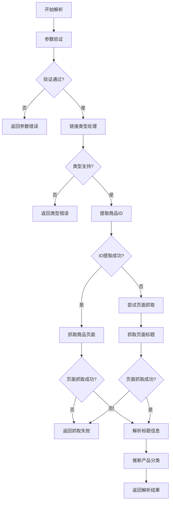

# 链接解析云函数 (parseLink)

<cite>
**本文档引用的文件**
- [index.js](file://cloudfunctions/parseLink/index.js)
- [logic.js](file://cloudfunctions/parseLink/logic.js)
- [constants.js](file://cloudfunctions/parseLink/constants.js)
- [package.json](file://cloudfunctions/parseLink/package.json)
- [parser.js](file://miniprogram/utils/parser.js)
- [add.js](file://miniprogram/pages/add/add.js)
- [constants.js](file://miniprogram/utils/constants.js)
- [date.js](file://miniprogram/utils/date.js)
- [parseLink.test.js](file://tests/parseLink.test.js)
</cite>

## 目录
1. [简介](#简介)
2. [项目结构](#项目结构)
3. [核心组件](#核心组件)
4. [架构概览](#架构概览)
5. [详细组件分析](#详细组件分析)
6. [API接口规范](#api接口规范)
7. [错误处理策略](#错误处理策略)
8. [性能考虑](#性能考虑)
9. [使用示例](#使用示例)
10. [最佳实践](#最佳实践)
11. [故障排除指南](#故障排除指南)
12. [结论](#结论)

## 简介

链接解析云函数（parseLink）是微信小程序生态系统中的一个核心云函数，专门用于解析淘宝/天猫商品链接并提取商品信息。该函数实现了智能的链接格式识别、商品ID提取、标题解析和分类推断功能，为用户提供便捷的商品导入体验。

该函数采用多层降级策略设计，当主要解析方法失败时，会自动尝试备用方案，确保在各种网络环境下都能提供稳定的解析服务。目前支持的链接类型包括标准淘宝链接、天猫链接、短链和淘口令。

## 项目结构

链接解析云函数位于云函数目录结构中，与小程序前端应用紧密集成：



**图表来源**
- [index.js:1-112](file://cloudfunctions/parseLink/index.js#L1-L112)
- [logic.js:1-78](file://cloudfunctions/parseLink/logic.js#L1-L78)
- [parser.js:1-70](file://miniprogram/utils/parser.js#L1-L70)

**章节来源**
- [index.js:1-112](file://cloudfunctions/parseLink/index.js#L1-L112)
- [logic.js:1-78](file://cloudfunctions/parseLink/logic.js#L1-L78)
- [package.json:1-9](file://cloudfunctions/parseLink/package.json#L1-L9)

## 核心组件

### 主要功能模块

链接解析云函数由多个核心组件协同工作：

1. **链接识别器**：识别不同类型的链接格式
2. **URL处理器**：提取商品ID和标准化URL
3. **页面抓取器**：从商品页面提取标题信息
4. **标题解析器**：提取品牌、规格和产品名称
5. **分类推断器**：根据关键词推断产品分类

### 数据流处理



**图表来源**
- [index.js:11-56](file://cloudfunctions/parseLink/index.js#L11-L56)
- [parser.js:17-25](file://miniprogram/utils/parser.js#L17-L25)

**章节来源**
- [index.js:11-112](file://cloudfunctions/parseLink/index.js#L11-L112)
- [parser.js:1-70](file://miniprogram/utils/parser.js#L1-L70)

## 架构概览

链接解析云函数采用分层架构设计，确保功能模块的职责清晰分离：



**图表来源**
- [add.js:56-108](file://miniprogram/pages/add/add.js#L56-L108)
- [index.js:11-56](file://cloudfunctions/parseLink/index.js#L11-L56)

### 组件关系图



**图表来源**
- [index.js:11-112](file://cloudfunctions/parseLink/index.js#L11-L112)
- [logic.js:1-78](file://cloudfunctions/parseLink/logic.js#L1-L78)
- [constants.js:1-101](file://cloudfunctions/parseLink/constants.js#L1-L101)

**章节来源**
- [index.js:1-112](file://cloudfunctions/parseLink/index.js#L1-L112)
- [logic.js:1-78](file://cloudfunctions/parseLink/logic.js#L1-L78)
- [constants.js:1-101](file://cloudfunctions/parseLink/constants.js#L1-L101)

## 详细组件分析

### 主入口函数 (index.js)

主入口函数负责处理云函数的生命周期和错误管理：

#### 核心处理流程



**图表来源**
- [index.js:11-56](file://cloudfunctions/parseLink/index.js#L11-L56)

#### 错误处理机制

函数实现了多层次的错误处理策略：

1. **参数验证**：检查必需参数是否存在
2. **类型转换**：处理不同链接类型的特殊需求
3. **网络请求**：处理HTTP请求异常和超时
4. **降级策略**：当主要方法失败时自动切换到备用方案

**章节来源**
- [index.js:11-112](file://cloudfunctions/parseLink/index.js#L11-L112)

### 业务逻辑模块 (logic.js)

业务逻辑模块包含纯函数实现，便于独立测试和维护：

#### 商品ID提取算法



**图表来源**
- [logic.js:13-17](file://cloudfunctions/parseLink/logic.js#L13-L17)

#### 标题解析算法

标题解析过程包含多个步骤：

1. **品牌匹配**：使用品牌词库进行精确匹配
2. **规格提取**：从标题中提取容量规格信息
3. **名称清理**：移除品牌信息，生成纯净的产品名称
4. **规格标准化**：统一规格单位格式

**章节来源**
- [logic.js:24-43](file://cloudfunctions/parseLink/logic.js#L24-L43)

### 品牌词库和常量定义 (constants.js)

品牌词库模块提供了完整的品牌识别和规格提取功能：

#### 品牌分类体系

系统支持多个国际和国内知名化妆品品牌：

- **国际高端品牌**：SK-II、兰蔻、雅诗兰黛等
- **彩妆品牌**：MAC、YSL、NARS等
- **日韩品牌**：雪花秀、悦诗风吟、后等
- **国产品牌**：完美日记、花西子、珀莱雅等

#### 规格提取规则

规格信息提取遵循严格的正则表达式匹配：

- **容量单位**：ml（毫升）、g（克）、片、支、对
- **数字格式**：支持整数和小数格式
- **空格处理**：忽略单位前后的空格

**章节来源**
- [constants.js:24-92](file://cloudfunctions/parseLink/constants.js#L24-L92)

### 前端链接识别工具 (parser.js)

前端工具负责在小程序端进行初步的链接识别和预处理：

#### 链接类型识别



**图表来源**
- [parser.js:17-25](file://miniprogram/utils/parser.js#L17-L25)

#### 正则表达式规则

系统使用精确的正则表达式来识别不同类型的链接：

- **淘宝链接**：`https?:\/\/(?:item\.taobao|detail\.tmall)\.com\/item\.htm[^\s]*`
- **短链**：`https?:\/\/m\.tb\.cn\/[^\s]+`
- **淘口令**：`[¥￥]([a-zA-Z0-9]+)[¥￥]`

**章节来源**
- [parser.js:7-25](file://miniprogram/utils/parser.js#L7-L25)

## API接口规范

### 请求参数

| 参数名 | 类型 | 必填 | 描述 | 示例 |
|--------|------|------|------|------|
| type | string | 是 | 链接类型标识 | 'taobao_link' |
| value | string | 是 | 链接内容或淘口令代码 | 'https://item.taobao.com/item.htm?id=123456' |

#### 支持的链接类型

| 类型标识 | 描述 | 适用场景 | 示例 |
|----------|------|----------|------|
| taobao_link | 标准淘宝链接 | 直接复制的淘宝商品链接 | `https://item.taobao.com/item.htm?id=123456` |
| short_link | 淘宝短链 | 通过手机淘宝分享的短链接 | `https://m.tb.cn/h.abcdefg` |
| taokou_ling | 淘口令 | 通过淘口令分享的商品信息 | `¥abc123¥` |

### 响应格式

#### 成功响应

```javascript
{
  "name": "产品名称",
  "brand": "品牌名称",
  "specification": "规格信息",
  "category": "产品分类",
  "imageUrl": ""
}
```

#### 错误响应

```javascript
{
  "error": "错误描述信息"
}
```

### 错误码定义

| 错误码 | 错误类型 | 描述 | 处理建议 |
|--------|----------|------|----------|
| 缺少必要参数 | 参数验证错误 | type或value参数缺失 | 检查调用参数完整性 |
| 短链解析失败 | 网络请求错误 | 短链解析服务不可用 | 检查网络连接和服务器状态 |
| 淘口令解析暂不支持 | 功能限制 | 淘口令解析功能未实现 | 建议复制商品链接 |
| 无法获取商品信息 | 页面抓取错误 | 商品页面无法访问或解析失败 | 检查商品链接有效性 |
| 解析失败: | 通用错误 | 其他未预期的解析错误 | 查看错误详情并重试 |

**章节来源**
- [index.js:14-55](file://cloudfunctions/parseLink/index.js#L14-L55)

## 错误处理策略

### 多层降级机制

链接解析云函数实现了完善的降级策略，确保在各种异常情况下都能提供稳定的服务：



**图表来源**
- [index.js:18-56](file://cloudfunctions/parseLink/index.js#L18-L56)

### 异常处理流程

#### 网络请求异常

函数对网络请求设置了合理的超时时间和错误处理：

- **HTTP请求超时**：5秒超时设置
- **请求失败处理**：捕获所有网络异常并返回null
- **重定向处理**：支持HTTP重定向跟随

#### 解析失败降级

当主要解析方法失败时，系统会自动尝试备用方案：

1. **API降级**：从直接的API调用降级到页面抓取
2. **页面抓取降级**：从标准页面降级到简化页面
3. **标题解析降级**：从完整解析降级到基础解析

**章节来源**
- [index.js:77-111](file://cloudfunctions/parseLink/index.js#L77-L111)

## 性能考虑

### 网络优化策略

#### 请求超时控制

系统采用了合理的超时设置来平衡响应速度和成功率：

- **页面抓取超时**：5000毫秒
- **短链解析超时**：根据具体实现调整
- **重试机制**：在网络异常时自动重试

#### 内存管理

- **流式处理**：使用流式读取避免大页面内存占用
- **及时释放**：异步操作完成后及时释放资源
- **缓存策略**：对常用数据进行适当的缓存

### 并发处理

系统支持并发请求处理，但需要注意以下限制：

- **云函数并发数**：受腾讯云平台限制
- **网络请求限制**：避免过度频繁的外部请求
- **资源竞争**：合理分配CPU和内存资源

## 使用示例

### 基础使用

```javascript
// 前端调用示例
wx.cloud.callFunction({
  name: 'parseLink',
  data: {
    type: 'taobao_link',
    value: 'https://item.taobao.com/item.htm?id=123456'
  }
}).then(res => {
  console.log('解析结果:', res.result);
});
```

### 错误处理示例

```javascript
// 完整的错误处理示例
wx.cloud.callFunction({
  name: 'parseLink',
  data: {
    type: 'taobao_link',
    value: 'https://item.taobao.com/item.htm?id=123456'
  }
}).then(res => {
  const result = res.result;
  if (result && result.name) {
    // 解析成功
    console.log('产品名称:', result.name);
  } else {
    // 解析失败
    console.log('错误:', result.error);
  }
}).catch(err => {
  // 云函数调用失败
  console.log('云函数错误:', err);
});
```

### 最佳实践

1. **参数验证**：始终验证输入参数的有效性
2. **错误处理**：实现完善的错误处理机制
3. **用户体验**：提供清晰的错误反馈信息
4. **性能优化**：避免不必要的重复解析
5. **安全考虑**：验证用户输入的安全性

## 最佳实践

### 开发最佳实践

#### 代码组织

- **模块化设计**：将功能拆分为独立的模块
- **单一职责**：每个函数只负责一个特定功能
- **错误隔离**：在适当的地方捕获和处理错误

#### 测试策略

- **单元测试**：为每个核心函数编写单元测试
- **集成测试**：测试完整的解析流程
- **边界测试**：测试各种边界情况和异常情况

### 部署最佳实践

#### 环境配置

- **环境变量**：合理配置云函数运行环境
- **依赖管理**：精简不必要的依赖包
- **监控告警**：设置适当的监控和告警机制

#### 性能优化

- **冷启动优化**：减少云函数的冷启动时间
- **资源利用**：合理利用云函数的计算资源
- **成本控制**：监控和优化云函数的使用成本

## 故障排除指南

### 常见问题诊断

#### 链接解析失败

**可能原因**：
1. 链接格式不正确
2. 商品页面无法访问
3. 网络连接不稳定
4. 云函数配置错误

**解决方法**：
1. 验证链接格式是否符合要求
2. 检查网络连接状态
3. 查看云函数日志
4. 重新部署云函数

#### 品牌识别不准确

**可能原因**：
1. 品牌不在词库中
2. 标题格式不符合预期
3. 品牌名称拼写错误

**解决方法**：
1. 更新品牌词库
2. 调整标题解析规则
3. 标准化品牌名称格式

### 调试技巧

#### 日志记录

建议在关键位置添加日志记录：

```javascript
console.log('调试信息:', { key: value });
```

#### 错误追踪

使用try-catch块捕获和记录错误：

```javascript
try {
  // 业务逻辑
} catch (error) {
  console.error('错误详情:', error);
  throw error;
}
```

**章节来源**
- [add.js:99-107](file://miniprogram/pages/add/add.js#L99-L107)

## 结论

链接解析云函数（parseLink）是一个设计精良的微服务组件，它通过多层降级策略和完善的错误处理机制，为微信小程序提供了可靠的淘宝/天猫商品链接解析能力。

### 主要优势

1. **多格式支持**：支持标准链接、短链和淘口令等多种链接格式
2. **智能降级**：在各种异常情况下都能提供稳定的解析服务
3. **模块化设计**：清晰的代码结构便于维护和扩展
4. **完善的测试**：全面的单元测试确保代码质量

### 技术特点

- **纯函数设计**：业务逻辑模块采用纯函数实现，便于测试
- **正则表达式**：精确的正则表达式确保链接识别的准确性
- **品牌词库**：完整的品牌词库支持多品牌识别
- **分类推断**：基于关键词的智能分类推断

### 发展方向

未来可以考虑的功能增强：

1. **API集成**：集成淘宝开放平台API获取更准确的商品信息
2. **缓存机制**：实现商品信息缓存减少重复解析
3. **性能优化**：优化网络请求和解析算法提升性能
4. **扩展支持**：支持更多电商平台的商品链接解析

该云函数为小程序生态系统的商品管理功能提供了坚实的技术基础，通过持续的优化和改进，能够更好地满足用户的需求。