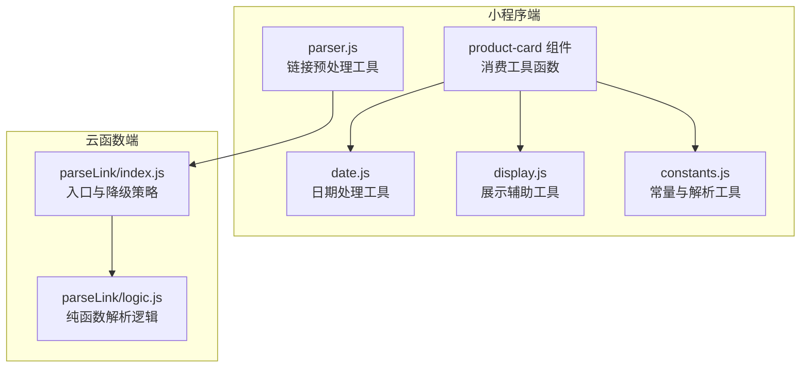
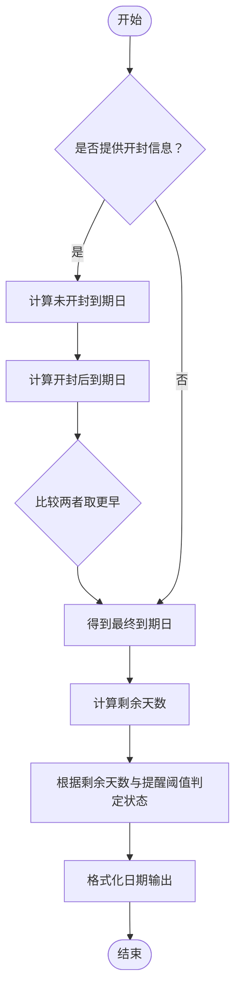
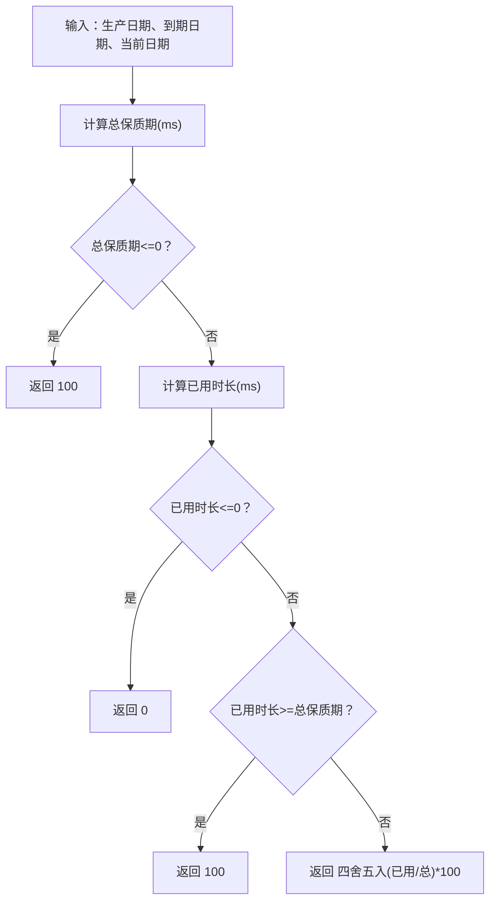
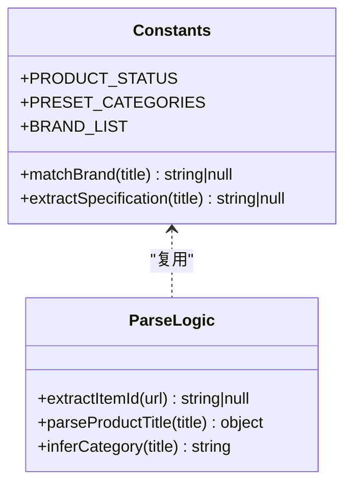
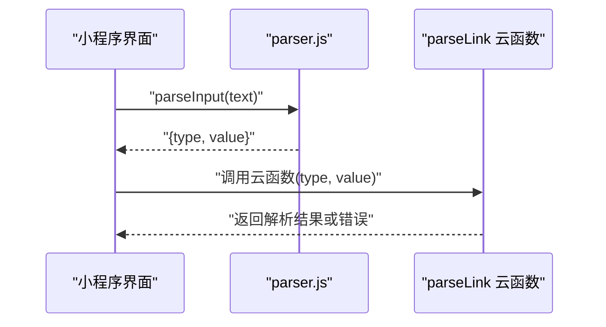
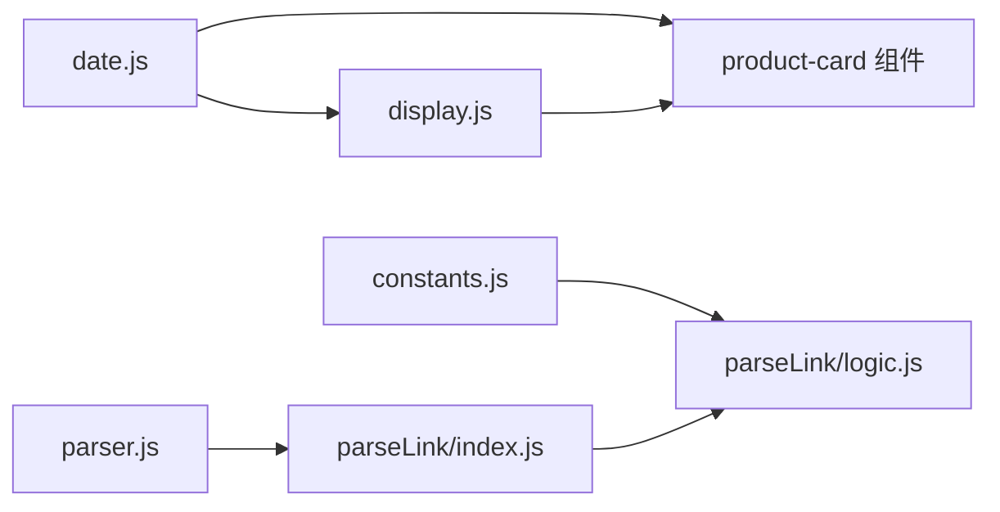

# 工具函数库

<cite>
**本文引用的文件**
- [miniprogram/utils/date.js](file://miniprogram/utils/date.js)
- [miniprogram/utils/display.js](file://miniprogram/utils/display.js)
- [miniprogram/utils/constants.js](file://miniprogram/utils/constants.js)
- [miniprogram/utils/parser.js](file://miniprogram/utils/parser.js)
- [cloudfunctions/parseLink/index.js](file://cloudfunctions/parseLink/index.js)
- [cloudfunctions/parseLink/logic.js](file://cloudfunctions/parseLink/logic.js)
- [tests/date.test.js](file://tests/date.test.js)
- [tests/display.test.js](file://tests/display.test.js)
- [tests/constants.test.js](file://tests/constants.test.js)
- [tests/parseLink.test.js](file://tests/parseLink.test.js)
- [tests/parser.test.js](file://tests/parser.test.js)
- [miniprogram/components/product-card/product-card.js](file://miniprogram/components/product-card/product-card.js)
- [package.json](file://package.json)
</cite>

## 目录
1. [简介](#简介)
2. [项目结构](#项目结构)
3. [核心组件](#核心组件)
4. [架构总览](#架构总览)
5. [详细组件分析](#详细组件分析)
6. [依赖分析](#依赖分析)
7. [性能考虑](#性能考虑)
8. [故障排查指南](#故障排查指南)
9. [结论](#结论)
10. [附录](#附录)

## 简介
本文件为工具函数库的全面API参考文档，覆盖四个核心工具模块：日期处理工具、显示辅助工具、常量定义与解析工具。文档围绕以下目标展开：
- 明确各模块设计目标与职责边界
- 逐项说明函数接口、参数与返回值
- 给出典型使用场景与错误处理机制
- 提供测试策略与质量保障建议
- 通过图示展示关键流程与数据流

## 项目结构
工具函数库主要分为两部分：
- 小程序端工具模块：日期处理、展示辅助、常量与链接解析
- 云函数解析模块：基于小程序端输入进行商品标题解析与分类推断



图表来源
- [miniprogram/utils/date.js:1-76](file://miniprogram/utils/date.js#L1-L76)
- [miniprogram/utils/display.js:1-76](file://miniprogram/utils/display.js#L1-L76)
- [miniprogram/utils/constants.js:1-100](file://miniprogram/utils/constants.js#L1-L100)
- [miniprogram/utils/parser.js:1-70](file://miniprogram/utils/parser.js#L1-L70)
- [miniprogram/components/product-card/product-card.js:1-51](file://miniprogram/components/product-card/product-card.js#L1-L51)
- [cloudfunctions/parseLink/index.js:1-112](file://cloudfunctions/parseLink/index.js#L1-L112)
- [cloudfunctions/parseLink/logic.js:1-78](file://cloudfunctions/parseLink/logic.js#L1-L78)

章节来源
- [miniprogram/utils/date.js:1-76](file://miniprogram/utils/date.js#L1-L76)
- [miniprogram/utils/display.js:1-76](file://miniprogram/utils/display.js#L1-L76)
- [miniprogram/utils/constants.js:1-100](file://miniprogram/utils/constants.js#L1-L100)
- [miniprogram/utils/parser.js:1-70](file://miniprogram/utils/parser.js#L1-L70)
- [miniprogram/components/product-card/product-card.js:1-51](file://miniprogram/components/product-card/product-card.js#L1-L51)
- [cloudfunctions/parseLink/index.js:1-112](file://cloudfunctions/parseLink/index.js#L1-L112)
- [cloudfunctions/parseLink/logic.js:1-78](file://cloudfunctions/parseLink/logic.js#L1-L78)

## 核心组件
- 日期处理工具：提供月份加法、过期日期计算、剩余天数计算、展示状态判定与日期格式化等能力
- 展示辅助工具：提供保质期进度百分比、剩余天数文本格式化、状态标签与颜色映射
- 常量定义与解析工具：提供状态枚举、预设分类、品牌词库、品牌匹配与规格提取
- 链接解析工具：识别链接类型、提取URL或淘口令代码，并与云函数配合完成商品标题解析与分类推断

章节来源
- [miniprogram/utils/date.js:1-76](file://miniprogram/utils/date.js#L1-L76)
- [miniprogram/utils/display.js:1-76](file://miniprogram/utils/display.js#L1-L76)
- [miniprogram/utils/constants.js:1-100](file://miniprogram/utils/constants.js#L1-L100)
- [miniprogram/utils/parser.js:1-70](file://miniprogram/utils/parser.js#L1-L70)

## 架构总览
小程序端负责输入识别与本地展示逻辑；云函数端负责网络抓取与标题解析。二者通过事件参数与返回值解耦。

```mermaid
sequenceDiagram
participant U as "用户"
participant UI as "小程序界面"
participant PARSER as "parser.js"
participant LINK as "parseLink 云函数"
participant LOGIC as "parseLink/logic.js"
participant NET as "网络请求"
U->>UI : "粘贴链接/淘口令"
UI->>PARSER : "parseInput(text)"
PARSER-->>UI : "{type, value}"
UI->>LINK : "调用云函数(type, value)"
alt "短链/淘口令"
LINK->>NET : "解析短链/调用开放平台(降级)"
NET-->>LINK : "真实URL或错误"
end
LINK->>LOGIC : "extractItemId(url)"
LOGIC-->>LINK : "itemId"
LINK->>NET : "抓取商品页面<title>"
NET-->>LINK : "title 或 null"
alt "成功获取标题"
LINK->>LOGIC : "parseProductTitle(title)"
LOGIC-->>LINK : "{name, brand, specification}"
LINK->>LOGIC : "inferCategory(title)"
LOGIC-->>LINK : "category"
LINK-->>UI : "{name, brand, specification, category}"
else "获取失败"
LINK-->>UI : "{error}"
end
```

图表来源
- [miniprogram/utils/parser.js:1-70](file://miniprogram/utils/parser.js#L1-L70)
- [cloudfunctions/parseLink/index.js:1-112](file://cloudfunctions/parseLink/index.js#L1-L112)
- [cloudfunctions/parseLink/logic.js:1-78](file://cloudfunctions/parseLink/logic.js#L1-L78)

## 详细组件分析

### 日期处理工具（date.js）
- 设计目标
  - 提供保质期计算所需的基础日期运算与状态判定
  - 支持“未开封”与“开封后”的双重过期规则，取更早者
  - 输出统一的日期格式，便于前后端一致展示

- 核心函数与接口
  - addMonths(dateStr, months)
    - 参数：dateStr（YYYY-MM-DD）、months（整数，可为负）
    - 返回：ISO日期字符串（YYYY-MM-DD）
    - 行为：处理月末溢出（如1月31日+1月=2月28/29日），确保日期合法
    - 使用场景：生产日期/开封日期加月数得到到期日
  - calcExpirationDate(product)
    - 参数：product对象，包含生产日期、保质期（月）、可选开封日期与开封后保质期
    - 返回：YYYY-MM-DD
    - 行为：未开封到期日与开封后到期日取较小值
    - 使用场景：综合计算最终到期日
  - calcRemainingDays(expirationDate, today?)
    - 参数：expirationDate（YYYY-MM-DD）、today（可选，默认当前日期）
    - 返回：数字（正：还剩天数；0：今日到期；负：已过期天数）
    - 使用场景：计算剩余天数用于展示与状态判定
  - getProductDisplayStatus(remainingDays, advanceDays)
    - 参数：remainingDays、advanceDays（提前提醒天数）
    - 返回："in_use"|"expiring_soon"|"expired"
    - 使用场景：根据剩余天数与提醒阈值生成展示状态
  - formatDate(date)
    - 参数：Date对象
    - 返回：YYYY-MM-DD
    - 使用场景：统一日期输出格式

- 错误处理与边界
  - addMonths：月末溢出自动回退至上月最后一天
  - calcExpirationDate：当仅提供未开封条件时，忽略开封相关字段
  - calcRemainingDays：传入today会先格式化为日期（去除时间部分）

- 典型使用示例（路径）
  - [calcExpirationDate 示例:33-87](file://tests/date.test.js#L33-L87)
  - [calcRemainingDays 示例:89-107](file://tests/date.test.js#L89-L107)
  - [getProductDisplayStatus 示例:109-129](file://tests/date.test.js#L109-L129)

- 与展示层集成
  - 产品卡片组件在属性变化时，调用上述函数计算剩余天数、展示状态、进度百分比与标签颜色



图表来源
- [miniprogram/utils/date.js:10-57](file://miniprogram/utils/date.js#L10-L57)

章节来源
- [miniprogram/utils/date.js:1-76](file://miniprogram/utils/date.js#L1-L76)
- [tests/date.test.js:1-130](file://tests/date.test.js#L1-L130)
- [miniprogram/components/product-card/product-card.js:19-32](file://miniprogram/components/product-card/product-card.js#L19-L32)

### 展示辅助工具（display.js）
- 设计目标
  - 将日期与状态转换为用户友好的展示文案与视觉样式
  - 提供进度百分比计算，便于进度条展示

- 核心函数与接口
  - calcProgressPercent(productionDate, expirationDate, now?)
    - 参数：生产日期、到期日期、当前日期（可选）
    - 返回：0-100之间的数值（四舍五入）
    - 边界：若总保质期<=0或已过期，返回100；若尚未开始，返回0
  - formatRemainingText(remainingDays)
    - 参数：剩余天数
    - 返回：中文描述文本（剩余X天/今天过期/已过期X天）
  - getStatusLabel(status)
    - 参数：状态枚举
    - 返回：中文标签（在用/即将过期/已过期/已用完/已丢弃）
  - getStatusColorClass(status)
    - 参数：状态枚举
    - 返回：颜色类名（safe/warning/danger/secondary）

- 错误处理与边界
  - calcProgressPercent：对边界条件进行显式保护，避免除零与越界
  - formatRemainingText：对0与负数进行明确分支处理

- 典型使用示例（路径）
  - [calcProgressPercent 示例:13-40](file://tests/display.test.js#L13-L40)
  - [formatRemainingText 示例:42-62](file://tests/display.test.js#L42-L62)
  - [getStatusLabel 示例:64-88](file://tests/display.test.js#L64-L88)
  - [getStatusColorClass 示例:90-110](file://tests/display.test.js#L90-L110)

- 与日期工具联动
  - 产品卡片组件在观测到产品与提醒阈值变化时，调用展示辅助函数生成标签与颜色



图表来源
- [miniprogram/utils/display.js:13-27](file://miniprogram/utils/display.js#L13-L27)

章节来源
- [miniprogram/utils/display.js:1-76](file://miniprogram/utils/display.js#L1-L76)
- [tests/display.test.js:1-111](file://tests/display.test.js#L1-L111)
- [miniprogram/components/product-card/product-card.js:26-31](file://miniprogram/components/product-card/product-card.js#L26-L31)

### 常量定义与解析工具（constants.js）
- 设计目标
  - 提供状态枚举、预设分类、品牌词库
  - 提供品牌匹配与规格提取的纯函数，便于在云函数与小程序端复用

- 核心常量与接口
  - PRODUCT_STATUS：状态枚举（在用、即将过期、已过期、已用完、已丢弃）
  - PRESET_CATEGORIES：预设分类列表（含名称、图标、排序）
  - BRAND_LIST：品牌词库（按地区与品类分组）
  - matchBrand(title)
    - 参数：商品标题
    - 返回：匹配到的品牌名或null（优先匹配最长品牌名，英文大小写不敏感）
  - extractSpecification(title)
    - 参数：商品标题
    - 返回：规格字符串（如“230ml”、“50g”、“10片”）或null

- 错误处理与边界
  - matchBrand：当无匹配时返回null；多候选时选择最长匹配
  - extractSpecification：大小写与空格容忍，单位标准化为小写

- 典型使用示例（路径）
  - [PRODUCT_STATUS 示例:12-20](file://tests/constants.test.js#L12-L20)
  - [PRESET_CATEGORIES 示例:22-46](file://tests/constants.test.js#L22-L46)
  - [BRAND_LIST 示例:48-61](file://tests/constants.test.js#L48-L61)
  - [matchBrand 示例:63-84](file://tests/constants.test.js#L63-L84)
  - [extractSpecification 示例:86-106](file://tests/constants.test.js#L86-L106)

- 与云函数逻辑联动
  - 云函数解析逻辑复用品牌匹配与规格提取函数



图表来源
- [miniprogram/utils/constants.js:6-99](file://miniprogram/utils/constants.js#L6-L99)
- [cloudfunctions/parseLink/logic.js:6-77](file://cloudfunctions/parseLink/logic.js#L6-L77)

章节来源
- [miniprogram/utils/constants.js:1-100](file://miniprogram/utils/constants.js#L1-L100)
- [tests/constants.test.js:1-107](file://tests/constants.test.js#L1-L107)
- [cloudfunctions/parseLink/logic.js:1-78](file://cloudfunctions/parseLink/logic.js#L1-L78)

### 链接解析工具（parser.js）
- 设计目标
  - 在小程序端快速识别用户输入的链接类型（标准淘宝/TMall、短链、淘口令），并提取有效URL或淘口令代码
  - 将识别结果传递给云函数，由云函数完成实际解析与抓取

- 核心函数与接口
  - identifyLinkType(text)
    - 参数：用户粘贴的文本
    - 返回：枚举（taobao_link | short_link | taokou_ling | unknown）
  - extractUrl(text, type)
    - 参数：原始文本、类型
    - 返回：提取的URL或淘口令代码，或null
  - parseInput(text)
    - 参数：用户输入
    - 返回：{ type, value }

- 错误处理与边界
  - 输入为空/无效时返回unknown与null
  - 淘口令解析在小程序端直接降级返回提示（需复制真实链接）

- 典型使用示例（路径）
  - [identifyLinkType 示例:8-68](file://tests/parser.test.js#L8-L68)
  - [extractUrl 示例:70-110](file://tests/parser.test.js#L70-L110)
  - [parseInput 示例:112-180](file://tests/parser.test.js#L112-L180)

- 与云函数协作
  - 小程序端完成类型识别与提取，云函数端执行短链解析、抓取页面标题、解析品牌与规格、推断分类



图表来源
- [miniprogram/utils/parser.js:17-63](file://miniprogram/utils/parser.js#L17-L63)
- [cloudfunctions/parseLink/index.js:11-56](file://cloudfunctions/parseLink/index.js#L11-L56)

章节来源
- [miniprogram/utils/parser.js:1-70](file://miniprogram/utils/parser.js#L1-L70)
- [tests/parser.test.js:1-181](file://tests/parser.test.js#L1-L181)
- [cloudfunctions/parseLink/index.js:1-112](file://cloudfunctions/parseLink/index.js#L1-L112)

## 依赖分析
- 模块内聚与耦合
  - date.js与display.js在展示层被组件复用，形成稳定的展示管线
  - constants.js被云函数逻辑复用，实现前后端一致的品牌与规格解析
  - parser.js与parseLink/index.js形成清晰的前后端分工：前端识别、后端抓取与解析
- 外部依赖
  - 云函数端使用微信云开发SDK与HTTP请求模块，具备降级策略（超时与异常捕获）
- 潜在循环依赖
  - 无直接循环依赖；云函数逻辑通过require引入常量模块，属于单向依赖



图表来源
- [miniprogram/utils/date.js:69-75](file://miniprogram/utils/date.js#L69-L75)
- [miniprogram/utils/display.js:70-75](file://miniprogram/utils/display.js#L70-L75)
- [miniprogram/utils/constants.js:93-99](file://miniprogram/utils/constants.js#L93-L99)
- [miniprogram/utils/parser.js:65-69](file://miniprogram/utils/parser.js#L65-L69)
- [cloudfunctions/parseLink/index.js:6-7](file://cloudfunctions/parseLink/index.js#L6-L7)
- [cloudfunctions/parseLink/logic.js](file://cloudfunctions/parseLink/logic.js#L6)

章节来源
- [miniprogram/utils/date.js:69-75](file://miniprogram/utils/date.js#L69-L75)
- [miniprogram/utils/display.js:70-75](file://miniprogram/utils/display.js#L70-L75)
- [miniprogram/utils/constants.js:93-99](file://miniprogram/utils/constants.js#L93-L99)
- [miniprogram/utils/parser.js:65-69](file://miniprogram/utils/parser.js#L65-L69)
- [cloudfunctions/parseLink/index.js:6-7](file://cloudfunctions/parseLink/index.js#L6-L7)
- [cloudfunctions/parseLink/logic.js](file://cloudfunctions/parseLink/logic.js#L6)

## 性能考虑
- 日期计算
  - addMonths通过月份设置与日期回退避免逐日迭代，复杂度为O(1)
  - calcRemainingDays与calcProgressPercent均为O(1)，适合高频调用
- 文本解析
  - matchBrand遍历品牌词库，复杂度O(N*M)，其中N为品牌数量，M为平均标题长度；可通过预处理（如前缀树）优化
  - extractSpecification使用正则匹配，复杂度O(M)
- 网络请求
  - 云函数抓取页面标题存在超时与失败风险，应合理设置超时与降级策略（当前实现已包含基础降级）

## 故障排查指南
- 日期相关问题
  - 月末溢出导致的日期偏差：确认使用addMonths而非直接加月
  - 剩余天数为负：表示已过期；结合getProductDisplayStatus进行状态展示
- 展示文本异常
  - 进度百分比异常：检查生产日期与到期日期顺序与有效性
  - 状态标签为空：确认状态枚举与映射表一致
- 品牌与规格解析
  - 品牌未匹配：检查标题中是否包含完整品牌名或大小写差异
  - 规格未提取：确认单位拼写与空格情况
- 链接解析
  - 识别为unknown：检查输入是否包含有效URL或淘口令格式
  - 短链/淘口令解析失败：遵循降级提示，引导用户复制真实链接

章节来源
- [tests/date.test.js:1-130](file://tests/date.test.js#L1-L130)
- [tests/display.test.js:1-111](file://tests/display.test.js#L1-L111)
- [tests/constants.test.js:1-107](file://tests/constants.test.js#L1-L107)
- [tests/parser.test.js:1-181](file://tests/parser.test.js#L1-L181)
- [cloudfunctions/parseLink/index.js:58-71](file://cloudfunctions/parseLink/index.js#L58-L71)

## 结论
该工具函数库以清晰的职责划分与完善的测试覆盖，实现了从输入识别、日期计算、展示辅助到云端解析的完整链路。通过常量与纯函数的复用，保证了前后端一致性与可维护性。建议持续完善品牌词库与解析规则，增强对多语言与特殊格式的支持，并在高并发场景下对品牌匹配进行性能优化。

## 附录

### 测试策略与质量保证
- 测试框架
  - 使用Jest进行单元测试，脚本通过package.json配置
- 覆盖范围
  - 日期模块：月末溢出、过期计算、剩余天数、状态判定
  - 展示模块：进度百分比、剩余天数文本、状态标签与颜色
  - 常量模块：状态枚举、分类、品牌词库、品牌匹配、规格提取
  - 链接模块：类型识别、URL/淘口令提取、输入解析
  - 云函数逻辑：商品ID提取、标题解析、分类推断
- 质量保障建议
  - 增加边界与异常输入用例（空值、非法日期、特殊字符）
  - 引入性能基准测试，监控品牌匹配与正则匹配耗时
  - 对云函数网络请求增加重试与熔断策略

章节来源
- [package.json:10-18](file://package.json#L10-L18)
- [tests/date.test.js:1-130](file://tests/date.test.js#L1-L130)
- [tests/display.test.js:1-111](file://tests/display.test.js#L1-L111)
- [tests/constants.test.js:1-107](file://tests/constants.test.js#L1-L107)
- [tests/parseLink.test.js:1-111](file://tests/parseLink.test.js#L1-L111)
- [tests/parser.test.js:1-181](file://tests/parser.test.js#L1-L181)