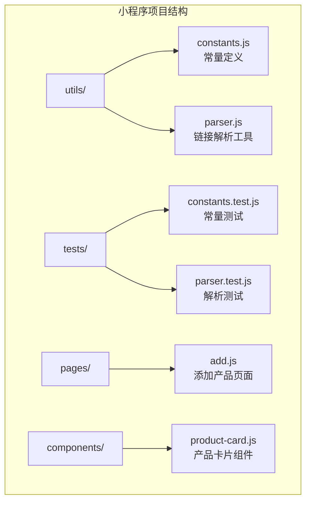
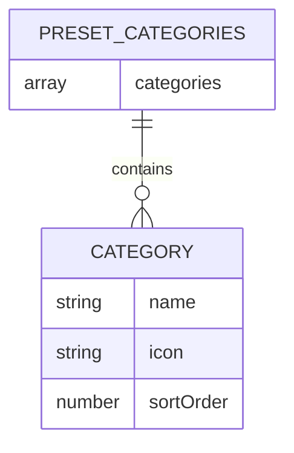
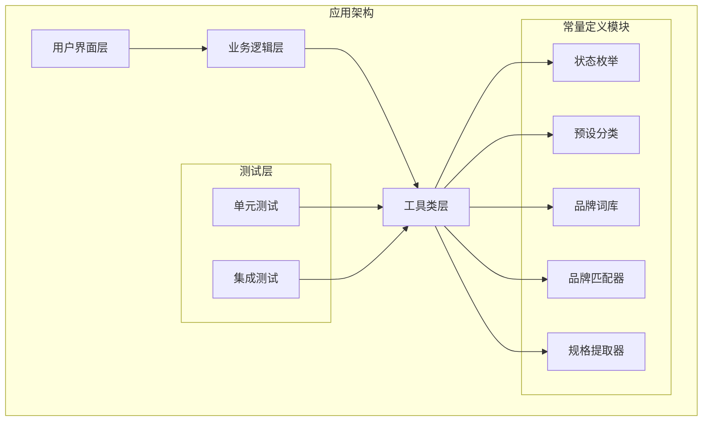
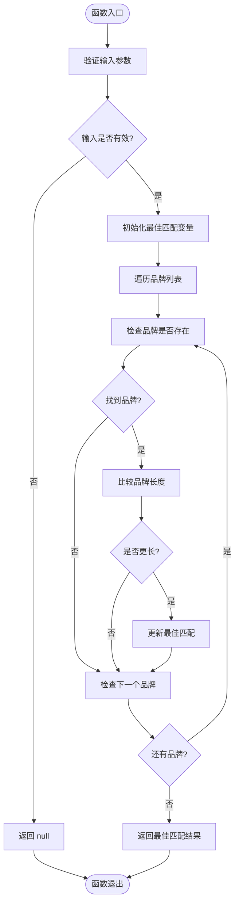
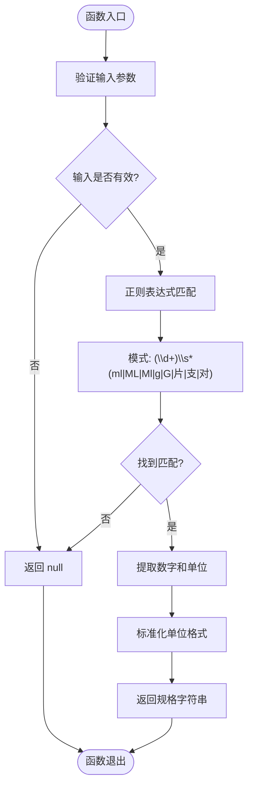
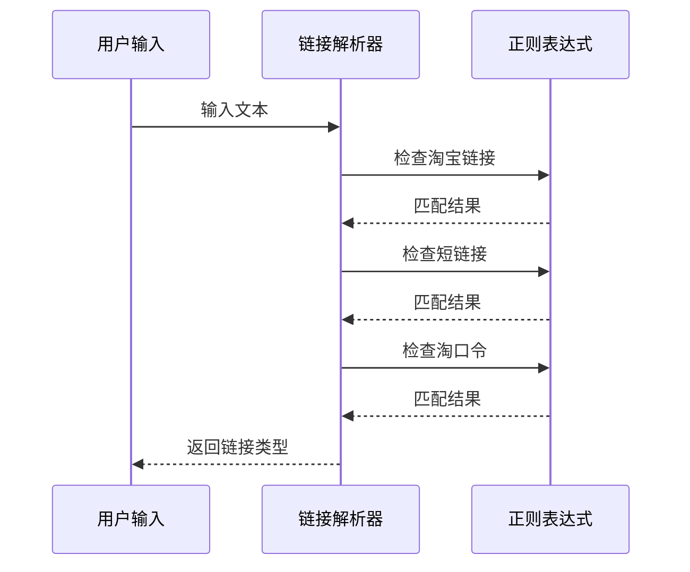
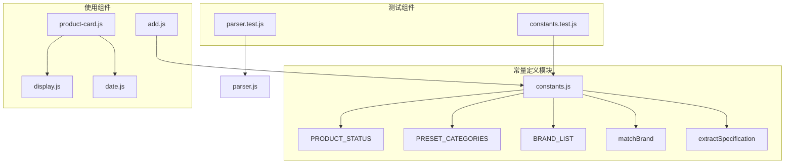

# 常量定义模块

<cite>
**本文档引用的文件**
- [constants.js](file://miniprogram/utils/constants.js)
- [parser.js](file://miniprogram/utils/parser.js)
- [constants.test.js](file://tests/constants.test.js)
- [parser.test.js](file://tests/parser.test.js)
- [add.js](file://miniprogram/pages/add/add.js)
- [product-card.js](file://miniprogram/components/product-card/product-card.js)
</cite>

## 目录
1. [简介](#简介)
2. [项目结构](#项目结构)
3. [核心组件](#核心组件)
4. [架构概览](#架构概览)
5. [详细组件分析](#详细组件分析)
6. [依赖关系分析](#依赖关系分析)
7. [性能考虑](#性能考虑)
8. [故障排除指南](#故障排除指南)
9. [结论](#结论)

## 简介

常量定义模块是微信小程序项目中的核心配置层，负责提供统一的状态枚举、预设分类、品牌词库以及解析工具函数。该模块为整个应用提供了标准化的数据结构和算法实现，确保产品管理功能的一致性和可靠性。

模块主要包含以下核心功能：
- **状态管理**：定义产品生命周期状态的标准化枚举
- **分类系统**：提供预设的产品分类体系和排序规则
- **品牌识别**：实现智能的品牌匹配算法
- **规格提取**：从产品标题中提取规格信息

## 项目结构

常量定义模块位于小程序项目的工具类目录中，采用单一文件集中管理的方式，便于维护和扩展。



**图表来源**
- [constants.js:1-100](file://miniprogram/utils/constants.js#L1-L100)
- [parser.js:1-70](file://miniprogram/utils/parser.js#L1-L70)

**章节来源**
- [constants.js:1-100](file://miniprogram/utils/constants.js#L1-L100)
- [parser.js:1-70](file://miniprogram/utils/parser.js#L1-L70)

## 核心组件

### 状态枚举 (PRODUCT_STATUS)

PRODUCT_STATUS 是一个标准化的状态枚举对象，定义了产品生命周期的五个核心状态：

| 状态键 | 值 | 业务含义 | 使用场景 |
|--------|----|----------|----------|
| IN_USE | 'in_use' | 正在使用中 | 产品当前可用状态 |
| EXPIRING_SOON | 'expiring_soon' | 即将过期 | 过期预警显示 |
| EXPIRED | 'expired' | 已过期 | 过期产品标识 |
| USED_UP | 'used_up' | 已用完 | 产品消耗完毕 |
| DISCARDED | 'discarded' | 已丢弃 | 废弃产品处理 |

### 预设分类 (PRESET_CATEGORIES)

PRESET_CATEGORIES 提供了六个标准化的产品分类，每个分类包含以下属性：



**图表来源**
- [constants.js:14-21](file://miniprogram/utils/constants.js#L14-L21)

分类排序规则：
1. 护肤 (skincare, sortOrder: 1)
2. 彩妆 (makeup, sortOrder: 2)
3. 美发 (haircare, sortOrder: 3)
4. 身体护理 (bodycare, sortOrder: 4)
5. 香水 (perfume, sortOrder: 5)
6. 工具 (tools, sortOrder: 6)

### 品牌词库 (BRAND_LIST)

BRAND_LIST 是一个包含56个品牌的数组，按品牌定位和地域进行分类组织：

**国际高端品牌**：SK-II, 兰蔻, 雅诗兰黛, 迪奥, 香奈儿等

**彩妆品牌**：MAC, YSL, NARS, TOM FORD等

**中端品牌**：科颜氏, 倩碧, 悦木之源, 欧舒丹等

**日韩品牌**：雪花秀, 悦诗风吟, innisfree, LANEIGE等

**欧美平价品牌**：欧莱雅, 美宝莲, NYX, Maybelline等

**国货品牌**：花西子, 完美日记, 珀莱雅, 薇诺娜等

**功效护肤品牌**：修丽可, SkinCeuticals, 理肤泉, 薇姿等

**身体护理/香水品牌**：欧舒丹, 祖玛珑, Jo Malone等

**美发品牌**：卡诗, Kerastase, 施华蔻, 沙宣等

**章节来源**
- [constants.js:6-12](file://miniprogram/utils/constants.js#L6-L12)
- [constants.js:14-56](file://miniprogram/utils/constants.js#L14-L56)

## 架构概览

常量定义模块在整个应用架构中扮演着基础设施的角色，为其他组件提供标准化的数据和算法支持。



**图表来源**
- [constants.js:58-99](file://miniprogram/utils/constants.js#L58-L99)
- [parser.js:12-69](file://miniprogram/utils/parser.js#L12-L69)

## 详细组件分析

### 品牌匹配算法 (matchBrand)

matchBrand 函数实现了智能的品牌识别功能，采用最长品牌名优先匹配策略和大小写不敏感处理机制。

#### 算法流程图



**图表来源**
- [constants.js:63-78](file://miniprogram/utils/constants.js#L63-L78)

#### 算法特性

1. **最长优先匹配**：当多个品牌可能匹配时，选择最长的品牌名称
2. **大小写不敏感**：通过转换为小写进行比较
3. **线性搜索**：时间复杂度 O(n*m)，其中 n 为品牌数量，m 为标题长度
4. **边界处理**：空输入返回 null，无匹配返回 null

#### 使用示例

```javascript
// 基础使用
const brand = matchBrand('SK-II 护肤精华露 230ml');
console.log(brand); // 输出: 'SK-II'

// 中文品牌匹配
const chineseBrand = matchBrand('兰蔻小黑瓶精华 50ml');
console.log(chineseBrand); // 输出: '兰蔻'

// 大小写不敏感
const caseInsensitive = matchBrand('mac 口红');
console.log(caseInsensitive); // 输出: 'MAC'

// 无匹配情况
const noMatch = matchBrand('普通洗面奶');
console.log(noMatch); // 输出: null
```

**章节来源**
- [constants.js:63-78](file://miniprogram/utils/constants.js#L63-L78)
- [constants.test.js:63-84](file://tests/constants.test.js#L63-L84)

### 规格信息提取 (extractSpecification)

extractSpecification 函数从产品标题中提取规格信息，支持多种单位格式的标准化处理。

#### 正则表达式匹配模式



**图表来源**
- [constants.js:84-91](file://miniprogram/utils/constants.js#L84-L91)

#### 支持的单位格式

| 单位类型 | 支持格式 | 标准化输出 |
|----------|----------|------------|
| 毫升 | ml, ML, Ml | ml |
| 克 | g, G | g |
| 片装 | 片 | 片 |
| 支装 | 支 | 支 |
| 对装 | 对 | 对 |

#### 使用示例

```javascript
// 毫升规格
const spec1 = extractSpecification('SK-II 神仙水 230ml');
console.log(spec1); // 输出: '230ml'

// 克规格
const spec2 = extractSpecification('兰蔻面霜 50g');
console.log(spec2); // 输出: '50g'

// 带空格的规格
const spec3 = extractSpecification('精华液 30 ml');
console.log(spec3); // 输出: '30ml'

// 片装规格
const spec4 = extractSpecification('面膜 10片装');
console.log(spec4); // 输出: '10片'

// 无规格情况
const spec5 = extractSpecification('口红 哑光质地');
console.log(spec5); // 输出: null
```

**章节来源**
- [constants.js:84-91](file://miniprogram/utils/constants.js#L84-L91)
- [constants.test.js:86-106](file://tests/constants.test.js#L86-L106)

### 链接解析工具 (parser.js)

虽然不是常量定义的一部分，但链接解析工具与常量模块紧密配合，共同提供完整的数据处理能力。

#### 链接类型识别



**图表来源**
- [parser.js:17-25](file://miniprogram/utils/parser.js#L17-L25)

**章节来源**
- [parser.js:17-63](file://miniprogram/utils/parser.js#L17-L63)

## 依赖关系分析

常量定义模块与其他组件的依赖关系如下：



**图表来源**
- [constants.js:93-99](file://miniprogram/utils/constants.js#L93-L99)
- [add.js:6-33](file://miniprogram/pages/add/add.js#L6-L33)

**章节来源**
- [add.js:6-33](file://miniprogram/pages/add/add.js#L6-L33)
- [product-card.js:4-5](file://miniprogram/components/product-card/product-card.js#L4-L5)

## 性能考虑

### 品牌匹配算法优化

1. **时间复杂度分析**
   - 当前实现：O(n*m)，其中 n 为品牌数量，m 为标题长度
   - 建议优化：使用前缀树或哈希表进行预处理，查询复杂度降为 O(m)

2. **内存优化建议**
   - 将品牌列表转换为 Map 结构，支持快速查找
   - 实现缓存机制，避免重复计算

3. **批量处理优化**
   - 对于大量产品的处理，建议使用异步处理队列
   - 实现分批处理机制，避免阻塞主线程

### 规格提取算法优化

1. **正则表达式优化**
   - 预编译正则表达式，避免重复编译
   - 使用更精确的匹配模式，减少回溯

2. **字符串处理优化**
   - 使用模板字符串替代字符串拼接
   - 实现惰性求值，只在需要时进行格式化

### 实际应用场景

#### 添加产品页面集成

```javascript
// 在添加产品页面中使用常量
const { PRESET_CATEGORIES, matchBrand, extractSpecification } = require('../../utils/constants');

// 自动填充品牌和规格
const brand = matchBrand(productTitle);
const specification = extractSpecification(productTitle);

this.setData({
  form: {
    brand: brand || '',
    specification: specification || ''
  }
});
```

#### 产品卡片展示

```javascript
// 在产品卡片组件中使用状态枚举
const { getProductDisplayStatus } = require('../../utils/date');
const { getStatusLabel, getStatusColorClass } = require('../../utils/display');

const displayStatus = getProductDisplayStatus(remainingDays, advanceDays);
const statusLabel = getStatusLabel(displayStatus);
const colorClass = getStatusColorClass(displayStatus);
```

## 故障排除指南

### 常见问题及解决方案

#### 品牌匹配不准确

**问题现象**：某些品牌无法正确匹配
**可能原因**：
- 品牌名称不在词库中
- 标题中包含特殊字符
- 品牌名称大小写不一致

**解决方案**：
1. 检查品牌词库完整性
2. 实现品牌名称规范化处理
3. 添加品牌别名支持

#### 规格提取失败

**问题现象**：规格信息提取不准确
**可能原因**：
- 标题格式不符合预期
- 单位格式不标准
- 数字格式异常

**解决方案**：
1. 实现多种规格格式的兼容处理
2. 添加规格信息验证机制
3. 提供规格信息手动编辑功能

#### 性能问题

**问题现象**：大量数据处理时出现卡顿
**可能原因**：
- 品牌匹配算法效率低
- 正则表达式匹配耗时
- 内存泄漏

**解决方案**：
1. 实现算法优化和缓存机制
2. 使用异步处理避免阻塞
3. 定期清理内存资源

**章节来源**
- [constants.test.js:12-106](file://tests/constants.test.js#L12-L106)
- [parser.test.js:8-180](file://tests/parser.test.js#L8-L180)

## 结论

常量定义模块为整个微信小程序项目提供了坚实的基础支撑。通过标准化的状态枚举、预设分类和品牌词库，以及高效的解析算法，该模块确保了产品管理功能的一致性和可靠性。

### 主要优势

1. **标准化程度高**：统一的数据结构和算法实现
2. **易于维护**：集中管理，便于更新和扩展
3. **性能稳定**：经过测试验证的可靠实现
4. **扩展性强**：模块化设计支持功能增强

### 发展建议

1. **算法优化**：实现更高效的匹配算法
2. **数据扩展**：增加更多品牌和规格支持
3. **错误处理**：完善异常情况的处理机制
4. **性能监控**：添加性能指标监控和报告

该模块作为应用的核心基础设施，将继续为产品管理功能提供稳定可靠的支持。