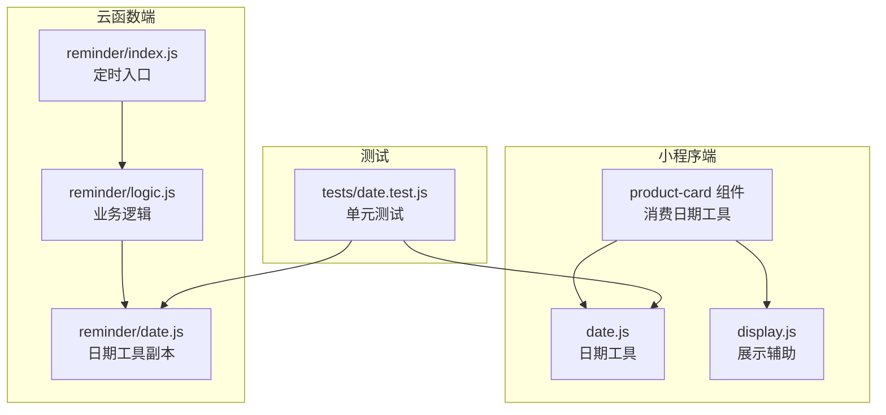
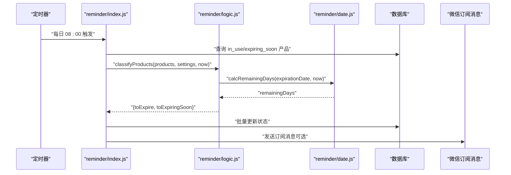
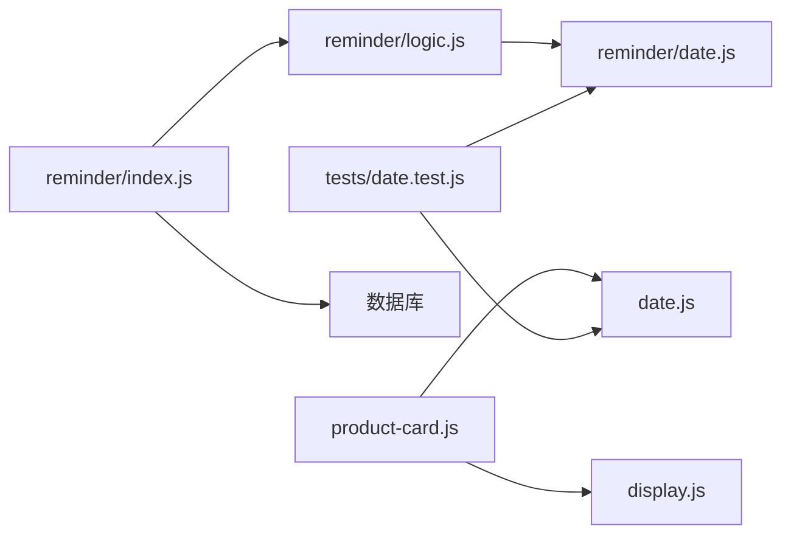

# 日期处理工具

<cite>
**本文档引用的文件**
- [miniprogram/utils/date.js](file://miniprogram/utils/date.js)
- [cloudfunctions/reminder/date.js](file://cloudfunctions/reminder/date.js)
- [miniprogram/utils/display.js](file://miniprogram/utils/display.js)
- [tests/date.test.js](file://tests/date.test.js)
- [cloudfunctions/reminder/index.js](file://cloudfunctions/reminder/index.js)
- [cloudfunctions/reminder/logic.js](file://cloudfunctions/reminder/logic.js)
- [miniprogram/components/product-card/product-card.js](file://miniprogram/components/product-card/product-card.js)
</cite>

## 目录
1. [简介](#简介)
2. [项目结构](#项目结构)
3. [核心组件](#核心组件)
4. [架构总览](#架构总览)
5. [详细组件分析](#详细组件分析)
6. [依赖关系分析](#依赖关系分析)
7. [性能考量](#性能考量)
8. [故障排查指南](#故障排查指南)
9. [结论](#结论)
10. [附录](#附录)

## 简介
本文件为日期处理工具模块的全面API文档，覆盖以下功能：
- 过期时间计算：基于生产日期、保质期（月）与开封后的保质期，计算最终过期日期
- 剩余天数计算：计算目标过期日距离当前日期的天数差，支持正数（剩余）、零（当天过期）、负数（已过期）
- 状态判断：根据剩余天数与用户“提前提醒天数”生成展示状态
- 日期格式化：统一输出 ISO 风格日期字符串（YYYY-MM-DD）

该模块同时服务于小程序前端界面与云函数定时任务，用于产品过期提醒系统的自动化状态更新与消息推送。

## 项目结构
日期处理工具主要分布在以下位置：
- 小程序端工具：miniprogram/utils/date.js
- 云函数本地副本：cloudfunctions/reminder/date.js（云函数部署限制导致的复制）
- 展示辅助工具：miniprogram/utils/display.js（与日期工具配合使用）
- 测试文件：tests/date.test.js（验证核心逻辑）
- 云函数入口与业务逻辑：cloudfunctions/reminder/index.js、cloudfunctions/reminder/logic.js
- 前端组件集成：miniprogram/components/product-card/product-card.js

图表来源
- [miniprogram/utils/date.js:1-76](file://miniprogram/utils/date.js#L1-L76)
- [cloudfunctions/reminder/date.js:1-77](file://cloudfunctions/reminder/date.js#L1-L77)
- [miniprogram/utils/display.js:1-76](file://miniprogram/utils/display.js#L1-L76)
- [cloudfunctions/reminder/index.js:1-106](file://cloudfunctions/reminder/index.js#L1-L106)
- [cloudfunctions/reminder/logic.js:1-45](file://cloudfunctions/reminder/logic.js#L1-L45)
- [tests/date.test.js:1-130](file://tests/date.test.js#L1-L130)

章节来源
- [miniprogram/utils/date.js:1-76](file://miniprogram/utils/date.js#L1-L76)
- [cloudfunctions/reminder/date.js:1-77](file://cloudfunctions/reminder/date.js#L1-L77)
- [miniprogram/utils/display.js:1-76](file://miniprogram/utils/display.js#L1-L76)
- [tests/date.test.js:1-130](file://tests/date.test.js#L1-L130)
- [cloudfunctions/reminder/index.js:1-106](file://cloudfunctions/reminder/index.js#L1-L106)
- [cloudfunctions/reminder/logic.js:1-45](file://cloudfunctions/reminder/logic.js#L1-L45)

## 核心组件
本模块的核心函数如下：
- addMonths(dateStr, months): 为日期字符串增加指定月数，处理月末溢出
- calcExpirationDate(product): 计算最终过期日期（未开封与开封后取较小者）
- calcRemainingDays(expirationDate, today?): 计算剩余天数（正数/零/负数）
- getProductDisplayStatus(remainingDays, advanceDays): 根据剩余天数与提前提醒天数返回展示状态
- formatDate(date): 将 Date 对象格式化为 ISO 日期字符串（YYYY-MM-DD）

章节来源
- [miniprogram/utils/date.js:10-75](file://miniprogram/utils/date.js#L10-L75)
- [cloudfunctions/reminder/date.js:11-76](file://cloudfunctions/reminder/date.js#L11-L76)

## 架构总览
整体架构分为三层：
- 数据层：数据库存储产品信息（含生产日期、保质期、开封日期等）
- 业务层：云函数定时任务负责批量查询、分类与状态更新
- 表现层：小程序组件实时计算剩余天数并渲染状态

图表来源
- [cloudfunctions/reminder/index.js:15-105](file://cloudfunctions/reminder/index.js#L15-L105)
- [cloudfunctions/reminder/logic.js:17-40](file://cloudfunctions/reminder/logic.js#L17-L40)
- [cloudfunctions/reminder/date.js:43-48](file://cloudfunctions/reminder/date.js#L43-L48)

## 详细组件分析

### 函数 addMonths(dateStr, months)
- 功能：给日期字符串加上指定月数，返回 ISO 日期字符串（YYYY-MM-DD）
- 参数
  - dateStr: 字符串，格式为 YYYY-MM-DD
  - months: 数字，要加的月份数（可为负数）
- 返回值：字符串，格式为 YYYY-MM-DD
- 实现要点
  - 使用原生 Date 对象解析输入日期
  - 保存原始日（originalDay），调用 setMonth 后若日期变化，说明发生月末溢出，回退到上月最后一天
  - 最终通过 formatDate 输出标准格式
- 边界条件
  - 月末溢出修正（如 1月31日 + 1月 = 2月28/29日）
  - 年末/年初边界（12月+1月 = 下一年1月）
  - 负数月份（减月）
- 异常处理
  - 输入非有效日期字符串时，Date 解析会失败，建议调用方确保传入合法日期
- 性能
  - O(1)，仅一次日期运算与格式化

章节来源
- [miniprogram/utils/date.js:10-19](file://miniprogram/utils/date.js#L10-L19)
- [cloudfunctions/reminder/date.js:11-20](file://cloudfunctions/reminder/date.js#L11-L20)

### 函数 calcExpirationDate(product)
- 功能：计算最终过期日期，规则为取“未开封过期时间”和“开封后过期时间”的较小值
- 参数
  - product: 对象，包含字段 productionDate、shelfLifeMonths、openedDate（可选）、openedShelfLifeMonths（可选）
- 返回值：字符串，格式为 YYYY-MM-DD
- 实现要点
  - 先计算未开封过期时间：addMonths(productionDate, shelfLifeMonths)
  - 若提供了 openedDate 且 openedShelfLifeMonths，则计算开封后过期时间：addMonths(openedDate, openedShelfLifeMonths)
  - 返回两者中小者；若未提供开封信息，则直接返回未开封过期时间
- 边界条件
  - openedDate 或 openedShelfLifeMonths 为空时，忽略开封逻辑
  - 两个过期时间相等时，返回任意一个均可
- 异常处理
  - 依赖 addMonths 的健壮性；若传入非法日期，需调用方保证数据正确性
- 性能
  - O(1)，两次 addMonths 调用

章节来源
- [miniprogram/utils/date.js:25-36](file://miniprogram/utils/date.js#L25-L36)
- [cloudfunctions/reminder/date.js:26-37](file://cloudfunctions/reminder/date.js#L26-L37)

### 函数 calcRemainingDays(expirationDate, today?)
- 功能：计算距离过期还有多少天
- 参数
  - expirationDate: 字符串，格式为 YYYY-MM-DD
  - today: 可选，当前日期对象；默认为当前系统时间
- 返回值：整数
  - 正数：还有 X 天
  - 0：今天过期
  - 负数：已过期 X 天
- 实现要点
  - 将 expirationDate 解析为日期对象
  - 将 today 格式化为 YYYY-MM-DD 再解析，确保比较基准为“当日零点”
  - 计算毫秒差，转换为天数并四舍五入
- 边界条件
  - expirationDate 与 today 相同：返回 0
  - expirationDate 在 today 之前：返回负数
  - expirationDate 在 today 之后：返回正数
- 异常处理
  - 输入非有效日期字符串时，Date 解析会失败
- 精度与时区
  - 通过将 today 截断到日期部分（YYYY-MM-DD）避免时区与时间偏移影响
  - 若需要更严格的时间控制，可在调用处传入固定时区的日期对象
- 性能
  - O(1)，单次日期运算

章节来源
- [miniprogram/utils/date.js:42-48](file://miniprogram/utils/date.js#L42-L48)
- [cloudfunctions/reminder/date.js:43-49](file://cloudfunctions/reminder/date.js#L43-L49)

### 函数 getProductDisplayStatus(remainingDays, advanceDays)
- 功能：根据剩余天数与用户“提前提醒天数”返回展示状态
- 参数
  - remainingDays: 整数（由 calcRemainingDays 返回）
  - advanceDays: 数字，用户设置的提前提醒天数
- 返回值：字符串，取值范围为 'expired'、'expiring_soon'、'in_use'
- 实现要点
  - remainingDays <= 0：标记为 'expired'
  - 0 < remainingDays <= advanceDays：标记为 'expiring_soon'
  - remainingDays > advanceDays：标记为 'in_use'
- 边界条件
  - remainingDays = 0：视为过期，返回 'expired'
  - remainingDays = advanceDays：返回 'expiring_soon'
- 异常处理
  - advanceDays 为 NaN 或负数时，行为取决于比较结果
- 性能
  - O(1)，简单分支判断

章节来源
- [miniprogram/utils/date.js:53-57](file://miniprogram/utils/date.js#L53-L57)
- [cloudfunctions/reminder/date.js:54-58](file://cloudfunctions/reminder/date.js#L54-L58)

### 函数 formatDate(date)
- 功能：将 Date 对象格式化为 ISO 日期字符串（YYYY-MM-DD）
- 参数
  - date: Date 对象
- 返回值：字符串，格式为 YYYY-MM-DD
- 实现要点
  - 年份直接拼接
  - 月份与日期使用 padStart(2, '0') 保证两位
- 边界条件
  - 月份与日期自动补零
- 异常处理
  - 传入无效 Date 时，格式化结果不可预期
- 性能
  - O(1)，字符串拼接与 padStart

章节来源
- [miniprogram/utils/date.js:62-67](file://miniprogram/utils/date.js#L62-L67)
- [cloudfunctions/reminder/date.js:63-68](file://cloudfunctions/reminder/date.js#L63-L68)

### 与展示辅助工具的协作
- calcProgressPercent(productionDate, expirationDate, now?): 计算保质期进度百分比（已用/总时长）
- formatRemainingText(remainingDays): 将剩余天数格式化为中文提示文本
- getStatusLabel(status) / getStatusColorClass(status): 状态标签与颜色映射

章节来源
- [miniprogram/utils/display.js:13-27](file://miniprogram/utils/display.js#L13-L27)
- [miniprogram/utils/display.js:34-38](file://miniprogram/utils/display.js#L34-L38)
- [miniprogram/utils/display.js:51-68](file://miniprogram/utils/display.js#L51-L68)

## 依赖关系分析
- 前端组件 product-card 依赖 date.js 与 display.js
- 云函数 logic.js 依赖 reminder/date.js（云函数部署限制导致的本地副本）
- 云函数 index.js 调用 logic.js 并与数据库交互
- 测试文件 tests/date.test.js 覆盖 date.js 与 reminder/date.js 的核心逻辑

图表来源
- [miniprogram/components/product-card/product-card.js:4-6](file://miniprogram/components/product-card/product-card.js#L4-L6)
- [cloudfunctions/reminder/logic.js:6-44](file://cloudfunctions/reminder/logic.js#L6-L44)
- [cloudfunctions/reminder/index.js:8-105](file://cloudfunctions/reminder/index.js#L8-L105)
- [tests/date.test.js:4-9](file://tests/date.test.js#L4-L9)

章节来源
- [miniprogram/components/product-card/product-card.js:4-6](file://miniprogram/components/product-card/product-card.js#L4-L6)
- [cloudfunctions/reminder/logic.js:6-44](file://cloudfunctions/reminder/logic.js#L6-L44)
- [cloudfunctions/reminder/index.js:8-105](file://cloudfunctions/reminder/index.js#L8-L105)
- [tests/date.test.js:4-9](file://tests/date.test.js#L4-L9)

## 性能考量
- 时间复杂度
  - 所有日期计算函数均为 O(1)，无循环或递归
- 空间复杂度
  - 仅使用少量局部变量，空间开销极小
- 精度与时区
  - 通过将 today 截断到日期部分（YYYY-MM-DD）消除时区与时间偏移影响
  - 若需要更严格的时区控制，可在调用处传入固定时区的日期对象
- 云函数部署注意事项
  - 云函数仅能访问本地文件，因此在 cloudfunctions/reminder/ 下维护了 date.js 的本地副本
- 前端组件优化
  - 使用 observers 监听属性变化，避免重复计算
  - 将 calcRemainingDays 与 getProductDisplayStatus 的调用集中在组件内部，减少外部耦合

[本节为通用性能讨论，无需特定文件来源]

## 故障排查指南
- 输入日期格式错误
  - 症状：calcRemainingDays 抛出异常或返回异常值
  - 排查：确认 expirationDate 与 dateStr 均为 YYYY-MM-DD 格式
- 月末溢出导致的日期偏差
  - 症状：addMonths 结果与预期不符
  - 排查：检查是否为月末（如 1月31日 + 1月）以及闰年情况
- 提前提醒天数设置不当
  - 症状：getProductDisplayStatus 返回状态不符合预期
  - 排查：确认 advanceDays 设置是否合理，边界值（0、负数）的行为
- 云函数部署后日期工具不可用
  - 症状：云函数报错找不到模块
  - 排查：确认 cloudfunctions/reminder/date.js 已随云函数一起部署
- 订阅消息发送失败
  - 症状：云函数执行成功但用户未收到消息
  - 排查：检查用户授权状态与模板 ID 配置

章节来源
- [tests/date.test.js:11-31](file://tests/date.test.js#L11-L31)
- [tests/date.test.js:89-129](file://tests/date.test.js#L89-L129)
- [cloudfunctions/reminder/index.js:80-93](file://cloudfunctions/reminder/index.js#L80-L93)

## 结论
本日期处理工具模块以简洁高效的纯函数为核心，实现了过期时间计算、剩余天数统计与状态判断，并与展示辅助工具协同完成前端渲染。其设计充分考虑了月末溢出、边界条件与云函数部署限制，适合在产品过期提醒系统中稳定运行。建议在实际应用中：
- 明确输入数据格式与边界条件
- 在云函数与前端分别使用对应的日期工具副本
- 根据业务需求调整提前提醒天数
- 在需要严格时区控制时，传入固定时区的日期对象

[本节为总结，无需特定文件来源]

## 附录

### API 定义与参数说明
- addMonths(dateStr: string, months: number): string
  - 作用：为日期字符串增加指定月数，处理月末溢出
  - 返回：YYYY-MM-DD 字符串
- calcExpirationDate(product: object): string
  - 作用：计算最终过期日期（未开封与开封后取较小者）
  - 返回：YYYY-MM-DD 字符串
- calcRemainingDays(expirationDate: string, today?: Date): number
  - 作用：计算剩余天数（正数/零/负数）
  - 返回：整数
- getProductDisplayStatus(remainingDays: number, advanceDays: number): string
  - 作用：根据剩余天数与提前提醒天数返回展示状态
  - 返回：'expired' | 'expiring_soon' | 'in_use'
- formatDate(date: Date): string
  - 作用：将 Date 对象格式化为 YYYY-MM-DD
  - 返回：字符串

章节来源
- [miniprogram/utils/date.js:10-75](file://miniprogram/utils/date.js#L10-L75)
- [cloudfunctions/reminder/date.js:11-76](file://cloudfunctions/reminder/date.js#L11-L76)

### 使用场景与最佳实践
- 产品过期提醒系统
  - 前端：在产品卡片组件中实时计算剩余天数与状态，提升用户体验
  - 云函数：每日定时扫描活跃产品，批量更新状态并发送订阅消息
- 最佳实践
  - 输入校验：确保日期字符串与数值参数合法
  - 状态一致性：避免频繁状态抖动，必要时引入缓存或延迟更新
  - 用户体验：根据 advanceDays 动态调整提醒策略，避免过度打扰

[本节为概念性内容，无需特定文件来源]