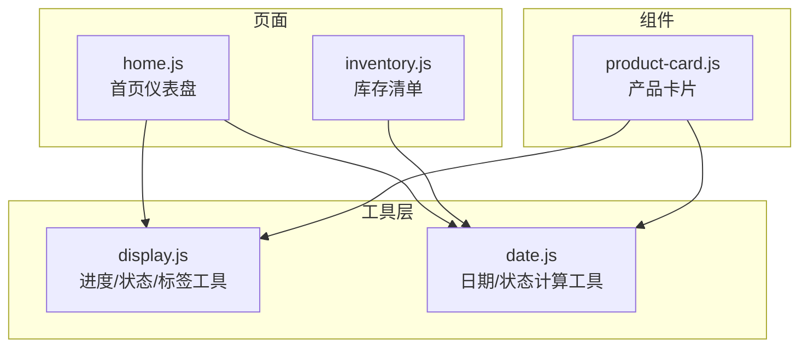
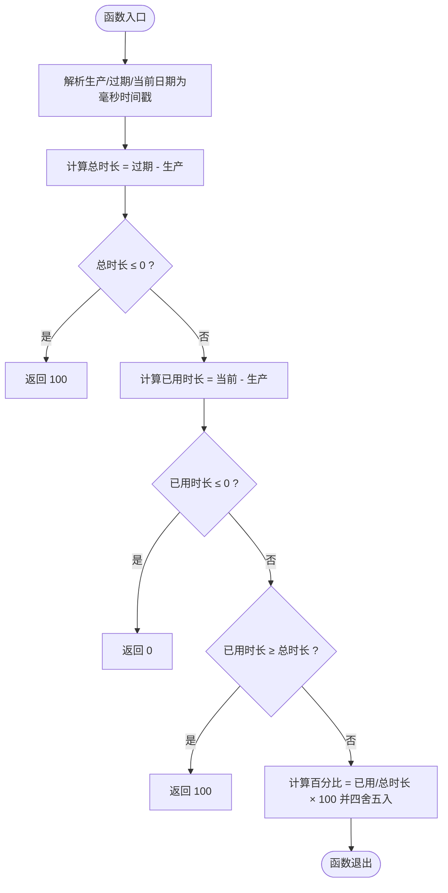
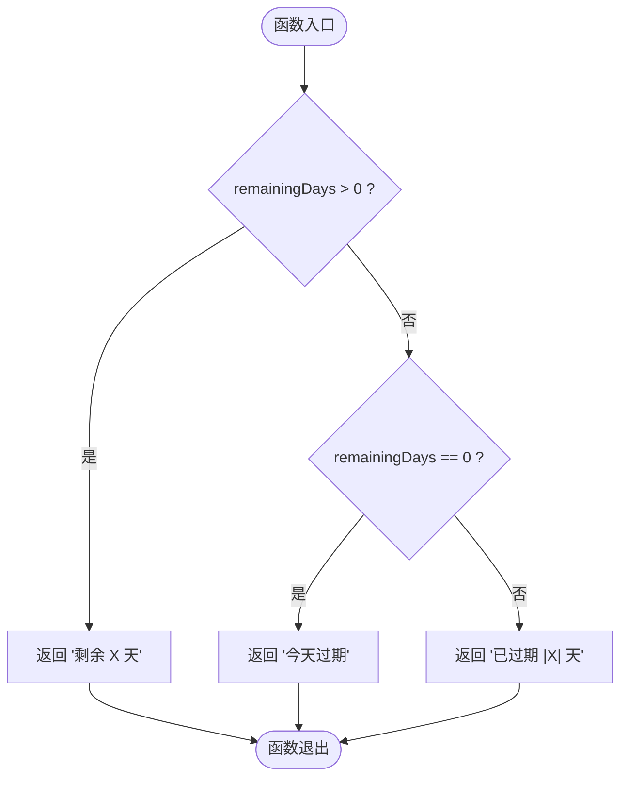
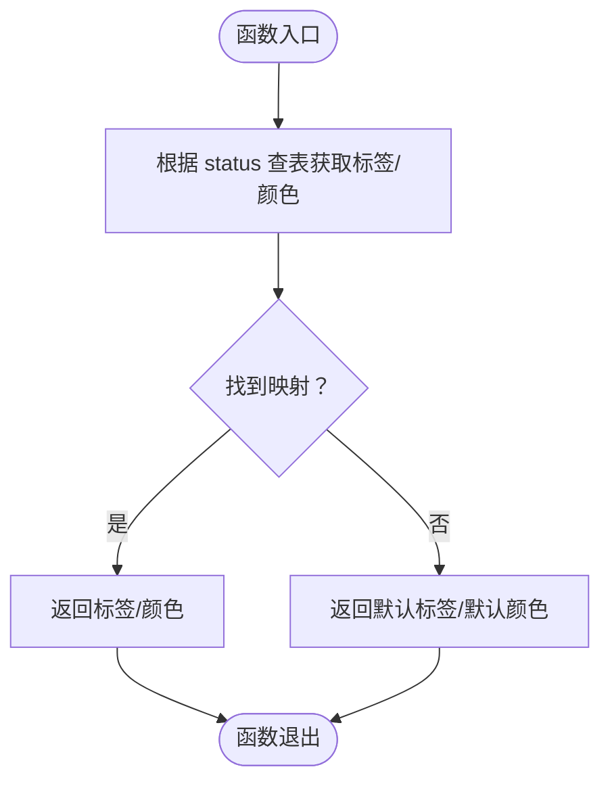
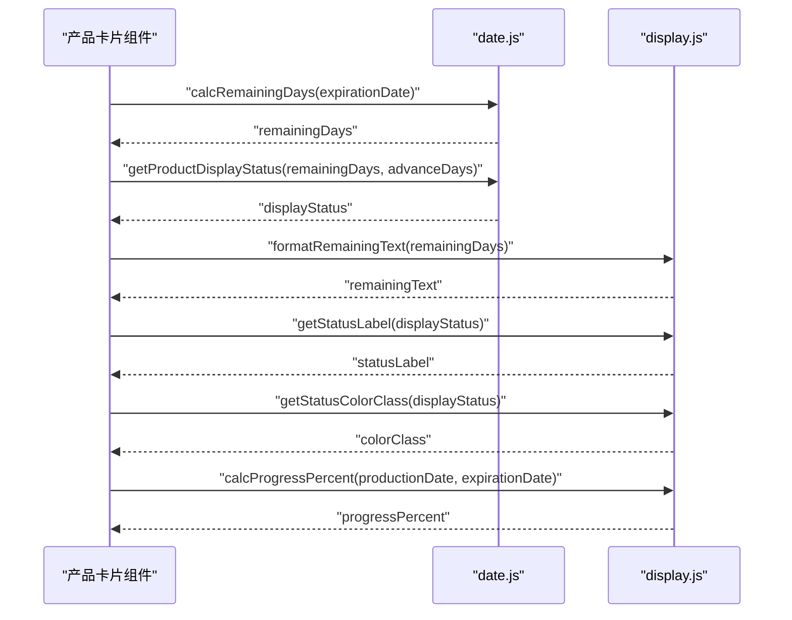
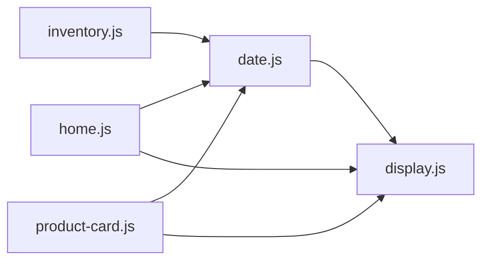

# 显示辅助工具

<cite>
**本文档引用的文件**
- [display.js](file://miniprogram/utils/display.js)
- [display.test.js](file://tests/display.test.js)
- [date.js](file://miniprogram/utils/date.js)
- [product-card.js](file://miniprogram/components/product-card/product-card.js)
- [inventory.js](file://miniprogram/pages/inventory/inventory.js)
- [home.js](file://miniprogram/pages/home/home.js)
</cite>

## 目录
1. [简介](#简介)
2. [项目结构](#项目结构)
3. [核心组件](#核心组件)
4. [架构概览](#架构概览)
5. [详细组件分析](#详细组件分析)
6. [依赖分析](#依赖分析)
7. [性能考虑](#性能考虑)
8. [故障排查指南](#故障排查指南)
9. [结论](#结论)
10. [附录](#附录)

## 简介
本文件为“显示辅助工具”模块的详细API文档，聚焦以下能力：
- 进度百分比计算：基于生产日期与过期日期，计算已用时间占总保质期的比例，并对边界情况进行安全处理。
- 剩余天数文本格式化：根据剩余天数生成可读文案，区分“剩余天数”“当天过期”“已过期天数”三类场景。
- 状态标签映射：提供状态中文标签、颜色类名映射，用于UI状态徽章或卡片状态展示。
- UI集成最佳实践：在产品卡片、首页仪表盘、库存列表等场景中的使用方式与注意事项。

本模块以纯函数形式提供，便于在页面与组件中复用；同时配合日期工具模块完成剩余天数与展示状态的判定。

## 项目结构
显示辅助工具位于小程序前端工程的工具层，与页面和组件通过require方式集成，形成“工具层 → 页面/组件”的单向依赖关系。

图表来源
- [display.js:1-76](file://miniprogram/utils/display.js#L1-L76)
- [date.js:1-76](file://miniprogram/utils/date.js#L1-L76)
- [home.js:1-119](file://miniprogram/pages/home/home.js#L1-L119)
- [inventory.js:1-117](file://miniprogram/pages/inventory/inventory.js#L1-L117)
- [product-card.js:1-51](file://miniprogram/components/product-card/product-card.js#L1-L51)

章节来源
- [display.js:1-76](file://miniprogram/utils/display.js#L1-L76)
- [date.js:1-76](file://miniprogram/utils/date.js#L1-L76)
- [home.js:1-119](file://miniprogram/pages/home/home.js#L1-L119)
- [inventory.js:1-117](file://miniprogram/pages/inventory/inventory.js#L1-L117)
- [product-card.js:1-51](file://miniprogram/components/product-card/product-card.js#L1-L51)

## 核心组件
- 进度百分比计算：calcProgressPercent
- 剩余天数文本格式化：formatRemainingText
- 状态标签映射：getStatusLabel、getStatusColorClass

章节来源
- [display.js:13-27](file://miniprogram/utils/display.js#L13-L27)
- [display.js:34-38](file://miniprogram/utils/display.js#L34-L38)
- [display.js:51-53](file://miniprogram/utils/display.js#L51-L53)
- [display.js:66-68](file://miniprogram/utils/display.js#L66-L68)

## 架构概览
显示辅助工具与日期工具协同工作，前者负责展示层面的数据加工（百分比、标签、颜色），后者负责业务层面的时间计算（剩余天数、展示状态）。

图表来源
- [display.js:13-27](file://miniprogram/utils/display.js#L13-L27)
- [display.js:34-38](file://miniprogram/utils/display.js#L34-L38)
- [display.js:51-53](file://miniprogram/utils/display.js#L51-L53)
- [display.js:66-68](file://miniprogram/utils/display.js#L66-L68)
- [date.js:42-48](file://miniprogram/utils/date.js#L42-L48)
- [date.js:53-57](file://miniprogram/utils/date.js#L53-L57)

## 详细组件分析

### 进度百分比计算：calcProgressPercent
- 功能概述
  - 计算已用时间占总保质期的百分比，结果四舍五入至整数（0-100）。
  - 对边界情况做安全处理：当总时长非正或当前时间早于生产时间时返回0；当前时间晚于等于过期时间时返回100。
- 输入参数
  - productionDate: 字符串，格式为 YYYY-MM-DD，表示生产日期。
  - expirationDate: 字符串，格式为 YYYY-MM-DD，表示过期日期。
  - now: 可选，当前日期对象，默认使用当前系统时间。
- 输出格式
  - 数值，范围 [0, 100]。
- 边界条件与错误处理
  - 若总时长小于等于0，直接返回100（视为已过期）。
  - 若已用时长小于等于0，返回0（尚未开始使用）。
  - 若已用时长大于等于总时长，返回100（已过期）。
  - 采用“按日截断”的时间点比较，避免跨日误差。
- 复杂度
  - 时间复杂度 O(1)，空间复杂度 O(1)。
- 使用示例（路径）
  - [calcProgressPercent:13-27](file://miniprogram/utils/display.js#L13-L27)
  - [calcProgressPercent 测试用例:13-40](file://tests/display.test.js#L13-L40)

图表来源
- [display.js:13-27](file://miniprogram/utils/display.js#L13-L27)

章节来源
- [display.js:13-27](file://miniprogram/utils/display.js#L13-L27)
- [display.test.js:13-40](file://tests/display.test.js#L13-L40)

### 剩余天数文本格式化：formatRemainingText
- 功能概述
  - 将剩余天数转换为用户可读的中文文案，自动处理正数、零、负数三种情形。
- 输入参数
  - remainingDays: 数值，单位天。
- 输出格式
  - 字符串，例如“剩余 X 天”“今天过期”“已过期 X 天”。
- 边界条件与错误处理
  - 正数：返回“剩余 X 天”。
  - 零：返回“今天过期”。
  - 负数：返回“已过期 X 天”，其中X为绝对值。
- 复杂度
  - 时间复杂度 O(1)，空间复杂度 O(1)。
- 使用示例（路径）
  - [formatRemainingText:34-38](file://miniprogram/utils/display.js#L34-L38)
  - [formatRemainingText 测试用例:42-62](file://tests/display.test.js#L42-L62)

图表来源
- [display.js:34-38](file://miniprogram/utils/display.js#L34-L38)

章节来源
- [display.js:34-38](file://miniprogram/utils/display.js#L34-L38)
- [display.test.js:42-62](file://tests/display.test.js#L42-L62)

### 状态标签映射：getStatusLabel、getStatusColorClass
- 功能概述
  - 提供状态中文标签与颜色类名映射，便于在UI中统一展示。
- 输入参数
  - status: 字符串，枚举值来自业务状态集合。
- 输出格式
  - 标签：字符串（中文），未知状态返回空字符串。
  - 颜色类名：字符串，枚举值包括 safe、warning、danger、secondary。
- 状态映射规则
  - in_use → “在用”（safe）
  - expiring_soon → “即将过期”（warning）
  - expired → “已过期”（danger）
  - used_up → “已用完”（secondary）
  - discarded → “已丢弃”（secondary）
- 边界条件与错误处理
  - 未知状态返回空标签与默认颜色类名（secondary）。
- 复杂度
  - 时间复杂度 O(1)，空间复杂度 O(1)。
- 使用示例（路径）
  - [getStatusLabel:51-53](file://miniprogram/utils/display.js#L51-L53)
  - [getStatusColorClass:66-68](file://miniprogram/utils/display.js#L66-L68)
  - [状态标签测试用例:64-88](file://tests/display.test.js#L64-L88)
  - [状态颜色测试用例:90-110](file://tests/display.test.js#L90-L110)

图表来源
- [display.js:40-68](file://miniprogram/utils/display.js#L40-L68)

章节来源
- [display.js:40-68](file://miniprogram/utils/display.js#L40-L68)
- [display.test.js:64-110](file://tests/display.test.js#L64-L110)

### UI组件集成与最佳实践

#### 产品卡片组件（product-card）
- 集成要点
  - 依赖日期工具计算剩余天数与展示状态；依赖显示工具进行文本格式化与标签/颜色映射。
  - 通过属性与观察器联动，当产品信息或提前提醒天数变化时，实时更新界面数据。
- 关键流程
  - 计算剩余天数 → 判定展示状态 → 格式化剩余文案 → 生成状态标签与颜色 → 计算进度百分比。
- 响应式与无障碍建议
  - 文案与颜色需与主题一致，确保对比度满足可读性。
  - 状态标签可作为语义化标识，结合屏幕阅读器友好的描述文本提升无障碍体验。
- 示例（路径）
  - [product-card.js:19-32](file://miniprogram/components/product-card/product-card.js#L19-L32)

图表来源
- [product-card.js:19-32](file://miniprogram/components/product-card/product-card.js#L19-L32)
- [date.js:42-48](file://miniprogram/utils/date.js#L42-L48)
- [date.js:53-57](file://miniprogram/utils/date.js#L53-L57)
- [display.js:34-38](file://miniprogram/utils/display.js#L34-L38)
- [display.js:51-53](file://miniprogram/utils/display.js#L51-L53)
- [display.js:66-68](file://miniprogram/utils/display.js#L66-L68)
- [display.js:13-27](file://miniprogram/utils/display.js#L13-L27)

章节来源
- [product-card.js:1-51](file://miniprogram/components/product-card/product-card.js#L1-L51)

#### 首页仪表盘（home）
- 集成要点
  - 从云函数拉取产品列表后，对每个活跃产品（非 used_up、discarded）计算剩余天数与展示状态，汇总统计与警示列表。
  - 使用进度百分比生成可视化指标或提示信息。
- 响应式与无障碍建议
  - 警示列表按“已过期优先、剩余天数升序”排序，提升信息密度与可读性。
  - 为关键数值（如安全率）提供语义化标签，便于读屏器识别。
- 示例（路径）
  - [home.js:47-96](file://miniprogram/pages/home/home.js#L47-L96)

章节来源
- [home.js:1-119](file://miniprogram/pages/home/home.js#L1-L119)

#### 库存清单（inventory）
- 集成要点
  - 支持关键词搜索、分类筛选、状态过滤与分页加载；状态过滤会直接影响展示状态的计算与呈现。
- 响应式与无障碍建议
  - 筛选器与分页控件需提供键盘导航与焦点管理。
  - 状态过滤按钮建议提供“已选中/未选中”的视觉与语义反馈。
- 示例（路径）
  - [inventory.js:51-63](file://miniprogram/pages/inventory/inventory.js#L51-L63)

章节来源
- [inventory.js:1-117](file://miniprogram/pages/inventory/inventory.js#L1-L117)

## 依赖分析
- 内部依赖
  - display.js 仅依赖浏览器/小程序环境的 Date API，无外部依赖。
  - date.js 同样仅依赖 Date API，提供日期格式化与状态判定。
- 跨模块调用
  - 页面与组件通过 require 方式引入 display.js 与 date.js，形成清晰的单向依赖链。
- 潜在风险
  - 日期字符串格式必须严格为 YYYY-MM-DD，否则解析会失败。
  - 当前时间与过期时间均按“当日0点”进行比较，避免了时区与时间部分差异带来的误差。

图表来源
- [display.js:1-76](file://miniprogram/utils/display.js#L1-L76)
- [date.js:1-76](file://miniprogram/utils/date.js#L1-L76)
- [home.js:1-119](file://miniprogram/pages/home/home.js#L1-L119)
- [inventory.js:1-117](file://miniprogram/pages/inventory/inventory.js#L1-L117)
- [product-card.js:1-51](file://miniprogram/components/product-card/product-card.js#L1-L51)

章节来源
- [display.js:1-76](file://miniprogram/utils/display.js#L1-L76)
- [date.js:1-76](file://miniprogram/utils/date.js#L1-L76)
- [home.js:1-119](file://miniprogram/pages/home/home.js#L1-L119)
- [inventory.js:1-117](file://miniprogram/pages/inventory/inventory.js#L1-L117)
- [product-card.js:1-51](file://miniprogram/components/product-card/product-card.js#L1-L51)

## 性能考虑
- 时间复杂度均为 O(1)，适合高频调用与批量渲染场景。
- 建议在页面/组件层缓存计算结果，避免重复计算相同产品的状态与百分比。
- 在大数据量渲染时，优先使用虚拟列表或分页策略，减少一次性渲染压力。

## 故障排查指南
- 日期格式不正确
  - 现象：calcProgressPercent 返回异常或NaN。
  - 排查：确认传入的日期字符串为 YYYY-MM-DD，且生产日期早于等于过期日期。
  - 参考
    - [calcProgressPercent:13-27](file://miniprogram/utils/display.js#L13-L27)
- 状态未知导致标签为空
  - 现象：getStatusLabel 返回空字符串。
  - 排查：确认业务状态值是否在映射范围内。
  - 参考
    - [getStatusLabel:51-53](file://miniprogram/utils/display.js#L51-L53)
    - [状态标签测试用例:85-87](file://tests/display.test.js#L85-L87)
- 百分比边界异常
  - 现象：calcProgressPercent 返回100但产品仍在使用。
  - 排查：检查当前时间是否晚于过期时间；确认“当前时间按日截断”的逻辑是否符合预期。
  - 参考
    - [calcProgressPercent:13-27](file://miniprogram/utils/display.js#L13-L27)
    - [calcProgressPercent 测试用例:21-34](file://tests/display.test.js#L21-L34)

章节来源
- [display.js:13-27](file://miniprogram/utils/display.js#L13-L27)
- [display.js:51-53](file://miniprogram/utils/display.js#L51-L53)
- [display.test.js:21-34](file://tests/display.test.js#L21-L34)
- [display.test.js:85-87](file://tests/display.test.js#L85-L87)

## 结论
显示辅助工具通过简洁的纯函数实现了进度、文案与状态的标准化输出，配合日期工具在页面与组件中形成稳定的展示层。其边界处理与测试覆盖保证了在真实业务场景中的可靠性；结合UI最佳实践，可在产品卡片、仪表盘、库存列表等场景中高效落地。

## 附录

### API参考速览
- calcProgressPercent
  - 参数：productionDate(string)、expirationDate(string)、now(Date, 可选)
  - 返回：number(0-100)
  - 边界：总时长≤0返回100；当前时间早于生产时间返回0；当前时间≥过期时间返回100
  - 示例路径：[calcProgressPercent:13-27](file://miniprogram/utils/display.js#L13-L27)
- formatRemainingText
  - 参数：remainingDays(number)
  - 返回：string（“剩余 X 天”“今天过期”“已过期 X 天”）
  - 示例路径：[formatRemainingText:34-38](file://miniprogram/utils/display.js#L34-L38)
- getStatusLabel
  - 参数：status(string)
  - 返回：string（中文标签，未知状态返回空）
  - 示例路径：[getStatusLabel:51-53](file://miniprogram/utils/display.js#L51-L53)
- getStatusColorClass
  - 参数：status(string)
  - 返回：string（safe/warning/danger/secondary）
  - 示例路径：[getStatusColorClass:66-68](file://miniprogram/utils/display.js#L66-L68)

### UI集成示例路径
- 产品卡片
  - [product-card.js:19-32](file://miniprogram/components/product-card/product-card.js#L19-L32)
- 首页仪表盘
  - [home.js:47-96](file://miniprogram/pages/home/home.js#L47-L96)
- 库存清单
  - [inventory.js:51-63](file://miniprogram/pages/inventory/inventory.js#L51-L63)