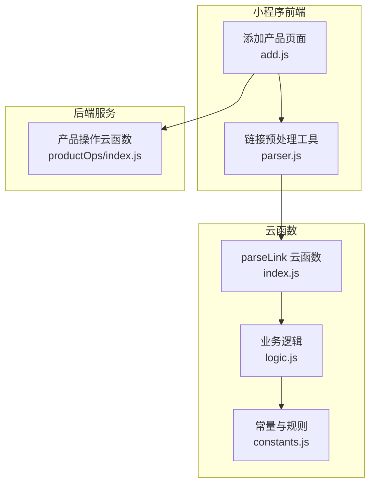
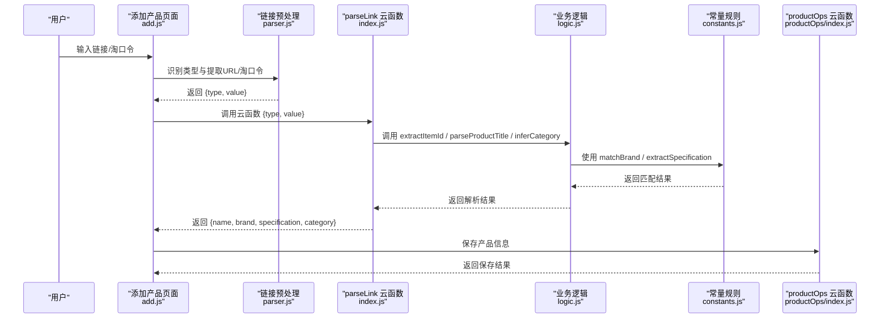
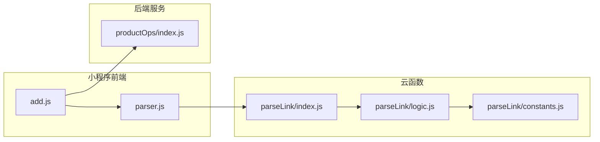

# 链接解析工具

<cite>
**本文档引用的文件**
- [cloudfunctions/parseLink/index.js](file://cloudfunctions/parseLink/index.js)
- [cloudfunctions/parseLink/logic.js](file://cloudfunctions/parseLink/logic.js)
- [cloudfunctions/parseLink/constants.js](file://cloudfunctions/parseLink/constants.js)
- [cloudfunctions/parseLink/package.json](file://cloudfunctions/parseLink/package.json)
- [miniprogram/utils/parser.js](file://miniprogram/utils/parser.js)
- [miniprogram/utils/constants.js](file://miniprogram/utils/constants.js)
- [miniprogram/pages/add/add.js](file://miniprogram/pages/add/add.js)
- [tests/parseLink.test.js](file://tests/parseLink.test.js)
- [cloudfunctions/productOps/index.js](file://cloudfunctions/productOps/index.js)
</cite>

## 目录
1. [简介](#简介)
2. [项目结构](#项目结构)
3. [核心组件](#核心组件)
4. [架构总览](#架构总览)
5. [详细组件分析](#详细组件分析)
6. [依赖关系分析](#依赖关系分析)
7. [性能考虑](#性能考虑)
8. [故障排查指南](#故障排查指南)
9. [结论](#结论)
10. [附录](#附录)

## 简介
本文件为“链接解析工具”模块的全面API文档，覆盖以下能力：
- 链接格式识别与预处理：识别淘宝/天猫链接、短链、淘口令等输入类型，提取有效URL或淘口令代码。
- 淘宝/天猫链接解析：从URL中提取商品ID；抓取商品页面标题；解析标题提取品牌、规格、清洁名称；推断产品分类。
- 规格信息提取：识别容量单位（ml、g）及数量，进行格式标准化。
- 错误处理与降级策略：短链解析、页面抓取、API降级、异常捕获与统一错误返回。
- 产品导入流程集成：在小程序“添加产品”页面中，通过云函数调用完成链接导入与数据回填。

## 项目结构
该模块采用前后端分离设计：
- 小程序前端负责输入识别与UI交互，调用云函数完成解析。
- 云函数负责实际解析逻辑与网络请求，返回结构化结果。
- 测试用例覆盖纯函数逻辑，确保品牌匹配、规格提取、分类推断的正确性。

图表来源
- [cloudfunctions/parseLink/index.js:1-112](file://cloudfunctions/parseLink/index.js#L1-L112)
- [cloudfunctions/parseLink/logic.js:1-78](file://cloudfunctions/parseLink/logic.js#L1-L78)
- [cloudfunctions/parseLink/constants.js:1-101](file://cloudfunctions/parseLink/constants.js#L1-L101)
- [miniprogram/utils/parser.js:1-70](file://miniprogram/utils/parser.js#L1-L70)
- [miniprogram/pages/add/add.js:1-260](file://miniprogram/pages/add/add.js#L1-L260)
- [cloudfunctions/productOps/index.js:1-171](file://cloudfunctions/productOps/index.js#L1-L171)

章节来源
- [cloudfunctions/parseLink/index.js:1-112](file://cloudfunctions/parseLink/index.js#L1-L112)
- [cloudfunctions/parseLink/logic.js:1-78](file://cloudfunctions/parseLink/logic.js#L1-L78)
- [cloudfunctions/parseLink/constants.js:1-101](file://cloudfunctions/parseLink/constants.js#L1-L101)
- [miniprogram/utils/parser.js:1-70](file://miniprogram/utils/parser.js#L1-L70)
- [miniprogram/pages/add/add.js:1-260](file://miniprogram/pages/add/add.js#L1-L260)
- [cloudfunctions/productOps/index.js:1-171](file://cloudfunctions/productOps/index.js#L1-L171)

## 核心组件
- 链接预处理工具（小程序侧）：识别输入类型、提取URL或淘口令代码。
- 链接解析云函数（云端侧）：短链解析、页面抓取、标题解析、分类推断、错误处理与降级。
- 业务逻辑模块（云端侧）：纯函数实现，便于测试与复用。
- 常量与规则（云端侧）：品牌词库、规格提取规则、分类关键词映射。
- 产品导入流程（前端+后端）：页面交互、云函数调用、数据保存。

章节来源
- [miniprogram/utils/parser.js:1-70](file://miniprogram/utils/parser.js#L1-L70)
- [cloudfunctions/parseLink/index.js:1-112](file://cloudfunctions/parseLink/index.js#L1-L112)
- [cloudfunctions/parseLink/logic.js:1-78](file://cloudfunctions/parseLink/logic.js#L1-L78)
- [cloudfunctions/parseLink/constants.js:1-101](file://cloudfunctions/parseLink/constants.js#L1-L101)
- [miniprogram/pages/add/add.js:1-260](file://miniprogram/pages/add/add.js#L1-L260)
- [cloudfunctions/productOps/index.js:1-171](file://cloudfunctions/productOps/index.js#L1-L171)

## 架构总览
整体流程：用户在小程序页面粘贴链接或淘口令，前端识别类型并调用parseLink云函数；云函数根据类型进行短链解析或直接解析，抓取页面标题，再调用纯函数解析品牌、规格与分类，最终返回结构化结果供页面回填。

图表来源
- [miniprogram/pages/add/add.js:56-108](file://miniprogram/pages/add/add.js#L56-L108)
- [miniprogram/utils/parser.js:59-63](file://miniprogram/utils/parser.js#L59-L63)
- [cloudfunctions/parseLink/index.js:11-56](file://cloudfunctions/parseLink/index.js#L11-L56)
- [cloudfunctions/parseLink/logic.js:13-71](file://cloudfunctions/parseLink/logic.js#L13-L71)
- [cloudfunctions/parseLink/constants.js:64-91](file://cloudfunctions/parseLink/constants.js#L64-L91)
- [cloudfunctions/productOps/index.js:75-90](file://cloudfunctions/productOps/index.js#L75-L90)

## 详细组件分析

### 组件A：链接预处理工具（小程序侧）
职责：
- 识别输入文本的链接类型：淘宝/天猫链接、短链、淘口令。
- 从文本中提取有效URL或淘口令代码。
- 为后续云函数调用提供标准化输入。

关键函数与行为：
- 类型识别：基于正则表达式判断输入属于哪一类链接。
- URL/淘口令提取：从文本中提取首个匹配项。
- 统一输出：返回 { type, value } 结构，供云函数使用。

参数与返回：
- 输入：原始文本字符串。
- 输出：对象包含 type（类型标识）、value（提取的URL或淘口令代码，可能为null）。

错误处理：
- 空输入或未匹配时返回 unknown 类型与 null 值。

章节来源
- [miniprogram/utils/parser.js:17-63](file://miniprogram/utils/parser.js#L17-L63)

### 组件B：链接解析云函数（云端侧）
职责：
- 接收前端传入的类型与值，执行短链解析、页面抓取、标题解析与分类推断。
- 统一错误处理与降级策略，保证在部分环节失败时仍能返回可用信息。

主要流程：
- 参数校验：type 与 value 必填。
- 类型分支：
  - short_link：尝试解析短链为真实URL（当前实现为占位，返回null时触发错误）。
  - taokou_ling：提示暂不支持，建议复制商品链接。
- 商品ID提取：从URL中提取商品ID。
- 页面抓取：构造H5页面URL，发起HTTP请求获取<title>。
- 标题解析：调用纯函数解析品牌、规格、生成清洁名称。
- 分类推断：基于关键词映射推断分类。
- 返回结构化结果：包含 name、brand、specification、category、imageUrl（占位）。

错误处理与降级：
- 短链解析失败：返回错误提示。
- 淘口令：返回提示信息，引导用户复制链接。
- 页面抓取失败：返回无法获取商品信息。
- 异常捕获：统一包装错误消息。

章节来源
- [cloudfunctions/parseLink/index.js:11-56](file://cloudfunctions/parseLink/index.js#L11-L56)
- [cloudfunctions/parseLink/index.js:61-111](file://cloudfunctions/parseLink/index.js#L61-L111)

### 组件C：业务逻辑模块（云端侧）
职责：
- 纯函数实现，便于独立测试与复用。
- 提供链接ID提取、标题解析、分类推断等核心算法。

函数说明：
- extractItemId(url)
  - 输入：URL字符串。
  - 输出：商品ID字符串或null。
  - 算法：通过正则匹配URL中的id参数。
- parseProductTitle(title)
  - 输入：商品标题字符串。
  - 输出：对象 { name, brand, specification }。
  - 算法：
    - 使用品牌词库匹配最长品牌名。
    - 使用规格提取规则匹配容量单位与数值。
    - 从标题中移除品牌名，生成清洁名称；清理多余空格。
- inferCategory(title)
  - 输入：商品标题字符串。
  - 输出：分类名称字符串（如“护肤”、“彩妆”等），未匹配返回空字符串。
  - 算法：遍历关键词映射，命中即返回对应分类。

章节来源
- [cloudfunctions/parseLink/logic.js:13-43](file://cloudfunctions/parseLink/logic.js#L13-L43)
- [cloudfunctions/parseLink/logic.js:59-71](file://cloudfunctions/parseLink/logic.js#L59-L71)

### 组件D：常量与规则（云端侧）
职责：
- 定义品牌词库、规格提取规则、分类关键词映射等。
- 为业务逻辑提供稳定的规则支撑。

要点：
- 品牌词库：覆盖国际高端、彩妆、中端、日韩、欧美平价、国货、功效护肤、身体护理/香水、美发等多个品类。
- 规格提取规则：匹配“数字 + 可选空格 + 单位（ml/g/片/支/对）”，并进行格式标准化。
- 分类关键词映射：按类别维护关键词列表，用于标题关键字匹配。

章节来源
- [cloudfunctions/parseLink/constants.js:24-78](file://cloudfunctions/parseLink/constants.js#L24-L78)
- [cloudfunctions/parseLink/constants.js:85-91](file://cloudfunctions/parseLink/constants.js#L85-L91)
- [cloudfunctions/parseLink/logic.js:46-71](file://cloudfunctions/parseLink/logic.js#L46-L71)

### 组件E：产品导入流程集成
职责：
- 在小程序“添加产品”页面中，支持两种模式：链接导入与手动录入。
- 链接导入：前端识别类型并调用parseLink云函数，回填解析结果。
- 手动录入：用户直接填写表单，调用productOps云函数保存。

关键流程：
- 链接导入：识别类型 → 调用云函数 → 成功回填字段（名称、品牌、规格、分类）→ 可继续填写其他信息 → 保存。
- 保存：校验必填字段 → 调用productOps云函数 → 处理错误与成功反馈。

章节来源
- [miniprogram/pages/add/add.js:56-108](file://miniprogram/pages/add/add.js#L56-L108)
- [miniprogram/pages/add/add.js:154-235](file://miniprogram/pages/add/add.js#L154-L235)
- [cloudfunctions/productOps/index.js:75-90](file://cloudfunctions/productOps/index.js#L75-L90)

## 依赖关系分析

图表来源
- [miniprogram/pages/add/add.js:1-260](file://miniprogram/pages/add/add.js#L1-L260)
- [miniprogram/utils/parser.js:1-70](file://miniprogram/utils/parser.js#L1-L70)
- [cloudfunctions/parseLink/index.js:1-112](file://cloudfunctions/parseLink/index.js#L1-L112)
- [cloudfunctions/parseLink/logic.js:1-78](file://cloudfunctions/parseLink/logic.js#L1-L78)
- [cloudfunctions/parseLink/constants.js:1-101](file://cloudfunctions/parseLink/constants.js#L1-L101)
- [cloudfunctions/productOps/index.js:1-171](file://cloudfunctions/productOps/index.js#L1-L171)

章节来源
- [miniprogram/pages/add/add.js:1-260](file://miniprogram/pages/add/add.js#L1-L260)
- [miniprogram/utils/parser.js:1-70](file://miniprogram/utils/parser.js#L1-L70)
- [cloudfunctions/parseLink/index.js:1-112](file://cloudfunctions/parseLink/index.js#L1-L112)
- [cloudfunctions/parseLink/logic.js:1-78](file://cloudfunctions/parseLink/logic.js#L1-L78)
- [cloudfunctions/parseLink/constants.js:1-101](file://cloudfunctions/parseLink/constants.js#L1-L101)
- [cloudfunctions/productOps/index.js:1-171](file://cloudfunctions/productOps/index.js#L1-L171)

## 性能考虑
- 网络请求优化：
  - 页面抓取设置超时时间，避免长时间阻塞。
  - 仅在存在商品ID时构造H5页面URL，减少无效请求。
- 正则匹配优化：
  - 品牌匹配优先选择最长匹配，减少误判。
  - 规格提取使用精确正则，避免全局扫描带来的开销。
- 云函数部署：
  - 依赖包精简，避免不必要的模块引入。
- 缓存策略建议：
  - 可在云函数层面对常见URL或解析结果进行短期缓存（需结合业务场景评估）。
  - 对频繁访问的商品页面，可考虑CDN加速或预热机制。
- 并发与限流：
  - 控制并发抓取数量，避免对目标站点造成压力。
  - 对解析失败的URL记录统计，便于后续优化规则。

## 故障排查指南
常见问题与处理：
- 无法识别链接格式
  - 检查输入是否符合淘宝/天猫链接、短链或淘口令格式。
  - 前端会返回“无法识别链接格式”的提示。
- 短链解析失败
  - 当前实现为占位，返回“短链解析失败”。
  - 建议用户复制完整商品链接。
- 淘口令解析提示
  - 当前不支持淘口令解析，提示用户复制商品链接。
- 页面抓取失败
  - 返回“无法获取商品信息”，可尝试刷新或稍后再试。
- 云函数调用失败
  - 检查云开发是否已配置、网络连接是否正常。
  - 前端会区分不同错误类型并给出相应提示。
- 保存失败
  - 检查必填字段是否完整、保质期是否大于0。
  - 查看后端返回的错误信息或控制台日志。

章节来源
- [cloudfunctions/parseLink/index.js:14-55](file://cloudfunctions/parseLink/index.js#L14-L55)
- [miniprogram/pages/add/add.js:99-107](file://miniprogram/pages/add/add.js#L99-L107)
- [miniprogram/pages/add/add.js:212-234](file://miniprogram/pages/add/add.js#L212-L234)

## 结论
链接解析工具模块通过前后端协作，实现了从用户输入到产品信息入库的完整链路。其核心优势在于：
- 明确的类型识别与预处理，降低上游错误率。
- 纯函数化的业务逻辑，便于测试与演进。
- 完善的错误处理与降级策略，提升用户体验。
- 与产品导入流程无缝集成，支持双模式（链接导入/手动录入）。

建议持续优化方向：
- 增强短链解析能力，或提供替代方案。
- 引入缓存与CDN，提升解析性能与稳定性。
- 扩展品牌词库与规格规则，覆盖更多品类与单位。
- 加强异常监控与日志记录，便于问题定位与优化。

## 附录

### API定义与规范

- 链接预处理工具
  - 函数：identifyLinkType(text)
    - 输入：字符串
    - 输出：'taobao_link' | 'short_link' | 'taokou_ling' | 'unknown'
  - 函数：extractUrl(text, type)
    - 输入：原始文本、类型
    - 输出：URL或淘口令代码，可能为null
  - 函数：parseInput(text)
    - 输入：原始文本
    - 输出：{ type, value }

- 链接解析云函数
  - 入口：exports.main(event)
    - 输入：{ type, value }
    - 输出：成功时返回 { name, brand, specification, category, imageUrl }，失败时返回 { error }

- 业务逻辑模块
  - 函数：extractItemId(url)
    - 输入：URL字符串
    - 输出：商品ID或null
  - 函数：parseProductTitle(title)
    - 输入：标题字符串
    - 输出：{ name, brand, specification }
  - 函数：inferCategory(title)
    - 输入：标题字符串
    - 输出：分类名称或空字符串

- 常量与规则
  - 品牌词库：覆盖多品类品牌列表
  - 规格提取规则：匹配数字+单位（ml/g/片/支/对）
  - 分类关键词映射：按类别维护关键词列表

章节来源
- [miniprogram/utils/parser.js:17-63](file://miniprogram/utils/parser.js#L17-L63)
- [cloudfunctions/parseLink/index.js:11-56](file://cloudfunctions/parseLink/index.js#L11-L56)
- [cloudfunctions/parseLink/logic.js:13-71](file://cloudfunctions/parseLink/logic.js#L13-L71)
- [cloudfunctions/parseLink/constants.js:24-91](file://cloudfunctions/parseLink/constants.js#L24-L91)

### 测试用例概览
- extractItemId：覆盖标准链接、天猫链接、多参数链接、无ID链接、空值等场景。
- parseProductTitle：覆盖品牌匹配（含英文大小写）、规格提取（ml/g）、名称清洗、无品牌场景、空值等。
- inferCategory：覆盖各类别关键词命中、未识别、空值等。

章节来源
- [tests/parseLink.test.js:12-110](file://tests/parseLink.test.js#L12-L110)