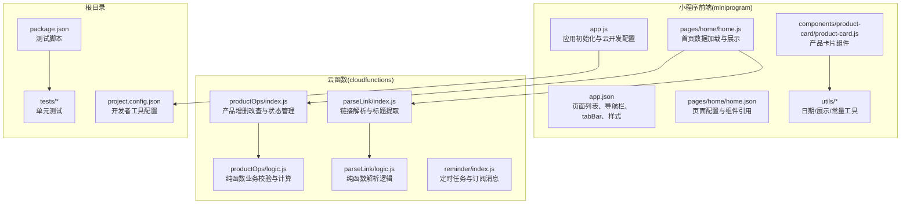
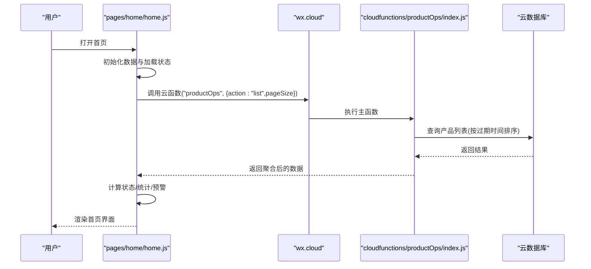
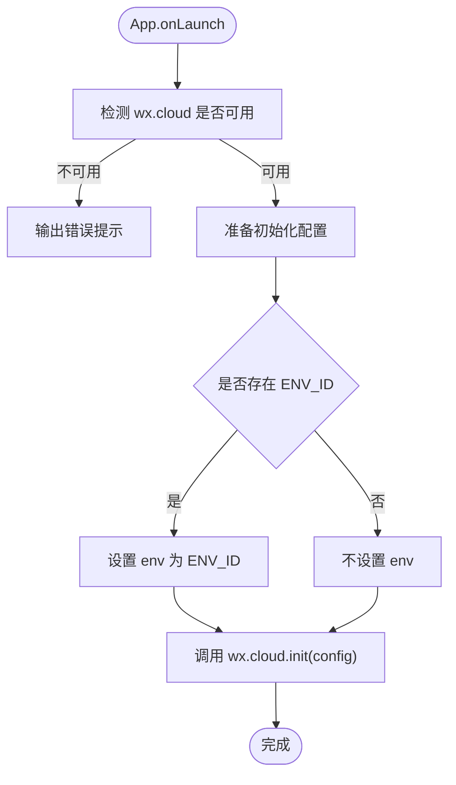
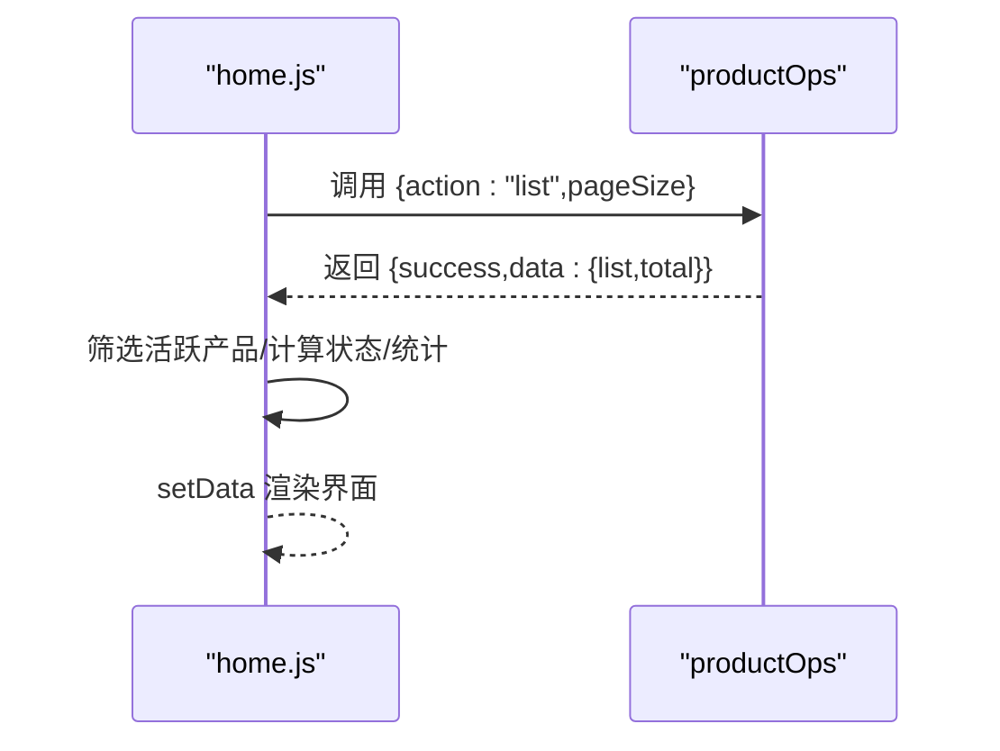
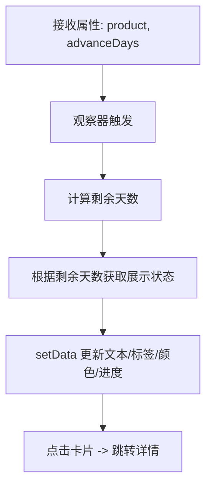
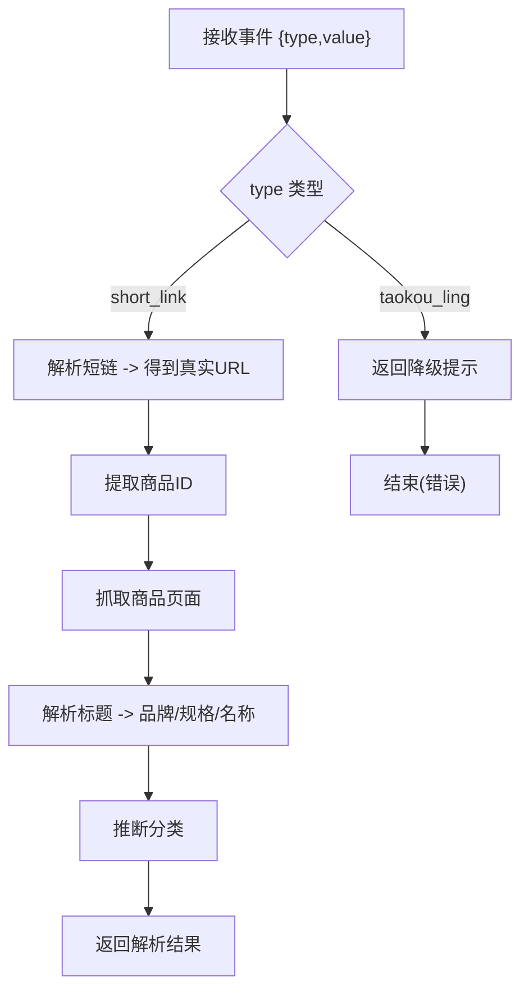
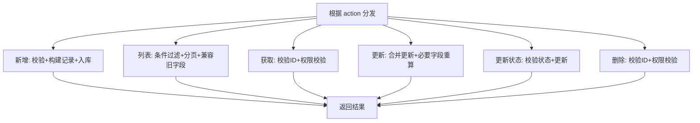
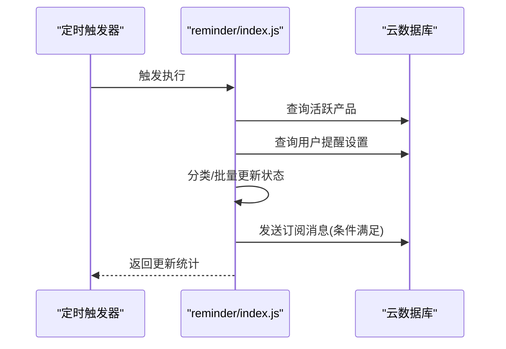
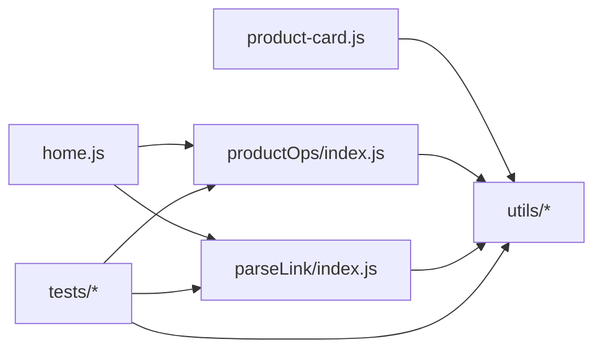

# 快速开始

<cite>
**本文引用的文件**
- [package.json](file://package.json)
- [project.config.json](file://project.config.json)
- [miniprogram/app.js](file://miniprogram/app.js)
- [miniprogram/app.json](file://miniprogram/app.json)
- [miniprogram/pages/home/home.js](file://miniprogram/pages/home/home.js)
- [miniprogram/pages/home/home.json](file://miniprogram/pages/home/home.json)
- [miniprogram/components/product-card/product-card.js](file://miniprogram/components/product-card/product-card.js)
- [miniprogram/utils/constants.js](file://miniprogram/utils/constants.js)
- [miniprogram/utils/date.js](file://miniprogram/utils/date.js)
- [miniprogram/utils/display.js](file://miniprogram/utils/display.js)
- [cloudfunctions/parseLink/index.js](file://cloudfunctions/parseLink/index.js)
- [cloudfunctions/parseLink/logic.js](file://cloudfunctions/parseLink/logic.js)
- [cloudfunctions/parseLink/package.json](file://cloudfunctions/parseLink/package.json)
- [cloudfunctions/productOps/index.js](file://cloudfunctions/productOps/index.js)
- [cloudfunctions/productOps/logic.js](file://cloudfunctions/productOps/logic.js)
- [cloudfunctions/reminder/index.js](file://cloudfunctions/reminder/index.js)
- [tests/constants.test.js](file://tests/constants.test.js)
</cite>

## 目录
1. [简介](#简介)
2. [项目结构](#项目结构)
3. [核心组件](#核心组件)
4. [架构总览](#架构总览)
5. [详细组件分析](#详细组件分析)
6. [依赖关系分析](#依赖关系分析)
7. [性能考虑](#性能考虑)
8. [故障排查指南](#故障排查指南)
9. [结论](#结论)
10. [附录](#附录)

## 简介
本指南面向首次接触微信小程序开发的新手，帮助你在最短时间内完成开发环境搭建、项目克隆、依赖安装与本地运行，并理解项目的关键配置文件与目录结构。同时，我们将说明云开发环境的配置要点与权限设置，确保你能顺利运行并扩展功能。

## 项目结构
该项目采用“小程序前端 + 云函数 + 设计系统 + 文档 + 测试”的组织方式：
- miniprogram：小程序前端源码，包含页面、组件、工具函数与全局配置
- cloudfunctions：云函数目录，包含解析链接、产品操作、提醒等服务端逻辑
- design-system：设计规范与页面线框说明
- tests：单元测试，覆盖常量与业务逻辑
- 根目录配置：package.json（测试脚本）、project.config.json（开发者工具配置）

图表来源
- [miniprogram/app.js:1-32](file://miniprogram/app.js#L1-L32)
- [miniprogram/app.json:1-52](file://miniprogram/app.json#L1-L52)
- [miniprogram/pages/home/home.js:1-119](file://miniprogram/pages/home/home.js#L1-L119)
- [miniprogram/pages/home/home.json:1-6](file://miniprogram/pages/home/home.json#L1-L6)
- [miniprogram/components/product-card/product-card.js:1-51](file://miniprogram/components/product-card/product-card.js#L1-L51)
- [miniprogram/utils/date.js:1-76](file://miniprogram/utils/date.js#L1-L76)
- [miniprogram/utils/display.js:1-76](file://miniprogram/utils/display.js#L1-L76)
- [cloudfunctions/parseLink/index.js:1-112](file://cloudfunctions/parseLink/index.js#L1-L112)
- [cloudfunctions/parseLink/logic.js:1-78](file://cloudfunctions/parseLink/logic.js#L1-L78)
- [cloudfunctions/productOps/index.js:1-171](file://cloudfunctions/productOps/index.js#L1-L171)
- [cloudfunctions/productOps/logic.js:1-105](file://cloudfunctions/productOps/logic.js#L1-L105)
- [cloudfunctions/reminder/index.js:1-106](file://cloudfunctions/reminder/index.js#L1-L106)
- [package.json:1-20](file://package.json#L1-L20)
- [project.config.json:1-21](file://project.config.json#L1-L21)

章节来源
- [project.config.json:1-21](file://project.config.json#L1-L21)
- [miniprogram/app.json:1-52](file://miniprogram/app.json#L1-L52)

## 核心组件
- 应用入口与云开发初始化：在应用启动时初始化云开发，支持按需切换云环境
- 首页数据流：通过云函数查询产品列表，实时计算展示状态并渲染统计与预警
- 产品卡片组件：根据剩余天数与提前提醒天数动态计算状态与进度条
- 工具模块：日期计算、展示格式化、常量与品牌词库、规格提取
- 云函数：链接解析、产品操作、定时提醒与订阅消息

章节来源
- [miniprogram/app.js:1-32](file://miniprogram/app.js#L1-L32)
- [miniprogram/pages/home/home.js:1-119](file://miniprogram/pages/home/home.js#L1-L119)
- [miniprogram/components/product-card/product-card.js:1-51](file://miniprogram/components/product-card/product-card.js#L1-L51)
- [miniprogram/utils/date.js:1-76](file://miniprogram/utils/date.js#L1-L76)
- [miniprogram/utils/display.js:1-76](file://miniprogram/utils/display.js#L1-L76)
- [miniprogram/utils/constants.js:1-100](file://miniprogram/utils/constants.js#L1-L100)
- [cloudfunctions/parseLink/index.js:1-112](file://cloudfunctions/parseLink/index.js#L1-L112)
- [cloudfunctions/productOps/index.js:1-171](file://cloudfunctions/productOps/index.js#L1-L171)
- [cloudfunctions/reminder/index.js:1-106](file://cloudfunctions/reminder/index.js#L1-L106)

## 架构总览
下面的序列图展示了“首页加载 → 调用云函数 → 数据处理 → 渲染界面”的完整流程：

图表来源
- [miniprogram/pages/home/home.js:24-101](file://miniprogram/pages/home/home.js#L24-L101)
- [cloudfunctions/productOps/index.js:40-64](file://cloudfunctions/productOps/index.js#L40-L64)

## 详细组件分析

### 应用入口与云开发配置
- 在应用启动时初始化云开发，支持通过环境变量选择云环境
- 若基础库版本过低，会提示使用更高版本的基础库以启用云能力
- 全局数据区用于存放用户信息等

图表来源
- [miniprogram/app.js:10-26](file://miniprogram/app.js#L10-L26)

章节来源
- [miniprogram/app.js:1-32](file://miniprogram/app.js#L1-L32)

### 首页数据加载与展示
- 首页在显示时调用云函数获取产品列表
- 对产品进行筛选与状态计算，生成统计、预警与最近添加项
- 支持跳转详情与库存/添加页

图表来源
- [miniprogram/pages/home/home.js:29-101](file://miniprogram/pages/home/home.js#L29-L101)

章节来源
- [miniprogram/pages/home/home.js:1-119](file://miniprogram/pages/home/home.js#L1-L119)

### 产品卡片组件
- 组件接收产品对象与提前提醒天数
- 通过观察器实时计算剩余天数、展示状态、颜色类与进度百分比
- 点击卡片跳转至详情页

图表来源
- [miniprogram/components/product-card/product-card.js:19-49](file://miniprogram/components/product-card/product-card.js#L19-L49)

章节来源
- [miniprogram/components/product-card/product-card.js:1-51](file://miniprogram/components/product-card/product-card.js#L1-L51)

### 工具模块
- 日期工具：加月、计算过期日期、剩余天数、格式化日期、展示状态
- 展示工具：进度百分比、剩余天数文本、状态标签与颜色映射
- 常量与品牌词库：状态枚举、预设分类、品牌列表、品牌匹配与规格提取

章节来源
- [miniprogram/utils/date.js:1-76](file://miniprogram/utils/date.js#L1-L76)
- [miniprogram/utils/display.js:1-76](file://miniprogram/utils/display.js#L1-L76)
- [miniprogram/utils/constants.js:1-100](file://miniprogram/utils/constants.js#L1-L100)

### 云函数：链接解析(parseLink)
- 支持短链与淘口令类型解析（淘口令当前为降级提示）
- 从链接提取商品ID，抓取商品页面标题，解析品牌、规格与分类
- 通过云托管或HTTP请求实现重定向跟随与页面抓取

图表来源
- [cloudfunctions/parseLink/index.js:11-56](file://cloudfunctions/parseLink/index.js#L11-L56)
- [cloudfunctions/parseLink/logic.js:13-71](file://cloudfunctions/parseLink/logic.js#L13-L71)

章节来源
- [cloudfunctions/parseLink/index.js:1-112](file://cloudfunctions/parseLink/index.js#L1-L112)
- [cloudfunctions/parseLink/logic.js:1-78](file://cloudfunctions/parseLink/logic.js#L1-L78)

### 云函数：产品操作(productOps)
- 通过 action 分发到不同操作：新增、列表、获取、更新、更新状态、删除
- 校验输入、构建记录、更新时按日期字段重算过期时间与状态
- 支持分页查询与关键字检索

图表来源
- [cloudfunctions/productOps/index.js:40-171](file://cloudfunctions/productOps/index.js#L40-L171)
- [cloudfunctions/productOps/logic.js:11-96](file://cloudfunctions/productOps/logic.js#L11-L96)

章节来源
- [cloudfunctions/productOps/index.js:1-171](file://cloudfunctions/productOps/index.js#L1-L171)
- [cloudfunctions/productOps/logic.js:1-105](file://cloudfunctions/productOps/logic.js#L1-L105)

### 云函数：定时提醒(reminder)
- 每日定时执行，查询活跃产品并批量更新状态
- 根据用户提醒设置分类并发送订阅消息（需模板ID与权限）

图表来源
- [cloudfunctions/reminder/index.js:15-105](file://cloudfunctions/reminder/index.js#L15-L105)

章节来源
- [cloudfunctions/reminder/index.js:1-106](file://cloudfunctions/reminder/index.js#L1-L106)

## 依赖关系分析
- 小程序前端依赖工具模块与云函数；首页通过云函数获取数据
- 云函数之间相互独立，parseLink 与 productOps 通过数据库交互
- 项目根目录提供测试脚本与开发者工具配置

图表来源
- [miniprogram/pages/home/home.js:33-35](file://miniprogram/pages/home/home.js#L33-L35)
- [cloudfunctions/productOps/index.js:1-20](file://cloudfunctions/productOps/index.js#L1-L20)
- [cloudfunctions/parseLink/index.js:6-8](file://cloudfunctions/parseLink/index.js#L6-L8)
- [tests/constants.test.js:1-10](file://tests/constants.test.js#L1-L10)
- [miniprogram/utils/constants.js:1-100](file://miniprogram/utils/constants.js#L1-L100)

章节来源
- [package.json:1-20](file://package.json#L1-L20)
- [project.config.json:1-21](file://project.config.json#L1-L21)

## 性能考虑
- 首页一次性加载较多产品时建议限制 pageSize 并做分页
- 云函数内避免不必要的循环与重复查询，合理使用索引
- 组件层尽量减少 setData 的数据量，按需更新
- 图片与资源路径统一管理，避免重复请求

## 故障排查指南
- 基础库版本过低导致无法使用云能力
  - 现象：应用启动时报错提示基础库版本过低
  - 处理：升级微信开发者工具基础库版本至要求以上
  - 参考：[miniprogram/app.js:15-18](file://miniprogram/app.js#L15-L18)
- 云环境未配置或ENV_ID未替换
  - 现象：云开发初始化失败或无法连接数据库
  - 处理：在应用入口替换 ENV_ID 为实际云环境ID
  - 参考：[miniprogram/app.js:10-11](file://miniprogram/app.js#L10-L11)
- 云函数部署后调用报错
  - 现象：调用云函数返回错误
  - 处理：检查云函数日志、参数校验、数据库权限与集合存在性
  - 参考：[cloudfunctions/productOps/index.js:40-64](file://cloudfunctions/productOps/index.js#L40-L64)
- 链接解析失败
  - 现象：解析短链或抓取页面标题失败
  - 处理：确认网络可达、短链解析降级提示、抓取超时与异常处理
  - 参考：[cloudfunctions/parseLink/index.js:58-111](file://cloudfunctions/parseLink/index.js#L58-L111)
- 订阅消息发送失败
  - 现象：定时任务中订阅消息发送异常
  - 处理：检查模板ID、用户授权状态与接口调用权限
  - 参考：[cloudfunctions/reminder/index.js:80-94](file://cloudfunctions/reminder/index.js#L80-L94)

章节来源
- [miniprogram/app.js:14-26](file://miniprogram/app.js#L14-L26)
- [cloudfunctions/parseLink/index.js:58-111](file://cloudfunctions/parseLink/index.js#L58-L111)
- [cloudfunctions/reminder/index.js:80-94](file://cloudfunctions/reminder/index.js#L80-L94)

## 结论
通过本指南，你已经了解了项目的整体结构、关键配置与核心流程。按照“安装工具 → 配置云开发 → 修改ENV_ID → 本地运行 → 部署云函数”的步骤，即可快速搭建并运行项目。后续可根据业务扩展云函数与页面组件，并完善测试与文档。

## 附录

### 开发环境与工具安装
- 下载并安装微信开发者工具，确保基础库版本满足云开发要求
- 在开发者工具中新建或导入项目，选择根目录

### 项目克隆、依赖安装与本地运行
- 克隆仓库到本地
- 在根目录执行测试命令验证环境（可选）
  - 参考：[package.json:10-11](file://package.json#L10-L11)
- 在开发者工具中打开项目，等待编译完成
- 点击“编译”按钮，预览效果

### 关键配置文件说明
- project.config.json
  - 作用：开发者工具配置，包含小程序根目录、云函数根目录、编译选项、appid、项目名等
  - 重要设置：miniprogramRoot、cloudfunctionRoot、appid、setting（如 es6、minified、urlCheck）
  - 参考：[project.config.json:1-21](file://project.config.json#L1-L21)
- package.json
  - 作用：项目元信息与测试脚本
  - 重要设置：scripts.test（jest 测试）
  - 参考：[package.json:10-11](file://package.json#L10-L11)

### 小程序目录结构与基本概念
- miniprogram
  - app.js/app.json：应用入口与全局配置（页面、导航栏、tabBar、样式）
  - pages/*：页面目录，包含 js/json/wxml/wxss
  - components/*：自定义组件
  - utils/*：通用工具函数（日期、展示、常量）
- cloudfunctions
  - 各云函数目录包含 index.js、logic.js、package.json
  - 通过 wx-server-sdk 调用云能力
- tests
  - 单元测试，覆盖工具与云函数逻辑
  - 参考：[tests/constants.test.js:1-107](file://tests/constants.test.js#L1-L107)

### 云开发环境配置与权限
- 在应用入口替换 ENV_ID 为你的云环境ID
  - 参考：[miniprogram/app.js:10-11](file://miniprogram/app.js#L10-L11)
- 在开发者工具中开通云开发，创建云环境
  - 参考：[miniprogram/app.js:4-8](file://miniprogram/app.js#L4-L8)
- 云函数依赖包
  - parseLink 依赖 wx-server-sdk
  - 参考：[cloudfunctions/parseLink/package.json:5-7](file://cloudfunctions/parseLink/package.json#L5-L7)
- 定时触发器与订阅消息
  - 定时任务每日执行，需配置触发器
  - 订阅消息需在微信公众平台申请模板ID并获得用户授权
  - 参考：[cloudfunctions/reminder/index.js:83-84](file://cloudfunctions/reminder/index.js#L83-L84)

### 首次运行常见问题与解决方案
- 无法连接云开发
  - 检查 app.js 中 ENV_ID 是否正确
  - 确认已在开发者工具中开通云开发
  - 参考：[miniprogram/app.js:10-26](file://miniprogram/app.js#L10-L26)
- 页面无法显示数据
  - 检查云函数是否部署成功、数据库集合是否存在
  - 参考：[cloudfunctions/productOps/index.js:40-64](file://cloudfunctions/productOps/index.js#L40-L64)
- 链接解析失败
  - 确认网络与短链解析降级策略
  - 参考：[cloudfunctions/parseLink/index.js:58-111](file://cloudfunctions/parseLink/index.js#L58-L111)