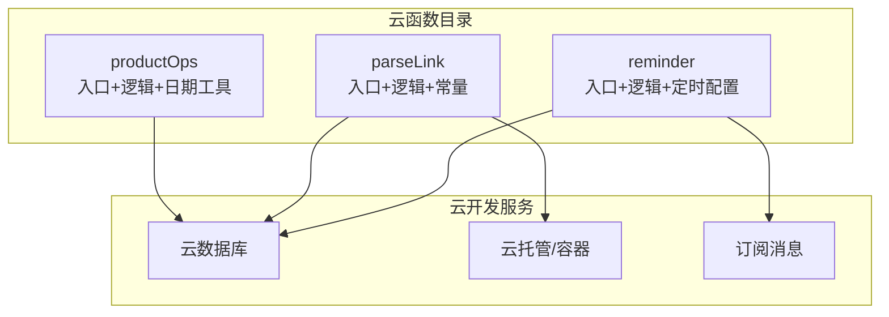
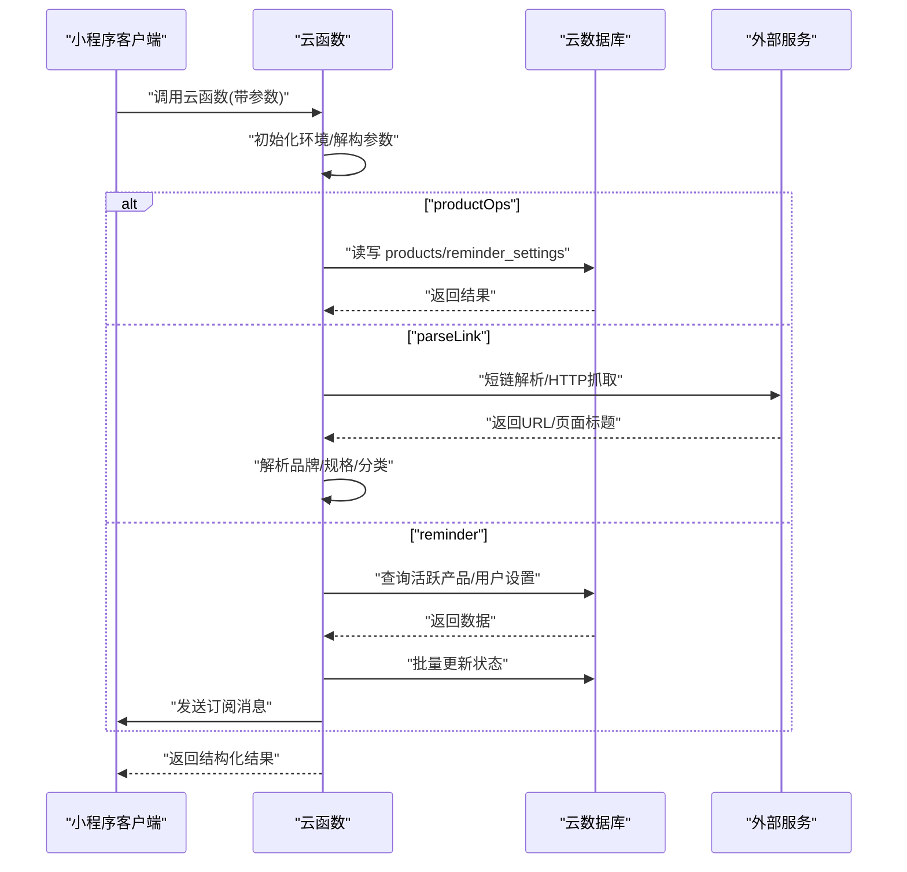
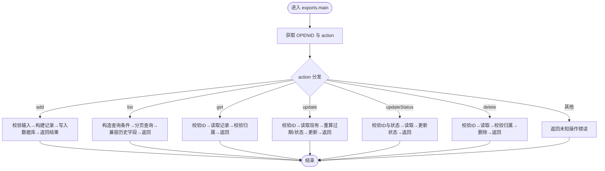
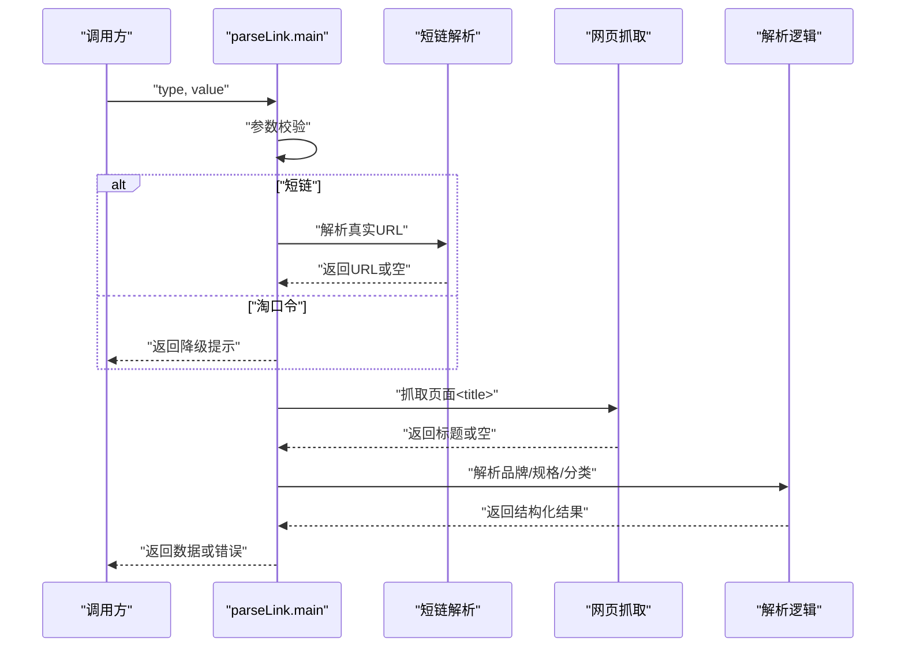
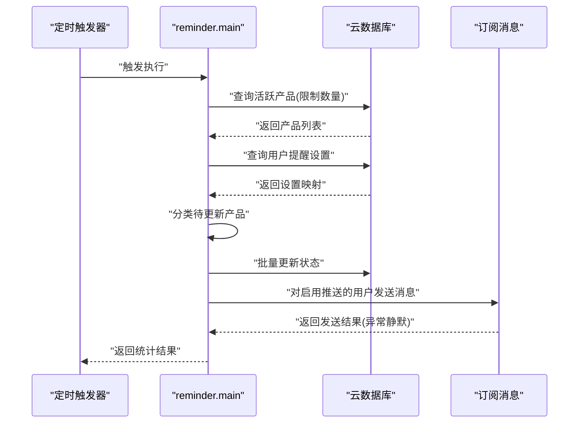
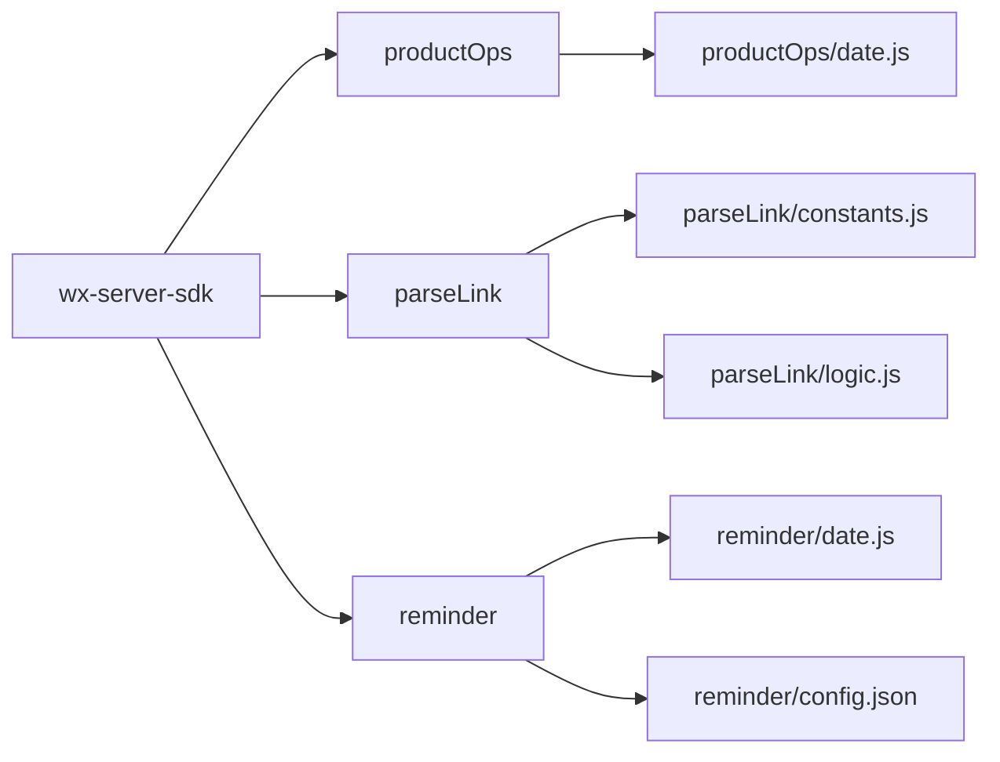

# 云函数架构设计

<cite>
**本文档引用的文件**
- [cloudfunctions/productOps/index.js](file://cloudfunctions/productOps/index.js)
- [cloudfunctions/productOps/logic.js](file://cloudfunctions/productOps/logic.js)
- [cloudfunctions/productOps/date.js](file://cloudfunctions/productOps/date.js)
- [cloudfunctions/parseLink/index.js](file://cloudfunctions/parseLink/index.js)
- [cloudfunctions/parseLink/logic.js](file://cloudfunctions/parseLink/logic.js)
- [cloudfunctions/parseLink/constants.js](file://cloudfunctions/parseLink/constants.js)
- [cloudfunctions/reminder/index.js](file://cloudfunctions/reminder/index.js)
- [cloudfunctions/reminder/logic.js](file://cloudfunctions/reminder/logic.js)
- [cloudfunctions/reminder/date.js](file://cloudfunctions/reminder/date.js)
- [cloudfunctions/reminder/config.json](file://cloudfunctions/reminder/config.json)
- [cloudfunctions/productOps/package.json](file://cloudfunctions/productOps/package.json)
- [cloudfunctions/parseLink/package.json](file://cloudfunctions/parseLink/package.json)
- [cloudfunctions/reminder/package.json](file://cloudfunctions/reminder/package.json)
</cite>

## 目录
1. [简介](#简介)
2. [项目结构](#项目结构)
3. [核心组件](#核心组件)
4. [架构总览](#架构总览)
5. [详细组件分析](#详细组件分析)
6. [依赖关系分析](#依赖关系分析)
7. [性能考虑](#性能考虑)
8. [故障排查指南](#故障排查指南)
9. [结论](#结论)
10. [附录](#附录)

## 简介
本设计文档面向化妆品库存管理小程序的云函数架构，重点阐述三个核心云函数的职责划分、入口设计、参数分发机制、错误处理策略、与云数据库的交互模式、并发能力与性能优化、部署架构与版本管理、以及监控与扩展维护最佳实践。目标是帮助开发者快速理解系统设计、安全扩展与稳定运维。

## 项目结构
云函数采用按功能模块划分的目录结构，每个云函数独立封装入口、业务逻辑与依赖，便于测试、部署与演进：
- productOps：产品增删改查与状态管理
- parseLink：淘宝/天猫链接解析与标题提取
- reminder：定时任务，批量更新产品状态并发送订阅消息

图表来源
- [cloudfunctions/productOps/index.js:1-171](file://cloudfunctions/productOps/index.js#L1-L171)
- [cloudfunctions/parseLink/index.js:1-112](file://cloudfunctions/parseLink/index.js#L1-L112)
- [cloudfunctions/reminder/index.js:1-106](file://cloudfunctions/reminder/index.js#L1-L106)
- [cloudfunctions/reminder/config.json:1-9](file://cloudfunctions/reminder/config.json#L1-L9)

章节来源
- [cloudfunctions/productOps/package.json:1-9](file://cloudfunctions/productOps/package.json#L1-L9)
- [cloudfunctions/parseLink/package.json:1-9](file://cloudfunctions/parseLink/package.json#L1-L9)
- [cloudfunctions/reminder/package.json:1-9](file://cloudfunctions/reminder/package.json#L1-L9)

## 核心组件
- productOps：统一入口通过 action 参数分发到具体操作；内置输入校验、状态计算与数据库访问；支持分页查询与兼容历史字段。
- parseLink：支持短链与淘口令类型识别，优先使用短链解析，再抓取页面标题，最后解析品牌、规格与分类；具备降级策略。
- reminder：每日定时触发，批量扫描活跃产品，按用户提醒设置分类并更新状态，对开启推送的用户发送订阅消息。

章节来源
- [cloudfunctions/productOps/index.js:40-64](file://cloudfunctions/productOps/index.js#L40-L64)
- [cloudfunctions/parseLink/index.js:11-56](file://cloudfunctions/parseLink/index.js#L11-L56)
- [cloudfunctions/reminder/index.js:15-105](file://cloudfunctions/reminder/index.js#L15-L105)

## 架构总览
云函数通过微信云开发 SDK 初始化环境，统一使用动态环境变量；数据库访问采用集合“products”和“reminder_settings”，定时任务通过配置文件注册触发器。

图表来源
- [cloudfunctions/productOps/index.js:40-171](file://cloudfunctions/productOps/index.js#L40-L171)
- [cloudfunctions/parseLink/index.js:11-112](file://cloudfunctions/parseLink/index.js#L11-L112)
- [cloudfunctions/reminder/index.js:15-106](file://cloudfunctions/reminder/index.js#L15-L106)

## 详细组件分析

### productOps 云函数
- 入口设计：统一 exports.main 接收 event/context，从上下文获取 OPENID 并根据 action 分发。
- 参数分发机制：支持 add/list/get/update/updateStatus/delete，每个分支独立校验与处理。
- 数据访问层：封装查询与分页方法，兼容新旧字段（ownerOpenid/_openid），统一排序与过滤。
- 错误处理：捕获异常并返回统一格式；对无权访问、缺失参数等场景返回明确错误。
- 业务逻辑：纯函数模块化，包含输入校验、状态解析、记录构建与更新重算。
- 日期工具：本地实现日期加月、剩余天数计算与格式化，避免跨目录引用问题。

图表来源
- [cloudfunctions/productOps/index.js:40-171](file://cloudfunctions/productOps/index.js#L40-L171)

章节来源
- [cloudfunctions/productOps/index.js:1-171](file://cloudfunctions/productOps/index.js#L1-L171)
- [cloudfunctions/productOps/logic.js:1-105](file://cloudfunctions/productOps/logic.js#L1-L105)
- [cloudfunctions/productOps/date.js:1-77](file://cloudfunctions/productOps/date.js#L1-L77)

### parseLink 云函数
- 入口设计：接收 type/value 参数，进行基础校验与类型处理。
- 降级策略：短链解析优先；淘口令当前降级提示；抓取页面标题失败时返回错误。
- 业务逻辑：抽取商品ID、抓取页面<title>、解析品牌/规格、推断分类。
- 错误处理：对参数缺失、解析失败、网络超时等场景返回明确错误信息。
- 外部集成：短链解析通过云托管/容器调用（占位），页面抓取使用 Node 内置 http/https 模块。

图表来源
- [cloudfunctions/parseLink/index.js:11-112](file://cloudfunctions/parseLink/index.js#L11-L112)
- [cloudfunctions/parseLink/logic.js:1-78](file://cloudfunctions/parseLink/logic.js#L1-L78)

章节来源
- [cloudfunctions/parseLink/index.js:1-112](file://cloudfunctions/parseLink/index.js#L1-L112)
- [cloudfunctions/parseLink/logic.js:1-78](file://cloudfunctions/parseLink/logic.js#L1-L78)
- [cloudfunctions/parseLink/constants.js:1-101](file://cloudfunctions/parseLink/constants.js#L1-L101)

### reminder 云函数
- 触发方式：通过定时触发器每日 08:00 执行。
- 批处理流程：查询活跃产品→聚合用户设置→分类待更新产品→批量更新状态→对开启推送的用户发送订阅消息。
- 错误处理：对订阅消息发送失败静默忽略，保证主流程稳定。
- 数据一致性：限制单次查询上限以控制资源占用；按用户维度过滤与推送。

图表来源
- [cloudfunctions/reminder/index.js:15-106](file://cloudfunctions/reminder/index.js#L15-L106)
- [cloudfunctions/reminder/logic.js:1-45](file://cloudfunctions/reminder/logic.js#L1-L45)
- [cloudfunctions/reminder/config.json:1-9](file://cloudfunctions/reminder/config.json#L1-L9)

章节来源
- [cloudfunctions/reminder/index.js:1-106](file://cloudfunctions/reminder/index.js#L1-L106)
- [cloudfunctions/reminder/logic.js:1-45](file://cloudfunctions/reminder/logic.js#L1-L45)
- [cloudfunctions/reminder/date.js:1-77](file://cloudfunctions/reminder/date.js#L1-L77)
- [cloudfunctions/reminder/config.json:1-9](file://cloudfunctions/reminder/config.json#L1-L9)

## 依赖关系分析
- 通用依赖：三个云函数均依赖 wx-server-sdk，用于初始化环境与数据库访问。
- 业务依赖：productOps/reminder 引入本地日期工具模块；parseLink 引入本地常量与解析逻辑。
- 外部依赖：parseLink 的短链解析通过云托管/容器调用（占位），页面抓取使用 Node 内置 HTTP 模块。
- 版本管理：各云函数独立 package.json，便于隔离依赖与版本升级。

图表来源
- [cloudfunctions/productOps/package.json:1-9](file://cloudfunctions/productOps/package.json#L1-L9)
- [cloudfunctions/parseLink/package.json:1-9](file://cloudfunctions/parseLink/package.json#L1-L9)
- [cloudfunctions/reminder/package.json:1-9](file://cloudfunctions/reminder/package.json#L1-L9)
- [cloudfunctions/productOps/date.js:1-77](file://cloudfunctions/productOps/date.js#L1-L77)
- [cloudfunctions/reminder/date.js:1-77](file://cloudfunctions/reminder/date.js#L1-L77)
- [cloudfunctions/parseLink/constants.js:1-101](file://cloudfunctions/parseLink/constants.js#L1-L101)
- [cloudfunctions/parseLink/logic.js:1-78](file://cloudfunctions/parseLink/logic.js#L1-L78)
- [cloudfunctions/reminder/config.json:1-9](file://cloudfunctions/reminder/config.json#L1-L9)

章节来源
- [cloudfunctions/productOps/package.json:1-9](file://cloudfunctions/productOps/package.json#L1-L9)
- [cloudfunctions/parseLink/package.json:1-9](file://cloudfunctions/parseLink/package.json#L1-L9)
- [cloudfunctions/reminder/package.json:1-9](file://cloudfunctions/reminder/package.json#L1-L9)

## 性能考虑
- 并发处理能力
  - 云函数默认并发执行，建议对高频接口（如 productOps.list）控制分页大小与查询条件，避免大范围扫描。
  - reminder 限制查询数量，降低单次批处理压力。
- 数据库访问优化
  - 合理使用索引字段（如 ownerOpenid/_openid、status、expirationDate），减少全表扫描。
  - 批量更新时尽量合并写入，减少往返次数。
- 网络请求优化
  - parseLink 的页面抓取设置超时时间，失败即降级；短链解析优先走云托管/容器，失败时返回空值以便降级。
- 代码复用与本地化
  - 日期工具与常量在云函数内本地实现，避免跨目录引用导致的打包与加载问题。
- 资源限制
  - 控制单次请求最大响应体大小，避免内存峰值过高。
  - 对外部 API 调用增加超时与重试策略（当前 parseLink 为降级方案，建议后续完善）。

## 故障排查指南
- 常见错误类型
  - 参数缺失：返回“缺少必要参数/缺少产品ID”等明确提示。
  - 权限不足：返回“无权访问”，检查记录归属字段（ownerOpenid/_openid）。
  - 数据库异常：捕获异常并返回错误信息，定位具体集合与操作。
  - 外部服务失败：parseLink 页面抓取超时或解析失败时返回“无法获取商品信息”。
- 排查步骤
  - 查看云函数日志与耗时，确认触发方式与入参。
  - 核对数据库集合是否存在、索引是否合理、权限是否正确。
  - 对 parseLink，验证短链解析与页面抓取可用性，检查 UA 与超时设置。
  - 对 reminder，确认定时触发器配置与订阅消息模板 ID 是否有效。
- 降级与容错
  - parseLink 的短链解析与页面抓取均具备降级策略，确保功能可用性。
  - reminder 对订阅消息发送失败静默处理，不影响主流程。

章节来源
- [cloudfunctions/productOps/index.js:44-63](file://cloudfunctions/productOps/index.js#L44-L63)
- [cloudfunctions/parseLink/index.js:14-55](file://cloudfunctions/parseLink/index.js#L14-L55)
- [cloudfunctions/reminder/index.js:90-94](file://cloudfunctions/reminder/index.js#L90-L94)

## 结论
该云函数架构以模块化与纯函数为核心，实现了产品管理、链接解析与定时提醒三大关键能力。通过清晰的入口设计、参数分发与错误处理策略，结合数据库访问优化与外部服务降级，保障了系统的稳定性与可扩展性。建议在后续迭代中完善外部 API 的超时与重试、增强监控指标与告警、以及引入更细粒度的权限控制与审计日志。

## 附录
- 部署架构与版本管理
  - 各云函数独立 package.json，便于独立升级依赖与版本控制。
  - 通过微信公众平台或云开发控制台进行部署与灰度发布。
- 监控机制
  - 建议接入云开发日志与性能监控，关注冷启动时延、数据库查询耗时与外部请求成功率。
- 扩展与维护最佳实践
  - 保持业务逻辑纯函数化，提升可测试性与可维护性。
  - 对新增字段与状态枚举，统一在常量与校验逻辑中集中管理。
  - 对定时任务，预留配置开关与阈值控制，避免大规模变更引发抖动。