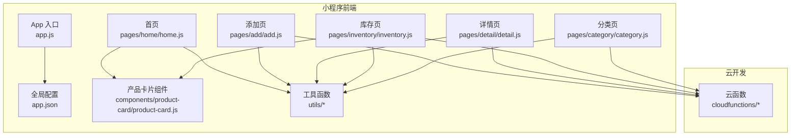
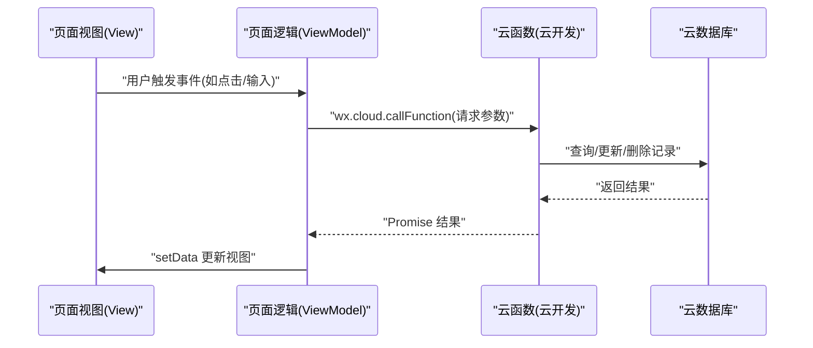
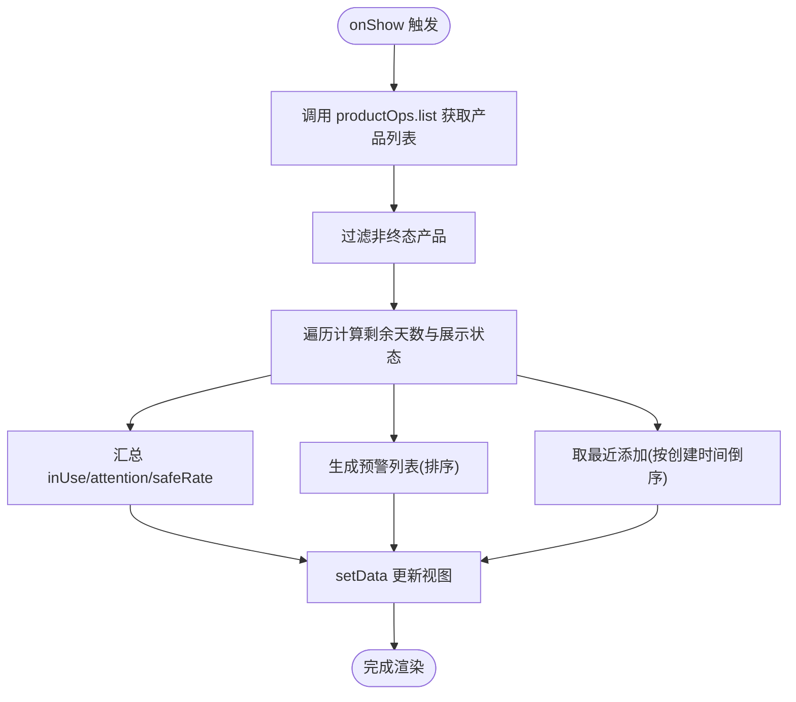
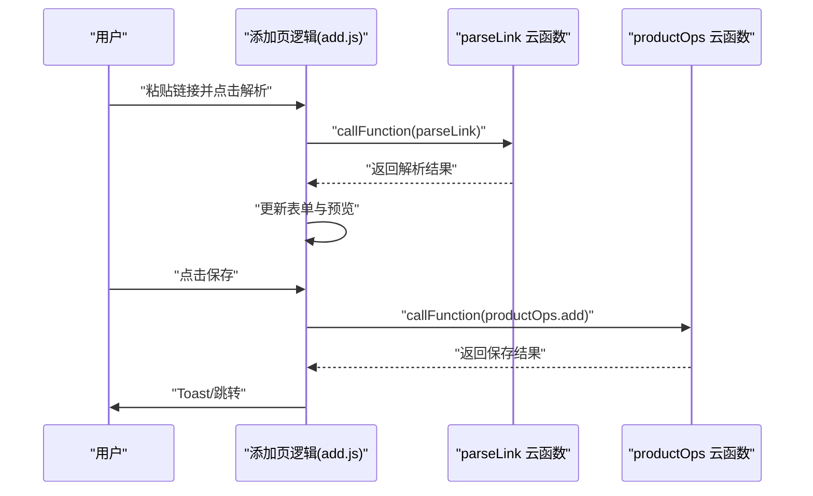
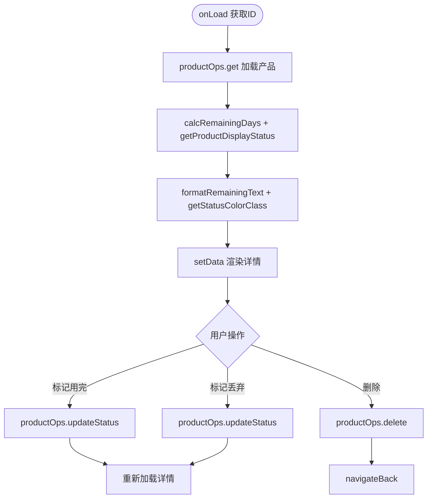
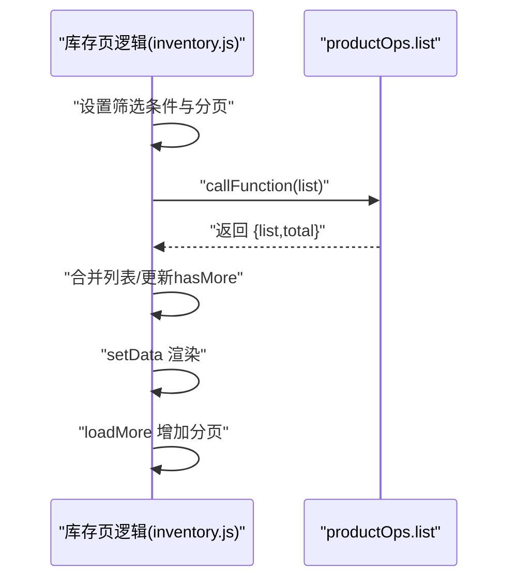
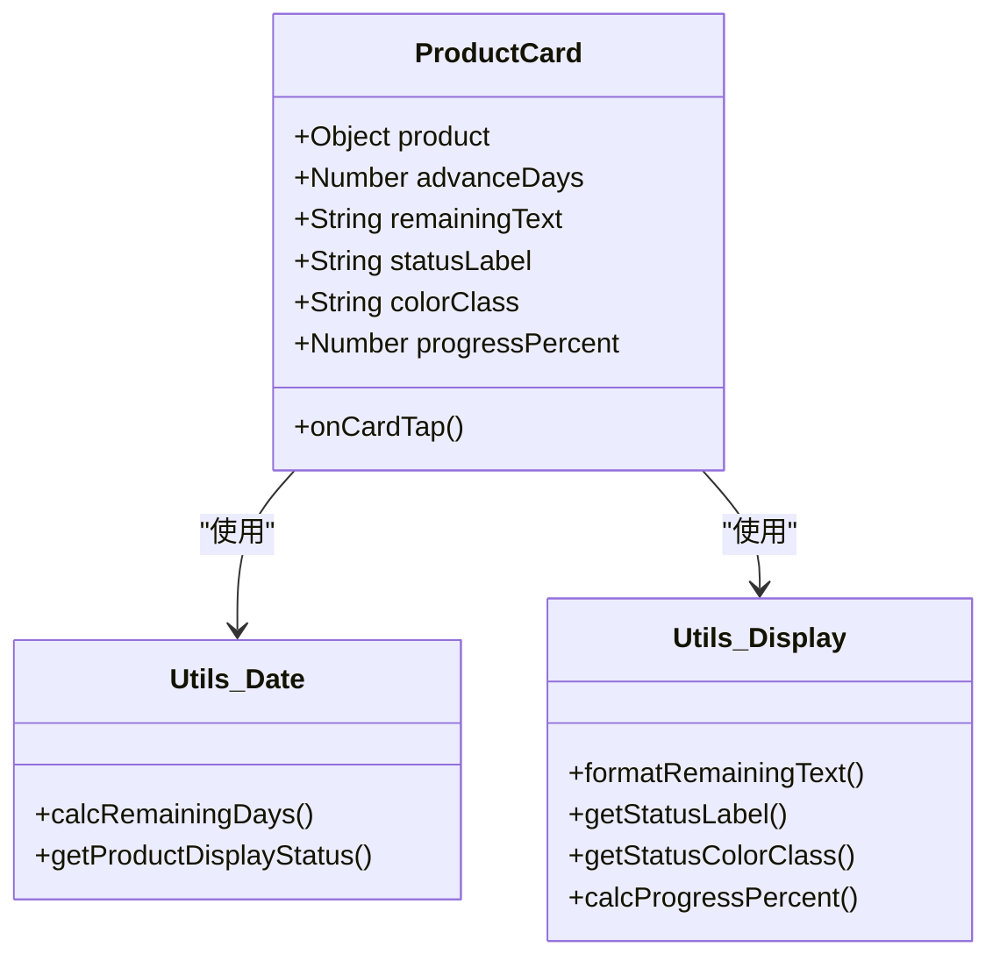
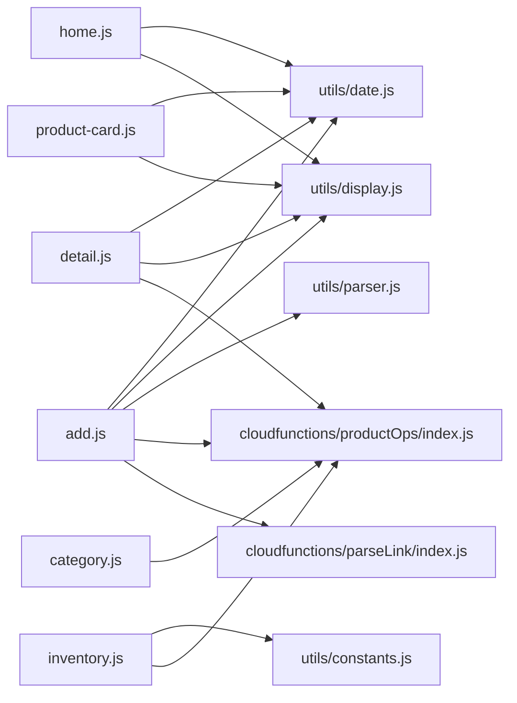

# 前端MVVM架构

<cite>
**本文引用的文件**
- [miniprogram/app.js](file://miniprogram/app.js)
- [miniprogram/app.json](file://miniprogram/app.json)
- [miniprogram/pages/home/home.js](file://miniprogram/pages/home/home.js)
- [miniprogram/pages/add/add.js](file://miniprogram/pages/add/add.js)
- [miniprogram/pages/detail/detail.js](file://miniprogram/pages/detail/detail.js)
- [miniprogram/pages/inventory/inventory.js](file://miniprogram/pages/inventory/inventory.js)
- [miniprogram/pages/category/category.js](file://miniprogram/pages/category/category.js)
- [miniprogram/components/product-card/product-card.js](file://miniprogram/components/product-card/product-card.js)
- [miniprogram/utils/constants.js](file://miniprogram/utils/constants.js)
- [miniprogram/utils/date.js](file://miniprogram/utils/date.js)
- [miniprogram/utils/display.js](file://miniprogram/utils/display.js)
- [miniprogram/utils/parser.js](file://miniprogram/utils/parser.js)
- [cloudfunctions/productOps/index.js](file://cloudfunctions/productOps/index.js)
- [cloudfunctions/parseLink/index.js](file://cloudfunctions/parseLink/index.js)
</cite>

## 目录
1. [简介](#简介)
2. [项目结构](#项目结构)
3. [核心组件](#核心组件)
4. [架构总览](#架构总览)
5. [详细组件分析](#详细组件分析)
6. [依赖分析](#依赖分析)
7. [性能考虑](#性能考虑)
8. [故障排查指南](#故障排查指南)
9. [结论](#结论)
10. [附录](#附录)

## 简介
本文件面向化妆品库存管理小程序，系统性阐述前端MVVM架构在小程序中的落地方式，明确Model（数据模型）、View（页面视图）与ViewModel（页面逻辑）的职责边界；梳理页面组件、可复用组件与工具函数的关系；解释数据绑定、事件处理与状态管理策略；说明页面生命周期与组件通信模式；并结合实际代码路径给出最佳实践与性能优化建议。

## 项目结构
项目采用“页面+组件+工具函数+云函数”的分层组织方式：
- 入口与全局配置：app.js、app.json
- 页面：home、add、inventory、profile、detail、category
- 可复用组件：product-card、category-tag、status-badge（概念性存在）
- 工具函数：constants、date、display、parser
- 云函数：productOps、parseLink

图表来源
- [miniprogram/app.js:1-32](file://miniprogram/app.js#L1-L32)
- [miniprogram/app.json:1-52](file://miniprogram/app.json#L1-L52)
- [miniprogram/pages/home/home.js:1-119](file://miniprogram/pages/home/home.js#L1-L119)
- [miniprogram/pages/add/add.js:1-260](file://miniprogram/pages/add/add.js#L1-L260)
- [miniprogram/pages/detail/detail.js:1-122](file://miniprogram/pages/detail/detail.js#L1-L122)
- [miniprogram/pages/inventory/inventory.js:1-117](file://miniprogram/pages/inventory/inventory.js#L1-L117)
- [miniprogram/pages/category/category.js:1-90](file://miniprogram/pages/category/category.js#L1-L90)
- [miniprogram/components/product-card/product-card.js:1-51](file://miniprogram/components/product-card/product-card.js#L1-L51)
- [cloudfunctions/productOps/index.js:1-171](file://cloudfunctions/productOps/index.js#L1-L171)
- [cloudfunctions/parseLink/index.js:1-112](file://cloudfunctions/parseLink/index.js#L1-L112)

章节来源
- [miniprogram/app.js:1-32](file://miniprogram/app.js#L1-L32)
- [miniprogram/app.json:1-52](file://miniprogram/app.json#L1-L52)

## 核心组件
- Model（数据模型）
  - 云函数封装：productOps、parseLink，负责与云数据库/云托管交互，提供统一的CRUD与业务逻辑。
  - 工具函数：date、display、parser、constants，提供日期计算、展示辅助、输入解析与常量定义。
- View（页面视图）
  - 页面WXML/WXSS：home、add、detail、inventory、category等页面的视图模板。
  - 组件WXML/WXSS：product-card等可复用UI组件。
- ViewModel（页面逻辑）
  - 各Page实例的逻辑文件（如home.js、add.js、detail.js、inventory.js、category.js），负责数据绑定、事件处理、生命周期管理与调用云函数。

章节来源
- [cloudfunctions/productOps/index.js:1-171](file://cloudfunctions/productOps/index.js#L1-L171)
- [cloudfunctions/parseLink/index.js:1-112](file://cloudfunctions/parseLink/index.js#L1-L112)
- [miniprogram/utils/date.js:1-76](file://miniprogram/utils/date.js#L1-L76)
- [miniprogram/utils/display.js:1-76](file://miniprogram/utils/display.js#L1-L76)
- [miniprogram/utils/parser.js:1-70](file://miniprogram/utils/parser.js#L1-L70)
- [miniprogram/utils/constants.js:1-100](file://miniprogram/utils/constants.js#L1-L100)

## 架构总览
MVVM在小程序中的实现要点：
- Model层：云函数与数据库交互，提供标准化的数据读写接口。
- View层：WXML模板与样式，通过数据绑定渲染界面。
- ViewModel层：Page实例的data与方法，负责事件回调、状态更新与异步数据加载。

图表来源
- [miniprogram/pages/home/home.js:28-101](file://miniprogram/pages/home/home.js#L28-L101)
- [miniprogram/pages/add/add.js:153-235](file://miniprogram/pages/add/add.js#L153-L235)
- [miniprogram/pages/detail/detail.js:30-52](file://miniprogram/pages/detail/detail.js#L30-L52)
- [miniprogram/pages/inventory/inventory.js:65-103](file://miniprogram/pages/inventory/inventory.js#L65-L103)
- [cloudfunctions/productOps/index.js:40-64](file://cloudfunctions/productOps/index.js#L40-L64)

## 详细组件分析

### 首页仪表盘（home）
职责划分
- Model：通过productOps.list获取产品集合，供统计与预警使用。
- ViewModel：计算统计数据、预警产品、最近添加产品；处理跳转。
- View：渲染统计卡片、预警列表、最近添加列表。

图表来源
- [miniprogram/pages/home/home.js:28-101](file://miniprogram/pages/home/home.js#L28-L101)
- [miniprogram/utils/date.js:42-57](file://miniprogram/utils/date.js#L42-L57)
- [miniprogram/utils/display.js:13-27](file://miniprogram/utils/display.js#L13-L27)

章节来源
- [miniprogram/pages/home/home.js:1-119](file://miniprogram/pages/home/home.js#L1-L119)
- [miniprogram/utils/date.js:1-76](file://miniprogram/utils/date.js#L1-L76)
- [miniprogram/utils/display.js:1-76](file://miniprogram/utils/display.js#L1-L76)

### 添加产品（add）
职责划分
- ViewModel：双模式（链接导入/手动录入）、表单校验、过期时间预览、保存至云数据库。
- Model：parseLink解析链接，productOps保存产品。
- View：渲染模式切换、表单输入、解析状态与保存按钮。

图表来源
- [miniprogram/pages/add/add.js:55-108](file://miniprogram/pages/add/add.js#L55-L108)
- [miniprogram/pages/add/add.js:153-235](file://miniprogram/pages/add/add.js#L153-L235)
- [miniprogram/utils/parser.js:59-63](file://miniprogram/utils/parser.js#L59-L63)
- [cloudfunctions/parseLink/index.js:11-56](file://cloudfunctions/parseLink/index.js#L11-L56)
- [cloudfunctions/productOps/index.js:75-90](file://cloudfunctions/productOps/index.js#L75-L90)

章节来源
- [miniprogram/pages/add/add.js:1-260](file://miniprogram/pages/add/add.js#L1-L260)
- [miniprogram/utils/parser.js:1-70](file://miniprogram/utils/parser.js#L1-L70)
- [cloudfunctions/parseLink/index.js:1-112](file://cloudfunctions/parseLink/index.js#L1-L112)
- [cloudfunctions/productOps/index.js:1-171](file://cloudfunctions/productOps/index.js#L1-L171)

### 产品详情（detail）
职责划分
- ViewModel：根据过期日期实时计算剩余天数、展示状态、进度条；支持标记用完/丢弃/删除。
- Model：productOps.get/update/delete。
- View：展示产品信息、状态标签、进度条与操作按钮。

图表来源
- [miniprogram/pages/detail/detail.js:21-69](file://miniprogram/pages/detail/detail.js#L21-L69)
- [miniprogram/pages/detail/detail.js:81-120](file://miniprogram/pages/detail/detail.js#L81-L120)
- [miniprogram/utils/date.js:42-57](file://miniprogram/utils/date.js#L42-L57)
- [miniprogram/utils/display.js:34-68](file://miniprogram/utils/display.js#L34-L68)
- [cloudfunctions/productOps/index.js:112-121](file://cloudfunctions/productOps/index.js#L112-L121)
- [cloudfunctions/productOps/index.js:141-157](file://cloudfunctions/productOps/index.js#L141-L157)
- [cloudfunctions/productOps/index.js:159-170](file://cloudfunctions/productOps/index.js#L159-L170)

章节来源
- [miniprogram/pages/detail/detail.js:1-122](file://miniprogram/pages/detail/detail.js#L1-L122)
- [miniprogram/utils/date.js:1-76](file://miniprogram/utils/date.js#L1-L76)
- [miniprogram/utils/display.js:1-76](file://miniprogram/utils/display.js#L1-L76)
- [cloudfunctions/productOps/index.js:1-171](file://cloudfunctions/productOps/index.js#L1-L171)

### 库存清单（inventory）
职责划分
- ViewModel：关键词搜索、分类筛选、状态过滤、分页加载；聚合列表与总数。
- Model：productOps.list。
- View：列表渲染、加载更多、筛选器与跳转按钮。

图表来源
- [miniprogram/pages/inventory/inventory.js:65-103](file://miniprogram/pages/inventory/inventory.js#L65-L103)
- [cloudfunctions/productOps/index.js:92-110](file://cloudfunctions/productOps/index.js#L92-L110)

章节来源
- [miniprogram/pages/inventory/inventory.js:1-117](file://miniprogram/pages/inventory/inventory.js#L1-L117)
- [cloudfunctions/productOps/index.js:1-171](file://cloudfunctions/productOps/index.js#L1-L171)

### 产品卡片组件（product-card）
职责划分
- Properties：接收产品对象与提前天数。
- Observers：监听产品与提前天数变化，实时计算剩余天数、状态标签、颜色类与进度。
- Methods：卡片点击跳转详情。

图表来源
- [miniprogram/components/product-card/product-card.js:19-33](file://miniprogram/components/product-card/product-card.js#L19-L33)
- [miniprogram/utils/date.js:42-57](file://miniprogram/utils/date.js#L42-L57)
- [miniprogram/utils/display.js:34-68](file://miniprogram/utils/display.js#L34-L68)

章节来源
- [miniprogram/components/product-card/product-card.js:1-51](file://miniprogram/components/product-card/product-card.js#L1-L51)
- [miniprogram/utils/date.js:1-76](file://miniprogram/utils/date.js#L1-L76)
- [miniprogram/utils/display.js:1-76](file://miniprogram/utils/display.js#L1-L76)

### 分类管理（category）
职责划分
- ViewModel：加载自定义分类、添加新分类、删除分类。
- Model：云数据库categories集合。
- View：展示预设与自定义分类，提供新增/删除操作。

章节来源
- [miniprogram/pages/category/category.js:1-90](file://miniprogram/pages/category/category.js#L1-L90)

## 依赖分析
- 页面到工具函数：home、add、detail、inventory、category均依赖utils/date、utils/display、utils/parser、utils/constants。
- 页面到云函数：add、detail、inventory、category通过wx.cloud.callFunction调用productOps与parseLink。
- 组件到工具函数：product-card依赖utils/date与utils/display。
- 云函数到工具逻辑：productOps、parseLink内部封装了业务逻辑与降级策略。

图表来源
- [miniprogram/pages/home/home.js:6-7](file://miniprogram/pages/home/home.js#L6-L7)
- [miniprogram/pages/add/add.js:6-8](file://miniprogram/pages/add/add.js#L6-L8)
- [miniprogram/pages/detail/detail.js:6-7](file://miniprogram/pages/detail/detail.js#L6-L7)
- [miniprogram/pages/inventory/inventory.js:6](file://miniprogram/pages/inventory/inventory.js#L6)
- [miniprogram/components/product-card/product-card.js:4-5](file://miniprogram/components/product-card/product-card.js#L4-L5)
- [cloudfunctions/productOps/index.js:13-19](file://cloudfunctions/productOps/index.js#L13-L19)
- [cloudfunctions/parseLink/index.js:7](file://cloudfunctions/parseLink/index.js#L7)

章节来源
- [miniprogram/utils/date.js:1-76](file://miniprogram/utils/date.js#L1-L76)
- [miniprogram/utils/display.js:1-76](file://miniprogram/utils/display.js#L1-L76)
- [miniprogram/utils/parser.js:1-70](file://miniprogram/utils/parser.js#L1-L70)
- [miniprogram/utils/constants.js:1-100](file://miniprogram/utils/constants.js#L1-L100)
- [cloudfunctions/productOps/index.js:1-171](file://cloudfunctions/productOps/index.js#L1-L171)
- [cloudfunctions/parseLink/index.js:1-112](file://cloudfunctions/parseLink/index.js#L1-L112)

## 性能考虑
- 列表渲染与分页
  - 使用分页参数避免一次性加载过多数据，减少首屏压力。
  - 合并列表时注意去重与长度判断，避免重复渲染。
- 日期计算与状态判断
  - 在组件observers中进行轻量计算，避免在页面data中存储冗余中间态。
  - 对高频计算（如进度百分比）可缓存中间值，降低重复计算。
- 云函数调用
  - 合理设置pageSize与分页策略，避免频繁请求。
  - 对错误场景（超时、权限不足）进行降级提示，避免阻塞UI。
- 数据绑定
  - 使用setData原子更新，避免拆分多次setData导致的多次渲染。
  - 对复杂对象更新使用路径表达式，减少不必要的深拷贝。

## 故障排查指南
- 云开发未配置
  - 现象：保存/解析失败、弹出配置提示。
  - 处理：在app.js中正确填写ENV_ID；在开发者工具中开通云开发并部署云函数。
- 权限问题
  - 现象：提示“无权访问”或“没有权限”。
  - 处理：检查云函数权限与数据库安全规则；确认用户登录状态。
- 超时与网络异常
  - 现象：保存超时或加载失败。
  - 处理：检查云函数部署状态、网络连通性与数据库权限；适当增加重试或提示。
- 链接解析失败
  - 现象：解析提示“无法识别链接格式/解析未能获取产品信息”。
  - 处理：确认输入链接类型；短链/淘口令需解析为真实URL；必要时手动录入。

章节来源
- [miniprogram/pages/add/add.js:212-234](file://miniprogram/pages/add/add.js#L212-L234)
- [miniprogram/pages/home/home.js:38-42](file://miniprogram/pages/home/home.js#L38-L42)
- [cloudfunctions/parseLink/index.js:22-31](file://cloudfunctions/parseLink/index.js#L22-L31)
- [cloudfunctions/productOps/index.js:117-120](file://cloudfunctions/productOps/index.js#L117-L120)

## 结论
该小程序以MVVM为核心架构，通过清晰的职责划分与模块化设计，实现了从数据模型、页面逻辑到视图渲染的完整闭环。工具函数与云函数分别承担算法与业务逻辑，页面与组件聚焦于状态管理与交互体验。遵循本文的最佳实践与性能建议，可在保证功能完整性的同时提升用户体验与维护效率。

## 附录
- MVVM在小程序中的落地要点
  - Model：云函数封装数据访问与业务逻辑，提供稳定接口。
  - ViewModel：Page与Component承载状态与事件，通过setData驱动视图。
  - View：WXML模板与样式，配合数据绑定实现响应式渲染。
- 代码示例路径（仅路径，不含代码内容）
  - 首页仪表盘数据加载与渲染：[miniprogram/pages/home/home.js:28-101](file://miniprogram/pages/home/home.js#L28-L101)
  - 添加产品表单与保存流程：[miniprogram/pages/add/add.js:153-235](file://miniprogram/pages/add/add.js#L153-L235)
  - 产品详情状态计算与操作：[miniprogram/pages/detail/detail.js:54-69](file://miniprogram/pages/detail/detail.js#L54-L69)
  - 库存列表分页与筛选：[miniprogram/pages/inventory/inventory.js:65-103](file://miniprogram/pages/inventory/inventory.js#L65-L103)
  - 产品卡片组件状态计算：[miniprogram/components/product-card/product-card.js:19-33](file://miniprogram/components/product-card/product-card.js#L19-L33)
  - 云函数入口与分发：[cloudfunctions/productOps/index.js:40-64](file://cloudfunctions/productOps/index.js#L40-L64)
  - 链接解析流程：[cloudfunctions/parseLink/index.js:11-56](file://cloudfunctions/parseLink/index.js#L11-L56)