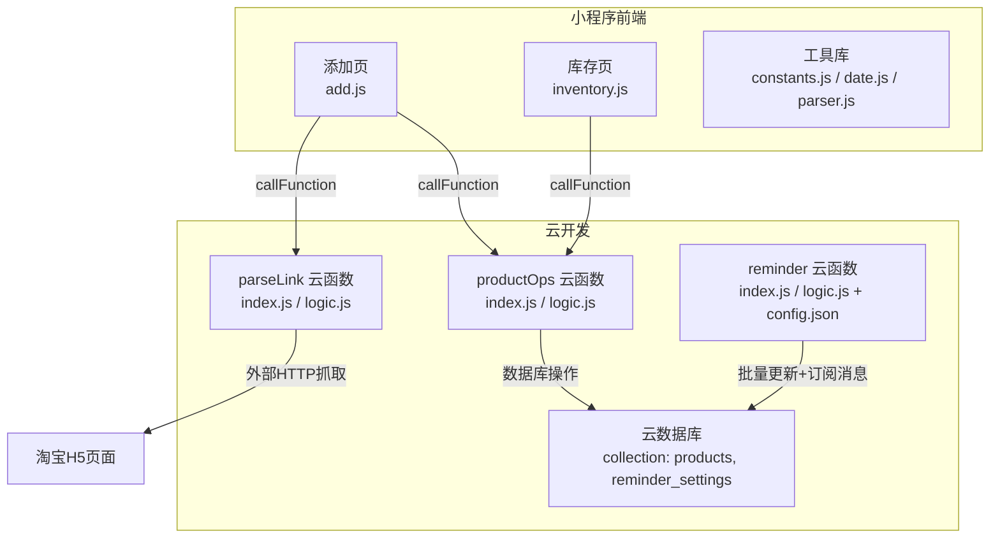
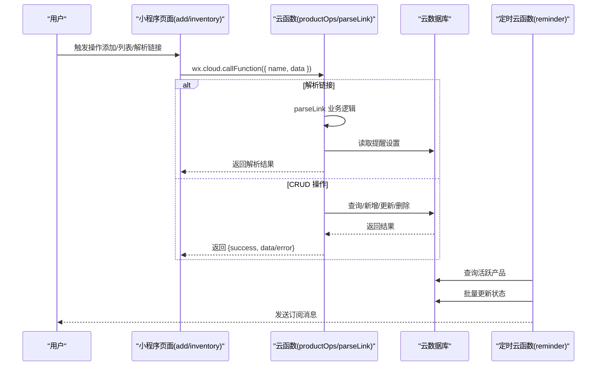
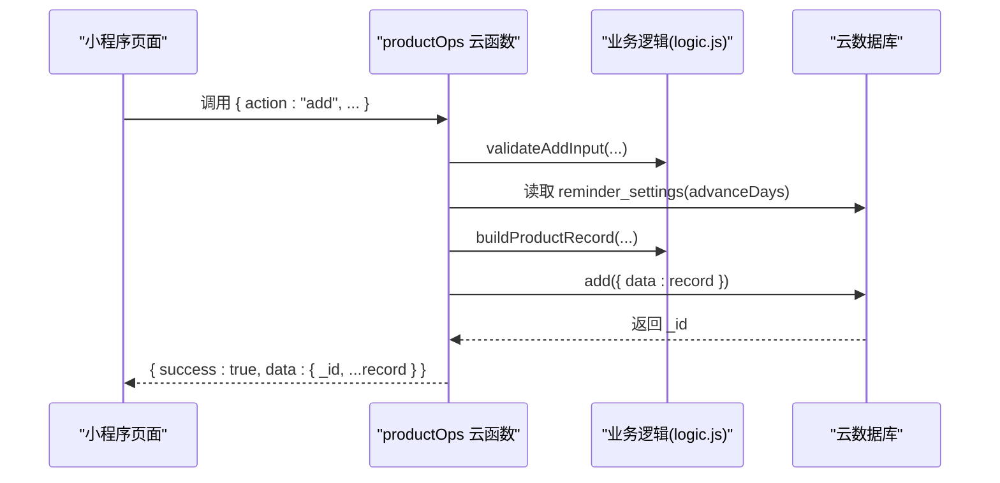
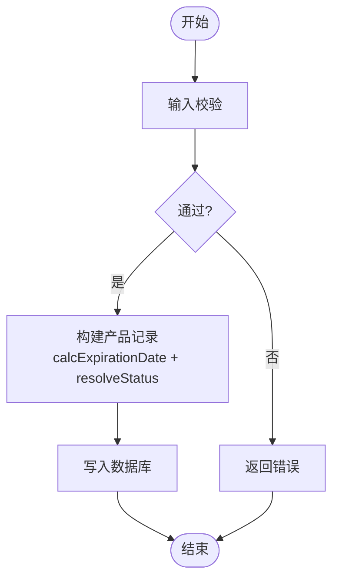
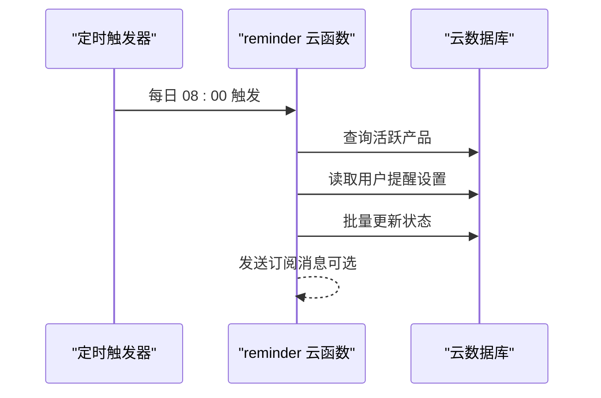
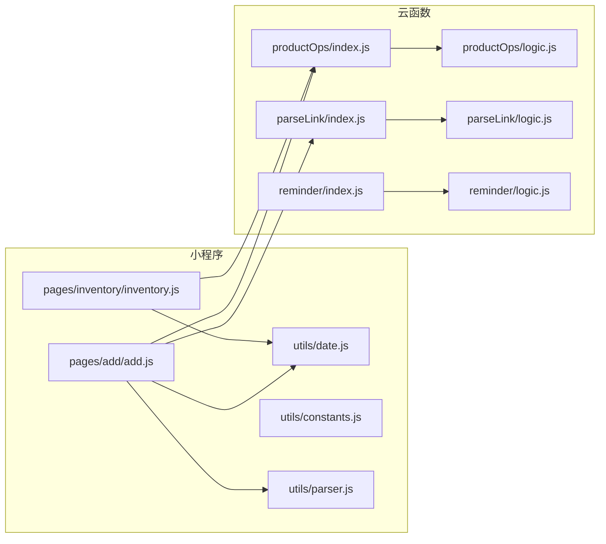

# 数据流设计

<cite>
**本文引用的文件**
- [app.js](file://miniprogram/app.js)
- [project.config.json](file://project.config.json)
- [add.js](file://miniprogram/pages/add/add.js)
- [inventory.js](file://miniprogram/pages/inventory/inventory.js)
- [constants.js](file://miniprogram/utils/constants.js)
- [date.js](file://miniprogram/utils/date.js)
- [parser.js](file://miniprogram/utils/parser.js)
- [productOps/index.js](file://cloudfunctions/productOps/index.js)
- [productOps/logic.js](file://cloudfunctions/productOps/logic.js)
- [parseLink/index.js](file://cloudfunctions/parseLink/index.js)
- [parseLink/logic.js](file://cloudfunctions/parseLink/logic.js)
- [reminder/index.js](file://cloudfunctions/reminder/index.js)
- [reminder/logic.js](file://cloudfunctions/reminder/logic.js)
- [reminder/config.json](file://cloudfunctions/reminder/config.json)
</cite>

## 目录
1. [简介](#简介)
2. [项目结构](#项目结构)
3. [核心组件](#核心组件)
4. [架构总览](#架构总览)
5. [详细组件分析](#详细组件分析)
6. [依赖关系分析](#依赖关系分析)
7. [性能考量](#性能考量)
8. [故障排查指南](#故障排查指南)
9. [结论](#结论)
10. [附录](#附录)

## 简介
本文件面向化妆品库存管理小程序，系统性梳理“从用户操作到数据存储”的完整数据流，覆盖：
- 小程序前端与云函数之间的数据传输协议与格式
- 云函数与云数据库之间的交互模式（CRUD）
- 数据验证、转换与处理流程
- 状态管理策略与缓存机制设计
- 数据一致性保障与错误恢复机制
- 数据安全与权限控制在数据流中的实现

## 项目结构
项目采用“小程序前端 + 云开发云函数 + 云数据库”三层架构。小程序通过 wx.cloud.callFunction 调用云函数；云函数使用 wx-server-sdk 访问云数据库；定时云函数按日执行状态更新与通知。

图表来源
- [add.js:70-108](file://miniprogram/pages/add/add.js#L70-L108)
- [add.js:196-235](file://miniprogram/pages/add/add.js#L196-L235)
- [inventory.js:80-103](file://miniprogram/pages/inventory/inventory.js#L80-L103)
- [productOps/index.js:40-64](file://cloudfunctions/productOps/index.js#L40-L64)
- [parseLink/index.js:11-56](file://cloudfunctions/parseLink/index.js#L11-L56)
- [reminder/index.js:15-105](file://cloudfunctions/reminder/index.js#L15-L105)
- [reminder/config.json:1-9](file://cloudfunctions/reminder/config.json#L1-L9)

章节来源
- [project.config.json:1-21](file://project.config.json#L1-L21)
- [app.js:10-26](file://miniprogram/app.js#L10-L26)

## 核心组件
- 小程序前端页面与工具
  - 添加页：负责双模式（链接导入/手动录入）、表单校验、调用云函数、错误提示与界面反馈
  - 库存页：负责搜索、分类筛选、状态过滤、分页加载、调用云函数
  - 工具库：常量、日期计算、链接解析
- 云函数
  - productOps：统一入口，按 action 分发 CRUD 操作，内置输入校验与状态计算
  - parseLink：链接解析（短链、淘口令、标题提取、分类推断）
  - reminder：每日定时任务，批量更新状态并发送订阅消息
- 云数据库
  - products：产品记录集合
  - reminder_settings：用户提醒设置集合

章节来源
- [add.js:10-34](file://miniprogram/pages/add/add.js#L10-L34)
- [inventory.js:10-21](file://miniprogram/pages/inventory/inventory.js#L10-L21)
- [constants.js:6-21](file://miniprogram/utils/constants.js#L6-L21)
- [date.js:25-48](file://miniprogram/utils/date.js#L25-L48)
- [parser.js:17-63](file://miniprogram/utils/parser.js#L17-L63)
- [productOps/index.js:40-64](file://cloudfunctions/productOps/index.js#L40-L64)
- [parseLink/index.js:11-56](file://cloudfunctions/parseLink/index.js#L11-L56)
- [reminder/index.js:15-105](file://cloudfunctions/reminder/index.js#L15-L105)

## 架构总览
小程序前端通过 wx.cloud.callFunction 与云函数通信，云函数使用 wx-server-sdk 访问云数据库。定时云函数按日运行，批量更新产品状态并推送订阅消息。

图表来源
- [add.js:70-108](file://miniprogram/pages/add/add.js#L70-L108)
- [add.js:196-235](file://miniprogram/pages/add/add.js#L196-L235)
- [inventory.js:80-103](file://miniprogram/pages/inventory/inventory.js#L80-L103)
- [productOps/index.js:25-38](file://cloudfunctions/productOps/index.js#L25-L38)
- [reminder/index.js:15-105](file://cloudfunctions/reminder/index.js#L15-L105)

## 详细组件分析

### 1) 前端与云函数数据传输协议
- 调用方式
  - 小程序使用 wx.cloud.callFunction(name, data) 调用云函数
  - productOps 支持 action 字段分发不同操作：add/list/get/update/updateStatus/delete
- 请求格式
  - 添加产品：包含 name、category、productionDate、shelfLifeMonths 等字段，可选 openedDate/openedShelfLifeMonths/sourceLink
  - 列表查询：包含 category、status、keyword、page、pageSize
  - 获取详情：包含 _id
  - 更新/删除：包含 _id，更新时携带需变更字段
  - 更新状态：包含 _id 和 status（仅允许 used_up 或 discarded）
  - 链接解析：包含 type（taobao_link/short_link/taokou_ling）与 value
- 响应格式
  - 统一返回 { success, data?, error? } 结构
  - 成功时返回 data，失败时返回 error 字符串

章节来源
- [add.js:177-198](file://miniprogram/pages/add/add.js#L177-L198)
- [inventory.js:70-79](file://miniprogram/pages/inventory/inventory.js#L70-L79)
- [productOps/index.js:44-63](file://cloudfunctions/productOps/index.js#L44-L63)
- [parseLink/index.js:12-16](file://cloudfunctions/parseLink/index.js#L12-L16)

### 2) 云函数与云数据库交互模式（CRUD）
- 新增产品（action:add）
  - 输入校验：名称、分类、生产日期、保质期必填且有效
  - 读取用户提醒设置（advanceDays），用于初始状态计算
  - 构建完整产品记录（含过期日期、状态、时间戳等）
  - 写入数据库，返回新记录 _id 与完整数据
- 列表查询（action:list）
  - 条件：ownerOpenid = 当前用户标识
  - 支持分类、状态、关键字（模糊）过滤
  - 支持分页（page/pageSize），按过期日期升序
  - 若无结果，兼容旧字段 _openid 的历史数据查询
- 获取详情（action:get）
  - 校验 _id 存在性
  - 读取记录并校验归属（ownerOpenid/_openid）
- 更新（action:update）
  - 校验 _id 与归属
  - 若涉及日期字段变更，则重算过期日期与状态
  - 合并额外字段（如 updatedAt、expirationDate、status）后更新
- 更新状态（action:updateStatus）
  - 校验 _id 与状态合法性（used_up/discarded）
  - 更新状态与 updatedAt
- 删除（action:delete）
  - 校验 _id 与归属后删除

图表来源
- [productOps/index.js:75-90](file://cloudfunctions/productOps/index.js#L75-L90)
- [productOps/logic.js:11-17](file://cloudfunctions/productOps/logic.js#L11-L17)
- [productOps/logic.js:45-71](file://cloudfunctions/productOps/logic.js#L45-L71)

章节来源
- [productOps/index.js:25-38](file://cloudfunctions/productOps/index.js#L25-L38)
- [productOps/index.js:75-90](file://cloudfunctions/productOps/index.js#L75-L90)
- [productOps/index.js:92-110](file://cloudfunctions/productOps/index.js#L92-L110)
- [productOps/index.js:112-121](file://cloudfunctions/productOps/index.js#L112-L121)
- [productOps/index.js:123-139](file://cloudfunctions/productOps/index.js#L123-L139)
- [productOps/index.js:141-157](file://cloudfunctions/productOps/index.js#L141-L157)
- [productOps/index.js:159-170](file://cloudfunctions/productOps/index.js#L159-L170)
- [productOps/logic.js:11-17](file://cloudfunctions/productOps/logic.js#L11-L17)
- [productOps/logic.js:45-71](file://cloudfunctions/productOps/logic.js#L45-L71)
- [productOps/logic.js:77-96](file://cloudfunctions/productOps/logic.js#L77-L96)

### 3) 数据验证、转换与处理流程
- 输入校验
  - 添加：名称/分类/生产日期/保质期必填且有效
  - 更新状态：状态非空且仅允许 used_up 或 discarded
- 状态计算
  - 过期日期：未开封与开封后的较早过期日
  - 状态：根据剩余天数与用户提醒天数（默认30天）判定 in_use/expiring_soon/expired
- 日期处理
  - addMonths 处理月末溢出
  - calcRemainingDays 计算剩余天数
  - 前端展示状态：getProductDisplayStatus
- 链接解析
  - 识别链接类型（淘宝/短链/淘口令）
  - 提取商品ID，抓取H5页面标题，解析品牌/规格/分类

图表来源
- [productOps/logic.js:11-17](file://cloudfunctions/productOps/logic.js#L11-L17)
- [productOps/logic.js:45-71](file://cloudfunctions/productOps/logic.js#L45-L71)
- [date.js:25-48](file://miniprogram/utils/date.js#L25-L48)

章节来源
- [productOps/logic.js:11-29](file://cloudfunctions/productOps/logic.js#L11-L29)
- [productOps/logic.js:34-40](file://cloudfunctions/productOps/logic.js#L34-L40)
- [productOps/logic.js:45-71](file://cloudfunctions/productOps/logic.js#L45-L71)
- [productOps/logic.js:77-96](file://cloudfunctions/productOps/logic.js#L77-L96)
- [date.js:10-19](file://miniprogram/utils/date.js#L10-L19)
- [date.js:25-48](file://miniprogram/utils/date.js#L25-L48)
- [date.js:53-57](file://miniprogram/utils/date.js#L53-L57)

### 4) 状态管理策略与缓存机制
- 前端状态管理
  - 添加页：mode/linkText/parsing/parseStatus/parsedName/form/loading/saving 等
  - 库存页：products/keyword/activeCategory/activeStatus/loading/hasMore/page 等
- 缓存与分页
  - 库存页采用本地数组拼接 + 分页参数 page/pageSize，避免重复请求
  - 列表查询支持 keyword/category/status 过滤，每次变更重置 page 并清空已有数据
- 云函数缓存
  - 读取用户提醒设置时可按需缓存在内存（当前实现按需查询），建议在高频场景引入短期缓存以降低查询开销

章节来源
- [add.js:11-34](file://miniprogram/pages/add/add.js#L11-L34)
- [add.js:136-151](file://miniprogram/pages/add/add.js#L136-L151)
- [inventory.js:11-21](file://miniprogram/pages/inventory/inventory.js#L11-L21)
- [inventory.js:66-110](file://miniprogram/pages/inventory/inventory.js#L66-L110)

### 5) 数据一致性与错误恢复
- 一致性
  - 云函数内部按操作原子化执行，避免跨事务场景
  - 列表查询兼容新旧字段（ownerOpenid/_openid），确保历史数据可读
- 错误恢复
  - 云函数统一 try/catch 包裹，返回 { success: false, error }
  - 前端针对云函数错误码与超时进行分类提示与引导
  - 链接解析降级策略：API → 页面抓取 → 标题解析

章节来源
- [productOps/index.js:44-63](file://cloudfunctions/productOps/index.js#L44-L63)
- [productOps/index.js:103-107](file://cloudfunctions/productOps/index.js#L103-L107)
- [parseLink/index.js:18-56](file://cloudfunctions/parseLink/index.js#L18-L56)
- [add.js:99-107](file://miniprogram/pages/add/add.js#L99-L107)
- [add.js:212-234](file://miniprogram/pages/add/add.js#L212-L234)

### 6) 数据安全与权限控制
- 用户标识
  - 云函数通过 cloud.getWXContext() 获取 OPENID，作为数据归属标识
- 访问控制
  - 所有 CRUD 操作均读取目标记录并校验 ownerOpenid/_openid 是否等于 OPENID
  - 无权限访问返回错误
- 环境初始化
  - 小程序在 app.js 中初始化云开发并绑定云环境 ID

章节来源
- [productOps/index.js:41-42](file://cloudfunctions/productOps/index.js#L41-L42)
- [productOps/index.js:117-131](file://cloudfunctions/productOps/index.js#L117-L131)
- [productOps/index.js:148-151](file://cloudfunctions/productOps/index.js#L148-L151)
- [app.js:14-26](file://miniprogram/app.js#L14-L26)

### 7) 定时任务与状态更新
- 触发器
  - reminder 云函数配置每日 08:00 执行
- 流程
  - 查询所有活跃产品（in_use/expiring_soon）
  - 读取用户提醒设置，按用户自定义提前天数分类
  - 批量更新过期状态（expired/expiring_soon）
  - 对开启推送的用户发送订阅消息

图表来源
- [reminder/config.json:1-9](file://cloudfunctions/reminder/config.json#L1-L9)
- [reminder/index.js:15-105](file://cloudfunctions/reminder/index.js#L15-L105)
- [reminder/logic.js:17-40](file://cloudfunctions/reminder/logic.js#L17-L40)

章节来源
- [reminder/config.json:1-9](file://cloudfunctions/reminder/config.json#L1-L9)
- [reminder/index.js:15-105](file://cloudfunctions/reminder/index.js#L15-L105)
- [reminder/logic.js:17-40](file://cloudfunctions/reminder/logic.js#L17-L40)

## 依赖关系分析
- 前端依赖
  - utils/date.js：日期计算与状态展示
  - utils/constants.js：状态枚举与预设分类
  - utils/parser.js：链接类型识别与提取
- 云函数依赖
  - productOps/index.js 依赖 logic.js（纯函数，便于测试）
  - parseLink/index.js 依赖 logic.js（纯函数，便于测试）
  - reminder/index.js 依赖 logic.js（纯函数，便于测试）

图表来源
- [add.js:6-8](file://miniprogram/pages/add/add.js#L6-L8)
- [inventory.js](file://miniprogram/pages/inventory/inventory.js#L6)
- [date.js:1-76](file://miniprogram/utils/date.js#L1-L76)
- [constants.js:1-100](file://miniprogram/utils/constants.js#L1-L100)
- [parser.js:1-70](file://miniprogram/utils/parser.js#L1-L70)
- [productOps/index.js:13-19](file://cloudfunctions/productOps/index.js#L13-L19)
- [productOps/logic.js:1-105](file://cloudfunctions/productOps/logic.js#L1-L105)
- [parseLink/index.js:6-7](file://cloudfunctions/parseLink/index.js#L6-L7)
- [parseLink/logic.js:1-78](file://cloudfunctions/parseLink/logic.js#L1-L78)
- [reminder/index.js:8-9](file://cloudfunctions/reminder/index.js#L8-L9)
- [reminder/logic.js:1-45](file://cloudfunctions/reminder/logic.js#L1-L45)

章节来源
- [productOps/index.js:13-19](file://cloudfunctions/productOps/index.js#L13-L19)
- [parseLink/index.js:6-7](file://cloudfunctions/parseLink/index.js#L6-L7)
- [reminder/index.js:8-9](file://cloudfunctions/reminder/index.js#L8-L9)

## 性能考量
- 云函数冷启动与并发
  - 避免在云函数中做重型计算，尽量将纯函数逻辑拆分至 logic.js 以便复用与缓存
- 数据库查询优化
  - 列表查询已按 expirationDate 排序与 limit 控制，建议在常用查询字段建立索引
- 分页与缓存
  - 前端库存页已采用本地数组拼接与分页参数，减少重复请求
- 定时任务批处理
  - reminder 限制每次处理上限并分批更新，降低单次压力

## 故障排查指南
- 云函数调用失败
  - 常见错误码：云开发未配置、权限不足、超时
  - 前端已针对典型错误进行分类提示与引导
- 链接解析失败
  - 短链/淘口令解析降级策略：优先页面抓取，再回退到标题解析
- 数据权限问题
  - 确认云函数中 ownerOpenid/_openid 校验逻辑是否命中
- 环境配置
  - 确认 app.js 中 ENV_ID 与 project.config.json 中云环境配置一致

章节来源
- [add.js:99-107](file://miniprogram/pages/add/add.js#L99-L107)
- [add.js:212-234](file://miniprogram/pages/add/add.js#L212-L234)
- [parseLink/index.js:18-56](file://cloudfunctions/parseLink/index.js#L18-L56)
- [productOps/index.js:117-131](file://cloudfunctions/productOps/index.js#L117-L131)
- [app.js:10-26](file://miniprogram/app.js#L10-L26)
- [project.config.json:1-21](file://project.config.json#L1-L21)

## 结论
该系统通过清晰的前后端职责划分与云函数统一入口，实现了从用户输入到数据库落库的完整闭环。通过严格的输入校验、状态计算与权限控制，保障了数据质量与安全性；通过定时任务与订阅消息，提升了用户体验与数据一致性。建议后续在高频查询场景引入缓存与索引优化，并持续完善错误监控与告警体系。

## 附录
- 关键常量与状态
  - 状态枚举：in_use、expiring_soon、expired、used_up、discarded
  - 预设分类：护肤、彩妆、美发、身体护理、香水、工具
- 日期与状态计算
  - addMonths：月末溢出处理
  - calcExpirationDate：未开封与开封后过期日取较小者
  - calcRemainingDays：剩余天数
  - getProductDisplayStatus：前端展示状态

章节来源
- [constants.js:6-21](file://miniprogram/utils/constants.js#L6-L21)
- [date.js:10-19](file://miniprogram/utils/date.js#L10-L19)
- [date.js:25-48](file://miniprogram/utils/date.js#L25-L48)
- [date.js:53-57](file://miniprogram/utils/date.js#L53-L57)