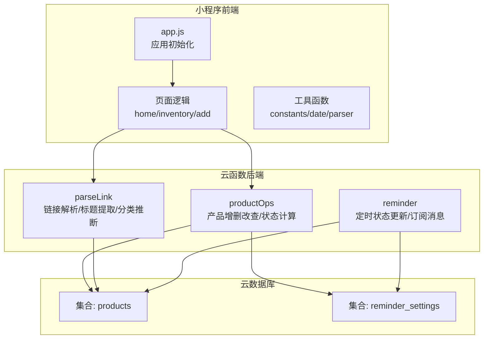
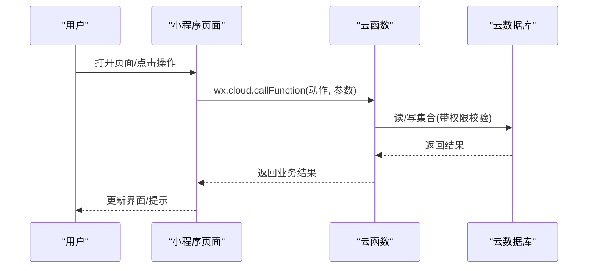
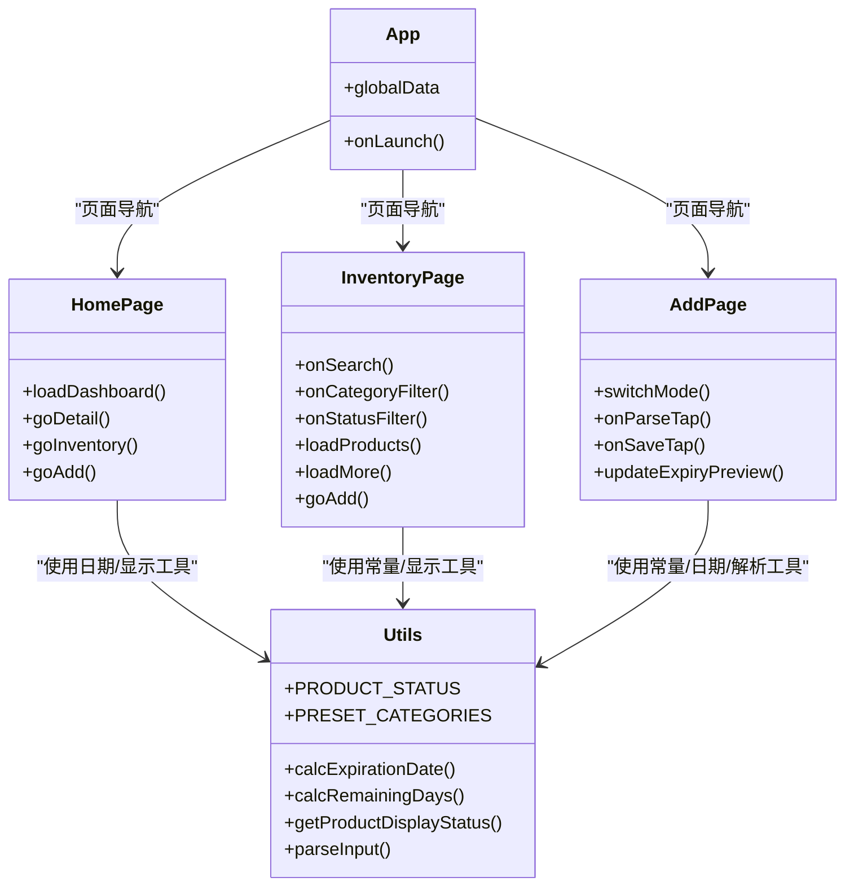
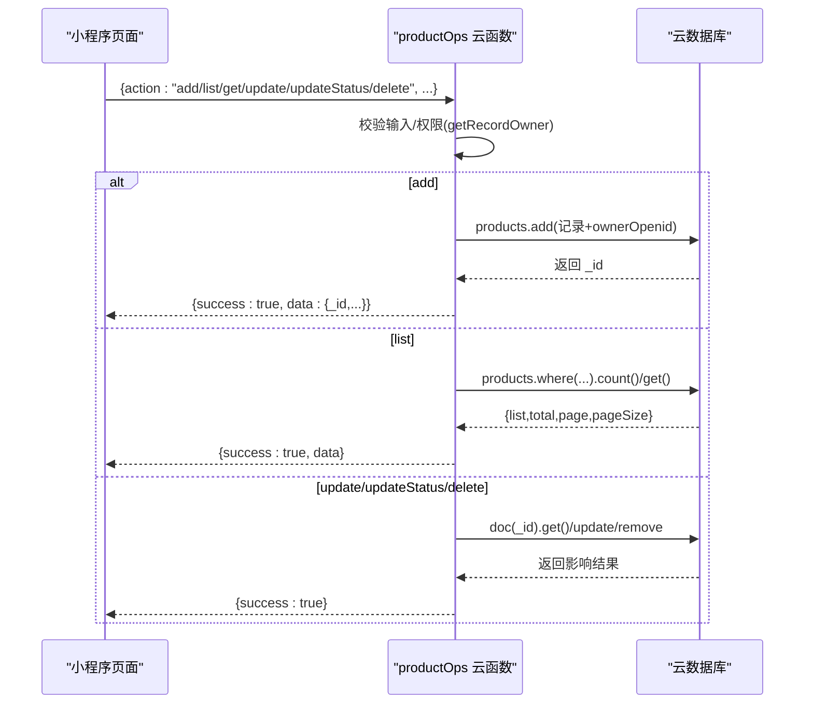
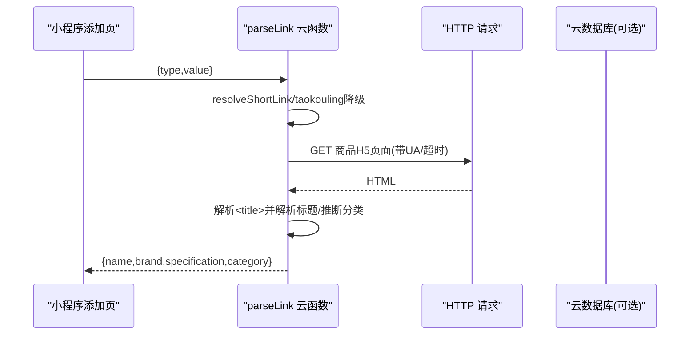
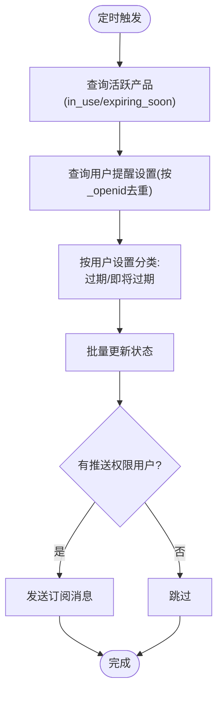
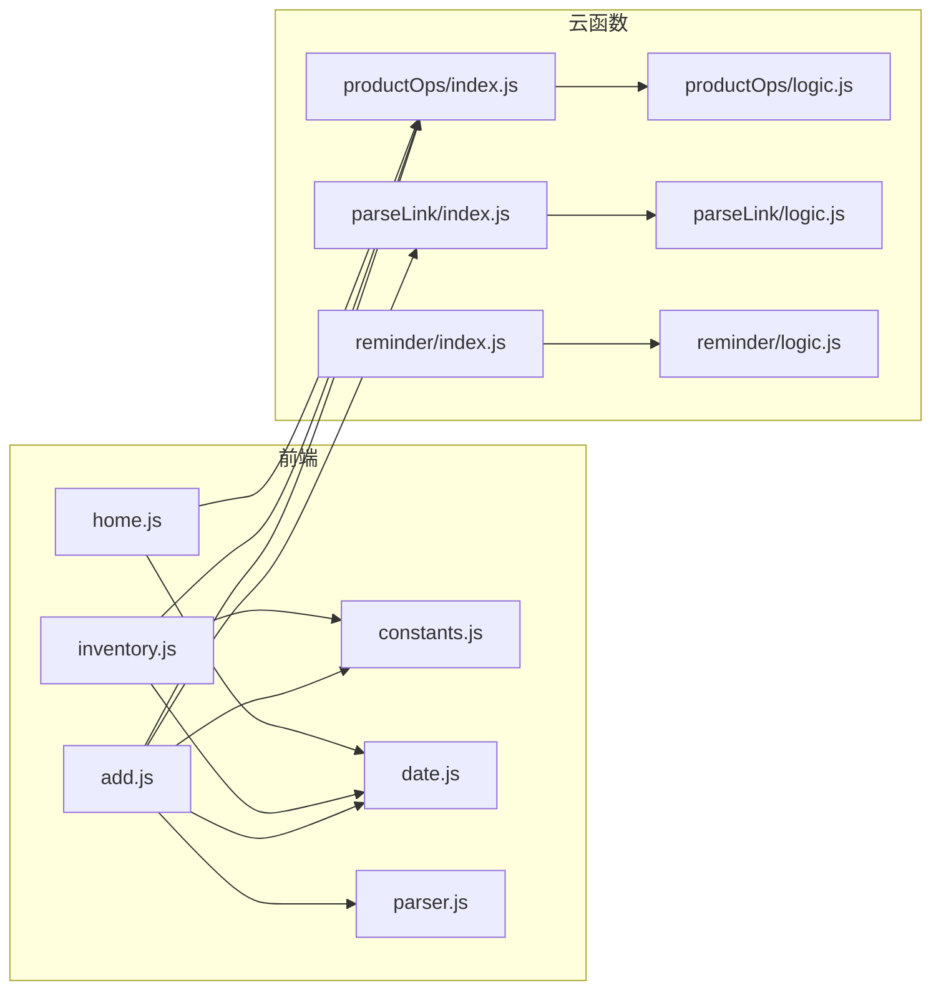

# 整体架构概览

<cite>
**本文引用的文件**
- [miniprogram/app.js](file://miniprogram/app.js)
- [miniprogram/app.json](file://miniprogram/app.json)
- [cloudfunctions/productOps/index.js](file://cloudfunctions/productOps/index.js)
- [cloudfunctions/productOps/logic.js](file://cloudfunctions/productOps/logic.js)
- [cloudfunctions/parseLink/index.js](file://cloudfunctions/parseLink/index.js)
- [cloudfunctions/parseLink/logic.js](file://cloudfunctions/parseLink/logic.js)
- [cloudfunctions/reminder/index.js](file://cloudfunctions/reminder/index.js)
- [cloudfunctions/reminder/logic.js](file://cloudfunctions/reminder/logic.js)
- [miniprogram/pages/home/home.js](file://miniprogram/pages/home/home.js)
- [miniprogram/pages/inventory/inventory.js](file://miniprogram/pages/inventory/inventory.js)
- [miniprogram/pages/add/add.js](file://miniprogram/pages/add/add.js)
- [miniprogram/utils/constants.js](file://miniprogram/utils/constants.js)
- [miniprogram/utils/date.js](file://miniprogram/utils/date.js)
- [miniprogram/utils/parser.js](file://miniprogram/utils/parser.js)
- [package.json](file://package.json)
</cite>

## 目录
1. [引言](#引言)
2. [项目结构](#项目结构)
3. [核心组件](#核心组件)
4. [架构总览](#架构总览)
5. [详细组件分析](#详细组件分析)
6. [依赖分析](#依赖分析)
7. [性能考量](#性能考量)
8. [故障排查指南](#故障排查指南)
9. [结论](#结论)
10. [附录](#附录)

## 引言
本项目为“化妆品库存管理”微信小程序，采用前后端分离架构：小程序前端基于 MVVM 模式与云开发能力交互；后端以云函数为核心，统一承接业务逻辑与数据访问；云数据库提供结构化数据存储；定时任务云函数负责状态批量更新与订阅消息推送。系统强调可扩展性（模块化云函数与纯函数逻辑）、可维护性（清晰的职责划分与测试友好设计）与性能优化（前端本地计算、后端按需查询与分页、定时批处理）。

## 项目结构
项目采用“小程序前端 + 云函数后端 + 云数据库”的三层组织方式：
- 小程序前端：页面、组件、工具函数与全局配置
- 云函数后端：按功能拆分的云函数，分别处理产品操作、链接解析、定时提醒
- 云数据库：存储产品记录与提醒设置等数据

**图示来源**
- [miniprogram/app.js:1-32](file://miniprogram/app.js#L1-L32)
- [miniprogram/pages/home/home.js:1-119](file://miniprogram/pages/home/home.js#L1-L119)
- [miniprogram/pages/inventory/inventory.js:1-117](file://miniprogram/pages/inventory/inventory.js#L1-L117)
- [miniprogram/pages/add/add.js:1-260](file://miniprogram/pages/add/add.js#L1-L260)
- [cloudfunctions/productOps/index.js:1-171](file://cloudfunctions/productOps/index.js#L1-L171)
- [cloudfunctions/parseLink/index.js:1-112](file://cloudfunctions/parseLink/index.js#L1-L112)
- [cloudfunctions/reminder/index.js:1-106](file://cloudfunctions/reminder/index.js#L1-L106)

**章节来源**
- [miniprogram/app.json:1-52](file://miniprogram/app.json#L1-L52)
- [package.json:1-20](file://package.json#L1-L20)

## 核心组件
- 小程序前端（MVVM）
  - App 初始化与云环境绑定
  - 页面逻辑负责数据请求、状态管理与视图渲染
  - 工具函数提供常量、日期计算与输入解析
- 云函数后端
  - productOps：产品增删改查、状态计算与权限校验
  - parseLink：链接解析、标题提取与分类推断
  - reminder：定时任务，批量状态更新与订阅消息
- 云数据库
  - products：产品记录集合
  - reminder_settings：用户提醒设置集合

**章节来源**
- [miniprogram/app.js:10-32](file://miniprogram/app.js#L10-L32)
- [cloudfunctions/productOps/index.js:40-171](file://cloudfunctions/productOps/index.js#L40-L171)
- [cloudfunctions/parseLink/index.js:11-112](file://cloudfunctions/parseLink/index.js#L11-L112)
- [cloudfunctions/reminder/index.js:15-106](file://cloudfunctions/reminder/index.js#L15-L106)

## 架构总览
系统采用“前端 MVVM + 后端云函数 + 云数据库”的典型小程序架构。前端页面通过云函数调用与数据库交互，云函数内部封装业务逻辑与数据访问，定时任务云函数负责周期性批处理与消息推送。

**图示来源**
- [miniprogram/pages/home/home.js:33-101](file://miniprogram/pages/home/home.js#L33-L101)
- [miniprogram/pages/inventory/inventory.js:80-103](file://miniprogram/pages/inventory/inventory.js#L80-L103)
- [miniprogram/pages/add/add.js:70-108](file://miniprogram/pages/add/add.js#L70-L108)
- [cloudfunctions/productOps/index.js:40-171](file://cloudfunctions/productOps/index.js#L40-L171)
- [cloudfunctions/parseLink/index.js:11-56](file://cloudfunctions/parseLink/index.js#L11-L56)
- [cloudfunctions/reminder/index.js:15-106](file://cloudfunctions/reminder/index.js#L15-L106)

## 详细组件分析

### 前端 MVVM 组件
- 应用初始化与云环境
  - 在应用启动时初始化云开发，按配置选择云环境
- 页面职责
  - 首页：统计卡片、即将过期预警、最近添加
  - 库存页：搜索、分类筛选、状态过滤、分页加载
  - 添加页：链接导入/手动录入、过期时间预览、保存
- 工具函数
  - 常量：状态枚举、预设分类、品牌词库
  - 日期：过期时间计算、剩余天数、展示状态、日期格式化
  - 输入解析：识别链接类型、提取 URL/淘口令

**图示来源**
- [miniprogram/app.js:13-32](file://miniprogram/app.js#L13-L32)
- [miniprogram/pages/home/home.js:11-119](file://miniprogram/pages/home/home.js#L11-L119)
- [miniprogram/pages/inventory/inventory.js:10-117](file://miniprogram/pages/inventory/inventory.js#L10-L117)
- [miniprogram/pages/add/add.js:10-260](file://miniprogram/pages/add/add.js#L10-L260)
- [miniprogram/utils/constants.js:6-99](file://miniprogram/utils/constants.js#L6-L99)
- [miniprogram/utils/date.js:25-75](file://miniprogram/utils/date.js#L25-L75)
- [miniprogram/utils/parser.js:17-63](file://miniprogram/utils/parser.js#L17-L63)

**章节来源**
- [miniprogram/app.js:10-32](file://miniprogram/app.js#L10-L32)
- [miniprogram/pages/home/home.js:24-101](file://miniprogram/pages/home/home.js#L24-L101)
- [miniprogram/pages/inventory/inventory.js:23-110](file://miniprogram/pages/inventory/inventory.js#L23-L110)
- [miniprogram/pages/add/add.js:36-235](file://miniprogram/pages/add/add.js#L36-L235)
- [miniprogram/utils/constants.js:6-99](file://miniprogram/utils/constants.js#L6-L99)
- [miniprogram/utils/date.js:25-75](file://miniprogram/utils/date.js#L25-L75)
- [miniprogram/utils/parser.js:17-63](file://miniprogram/utils/parser.js#L17-L63)

### 云函数组件

#### productOps：产品操作云函数
- 职责
  - 增删改查、权限校验（按 ownerOpenid/_openid）
  - 列表查询支持分类、状态、关键词、分页
  - 新增/更新时根据生产/开封日期重算过期时间与状态
- 数据流
  - 前端调用 -> 校验参数/权限 -> 读写数据库 -> 返回结果

**图示来源**
- [cloudfunctions/productOps/index.js:40-171](file://cloudfunctions/productOps/index.js#L40-L171)
- [cloudfunctions/productOps/logic.js:11-96](file://cloudfunctions/productOps/logic.js#L11-L96)

**章节来源**
- [cloudfunctions/productOps/index.js:40-171](file://cloudfunctions/productOps/index.js#L40-L171)
- [cloudfunctions/productOps/logic.js:11-96](file://cloudfunctions/productOps/logic.js#L11-L96)

#### parseLink：链接解析云函数
- 职责
  - 识别链接类型（淘宝/天猫、短链、淘口令）
  - 短链/淘口令降级处理，优先抓取页面标题
  - 标题解析：品牌匹配、规格提取、分类推断
- 数据流
  - 前端调用 -> 解析类型/提取URL -> 抓取页面 -> 解析标题 -> 返回解析结果

**图示来源**
- [cloudfunctions/parseLink/index.js:11-112](file://cloudfunctions/parseLink/index.js#L11-L112)
- [cloudfunctions/parseLink/logic.js:13-77](file://cloudfunctions/parseLink/logic.js#L13-L77)

**章节来源**
- [cloudfunctions/parseLink/index.js:11-112](file://cloudfunctions/parseLink/index.js#L11-L112)
- [cloudfunctions/parseLink/logic.js:13-77](file://cloudfunctions/parseLink/logic.js#L13-L77)

#### reminder：定时提醒云函数
- 职责
  - 每日定时执行，查询活跃产品
  - 按用户设置（提前提醒天数）批量更新状态
  - 对开启推送的用户发送订阅消息
- 数据流
  - 定时触发 -> 查询产品/设置 -> 分类 -> 批量更新 -> 推送消息

**图示来源**
- [cloudfunctions/reminder/index.js:15-106](file://cloudfunctions/reminder/index.js#L15-L106)
- [cloudfunctions/reminder/logic.js:17-40](file://cloudfunctions/reminder/logic.js#L17-L40)

**章节来源**
- [cloudfunctions/reminder/index.js:15-106](file://cloudfunctions/reminder/index.js#L15-L106)
- [cloudfunctions/reminder/logic.js:17-40](file://cloudfunctions/reminder/logic.js#L17-L40)

## 依赖分析
- 前端依赖
  - 云函数：通过 wx.cloud.callFunction 调用 productOps、parseLink
  - 工具函数：constants/date/parser/date
- 云函数依赖
  - wx-server-sdk：云函数运行时、数据库访问、订阅消息
  - 业务逻辑：纯函数模块（productOps/logic、parseLink/logic、reminder/logic），便于单元测试
- 数据库依赖
  - products：产品记录（含 ownerOpenid/_openid、状态、过期时间等）
  - reminder_settings：用户提醒设置（advanceDays、enablePush）

**图示来源**
- [miniprogram/pages/home/home.js:1-119](file://miniprogram/pages/home/home.js#L1-L119)
- [miniprogram/pages/inventory/inventory.js:1-117](file://miniprogram/pages/inventory/inventory.js#L1-L117)
- [miniprogram/pages/add/add.js:1-260](file://miniprogram/pages/add/add.js#L1-L260)
- [cloudfunctions/productOps/index.js:13-20](file://cloudfunctions/productOps/index.js#L13-L20)
- [cloudfunctions/parseLink/index.js:7](file://cloudfunctions/parseLink/index.js#L7)
- [cloudfunctions/reminder/index.js:9](file://cloudfunctions/reminder/index.js#L9)
- [miniprogram/utils/constants.js:6-99](file://miniprogram/utils/constants.js#L6-L99)
- [miniprogram/utils/date.js:25-75](file://miniprogram/utils/date.js#L25-L75)
- [miniprogram/utils/parser.js:17-63](file://miniprogram/utils/parser.js#L17-L63)

**章节来源**
- [miniprogram/pages/home/home.js:1-119](file://miniprogram/pages/home/home.js#L1-L119)
- [miniprogram/pages/inventory/inventory.js:1-117](file://miniprogram/pages/inventory/inventory.js#L1-L117)
- [miniprogram/pages/add/add.js:1-260](file://miniprogram/pages/add/add.js#L1-L260)
- [cloudfunctions/productOps/index.js:13-20](file://cloudfunctions/productOps/index.js#L13-L20)
- [cloudfunctions/parseLink/index.js:7](file://cloudfunctions/parseLink/index.js#L7)
- [cloudfunctions/reminder/index.js:9](file://cloudfunctions/reminder/index.js#L9)
- [miniprogram/utils/constants.js:6-99](file://miniprogram/utils/constants.js#L6-L99)
- [miniprogram/utils/date.js:25-75](file://miniprogram/utils/date.js#L25-L75)
- [miniprogram/utils/parser.js:17-63](file://miniprogram/utils/parser.js#L17-L63)

## 性能考量
- 前端性能
  - 本地计算：过期时间、剩余天数、展示状态在前端计算，减少后端压力
  - 分页加载：库存页按需分页，避免一次性传输大量数据
- 后端性能
  - 云函数按需调用，避免冗余查询
  - 定时任务批处理：集中更新状态，降低实时写入压力
- 数据库性能
  - 集合字段设计：按 ownerOpenid/_openid 做权限隔离与查询索引
  - 查询优化：列表查询支持关键字正则、分页与排序

[本节为通用性能建议，无需特定文件引用]

## 故障排查指南
- 云开发未配置
  - 现象：调用云函数报错或无权限
  - 处理：在 app.js 中配置正确的云环境 ID；在开发者工具中开通云开发并部署云函数
- 云函数超时
  - 现象：保存/解析耗时较长导致超时
  - 处理：检查网络连通性、数据库权限与索引；优化查询条件与分页
- 权限问题
  - 现象：无权访问/更新被拒绝
  - 处理：确认记录的 ownerOpenid/_openid 与当前用户一致；检查云函数权限逻辑
- 订阅消息发送失败
  - 现象：定时任务推送异常
  - 处理：检查模板 ID、用户授权状态；对失败场景进行静默处理

**章节来源**
- [miniprogram/app.js:10-25](file://miniprogram/app.js#L10-L25)
- [miniprogram/pages/add/add.js:212-234](file://miniprogram/pages/add/add.js#L212-L234)
- [cloudfunctions/productOps/index.js:117-131](file://cloudfunctions/productOps/index.js#L117-L131)
- [cloudfunctions/reminder/index.js:80-93](file://cloudfunctions/reminder/index.js#L80-L93)

## 结论
本项目通过“前端 MVVM + 云函数 + 云数据库”的架构实现了化妆品库存管理的完整闭环：前端负责交互与本地计算，云函数承担业务逻辑与数据访问，定时任务保障状态一致性与用户触达。该架构具备良好的可扩展性（功能模块化）、可维护性（纯函数与清晰职责）与性能表现（分页、批处理、本地计算）。后续可在云函数中引入缓存、数据库索引优化与更细粒度的权限控制，进一步提升稳定性与用户体验。

## 附录
- 技术栈选择说明
  - 小程序框架：基于微信小程序原生框架，MVVM 模式天然契合页面状态管理
  - 云开发：降低运维成本，快速实现云函数与数据库一体化
  - 测试：云函数业务逻辑以纯函数形式存在，便于单元测试
- 架构决策权衡
  - 本地计算 vs 服务端计算：前端本地计算提升响应速度，服务端统一规则保证一致性
  - 定时任务 vs 实时更新：定时批处理降低实时写入压力，但需平衡时效性
  - 简化鉴权：通过 ownerOpenid/_openid 标识用户，简化鉴权逻辑

[本节为总结性内容，无需特定文件引用]