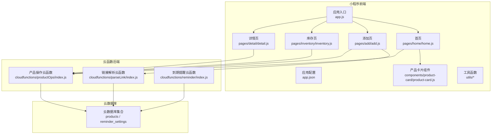
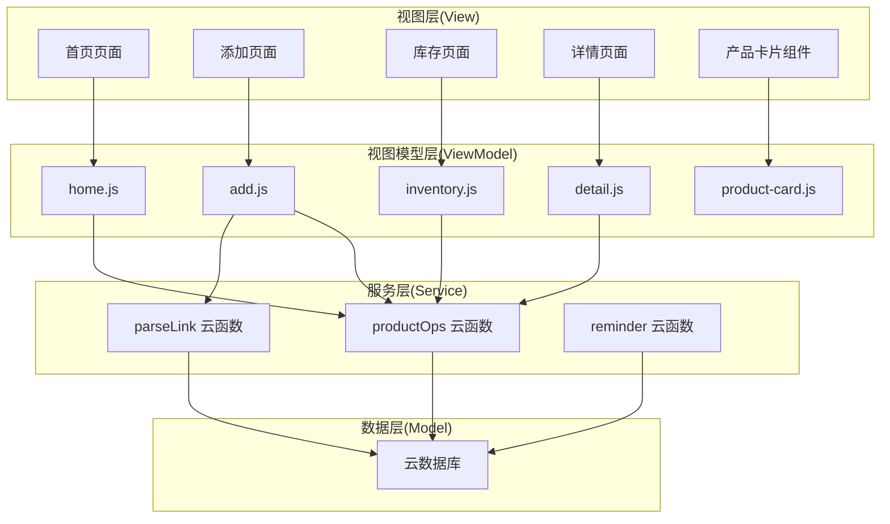
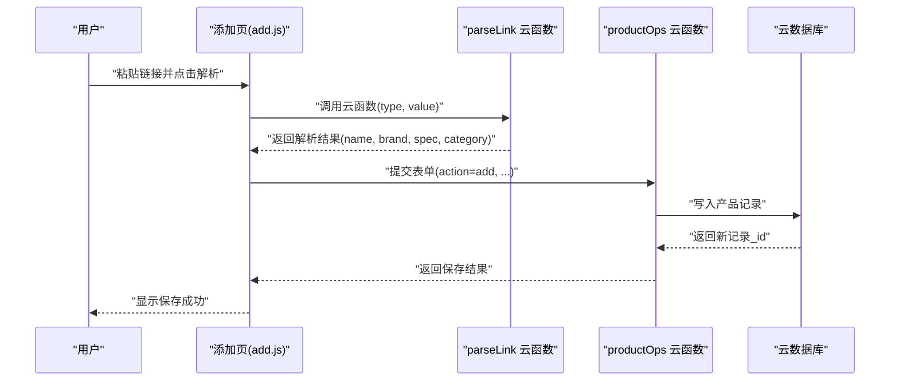
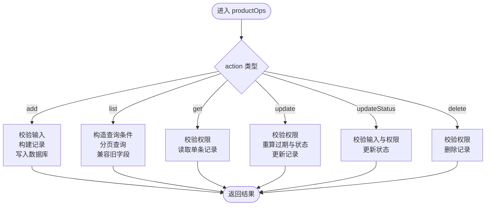
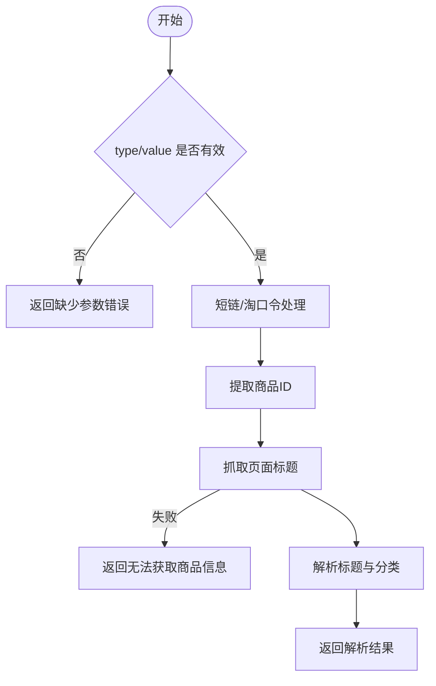
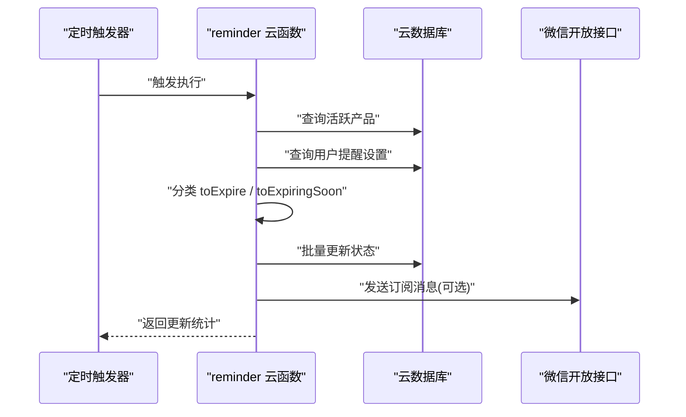
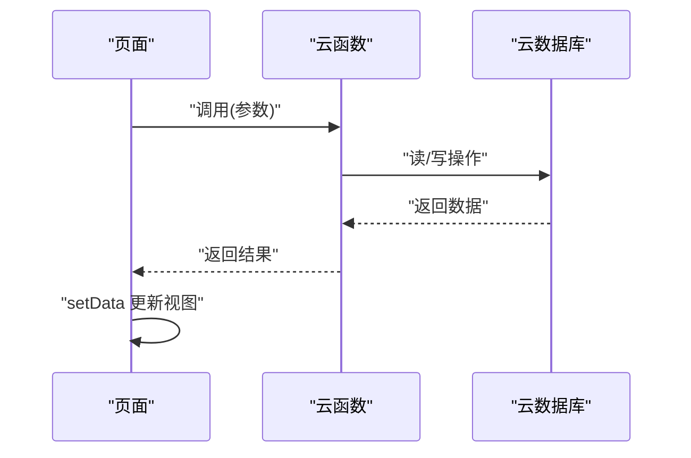
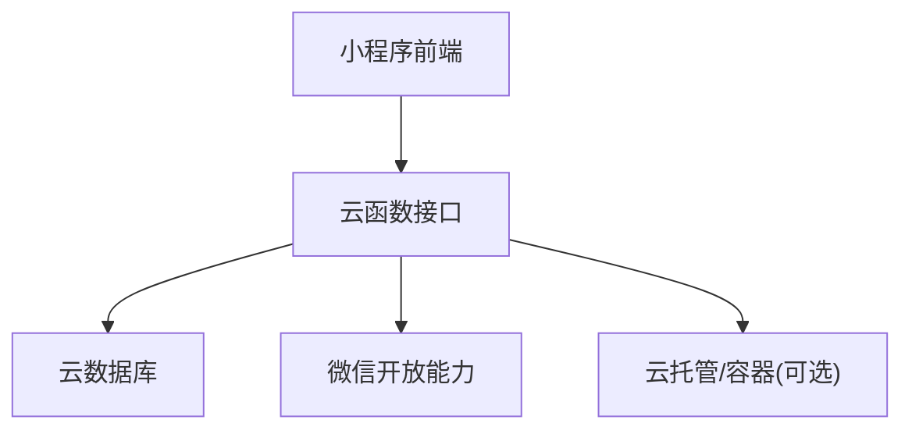
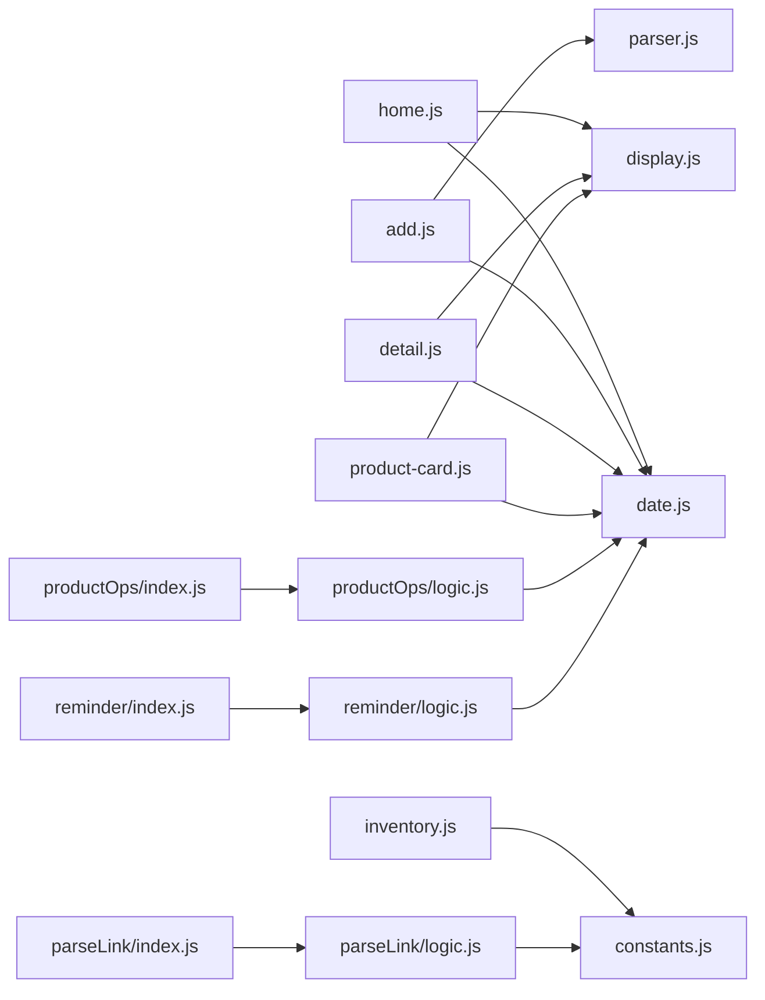

# 架构设计

<cite>
**本文引用的文件**
- [app.js](file://miniprogram/app.js)
- [app.json](file://miniprogram/app.json)
- [home.js](file://miniprogram/pages/home/home.js)
- [inventory.js](file://miniprogram/pages/inventory/inventory.js)
- [add.js](file://miniprogram/pages/add/add.js)
- [detail.js](file://miniprogram/pages/detail/detail.js)
- [product-card.js](file://miniprogram/components/product-card/product-card.js)
- [constants.js](file://miniprogram/utils/constants.js)
- [date.js](file://miniprogram/utils/date.js)
- [display.js](file://miniprogram/utils/display.js)
- [parser.js](file://miniprogram/utils/parser.js)
- [productOps/index.js](file://cloudfunctions/productOps/index.js)
- [productOps/logic.js](file://cloudfunctions/productOps/logic.js)
- [parseLink/index.js](file://cloudfunctions/parseLink/index.js)
- [parseLink/logic.js](file://cloudfunctions/parseLink/logic.js)
- [reminder/index.js](file://cloudfunctions/reminder/index.js)
- [reminder/logic.js](file://cloudfunctions/reminder/logic.js)
</cite>

## 目录
1. [引言](#引言)
2. [项目结构](#项目结构)
3. [核心组件](#核心组件)
4. [架构总览](#架构总览)
5. [详细组件分析](#详细组件分析)
6. [依赖分析](#依赖分析)
7. [性能考虑](#性能考虑)
8. [故障排查指南](#故障排查指南)
9. [结论](#结论)
10. [附录](#附录)

## 引言
本项目为“化妆品库存管理”微信小程序，采用前后端分离架构：小程序前端负责界面与交互，云函数后端负责业务逻辑与数据处理，云数据库提供数据持久化。系统遵循 MVVM 架构模式，页面作为视图模型（ViewModel）协调组件与工具函数，云函数作为服务层统一处理数据操作与定时任务。

## 项目结构
- 小程序前端位于 miniprogram 目录，包含页面、组件与工具函数。
- 云函数位于 cloudfunctions 目录，包含三个核心云函数：productOps（产品操作）、parseLink（链接解析）、reminder（到期提醒）。
- 设计与规范文档位于 design-system 目录，用于指导页面与交互设计。

**图表来源**
- [app.js:1-32](file://miniprogram/app.js#L1-L32)
- [app.json:1-52](file://miniprogram/app.json#L1-L52)
- [home.js:1-119](file://miniprogram/pages/home/home.js#L1-L119)
- [add.js:1-260](file://miniprogram/pages/add/add.js#L1-L260)
- [inventory.js:1-117](file://miniprogram/pages/inventory/inventory.js#L1-L117)
- [detail.js:1-122](file://miniprogram/pages/detail/detail.js#L1-L122)
- [product-card.js:1-51](file://miniprogram/components/product-card/product-card.js#L1-L51)
- [productOps/index.js:1-171](file://cloudfunctions/productOps/index.js#L1-L171)
- [parseLink/index.js:1-112](file://cloudfunctions/parseLink/index.js#L1-L112)
- [reminder/index.js:1-106](file://cloudfunctions/reminder/index.js#L1-L106)

**章节来源**
- [app.js:1-32](file://miniprogram/app.js#L1-L32)
- [app.json:1-52](file://miniprogram/app.json#L1-L52)

## 核心组件
- 小程序前端组件
  - 页面：首页、添加、库存、详情、分类等，负责用户交互与数据展示。
  - 组件：产品卡片组件，封装展示逻辑与点击跳转。
  - 工具函数：常量、日期计算、展示辅助、链接解析预处理。
- 云函数后端
  - productOps：统一的产品 CRUD 与查询接口，支持分页、关键字搜索、分类与状态过滤。
  - parseLink：解析淘宝/天猫链接，提取标题并推断品牌、规格与分类。
  - reminder：定时任务，批量更新产品状态并发送订阅消息。
- 云数据库
  - products：产品记录集合，包含基础信息、过期时间、状态等。
  - reminder_settings：用户提醒设置集合，记录提前提醒天数与推送开关。

**章节来源**
- [home.js:1-119](file://miniprogram/pages/home/home.js#L1-L119)
- [add.js:1-260](file://miniprogram/pages/add/add.js#L1-L260)
- [inventory.js:1-117](file://miniprogram/pages/inventory/inventory.js#L1-L117)
- [detail.js:1-122](file://miniprogram/pages/detail/detail.js#L1-L122)
- [product-card.js:1-51](file://miniprogram/components/product-card/product-card.js#L1-L51)
- [constants.js:1-100](file://miniprogram/utils/constants.js#L1-L100)
- [date.js:1-76](file://miniprogram/utils/date.js#L1-L76)
- [display.js:1-76](file://miniprogram/utils/display.js#L1-L76)
- [parser.js:1-70](file://miniprogram/utils/parser.js#L1-L70)
- [productOps/index.js:1-171](file://cloudfunctions/productOps/index.js#L1-L171)
- [parseLink/index.js:1-112](file://cloudfunctions/parseLink/index.js#L1-L112)
- [reminder/index.js:1-106](file://cloudfunctions/reminder/index.js#L1-L106)

## 架构总览
系统采用 MVVM 架构：
- Model：云数据库 products 与 reminder_settings。
- View：小程序页面与组件，负责渲染与事件绑定。
- ViewModel：页面 JS 文件，调用云函数获取/更新数据，驱动视图更新。
- 云函数：服务层，封装业务逻辑与数据库操作，提供统一接口。
- 工具函数：纯函数，跨页面与云函数共享，保证一致性与可测试性。

**图表来源**
- [home.js:1-119](file://miniprogram/pages/home/home.js#L1-L119)
- [add.js:1-260](file://miniprogram/pages/add/add.js#L1-L260)
- [inventory.js:1-117](file://miniprogram/pages/inventory/inventory.js#L1-L117)
- [detail.js:1-122](file://miniprogram/pages/detail/detail.js#L1-L122)
- [product-card.js:1-51](file://miniprogram/components/product-card/product-card.js#L1-L51)
- [productOps/index.js:1-171](file://cloudfunctions/productOps/index.js#L1-L171)
- [parseLink/index.js:1-112](file://cloudfunctions/parseLink/index.js#L1-L112)
- [reminder/index.js:1-106](file://cloudfunctions/reminder/index.js#L1-L106)

## 详细组件分析

### MVVM 在项目中的实现
- 页面作为 ViewModel：负责生命周期、事件处理、调用云函数、更新 data 驱动视图。
- 组件作为 View 的一部分：通过 properties 与 observers 计算展示状态，减少页面负担。
- 工具函数作为 Model 的一部分：提供日期计算、状态映射、链接解析等纯函数，确保跨模块一致性。

**图表来源**
- [add.js:55-108](file://miniprogram/pages/add/add.js#L55-L108)
- [parseLink/index.js:11-56](file://cloudfunctions/parseLink/index.js#L11-L56)
- [productOps/index.js:75-90](file://cloudfunctions/productOps/index.js#L75-L90)

**章节来源**
- [home.js:24-101](file://miniprogram/pages/home/home.js#L24-L101)
- [inventory.js:65-103](file://miniprogram/pages/inventory/inventory.js#L65-L103)
- [detail.js:30-69](file://miniprogram/pages/detail/detail.js#L30-L69)
- [product-card.js:19-33](file://miniprogram/components/product-card/product-card.js#L19-L33)

### 云函数架构设计

#### productOps：产品操作云函数
- 职责：统一的产品 CRUD 与查询接口，支持分页、关键字搜索、分类与状态过滤；根据用户设置动态计算状态。
- 关键流程：鉴权（OPENID）、输入校验、构建记录、查询兼容（ownerOpenid/_openid）、更新重算、删除校验。
- 数据流：接收 action 参数 → 分发到具体处理器 → 调用数据库 → 返回标准化结果。

**图表来源**
- [productOps/index.js:40-171](file://cloudfunctions/productOps/index.js#L40-L171)
- [productOps/logic.js:11-96](file://cloudfunctions/productOps/logic.js#L11-L96)

**章节来源**
- [productOps/index.js:40-171](file://cloudfunctions/productOps/index.js#L40-L171)
- [productOps/logic.js:1-105](file://cloudfunctions/productOps/logic.js#L1-L105)

#### parseLink：链接解析云函数
- 职责：解析淘宝/天猫链接，提取商品 ID，抓取页面标题，解析品牌、规格与分类。
- 降级策略：短链解析失败时返回错误；抓取标题失败时返回错误；淘口令解析当前降级为提示。
- 数据流：识别类型 → 解析短链/淘口令 → 提取商品 ID → 抓取标题 → 解析标题与分类 → 返回结构化信息。

**图表来源**
- [parseLink/index.js:11-56](file://cloudfunctions/parseLink/index.js#L11-L56)
- [parseLink/logic.js:13-71](file://cloudfunctions/parseLink/logic.js#L13-L71)

**章节来源**
- [parseLink/index.js:1-112](file://cloudfunctions/parseLink/index.js#L1-L112)
- [parseLink/logic.js:1-78](file://cloudfunctions/parseLink/logic.js#L1-L78)

#### reminder：到期提醒云函数
- 职责：定时触发，批量更新产品状态，向开启推送的用户发送订阅消息。
- 关键流程：查询活跃产品 → 合并用户设置 → 分类待更新产品 → 批量更新 → 发送订阅消息。
- 数据流：读取 products → 读取 reminder_settings → 分类 → 更新状态 → 发送消息 → 返回统计结果。

**图表来源**
- [reminder/index.js:15-105](file://cloudfunctions/reminder/index.js#L15-L105)
- [reminder/logic.js:17-40](file://cloudfunctions/reminder/logic.js#L17-L40)

**章节来源**
- [reminder/index.js:1-106](file://cloudfunctions/reminder/index.js#L1-L106)
- [reminder/logic.js:1-45](file://cloudfunctions/reminder/logic.js#L1-L45)

### 数据流向与状态管理策略
- 数据流向
  - 前端页面通过 wx.cloud.callFunction 调用云函数，云函数操作云数据库，返回标准化结果。
  - 首页与详情页基于 expirationDate 实时计算展示状态，避免存储冗余状态。
  - 库存页支持分页与筛选，通过 productOps.list 获取数据。
- 状态管理
  - 页面 data 存放 UI 状态与请求标志，组件通过 properties 与 observers 计算展示状态。
  - 云函数内部维护业务状态（如产品状态），并通过逻辑模块化实现可测试性。

**图表来源**
- [home.js:33-101](file://miniprogram/pages/home/home.js#L33-L101)
- [inventory.js:80-103](file://miniprogram/pages/inventory/inventory.js#L80-L103)
- [detail.js:32-69](file://miniprogram/pages/detail/detail.js#L32-L69)

**章节来源**
- [home.js:12-26](file://miniprogram/pages/home/home.js#L12-L26)
- [inventory.js:11-21](file://miniprogram/pages/inventory/inventory.js#L11-L21)
- [detail.js:10-19](file://miniprogram/pages/detail/detail.js#L10-L19)

### 系统边界与集成模式
- 系统边界
  - 前端边界：页面与组件，负责用户交互与展示。
  - 后端边界：云函数，暴露统一接口，处理业务与数据。
  - 数据边界：云数据库，提供数据持久化与查询能力。
- 集成模式
  - 前端通过云函数网关调用后端服务，后端通过数据库 SDK 访问云数据库。
  - 云函数之间解耦，通过数据库共享状态；定时任务独立运行，不影响请求路径。

**图表来源**
- [app.js:13-26](file://miniprogram/app.js#L13-L26)
- [parseLink/index.js:63-71](file://cloudfunctions/parseLink/index.js#L63-L71)
- [reminder/index.js:81-93](file://cloudfunctions/reminder/index.js#L81-L93)

**章节来源**
- [app.js:10-26](file://miniprogram/app.js#L10-L26)

## 依赖分析
- 页面依赖工具函数：日期计算、展示辅助、链接解析预处理。
- 云函数依赖逻辑模块：productOps 与 reminder 的纯函数逻辑便于测试与复用。
- 页面与云函数通过 wx.cloud.callFunction 解耦，降低耦合度。

**图表来源**
- [home.js:6-7](file://miniprogram/pages/home/home.js#L6-L7)
- [add.js:7-8](file://miniprogram/pages/add/add.js#L7-L8)
- [inventory.js:6](file://miniprogram/pages/inventory/inventory.js#L6)
- [detail.js:6-7](file://miniprogram/pages/detail/detail.js#L6-L7)
- [product-card.js:4-5](file://miniprogram/components/product-card/product-card.js#L4-L5)
- [productOps/index.js:13-19](file://cloudfunctions/productOps/index.js#L13-L19)
- [reminder/index.js:9](file://cloudfunctions/reminder/index.js#L9)
- [parseLink/index.js:7](file://cloudfunctions/parseLink/index.js#L7)

**章节来源**
- [date.js:1-76](file://miniprogram/utils/date.js#L1-L76)
- [display.js:1-76](file://miniprogram/utils/display.js#L1-L76)
- [parser.js:1-70](file://miniprogram/utils/parser.js#L1-L70)
- [constants.js:1-100](file://miniprogram/utils/constants.js#L1-L100)
- [productOps/logic.js:5](file://cloudfunctions/productOps/logic.js#L5)
- [reminder/logic.js:6](file://cloudfunctions/reminder/logic.js#L6)
- [parseLink/logic.js:6](file://cloudfunctions/parseLink/logic.js#L6)

## 性能考虑
- 分页与筛选：库存页使用分页加载与多条件筛选，减少一次性数据传输。
- 实时计算：前端基于过期日期实时计算展示状态，避免存储冗余状态，降低写入压力。
- 云函数幂等：productOps 对 ownerOpenid 与 _openid 兼容查询，提升迁移与兼容性。
- 定时任务批处理：reminder 批量更新状态，减少多次写入开销。
- 降级策略：parseLink 对短链与抓取失败提供明确降级提示，避免阻塞主流程。

[本节为通用建议，无需列出具体文件来源]

## 故障排查指南
- 云开发未配置
  - 现象：调用云函数报错，提示无权限或未配置。
  - 处理：在 app.js 中正确填写云环境 ID，在微信开发者工具中开通云开发并部署云函数。
- 链接解析失败
  - 现象：parseLink 返回“无法获取商品信息”或“短链解析失败”。
  - 处理：检查链接有效性与网络可达性，确认降级策略提示。
- 保存超时
  - 现象：保存产品时报超时。
  - 处理：检查云函数部署状态、数据库权限与网络连接，适当优化请求参数。
- 权限校验失败
  - 现象：productOps 返回“无权访问”。
  - 处理：确认记录归属与 OPENID 校验逻辑，确保仅操作本人数据。

**章节来源**
- [add.js:212-234](file://miniprogram/pages/add/add.js#L212-L234)
- [parseLink/index.js:22-31](file://cloudfunctions/parseLink/index.js#L22-L31)
- [productOps/index.js:117-120](file://cloudfunctions/productOps/index.js#L117-L120)

## 结论
本项目通过 MVVM 架构实现了清晰的前后端分离：页面作为 ViewModel 负责交互与数据驱动，组件封装展示逻辑，工具函数提供纯函数能力；云函数作为服务层统一处理业务与数据，具备良好的可测试性与扩展性。三个核心云函数分别承担产品管理、链接解析与到期提醒职责，配合云数据库与微信开放能力，形成完整的化妆品库存管理闭环。

[本节为总结性内容，无需列出具体文件来源]

## 附录
- 页面与组件清单
  - 页面：home、add、inventory、detail、profile、category。
  - 组件：product-card、status-badge、category-tag。
- 常用工具函数
  - 常量：PRODUCT_STATUS、PRESET_CATEGORIES、BRAND_LIST。
  - 日期：addMonths、calcExpirationDate、calcRemainingDays、getProductDisplayStatus、formatDate。
  - 展示：calcProgressPercent、formatRemainingText、getStatusLabel、getStatusColorClass。
  - 链接：identifyLinkType、extractUrl、parseInput。

**章节来源**
- [app.json:2-48](file://miniprogram/app.json#L2-L48)
- [constants.js:6-98](file://miniprogram/utils/constants.js#L6-L98)
- [date.js:10-75](file://miniprogram/utils/date.js#L10-L75)
- [display.js:13-75](file://miniprogram/utils/display.js#L13-L75)
- [parser.js:17-63](file://miniprogram/utils/parser.js#L17-L63)