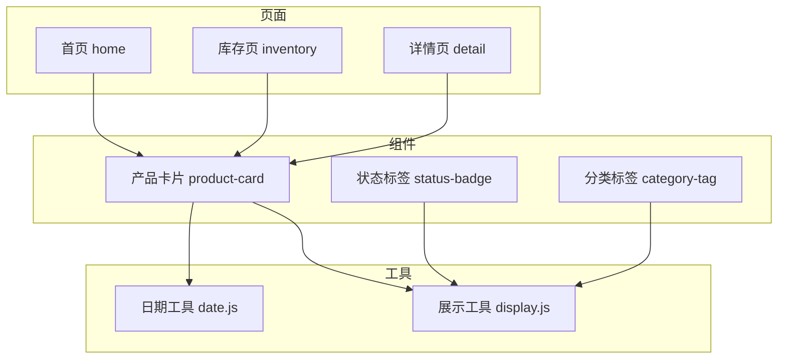
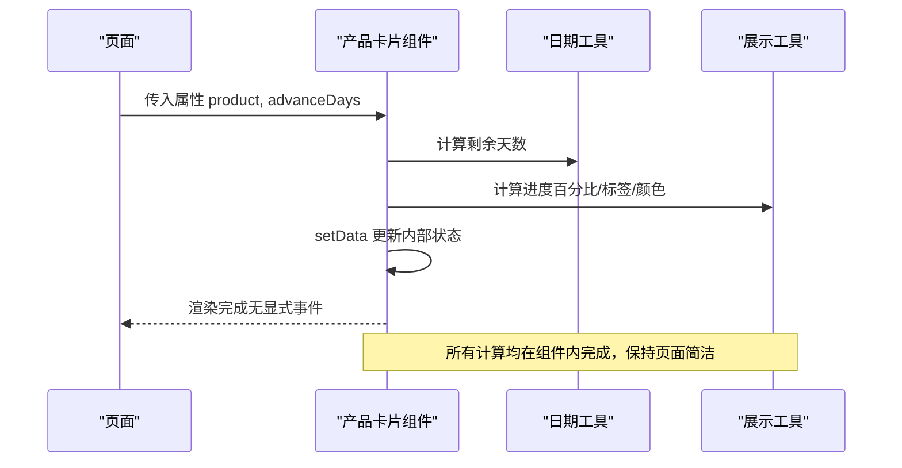
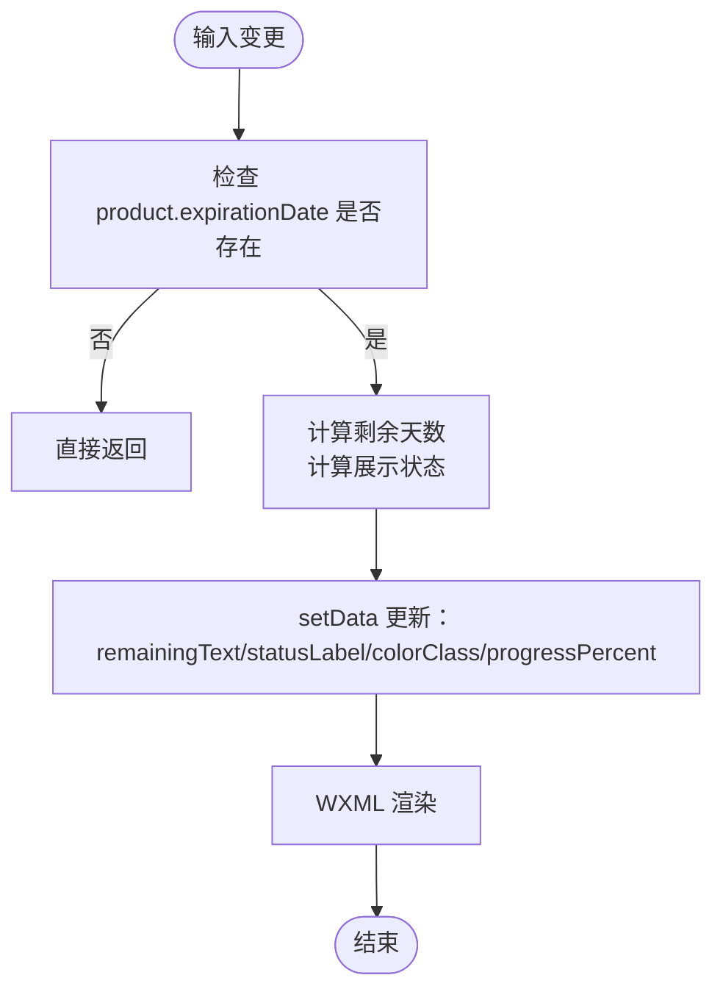
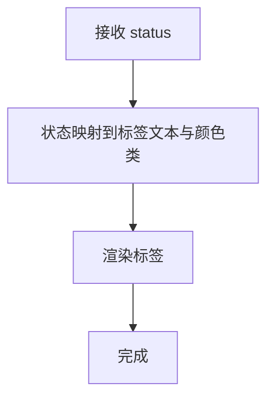
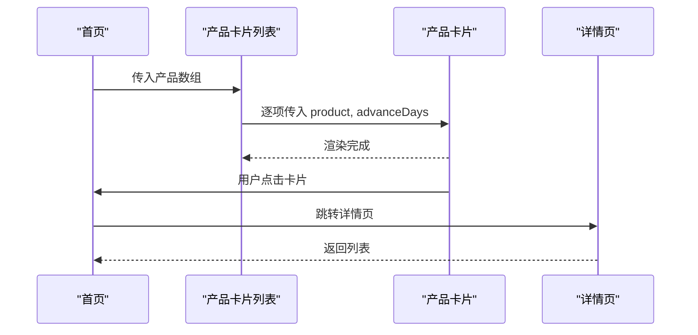
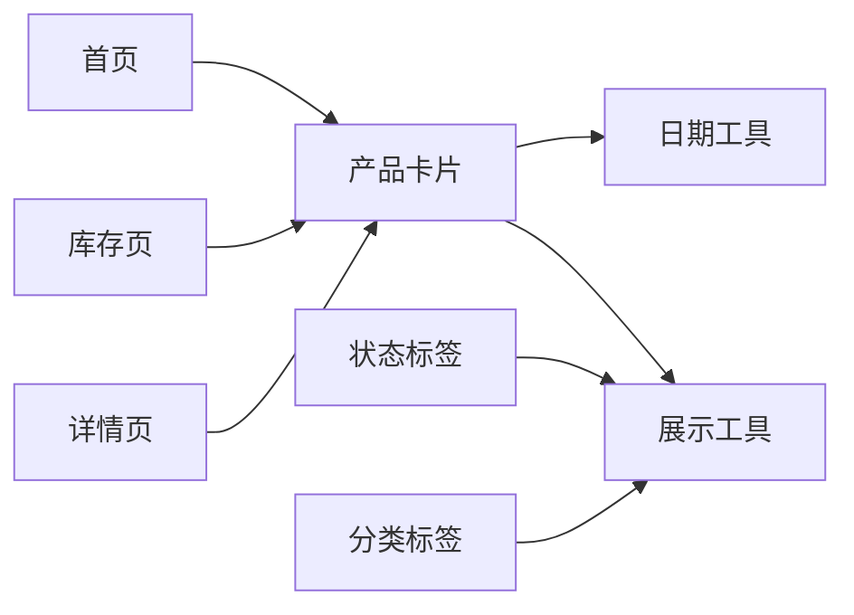

# 组件交互模式

<cite>
**本文引用的文件**
- [miniprogram/components/product-card/product-card.js](file://miniprogram/components/product-card/product-card.js)
- [miniprogram/components/product-card/product-card.json](file://miniprogram/components/product-card/product-card.json)
- [miniprogram/components/product-card/product-card.wxml](file://miniprogram/components/product-card/product-card.wxml)
- [miniprogram/utils/date.js](file://miniprogram/utils/date.js)
- [miniprogram/utils/display.js](file://miniprogram/utils/display.js)
- [miniprogram/pages/home/home.js](file://miniprogram/pages/home/home.js)
- [miniprogram/pages/home/home.wxml](file://miniprogram/pages/home/home.wxml)
- [miniprogram/pages/inventory/inventory.js](file://miniprogram/pages/inventory/inventory.js)
- [miniprogram/pages/inventory/inventory.wxml](file://miniprogram/pages/inventory/inventory.wxml)
- [miniprogram/pages/detail/detail.js](file://miniprogram/pages/detail/detail.js)
- [miniprogram/pages/detail/detail.wxml](file://miniprogram/pages/detail/detail.wxml)
</cite>

## 目录
1. [引言](#引言)
2. [项目结构](#项目结构)
3. [核心组件](#核心组件)
4. [架构总览](#架构总览)
5. [详细组件分析](#详细组件分析)
6. [依赖分析](#依赖分析)
7. [性能考虑](#性能考虑)
8. [故障排查指南](#故障排查指南)
9. [结论](#结论)
10. [附录](#附录)

## 引言
本文件聚焦于化妆品库存管理小程序中的可复用组件交互模式，重点覆盖以下内容：
- 可复用组件：产品卡片、状态标签、分类标签的设计与交互机制
- 组件间通信：属性传递、事件触发、状态共享
- 生命周期与数据更新策略：observer 驱动的数据流、局部状态管理
- 组件组合与嵌套：页面如何使用组件、组件如何组合展示
- 复用与扩展最佳实践：接口稳定、职责单一、可配置性
- 性能优化与调试技巧：避免重复计算、合理拆分与缓存
- 组件与页面逻辑协作：页面负责数据聚合，组件负责展示与轻量交互

## 项目结构
该小程序采用“页面 + 组件 + 工具函数”的分层组织方式。组件位于 miniprogram/components 下，页面位于 miniprogram/pages 下，通用逻辑封装在 miniprogram/utils 中。

图表来源
- [miniprogram/pages/home/home.wxml](file://miniprogram/pages/home/home.wxml)
- [miniprogram/pages/inventory/inventory.wxml](file://miniprogram/pages/inventory/inventory.wxml)
- [miniprogram/pages/detail/detail.wxml](file://miniprogram/pages/detail/detail.wxml)
- [miniprogram/components/product-card/product-card.wxml](file://miniprogram/components/product-card/product-card.wxml)
- [miniprogram/utils/date.js](file://miniprogram/utils/date.js)
- [miniprogram/utils/display.js](file://miniprogram/utils/display.js)

章节来源
- [miniprogram/components/product-card/product-card.json](file://miniprogram/components/product-card/product-card.json)
- [miniprogram/components/product-card/product-card.wxml](file://miniprogram/components/product-card/product-card.wxml)
- [miniprogram/utils/date.js](file://miniprogram/utils/date.js)
- [miniprogram/utils/display.js](file://miniprogram/utils/display.js)

## 核心组件
本节对可复用组件进行概览，明确其职责边界与交互入口。

- 产品卡片（product-card）
  - 职责：展示产品基础信息、状态标签、进度条与剩余天数；处理卡片点击跳转
  - 输入属性：product（对象）、advanceDays（数字）
  - 输出事件：无（内部导航）
  - 内部状态：remainingText、statusLabel、colorClass、progressPercent
  - 关键依赖：日期计算与展示格式化工具

- 状态标签（status-badge）
  - 职责：根据状态渲染带颜色的标签文本
  - 输入属性：status（枚举值），支持 in_use/expiring_soon/expired/used_up/discarded
  - 输出事件：无
  - 关键依赖：状态到标签文本与颜色类的映射

- 分类标签（category-tag）
  - 职责：展示分类与规格信息
  - 输入属性：category（字符串）、specification（字符串）
  - 输出事件：无
  - 关键依赖：展示格式化

章节来源
- [miniprogram/components/product-card/product-card.js](file://miniprogram/components/product-card/product-card.js)
- [miniprogram/components/product-card/product-card.wxml](file://miniprogram/components/product-card/product-card.wxml)
- [miniprogram/utils/display.js](file://miniprogram/utils/display.js)

## 架构总览
页面通过 WXML 引入组件，并向组件传入属性；组件内部基于 observer 计算展示状态，WXML 使用这些状态进行渲染。工具模块提供纯函数式的日期与展示逻辑，保证组件的可测试性与可复用性。

图表来源
- [miniprogram/components/product-card/product-card.js](file://miniprogram/components/product-card/product-card.js)
- [miniprogram/utils/date.js](file://miniprogram/utils/date.js)
- [miniprogram/utils/display.js](file://miniprogram/utils/display.js)

## 详细组件分析

### 产品卡片组件（product-card）
- 设计要点
  - 单一职责：仅负责展示与轻量交互（点击跳转）
  - 可配置：通过 advanceDays 控制“即将过期”的阈值
  - 数据自给：内部通过 observer 计算展示所需的所有状态
- 交互机制
  - 属性传递：product、advanceDays
  - 事件触发：卡片点击触发页面路由跳转
  - 状态共享：内部状态 remainingText、statusLabel、colorClass、progressPercent
- 生命周期与数据更新
  - 使用 observer 监听 product 与 advanceDays 的变化，触发重新计算
  - 在 setData 中一次性更新多个状态，减少多次渲染
- 组合与嵌套
  - 页面中以列表形式循环渲染多个产品卡片
  - 可与状态标签、分类标签组合使用，形成复合卡片

图表来源
- [miniprogram/components/product-card/product-card.js](file://miniprogram/components/product-card/product-card.js)

章节来源
- [miniprogram/components/product-card/product-card.js](file://miniprogram/components/product-card/product-card.js)
- [miniprogram/components/product-card/product-card.wxml](file://miniprogram/components/product-card/product-card.wxml)

### 状态标签组件（status-badge）
- 设计要点
  - 以状态枚举为输入，映射到中文标签与颜色类名
  - 无外部依赖，仅依赖展示工具的状态映射
- 交互机制
  - 属性传递：status
  - 事件触发：无
  - 状态共享：组件内部不维护额外状态
- 组合与嵌套
  - 可作为产品卡片右上角或列表项右侧的装饰元素
  - 也可独立使用在详情页等场景

图表来源
- [miniprogram/utils/display.js](file://miniprogram/utils/display.js)

章节来源
- [miniprogram/utils/display.js](file://miniprogram/utils/display.js)

### 分类标签组件（category-tag）
- 设计要点
  - 展示分类与规格，支持空规格安全显示
- 交互机制
  - 属性传递：category、specification
  - 事件触发：无
  - 状态共享：组件内部不维护额外状态
- 组合与嵌套
  - 常见于产品卡片顶部信息区，与名称、状态标签并列

章节来源
- [miniprogram/utils/display.js](file://miniprogram/utils/display.js)

### 页面与组件协作模式
- 首页（home）
  - 负责：拉取产品列表、传递给产品卡片、处理筛选/搜索
  - 组件：产品卡片（点击跳详情）、状态标签、分类标签
- 库存页（inventory）
  - 负责：按状态/分类聚合数据、传递给产品卡片
  - 组件：产品卡片（点击跳详情）、状态标签、分类标签
- 详情页（detail）
  - 负责：加载单个产品详情、渲染字段
  - 组件：状态标签、分类标签（用于详情展示）

图表来源
- [miniprogram/pages/home/home.js](file://miniprogram/pages/home/home.js)
- [miniprogram/pages/home/home.wxml](file://miniprogram/pages/home/home.wxml)
- [miniprogram/pages/inventory/inventory.js](file://miniprogram/pages/inventory/inventory.js)
- [miniprogram/pages/inventory/inventory.wxml](file://miniprogram/pages/inventory/inventory.wxml)
- [miniprogram/pages/detail/detail.js](file://miniprogram/pages/detail/detail.js)
- [miniprogram/pages/detail/detail.wxml](file://miniprogram/pages/detail/detail.wxml)
- [miniprogram/components/product-card/product-card.js](file://miniprogram/components/product-card/product-card.js)

## 依赖分析
- 组件对工具的依赖
  - 产品卡片依赖日期与展示工具，实现“剩余天数”“进度百分比”“状态标签/颜色”的统一计算
- 页面对组件的依赖
  - 页面通过 WXML 引入组件，传入属性，不直接操作组件内部状态
- 组件间耦合
  - 状态标签与分类标签与产品卡片解耦，可独立替换或复用
- 循环依赖
  - 无循环依赖，工具模块为纯函数集合

图表来源
- [miniprogram/utils/date.js](file://miniprogram/utils/date.js)
- [miniprogram/utils/display.js](file://miniprogram/utils/display.js)
- [miniprogram/components/product-card/product-card.js](file://miniprogram/components/product-card/product-card.js)

章节来源
- [miniprogram/utils/date.js](file://miniprogram/utils/date.js)
- [miniprogram/utils/display.js](file://miniprogram/utils/display.js)
- [miniprogram/components/product-card/product-card.js](file://miniprogram/components/product-card/product-card.js)

## 性能考虑
- 避免重复计算
  - 将“剩余天数”“进度百分比”等计算放入组件 observer，减少页面层重复计算
- 合理拆分与缓存
  - 将展示逻辑抽离为纯函数工具，便于缓存中间结果与单元测试
- 渲染优化
  - 使用 setData 一次性更新多个内部状态，降低重排次数
- 列表渲染
  - 页面端使用列表渲染时，确保 key 唯一，避免不必要的组件重建
- 事件绑定
  - 组件内事件尽量保持轻量，复杂交互上提到页面处理，组件只做“薄薄一层”

## 故障排查指南
- 产品卡片不更新
  - 检查传入的 product.expirationDate 是否存在
  - 检查 advanceDays 是否合理（影响“即将过期”判定）
- 标签颜色异常
  - 检查状态枚举是否在映射表中定义
- 进度条异常
  - 检查生产日期与过期日期格式是否正确
- 点击无响应
  - 检查产品 _id 是否存在，以及详情页路由是否存在

章节来源
- [miniprogram/components/product-card/product-card.js](file://miniprogram/components/product-card/product-card.js)
- [miniprogram/utils/date.js](file://miniprogram/utils/date.js)
- [miniprogram/utils/display.js](file://miniprogram/utils/display.js)

## 结论
本项目通过“页面负责数据、组件负责展示”的清晰分工，实现了高内聚低耦合的组件体系。产品卡片以 observer 驱动的内部状态管理，结合日期与展示工具，提供了稳定的展示能力；状态标签与分类标签作为原子组件，具备良好的可复用性与扩展性。建议在后续迭代中：
- 明确组件属性接口契约，增加类型校验与默认值
- 将更多展示规则下沉至工具模块，提升可测试性
- 在页面层引入轻量状态管理（如全局 store 或事件总线），统一处理跨页面交互

## 附录
- 最佳实践清单
  - 属性最小化：仅暴露必要属性，避免过度耦合
  - 纯函数优先：将可复用逻辑放入工具模块
  - 组件薄层：组件只做渲染与轻量交互，复杂逻辑上移
  - 可配置性：通过属性控制行为（如 advanceDays）
  - 可测试性：为工具函数编写单元测试，保障展示一致性