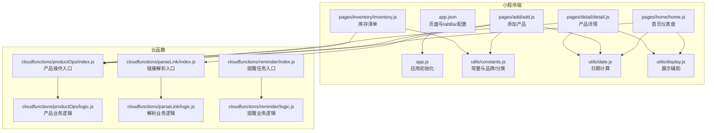
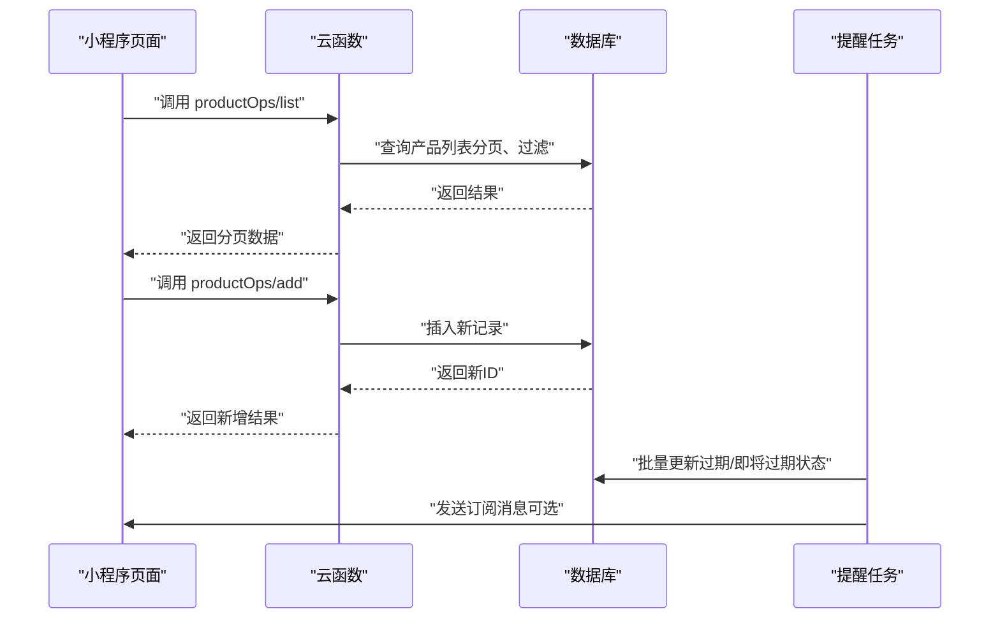
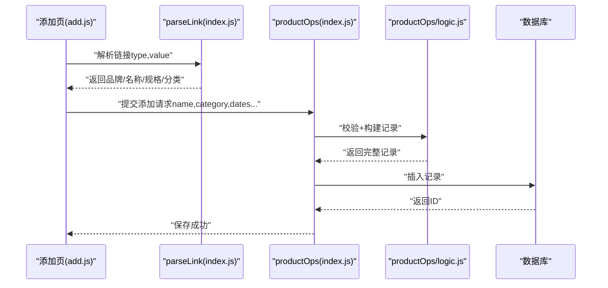
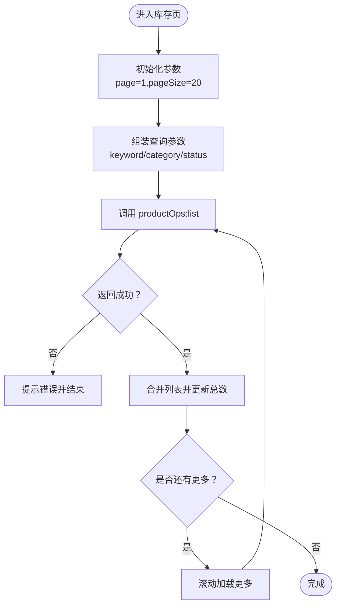
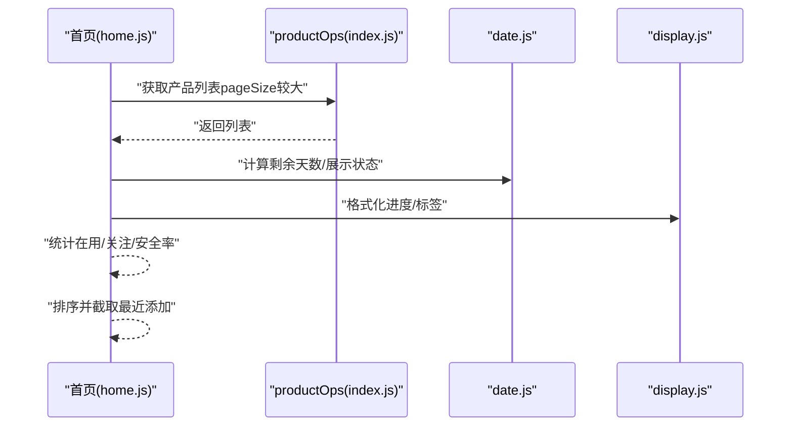
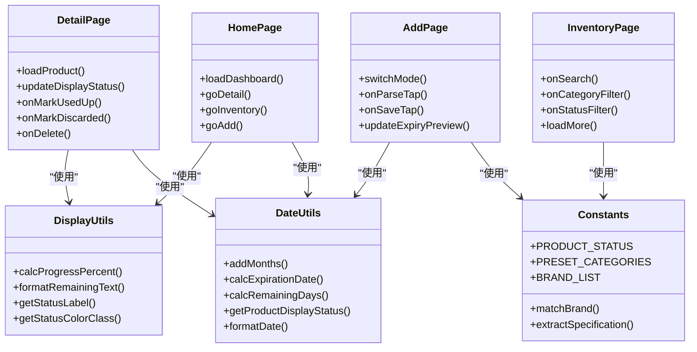
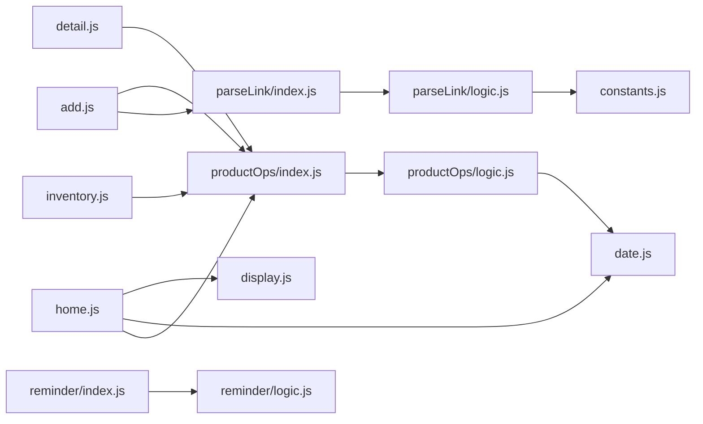

# 核心功能模块

<cite>
**本文引用的文件**
- [app.js](file://miniprogram/app.js)
- [app.json](file://miniprogram/app.json)
- [productOps/index.js](file://cloudfunctions/productOps/index.js)
- [productOps/logic.js](file://cloudfunctions/productOps/logic.js)
- [parseLink/index.js](file://cloudfunctions/parseLink/index.js)
- [parseLink/logic.js](file://cloudfunctions/parseLink/logic.js)
- [reminder/index.js](file://cloudfunctions/reminder/index.js)
- [reminder/logic.js](file://cloudfunctions/reminder/logic.js)
- [constants.js](file://miniprogram/utils/constants.js)
- [date.js](file://miniprogram/utils/date.js)
- [display.js](file://miniprogram/utils/display.js)
- [home.js](file://miniprogram/pages/home/home.js)
- [add.js](file://miniprogram/pages/add/add.js)
- [inventory.js](file://miniprogram/pages/inventory/inventory.js)
- [detail.js](file://miniprogram/pages/detail/detail.js)
</cite>

## 目录
1. [简介](#简介)
2. [项目结构](#项目结构)
3. [核心组件](#核心组件)
4. [架构总览](#架构总览)
5. [详细组件分析](#详细组件分析)
6. [依赖分析](#依赖分析)
7. [性能考虑](#性能考虑)
8. [故障排查指南](#故障排查指南)
9. [结论](#结论)
10. [附录](#附录)

## 简介
本项目是一个基于微信小程序与云开发的化妆品库存管理应用，围绕“产品管理、库存管理、仪表盘统计、用户界面”四大核心功能构建。系统通过云函数实现业务逻辑与数据持久化，前端页面负责用户交互与展示，配合定时任务实现过期状态的自动化维护与提醒。

## 项目结构
- 小程序端（miniprogram）：页面、组件、工具函数与全局配置
- 云函数（cloudfunctions）：产品操作、链接解析、提醒任务
- 设计稿与规范：design-system（用于页面原型与设计说明）

图表来源
- [app.js:1-32](file://miniprogram/app.js#L1-L32)
- [app.json:1-52](file://miniprogram/app.json#L1-L52)
- [productOps/index.js:1-171](file://cloudfunctions/productOps/index.js#L1-L171)
- [productOps/logic.js:1-105](file://cloudfunctions/productOps/logic.js#L1-L105)
- [parseLink/index.js:1-112](file://cloudfunctions/parseLink/index.js#L1-L112)
- [parseLink/logic.js:1-78](file://cloudfunctions/parseLink/logic.js#L1-L78)
- [reminder/index.js:1-106](file://cloudfunctions/reminder/index.js#L1-L106)
- [reminder/logic.js:1-45](file://cloudfunctions/reminder/logic.js#L1-L45)
- [constants.js:1-100](file://miniprogram/utils/constants.js#L1-L100)
- [date.js:1-76](file://miniprogram/utils/date.js#L1-L76)
- [display.js:1-76](file://miniprogram/utils/display.js#L1-L76)
- [home.js:1-119](file://miniprogram/pages/home/home.js#L1-L119)
- [add.js:1-260](file://miniprogram/pages/add/add.js#L1-L260)
- [inventory.js:1-117](file://miniprogram/pages/inventory/inventory.js#L1-L117)
- [detail.js:1-122](file://miniprogram/pages/detail/detail.js#L1-L122)

章节来源
- [app.js:1-32](file://miniprogram/app.js#L1-L32)
- [app.json:1-52](file://miniprogram/app.json#L1-L52)

## 核心组件
- 产品管理（添加、查询、更新、标记状态、删除）
- 库存管理（搜索、分类筛选、状态过滤、分页）
- 仪表盘统计（在用/关注数量、安全率、即将过期预警、最近添加）
- 用户界面（首页、添加、库存、详情、分类）

章节来源
- [productOps/index.js:40-171](file://cloudfunctions/productOps/index.js#L40-L171)
- [productOps/logic.js:11-104](file://cloudfunctions/productOps/logic.js#L11-L104)
- [home.js:24-119](file://miniprogram/pages/home/home.js#L24-L119)
- [add.js:50-260](file://miniprogram/pages/add/add.js#L50-L260)
- [inventory.js:65-117](file://miniprogram/pages/inventory/inventory.js#L65-L117)
- [detail.js:30-122](file://miniprogram/pages/detail/detail.js#L30-L122)

## 架构总览
系统采用“前端页面 + 云函数 + 数据库”的三层架构。前端通过 wx.cloud.callFunction 调用云函数；云函数负责业务逻辑与数据库操作；数据库存储产品与提醒设置；定时触发器定期更新产品状态并发送订阅消息。

图表来源
- [productOps/index.js:25-110](file://cloudfunctions/productOps/index.js#L25-L110)
- [reminder/index.js:15-105](file://cloudfunctions/reminder/index.js#L15-L105)

## 详细组件分析

### 产品管理（云函数与页面联动）
- 设计目标：提供产品全生命周期管理，包括添加、查询、更新、状态变更与删除；支持链接导入与手动录入；自动计算过期时间与状态。
- 用户场景：
  - 新增产品：扫码/复制链接或手动填写；支持预览过期时间；保存后回到首页或继续添加。
  - 查看/编辑：进入详情页查看状态、剩余天数、进度条等；可标记“用完/丢弃”，或删除。
  - 库存浏览：按关键词、分类、状态筛选，支持分页加载。
- 实现逻辑：
  - 云函数根据 action 分发到具体处理函数；对输入进行校验；构建产品记录或更新记录；必要时重算过期时间与状态。
  - 页面通过 wx.cloud.callFunction 调用云函数，处理成功/失败反馈与错误提示。
  - 链接解析云函数支持短链与淘口令（提示降级）、抓取页面标题、解析品牌/规格/分类。

图表来源
- [add.js:50-235](file://miniprogram/pages/add/add.js#L50-L235)
- [parseLink/index.js:11-56](file://cloudfunctions/parseLink/index.js#L11-L56)
- [productOps/index.js:75-90](file://cloudfunctions/productOps/index.js#L75-L90)
- [productOps/logic.js:45-71](file://cloudfunctions/productOps/logic.js#L45-L71)

章节来源
- [productOps/index.js:40-171](file://cloudfunctions/productOps/index.js#L40-L171)
- [productOps/logic.js:11-104](file://cloudfunctions/productOps/logic.js#L11-L104)
- [parseLink/index.js:11-112](file://cloudfunctions/parseLink/index.js#L11-L112)
- [parseLink/logic.js:13-77](file://cloudfunctions/parseLink/logic.js#L13-L77)
- [add.js:50-235](file://miniprogram/pages/add/add.js#L50-L235)

### 库存管理（搜索、筛选、分页）
- 设计目标：提供高效的产品检索与管理体验，支持关键词、分类、状态多维筛选与分页加载。
- 用户场景：在库存页输入关键词或选择分类/状态快速定位产品；滚动到底部加载更多。
- 实现逻辑：页面组装查询参数（分页、过滤条件），调用云函数获取列表；累计已有数据并更新“是否有更多”。

图表来源
- [inventory.js:65-117](file://miniprogram/pages/inventory/inventory.js#L65-L117)
- [productOps/index.js:92-110](file://cloudfunctions/productOps/index.js#L92-L110)

章节来源
- [inventory.js:10-117](file://miniprogram/pages/inventory/inventory.js#L10-L117)
- [productOps/index.js:25-38](file://cloudfunctions/productOps/index.js#L25-L38)

### 仪表盘统计（首页）
- 设计目标：直观展示在用/关注数量、安全率、即将过期预警与最近添加产品，帮助用户快速掌握库存健康状况。
- 用户场景：打开首页即看到统计数据与预警；点击进入详情或跳转库存/添加。
- 实现逻辑：调用云函数获取产品列表，过滤非终态（排除“用完/丢弃”），实时计算剩余天数与展示状态，排序并计算安全率；同时列出最近添加的若干产品。

图表来源
- [home.js:28-101](file://miniprogram/pages/home/home.js#L28-L101)
- [date.js:42-57](file://miniprogram/utils/date.js#L42-L57)
- [display.js:13-38](file://miniprogram/utils/display.js#L13-L38)

章节来源
- [home.js:11-119](file://miniprogram/pages/home/home.js#L11-L119)
- [date.js:13-57](file://miniprogram/utils/date.js#L13-L57)
- [display.js:13-76](file://miniprogram/utils/display.js#L13-L76)

### 用户界面（页面与组件）
- 页面职责：
  - 首页：统计卡片、预警列表、最近添加、跳转入口
  - 添加：双模式（链接导入/手动录入）、表单校验、过期时间预览、保存
  - 库存：搜索、筛选、分页、跳转添加
  - 详情：查看信息、标记状态、删除
- 组件与工具：
  - 常量与分类：预设分类、品牌词库、状态枚举
  - 日期工具：加月、过期计算、剩余天数、展示状态
  - 展示工具：进度百分比、剩余天数文本、状态颜色映射

图表来源
- [constants.js:6-99](file://miniprogram/utils/constants.js#L6-L99)
- [date.js:10-75](file://miniprogram/utils/date.js#L10-L75)
- [display.js:13-76](file://miniprogram/utils/display.js#L13-L76)
- [home.js:24-119](file://miniprogram/pages/home/home.js#L24-L119)
- [add.js:50-260](file://miniprogram/pages/add/add.js#L50-L260)
- [inventory.js:65-117](file://miniprogram/pages/inventory/inventory.js#L65-L117)
- [detail.js:30-122](file://miniprogram/pages/detail/detail.js#L30-L122)

章节来源
- [constants.js:1-100](file://miniprogram/utils/constants.js#L1-L100)
- [date.js:1-76](file://miniprogram/utils/date.js#L1-L76)
- [display.js:1-76](file://miniprogram/utils/display.js#L1-L76)
- [home.js:1-119](file://miniprogram/pages/home/home.js#L1-L119)
- [add.js:1-260](file://miniprogram/pages/add/add.js#L1-L260)
- [inventory.js:1-117](file://miniprogram/pages/inventory/inventory.js#L1-L117)
- [detail.js:1-122](file://miniprogram/pages/detail/detail.js#L1-L122)

## 依赖分析
- 前端页面依赖工具函数与云函数；云函数之间通过业务逻辑模块解耦；数据库通过集合“products”和“reminder_settings”承载数据。
- 关键依赖关系：
  - add.js 依赖 parseLink 与 productOps
  - inventory.js 与 detail.js 依赖 productOps
  - home.js 依赖 productOps 并结合 date/display 工具
  - reminder 任务依赖 date 工具与数据库

图表来源
- [add.js:50-235](file://miniprogram/pages/add/add.js#L50-L235)
- [inventory.js:65-117](file://miniprogram/pages/inventory/inventory.js#L65-L117)
- [detail.js:30-122](file://miniprogram/pages/detail/detail.js#L30-L122)
- [home.js:28-101](file://miniprogram/pages/home/home.js#L28-L101)
- [reminder/index.js:15-105](file://cloudfunctions/reminder/index.js#L15-L105)
- [productOps/index.js:40-171](file://cloudfunctions/productOps/index.js#L40-L171)
- [productOps/logic.js:11-104](file://cloudfunctions/productOps/logic.js#L11-L104)
- [parseLink/index.js:11-56](file://cloudfunctions/parseLink/index.js#L11-L56)
- [parseLink/logic.js:13-77](file://cloudfunctions/parseLink/logic.js#L13-L77)
- [date.js:13-57](file://miniprogram/utils/date.js#L13-L57)
- [display.js:13-76](file://miniprogram/utils/display.js#L13-L76)
- [constants.js:63-91](file://miniprogram/utils/constants.js#L63-L91)

章节来源
- [productOps/index.js:13-23](file://cloudfunctions/productOps/index.js#L13-L23)
- [reminder/index.js:15-105](file://cloudfunctions/reminder/index.js#L15-L105)

## 性能考虑
- 列表分页：库存页默认每页 20 条，避免一次性加载过多数据；首页使用较大页大小以便统计准确。
- 云端计算：首页与详情页的展示状态与进度在前端计算，减少数据库压力；但注意避免在高频刷新场景下重复大量计算。
- 云函数幂等性：产品状态更新与删除操作均包含权限校验与存在性校验，避免重复更新与越权访问。
- 网络与超时：页面对云函数超时与权限错误做了明确提示，建议在弱网环境下适当增加重试与缓存策略。

## 故障排查指南
- 云开发未配置/权限不足
  - 现象：添加页解析或保存时报错，提示无权限或云开发未配置
  - 处理：确认已在 app.js 中正确设置云环境 ID，并在微信开发者工具中开通云开发、部署云函数
- 链接解析失败
  - 现象：解析淘口令或短链失败，或无法抓取页面标题
  - 处理：使用标准商品链接；若为淘口令，按提示改用复制链接方式
- 保存超时
  - 现象：保存产品时提示超时
  - 处理：检查云函数部署状态、网络连通性与数据库权限
- 产品状态异常
  - 现象：产品状态未按预期更新
  - 处理：确认更新字段是否触发重算（生产日期/保质期/开封相关字段）；检查提醒设置中的提前提醒天数

章节来源
- [add.js:99-234](file://miniprogram/pages/add/add.js#L99-L234)
- [parseLink/index.js:14-56](file://cloudfunctions/parseLink/index.js#L14-L56)
- [productOps/index.js:123-139](file://cloudfunctions/productOps/index.js#L123-L139)

## 结论
本系统通过清晰的前后端分工与云函数封装，实现了化妆品库存管理的核心需求。产品管理与库存管理覆盖了日常使用的主要场景，仪表盘提供了直观的数据概览，提醒任务保障了过期状态的及时更新。建议在后续迭代中增强本地缓存与离线能力、优化大列表渲染性能，并完善订阅消息模板配置与用户引导。

## 附录
- 最佳实践
  - 添加产品时优先使用链接导入，减少手工录入误差
  - 合理设置提醒天数，平衡通知频率与实用性
  - 定期清理“用完/丢弃”产品，保持库存数据整洁
  - 在弱网环境下谨慎进行大批量操作，避免超时
- 注意事项
  - 云函数需部署成功且具备数据库读写权限
  - 过期时间计算受月末溢出修正影响，注意日期边界
  - 订阅消息需在微信公众平台配置模板并获得用户授权