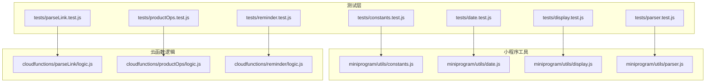
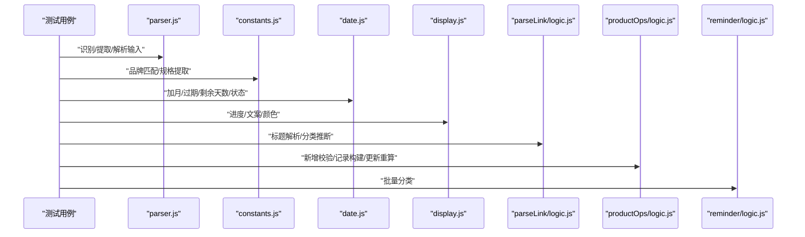
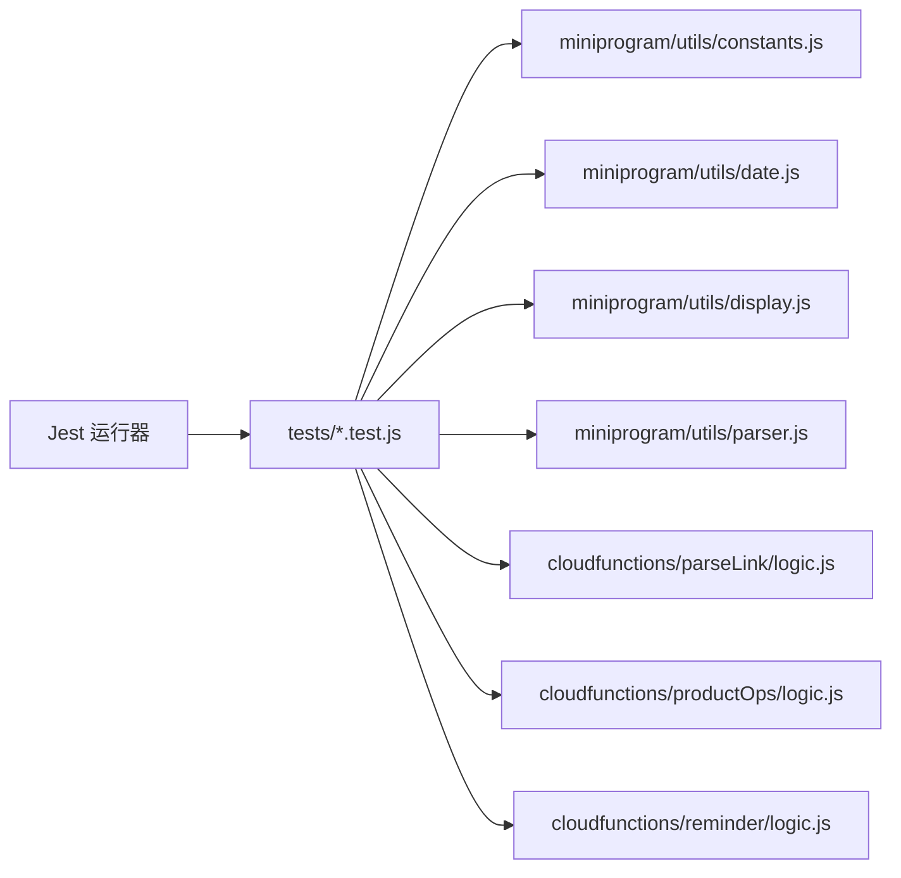

# 测试策略

<cite>
**本文引用的文件**
- [package.json](file://package.json)
- [tests/constants.test.js](file://tests/constants.test.js)
- [tests/date.test.js](file://tests/date.test.js)
- [tests/display.test.js](file://tests/display.test.js)
- [tests/parseLink.test.js](file://tests/parseLink.test.js)
- [tests/parser.test.js](file://tests/parser.test.js)
- [tests/productOps.test.js](file://tests/productOps.test.js)
- [tests/reminder.test.js](file://tests/reminder.test.js)
- [miniprogram/utils/constants.js](file://miniprogram/utils/constants.js)
- [miniprogram/utils/date.js](file://miniprogram/utils/date.js)
- [miniprogram/utils/display.js](file://miniprogram/utils/display.js)
- [miniprogram/utils/parser.js](file://miniprogram/utils/parser.js)
- [cloudfunctions/parseLink/logic.js](file://cloudfunctions/parseLink/logic.js)
- [cloudfunctions/productOps/logic.js](file://cloudfunctions/productOps/logic.js)
- [cloudfunctions/reminder/logic.js](file://cloudfunctions/reminder/logic.js)
</cite>

## 目录
1. [引言](#引言)
2. [项目结构](#项目结构)
3. [核心组件](#核心组件)
4. [架构总览](#架构总览)
5. [详细组件分析](#详细组件分析)
6. [依赖分析](#依赖分析)
7. [性能考虑](#性能考虑)
8. [故障排查指南](#故障排查指南)
9. [结论](#结论)
10. [附录](#附录)

## 引言
本测试策略文档面向微信小程序及云开发场景，系统性梳理单元测试、集成测试与端到端测试的实施策略。重点覆盖以下方面：
- 测试文件的覆盖范围与测试用例设计思路
- 断言逻辑与边界条件验证
- Jest 测试框架配置、测试环境与执行流程
- 工具函数、业务逻辑与云函数逻辑的测试实现方法
- 测试覆盖率统计、质量指标与持续集成配置建议
- 最佳实践、调试技巧与性能优化建议

## 项目结构
仓库采用“小程序前端 + 云函数 + 测试”分层组织，测试目录 tests 下按功能模块划分，分别对应 utils 与 cloudfunctions 的核心逻辑。

图表来源
- [tests/constants.test.js:1-107](file://tests/constants.test.js#L1-L107)
- [tests/date.test.js:1-130](file://tests/date.test.js#L1-L130)
- [tests/display.test.js:1-111](file://tests/display.test.js#L1-L111)
- [tests/parser.test.js:1-181](file://tests/parser.test.js#L1-L181)
- [tests/parseLink.test.js:1-111](file://tests/parseLink.test.js#L1-L111)
- [tests/productOps.test.js:1-202](file://tests/productOps.test.js#L1-L202)
- [tests/reminder.test.js:1-87](file://tests/reminder.test.js#L1-L87)
- [miniprogram/utils/constants.js:1-100](file://miniprogram/utils/constants.js#L1-L100)
- [miniprogram/utils/date.js:1-76](file://miniprogram/utils/date.js#L1-L76)
- [miniprogram/utils/display.js:1-76](file://miniprogram/utils/display.js#L1-L76)
- [miniprogram/utils/parser.js:1-70](file://miniprogram/utils/parser.js#L1-L70)
- [cloudfunctions/parseLink/logic.js:1-78](file://cloudfunctions/parseLink/logic.js#L1-L78)
- [cloudfunctions/productOps/logic.js:1-105](file://cloudfunctions/productOps/logic.js#L1-L105)
- [cloudfunctions/reminder/logic.js:1-45](file://cloudfunctions/reminder/logic.js#L1-L45)

章节来源
- [package.json:1-20](file://package.json#L1-L20)

## 核心组件
- 常量与解析工具：提供状态枚举、预设分类、品牌词库、品牌匹配、规格提取等能力，并被其他模块复用。
- 日期与展示工具：提供月份加法、过期日期计算、剩余天数、展示状态、进度百分比、文案格式化等。
- 链接解析工具：识别淘宝/天猫链接、短链、淘口令，提取 URL 或淘口令码。
- 云函数逻辑：parseLink（标题解析、分类推断）、productOps（新增/更新校验、记录构建、变更重算）、reminder（批量分类）。

章节来源
- [miniprogram/utils/constants.js:1-100](file://miniprogram/utils/constants.js#L1-L100)
- [miniprogram/utils/date.js:1-76](file://miniprogram/utils/date.js#L1-L76)
- [miniprogram/utils/display.js:1-76](file://miniprogram/utils/display.js#L1-L76)
- [miniprogram/utils/parser.js:1-70](file://miniprogram/utils/parser.js#L1-L70)
- [cloudfunctions/parseLink/logic.js:1-78](file://cloudfunctions/parseLink/logic.js#L1-L78)
- [cloudfunctions/productOps/logic.js:1-105](file://cloudfunctions/productOps/logic.js#L1-L105)
- [cloudfunctions/reminder/logic.js:1-45](file://cloudfunctions/reminder/logic.js#L1-L45)

## 架构总览
测试金字塔在本项目中的体现：
- 单元测试：针对纯函数与工具函数，覆盖边界、异常与典型路径。
- 集成测试：围绕云函数逻辑与工具函数组合调用，验证数据流与契约。
- 端到端测试：建议在小程序侧补充页面交互与云函数调用的端到端验证（当前仓库未包含 E2E 文件，可在 CI 中扩展）。

图表来源
- [tests/parser.test.js:1-181](file://tests/parser.test.js#L1-L181)
- [tests/constants.test.js:1-107](file://tests/constants.test.js#L1-L107)
- [tests/date.test.js:1-130](file://tests/date.test.js#L1-L130)
- [tests/display.test.js:1-111](file://tests/display.test.js#L1-L111)
- [tests/parseLink.test.js:1-111](file://tests/parseLink.test.js#L1-L111)
- [tests/productOps.test.js:1-202](file://tests/productOps.test.js#L1-L202)
- [tests/reminder.test.js:1-87](file://tests/reminder.test.js#L1-L87)
- [miniprogram/utils/parser.js:1-70](file://miniprogram/utils/parser.js#L1-L70)
- [miniprogram/utils/constants.js:1-100](file://miniprogram/utils/constants.js#L1-L100)
- [miniprogram/utils/date.js:1-76](file://miniprogram/utils/date.js#L1-L76)
- [miniprogram/utils/display.js:1-76](file://miniprogram/utils/display.js#L1-L76)
- [cloudfunctions/parseLink/logic.js:1-78](file://cloudfunctions/parseLink/logic.js#L1-L78)
- [cloudfunctions/productOps/logic.js:1-105](file://cloudfunctions/productOps/logic.js#L1-L105)
- [cloudfunctions/reminder/logic.js:1-45](file://cloudfunctions/reminder/logic.js#L1-L45)

## 详细组件分析

### 常量与解析工具测试（constants.js）
- 覆盖范围
  - 状态枚举完整性校验
  - 预设分类结构与排序字段校验
  - 品牌词库非空与代表性品牌存在性
  - 品牌匹配：英文大小写不敏感、中文品牌、最长匹配、无匹配返回空
  - 规格提取：ml/g/片/支/对单位、带空格与单位规范化、无匹配返回空
- 断言逻辑
  - 使用数组长度断言、属性存在性断言、值精确匹配与空值断言
  - 使用最长匹配策略与大小写不敏感策略的断言
- 测试用例设计
  - 典型输入 + 边界输入（空、null、undefined）
  - 多关键词场景下的品牌与规格提取
- 依赖关系
  - 作为 parseLink 与 parser 的上游依赖，被多个测试模块引用

章节来源
- [tests/constants.test.js:1-107](file://tests/constants.test.js#L1-L107)
- [miniprogram/utils/constants.js:1-100](file://miniprogram/utils/constants.js#L1-L100)

### 日期与展示工具测试（date.js 与 display.js）
- 覆盖范围
  - addMonths：月末溢出修正、闰年处理、跨年边界、大跨度月份
  - calcExpirationDate：未开封与开封两种有效期取最小值、空值分支
  - calcRemainingDays：未来/当天/已过期三种情况
  - getProductDisplayStatus：基于提前天数的状态判定
  - calcProgressPercent：进度百分比边界与截断
  - formatRemainingText：文案本地化与单复数
  - getStatusLabel/getStatusColorClass：状态映射与默认值
- 断言逻辑
  - 精确日期断言、区间断言、状态枚举断言、百分比近似断言
- 测试用例设计
  - 关键节点日期（月初/月末/闰年2月29日/跨年）
  - 边界值（提前天数等于剩余天数、0天、负数）

章节来源
- [tests/date.test.js:1-130](file://tests/date.test.js#L1-L130)
- [tests/display.test.js:1-111](file://tests/display.test.js#L1-L111)
- [miniprogram/utils/date.js:1-76](file://miniprogram/utils/date.js#L1-L76)
- [miniprogram/utils/display.js:1-76](file://miniprogram/utils/display.js#L1-L76)

### 链接解析工具测试（parser.js）
- 覆盖范围
  - identifyLinkType：标准淘宝/天猫链接、短链、淘口令（¥/￥）、嵌入文本、http/https、空与非法输入
  - extractUrl：URL抽取、短链抽取、淘口令码抽取、失败返回空
  - parseInput：统一入口返回类型与值
- 断言逻辑
  - 类型枚举断言、值存在性断言、正则匹配断言
- 测试用例设计
  - 多参数查询串、前后缀文本、混合分隔符

章节来源
- [tests/parser.test.js:1-181](file://tests/parser.test.js#L1-L181)
- [miniprogram/utils/parser.js:1-70](file://miniprogram/utils/parser.js#L1-L70)

### 云函数 parseLink 逻辑测试（logic.js）
- 覆盖范围
  - extractItemId：标准/多参/无 id/空/空值
  - parseProductTitle：品牌提取、规格提取、名称清洗、无匹配回退
  - inferCategory：关键词命中、多类别关键字、空/空值
- 断言逻辑
  - 结构化返回对象的字段存在性与值断言
- 测试用例设计
  - 中英文品牌、单位变体、关键词组合

章节来源
- [tests/parseLink.test.js:1-111](file://tests/parseLink.test.js#L1-L111)
- [cloudfunctions/parseLink/logic.js:1-78](file://cloudfunctions/parseLink/logic.js#L1-L78)

### 云函数 productOps 逻辑测试（logic.js）
- 覆盖范围
  - validateAddInput：必填项校验、保质期合法性
  - validateUpdateStatusInput：状态枚举校验
  - resolveStatus：默认提前天数、过期/即将过期/在用判定
  - buildProductRecord：过期日期计算、状态推导、可选字段默认值、时间戳
  - recalcOnUpdate：仅当相关字段变化时重算，否则跳过；始终更新时间戳
- 断言逻辑
  - 返回错误信息字符串与 null 的断言
  - 对象字段存在性与值断言
- 测试用例设计
  - 开封场景下的双重有效期取最小值、历史过期与未来过期对比

章节来源
- [tests/productOps.test.js:1-202](file://tests/productOps.test.js#L1-L202)
- [cloudfunctions/productOps/logic.js:1-105](file://cloudfunctions/productOps/logic.js#L1-L105)

### 云函数 reminder 逻辑测试（logic.js）
- 覆盖范围
  - classifyProducts：过期/即将过期分类、默认提前天数、用户设置覆盖、状态不变时不重复推送
- 断言逻辑
  - 结果数组为空与非空断言、对象字段断言
- 测试用例设计
  - 多用户不同提前天数、已处于 expiring_soon 的产品再次过期

章节来源
- [tests/reminder.test.js:1-87](file://tests/reminder.test.js#L1-L87)
- [cloudfunctions/reminder/logic.js:1-45](file://cloudfunctions/reminder/logic.js#L1-L45)

## 依赖分析
- 模块内聚与耦合
  - 工具函数均为纯函数，内聚高、耦合低，便于单元测试
  - 云函数逻辑依赖工具函数，测试时通过模块导入直接调用，无需真实云环境
- 直接与间接依赖
  - tests/* 依赖 miniprogram/utils/* 与 cloudfunctions/*/logic.js
  - 云函数逻辑依赖 date.js 与 parser.js 的部分工具
- 外部依赖
  - Jest 作为测试运行器，无其他外部测试框架依赖

图表来源
- [package.json:10-12](file://package.json#L10-L12)
- [tests/constants.test.js:1-107](file://tests/constants.test.js#L1-L107)
- [tests/date.test.js:1-130](file://tests/date.test.js#L1-L130)
- [tests/display.test.js:1-111](file://tests/display.test.js#L1-L111)
- [tests/parser.test.js:1-181](file://tests/parser.test.js#L1-L181)
- [tests/parseLink.test.js:1-111](file://tests/parseLink.test.js#L1-L111)
- [tests/productOps.test.js:1-202](file://tests/productOps.test.js#L1-L202)
- [tests/reminder.test.js:1-87](file://tests/reminder.test.js#L1-L87)
- [miniprogram/utils/constants.js:1-100](file://miniprogram/utils/constants.js#L1-L100)
- [miniprogram/utils/date.js:1-76](file://miniprogram/utils/date.js#L1-L76)
- [miniprogram/utils/display.js:1-76](file://miniprogram/utils/display.js#L1-L76)
- [miniprogram/utils/parser.js:1-70](file://miniprogram/utils/parser.js#L1-L70)
- [cloudfunctions/parseLink/logic.js:1-78](file://cloudfunctions/parseLink/logic.js#L1-L78)
- [cloudfunctions/productOps/logic.js:1-105](file://cloudfunctions/productOps/logic.js#L1-L105)
- [cloudfunctions/reminder/logic.js:1-45](file://cloudfunctions/reminder/logic.js#L1-L45)

## 性能考虑
- 单元测试性能
  - 纯函数测试避免 IO 与网络请求，执行快速
  - 合理使用固定时间点进行日期相关测试，减少随机性
- 集成测试性能
  - 云函数逻辑测试通过模块导入，避免真实云函数调用成本
  - 将复杂数据流拆分为多个小用例，提升定位效率
- 覆盖率与质量
  - 建议在 CI 中开启覆盖率统计，关注分支与语句覆盖率
  - 对边界条件与异常路径进行专项覆盖

## 故障排查指南
- 常见问题
  - 日期断言失败：检查测试中传入的日期字符串格式与本地时区差异
  - 品牌匹配失败：确认标题中品牌名大小写与词库一致，优先最长匹配
  - 规格提取异常：检查单位大小写与空格处理
- 调试技巧
  - 使用 Jest 的 --verbose 输出详细断言信息
  - 为关键用例添加注释说明期望值来源与边界条件
  - 对复杂逻辑使用小步断言，逐步缩小问题范围
- 修复建议
  - 对日期工具增加边界用例（闰年、月末、跨年）
  - 对链接解析增加更多边界与异常输入

章节来源
- [tests/date.test.js:1-130](file://tests/date.test.js#L1-L130)
- [tests/constants.test.js:1-107](file://tests/constants.test.js#L1-L107)
- [tests/parser.test.js:1-181](file://tests/parser.test.js#L1-L181)

## 结论
本项目的测试策略以单元测试为核心，配合少量集成测试，覆盖了工具函数与云函数的关键逻辑。通过明确的断言策略与边界用例设计，保证了核心业务的稳定性。建议在现有基础上：
- 在 CI 中启用覆盖率统计与质量阈值
- 补充端到端测试，覆盖小程序页面与云函数调用链路
- 增加对异常与边界场景的专项回归用例

## 附录

### Jest 配置与执行流程
- 配置
  - 使用 package.json 中的 test 脚本运行 Jest
  - 默认使用 Jest 的内置配置，无需额外配置文件
- 执行流程
  - Jest 自动发现 tests 目录下的 *.test.js
  - 并行执行测试用例，输出详细断言结果
- 建议
  - 在 CI 中加入覆盖率统计与报告上传
  - 为每个模块增加最小用例集合，确保关键路径被覆盖

章节来源
- [package.json:10-12](file://package.json#L10-L12)

### 测试用例设计与断言逻辑清单
- 常量与解析工具
  - 状态枚举完整性、分类结构与排序、品牌词库存在性、品牌匹配策略、规格提取规则
- 日期与展示工具
  - addMonths 月末溢出、calcExpirationDate 取最小值、calcRemainingDays 正负零、状态判定、进度百分比边界、文案格式化、状态标签与颜色映射
- 链接解析工具
  - 链接类型识别、URL/淘口令抽取、统一解析入口
- 云函数 parseLink
  - 商品 ID 提取、标题解析、分类推断
- 云函数 productOps
  - 新增输入校验、状态更新校验、状态推导、记录构建、更新重算
- 云函数 reminder
  - 批量分类、默认提前天数、用户设置覆盖

章节来源
- [tests/constants.test.js:1-107](file://tests/constants.test.js#L1-L107)
- [tests/date.test.js:1-130](file://tests/date.test.js#L1-L130)
- [tests/display.test.js:1-111](file://tests/display.test.js#L1-L111)
- [tests/parser.test.js:1-181](file://tests/parser.test.js#L1-L181)
- [tests/parseLink.test.js:1-111](file://tests/parseLink.test.js#L1-L111)
- [tests/productOps.test.js:1-202](file://tests/productOps.test.js#L1-L202)
- [tests/reminder.test.js:1-87](file://tests/reminder.test.js#L1-L87)