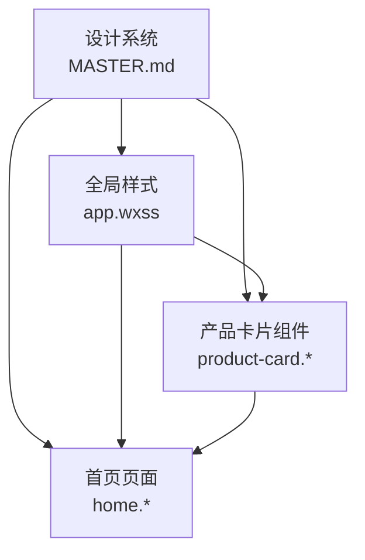
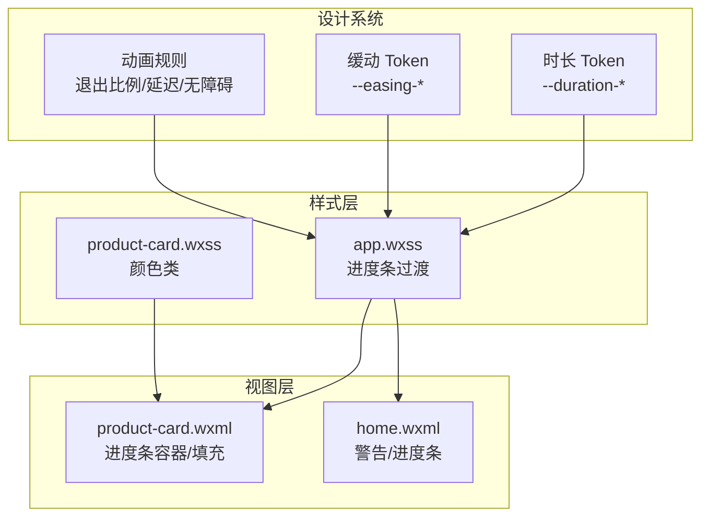
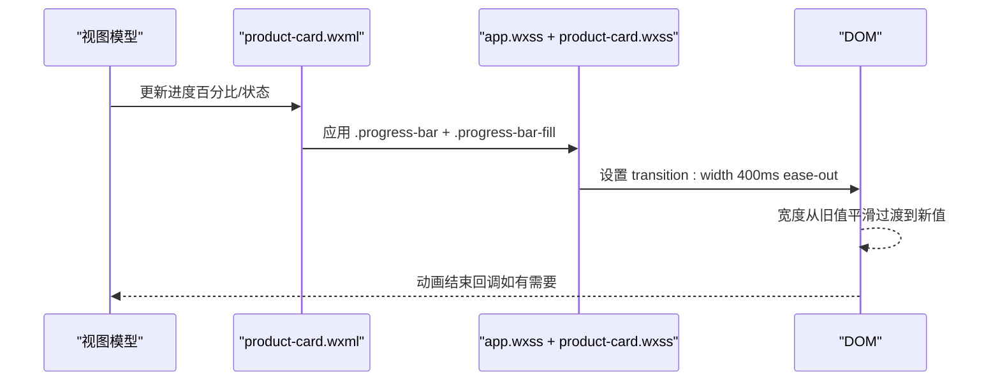
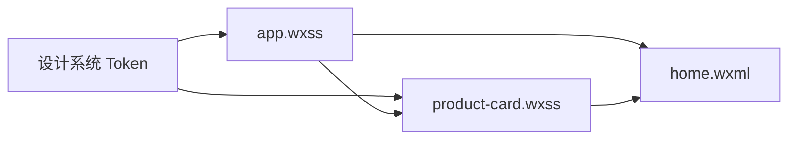

# 动画规范

<cite>
**本文引用的文件**
- [design-system/MASTER.md](file://design-system/MASTER.md)
- [.github/skills/ui-ux-pro-max/SKILL.md](file://.github/skills/ui-ux-pro-max/SKILL.md)
- [miniprogram/app.wxss](file://miniprogram/app.wxss)
- [miniprogram/components/product-card/product-card.wxml](file://miniprogram/components/product-card/product-card.wxml)
- [miniprogram/components/product-card/product-card.wxss](file://miniprogram/components/product-card/product-card.wxss)
- [miniprogram/pages/home/home.wxml](file://miniprogram/pages/home/home.wxml)
</cite>

## 目录
1. [引言](#引言)
2. [项目结构](#项目结构)
3. [核心组件](#核心组件)
4. [架构总览](#架构总览)
5. [详细组件分析](#详细组件分析)
6. [依赖分析](#依赖分析)
7. [性能考量](#性能考量)
8. [故障排查指南](#故障排查指南)
9. [结论](#结论)
10. [附录](#附录)

## 引言
本规范面向“动画时长”“缓动函数”“动画规则”“进度条动画实现”等主题，结合项目现有设计系统与实现，给出统一、可落地的交互设计标准。目标是确保动画具备一致性、可预期性和无障碍友好性。

## 项目结构
本项目采用“设计系统 + 小程序页面/组件”的组织方式：
- 设计系统集中定义全局 Token（含动画时长与缓动）、组件规范与示例。
- 小程序页面与组件通过样式与模板直接消费设计系统 Token，形成统一的动画表现。

图表来源
- [design-system/MASTER.md:125-141](file://design-system/MASTER.md#L125-L141)
- [miniprogram/app.wxss:176-200](file://miniprogram/app.wxss#L176-L200)
- [miniprogram/components/product-card/product-card.wxml:21-27](file://miniprogram/components/product-card/product-card.wxml#L21-L27)
- [miniprogram/pages/home/home.wxml:54-57](file://miniprogram/pages/home/home.wxml#L54-L57)

章节来源
- [design-system/MASTER.md:125-141](file://design-system/MASTER.md#L125-L141)
- [miniprogram/app.wxss:176-200](file://miniprogram/app.wxss#L176-L200)

## 核心组件
- 动画时长 Token
  - 快速 150ms：状态切换（开关、选中）
  - 正常 200ms：微交互（按钮反馈、标签切换）
  - 慢速 300ms：页面转场、模态弹出
  - 进度条 400ms：进度条动画
- 缓动函数 Token
  - 进入：ease-out
  - 退出：ease-in
  - 弹出层/成就弹窗：弹性缓动 cubic-bezier(0.34, 1.56, 0.64, 1)
- 动画规则
  - 退出动画时长为进入动画的 60–70%
  - 列表项入场逐项延迟 30–50ms
  - 尊重系统 prefers-reduced-motion 设置
  - 进度条使用颜色渐变 + 宽度动画

章节来源
- [design-system/MASTER.md:127-141](file://design-system/MASTER.md#L127-L141)
- [.github/skills/ui-ux-pro-max/SKILL.md:181-205](file://.github/skills/ui-ux-pro-max/SKILL.md#L181-L205)

## 架构总览
动画体系由“设计系统 Token + 样式层 + 视图层”三层构成：
- 设计系统定义时长与缓动 Token，并约束规则
- 样式层通过 CSS 变量与过渡属性消费 Token，形成统一动画
- 视图层在模板中绑定数据与事件，驱动状态变化，从而触发动画

图表来源
- [design-system/MASTER.md:127-141](file://design-system/MASTER.md#L127-L141)
- [miniprogram/app.wxss:176-200](file://miniprogram/app.wxss#L176-L200)
- [miniprogram/components/product-card/product-card.wxss:108-122](file://miniprogram/components/product-card/product-card.wxss#L108-L122)
- [miniprogram/components/product-card/product-card.wxml:21-27](file://miniprogram/components/product-card/product-card.wxml#L21-L27)
- [miniprogram/pages/home/home.wxml:54-57](file://miniprogram/pages/home/home.wxml#L54-L57)

## 详细组件分析

### 进度条动画实现
- 结构
  - 外层容器：.progress-bar（高度、圆角、背景）
  - 填充层：.progress-bar-fill（线性渐变 + 宽度过渡）
- 动画参数
  - 过渡时长：400ms
  - 缓动：ease-out
  - 渐变色：安全/警告/危险三种状态
- 数据绑定
  - 通过内联 style="width: {{...}}%" 实现进度更新
  - 通过 class="progress-{{status}}" 切换状态色带

图表来源
- [miniprogram/app.wxss:176-200](file://miniprogram/app.wxss#L176-L200)
- [miniprogram/components/product-card/product-card.wxml:21-27](file://miniprogram/components/product-card/product-card.wxml#L21-L27)
- [miniprogram/components/product-card/product-card.wxss:108-122](file://miniprogram/components/product-card/product-card.wxss#L108-L122)

章节来源
- [design-system/MASTER.md:151-159](file://design-system/MASTER.md#L151-L159)
- [miniprogram/app.wxss:176-200](file://miniprogram/app.wxss#L176-L200)
- [miniprogram/components/product-card/product-card.wxml:21-27](file://miniprogram/components/product-card/product-card.wxml#L21-L27)
- [miniprogram/pages/home/home.wxml:54-57](file://miniprogram/pages/home/home.wxml#L54-L57)

### 缓动函数与时长应用
- 进入动画：使用 ease-out，适合元素出现时的自然加速
- 退出动画：使用 ease-in，适合元素消失时的自然减速
- 弹出层/成就弹窗：使用弹性缓动 cubic-bezier(0.34, 1.56, 0.64, 1)，增强反馈的弹性感
- 时长对照
  - 状态切换：150ms
  - 微交互：200ms
  - 页面转场/模态：300ms
  - 进度条：400ms

章节来源
- [design-system/MASTER.md:129-135](file://design-system/MASTER.md#L129-L135)

### 列表项入场节奏控制
- 建议：列表项入场逐项延迟 30–50ms，避免“一次性全部出现”
- 适用场景：首页“即将过期”“最近添加”等列表区域
- 实施要点：在渲染循环中按序设置延时，保证视觉上的渐进感

章节来源
- [.github/skills/ui-ux-pro-max/SKILL.md:191-192](file://.github/skills/ui-ux-pro-max/SKILL.md#L191-L192)
- [miniprogram/pages/home/home.wxml:37-58](file://miniprogram/pages/home/home.wxml#L37-L58)

### 无障碍与系统偏好
- 尊重 prefers-reduced-motion：当用户启用“减少动态效果”时，应降低或移除动画
- 实施建议：通过媒体查询检测系统偏好，在样式层有条件地减少动画时长或禁用过渡

章节来源
- [design-system/MASTER.md:140](file://design-system/MASTER.md#L140)

## 依赖分析
- 设计系统 Token 是样式与视图层的共同契约
- app.wxss 作为全局样式，承载进度条动画的核心实现
- 组件与页面通过 class 与内联样式消费 Token，形成一致的动画体验

图表来源
- [design-system/MASTER.md:127-141](file://design-system/MASTER.md#L127-L141)
- [miniprogram/app.wxss:176-200](file://miniprogram/app.wxss#L176-L200)
- [miniprogram/components/product-card/product-card.wxss:108-122](file://miniprogram/components/product-card/product-card.wxss#L108-L122)
- [miniprogram/pages/home/home.wxml:54-57](file://miniprogram/pages/home/home.wxml#L54-L57)

## 性能考量
- 优先使用 transform/opacity 动画，避免改变布局属性（如 width、height、top/left）
- 控制同时动画的元素数量，建议每屏不超过 1–2 个关键元素
- 避免阻塞用户输入，动画必须可中断
- 对长耗时操作（>300ms）采用骨架屏/进度指示，而非长时间旋转动画

章节来源
- [.github/skills/ui-ux-pro-max/SKILL.md:182-183](file://.github/skills/ui-ux-pro-max/SKILL.md#L182-L183)
- [.github/skills/ui-ux-pro-max/SKILL.md:194-195](file://.github/skills/ui-ux-pro-max/SKILL.md#L194-L195)
- [.github/skills/ui-ux-pro-max/SKILL.md:204](file://.github/skills/ui-ux-pro-max/SKILL.md#L204)

## 故障排查指南
- 进度条不生效
  - 检查是否正确应用 .progress-bar 与 .progress-bar-fill 类
  - 检查内联 style 的 width 是否随数据更新
  - 检查 transition 是否被上层样式覆盖
- 进度条颜色异常
  - 检查状态类（progress-safe/warning/danger）是否与数据状态一致
  - 检查渐变色定义是否正确
- 动画不符合时长/缓动
  - 检查 app.wxss 中 transition 的时长与缓动是否符合设计系统 Token
  - 检查是否存在局部覆盖导致的差异

章节来源
- [miniprogram/app.wxss:176-200](file://miniprogram/app.wxss#L176-L200)
- [miniprogram/components/product-card/product-card.wxml:21-27](file://miniprogram/components/product-card/product-card.wxml#L21-L27)
- [miniprogram/components/product-card/product-card.wxss:108-122](file://miniprogram/components/product-card/product-card.wxss#L108-L122)

## 结论
本规范以设计系统 Token 为核心，将动画时长、缓动与规则标准化，并通过样式层与视图层的协同实现，确保进度条与界面交互具备一致、自然且无障碍的体验。建议在后续迭代中持续校验 Token 的落地与一致性，避免局部覆盖破坏整体节奏。

## 附录
- 使用场景与设计原则速查
  - 状态切换（150ms，ease-out）
  - 微交互（200ms，ease-out）
  - 页面转场/模态（300ms，ease-out）
  - 进度条（400ms，ease-out，宽度+渐变）
  - 退出动画 ≈ 进入动画 × 60–70%
  - 列表项入场逐项延迟 30–50ms
  - 尊重 prefers-reduced-motion

章节来源
- [design-system/MASTER.md:127-141](file://design-system/MASTER.md#L127-L141)
- [.github/skills/ui-ux-pro-max/SKILL.md:185-192](file://.github/skills/ui-ux-pro-max/SKILL.md#L185-L192)