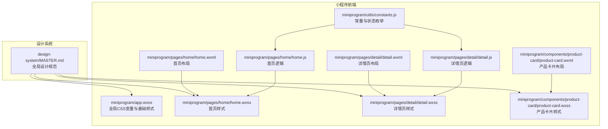
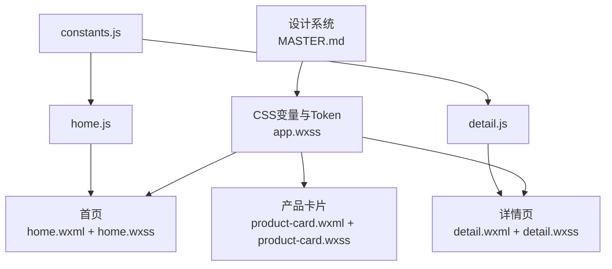
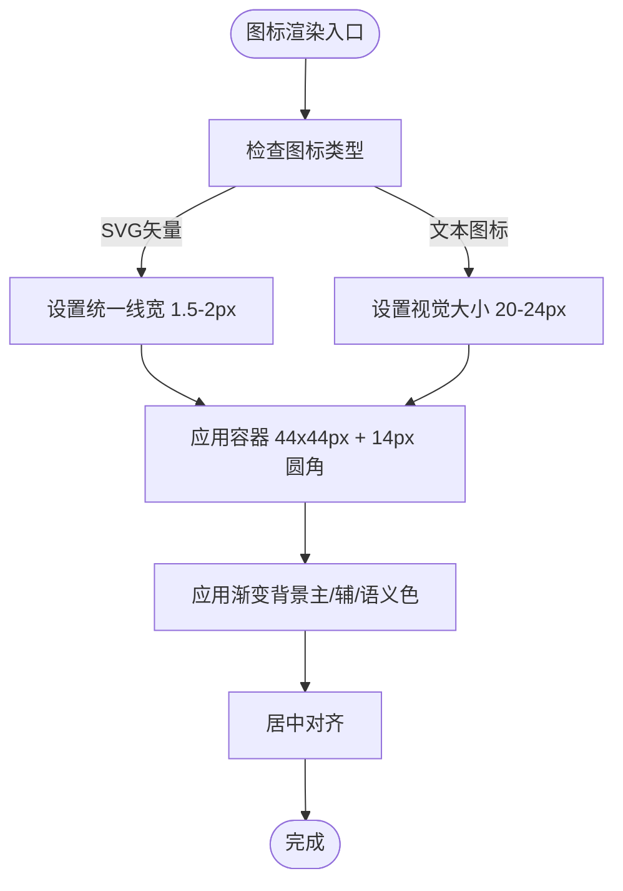
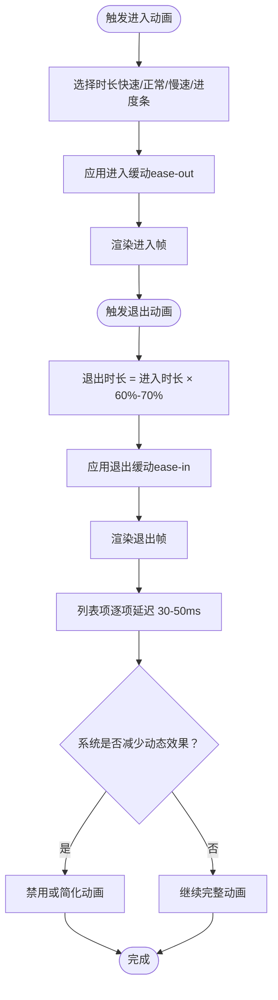
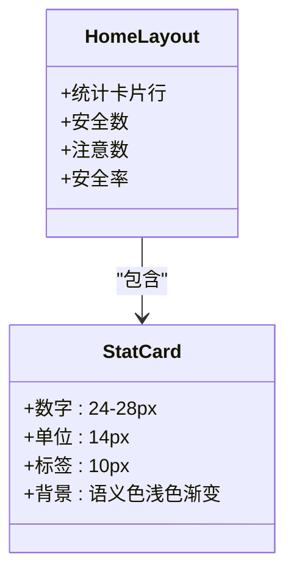
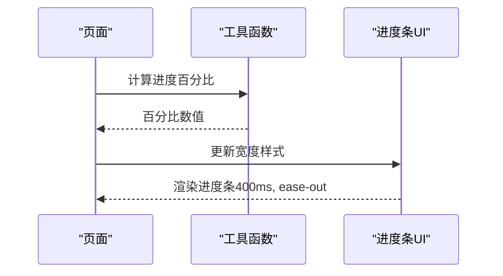
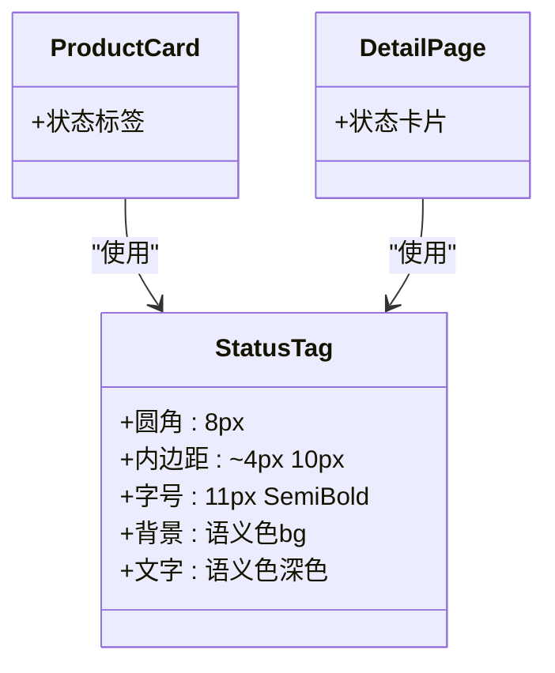
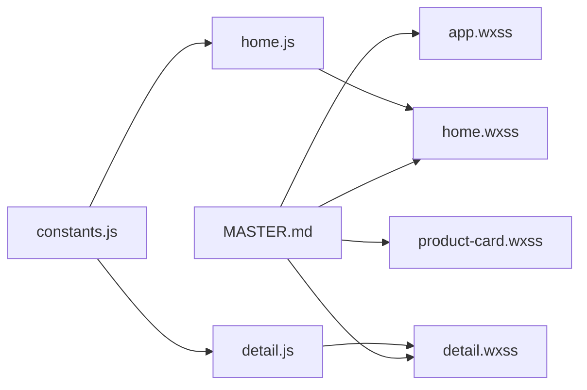

# 图标与动画规范

<cite>
**本文档引用的文件**
- [design-system/MASTER.md](file://design-system/MASTER.md)
- [miniprogram/app.wxss](file://miniprogram/app.wxss)
- [miniprogram/components/product-card/product-card.wxss](file://miniprogram/components/product-card/product-card.wxss)
- [miniprogram/pages/home/home.wxss](file://miniprogram/pages/home/home.wxss)
- [miniprogram/pages/detail/detail.wxss](file://miniprogram/pages/detail/detail.wxss)
- [miniprogram/components/product-card/product-card.wxml](file://miniprogram/components/product-card/product-card.wxml)
- [miniprogram/pages/home/home.wxml](file://miniprogram/pages/home/home.wxml)
- [miniprogram/pages/detail/detail.wxml](file://miniprogram/pages/detail/detail.wxml)
- [miniprogram/utils/constants.js](file://miniprogram/utils/constants.js)
- [miniprogram/pages/home/home.js](file://miniprogram/pages/home/home.js)
- [miniprogram/pages/detail/detail.js](file://miniprogram/pages/detail/detail.js)
</cite>

## 目录
1. [简介](#简介)
2. [项目结构](#项目结构)
3. [核心组件](#核心组件)
4. [架构总览](#架构总览)
5. [详细组件分析](#详细组件分析)
6. [依赖分析](#依赖分析)
7. [性能考虑](#性能考虑)
8. [故障排查指南](#故障排查指南)
9. [结论](#结论)

## 简介
本规范文档面向图标与动画设计与实现，结合设计系统与实际代码落地，明确以下要点：
- 图标规范：统一线宽、容器尺寸、视觉大小与渐变背景使用规则
- 动画规范：时长与缓动函数、退出动画比例、列表入场延迟、系统减少动态效果适配
- 游戏化元素：统计卡片、保质期进度条、状态标签的视觉表现与实现映射
- 通过可视化图表与路径引用，帮助设计师与开发者协同达成一致的视觉与交互体验

## 项目结构
本项目采用“设计系统 + 小程序页面/组件”的组织方式，设计系统集中定义全局Token与规范；小程序通过WXML/WXSS与JS实现具体页面与组件。

**图表来源**
- [design-system/MASTER.md:116-142](file://design-system/MASTER.md#L116-L142)
- [miniprogram/app.wxss:1-201](file://miniprogram/app.wxss#L1-L201)
- [miniprogram/pages/home/home.wxml:1-105](file://miniprogram/pages/home/home.wxml#L1-L105)
- [miniprogram/pages/home/home.wxss:1-324](file://miniprogram/pages/home/home.wxss#L1-L324)
- [miniprogram/pages/detail/detail.wxml:1-92](file://miniprogram/pages/detail/detail.wxml#L1-L92)
- [miniprogram/pages/detail/detail.wxss:1-269](file://miniprogram/pages/detail/detail.wxss#L1-L269)
- [miniprogram/components/product-card/product-card.wxml:1-29](file://miniprogram/components/product-card/product-card.wxml#L1-L29)
- [miniprogram/components/product-card/product-card.wxss:1-122](file://miniprogram/components/product-card/product-card.wxss#L1-L122)
- [miniprogram/utils/constants.js:1-100](file://miniprogram/utils/constants.js#L1-L100)
- [miniprogram/pages/home/home.js:1-119](file://miniprogram/pages/home/home.js#L1-L119)
- [miniprogram/pages/detail/detail.js:1-122](file://miniprogram/pages/detail/detail.js#L1-L122)

**章节来源**
- [design-system/MASTER.md:116-142](file://design-system/MASTER.md#L116-L142)
- [miniprogram/app.wxss:1-201](file://miniprogram/app.wxss#L1-L201)

## 核心组件
- 图标容器与渐变背景：统一44×44px容器、14px圆角、渐变背景，视觉图标大小20-24px，居中放置
- 状态标签：圆角8px，内边距约4px 10px，字号11px SemiBold，背景使用语义色的bg色，文字使用语义色深色变体
- 保质期进度条：高度6px，圆角3px，背景#E5E7EB，填充使用状态渐变（安全/即将过期/已过期）
- 统计卡片：大号数字（24-28px ExtraBold）+ 渐变底色 + 对应语义色浅色渐变背景
- 动画时长与缓动：快速150ms、正常200ms、慢速300ms、进度条400ms；进入ease-out、退出ease-in、弹窗弹性缓动

**章节来源**
- [design-system/MASTER.md:116-166](file://design-system/MASTER.md#L116-L166)
- [miniprogram/app.wxss:176-201](file://miniprogram/app.wxss#L176-L201)
- [miniprogram/components/product-card/product-card.wxss:72-99](file://miniprogram/components/product-card/product-card.wxss#L72-L99)
- [miniprogram/pages/home/home.wxss:80-118](file://miniprogram/pages/home/home.wxss#L80-L118)

## 架构总览
设计系统通过CSS变量与Token定义全局规范，页面与组件通过WXML/WXSS实现具体布局与样式，逻辑层通过JS进行数据处理与状态更新。

**图表来源**
- [design-system/MASTER.md:116-166](file://design-system/MASTER.md#L116-L166)
- [miniprogram/app.wxss:1-201](file://miniprogram/app.wxss#L1-L201)
- [miniprogram/pages/home/home.wxml:1-105](file://miniprogram/pages/home/home.wxml#L1-L105)
- [miniprogram/pages/home/home.wxss:1-324](file://miniprogram/pages/home/home.wxss#L1-L324)
- [miniprogram/pages/detail/detail.wxml:1-92](file://miniprogram/pages/detail/detail.wxml#L1-L92)
- [miniprogram/pages/detail/detail.wxss:1-269](file://miniprogram/pages/detail/detail.wxss#L1-L269)
- [miniprogram/components/product-card/product-card.wxml:1-29](file://miniprogram/components/product-card/product-card.wxml#L1-L29)
- [miniprogram/components/product-card/product-card.wxss:1-122](file://miniprogram/components/product-card/product-card.wxss#L1-L122)
- [miniprogram/pages/home/home.js:1-119](file://miniprogram/pages/home/home.js#L1-L119)
- [miniprogram/pages/detail/detail.js:1-122](file://miniprogram/pages/detail/detail.js#L1-L122)
- [miniprogram/utils/constants.js:1-100](file://miniprogram/utils/constants.js#L1-L100)

## 详细组件分析

### 图标规范
- 统一线宽：1.5-2px（适用于SVG矢量图标）
- 容器尺寸：44×44px，满足触摸目标最小尺寸
- 视觉大小：20-24px，居中放置
- 渐变背景：图标容器使用主色/辅色/语义色渐变背景
- 风格要求：Outline（线性），同一层级不混用Filled与Outline
- 禁止使用：Emoji作为功能性图标

实现映射：
- 容器尺寸与圆角：产品卡片图标容器使用44×44px与14px圆角
- 渐变背景：产品卡片图标根据状态使用安全/警告/危险/辅色渐变
- 文本图标占位：使用首字母文本作为占位，配合渐变背景

**图表来源**
- [design-system/MASTER.md:116-124](file://design-system/MASTER.md#L116-L124)
- [miniprogram/components/product-card/product-card.wxss:16-47](file://miniprogram/components/product-card/product-card.wxss#L16-L47)
- [miniprogram/pages/detail/detail.wxss:22-41](file://miniprogram/pages/detail/detail.wxss#L22-L41)

**章节来源**
- [design-system/MASTER.md:116-124](file://design-system/MASTER.md#L116-L124)
- [miniprogram/components/product-card/product-card.wxss:16-47](file://miniprogram/components/product-card/product-card.wxss#L16-L47)
- [miniprogram/pages/detail/detail.wxss:22-41](file://miniprogram/pages/detail/detail.wxss#L22-L41)

### 动画规范
- 时长与场景：
  - 快速150ms：状态切换（开关、选中）
  - 正常200ms：微交互（按钮反馈、标签切换）
  - 慢速300ms：页面转场、模态弹出
  - 进度条400ms：进度条动画
- 缓动函数：
  - 进入：ease-out
  - 退出：ease-in
  - 弹窗/成就：弹性缓动（cubic-bezier(0.34, 1.56, 0.64, 1)）
- 动画规则：
  - 退出动画时长为进入动画的60-70%
  - 列表项入场逐项延迟30-50ms
  - 尊重系统减少动态效果设置
  - 进度条使用颜色渐变 + 宽度动画

实现映射：
- 进度条动画：宽度过渡400ms，使用ease-out缓动
- 状态标签与卡片阴影：通过CSS变量统一时长与缓动

**图表来源**
- [design-system/MASTER.md:125-142](file://design-system/MASTER.md#L125-L142)
- [miniprogram/app.wxss:176-188](file://miniprogram/app.wxss#L176-L188)

**章节来源**
- [design-system/MASTER.md:125-142](file://design-system/MASTER.md#L125-L142)
- [miniprogram/app.wxss:176-188](file://miniprogram/app.wxss#L176-L188)

### 游戏化元素

#### 统计卡片
- 大号数字：24-28px，ExtraBold
- 渐变底色：使用对应语义色浅色渐变背景
- 搭配SVG图标：与数字形成强关联

实现映射：
- 首页统计卡片：安全数、注意数、安全率分别使用对应渐变背景
- 字号与行高：stat字号24px，ExtraBold，行高1.2

**图表来源**
- [miniprogram/pages/home/home.wxss:80-118](file://miniprogram/pages/home/home.wxss#L80-L118)
- [design-system/MASTER.md:145-149](file://design-system/MASTER.md#L145-L149)

**章节来源**
- [miniprogram/pages/home/home.wxss:80-118](file://miniprogram/pages/home/home.wxss#L80-L118)
- [design-system/MASTER.md:145-149](file://design-system/MASTER.md#L145-L149)

#### 保质期进度条
- 高度6px，圆角3px
- 背景色#E5E7EB
- 填充色渐变：安全（绿）、即将过期（黄）、已过期（红）
- 进度=已用时间/总保质期

实现映射：
- 产品卡片与详情页均使用进度条组件
- 填充色随状态变化，过渡时长400ms，缓动ease-out

**图表来源**
- [miniprogram/components/product-card/product-card.wxml:22-27](file://miniprogram/components/product-card/product-card.wxml#L22-L27)
- [miniprogram/pages/detail/detail.wxml:26-29](file://miniprogram/pages/detail/detail.wxml#L26-L29)
- [miniprogram/app.wxss:176-201](file://miniprogram/app.wxss#L176-L201)

**章节来源**
- [miniprogram/components/product-card/product-card.wxml:22-27](file://miniprogram/components/product-card/product-card.wxml#L22-L27)
- [miniprogram/pages/detail/detail.wxml:26-29](file://miniprogram/pages/detail/detail.wxml#L26-L29)
- [miniprogram/app.wxss:176-201](file://miniprogram/app.wxss#L176-L201)
- [design-system/MASTER.md:151-159](file://design-system/MASTER.md#L151-L159)

#### 状态标签
- 圆角8px，内边距约4px 10px
- 背景：语义色bg色
- 文字：语义色深色变体
- 字号11px，SemiBold

实现映射：
- 产品卡片状态标签：根据状态类名绑定背景与文字颜色
- 详情页状态卡片：根据状态类名绑定背景色

**图表来源**
- [miniprogram/components/product-card/product-card.wxss:72-99](file://miniprogram/components/product-card/product-card.wxss#L72-L99)
- [miniprogram/pages/detail/detail.wxss:78-90](file://miniprogram/pages/detail/detail.wxss#L78-L90)
- [design-system/MASTER.md:161-166](file://design-system/MASTER.md#L161-L166)

**章节来源**
- [miniprogram/components/product-card/product-card.wxss:72-99](file://miniprogram/components/product-card/product-card.wxss#L72-L99)
- [miniprogram/pages/detail/detail.wxss:78-90](file://miniprogram/pages/detail/detail.wxss#L78-L90)
- [design-system/MASTER.md:161-166](file://design-system/MASTER.md#L161-L166)

### 几何装饰语言
- 圆形：opacity 0.06-0.1，主色/辅色填充
- 矩形：6px圆角，微旋转15-30°，opacity 0.08-0.1
- 三角形：等边三角，opacity 0.06-0.08
- 放置位置：页面顶部/底部/角落，不遮挡内容
- 首页顶部：多色渐变背景（linear-gradient）

实现映射：
- 首页头部使用多色渐变背景与几何装饰元素

**章节来源**
- [design-system/MASTER.md:167-175](file://design-system/MASTER.md#L167-L175)
- [miniprogram/pages/home/home.wxss:11-71](file://miniprogram/pages/home/home.wxss#L11-L71)

## 依赖分析
- 设计系统依赖：所有页面与组件样式依赖全局CSS变量与Token
- 页面依赖：首页与详情页依赖产品状态计算与进度条逻辑
- 组件依赖：产品卡片依赖状态枚举与进度计算工具

**图表来源**
- [design-system/MASTER.md:116-166](file://design-system/MASTER.md#L116-L166)
- [miniprogram/app.wxss:1-201](file://miniprogram/app.wxss#L1-L201)
- [miniprogram/pages/home/home.js:1-119](file://miniprogram/pages/home/home.js#L1-L119)
- [miniprogram/pages/detail/detail.js:1-122](file://miniprogram/pages/detail/detail.js#L1-L122)
- [miniprogram/utils/constants.js:1-100](file://miniprogram/utils/constants.js#L1-L100)

**章节来源**
- [miniprogram/utils/constants.js:6-12](file://miniprogram/utils/constants.js#L6-L12)
- [miniprogram/pages/home/home.js:6-7](file://miniprogram/pages/home/home.js#L6-L7)
- [miniprogram/pages/detail/detail.js:6-7](file://miniprogram/pages/detail/detail.js#L6-L7)

## 性能考虑
- 使用transform/opacity进行动画，避免直接改变width/height/top/left导致的重排
- 控制每屏动画元素数量，建议不超过1-2个关键元素同时动画
- 进度条动画使用宽度过渡，时长400ms，确保流畅且不阻塞用户输入
- 列表项入场逐项延迟30-50ms，避免密集动画造成卡顿
- 尊重系统减少动态效果设置，必要时禁用或简化动画

[本节为通用指导，无需列出具体文件来源]

## 故障排查指南
- 图标未居中或尺寸异常
  - 检查图标容器是否为44×44px，圆角是否为14px
  - 确认视觉图标大小在20-24px范围内
  - 参考路径：[product-card.wxss:16-47](file://miniprogram/components/product-card/product-card.wxss#L16-L47)、[detail.wxss:22-41](file://miniprogram/pages/detail/detail.wxss#L22-L41)
- 渐变背景不生效
  - 确认容器背景使用线性渐变，颜色来自主色/辅色/语义色
  - 参考路径：[product-card.wxss:27-41](file://miniprogram/components/product-card/product-card.wxss#L27-L41)、[home.wxss:88-98](file://miniprogram/pages/home/home.wxss#L88-L98)
- 状态标签颜色不正确
  - 检查标签背景与文字颜色是否与语义色对应
  - 参考路径：[product-card.wxss:81-99](file://miniprogram/components/product-card/product-card.wxss#L81-L99)、[detail.wxss:87-90](file://miniprogram/pages/detail/detail.wxss#L87-L90)
- 进度条不显示或动画异常
  - 确认进度条高度为6px，圆角3px，背景#E5E7EB
  - 确认宽度过渡时长400ms，缓动ease-out
  - 参考路径：[app.wxss:176-201](file://miniprogram/app.wxss#L176-L201)、[product-card.wxml:22-27](file://miniprogram/components/product-card/product-card.wxml#L22-L27)、[detail.wxml:26-29](file://miniprogram/pages/detail/detail.wxml#L26-L29)
- 动画不符合规范
  - 检查进入/退出缓动与时长是否符合快速150ms、正常200ms、慢速300ms、进度条400ms
  - 退出时长应为进入时长的60-70%
  - 参考路径：[MASTER.md:125-142](file://design-system/MASTER.md#L125-L142)、[app.wxss:176-188](file://miniprogram/app.wxss#L176-L188)

**章节来源**
- [miniprogram/components/product-card/product-card.wxss:16-47](file://miniprogram/components/product-card/product-card.wxss#L16-L47)
- [miniprogram/pages/detail/detail.wxss:22-41](file://miniprogram/pages/detail/detail.wxss#L22-L41)
- [miniprogram/components/product-card/product-card.wxss:27-41](file://miniprogram/components/product-card/product-card.wxss#L27-L41)
- [miniprogram/pages/home/home.wxss:88-98](file://miniprogram/pages/home/home.wxss#L88-L98)
- [miniprogram/components/product-card/product-card.wxss:81-99](file://miniprogram/components/product-card/product-card.wxss#L81-L99)
- [miniprogram/pages/detail/detail.wxss:87-90](file://miniprogram/pages/detail/detail.wxss#L87-L90)
- [miniprogram/app.wxss:176-201](file://miniprogram/app.wxss#L176-L201)
- [miniprogram/components/product-card/product-card.wxml:22-27](file://miniprogram/components/product-card/product-card.wxml#L22-L27)
- [miniprogram/pages/detail/detail.wxml:26-29](file://miniprogram/pages/detail/detail.wxml#L26-L29)
- [design-system/MASTER.md:125-142](file://design-system/MASTER.md#L125-L142)
- [miniprogram/app.wxss:176-188](file://miniprogram/app.wxss#L176-L188)

## 结论
本规范以设计系统为纲，结合小程序页面与组件的实际实现，明确了图标与动画的统一标准，并提供了与代码实现的映射关系。通过CSS变量与Token的集中管理，确保了跨页面的一致性；通过进度条、状态标签与统计卡片等游戏化元素，提升了用户体验与可读性。建议在后续迭代中持续遵循本规范，确保设计与开发的协同一致性。