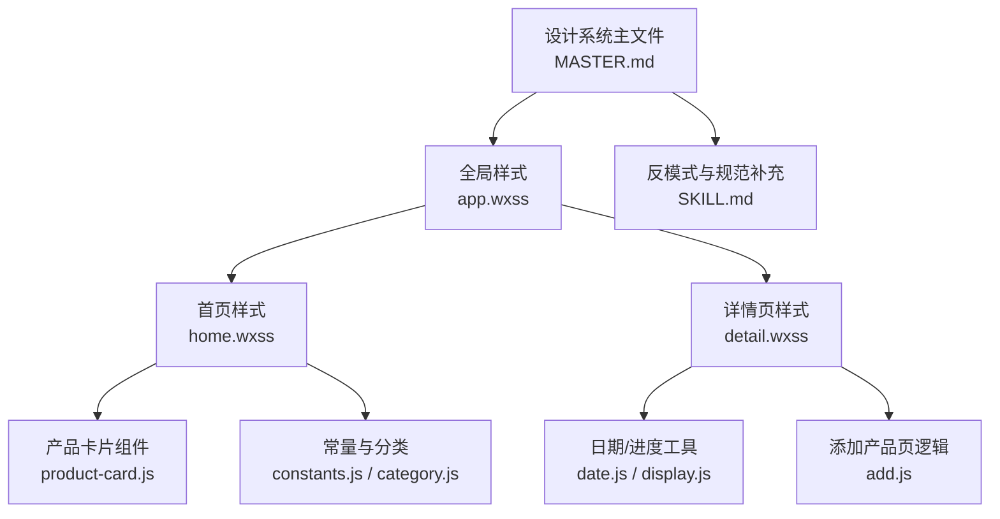
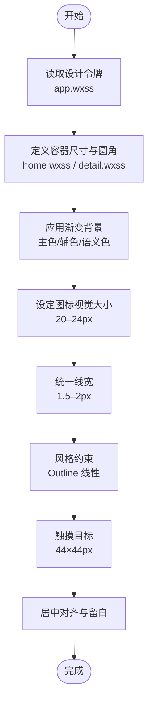
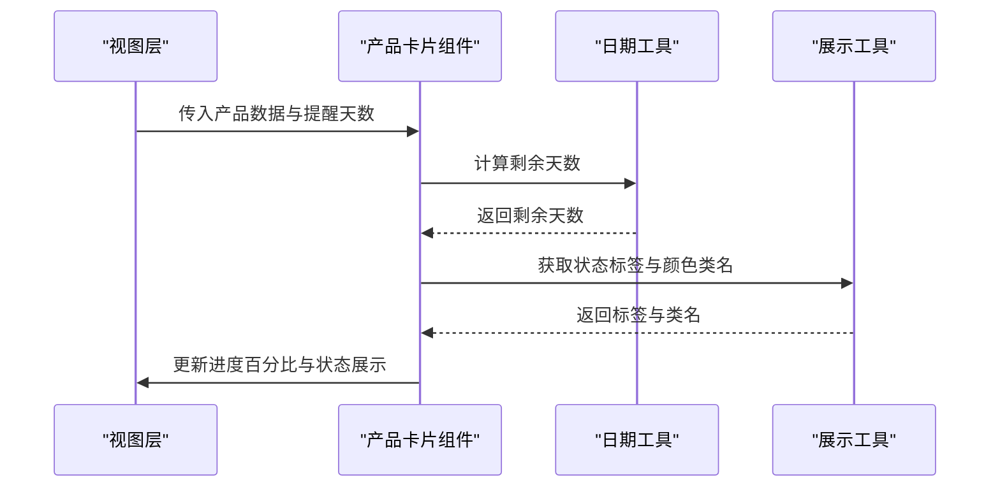
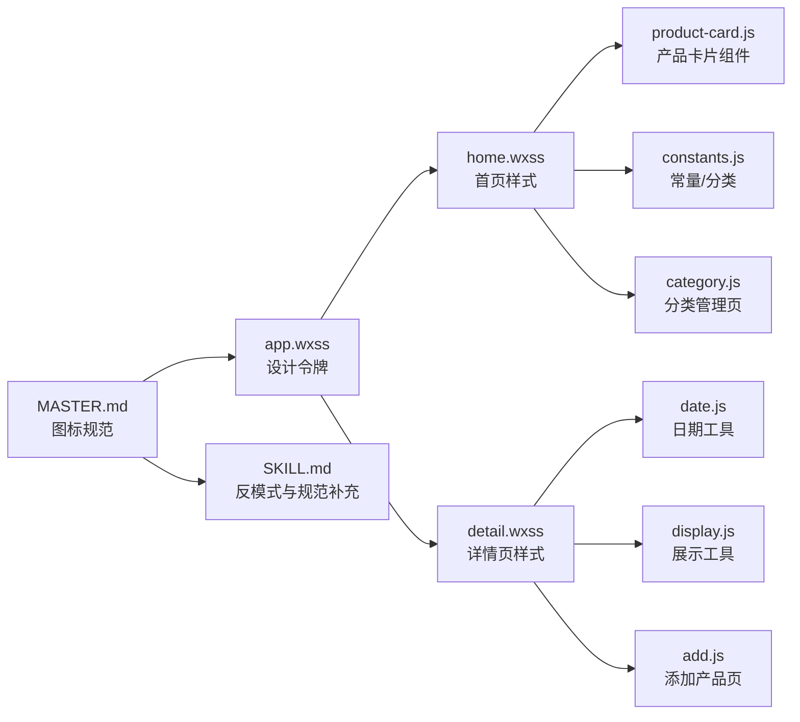

# 图标规范

<cite>
**本文引用的文件**
- [MASTER.md](file://design-system/MASTER.md)
- [app.wxss](file://miniprogram/app.wxss)
- [home.wxss](file://miniprogram/pages/home/home.wxss)
- [detail.wxss](file://miniprogram/pages/detail/detail.wxss)
- [product-card.js](file://miniprogram/components/product-card/product-card.js)
- [display.js](file://miniprogram/utils/display.js)
- [date.js](file://miniprogram/utils/date.js)
- [constants.js](file://miniprogram/utils/constants.js)
- [add.js](file://miniprogram/pages/add/add.js)
- [category.js](file://miniprogram/pages/category/category.js)
- [parser.js](file://miniprogram/utils/parser.js)
- [SKILL.md](file://.github/skills/ui-ux-pro-max/SKILL.md)
</cite>

## 目录
1. [简介](#简介)
2. [项目结构](#项目结构)
3. [核心组件](#核心组件)
4. [架构总览](#架构总览)
5. [详细组件分析](#详细组件分析)
6. [依赖分析](#依赖分析)
7. [性能考量](#性能考量)
8. [故障排查指南](#故障排查指南)
9. [结论](#结论)
10. [附录](#附录)

## 简介
本文件为“图标规范”的权威视觉设计标准文档，面向设计师与前端工程师，统一微信小程序中的 SVG 矢量图标技术规格与视觉呈现。内容涵盖：
- 统一线宽 1.5–2px 的技术要求
- 图标容器 44×44px 的触摸目标尺寸规范
- 图标视觉大小 20–24px 的居中对齐规则
- 图标容器渐变背景使用规范（主色/辅色/语义色）
- 图标风格要求（Outline 线性风格、层级内不混用 Filled/Outline）
- 禁止使用 Emoji 作为功能性图标的规则及原因
- 图标设计最佳实践与实现指导

## 项目结构
本规范以设计系统主文件为核心依据，结合全局样式与页面样式，形成从“设计令牌”到“实现落地”的完整链路。

图表来源
- [MASTER.md:116-124](file://design-system/MASTER.md#L116-L124)
- [app.wxss:1-201](file://miniprogram/app.wxss#L1-L201)
- [home.wxss:1-324](file://miniprogram/pages/home/home.wxss#L1-L324)
- [detail.wxss:1-269](file://miniprogram/pages/detail/detail.wxss#L1-L269)
- [product-card.js:1-51](file://miniprogram/components/product-card/product-card.js#L1-L51)
- [date.js:1-76](file://miniprogram/utils/date.js#L1-L76)
- [display.js:1-76](file://miniprogram/utils/display.js#L1-L76)
- [constants.js:1-100](file://miniprogram/utils/constants.js#L1-L100)
- [add.js:1-260](file://miniprogram/pages/add/add.js#L1-L260)
- [category.js:1-90](file://miniprogram/pages/category/category.js#L1-L90)
- [SKILL.md:566-577](file://.github/skills/ui-ux-pro-max/SKILL.md#L566-L577)

章节来源
- [MASTER.md:116-124](file://design-system/MASTER.md#L116-L124)
- [app.wxss:1-201](file://miniprogram/app.wxss#L1-L201)

## 核心组件
- 设计系统主文件：明确图标技术规格与风格约束
- 全局样式：提供设计令牌（CSS 变量）与通用工具类
- 页面样式：落地图标容器尺寸、渐变背景与对齐方式
- 业务组件与工具：驱动图标状态与进度展示的数据逻辑

章节来源
- [MASTER.md:116-124](file://design-system/MASTER.md#L116-L124)
- [app.wxss:1-201](file://miniprogram/app.wxss#L1-L201)
- [home.wxss:1-324](file://miniprogram/pages/home/home.wxss#L1-L324)
- [detail.wxss:1-269](file://miniprogram/pages/detail/detail.wxss#L1-L269)
- [product-card.js:1-51](file://miniprogram/components/product-card/product-card.js#L1-L51)
- [display.js:1-76](file://miniprogram/utils/display.js#L1-L76)
- [date.js:1-76](file://miniprogram/utils/date.js#L1-L76)

## 架构总览
图标规范从“设计令牌”到“页面实现”的流转如下：

图表来源
- [app.wxss:1-201](file://miniprogram/app.wxss#L1-L201)
- [home.wxss:1-324](file://miniprogram/pages/home/home.wxss#L1-L324)
- [detail.wxss:1-269](file://miniprogram/pages/detail/detail.wxss#L1-L269)
- [MASTER.md:116-124](file://design-system/MASTER.md#L116-L124)

## 详细组件分析

### 技术规格与实现要点
- 统一线宽：1.5–2px，确保同层级内笔画一致，避免视觉跳跃
- 容器尺寸：44×44px，满足移动端触摸目标最小尺寸
- 视觉大小：20–24px，保证清晰度与可读性；通过容器内居中布局实现
- 渐变背景：主色/辅色/语义色渐变，用于图标容器或状态卡片背景
- 风格约束：统一使用 Outline（线性）风格，同一层级不混用 Filled 与 Outline
- Emoji 禁用：禁止将 Emoji 作为功能性图标，跨平台不一致且不可控

章节来源
- [MASTER.md:116-124](file://design-system/MASTER.md#L116-L124)
- [SKILL.md:566-577](file://.github/skills/ui-ux-pro-max/SKILL.md#L566-L577)

### 图标容器与渐变背景
- 容器尺寸与圆角：通过 CSS 变量统一管理，确保视觉一致性
- 渐变背景：首页统计卡片与最近添加项均采用主色/辅色/语义色浅色渐变背景
- 状态卡片：根据状态选择不同语义色渐变，强化信息传达

章节来源
- [app.wxss:1-201](file://miniprogram/app.wxss#L1-L201)
- [home.wxss:72-118](file://miniprogram/pages/home/home.wxss#L72-L118)
- [home.wxss:215-230](file://miniprogram/pages/home/home.wxss#L215-L230)
- [detail.wxss:22-41](file://miniprogram/pages/detail/detail.wxss#L22-L41)

### 图标风格与层级约束
- 风格统一：使用 Outline 线性风格，保持简洁与一致性
- 层级约束：同一层级不混用 Filled 与 Outline，避免视觉混乱
- 反模式规避：设计系统明确列出“同时混用 Filled 和 Outline 图标”为反模式

章节来源
- [MASTER.md:116-124](file://design-system/MASTER.md#L116-L124)
- [MASTER.md:177-189](file://design-system/MASTER.md#L177-L189)
- [SKILL.md:573-574](file://.github/skills/ui-ux-pro-max/SKILL.md#L573-L574)

### Emoji 禁用规则与原因
- 禁止将 Emoji 作为功能性图标使用
- 原因：跨平台字体差异导致渲染不一致，无法通过设计令牌统一控制样式

章节来源
- [MASTER.md:116-124](file://design-system/MASTER.md#L116-L124)
- [MASTER.md:177-184](file://design-system/MASTER.md#L177-L184)
- [SKILL.md:566-568](file://.github/skills/ui-ux-pro-max/SKILL.md#L566-L568)

### 数据驱动的图标状态与进度
- 产品卡片组件通过日期与展示工具计算剩余天数、状态标签与颜色类名
- 进度百分比用于进度条填充，体现保质期状态
- 状态映射包含“在用/即将过期/已过期/已用完/已丢弃”，用于选择语义色背景与标签

图表来源
- [product-card.js:19-32](file://miniprogram/components/product-card/product-card.js#L19-L32)
- [date.js:42-57](file://miniprogram/utils/date.js#L42-L57)
- [display.js:51-68](file://miniprogram/utils/display.js#L51-L68)

章节来源
- [product-card.js:1-51](file://miniprogram/components/product-card/product-card.js#L1-L51)
- [date.js:1-76](file://miniprogram/utils/date.js#L1-L76)
- [display.js:1-76](file://miniprogram/utils/display.js#L1-L76)

### 页面级图标落地方案
- 首页：统计卡片行使用 44×44px 容器与渐变背景，图标视觉大小 20–24px，居中对齐
- 详情页：头部图标容器放大至 64×64px，配合语义色渐变背景，突出状态
- 最近添加：图标容器 36×36px，渐变背景，文字与图标对齐

章节来源
- [home.wxss:215-230](file://miniprogram/pages/home/home.wxss#L215-L230)
- [detail.wxss:22-41](file://miniprogram/pages/detail/detail.wxss#L22-L41)

## 依赖分析
图标规范在项目中的依赖关系如下：

图表来源
- [MASTER.md:116-124](file://design-system/MASTER.md#L116-L124)
- [app.wxss:1-201](file://miniprogram/app.wxss#L1-L201)
- [home.wxss:1-324](file://miniprogram/pages/home/home.wxss#L1-L324)
- [detail.wxss:1-269](file://miniprogram/pages/detail/detail.wxss#L1-L269)
- [product-card.js:1-51](file://miniprogram/components/product-card/product-card.js#L1-L51)
- [date.js:1-76](file://miniprogram/utils/date.js#L1-L76)
- [display.js:1-76](file://miniprogram/utils/display.js#L1-L76)
- [constants.js:1-100](file://miniprogram/utils/constants.js#L1-L100)
- [add.js:1-260](file://miniprogram/pages/add/add.js#L1-L260)
- [category.js:1-90](file://miniprogram/pages/category/category.js#L1-L90)
- [SKILL.md:566-577](file://.github/skills/ui-ux-pro-max/SKILL.md#L566-L577)

章节来源
- [MASTER.md:116-124](file://design-system/MASTER.md#L116-L124)
- [app.wxss:1-201](file://miniprogram/app.wxss#L1-L201)
- [home.wxss:1-324](file://miniprogram/pages/home/home.wxss#L1-L324)
- [detail.wxss:1-269](file://miniprogram/pages/detail/detail.wxss#L1-L269)
- [product-card.js:1-51](file://miniprogram/components/product-card/product-card.js#L1-L51)
- [date.js:1-76](file://miniprogram/utils/date.js#L1-L76)
- [display.js:1-76](file://miniprogram/utils/display.js#L1-L76)
- [constants.js:1-100](file://miniprogram/utils/constants.js#L1-L100)
- [add.js:1-260](file://miniprogram/pages/add/add.js#L1-L260)
- [category.js:1-90](file://miniprogram/pages/category/category.js#L1-L90)
- [SKILL.md:566-577](file://.github/skills/ui-ux-pro-max/SKILL.md#L566-L577)

## 性能考量
- SVG 矢量图标具备缩放无损特性，适合移动端高密度屏幕与暗黑模式适配
- 统一线宽与容器尺寸减少样式分支，提升渲染效率
- 渐变背景通过 CSS 变量集中管理，降低重复计算与内存占用
- 避免 Emoji 作为功能性图标，减少字体回退与跨平台渲染差异带来的性能损耗

## 故障排查指南
- 图标模糊或像素化：确认使用 SVG 矢量图标，避免 PNG 点阵图
- 触摸不灵敏：检查容器尺寸是否达到 44×44px，必要时增加点击热区
- 颜色不一致：核对是否使用设计令牌变量，避免硬编码色值
- 状态卡片颜色错乱：检查状态映射与颜色类名，确保与语义色一致
- Emoji 显示异常：替换为 SVG 图标，确保跨平台一致性

章节来源
- [SKILL.md:566-577](file://.github/skills/ui-ux-pro-max/SKILL.md#L566-L577)
- [MASTER.md:177-184](file://design-system/MASTER.md#L177-L184)

## 结论
本规范以设计系统主文件为纲，结合全局样式与页面样式，形成从“设计令牌”到“实现落地”的闭环。通过统一线宽、容器尺寸、视觉大小、渐变背景与风格约束，确保图标在不同页面与状态下保持一致的视觉语言与可用性。同时，明确禁止 Emoji 作为功能性图标，保障跨平台一致性与可维护性。

## 附录
- 设计令牌（CSS 变量）示例路径：[app.wxss:1-201](file://miniprogram/app.wxss#L1-L201)
- 首页图标容器与渐变背景示例路径：[home.wxss:72-118](file://miniprogram/pages/home/home.wxss#L72-L118)、[home.wxss:215-230](file://miniprogram/pages/home/home.wxss#L215-L230)
- 详情页图标容器与渐变背景示例路径：[detail.wxss:22-41](file://miniprogram/pages/detail/detail.wxss#L22-L41)
- 数据驱动状态与进度示例路径：[product-card.js:19-32](file://miniprogram/components/product-card/product-card.js#L19-L32)、[date.js:42-57](file://miniprogram/utils/date.js#L42-L57)、[display.js:51-68](file://miniprogram/utils/display.js#L51-L68)
- 反模式与规范补充参考路径：[MASTER.md:116-124](file://design-system/MASTER.md#L116-L124)、[MASTER.md:177-189](file://design-system/MASTER.md#L177-L189)、[SKILL.md:566-577](file://.github/skills/ui-ux-pro-max/SKILL.md#L566-L577)