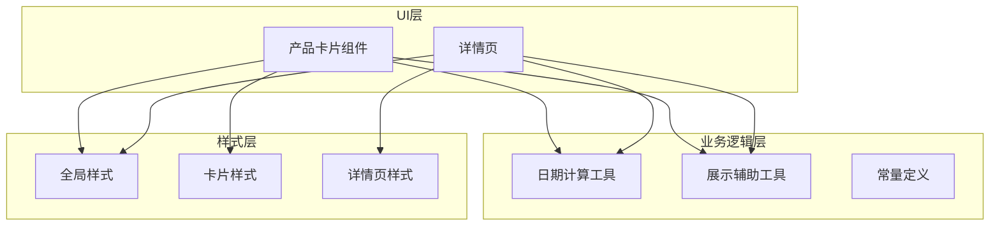
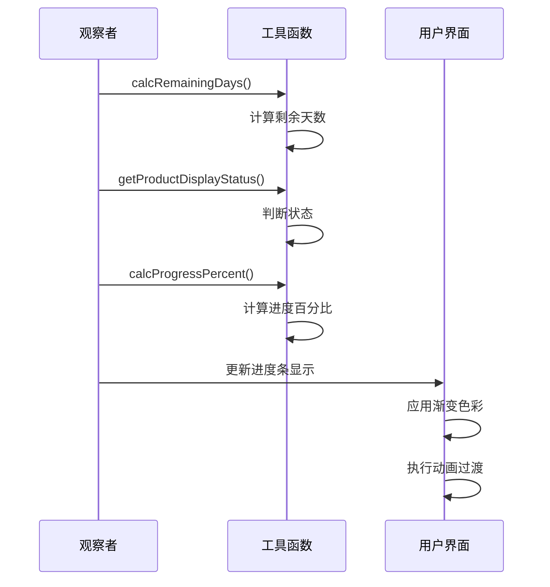
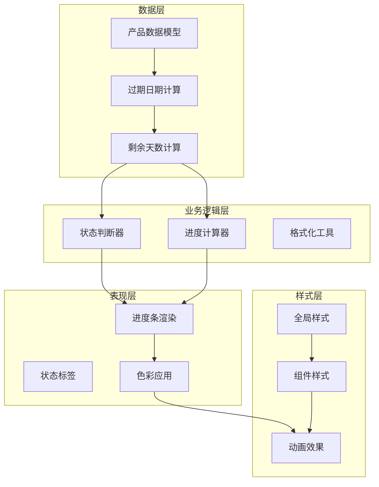
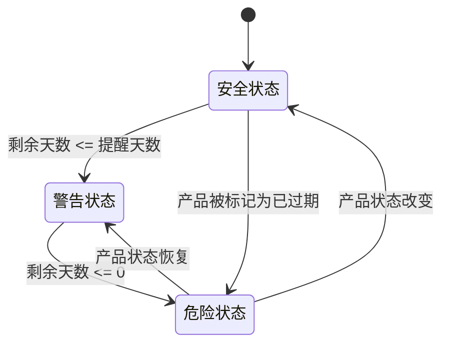
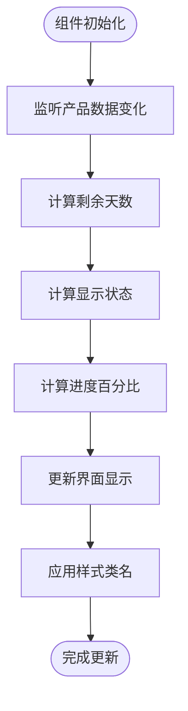
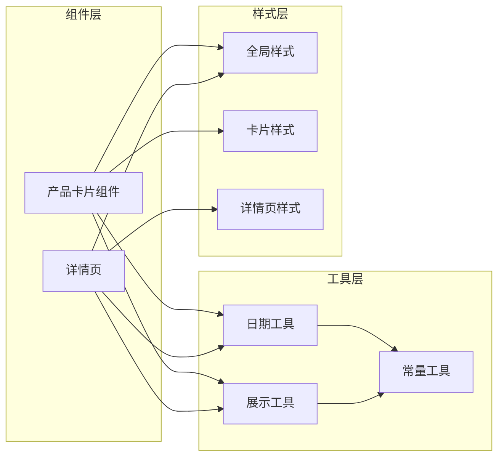
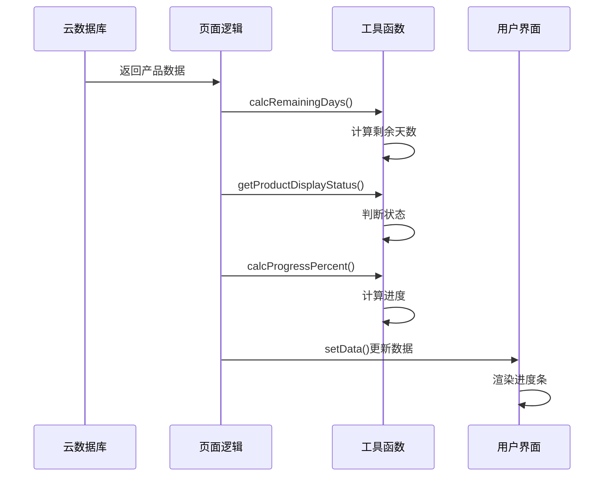

# 保质期进度条设计规范

<cite>
**本文档引用的文件**
- [product-card.js](file://miniprogram/components/product-card/product-card.js)
- [product-card.wxss](file://miniprogram/components/product-card/product-card.wxss)
- [date.js](file://miniprogram/utils/date.js)
- [display.js](file://miniprogram/utils/display.js)
- [constants.js](file://miniprogram/utils/constants.js)
- [app.wxss](file://miniprogram/app.wxss)
- [detail.wxml](file://miniprogram/pages/detail/detail.wxml)
- [detail.wxss](file://miniprogram/pages/detail/detail.wxss)
- [MASTER.md](file://design-system/MASTER.md)
- [product-card.wxml](file://miniprogram/components/product-card/product-card.wxml)
</cite>

## 目录
1. [简介](#简介)
2. [项目结构](#项目结构)
3. [核心组件](#核心组件)
4. [架构概览](#架构概览)
5. [详细组件分析](#详细组件分析)
6. [依赖关系分析](#依赖关系分析)
7. [性能考虑](#性能考虑)
8. [故障排除指南](#故障排除指南)
9. [结论](#结论)

## 简介

本文档为CosmeticBox微信小程序中的保质期进度条设计规范提供完整的技术文档。该进度条是产品管理功能的核心可视化组件，用于直观展示化妆品产品的保质期使用情况，帮助用户及时了解产品状态并做出相应决策。

进度条采用渐变色彩设计，通过不同的颜色状态反映产品的安全程度：绿色表示安全使用期、黄色表示即将过期、红色表示已过期。系统实现了精确的时间计算算法，确保进度显示的准确性和实时性。

## 项目结构

CosmeticBox项目采用模块化架构设计，保质期进度条功能分布在多个层次中：



**图表来源**
- [product-card.js:1-51](file://miniprogram/components/product-card/product-card.js#L1-L51)
- [date.js:1-76](file://miniprogram/utils/date.js#L1-L76)
- [display.js:1-76](file://miniprogram/utils/display.js#L1-L76)
- [app.wxss:1-201](file://miniprogram/app.wxss#L1-L201)

**章节来源**
- [product-card.js:1-51](file://miniprogram/components/product-card/product-card.js#L1-L51)
- [date.js:1-76](file://miniprogram/utils/date.js#L1-L76)
- [display.js:1-76](file://miniprogram/utils/display.js#L1-L76)
- [app.wxss:1-201](file://miniprogram/app.wxss#L1-L201)

## 核心组件

### 技术规格

保质期进度条严格遵循设计系统规范，具有以下精确的技术规格：

**尺寸规范**
- 高度：6px（固定像素值）
- 圆角：3px（与设计系统圆角令牌一致）
- 背景色：#E5E7EB（中性灰）

**状态色彩规范**

| 状态 | 渐变色彩 | RGB值 | 使用场景 |
|------|----------|-------|----------|
| 安全状态（>提醒天数） | linear-gradient(90deg, #34D399, #6EE7B7) | 绿色渐变 | 在用期内的产品 |
| 警告状态（<=提醒天数） | linear-gradient(90deg, #FBBF24, #FDE68A) | 黄色渐变 | 即将过期的产品 |
| 危险状态 | linear-gradient(90deg, #F87171, #FCA5A5) | 红色渐变 | 已过期的产品 |

**动画效果**
- 进度变化动画：400ms ease-out
- 颜色过渡：平滑渐变效果
- 状态切换：即时响应用户操作

**章节来源**
- [app.wxss:176-200](file://miniprogram/app.wxss#L176-L200)
- [MASTER.md:151-159](file://design-system/MASTER.md#L151-L159)

### 数据流处理

进度条的数据处理流程采用观察者模式，实时响应产品状态变化：



**图表来源**
- [product-card.js:19-33](file://miniprogram/components/product-card/product-card.js#L19-L33)
- [date.js:42-57](file://miniprogram/utils/date.js#L42-L57)
- [display.js:13-27](file://miniprogram/utils/display.js#L13-L27)

**章节来源**
- [product-card.js:19-33](file://miniprogram/components/product-card/product-card.js#L19-L33)
- [date.js:42-57](file://miniprogram/utils/date.js#L42-L57)
- [display.js:13-27](file://miniprogram/utils/display.js#L13-L27)

## 架构概览

### 整体架构设计

保质期进度条系统采用分层架构，确保代码的可维护性和扩展性：



**图表来源**
- [date.js:25-57](file://miniprogram/utils/date.js#L25-L57)
- [display.js:13-68](file://miniprogram/utils/display.js#L13-L68)
- [app.wxss:176-200](file://miniprogram/app.wxss#L176-L200)

### 状态转换机制

系统通过明确的状态转换规则，确保进度条能够准确反映产品的真实状态：



**图表来源**
- [date.js:53-57](file://miniprogram/utils/date.js#L53-L57)
- [display.js:55-61](file://miniprogram/utils/display.js#L55-L61)

**章节来源**
- [date.js:53-57](file://miniprogram/utils/date.js#L53-L57)
- [display.js:55-61](file://miniprogram/utils/display.js#L55-L61)

## 详细组件分析

### 产品卡片组件

产品卡片组件是进度条的主要承载容器，负责整合所有相关信息：

#### 组件属性配置

| 属性名 | 类型 | 默认值 | 描述 |
|--------|------|--------|------|
| product | Object | {} | 产品对象，包含生产日期、过期日期等信息 |
| advanceDays | Number | 30 | 提前提醒天数阈值 |
| remainingText | String | '' | 剩余天数文本描述 |
| statusLabel | String | '' | 状态标签文本 |
| colorClass | String | 'safe' | 状态色彩类名 |
| progressPercent | Number | 0 | 进度百分比 |

#### 核心方法实现

组件通过观察者模式监听数据变化，自动更新进度条状态：



**图表来源**
- [product-card.js:19-33](file://miniprogram/components/product-card/product-card.js#L19-L33)

**章节来源**
- [product-card.js:1-51](file://miniprogram/components/product-card/product-card.js#L1-L51)

### 日期计算工具

日期计算工具提供了精确的时间计算能力，确保进度条的准确性：

#### 核心算法实现

**过期日期计算算法**
- 采用最小值原则：min(未开封过期时间, 开封后过期时间)
- 支持月末溢出处理，确保日期计算的正确性
- 使用ISO日期格式（YYYY-MM-DD）保证跨平台兼容性

**剩余天数计算算法**
- 精确到天数级别，支持正数（未来）、零（当天）、负数（已过期）
- 采用四舍五入策略，避免浮点数误差影响用户体验
- 支持自定义当前日期参数，便于测试和调试

**章节来源**
- [date.js:25-48](file://miniprogram/utils/date.js#L25-L48)

### 展示辅助工具

展示辅助工具负责将原始数据转换为用户友好的界面元素：

#### 进度计算算法

进度计算采用"已用时间 / 总保质期"的精确公式：

```mermaid
flowchart TD
Start([开始计算]) --> GetDates[获取生产日期和过期日期]
GetDates --> CalcTotal[计算总保质期(ms)]
CalcTotal --> CheckTotal{总保质期有效?}
CheckTotal --> |否| Return100[返回100%]
CheckTotal --> |是| CalcElapsed[计算已用时间(ms)]
CalcElapsed --> CheckElapsed{已用时间有效?}
CheckElapsed --> |否| Return0[返回0%]
CheckElapsed --> |是| CheckMax{是否超过总保质期?}
CheckMax --> |是| Return100
CheckMax --> |否| CalcPercent[计算百分比]
CalcPercent --> RoundPercent[四舍五入到整数]
RoundPercent --> End([返回结果])
```

**图表来源**
- [display.js:13-27](file://miniprogram/utils/display.js#L13-L27)

**边界条件处理**
- 总保质期小于等于0时，进度固定为100%
- 已用时间小于等于0时，进度为0%
- 已用时间超过总保质期时，进度为100%

**章节来源**
- [display.js:13-27](file://miniprogram/utils/display.js#L13-L27)

### 样式系统

样式系统采用CSS变量和渐变技术，确保视觉效果的一致性和可维护性：

#### 样式架构

**全局样式变量**
- `--radius-progress`: 3px（进度条圆角）
- `--color-safe`: #34D399（安全色）
- `--color-warning`: #FBBF24（警告色）
- `--color-danger`: #F87171（危险色）

**进度条样式结构**
- `.progress-bar`: 容器样式，设置固定高度和背景色
- `.progress-bar-fill`: 填充样式，应用渐变色彩和动画
- `.progress-safe/progress-warning/progress-danger`: 状态特定样式

**章节来源**
- [app.wxss:176-200](file://miniprogram/app.wxss#L176-L200)
- [product-card.wxss:108-122](file://miniprogram/components/product-card/product-card.wxss#L108-L122)

## 依赖关系分析

### 组件间依赖关系



**图表来源**
- [product-card.js:4-5](file://miniprogram/components/product-card/product-card.js#L4-L5)
- [date.js:69-75](file://miniprogram/utils/date.js#L69-L75)
- [display.js:70-75](file://miniprogram/utils/display.js#L70-L75)

### 数据流向

进度条的数据流遵循单向数据绑定原则，确保状态管理的清晰性：



**图表来源**
- [product-card.js:20-31](file://miniprogram/components/product-card/product-card.js#L20-L31)

**章节来源**
- [product-card.js:20-31](file://miniprogram/components/product-card/product-card.js#L20-L31)

## 性能考虑

### 优化策略

**内存优化**
- 使用观察者模式避免不必要的重复计算
- 合理的数据缓存机制，减少重复的日期计算
- 及时清理事件监听器，防止内存泄漏

**渲染优化**
- 进度条动画使用硬件加速，确保流畅性
- 条件渲染避免不必要的DOM更新
- CSS变量的使用提高样式的复用效率

**计算优化**
- 采用四舍五入策略减少浮点运算开销
- 边界条件检查提前返回，避免无效计算
- 时间格式化采用ISO标准，提高解析效率

### 性能监控

建议在开发环境中监控以下指标：
- 进度条更新频率
- 内存使用情况
- 页面渲染性能
- 用户交互响应时间

## 故障排除指南

### 常见问题及解决方案

**进度条不显示**
- 检查产品数据是否包含有效的生产日期和过期日期
- 确认advanceDays属性设置合理
- 验证CSS类名是否正确应用

**进度计算错误**
- 确认日期格式为YYYY-MM-DD
- 检查时区设置是否正确
- 验证边界条件处理逻辑

**颜色显示异常**
- 检查CSS变量是否正确加载
- 确认渐变色彩值是否符合规范
- 验证状态判断逻辑

**动画效果不流畅**
- 检查硬件加速是否启用
- 验证CSS transition属性设置
- 确认动画时长设置合理

**章节来源**
- [product-card.js:20-31](file://miniprogram/components/product-card/product-card.js#L20-L31)
- [display.js:13-27](file://miniprogram/utils/display.js#L13-L27)

## 结论

CosmeticBox的保质期进度条设计规范体现了现代移动应用的设计理念，通过精确的技术实现和优雅的视觉设计，为用户提供了直观、可靠的产品管理体验。

该系统的关键优势包括：
- **精确性**：基于科学的时间计算算法，确保进度显示的准确性
- **一致性**：严格遵循设计系统规范，保持视觉风格的统一
- **可维护性**：模块化的架构设计，便于功能扩展和bug修复
- **用户体验**：流畅的动画效果和直观的状态指示，提升用户满意度

通过持续的优化和完善，该进度条系统将成为CosmeticBox产品管理功能的重要组成部分，为用户提供可靠的保质期管理工具。