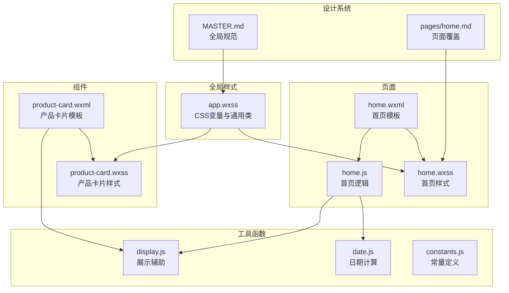
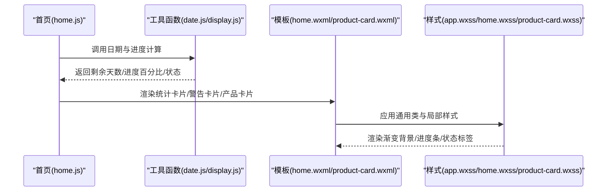
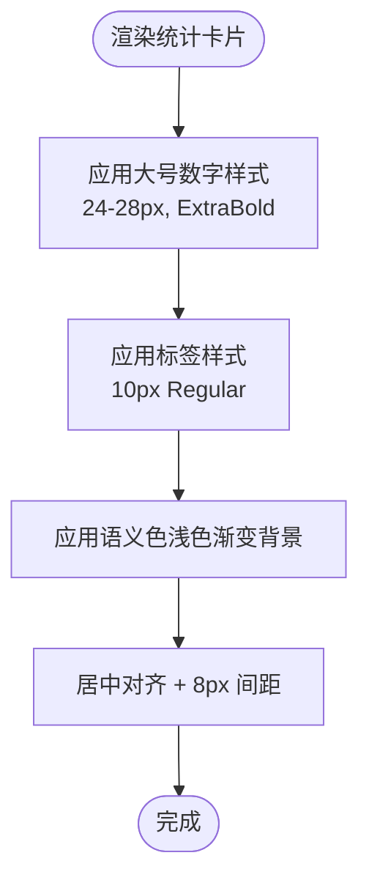
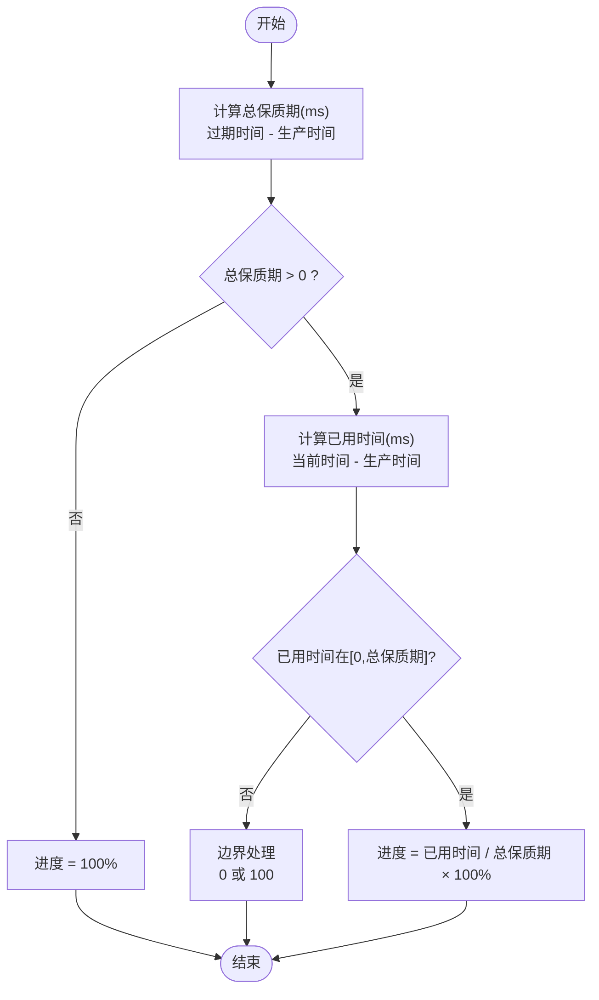
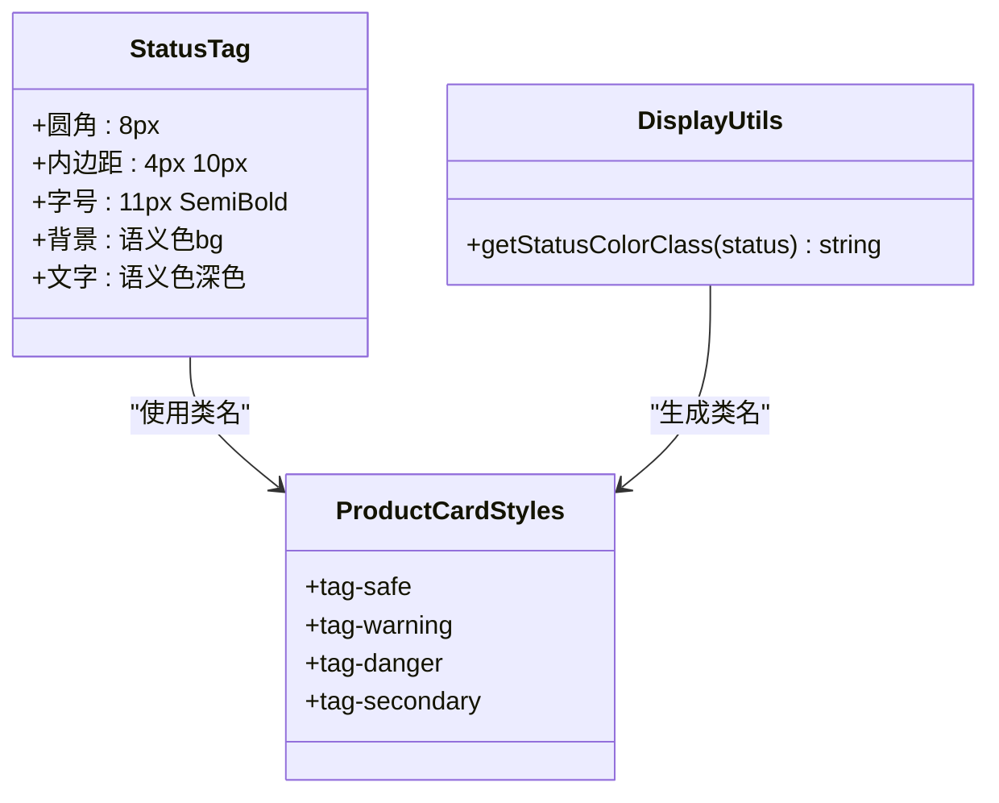
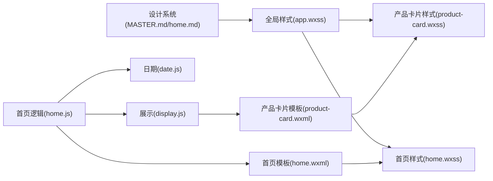

# 游戏化元素规范

<cite>
**本文引用的文件**
- [MASTER.md](file://design-system/MASTER.md)
- [home.md](file://design-system/pages/home.md)
- [app.wxss](file://miniprogram/app.wxss)
- [home.wxss](file://miniprogram/pages/home/home.wxss)
- [product-card.wxss](file://miniprogram/components/product-card/product-card.wxss)
- [product-card.wxml](file://miniprogram/components/product-card/product-card.wxml)
- [home.wxml](file://miniprogram/pages/home/home.wxml)
- [home.js](file://miniprogram/pages/home/home.js)
- [date.js](file://miniprogram/utils/date.js)
- [display.js](file://miniprogram/utils/display.js)
- [constants.js](file://miniprogram/utils/constants.js)
</cite>

## 目录
1. [简介](#简介)
2. [项目结构](#项目结构)
3. [核心组件](#核心组件)
4. [架构总览](#架构总览)
5. [详细组件分析](#详细组件分析)
6. [依赖关系分析](#依赖关系分析)
7. [性能考量](#性能考量)
8. [故障排查指南](#故障排查指南)
9. [结论](#结论)
10. [附录](#附录)

## 简介
本规范面向“游戏化元素”的视觉与交互设计，聚焦三大核心：统计卡片、保质期进度条、状态标签。规范以设计系统文件为权威来源，并结合小程序实际实现，给出可落地的视觉层级、配色方案、布局原则与实现逻辑，确保在微信小程序中达成“Monument Valley 极简几何 + Duolingo 激励反馈 + 清新柔和”的设计理念。

## 项目结构
本项目采用“设计系统 + 页面/组件 + 工具函数”的分层组织方式：
- 设计系统：集中定义色彩、字体、圆角、阴影、间距、图标、动画、游戏化元素等规范
- 页面与组件：以 WXML/WXSS 实现具体界面，复用全局样式与工具函数
- 工具函数：封装日期计算、进度百分比、状态映射等业务逻辑

图表来源
- [MASTER.md:143-166](file://design-system/MASTER.md#L143-L166)
- [home.md:29-51](file://design-system/pages/home.md#L29-L51)
- [app.wxss:1-201](file://miniprogram/app.wxss#L1-L201)
- [home.wxss:1-324](file://miniprogram/pages/home/home.wxss#L1-L324)
- [product-card.wxss:1-122](file://miniprogram/components/product-card/product-card.wxss#L1-L122)
- [product-card.wxml:1-29](file://miniprogram/components/product-card/product-card.wxml#L1-L29)
- [home.wxml:1-105](file://miniprogram/pages/home/home.wxml#L1-L105)
- [home.js:1-119](file://miniprogram/pages/home/home.js#L1-L119)
- [date.js:1-76](file://miniprogram/utils/date.js#L1-L76)
- [display.js:1-76](file://miniprogram/utils/display.js#L1-L76)
- [constants.js:1-100](file://miniprogram/utils/constants.js#L1-L100)

章节来源
- [MASTER.md:1-190](file://design-system/MASTER.md#L1-L190)
- [home.md:1-52](file://design-system/pages/home.md#L1-L52)
- [app.wxss:1-201](file://miniprogram/app.wxss#L1-L201)

## 核心组件
本节聚焦三大游戏化元素的视觉与实现要点，均以设计系统为依据，并在小程序代码中得到体现。

- 统计卡片
  - 视觉层级：大号数字 24-28px，ExtraBold
  - 渐变底色：按语义色浅色渐变背景
  - 布局：卡片内含数值与标签，配合 SVG 图标容器
  - 首页统计卡片行在页面覆盖文件中有明确布局与间距规范

- 保质期进度条
  - 技术规格：高度 6px，圆角 3px
  - 背景色：统一为 #E5E7EB
  - 填充色：随状态使用渐变
    - 安全（>提醒天数）：linear-gradient(90deg, #34D399, #6EE7B7)
    - 即将过期（<=提醒天数）：linear-gradient(90deg, #FBBF24, #FDE68A)
    - 已过期：linear-gradient(90deg, #F87171, #FCA5A5)
  - 进度计算：已用时间 / 总保质期

- 状态标签
  - 尺寸：圆角 8px，内边距 4px 10px
  - 背景：语义色 bg 色（如安全背景 #DCFCE7）
  - 文字：语义色深色变体（如安全深色 #059669）
  - 字号：11px SemiBold

章节来源
- [MASTER.md:143-166](file://design-system/MASTER.md#L143-L166)
- [home.md:29-51](file://design-system/pages/home.md#L29-L51)
- [app.wxss:176-201](file://miniprogram/app.wxss#L176-L201)
- [product-card.wxss:72-99](file://miniprogram/components/product-card/product-card.wxss#L72-L99)
- [home.wxss:80-118](file://miniprogram/pages/home/home.wxss#L80-L118)

## 架构总览
从设计到实现的完整链路如下：
- 设计系统定义规范（MASTER.md、pages/home.md）
- 全局样式将规范映射为 CSS 变量与通用类（app.wxss）
- 页面与组件复用全局样式，实现具体界面（home.wxss、product-card.wxss）
- 逻辑层通过工具函数计算状态与进度（home.js、date.js、display.js）

图表来源
- [home.js:24-101](file://miniprogram/pages/home/home.js#L24-L101)
- [date.js:42-57](file://miniprogram/utils/date.js#L42-L57)
- [display.js:13-27](file://miniprogram/utils/display.js#L13-L27)
- [home.wxml:17-58](file://miniprogram/pages/home/home.wxml#L17-L58)
- [product-card.wxml:5-28](file://miniprogram/components/product-card/product-card.wxml#L5-L28)
- [app.wxss:176-201](file://miniprogram/app.wxss#L176-L201)
- [home.wxss:80-118](file://miniprogram/pages/home/home.wxss#L80-L118)
- [product-card.wxss:72-99](file://miniprogram/components/product-card/product-card.wxss#L72-L99)

## 详细组件分析

### 统计卡片设计规范
- 视觉层级
  - 数字字号：24-28px，字重 ExtraBold
  - 标签字号：10px Regular，用于补充说明
- 渐变底色
  - 使用语义色浅色渐变背景，分别对应安全、警告、安全率场景
- 布局原则
  - 卡片内含数值与标签，居中对齐；卡片间距为 8px
  - 首页统计卡片行在页面覆盖文件中明确布局与间距
- 对应语义色浅色渐变背景
  - 安全：linear-gradient(135deg, #DCFCE7, #A7F3D0)
  - 警告：linear-gradient(135deg, #FEF3C7, #FDE68A)
  - 安全率：linear-gradient(135deg, #EDE9FE, #C4B5FD)
- SVG 图标
  - 统计卡片不直接包含 SVG 图标；图标容器与渐变背景在产品卡片中体现，可借鉴其图标容器尺寸与渐变风格

图表来源
- [home.wxss:80-118](file://miniprogram/pages/home/home.wxss#L80-L118)
- [MASTER.md:145-149](file://design-system/MASTER.md#L145-L149)

章节来源
- [MASTER.md:145-149](file://design-system/MASTER.md#L145-L149)
- [home.md:29-36](file://design-system/pages/home.md#L29-L36)
- [home.wxss:80-118](file://miniprogram/pages/home/home.wxss#L80-L118)

### 保质期进度条设计规范
- 技术规格
  - 高度：6px
  - 圆角：3px
  - 背景色：#E5E7EB
- 填充色（随状态）
  - 安全（>提醒天数）：linear-gradient(90deg, #34D399, #6EE7B7)
  - 即将过期（<=提醒天数）：linear-gradient(90deg, #FBBF24, #FDE68A)
  - 已过期：linear-gradient(90deg, #F87171, #FCA5A5)
- 进度计算逻辑
  - 公式：已用时间 / 总保质期
  - 已用时间 = 当前日期 - 生产日期
  - 总保质期 = 过期日期 - 生产日期
  - 结果范围：0-100%，四舍五入
- 实现要点
  - 进度条容器高度与圆角由全局样式统一
  - 填充色类名根据状态动态绑定
  - 进度百分比通过工具函数计算并在模板中绑定

图表来源
- [display.js:13-27](file://miniprogram/utils/display.js#L13-L27)
- [app.wxss:176-201](file://miniprogram/app.wxss#L176-L201)
- [home.wxml:54-56](file://miniprogram/pages/home/home.wxml#L54-L56)
- [product-card.wxml:23-26](file://miniprogram/components/product-card/product-card.wxml#L23-L26)

章节来源
- [MASTER.md:151-159](file://design-system/MASTER.md#L151-L159)
- [app.wxss:176-201](file://miniprogram/app.wxss#L176-L201)
- [display.js:13-27](file://miniprogram/utils/display.js#L13-L27)
- [home.wxml:54-56](file://miniprogram/pages/home/home.wxml#L54-L56)
- [product-card.wxml:23-26](file://miniprogram/components/product-card/product-card.wxml#L23-L26)

### 状态标签设计规范
- 尺寸与排版
  - 圆角：8px
  - 内边距：上下 4px，左右 10px
  - 字号：11px SemiBold
- 背景与文字
  - 背景：使用语义色 bg 色（如安全背景 #DCFCE7）
  - 文字：使用语义色深色变体（如安全深色 #059669）
- 在组件中的应用
  - 产品卡片的状态标签类名与颜色映射由工具函数提供
  - 标签类名与背景色在产品卡片样式中定义

图表来源
- [product-card.wxss:72-99](file://miniprogram/components/product-card/product-card.wxss#L72-L99)
- [display.js:63-68](file://miniprogram/utils/display.js#L63-L68)

章节来源
- [MASTER.md:161-166](file://design-system/MASTER.md#L161-L166)
- [product-card.wxss:72-99](file://miniprogram/components/product-card/product-card.wxss#L72-L99)
- [display.js:63-68](file://miniprogram/utils/display.js#L63-L68)

### 游戏化体验设计原则与实现指导
- 设计理念
  - 极简几何：圆、三角、方作为装饰语言
  - 激励反馈：进度条、统计数字、成就感
  - 清新柔和：暖色调用色，年轻不幼稚
- 实现指导
  - 统计卡片：使用大号数字 + 渐变底色 + 图标容器，营造“完成任务”的视觉反馈
  - 保质期进度条：使用语义色渐变填充，直观反映风险等级
  - 状态标签：清晰传达产品状态，提升可读性与决策效率
  - 动画规范：进度条使用颜色渐变 + 宽度动画，时长 400ms，缓动曲线 ease-out

章节来源
- [MASTER.md:5-11](file://design-system/MASTER.md#L5-L11)
- [MASTER.md:125-142](file://design-system/MASTER.md#L125-L142)

## 依赖关系分析
- 规范到实现的映射
  - 设计系统 MASTER.md 与 pages/home.md 定义了三大元素的规范
  - app.wxss 将规范映射为 CSS 变量与通用类
  - 页面与组件样式复用通用类，实现具体界面
- 逻辑到样式的耦合
  - 首页逻辑通过工具函数计算状态与进度，模板中绑定类名与样式
  - 产品卡片模板通过类名动态选择进度条与标签样式

图表来源
- [MASTER.md:143-166](file://design-system/MASTER.md#L143-L166)
- [home.md:29-51](file://design-system/pages/home.md#L29-L51)
- [app.wxss:1-201](file://miniprogram/app.wxss#L1-L201)
- [home.wxss:1-324](file://miniprogram/pages/home/home.wxss#L1-L324)
- [product-card.wxss:1-122](file://miniprogram/components/product-card/product-card.wxss#L1-L122)
- [home.js:1-119](file://miniprogram/pages/home/home.js#L1-L119)
- [date.js:1-76](file://miniprogram/utils/date.js#L1-L76)
- [display.js:1-76](file://miniprogram/utils/display.js#L1-L76)
- [home.wxml:1-105](file://miniprogram/pages/home/home.wxml#L1-L105)
- [product-card.wxml:1-29](file://miniprogram/components/product-card/product-card.wxml#L1-L29)

章节来源
- [home.js:24-101](file://miniprogram/pages/home/home.js#L24-L101)
- [display.js:63-68](file://miniprogram/utils/display.js#L63-L68)

## 性能考量
- 样式层面
  - 使用 CSS 变量与通用类，减少重复定义，降低样式体积
  - 进度条宽度动画时长 400ms，兼顾流畅与性能
- 逻辑层面
  - 进度计算与状态判断在逻辑层完成，避免频繁 DOM 操作
  - 列表渲染时按状态排序，减少不必要的重排
- 交互层面
  - 遵循系统偏好设置，尊重用户减少动画的偏好

章节来源
- [app.wxss:176-201](file://miniprogram/app.wxss#L176-L201)
- [home.js:76-78](file://miniprogram/pages/home/home.js#L76-L78)
- [MASTER.md:125-142](file://design-system/MASTER.md#L125-L142)

## 故障排查指南
- 进度条不显示或颜色异常
  - 检查进度条容器类名与填充类名是否正确绑定
  - 确认进度百分比计算结果在 0-100% 范围内
  - 参考：进度条样式与填充类名定义
- 状态标签颜色不正确
  - 检查状态映射函数是否返回正确的类名
  - 确认标签样式类名与背景色定义一致
  - 参考：状态类名映射与标签样式
- 统计卡片布局错位
  - 检查卡片间距与居中对齐类名
  - 确认统计卡片行的布局容器与间距变量
  - 参考：统计卡片样式与页面覆盖布局

章节来源
- [app.wxss:176-201](file://miniprogram/app.wxss#L176-L201)
- [product-card.wxss:72-99](file://miniprogram/components/product-card/product-card.wxss#L72-L99)
- [display.js:63-68](file://miniprogram/utils/display.js#L63-L68)
- [home.wxss:80-118](file://miniprogram/pages/home/home.wxss#L80-L118)
- [home.md:29-36](file://design-system/pages/home.md#L29-L36)

## 结论
本规范以设计系统为权威依据，结合小程序的实际实现，明确了统计卡片、保质期进度条与状态标签的视觉与交互标准。通过 CSS 变量与通用类的复用，以及工具函数的业务逻辑封装，实现了规范与实现的一致性与可维护性。建议在后续迭代中持续遵循本规范，确保用户体验的一致性与“游戏化”体验的连贯性。

## 附录
- 关键实现路径
  - 统计卡片：[home.wxss:80-118](file://miniprogram/pages/home/home.wxss#L80-L118)
  - 保质期进度条：[app.wxss:176-201](file://miniprogram/app.wxss#L176-L201)
  - 状态标签：[product-card.wxss:72-99](file://miniprogram/components/product-card/product-card.wxss#L72-L99)
  - 进度计算：[display.js:13-27](file://miniprogram/utils/display.js#L13-L27)
  - 状态映射：[display.js:63-68](file://miniprogram/utils/display.js#L63-L68)
  - 首页逻辑：[home.js:24-101](file://miniprogram/pages/home/home.js#L24-L101)