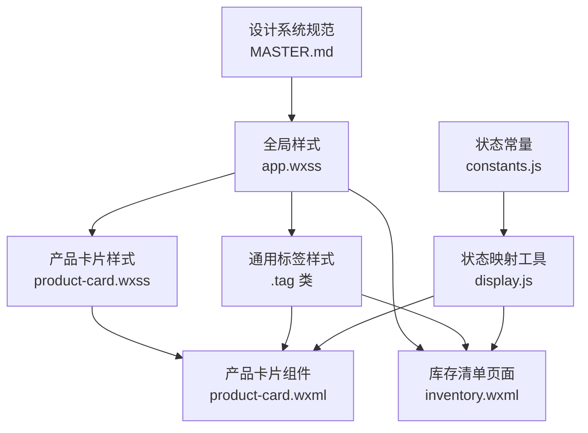
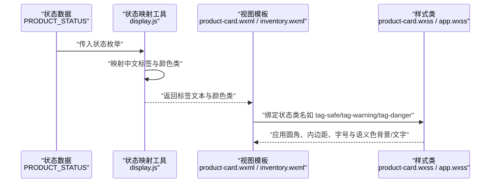
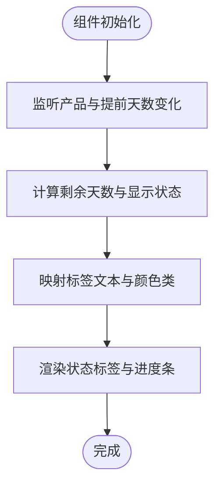
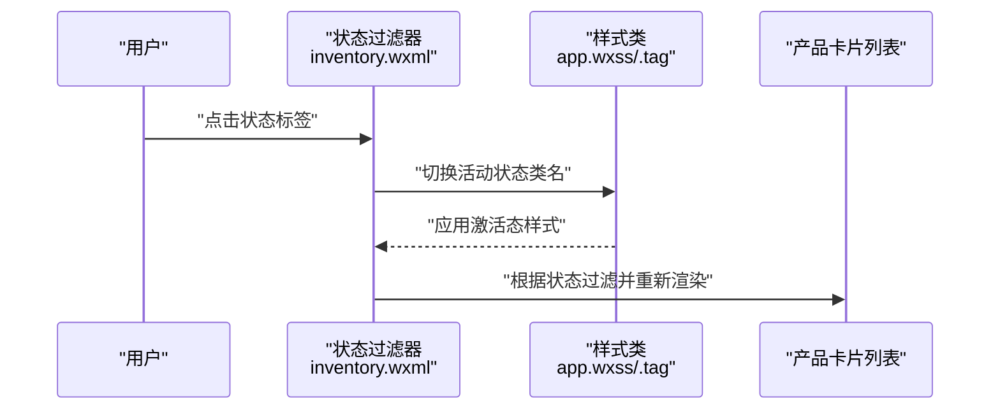
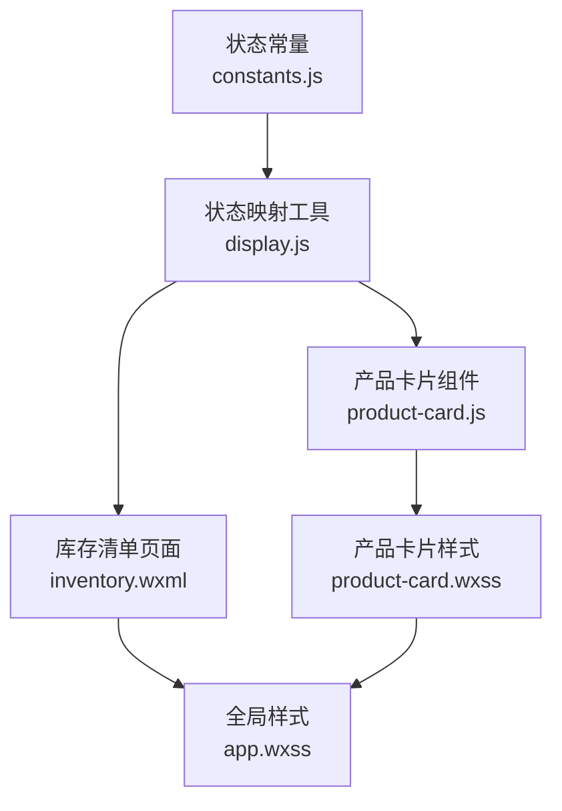

# 状态标签设计规范

<cite>
**本文档引用的文件**
- [MASTER.md](file://design-system/MASTER.md)
- [app.wxss](file://miniprogram/app.wxss)
- [product-card.wxss](file://miniprogram/components/product-card/product-card.wxss)
- [product-card.wxml](file://miniprogram/components/product-card/product-card.wxml)
- [display.js](file://miniprogram/utils/display.js)
- [constants.js](file://miniprogram/utils/constants.js)
- [inventory.wxml](file://miniprogram/pages/inventory/inventory.wxml)
- [home.wxml](file://miniprogram/pages/home/home.wxml)
- [display.test.js](file://tests/display.test.js)
</cite>

## 目录
1. [简介](#简介)
2. [项目结构](#项目结构)
3. [核心组件](#核心组件)
4. [架构概览](#架构概览)
5. [详细组件分析](#详细组件分析)
6. [依赖分析](#依赖分析)
7. [性能考虑](#性能考虑)
8. [故障排除指南](#故障排除指南)
9. [结论](#结论)

## 简介
本设计规范针对状态标签的视觉规格与语义色体系进行标准化定义，确保在产品卡片、筛选器、统计面板等组件中的一致性呈现。规范涵盖圆角、内边距、字号等视觉参数，以及安全、警告、危险状态的语义色背景与文字对比度设计原则，并提供具体的应用场景与最佳实践。

## 项目结构
状态标签在项目中的实现分布于设计系统规范、全局样式与业务组件中：
- 设计系统规范：统一定义语义色、圆角、内边距与字号等视觉标准
- 全局样式：通过 CSS 变量与通用类提供状态标签的基础样式
- 业务组件：产品卡片组件与库存清单页面通过状态映射与类名绑定实现状态标签渲染

**图表来源**
- [MASTER.md:161-166](file://design-system/MASTER.md#L161-L166)
- [app.wxss:167-174](file://miniprogram/app.wxss#L167-L174)
- [product-card.wxss:72-99](file://miniprogram/components/product-card/product-card.wxss#L72-L99)
- [product-card.wxml:16-19](file://miniprogram/components/product-card/product-card.wxml#L16-L19)
- [inventory.wxml:39-56](file://miniprogram/pages/inventory/inventory.wxml#L39-L56)
- [display.js:40-68](file://miniprogram/utils/display.js#L40-L68)
- [constants.js:6-12](file://miniprogram/utils/constants.js#L6-L12)

**章节来源**
- [MASTER.md:161-166](file://design-system/MASTER.md#L161-L166)
- [app.wxss:167-174](file://miniprogram/app.wxss#L167-L174)
- [product-card.wxss:72-99](file://miniprogram/components/product-card/product-card.wxss#L72-L99)
- [product-card.wxml:16-19](file://miniprogram/components/product-card/product-card.wxml#L16-L19)
- [inventory.wxml:39-56](file://miniprogram/pages/inventory/inventory.wxml#L39-L56)
- [display.js:40-68](file://miniprogram/utils/display.js#L40-L68)
- [constants.js:6-12](file://miniprogram/utils/constants.js#L6-L12)

## 核心组件
状态标签的实现由以下要素构成：
- 视觉规格
  - 圆角：8px
  - 内边距：上下 4px，左右 10px
  - 字号：11px，字重 SemiBold（600）
- 语义色背景与文字
  - 安全状态：背景使用语义色安全背景变量，文字使用深色安全色
  - 警告状态：背景使用语义色警告背景变量，文字使用深色警告色
  - 危险状态：背景使用语义色危险背景变量，文字使用深色危险色
- 数据映射
  - 状态枚举来自常量定义
  - 状态标签文本与颜色类通过工具函数映射

**章节来源**
- [MASTER.md:161-166](file://design-system/MASTER.md#L161-L166)
- [app.wxss:20-28](file://miniprogram/app.wxss#L20-L28)
- [app.wxss:167-174](file://miniprogram/app.wxss#L167-L174)
- [product-card.wxss:72-99](file://miniprogram/components/product-card/product-card.wxss#L72-L99)
- [display.js:40-68](file://miniprogram/utils/display.js#L40-L68)
- [constants.js:6-12](file://miniprogram/utils/constants.js#L6-L12)

## 架构概览
状态标签的渲染流程从数据到视图的完整链路如下：

**图表来源**
- [constants.js:6-12](file://miniprogram/utils/constants.js#L6-L12)
- [display.js:40-68](file://miniprogram/utils/display.js#L40-L68)
- [product-card.wxml:16-19](file://miniprogram/components/product-card/product-card.wxml#L16-L19)
- [inventory.wxml:39-56](file://miniprogram/pages/inventory/inventory.wxml#L39-L56)
- [product-card.wxss:72-99](file://miniprogram/components/product-card/product-card.wxss#L72-L99)
- [app.wxss:167-174](file://miniprogram/app.wxss#L167-L174)

## 详细组件分析

### 产品卡片中的状态标签
- 组件职责：根据产品状态与剩余天数计算显示状态，生成标签文本与颜色类，并渲染进度条与剩余天数
- 关键实现点：
  - 状态映射：使用工具函数将内部状态转换为中文标签与颜色类
  - 标签渲染：通过类名绑定实现状态标签的背景与文字颜色
  - 进度条：根据生产日期与过期日期计算进度百分比

**图表来源**
- [product-card.js:19-32](file://miniprogram/components/product-card/product-card.js#L19-L32)
- [display.js:40-68](file://miniprogram/utils/display.js#L40-L68)
- [product-card.wxml:16-19](file://miniprogram/components/product-card/product-card.wxml#L16-L19)
- [product-card.wxss:72-99](file://miniprogram/components/product-card/product-card.wxss#L72-L99)

**章节来源**
- [product-card.js:19-32](file://miniprogram/components/product-card/product-card.js#L19-L32)
- [display.js:40-68](file://miniprogram/utils/display.js#L40-L68)
- [product-card.wxml:16-19](file://miniprogram/components/product-card/product-card.wxml#L16-L19)
- [product-card.wxss:72-99](file://miniprogram/components/product-card/product-card.wxss#L72-L99)

### 筛选器中的状态选择
- 组件职责：提供按状态过滤的产品列表，支持在库存清单页中选择“在用”“即将过期”“已过期”
- 关键实现点：
  - 状态标签样式：使用通用标签类与状态类名组合，保证视觉一致性
  - 交互行为：点击状态标签更新活动状态并触发数据刷新

**图表来源**
- [inventory.wxml:39-56](file://miniprogram/pages/inventory/inventory.wxml#L39-L56)
- [app.wxss:167-174](file://miniprogram/app.wxss#L167-L174)

**章节来源**
- [inventory.wxml:39-56](file://miniprogram/pages/inventory/inventory.wxml#L39-L56)
- [app.wxss:167-174](file://miniprogram/app.wxss#L167-L174)

### 统计面板中的状态展示
- 组件职责：首页统计卡片展示“在用”“注意”“安全率”，配合语义色背景与大字号数字
- 关键实现点：
  - 统计卡片：使用语义色背景变量与大字号数字样式
  - 装饰元素：页面背景几何图形增强视觉层次

**章节来源**
- [home.wxml:18-31](file://miniprogram/pages/home/home.wxml#L18-L31)
- [app.wxss:20-28](file://miniprogram/app.wxss#L20-L28)
- [app.wxss:60-68](file://miniprogram/app.wxss#L60-L68)

## 依赖分析
状态标签的依赖关系围绕数据、映射与样式展开，形成清晰的单向依赖链：

**图表来源**
- [constants.js:6-12](file://miniprogram/utils/constants.js#L6-L12)
- [display.js:40-68](file://miniprogram/utils/display.js#L40-L68)
- [product-card.js:4-5](file://miniprogram/components/product-card/product-card.js#L4-L5)
- [inventory.wxml:39-56](file://miniprogram/pages/inventory/inventory.wxml#L39-L56)
- [product-card.wxss:72-99](file://miniprogram/components/product-card/product-card.wxss#L72-L99)
- [app.wxss:167-174](file://miniprogram/app.wxss#L167-L174)

**章节来源**
- [constants.js:6-12](file://miniprogram/utils/constants.js#L6-L12)
- [display.js:40-68](file://miniprogram/utils/display.js#L40-L68)
- [product-card.js:4-5](file://miniprogram/components/product-card/product-card.js#L4-L5)
- [inventory.wxml:39-56](file://miniprogram/pages/inventory/inventory.wxml#L39-L56)
- [product-card.wxss:72-99](file://miniprogram/components/product-card/product-card.wxss#L72-L99)
- [app.wxss:167-174](file://miniprogram/app.wxss#L167-L174)

## 性能考虑
- 状态映射与计算
  - 将状态映射与进度计算封装在工具函数中，避免重复计算与模板逻辑复杂化
- 样式复用
  - 通过通用标签类与 CSS 变量减少样式冗余，提升维护效率
- 渲染优化
  - 在组件中使用 observers 监听必要字段变化，避免不必要的 setData 调用

[本节为通用指导，无需特定文件分析]

## 故障排除指南
- 状态标签为空
  - 检查状态映射是否包含未知状态，确保映射函数返回默认值
  - 参考测试用例验证映射行为
- 颜色不正确
  - 确认状态枚举与映射表一致，检查类名绑定是否正确
  - 核对 CSS 变量与语义色定义
- 视觉不一致
  - 对照设计系统规范核对圆角、内边距与字号
  - 确认全局样式与组件样式的优先级关系

**章节来源**
- [display.test.js:85-110](file://tests/display.test.js#L85-L110)
- [display.js:40-68](file://miniprogram/utils/display.js#L40-L68)
- [app.wxss:167-174](file://miniprogram/app.wxss#L167-L174)

## 结论
状态标签设计规范通过统一的视觉参数与语义色体系，确保在产品卡片、筛选器与统计面板等场景中的一致性与可读性。依托数据映射与样式复用机制，实现高效、可维护的组件化设计。建议在后续扩展中继续遵循该规范，保持设计系统的连贯性与用户体验的稳定性。