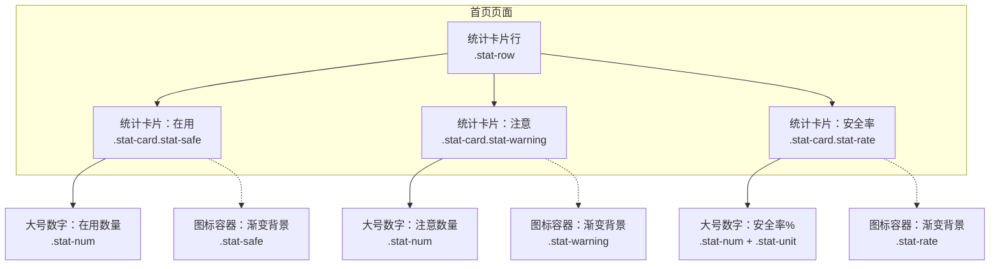
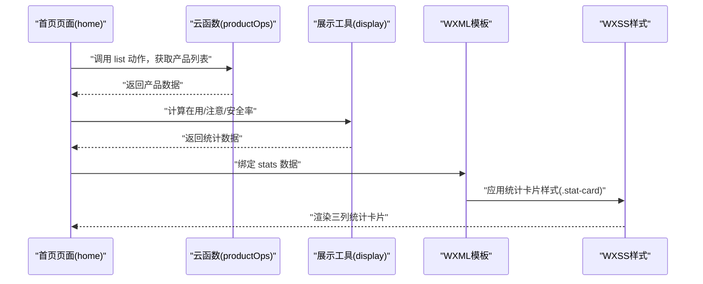
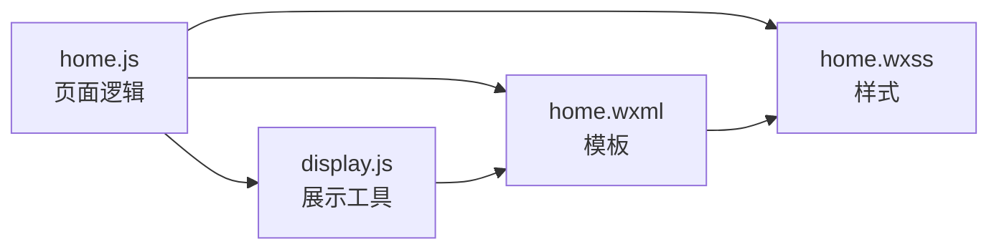

# 统计卡片设计规范

<cite>
**本文引用的文件**
- [design-system/MASTER.md](file://design-system/MASTER.md)
- [design-system/pages/home.md](file://design-system/pages/home.md)
- [miniprogram/pages/home/home.js](file://miniprogram/pages/home/home.js)
- [miniprogram/pages/home/home.wxml](file://miniprogram/pages/home/home.wxml)
- [miniprogram/pages/home/home.wxss](file://miniprogram/pages/home/home.wxss)
- [miniprogram/components/product-card/product-card.js](file://miniprogram/components/product-card/product-card.js)
- [miniprogram/components/product-card/product-card.wxml](file://miniprogram/components/product-card/product-card.wxml)
- [miniprogram/components/product-card/product-card.wxss](file://miniprogram/components/product-card/product-card.wxss)
- [miniprogram/utils/display.js](file://miniprogram/utils/display.js)
- [miniprogram/utils/constants.js](file://miniprogram/utils/constants.js)
</cite>

## 目录
1. [简介](#简介)
2. [项目结构](#项目结构)
3. [核心组件](#核心组件)
4. [架构总览](#架构总览)
5. [详细组件分析](#详细组件分析)
6. [依赖分析](#依赖分析)
7. [性能考虑](#性能考虑)
8. [故障排查指南](#故障排查指南)
9. [结论](#结论)
10. [附录](#附录)

## 简介
本设计规范围绕“统计卡片”的核心视觉与交互要素进行系统化梳理，结合设计系统与实际小程序实现，明确以下要点：
- 大号数字的视觉层级与排版规范（字号、字重、行高）
- 渐变底色的配色方案与应用规则
- 统计卡片与SVG图标的布局原则与图标选择标准
- 语义色浅色渐变背景的应用场景与落地方式
- 统计卡片的尺寸规格、间距要求、响应式适配与页面布局策略

## 项目结构
统计卡片在首页仪表盘中以三列形式呈现，分别展示“在用”、“注意”、“安全率”，并配合渐变背景与图标容器，形成清晰的视觉层级与信息密度。

图表来源
- [miniprogram/pages/home/home.wxml:17-31](file://miniprogram/pages/home/home.wxml#L17-L31)
- [miniprogram/pages/home/home.wxss:72-118](file://miniprogram/pages/home/home.wxss#L72-L118)

章节来源
- [miniprogram/pages/home/home.wxml:17-31](file://miniprogram/pages/home/home.wxml#L17-L31)
- [miniprogram/pages/home/home.wxss:72-118](file://miniprogram/pages/home/home.wxss#L72-L118)

## 核心组件
- 统计卡片容器：统一圆角、阴影、内边距与文本居中对齐；三列等分布局，列间距遵循设计系统网格。
- 大号数字：采用设计系统定义的统计数字字号范围与字重，确保在不同设备上具备良好的可读性与对比度。
- 渐变底色：按状态使用语义色浅色渐变背景，保证视觉一致性与状态传达。
- 图标容器：固定尺寸与圆角，使用语义色渐变背景，图标视觉大小与线宽符合设计系统规范。

章节来源
- [design-system/MASTER.md:145-149](file://design-system/MASTER.md#L145-L149)
- [design-system/MASTER.md:103-115](file://design-system/MASTER.md#L103-L115)
- [design-system/MASTER.md:116-124](file://design-system/MASTER.md#L116-L124)
- [miniprogram/pages/home/home.wxss:80-118](file://miniprogram/pages/home/home.wxss#L80-L118)

## 架构总览
统计卡片的渲染由页面逻辑驱动，数据来源于云函数调用与本地计算，最终在WXML模板中以三列布局呈现，并通过WXSS应用统一的视觉样式。

图表来源
- [miniprogram/pages/home/home.js:28-101](file://miniprogram/pages/home/home.js#L28-L101)
- [miniprogram/pages/home/home.wxml:17-31](file://miniprogram/pages/home/home.wxml#L17-L31)
- [miniprogram/pages/home/home.wxss:80-118](file://miniprogram/pages/home/home.wxss#L80-L118)
- [miniprogram/utils/display.js:13-27](file://miniprogram/utils/display.js#L13-L27)

章节来源
- [miniprogram/pages/home/home.js:28-101](file://miniprogram/pages/home/home.js#L28-L101)
- [miniprogram/utils/display.js:13-27](file://miniprogram/utils/display.js#L13-L27)

## 详细组件分析

### 视觉层级与排版规范
- 大号数字字号与字重：依据设计系统，统计数字使用24-28px、ExtraBold字重，行高1.2，确保在卡片内居中且具有强烈的信息密度。
- 文字颜色：主文字色用于数字，次文字色用于标签，保证对比度与可读性。
- 标签文字：小号字重SemiBold，颜色采用次文字或语义色深色变体，避免与背景冲突。

章节来源
- [design-system/MASTER.md](file://design-system/MASTER.md#L78)
- [design-system/MASTER.md:56-58](file://design-system/MASTER.md#L56-L58)
- [miniprogram/pages/home/home.wxss:100-118](file://miniprogram/pages/home/home.wxss#L100-L118)

### 渐变底色配色方案与应用规则
- 安全绿渐变：用于“在用”卡片，营造稳定、积极的视觉感受。
- 警告黄渐变：用于“注意”卡片，提示需要关注的状态。
- 危险紫渐变：用于“安全率”卡片，体现综合评估的视觉权重。
- 底色一致性：卡片背景使用语义色浅色渐变，与产品状态卡片的语义色背景保持一致的视觉语言。

章节来源
- [design-system/MASTER.md](file://design-system/MASTER.md#L42)
- [design-system/MASTER.md](file://design-system/MASTER.md#L44)
- [design-system/MASTER.md](file://design-system/MASTER.md#L46)
- [miniprogram/pages/home/home.wxss:88-98](file://miniprogram/pages/home/home.wxss#L88-L98)

### 统计卡片与SVG图标布局原则
- 布局：三列等宽卡片，列间距遵循设计系统网格；卡片采用圆角与阴影，增强层级感。
- 图标容器：固定尺寸与圆角，使用语义色渐变背景；图标视觉大小与线宽符合设计系统规范。
- 图标选择：统计卡片不直接使用SVG图标，而是通过渐变背景与数字组合传达信息；图标更多出现在产品卡片等其他组件中，以保持统计卡片的简洁性与信息密度。

章节来源
- [design-system/MASTER.md:145-149](file://design-system/MASTER.md#L145-L149)
- [design-system/MASTER.md:116-124](file://design-system/MASTER.md#L116-L124)
- [miniprogram/pages/home/home.wxss:72-118](file://miniprogram/pages/home/home.wxss#L72-L118)

### 语义色浅色渐变背景使用规范
- 安全绿渐变（#DCFCE7）：适用于“在用”状态，传达安全与稳定。
- 警告黄渐变（#FEF3C7）：适用于“注意”状态，提示需要关注。
- 危险红渐变（#FEE2E2）：适用于“已过期”状态，警示风险。
- 应用场景：统计卡片与产品卡片均使用语义色浅色背景，确保状态传达的一致性与可识别性。

章节来源
- [design-system/MASTER.md](file://design-system/MASTER.md#L42)
- [design-system/MASTER.md](file://design-system/MASTER.md#L44)
- [design-system/MASTER.md](file://design-system/MASTER.md#L46)
- [miniprogram/pages/home/home.wxss:88-98](file://miniprogram/pages/home/home.wxss#L88-L98)
- [miniprogram/components/product-card/product-card.wxss:27-37](file://miniprogram/components/product-card/product-card.wxss#L27-L37)

### 尺寸规格、间距与响应式适配
- 卡片尺寸：采用统一圆角与阴影，内边距适中，确保在不同屏幕尺寸下保持良好的可读性与触控体验。
- 间距系统：列间距使用设计系统网格中的“sm”级别，保证视觉节奏与呼吸感。
- 响应式适配：通过flex布局与相对单位，确保在不同设备宽度下维持稳定的视觉比例与信息密度。

章节来源
- [design-system/MASTER.md:80-93](file://design-system/MASTER.md#L80-L93)
- [design-system/MASTER.md:103-115](file://design-system/MASTER.md#L103-L115)
- [miniprogram/pages/home/home.wxss:72-86](file://miniprogram/pages/home/home.wxss#L72-L86)

### 页面布局策略与视觉优先级
- 首页顶部区域：使用多色渐变背景叠加几何装饰，突出统计卡片的视觉权重。
- 视觉优先级：统计卡片位于页面首屏，采用大号数字与渐变背景，优先传达关键指标；后续模块（即将过期、最近添加）按重要性依次排列。

章节来源
- [design-system/pages/home.md:31-36](file://design-system/pages/home.md#L31-L36)
- [miniprogram/pages/home/home.wxss:11-17](file://miniprogram/pages/home/home.wxss#L11-L17)

## 依赖分析
统计卡片的实现依赖于设计系统规范与页面逻辑的数据处理，同时与展示工具函数协同完成状态计算与文本格式化。

图表来源
- [miniprogram/pages/home/home.js:28-101](file://miniprogram/pages/home/home.js#L28-L101)
- [miniprogram/utils/display.js:13-27](file://miniprogram/utils/display.js#L13-L27)
- [miniprogram/pages/home/home.wxml:17-31](file://miniprogram/pages/home/home.wxml#L17-L31)
- [miniprogram/pages/home/home.wxss:80-118](file://miniprogram/pages/home/home.wxss#L80-L118)

章节来源
- [miniprogram/pages/home/home.js:28-101](file://miniprogram/pages/home/home.js#L28-L101)
- [miniprogram/utils/display.js:13-27](file://miniprogram/utils/display.js#L13-L27)

## 性能考虑
- 数据计算：在页面加载时一次性计算统计指标，避免重复计算与频繁渲染。
- 渲染优化：使用WXML模板与WXSS样式分离，减少不必要的DOM更新。
- 状态映射：通过展示工具函数统一状态到标签与颜色的映射，降低模板复杂度。

## 故障排查指南
- 统计数字不显示：检查页面逻辑是否正确绑定stats数据，确认WXML中对应绑定路径有效。
- 渐变背景异常：核对WXSS中卡片背景类名与颜色变量是否正确应用。
- 文字层级不一致：检查字体系统变量与字号、字重配置是否符合设计规范。
- 响应式问题：确认flex布局与间距变量在不同屏幕尺寸下的表现是否符合预期。

章节来源
- [miniprogram/pages/home/home.js:91-96](file://miniprogram/pages/home/home.js#L91-L96)
- [miniprogram/pages/home/home.wxml:17-31](file://miniprogram/pages/home/home.wxml#L17-L31)
- [miniprogram/pages/home/home.wxss:80-118](file://miniprogram/pages/home/home.wxss#L80-L118)

## 结论
统计卡片通过大号数字、语义色渐变背景与统一的布局规范，在首页首屏快速传达关键指标，配合设计系统的字体、色彩与间距体系，形成一致、清晰且富有游戏化反馈的视觉语言。建议在后续扩展中继续遵循该规范，确保跨页面的一致性与可维护性。

## 附录
- 设计系统总览与页面覆盖：首页页面继承并细化了设计系统中的统计卡片规范，明确了三列布局、间距与渐变背景的应用方式。
- 组件对照：产品卡片展示了语义色浅色背景与标签的完整应用，可作为统计卡片在其他场景下的参考。

章节来源
- [design-system/MASTER.md:145-149](file://design-system/MASTER.md#L145-L149)
- [design-system/pages/home.md:29-36](file://design-system/pages/home.md#L29-L36)
- [miniprogram/components/product-card/product-card.wxss:73-99](file://miniprogram/components/product-card/product-card.wxss#L73-L99)