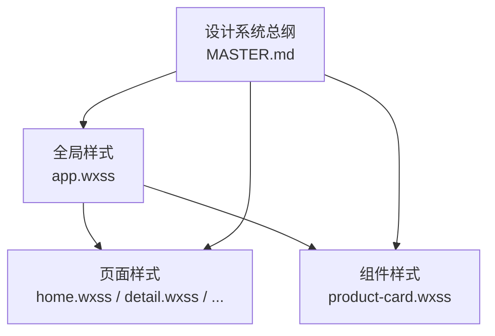
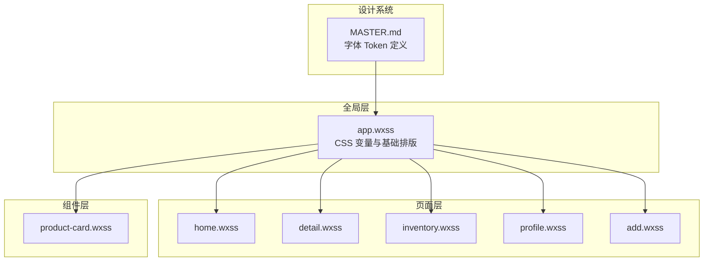
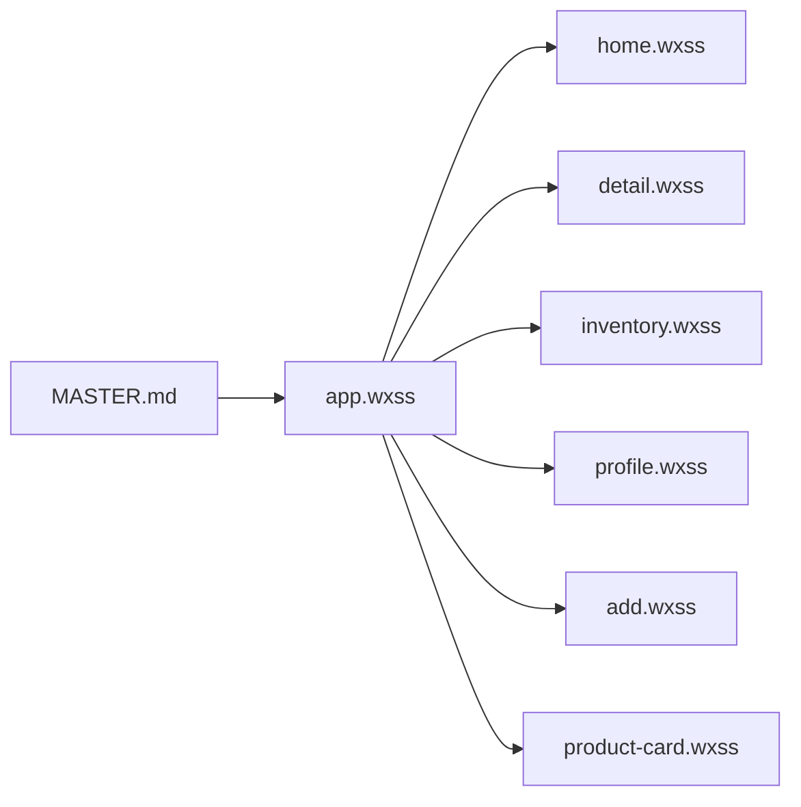

# 字体系统

<cite>
**本文引用的文件**
- [app.wxss](file://miniprogram/app.wxss)
- [MASTER.md](file://design-system/MASTER.md)
- [product-card.wxss](file://miniprogram/components/product-card/product-card.wxss)
- [home.wxss](file://miniprogram/pages/home/home.wxss)
- [detail.wxss](file://miniprogram/pages/detail/detail.wxss)
- [inventory.wxss](file://miniprogram/pages/inventory/inventory.wxss)
- [profile.wxss](file://miniprogram/pages/profile/profile.wxss)
- [add.wxss](file://miniprogram/pages/add/add.wxss)
</cite>

## 目录
1. [简介](#简介)
2. [项目结构](#项目结构)
3. [核心组件](#核心组件)
4. [架构总览](#架构总览)
5. [详细组件分析](#详细组件分析)
6. [依赖分析](#依赖分析)
7. [性能考量](#性能考量)
8. [故障排查指南](#故障排查指南)
9. [结论](#结论)
10. [附录](#附录)

## 简介
本文件面向微信小程序“CosmeticBox”项目，系统化梳理字体系统与排版规范，重点说明：
- 微信小程序系统字体栈策略（苹果系统字体、苹方、微软雅黑等）及其组合逻辑
- 字体 Token 的定义与使用（H1-H3、正文、辅助信息、时间戳、微型标签、统计大数字）
- 基于字重与字号建立清晰视觉层级的方法论
- 中英文混排处理、字体渲染优化与跨设备兼容性建议
- 实际页面中的排版示例与最佳实践

## 项目结构
字体系统与排版规范由全局样式与页面/组件样式共同构成：
- 全局基础：在应用级样式中统一声明字体栈、基础字号、行高与全局文本颜色，并定义各字体 Token 的 CSS 变量
- 页面与组件：按页面/组件维度复用全局 Token，形成一致的视觉层级与排版节奏



图表来源
- [app.wxss:60-76](file://miniprogram/app.wxss#L60-L76)
- [MASTER.md:61-79](file://design-system/MASTER.md#L61-L79)

章节来源
- [app.wxss:60-76](file://miniprogram/app.wxss#L60-L76)
- [MASTER.md:61-79](file://design-system/MASTER.md#L61-L79)

## 核心组件
- 字体栈与基础排版
  - 字体栈：-apple-system, BlinkMacSystemFont, "Helvetica Neue", "PingFang SC", "Microsoft YaHei", sans-serif
  - 基础字号与行高：全局以 14px 为基础字号，行高 1.5
  - 文本颜色：主文字、次文字、辅助文字分级
- 字体 Token 体系
  - H1：28px，ExtraBold，行高 1.3，用于页面主标题
  - H2：20px，Bold，行高 1.4，用于区块标题
  - H3：16px，Bold，行高 1.5，用于卡片标题、产品名
  - 正文 Body：14px，Regular，行高 1.5，用于正文内容
  - 辅助信息 Caption：12px，SemiBold，行高 1.4，用于辅助信息、时间戳
  - 微型 Small：10px，SemiBold，行高 1.3，用于装饰性微型标签
  - 统计 Stat：24-28px，ExtraBold，行高 1.2，用于统计大数字
- 页面与组件复用
  - 页面样式通过变量引用字体 Token，保证层级一致
  - 组件样式（如产品卡片）复用全局 Token，避免重复定义

章节来源
- [app.wxss:60-76](file://miniprogram/app.wxss#L60-L76)
- [app.wxss:94-128](file://miniprogram/app.wxss#L94-L128)
- [MASTER.md:61-79](file://design-system/MASTER.md#L61-L79)

## 架构总览
字体系统采用“设计系统总纲 + 全局样式 + 页面/组件样式”的分层架构：
- 设计系统总纲定义字体 Token 的语义与数值
- 全局样式将 Token 映射为 CSS 变量，提供页面/组件复用
- 页面/组件样式通过类名直接使用 Token，形成统一的视觉层级



图表来源
- [MASTER.md:61-79](file://design-system/MASTER.md#L61-L79)
- [app.wxss:60-76](file://miniprogram/app.wxss#L60-L76)
- [home.wxss:19-28](file://miniprogram/pages/home/home.wxss#L19-L28)
- [detail.wxss:50-56](file://miniprogram/pages/detail/detail.wxss#L50-L56)
- [product-card.wxss:55-70](file://miniprogram/components/product-card/product-card.wxss#L55-L70)

## 详细组件分析

### 字体栈与系统字体策略
- 字体栈顺序体现了平台优先级：苹果系统字体优先，其次为通用系统字体，最后为中文字体（苹方、微软雅黑），确保在不同设备上获得最优渲染
- 该策略在全局样式中集中声明，页面与组件无需重复声明，降低维护成本

章节来源
- [app.wxss:69-71](file://miniprogram/app.wxss#L69-L71)
- [MASTER.md:65-68](file://design-system/MASTER.md#L65-L68)

### 字体 Token 与视觉层级
- 层级构建原则
  - 通过字号递减与字重提升建立主次关系
  - 行高随字号与层级调整，确保阅读密度与可读性平衡
- Token 映射与使用
  - 全局变量：--font-h1-size、--font-h2-size、--font-h3-size、--font-body-size、--font-caption-size、--font-small-size、--font-stat-size
  - 类名：.font-h1、.font-h2、.font-h3、.font-body、.font-caption、.font-small、.font-stat
  - 页面/组件通过类名直接引用，避免硬编码

```mermaid
classDiagram
class 全局样式_app_wxss {
"+CSS 变量 : --font-h1-size\n+CSS 变量 : --font-h2-size\n+... "
"+类名 : .font-h1\n+.font-h2\n+.font-h3\n+.font-body\n+.font-caption\n+.font-small\n+.font-stat"
}
class 页面_home_wxss {
"+使用 .font-h1/.font-h2/.font-h3"
}
class 页面_detail_wxss {
"+使用 .font-h2/.font-caption/.font-body"
}
class 组件_product_card_wxss {
"+使用 .font-h3/.font-caption/.font-small"
}
全局样式_app_wxss --> 页面_home_wxss : "提供 Token"
全局样式_app_wxss --> 页面_detail_wxss : "提供 Token"
全局样式_app_wxss --> 组件_product_card_wxss : "提供 Token"
```

图表来源
- [app.wxss:60-76](file://miniprogram/app.wxss#L60-L76)
- [app.wxss:94-128](file://miniprogram/app.wxss#L94-L128)
- [home.wxss:19-28](file://miniprogram/pages/home/home.wxss#L19-L28)
- [detail.wxss:50-56](file://miniprogram/pages/detail/detail.wxss#L50-L56)
- [product-card.wxss:55-70](file://miniprogram/components/product-card/product-card.wxss#L55-L70)

章节来源
- [app.wxss:60-76](file://miniprogram/app.wxss#L60-L76)
- [app.wxss:94-128](file://miniprogram/app.wxss#L94-L128)
- [MASTER.md:70-79](file://design-system/MASTER.md#L70-L79)

### 页面中的排版示例与最佳实践

#### 首页（home）
- 主标题：使用 H1，强调页面主题
- 区块标题：使用 H2，区分功能模块
- 卡片标题/产品名：使用 H3，突出信息密度
- 统计大数字：使用 Stat，配合语义色背景，强化数据感知
- 时间戳与辅助信息：使用 Caption/Small，保持弱化层级

章节来源
- [home.wxss:19-28](file://miniprogram/pages/home/home.wxss#L19-L28)
- [home.wxss:125-131](file://miniprogram/pages/home/home.wxss#L125-L131)
- [home.wxss:158-163](file://miniprogram/pages/home/home.wxss#L158-L163)
- [home.wxss:100-118](file://miniprogram/pages/home/home.wxss#L100-L118)
- [home.wxss:253-258](file://miniprogram/pages/home/home.wxss#L253-L258)

#### 详情页（detail）
- 产品名称：使用 H2，强调主体信息
- 品牌与规格：使用 Caption，提供补充信息
- 保质期剩余天数：使用 Stat，突出关键数据
- 说明与标签：使用 Body/Caption，确保可读性

章节来源
- [detail.wxss:50-56](file://miniprogram/pages/detail/detail.wxss#L50-L56)
- [detail.wxss:43-48](file://miniprogram/pages/detail/detail.wxss#L43-L48)
- [detail.wxss:92-104](file://miniprogram/pages/detail/detail.wxss#L92-L104)
- [detail.wxss:165-174](file://miniprogram/pages/detail/detail.wxss#L165-L174)

#### 库存页（inventory）
- 搜索栏与输入：使用 Body，保证输入体验
- 分类标签与过滤：使用 Caption，弱化层级
- 空状态标题与描述：使用 H3 与 Caption，形成清晰对比

章节来源
- [inventory.wxss:35-40](file://miniprogram/pages/inventory/inventory.wxss#L35-L40)
- [inventory.wxss:48-65](file://miniprogram/pages/inventory/inventory.wxss#L48-L65)
- [inventory.wxss:128-139](file://miniprogram/pages/inventory/inventory.wxss#L128-L139)

#### 个人中心（profile）
- 用户信息标题：使用 H2
- 分类统计数字：使用 Stat 或较大字号，配合语义色背景
- 设置项名称与值：使用 Body/Caption，保持信息密度

章节来源
- [profile.wxss:41-53](file://miniprogram/pages/profile/profile.wxss#L41-L53)
- [profile.wxss:88-101](file://miniprogram/pages/profile/profile.wxss#L88-L101)
- [profile.wxss:121-140](file://miniprogram/pages/profile/profile.wxss#L121-L140)

#### 添加产品（add）
- 按钮与标签：使用 H3/Body/Caption，确保操作层级清晰
- 表单项标签：使用 Caption，强调说明属性
- 链接解析提示：使用 Caption，弱化提示信息

章节来源
- [add.wxss:190-196](file://miniprogram/pages/add/add.wxss#L190-L196)
- [add.wxss:99-105](file://miniprogram/pages/add/add.wxss#L99-L105)
- [add.wxss:63-82](file://miniprogram/pages/add/add.wxss#L63-L82)

### 组件中的排版实践（以产品卡片为例）
- 产品名：使用 H3，强调主体信息
- 元信息（品牌/规格/时间戳）：使用 Caption/Small，弱化层级
- 状态标签：使用 Caption，配合语义色背景，增强可读性

章节来源
- [product-card.wxss:55-70](file://miniprogram/components/product-card/product-card.wxss#L55-L70)
- [product-card.wxss:112-117](file://miniprogram/components/product-card/product-card.wxss#L112-L117)

## 依赖分析
- 设计系统总纲是字体 Token 的权威来源，全局样式与页面/组件样式均依赖其定义
- 全局样式负责将 Token 映射为 CSS 变量与类名，页面/组件通过类名间接依赖全局样式
- 组件样式与页面样式之间存在复用关系，组件优先复用全局 Token，减少重复定义



图表来源
- [MASTER.md:61-79](file://design-system/MASTER.md#L61-L79)
- [app.wxss:60-76](file://miniprogram/app.wxss#L60-L76)
- [home.wxss:19-28](file://miniprogram/pages/home/home.wxss#L19-L28)
- [detail.wxss:50-56](file://miniprogram/pages/detail/detail.wxss#L50-L56)
- [product-card.wxss:55-70](file://miniprogram/components/product-card/product-card.wxss#L55-L70)

章节来源
- [MASTER.md:61-79](file://design-system/MASTER.md#L61-L79)
- [app.wxss:60-76](file://miniprogram/app.wxss#L60-L76)

## 性能考量
- 字体栈优先使用系统字体，减少字体资源加载，提升首屏渲染速度
- 通过 CSS 变量集中管理字号与行高，避免重复计算与布局抖动
- 在统计大数字等关键信息处使用更高的字重与更大的字号，减少用户识别成本，间接提升交互效率

## 故障排查指南
- 字号/行高异常
  - 检查是否覆盖了全局 Token 或误用了硬编码字号
  - 确认页面/组件类名是否正确引用了 .font-* 类
- 字体显示异常（中英文混排问题）
  - 确认字体栈顺序合理，系统字体优先
  - 对于特殊字符，优先使用系统字体而非自定义字体
- 行高与阅读密度不一致
  - 按层级调整行高，确保 H1/H2 行高更紧凑，正文行高适中

章节来源
- [app.wxss:69-71](file://miniprogram/app.wxss#L69-L71)
- [app.wxss:94-128](file://miniprogram/app.wxss#L94-L128)

## 结论
本项目通过“设计系统总纲 + 全局样式 + 页面/组件样式”的分层架构，建立了稳定且可扩展的字体系统与排版规范。借助系统字体栈与明确的 Token 定义，实现了跨设备的一致性与良好的可读性；通过层级化的字重与字号策略，形成了清晰的信息架构。建议在后续迭代中持续遵循现有规范，保持层级一致性与跨平台兼容性。

## 附录

### 字体 Token 一览（来自设计系统总纲）
- H1：28px，ExtraBold，行高 1.3，用于页面主标题
- H2：20px，Bold，行高 1.4，用于区块标题
- H3：16px，Bold，行高 1.5，用于卡片标题、产品名
- 正文 Body：14px，Regular，行高 1.5，用于正文内容
- 辅助信息 Caption：12px，SemiBold，行高 1.4，用于辅助信息、时间戳
- 微型 Small：10px，SemiBold，行高 1.3，用于装饰性微型标签
- 统计 Stat：24-28px，ExtraBold，行高 1.2，用于统计大数字

章节来源
- [MASTER.md:70-79](file://design-system/MASTER.md#L70-L79)