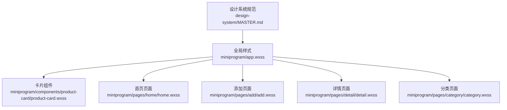
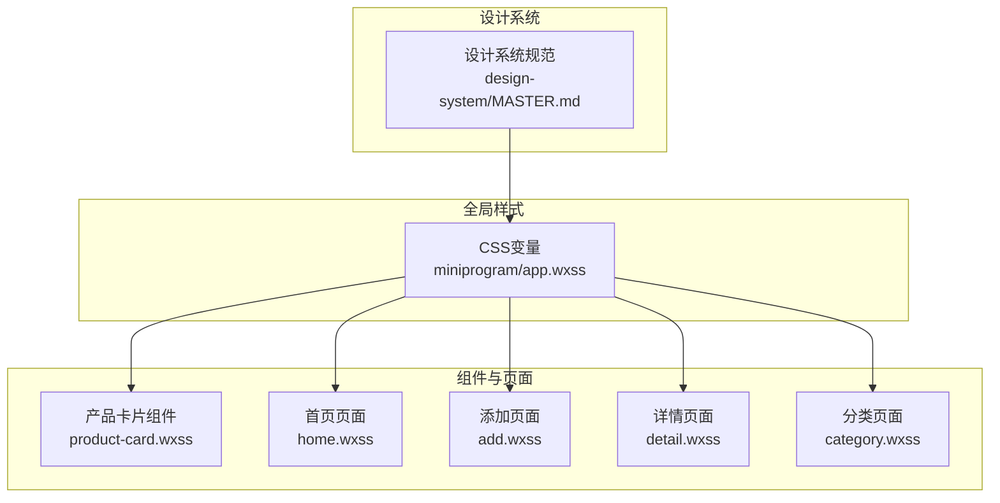
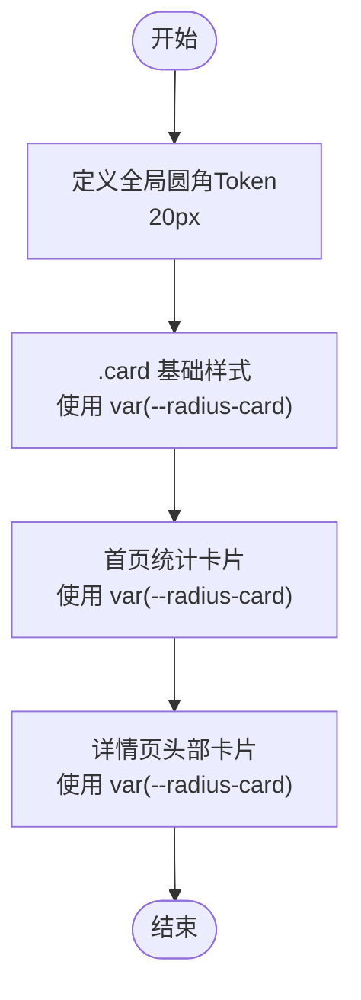
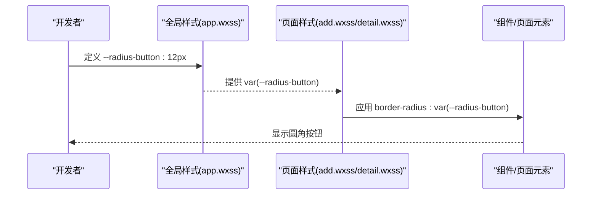
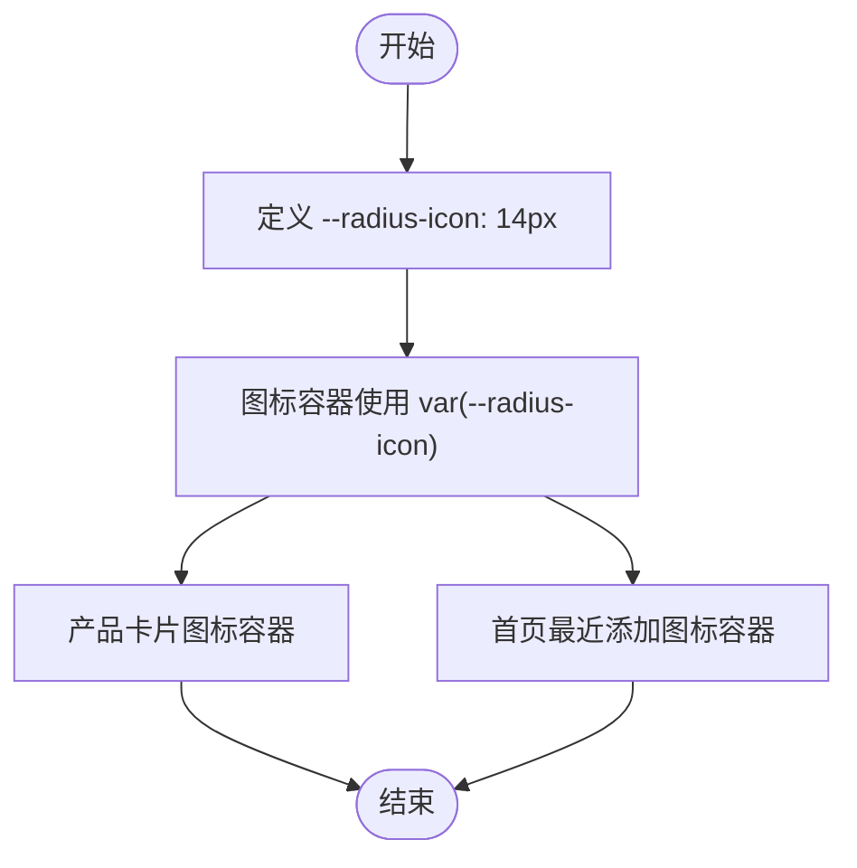
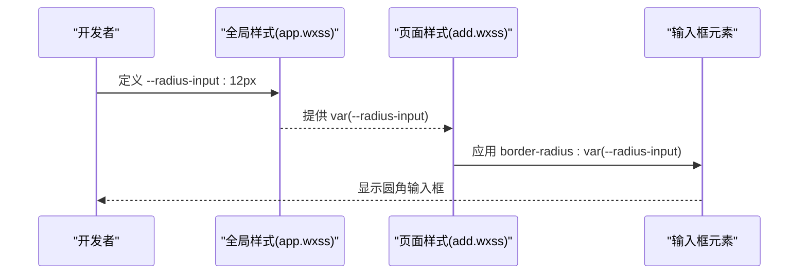
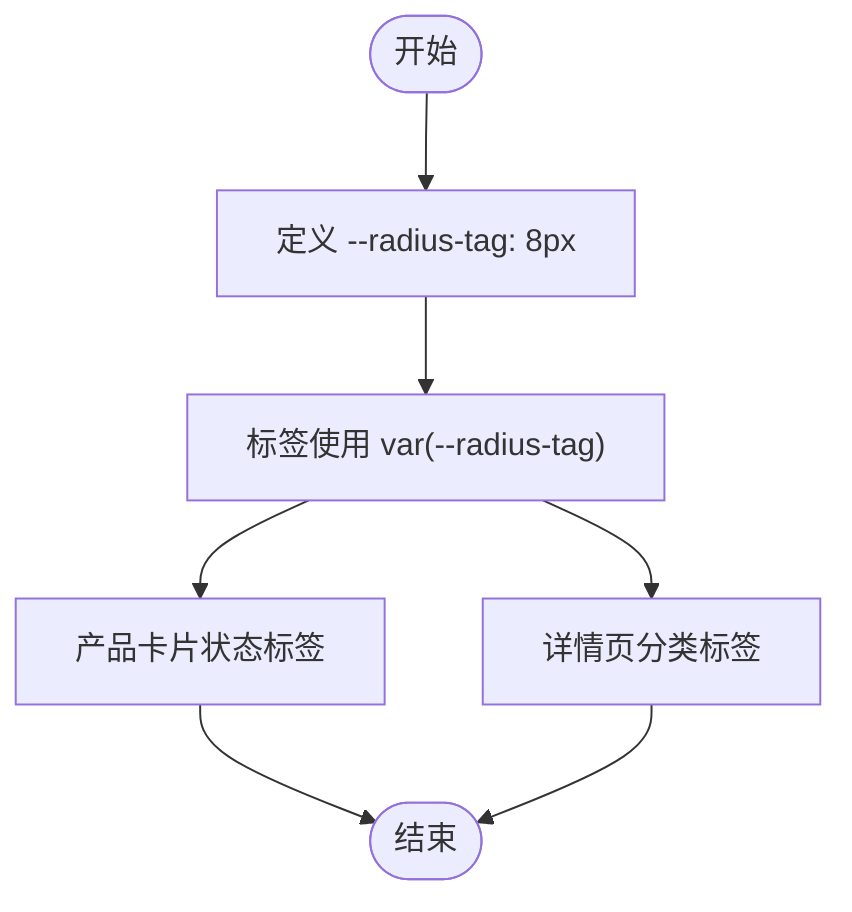
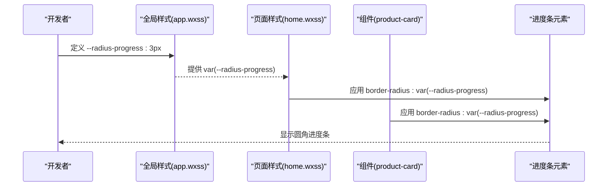
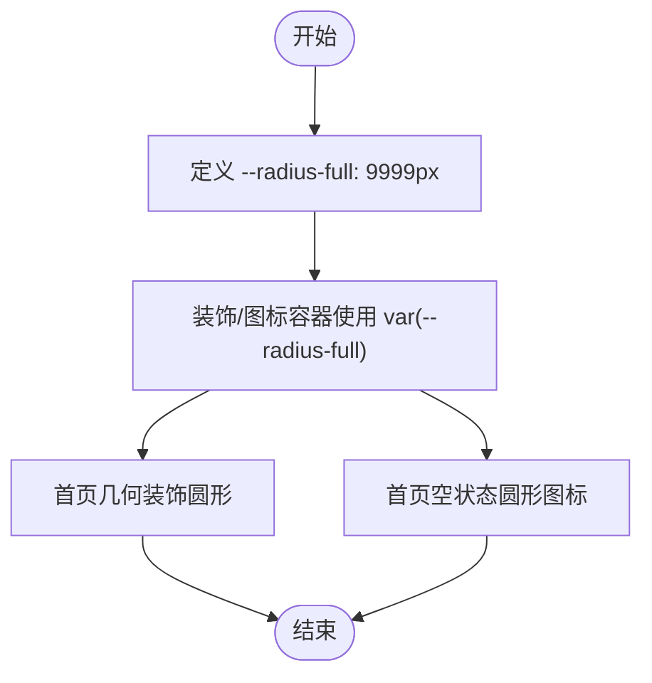
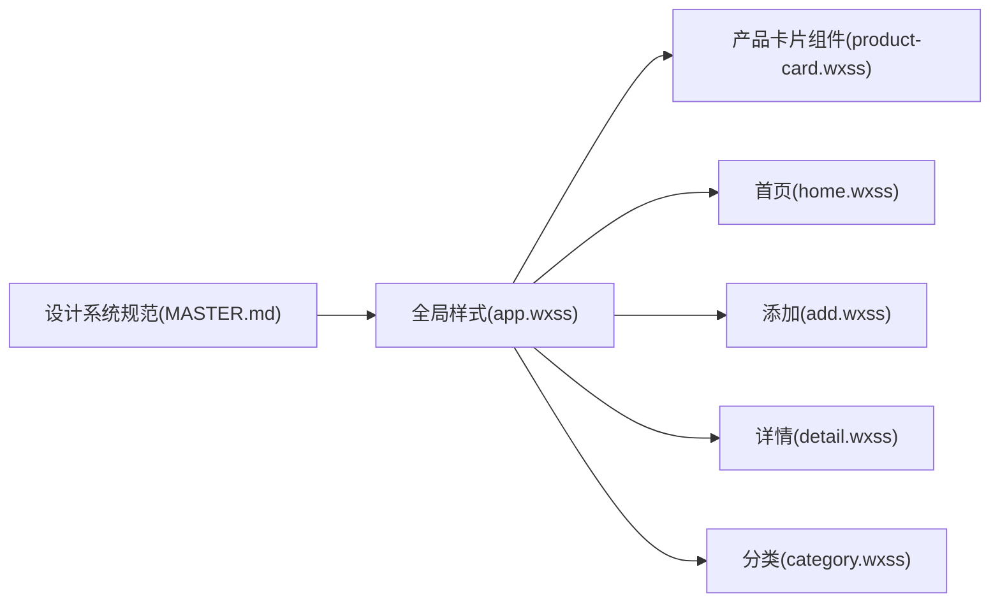

# 圆角系统

<cite>
**本文引用的文件**
- [app.wxss](file://miniprogram/app.wxss)
- [MASTER.md](file://design-system/MASTER.md)
- [product-card.wxss](file://miniprogram/components/product-card/product-card.wxss)
- [home.wxss](file://miniprogram/pages/home/home.wxss)
- [add.wxss](file://miniprogram/pages/add/add.wxss)
- [detail.wxss](file://miniprogram/pages/detail/detail.wxss)
- [category.wxss](file://miniprogram/pages/category/category.wxss)
- [product-card.wxml](file://miniprogram/components/product-card/product-card.wxml)
</cite>

## 目录
1. [简介](#简介)
2. [项目结构](#项目结构)
3. [核心组件](#核心组件)
4. [架构总览](#架构总览)
5. [详细组件分析](#详细组件分析)
6. [依赖分析](#依赖分析)
7. [性能考虑](#性能考虑)
8. [故障排查指南](#故障排查指南)
9. [结论](#结论)
10. [附录](#附录)

## 简介
本文件为“圆角系统”的详细UI设计规范文档，面向开发者与设计师，系统阐述CosmeticBox小程序中圆角Token的定义、数值与应用场景，并结合全局样式与各页面/组件的实际落地，提供可执行的设计规范与最佳实践。重点涵盖以下圆角数值与场景：
- 卡片圆角：20px
- 按钮圆角：12px
- 图标容器圆角：14px
- 输入框圆角：12px
- 标签圆角：8px
- 进度条圆角：3px
- 全圆角：9999px（用于圆形头像、圆形按钮等）

## 项目结构
圆角系统以CSS变量的形式集中定义在全局样式中，再由页面与组件按需引用，形成统一的视觉语言与开发规范。

图表来源
- [app.wxss:38-45](file://miniprogram/app.wxss#L38-L45)
- [MASTER.md:80-92](file://design-system/MASTER.md#L80-L92)

章节来源
- [app.wxss:1-201](file://miniprogram/app.wxss#L1-L201)
- [MASTER.md:80-92](file://design-system/MASTER.md#L80-L92)

## 核心组件
本节聚焦圆角系统的关键Token及其在全局样式中的定义与使用方式。

- 全局圆角Token定义
  - 卡片圆角：20px
  - 按钮圆角：12px
  - 图标容器圆角：14px
  - 输入框圆角：12px
  - 标签圆角：8px
  - 进度条圆角：3px
  - 全圆角：9999px

- 在全局样式中的应用
  - 卡片基础样式使用卡片圆角
  - 按钮基础样式使用按钮圆角
  - 输入框基础样式使用输入框圆角
  - 标签基础样式使用标签圆角
  - 进度条基础样式使用进度条圆角
  - 图标容器在卡片组件中使用图标容器圆角
  - 首页装饰元素使用全圆角

章节来源
- [app.wxss:38-45](file://miniprogram/app.wxss#L38-L45)
- [app.wxss:130-200](file://miniprogram/app.wxss#L130-L200)
- [product-card.wxss:16-25](file://miniprogram/components/product-card/product-card.wxss#L16-L25)
- [home.wxss:30-34](file://miniprogram/pages/home/home.wxss#L30-L34)

## 架构总览
圆角系统采用“Token化 + 全局变量 + 组件/页面复用”的架构，确保设计一致性与开发效率。

图表来源
- [MASTER.md:80-92](file://design-system/MASTER.md#L80-L92)
- [app.wxss:38-45](file://miniprogram/app.wxss#L38-L45)
- [product-card.wxss:16-25](file://miniprogram/components/product-card/product-card.wxss#L16-L25)
- [home.wxss:30-34](file://miniprogram/pages/home/home.wxss#L30-L34)
- [add.wxss:13-21](file://miniprogram/pages/add/add.wxss#L13-L21)
- [detail.wxss:13-20](file://miniprogram/pages/detail/detail.wxss#L13-L20)
- [category.wxss:75-85](file://miniprogram/pages/category/category.wxss#L75-L85)

## 详细组件分析

### 卡片圆角（20px）
- 设计原理
  - 20px圆角营造柔和、现代的卡片形态，符合“极简几何”与“圆润柔和”的设计理念。
  - 与阴影系统配合，形成悬浮感与层次感。
- 视觉效果
  - 卡片具有明显的边界与内边距，提升可读性与信息密度。
- 实际应用
  - 全局卡片基础样式使用该圆角。
  - 首页统计卡片、即将过期警告卡片、最近添加卡片等均使用该圆角。
- 代码路径
  - 全局Token定义：[app.wxss:38-45](file://miniprogram/app.wxss#L38-L45)
  - 卡片基础样式：[app.wxss:130-136](file://miniprogram/app.wxss#L130-L136)
  - 首页统计卡片：[home.wxss:80-86](file://miniprogram/pages/home/home.wxss#L80-L86)
  - 首页警告卡片：[home.wxss:133-141](file://miniprogram/pages/home/home.wxss#L133-L141)
  - 产品卡片组件：[product-card.wxml:5](file://miniprogram/components/product-card/product-card.wxml#L5)

图表来源
- [app.wxss:38-45](file://miniprogram/app.wxss#L38-L45)
- [app.wxss:130-136](file://miniprogram/app.wxss#L130-L136)
- [home.wxss:80-86](file://miniprogram/pages/home/home.wxss#L80-L86)
- [detail.wxss:13-20](file://miniprogram/pages/detail/detail.wxss#L13-L20)

章节来源
- [app.wxss:130-136](file://miniprogram/app.wxss#L130-L136)
- [home.wxss:80-86](file://miniprogram/pages/home/home.wxss#L80-L86)
- [detail.wxss:13-20](file://miniprogram/pages/detail/detail.wxss#L13-L20)

### 按钮圆角（12px）
- 设计原理
  - 12px圆角平衡了可点击性与现代感，适合主按钮、操作按钮与胶囊式Tab。
- 视觉效果
  - 按钮具备明确的点击反馈与阴影，提升交互感知。
- 实际应用
  - 全局按钮基础样式使用该圆角。
  - 添加页面的模式切换Tab、保存按钮等使用该圆角。
  - 详情页的操作按钮、完成徽章等使用该圆角。
- 代码路径
  - 全局Token定义：[app.wxss:38-45](file://miniprogram/app.wxss#L38-L45)
  - 按钮基础样式：[app.wxss:138-149](file://miniprogram/app.wxss#L138-L149)
  - 添加页面模式切换Tab：[add.wxss:13-38](file://miniprogram/pages/add/add.wxss#L13-L38)
  - 详情页操作按钮：[detail.wxss:180-227](file://miniprogram/pages/detail/detail.wxss#L180-L227)

图表来源
- [app.wxss:38-45](file://miniprogram/app.wxss#L38-L45)
- [app.wxss:138-149](file://miniprogram/app.wxss#L138-L149)
- [add.wxss:13-38](file://miniprogram/pages/add/add.wxss#L13-L38)
- [detail.wxss:180-227](file://miniprogram/pages/detail/detail.wxss#L180-L227)

章节来源
- [app.wxss:138-149](file://miniprogram/app.wxss#L138-L149)
- [add.wxss:13-38](file://miniprogram/pages/add/add.wxss#L13-L38)
- [detail.wxss:180-227](file://miniprogram/pages/detail/detail.wxss#L180-L227)

### 图标容器圆角（14px）
- 设计原理
  - 14px圆角适中，既保证触控友好，又不过分突出，契合图标容器的中性角色。
- 视觉效果
  - 图标容器呈现柔和的方形，便于承载图标与渐变背景。
- 实际应用
  - 产品卡片中的图标容器使用该圆角。
  - 首页最近添加、空状态等图标容器使用该圆角。
- 代码路径
  - 全局Token定义：[app.wxss:38-45](file://miniprogram/app.wxss#L38-L45)
  - 产品卡片图标容器：[product-card.wxss:16-25](file://miniprogram/components/product-card/product-card.wxss#L16-L25)
  - 首页最近添加图标容器：[home.wxss:215-224](file://miniprogram/pages/home/home.wxss#L215-L224)

图表来源
- [app.wxss:38-45](file://miniprogram/app.wxss#L38-L45)
- [product-card.wxss:16-25](file://miniprogram/components/product-card/product-card.wxss#L16-L25)
- [home.wxss:215-224](file://miniprogram/pages/home/home.wxss#L215-L224)

章节来源
- [product-card.wxss:16-25](file://miniprogram/components/product-card/product-card.wxss#L16-L25)
- [home.wxss:215-224](file://miniprogram/pages/home/home.wxss#L215-L224)

### 输入框圆角（12px）
- 设计原理
  - 12px圆角与按钮圆角一致，保持交互元素的一致性。
- 视觉效果
  - 输入框具备清晰的焦点与边框，提升可识别性。
- 实际应用
  - 全局输入框基础样式使用该圆角。
  - 添加页面的链接解析输入、过期时间预览等使用该圆角。
- 代码路径
  - 全局Token定义：[app.wxss:38-45](file://miniprogram/app.wxss#L38-L45)
  - 输入框基础样式：[app.wxss:155-165](file://miniprogram/app.wxss#L155-L165)
  - 添加页面链接输入：[add.wxss:51-61](file://miniprogram/pages/add/add.wxss#L51-L61)
  - 添加页面过期时间预览：[add.wxss:151-158](file://miniprogram/pages/add/add.wxss#L151-L158)

图表来源
- [app.wxss:38-45](file://miniprogram/app.wxss#L38-L45)
- [app.wxss:155-165](file://miniprogram/app.wxss#L155-L165)
- [add.wxss:51-61](file://miniprogram/pages/add/add.wxss#L51-L61)
- [add.wxss:151-158](file://miniprogram/pages/add/add.wxss#L151-L158)

章节来源
- [app.wxss:155-165](file://miniprogram/app.wxss#L155-L165)
- [add.wxss:51-61](file://miniprogram/pages/add/add.wxss#L51-L61)
- [add.wxss:151-158](file://miniprogram/pages/add/add.wxss#L151-L158)

### 标签圆角（8px）
- 设计原理
  - 8px圆角体现轻量与信息性，适合状态标签、分类标签等。
- 视觉效果
  - 标签具备明确的语义区分与可读性。
- 实际应用
  - 全局标签基础样式使用该圆角。
  - 产品卡片的状态标签、详情页的分类标签等使用该圆角。
- 代码路径
  - 全局Token定义：[app.wxss:38-45](file://miniprogram/app.wxss#L38-L45)
  - 标签基础样式：[app.wxss:167-174](file://miniprogram/app.wxss#L167-L174)
  - 产品卡片状态标签：[product-card.wxss:73-79](file://miniprogram/components/product-card/product-card.wxss#L73-L79)
  - 详情页分类标签：[detail.wxss:64-71](file://miniprogram/pages/detail/detail.wxss#L64-L71)

图表来源
- [app.wxss:38-45](file://miniprogram/app.wxss#L38-L45)
- [app.wxss:167-174](file://miniprogram/app.wxss#L167-L174)
- [product-card.wxss:73-79](file://miniprogram/components/product-card/product-card.wxss#L73-L79)
- [detail.wxss:64-71](file://miniprogram/pages/detail/detail.wxss#L64-L71)

章节来源
- [app.wxss:167-174](file://miniprogram/app.wxss#L167-L174)
- [product-card.wxss:73-79](file://miniprogram/components/product-card/product-card.wxss#L73-L79)
- [detail.wxss:64-71](file://miniprogram/pages/detail/detail.wxss#L64-L71)

### 进度条圆角（3px）
- 设计原理
  - 3px圆角体现极细线条的精致感，适合进度条这类弱引导元素。
- 视觉效果
  - 进度条具备柔和的边界，与背景形成微妙对比。
- 实际应用
  - 全局进度条基础样式使用该圆角。
  - 产品卡片与首页的进度条使用该圆角。
- 代码路径
  - 全局Token定义：[app.wxss:38-45](file://miniprogram/app.wxss#L38-L45)
  - 进度条基础样式：[app.wxss:176-188](file://miniprogram/app.wxss#L176-L188)
  - 产品卡片进度条：[product-card.wxml:22-27](file://miniprogram/components/product-card/product-card.wxml#L22-L27)
  - 首页统计卡片进度条：[home.wxss:101-110](file://miniprogram/pages/home/home.wxss#L101-L110)

图表来源
- [app.wxss:38-45](file://miniprogram/app.wxss#L38-L45)
- [app.wxss:176-188](file://miniprogram/app.wxss#L176-L188)
- [product-card.wxml:22-27](file://miniprogram/components/product-card/product-card.wxml#L22-L27)
- [home.wxss:101-110](file://miniprogram/pages/home/home.wxss#L101-L110)

章节来源
- [app.wxss:176-188](file://miniprogram/app.wxss#L176-L188)
- [product-card.wxml:22-27](file://miniprogram/components/product-card/product-card.wxml#L22-L27)
- [home.wxss:101-110](file://miniprogram/pages/home/home.wxss#L101-L110)

### 全圆角（9999px）
- 设计原理
  - 9999px用于生成真正的圆形，适用于头像、圆形按钮等需要完整圆的场景。
- 视觉效果
  - 圆形元素具备完整的闭合边界，常用于强调身份或操作入口。
- 实际应用
  - 首页顶部几何装饰使用全圆角。
  - 首页空状态图标容器使用全圆角。
- 代码路径
  - 全局Token定义：[app.wxss:38-45](file://miniprogram/app.wxss#L38-L45)
  - 首页几何装饰：[home.wxss:30-34](file://miniprogram/pages/home/home.wxss#L30-L34)
  - 首页空状态图标容器：[home.wxss:279-288](file://miniprogram/pages/home/home.wxss#L279-L288)

图表来源
- [app.wxss:38-45](file://miniprogram/app.wxss#L38-L45)
- [home.wxss:30-34](file://miniprogram/pages/home/home.wxss#L30-L34)
- [home.wxss:279-288](file://miniprogram/pages/home/home.wxss#L279-L288)

章节来源
- [home.wxss:30-34](file://miniprogram/pages/home/home.wxss#L30-L34)
- [home.wxss:279-288](file://miniprogram/pages/home/home.wxss#L279-L288)

## 依赖分析
圆角系统通过CSS变量在全局样式中集中定义，再由页面与组件按需引用，形成低耦合、高复用的依赖关系。

图表来源
- [MASTER.md:80-92](file://design-system/MASTER.md#L80-L92)
- [app.wxss:38-45](file://miniprogram/app.wxss#L38-L45)
- [product-card.wxss:16-25](file://miniprogram/components/product-card/product-card.wxss#L16-L25)
- [home.wxss:30-34](file://miniprogram/pages/home/home.wxss#L30-L34)
- [add.wxss:13-38](file://miniprogram/pages/add/add.wxss#L13-L38)
- [detail.wxss:13-20](file://miniprogram/pages/detail/detail.wxss#L13-L20)
- [category.wxss:75-85](file://miniprogram/pages/category/category.wxss#L75-L85)

章节来源
- [MASTER.md:80-92](file://design-system/MASTER.md#L80-L92)
- [app.wxss:38-45](file://miniprogram/app.wxss#L38-L45)

## 性能考虑
- 使用CSS变量统一管理圆角Token，避免重复定义与维护成本。
- 圆角数值较小且集中在全局，渲染开销可控。
- 建议在自定义组件中优先使用全局变量，减少页面级硬编码，提高复用性与一致性。

## 故障排查指南
- 圆角未生效
  - 检查是否使用了正确的CSS变量（如 var(--radius-card)）。
  - 确认页面样式是否正确引入全局样式。
- 圆角与背景冲突
  - 对于需要完全圆形的元素，确保容器尺寸与圆角设置一致，避免裁剪。
- 圆角与其他样式叠加
  - 注意圆角与阴影、边框的叠加效果，必要时调整z-index或背景色。

## 结论
圆角系统通过统一的Token定义与全局变量引用，实现了设计一致性与开发效率的平衡。建议在新增组件或页面时，严格遵循本规范，优先使用全局圆角变量，确保视觉与交互体验的一致性。

## 附录
- 设计系统规范参考：[MASTER.md:80-92](file://design-system/MASTER.md#L80-L92)
- 全局圆角Token定义：[app.wxss:38-45](file://miniprogram/app.wxss#L38-L45)
- 产品卡片组件示例：[product-card.wxml:5](file://miniprogram/components/product-card/product-card.wxml#L5)