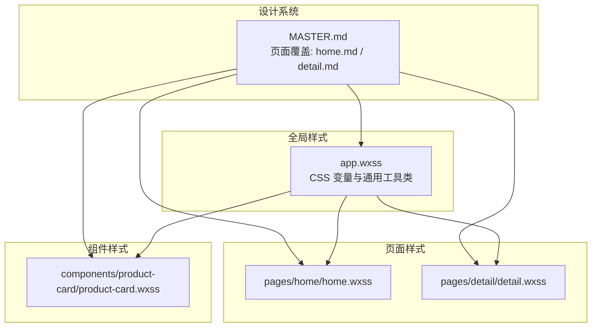
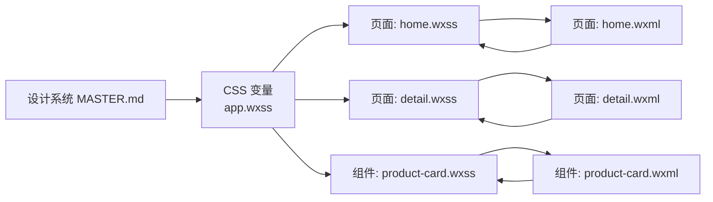
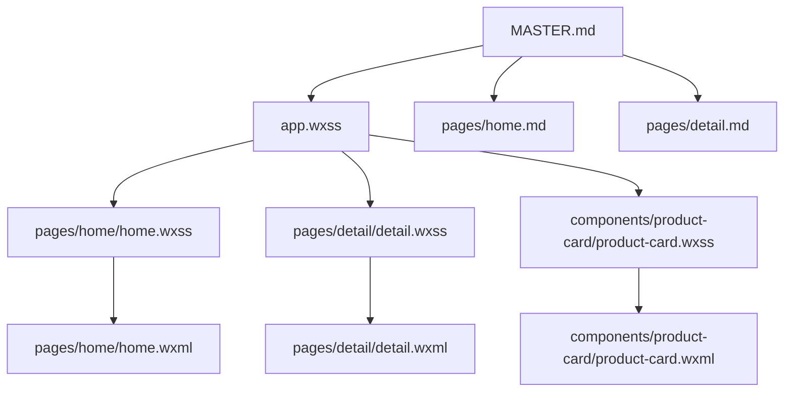

# 组件规范

<cite>
**本文引用的文件**
- [MASTER.md](file://design-system/MASTER.md)
- [app.wxss](file://miniprogram/app.wxss)
- [home.wxss](file://miniprogram/pages/home/home.wxss)
- [detail.wxss](file://miniprogram/pages/detail/detail.wxss)
- [product-card.wxss](file://miniprogram/components/product-card/product-card.wxss)
- [product-card.wxml](file://miniprogram/components/product-card/product-card.wxml)
- [home.wxml](file://miniprogram/pages/home/home.wxml)
- [home.md](file://design-system/pages/home.md)
- [detail.md](file://design-system/pages/detail.md)
</cite>

## 目录
1. [简介](#简介)
2. [项目结构](#项目结构)
3. [核心组件](#核心组件)
4. [架构总览](#架构总览)
5. [详细组件分析](#详细组件分析)
6. [依赖分析](#依赖分析)
7. [性能考虑](#性能考虑)
8. [故障排查指南](#故障排查指南)
9. [结论](#结论)
10. [附录](#附录)

## 简介
本文件为“CosmeticBox”微信小程序的组件规范文档，面向前端开发者与设计同学，系统化梳理并落地设计系统中的圆角、阴影、间距三大视觉体系，以及组件一致性原则与扩展指南。文档以仓库内的设计系统规范与实际样式实现为依据，确保设计与工程实现一致，提升开发效率与用户体验一致性。

## 项目结构
该小程序采用“设计系统 + 页面 + 组件”的分层组织方式：
- 设计系统：统一的 MASTER 规范与页面级覆盖文档，定义色彩、字体、圆角、阴影、间距、图标、动画、游戏化元素等。
- 页面样式：各页面基于 MASTER 规范进行局部覆盖，体现页面职责与布局结构。
- 组件样式：可复用的基础组件（如产品卡片）封装通用样式与交互。

图表来源
- [MASTER.md](file://design-system/MASTER.md)
- [app.wxss](file://miniprogram/app.wxss)
- [home.wxss](file://miniprogram/pages/home/home.wxss)
- [detail.wxss](file://miniprogram/pages/detail/detail.wxss)
- [product-card.wxss](file://miniprogram/components/product-card/product-card.wxss)

章节来源
- [MASTER.md](file://design-system/MASTER.md)
- [app.wxss](file://miniprogram/app.wxss)

## 核心组件
本节聚焦三大视觉体系：圆角系统、阴影系统、间距系统，并结合页面与组件的实际使用进行说明。

- 圆角系统
  - 卡片圆角：20px
  - 按钮圆角：12px
  - 图标容器圆角：14px
  - 输入框圆角：12px
  - 标签圆角：8px
  - 进度条圆角：3px
  - 全圆角：9999px（用于圆形头像、圆形按钮）

- 阴影系统
  - 卡片默认阴影
  - 卡片按下阴影
  - 浮层阴影
  - 按钮按下阴影

- 间距系统（基于 8px 网格）
  - 极小间距：4px
  - 元素内间距：8px
  - 组件内边距：12px
  - 区块内边距：16px
  - 区块间间距：24px
  - 大区块分隔：32px

章节来源
- [MASTER.md](file://design-system/MASTER.md)
- [app.wxss](file://miniprogram/app.wxss)

## 架构总览
设计系统通过 CSS 变量在全局生效，页面与组件样式直接消费变量，形成“设计规范 → CSS 变量 → 组件/页面样式”的单向依赖链路。页面级覆盖文档用于细化页面职责与布局结构，确保风格一致与落地可执行。

图表来源
- [MASTER.md](file://design-system/MASTER.md)
- [app.wxss](file://miniprogram/app.wxss)
- [home.wxss](file://miniprogram/pages/home/home.wxss)
- [detail.wxss](file://miniprogram/pages/detail/detail.wxss)
- [product-card.wxss](file://miniprogram/components/product-card/product-card.wxss)
- [home.wxml](file://miniprogram/pages/home/home.wxml)
- [product-card.wxml](file://miniprogram/components/product-card/product-card.wxml)

## 详细组件分析

### 圆角系统
- 设计规范
  - 卡片圆角：20px
  - 按钮圆角：12px
  - 图标容器圆角：14px
  - 输入框圆角：12px
  - 标签圆角：8px
  - 进度条圆角：3px
  - 全圆角：9999px

- 实现与应用
  - 全局变量：在 app.wxss 中定义并暴露为 CSS 变量，供页面与组件统一消费。
  - 页面应用：首页统计卡片、警告卡片、最近添加卡片等均使用 20px 圆角；按钮高度固定 44px，圆角 12px；图标容器统一 44x44px，圆角 14px。
  - 组件应用：产品卡片内部的图标容器、状态标签、进度条等均使用对应圆角变量。

- 使用建议
  - 优先使用全局变量，避免硬编码具体数值。
  - 不同组件类型严格区分圆角取值，避免视觉混乱。
  - 圆形元素（头像、按钮）统一使用 9999px 圆角。

章节来源
- [MASTER.md](file://design-system/MASTER.md)
- [app.wxss](file://miniprogram/app.wxss)
- [home.wxss](file://miniprogram/pages/home/home.wxss)
- [detail.wxss](file://miniprogram/pages/detail/detail.wxss)
- [product-card.wxss](file://miniprogram/components/product-card/product-card.wxss)

### 阴影系统
- 设计规范
  - 卡片默认阴影
  - 卡片按下阴影
  - 浮层阴影
  - 按钮按下阴影

- 实现与应用
  - 全局变量：在 app.wxss 中定义阴影变量，页面与组件直接消费。
  - 页面应用：首页统计卡片、警告卡片、最近添加卡片等使用默认阴影；详情页头部卡片、信息卡片等使用默认阴影。
  - 组件应用：产品卡片继承卡片基础样式，自动获得阴影与圆角。

- 使用建议
  - 卡片类组件统一使用默认阴影；需要强调或交互反馈时再叠加按下态阴影。
  - 浮层类组件（弹窗、下拉菜单等）使用浮层阴影，避免与卡片阴影混淆。
  - 按钮按下态阴影与按钮样式组合使用，增强触控反馈。

章节来源
- [MASTER.md](file://design-system/MASTER.md)
- [app.wxss](file://miniprogram/app.wxss)
- [home.wxss](file://miniprogram/pages/home/home.wxss)
- [detail.wxss](file://miniprogram/pages/detail/detail.wxss)
- [product-card.wxss](file://miniprogram/components/product-card/product-card.wxss)

### 间距系统（8px 网格）
- 设计规范
  - 极小间距：4px
  - 元素内间距：8px
  - 组件内边距：12px
  - 区块内边距：16px
  - 区块间间距：24px
  - 大区块分隔：32px

- 实现与应用
  - 全局变量：在 app.wxss 中定义 --space-* 变量，页面与组件统一消费。
  - 页面应用：首页顶部渐变区域、统计卡片行、区块标题、警告卡片、最近添加卡片、空状态等广泛使用。
  - 组件应用：产品卡片内部图标与信息、状态标签、进度条与剩余天数之间的间距均使用网格化变量。

- 使用建议
  - 优先使用网格化变量，避免随意调整间距导致视觉不一致。
  - 在复杂布局中，建议以“区块内边距”和“区块间间距”为主轴，配合“组件内边距”进行细节调整。
  - 极小间距仅用于细粒度装饰或微间距，不宜用于主要元素之间的留白。

章节来源
- [MASTER.md](file://design-system/MASTER.md)
- [app.wxss](file://miniprogram/app.wxss)
- [home.wxss](file://miniprogram/pages/home/home.wxss)
- [detail.wxss](file://miniprogram/pages/detail/detail.wxss)
- [product-card.wxss](file://miniprogram/components/product-card/product-card.wxss)

### 组件设计一致性原则
- 统一变量消费：所有组件与页面样式应通过 CSS 变量消费设计系统参数，避免硬编码。
- 类型化圆角：卡片、按钮、输入框、标签、进度条分别使用对应的圆角变量，保持类型一致性。
- 层级化阴影：卡片默认阴影、按下态阴影、浮层阴影明确区分，避免层级混淆。
- 网格式布局：间距以 8px 为基准网格，保证视觉节奏与呼吸感。
- 语义化命名：颜色、尺寸、状态等命名遵循设计系统语义，便于维护与扩展。

章节来源
- [MASTER.md](file://design-system/MASTER.md)
- [app.wxss](file://miniprogram/app.wxss)

### 扩展指南
- 新增组件时，优先复用现有变量与类名，减少重复定义。
- 若确需新增变量，应在 MASTER 中补充并在 app.wxss 中声明，确保全局可用。
- 页面级覆盖：若页面需要局部调整，可在对应页面样式中进行覆盖，但需在页面覆盖文档中记录原因与边界。
- 组件复用：将通用样式抽离为组件，复用卡片、按钮、输入框、标签、进度条等基础样式，降低维护成本。

章节来源
- [MASTER.md](file://design-system/MASTER.md)
- [app.wxss](file://miniprogram/app.wxss)
- [home.md](file://design-system/pages/home.md)
- [detail.md](file://design-system/pages/detail.md)

## 依赖分析
设计系统的依赖关系清晰：MASTER 规范 → CSS 变量 → 页面样式 → WXML 结构。页面覆盖文档用于约束页面布局与交互，确保风格一致。

图表来源
- [MASTER.md](file://design-system/MASTER.md)
- [app.wxss](file://miniprogram/app.wxss)
- [home.wxss](file://miniprogram/pages/home/home.wxss)
- [detail.wxss](file://miniprogram/pages/detail/detail.wxss)
- [product-card.wxss](file://miniprogram/components/product-card/product-card.wxss)
- [home.wxml](file://miniprogram/pages/home/home.wxml)
- [product-card.wxml](file://miniprogram/components/product-card/product-card.wxml)
- [home.md](file://design-system/pages/home.md)
- [detail.md](file://design-system/pages/detail.md)

章节来源
- [MASTER.md](file://design-system/MASTER.md)
- [app.wxss](file://miniprogram/app.wxss)
- [home.wxss](file://miniprogram/pages/home/home.wxss)
- [detail.wxss](file://miniprogram/pages/detail/detail.wxss)
- [product-card.wxss](file://miniprogram/components/product-card/product-card.wxss)
- [home.wxml](file://miniprogram/pages/home/home.wxml)
- [product-card.wxml](file://miniprogram/components/product-card/product-card.wxml)
- [home.md](file://design-system/pages/home.md)
- [detail.md](file://design-system/pages/detail.md)

## 性能考虑
- CSS 变量集中管理：通过全局变量统一管理圆角、阴影、间距等，减少重复计算与内存占用。
- 组件复用：通过基础卡片、按钮、输入框、标签、进度条等组件样式复用，降低样式体积与渲染开销。
- 语义化命名：清晰的类名与变量命名有助于减少选择器复杂度，提升渲染性能。
- 动画与过渡：进度条动画使用宽度过渡，避免频繁重排；按钮按下态阴影与颜色变化应控制在合理范围内，避免过度动画影响性能。

## 故障排查指南
- 圆角不生效
  - 检查是否使用了正确的 CSS 变量（如 --radius-card、--radius-button 等）。
  - 确认父容器未被其他样式覆盖（如固定圆角值或 overflow 隐藏）。

- 阴影异常
  - 检查是否正确使用了全局阴影变量（如 --shadow-card、--shadow-float 等）。
  - 注意卡片按下态阴影与默认阴影的区别，避免误用。

- 间距错乱
  - 确认使用了网格化变量（--space-xs、--space-sm、--space-md、--space-lg、--space-xl、--space-2xl）。
  - 在复杂布局中，检查父子元素的 padding/margin 是否叠加导致视觉偏差。

- 页面覆盖冲突
  - 若页面出现与 MASTER 规范不一致的情况，检查页面覆盖文档（如 home.md、detail.md）中的局部规则。
  - 确保页面样式未覆盖到超出范围的元素。

章节来源
- [MASTER.md](file://design-system/MASTER.md)
- [app.wxss](file://miniprogram/app.wxss)
- [home.wxss](file://miniprogram/pages/home/home.wxss)
- [detail.wxss](file://miniprogram/pages/detail/detail.wxss)
- [product-card.wxss](file://miniprogram/components/product-card/product-card.wxss)
- [home.md](file://design-system/pages/home.md)
- [detail.md](file://design-system/pages/detail.md)

## 结论
本组件规范以设计系统 MASTER 为核心，结合 app.wxss 的 CSS 变量与页面、组件样式实现，建立了统一的圆角、阴影、间距体系。通过严格的变量消费、类型化圆角、层级化阴影与网格式布局，确保了组件与页面在视觉与交互上的一致性。建议在后续开发中持续遵循本规范，逐步完善页面覆盖文档与组件库，提升整体开发效率与用户体验。

## 附录
- 页面覆盖文档
  - 首页覆盖：[home.md](file://design-system/pages/home.md)
  - 详情页覆盖：[detail.md](file://design-system/pages/detail.md)

章节来源
- [home.md](file://design-system/pages/home.md)
- [detail.md](file://design-system/pages/detail.md)