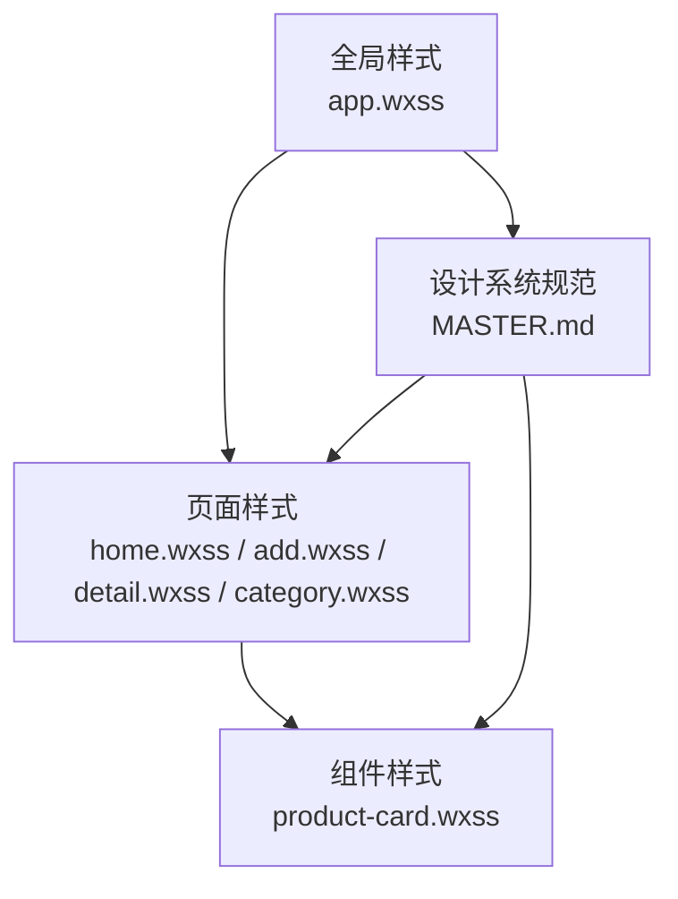
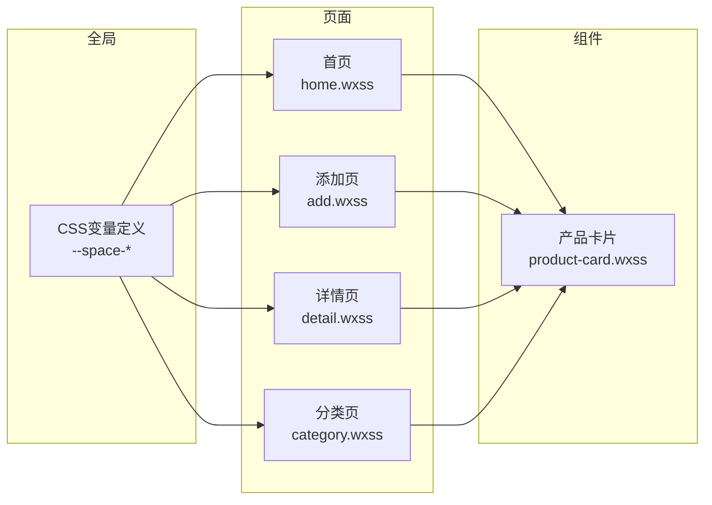
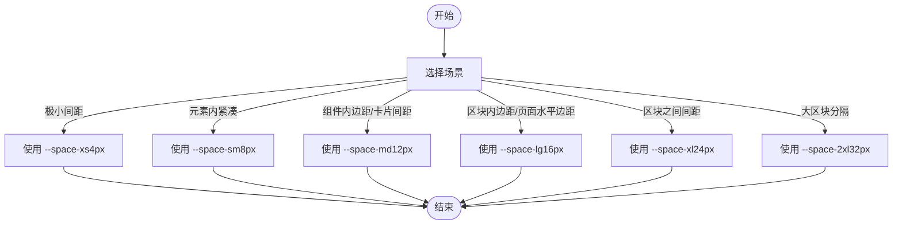
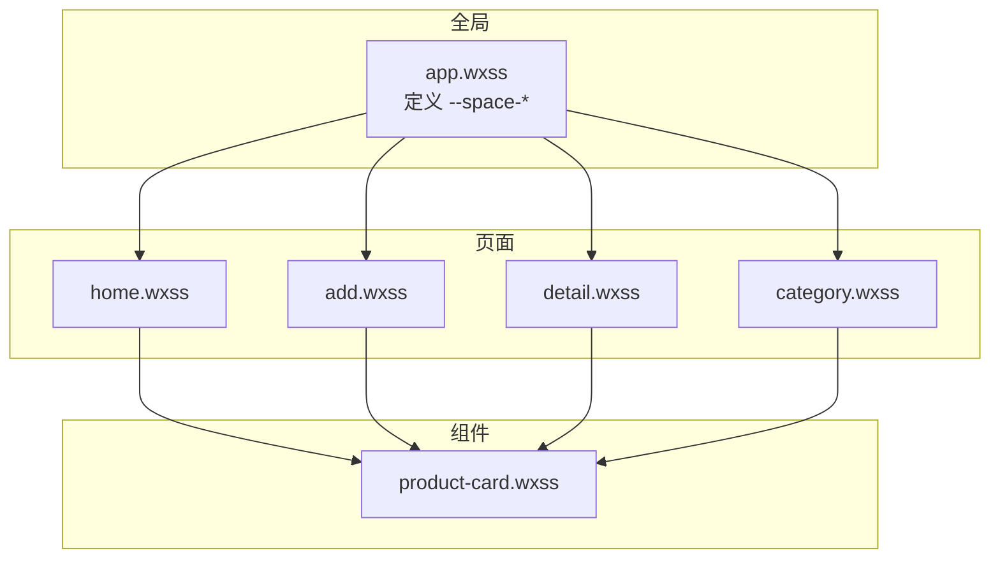

# 间距系统

<cite>
**本文引用的文件**
- [MASTER.md](file://design-system/MASTER.md)
- [app.wxss](file://miniprogram/app.wxss)
- [product-card.wxss](file://miniprogram/components/product-card/product-card.wxss)
- [home.wxss](file://miniprogram/pages/home/home.wxss)
- [add.wxss](file://miniprogram/pages/add/add.wxss)
- [detail.wxss](file://miniprogram/pages/detail/detail.wxss)
- [category.wxss](file://miniprogram/pages/category/category.wxss)
- [home.md](file://design-system/pages/home.md)
- [add.md](file://design-system/pages/add.md)
- [detail.md](file://design-system/pages/detail.md)
- [inventory.md](file://design-system/pages/inventory.md)
</cite>

## 目录
1. [引言](#引言)
2. [项目结构](#项目结构)
3. [核心组件](#核心组件)
4. [架构总览](#架构总览)
5. [详细组件分析](#详细组件分析)
6. [依赖分析](#依赖分析)
7. [性能考虑](#性能考虑)
8. [故障排查指南](#故障排查指南)
9. [结论](#结论)
10. [附录](#附录)

## 引言
本文件面向CosmeticBox微信小程序的UI设计与前端实现，系统化梳理“间距系统”的设计原则、Token定义、使用场景与最佳实践，并结合实际页面与组件样式进行落地说明。该系统采用8px网格体系，确保视觉节奏统一、布局清晰、具备良好的“呼吸感”。

## 项目结构
间距系统贯穿全局样式与各页面/组件样式，形成自上而下的设计令牌传递链路：
- 全局CSS变量定义于全局样式文件，承载间距Token
- 页面样式通过var(--space-*)引用，形成统一的视觉节奏
- 组件样式复用页面间距策略，保证跨页面一致性

图表来源
- [app.wxss:52-58](file://miniprogram/app.wxss#L52-L58)
- [home.wxss:121-123](file://miniprogram/pages/home/home.wxss#L121-L123)
- [add.wxss:6](file://miniprogram/pages/add/add.wxss#L6)
- [detail.wxss:14](file://miniprogram/pages/detail/detail.wxss#L14)
- [category.wxss:6](file://miniprogram/pages/category/category.wxss#L6)
- [product-card.wxss:5](file://miniprogram/components/product-card/product-card.wxss#L5)

章节来源
- [app.wxss:52-58](file://miniprogram/app.wxss#L52-L58)
- [MASTER.md:103-115](file://design-system/MASTER.md#L103-L115)

## 核心组件
- 间距Token（基于8px网格）
  - --space-xs：4px（极小间距）
  - --space-sm：8px（元素内紧凑间距）
  - --space-md：12px（组件内边距、卡片间距）
  - --space-lg：16px（区块内边距、页面水平边距）
  - --space-xl：24px（区块之间间距）
  - --space-2xl：32px（大区块分隔）

- 设计理念与视觉平衡
  - 通过“极简几何”“激励反馈”“清新柔和”的三大理念，配合8px网格，营造清晰、有序、有呼吸感的界面节奏
  - “呼吸感”由合理的留白与层级间距构成，避免密集排列导致的拥挤感

章节来源
- [MASTER.md:103-115](file://design-system/MASTER.md#L103-L115)
- [MASTER.md:5](file://design-system/MASTER.md#L5-L11)

## 架构总览
下图展示间距Token在全局、页面与组件之间的传递与使用关系。

图表来源
- [app.wxss:52-58](file://miniprogram/app.wxss#L52-L58)
- [home.wxss:121-123](file://miniprogram/pages/home/home.wxss#L121-L123)
- [add.wxss:6](file://miniprogram/pages/add/add.wxss#L6)
- [detail.wxss:14](file://miniprogram/pages/detail/detail.wxss#L14)
- [category.wxss:6](file://miniprogram/pages/category/category.wxss#L6)
- [product-card.wxss:5](file://miniprogram/components/product-card/product-card.wxss#L5)

## 详细组件分析

### 间距Token与命名映射
- --space-xs：4px（极小间距）
- --space-sm：8px（元素内紧凑间距）
- --space-md：12px（组件内边距、卡片间距）
- --space-lg：16px（区块内边距、页面水平边距）
- --space-xl：24px（区块之间间距）
- --space-2xl：32px（大区块分隔）

章节来源
- [MASTER.md:107-114](file://design-system/MASTER.md#L107-L114)

### 页面级间距应用

#### 首页（home.wxss）
- 顶部渐变区域：内边距使用--space-xl（24px）与--space-lg（16px）
- 统计卡片行：卡片间使用--space-sm（8px）的gap
- 区块标题：使用--space-md（12px）的下边距
- 即将过期警告卡片：左右间距使用--space-md（12px），边框左留白4px
- 最近添加：卡片间使用--space-sm（8px），卡片内使用--space-md（12px）与--space-lg（16px）
- 空状态：上下使用--space-xl（24px），图标容器与文本间距使用--space-lg（16px）

章节来源
- [home.wxss:121-123](file://miniprogram/pages/home/home.wxss#L121-L123)
- [home.wxss:134-145](file://miniprogram/pages/home/home.wxss#L134-L145)
- [home.wxss:207-213](file://miniprogram/pages/home/home.wxss#L207-L213)
- [home.wxss:271-308](file://miniprogram/pages/home/home.wxss#L271-L308)
- [home.md:29-46](file://design-system/pages/home.md#L29-L46)

#### 添加页（add.wxss）
- 页面内边距：使用--space-lg（16px）
- 模式切换Tab：外间距--space-xl（24px），内部元素间距--space-sm（8px）
- 链接导入区域：外间距--space-xl（24px），输入行gap--space-sm（8px）
- 表单区域：字段间--space-lg（16px），label与控件--space-xs（4px）的垂直间距
- 分类标签组：gap--space-sm（8px）
- 保存按钮：上下使用--space-lg（16px）的内边距

章节来源
- [add.wxss:6](file://miniprogram/pages/add/add.wxss#L6)
- [add.wxss:18](file://miniprogram/pages/add/add.wxss#L18)
- [add.wxss:41](file://miniprogram/pages/add/add.wxss#L41)
- [add.wxss:95](file://miniprogram/pages/add/add.wxss#L95)
- [add.wxss:114](file://miniprogram/pages/add/add.wxss#L114)
- [add.md:32-58](file://design-system/pages/add.md#L32-L58)

#### 详情页（detail.wxss）
- 页面内边距：使用--space-lg（16px）
- 产品头部卡片：内边距--space-xl（24px）与--space-lg（16px）
- 保质期状态卡片：内边距--space-xl（24px）与--space-lg（16px），底部间距--space-lg（16px）
- 详细信息卡片：底部间距--space-lg（16px）
- 操作按钮区：外间距--space-lg（16px），按钮间gap--space-md（12px）

章节来源
- [detail.wxss:14](file://miniprogram/pages/detail/detail.wxss#L14)
- [detail.wxss:78-85](file://miniprogram/pages/detail/detail.wxss#L78-L85)
- [detail.wxss:150](file://miniprogram/pages/detail/detail.wxss#L150)
- [detail.md:32-51](file://design-system/pages/detail.md#L32-L51)

#### 分类页（category.wxss）
- 页面内边距：使用--space-lg（16px）
- 区块：外间距--space-xl（24px）
- 列表项：左右内边距--space-lg（16px），底部边框上间距--space-sm（8px）

章节来源
- [category.wxss:6](file://miniprogram/pages/category/category.wxss#L6)
- [category.wxss:12](file://miniprogram/pages/category/category.wxss#L12)
- [category.wxss:29](file://miniprogram/pages/category/category.wxss#L29)

### 组件级间距应用

#### 产品卡片（product-card.wxss）
- 卡片底部外间距：--space-md（12px）
- 卡片顶部flex布局：gap--space-md（12px），底部外间距--space-md（12px）
- 状态标签：内边距--space-xs（4px）与固定水平内边距10px
- 底部进度区：gap--space-sm（8px）

章节来源
- [product-card.wxss:5](file://miniprogram/components/product-card/product-card.wxss#L5)
- [product-card.wxss:11](file://miniprogram/components/product-card/product-card.wxss#L11)
- [product-card.wxss:74](file://miniprogram/components/product-card/product-card.wxss#L74)
- [product-card.wxss:104](file://miniprogram/components/product-card/product-card.wxss#L104)

### 间距使用流程（算法化示意）

图表来源
- [MASTER.md:107-114](file://design-system/MASTER.md#L107-L114)

## 依赖分析
- 依赖关系
  - 全局CSS变量定义（app.wxss）是所有页面与组件间距的基础
  - 页面样式通过var(--space-*)直接引用，形成统一的视觉节奏
  - 组件样式复用页面间距策略，保证跨页面一致性
- 耦合与内聚
  - 间距系统与页面/组件解耦，通过CSS变量集中管理，便于维护与扩展
  - 不同页面/组件对同一Token的使用保持一致，提升整体一致性

图表来源
- [app.wxss:52-58](file://miniprogram/app.wxss#L52-L58)
- [home.wxss:121-123](file://miniprogram/pages/home/home.wxss#L121-L123)
- [add.wxss:6](file://miniprogram/pages/add/add.wxss#L6)
- [detail.wxss:14](file://miniprogram/pages/detail/detail.wxss#L14)
- [category.wxss:6](file://miniprogram/pages/category/category.wxss#L6)
- [product-card.wxss:5](file://miniprogram/components/product-card/product-card.wxss#L5)

章节来源
- [app.wxss:52-58](file://miniprogram/app.wxss#L52-L58)

## 性能考虑
- 使用CSS变量统一管理间距，减少重复定义，降低样式体积
- 8px网格简化计算，提高渲染效率
- 在长列表中，优先使用--space-md（12px）作为卡片间距，兼顾性能与可读性

## 故障排查指南
- 常见问题
  - 间距不一致：检查是否直接使用了固定像素值而非var(--space-*)
  - 呼吸感不足：检查是否存在密集排列且缺少--space-md及以上间距
  - 层级混乱：检查区块之间是否正确使用--space-xl（24px）或--space-2xl（32px）
- 排查步骤
  - 在页面与组件样式中搜索var(--space-*)，核对Token使用是否符合场景
  - 对照设计系统规范中的Token与场景说明，确认使用是否正确
  - 在页面布局中验证区块间距与组件间距的层级关系

章节来源
- [MASTER.md:107-114](file://design-system/MASTER.md#L107-L114)

## 结论
间距系统以8px网格为核心，通过明确的Token与场景划分，确保界面具有清晰的视觉层次与良好的“呼吸感”。通过全局CSS变量集中管理，页面与组件在统一的间距体系下协同工作，既提升了开发效率，也保障了设计一致性。建议在后续迭代中持续遵循该规范，避免引入非系统化的间距值。

## 附录

### 间距Token与场景对照表
- --space-xs（4px）：极小间距
- --space-sm（8px）：元素内紧凑间距
- --space-md（12px）：组件内边距、卡片间距
- --space-lg（16px）：区块内边距、页面水平边距
- --space-xl（24px）：区块之间间距
- --space-2xl（32px）：大区块分隔

章节来源
- [MASTER.md:107-114](file://design-system/MASTER.md#L107-L114)