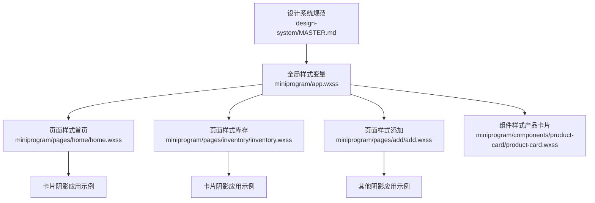
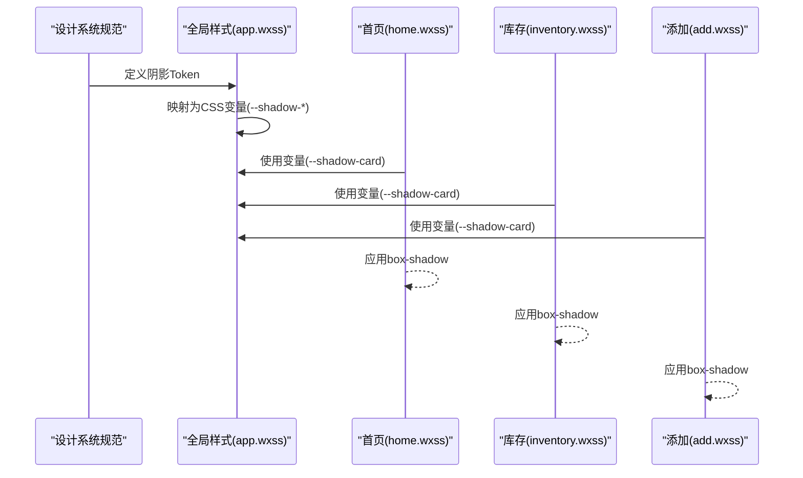
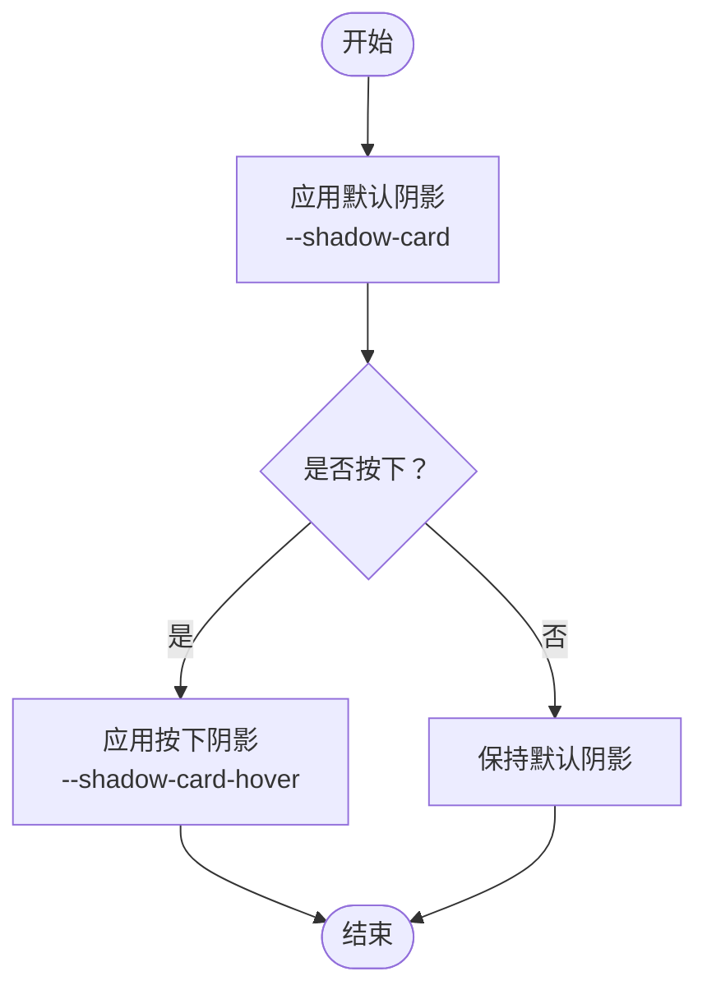
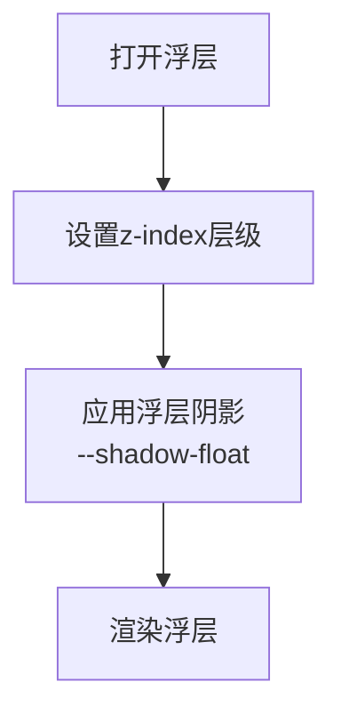
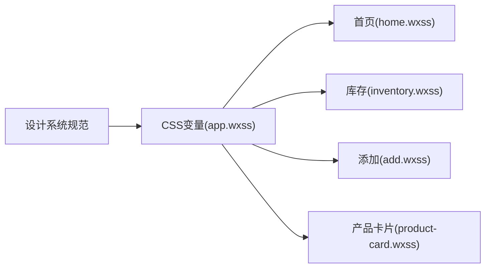

# 阴影系统

<cite>
**本文引用的文件**
- [design-system/MASTER.md](file://design-system/MASTER.md)
- [miniprogram/app.wxss](file://miniprogram/app.wxss)
- [miniprogram/pages/home/home.wxss](file://miniprogram/pages/home/home.wxss)
- [miniprogram/pages/inventory/inventory.wxss](file://miniprogram/pages/inventory/inventory.wxss)
- [miniprogram/pages/add/add.wxss](file://miniprogram/pages/add/add.wxss)
- [miniprogram/components/product-card/product-card.wxss](file://miniprogram/components/product-card/product-card.wxss)
</cite>

## 目录
1. [简介](#简介)
2. [项目结构](#项目结构)
3. [核心组件](#核心组件)
4. [架构总览](#架构总览)
5. [详细组件分析](#详细组件分析)
6. [依赖分析](#依赖分析)
7. [性能考虑](#性能考虑)
8. [故障排查指南](#故障排查指南)
9. [结论](#结论)
10. [附录](#附录)

## 简介
本文件为“阴影系统”的设计规范文档，面向微信小程序前端开发者与设计师，系统阐述CosmeticBox设计体系中的阴影规范与落地方式。文档聚焦以下四类阴影：
- 卡片默认阴影：0 2px 12px rgba(0,0,0,0.06)
- 卡片按下阴影：0 4px 16px rgba(0,0,0,0.1)
- 浮层阴影：0 8px 24px rgba(0,0,0,0.12)
- 按钮按下阴影：inset 0 2px 4px rgba(0,0,0,0.1)

同时解释阴影层级与深度感知原理，给出在不同组件与场景中的应用策略，并提供CSS变量与实际页面样式的映射关系，帮助开发者正确实现与扩展阴影规范。

## 项目结构
阴影系统贯穿全局样式与页面样式，采用“设计系统规范 + 全局CSS变量 + 组件/页面样式”的分层组织方式：
- 设计系统规范：定义阴影Token与使用场景
- 全局样式：将设计Token映射为CSS变量
- 页面与组件样式：通过CSS变量或直接使用box-shadow应用阴影

图表来源
- [design-system/MASTER.md:94-101](file://design-system/MASTER.md#L94-L101)
- [miniprogram/app.wxss:47-51](file://miniprogram/app.wxss#L47-L51)
- [miniprogram/pages/home/home.wxss:84-86](file://miniprogram/pages/home/home.wxss#L84-L86)
- [miniprogram/pages/inventory/inventory.wxss:18-23](file://miniprogram/pages/inventory/inventory.wxss#L18-L23)
- [miniprogram/pages/add/add.wxss:36-38](file://miniprogram/pages/add/add.wxss#L36-L38)

章节来源
- [design-system/MASTER.md:94-101](file://design-system/MASTER.md#L94-L101)
- [miniprogram/app.wxss:47-51](file://miniprogram/app.wxss#L47-L51)

## 核心组件
本节从设计与实现两个维度，系统梳理阴影系统的核心要素。

- 设计Token与数值
  - 卡片默认阴影：0 2px 12px rgba(0,0,0,0.06)
  - 卡片按下阴影：0 4px 16px rgba(0,0,0,0.1)
  - 浮层阴影：0 8px 24px rgba(0,0,0,0.12)
  - 按钮按下阴影：inset 0 2px 4px rgba(0,0,0,0.1)

- CSS变量映射
  - --shadow-card：卡片默认阴影
  - --shadow-card-hover：卡片按下阴影
  - --shadow-float：浮层阴影
  - --shadow-button-press：按钮按下阴影（设计系统中定义）

- 使用场景
  - 卡片默认：通用卡片、统计卡片、列表项卡片
  - 卡片按下：卡片交互按下态
  - 浮层：模态弹窗、下拉面板、抽屉等
  - 按钮按下：按钮点击反馈

章节来源
- [design-system/MASTER.md:94-101](file://design-system/MASTER.md#L94-L101)
- [miniprogram/app.wxss:47-51](file://miniprogram/app.wxss#L47-L51)

## 架构总览
阴影系统在代码中的落地路径如下：
- 设计系统定义Token与场景
- 全局样式将Token映射为CSS变量
- 页面与组件样式通过变量或直接使用box-shadow应用阴影
- 通过z-index与层级管理确保阴影的视觉层级

图表来源
- [design-system/MASTER.md:94-101](file://design-system/MASTER.md#L94-L101)
- [miniprogram/app.wxss:47-51](file://miniprogram/app.wxss#L47-L51)
- [miniprogram/pages/home/home.wxss:84-86](file://miniprogram/pages/home/home.wxss#L84-L86)
- [miniprogram/pages/inventory/inventory.wxss:18-23](file://miniprogram/pages/inventory/inventory.wxss#L18-L23)
- [miniprogram/pages/add/add.wxss:36-38](file://miniprogram/pages/add/add.wxss#L36-L38)

## 详细组件分析

### 卡片阴影（默认与按下）
- 默认阴影：用于卡片、统计卡片、列表项卡片等基础平面元素，营造轻量抬起的立体感。
- 按下阴影：用于卡片交互按下态，增强触控反馈与层级变化。
- 实现要点
  - 通过CSS变量统一管理，避免硬编码
  - 在交互事件中切换类名以改变box-shadow
  - 与圆角、背景色、边框共同构建卡片整体质感

图表来源
- [miniprogram/app.wxss:131-136](file://miniprogram/app.wxss#L131-L136)
- [miniprogram/pages/home/home.wxss:84-86](file://miniprogram/pages/home/home.wxss#L84-L86)
- [miniprogram/pages/inventory/inventory.wxss:18-23](file://miniprogram/pages/inventory/inventory.wxss#L18-L23)

章节来源
- [miniprogram/app.wxss:131-136](file://miniprogram/app.wxss#L131-L136)
- [miniprogram/pages/home/home.wxss:84-86](file://miniprogram/pages/home/home.wxss#L84-L86)
- [miniprogram/pages/inventory/inventory.wxss:18-23](file://miniprogram/pages/inventory/inventory.wxss#L18-L23)

### 浮层阴影（模态/面板）
- 适用范围：模态弹窗、下拉面板、抽屉、对话框等需要与主内容分离的浮层元素。
- 设计原则：比卡片阴影更深，形成明显的层级分离；避免与卡片阴影混淆。
- 实现建议：使用--shadow-float变量，配合z-index提升层级，确保浮层在主内容之上。

图表来源
- [miniprogram/app.wxss:47-51](file://miniprogram/app.wxss#L47-L51)

章节来源
- [miniprogram/app.wxss:47-51](file://miniprogram/app.wxss#L47-L51)

### 按钮按下阴影（内嵌按压反馈）
- 设计系统中定义了“按钮按下阴影”Token，用于在按钮被按下时提供内嵌的按压反馈，增强触控真实感。
- 实现建议：在按钮的按下态使用inset阴影，使视觉上产生“凹陷”的按压效果；与颜色变化、透明度变化结合，形成完整的反馈闭环。

章节来源
- [design-system/MASTER.md:94-101](file://design-system/MASTER.md#L94-L101)

### 页面与组件中的阴影应用实例
- 首页统计卡片：使用--shadow-card为统计卡片提供默认阴影，突出数据区块。
- 库存页搜索栏：使用--shadow-card为搜索栏提供悬浮感，使其与背景适度分离。
- 添加页Tab激活态：使用独立的box-shadow值为激活Tab提供视觉强调，体现当前状态。

章节来源
- [miniprogram/pages/home/home.wxss:84-86](file://miniprogram/pages/home/home.wxss#L84-L86)
- [miniprogram/pages/inventory/inventory.wxss:18-23](file://miniprogram/pages/inventory/inventory.wxss#L18-L23)
- [miniprogram/pages/add/add.wxss:36-38](file://miniprogram/pages/add/add.wxss#L36-L38)

## 依赖分析
- 设计系统到全局样式的依赖
  - 设计系统定义的阴影Token映射到app.wxss中的CSS变量
- 全局样式到页面/组件的依赖
  - 页面与组件通过CSS变量或直接使用box-shadow引用阴影
- 交互与状态的耦合
  - 卡片按下态与交互事件绑定，通过类名切换实现阴影变化

图表来源
- [design-system/MASTER.md:94-101](file://design-system/MASTER.md#L94-L101)
- [miniprogram/app.wxss:47-51](file://miniprogram/app.wxss#L47-L51)
- [miniprogram/pages/home/home.wxss:84-86](file://miniprogram/pages/home/home.wxss#L84-L86)
- [miniprogram/pages/inventory/inventory.wxss:18-23](file://miniprogram/pages/inventory/inventory.wxss#L18-L23)
- [miniprogram/pages/add/add.wxss:36-38](file://miniprogram/pages/add/add.wxss#L36-L38)
- [miniprogram/components/product-card/product-card.wxss:1-122](file://miniprogram/components/product-card/product-card.wxss#L1-L122)

章节来源
- [design-system/MASTER.md:94-101](file://design-system/MASTER.md#L94-L101)
- [miniprogram/app.wxss:47-51](file://miniprogram/app.wxss#L47-L51)

## 性能考虑
- CSS变量的优势
  - 统一管理，便于主题切换与维护
  - 减少重复计算，提升渲染效率
- 阴影性能建议
  - 避免过度叠加阴影，减少复杂滤镜
  - 控制阴影数量与层级，避免影响滚动性能
  - 在高频交互中，优先使用过渡而非频繁重排

## 故障排查指南
- 现象：卡片阴影未生效
  - 检查是否正确引入全局CSS变量
  - 确认页面样式中是否使用了--shadow-*变量
  - 排查是否存在z-index冲突导致阴影被遮挡
- 现象：按下态阴影不出现
  - 检查交互事件是否正确切换类名
  - 确认--shadow-card-hover变量存在且值正确
- 现象：浮层阴影层级异常
  - 检查z-index层级设置，确保浮层高于主内容
  - 确认--shadow-float变量值符合预期

章节来源
- [miniprogram/app.wxss:47-51](file://miniprogram/app.wxss#L47-L51)
- [miniprogram/pages/home/home.wxss:84-86](file://miniprogram/pages/home/home.wxss#L84-L86)
- [miniprogram/pages/inventory/inventory.wxss:18-23](file://miniprogram/pages/inventory/inventory.wxss#L18-L23)

## 结论
本规范以设计系统为依据，通过CSS变量将阴影Token标准化，再在页面与组件中统一应用。卡片默认与按下阴影、浮层阴影以及按钮按下阴影共同构成清晰的层级体系，既保证了视觉深度，也提升了交互反馈的真实感。建议在后续开发中严格遵循变量命名与使用约定，确保阴影系统的一致性与可维护性。

## 附录
- 阴影Token与数值对照
  - 卡片默认阴影：0 2px 12px rgba(0,0,0,0.06)
  - 卡片按下阴影：0 4px 16px rgba(0,0,0,0.1)
  - 浮层阴影：0 8px 24px rgba(0,0,0,0.12)
  - 按钮按下阴影：inset 0 2px 4px rgba(0,0,0,0.1)

- CSS变量映射位置
  - 全局变量定义：miniprogram/app.wxss
  - 页面/组件使用：各页面与组件样式文件

- 应用场景速查
  - 卡片默认：首页统计卡片、库存列表卡片
  - 卡片按下：交互按下态
  - 浮层：模态弹窗、下拉面板
  - 按钮按下：按钮点击反馈

章节来源
- [design-system/MASTER.md:94-101](file://design-system/MASTER.md#L94-L101)
- [miniprogram/app.wxss:47-51](file://miniprogram/app.wxss#L47-L51)
- [miniprogram/pages/home/home.wxss:84-86](file://miniprogram/pages/home/home.wxss#L84-L86)
- [miniprogram/pages/inventory/inventory.wxss:18-23](file://miniprogram/pages/inventory/inventory.wxss#L18-L23)
- [miniprogram/pages/add/add.wxss:36-38](file://miniprogram/pages/add/add.wxss#L36-L38)