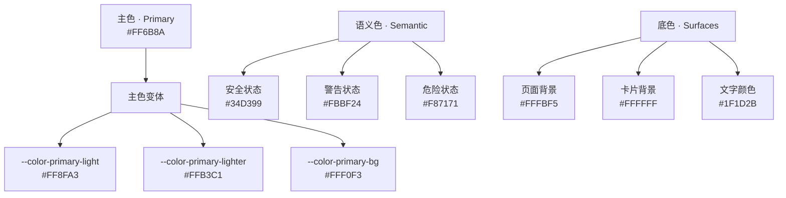
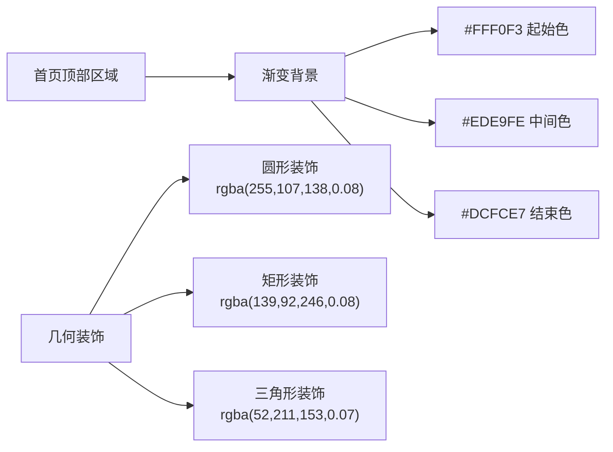

# 主色系统

<cite>
**本文档引用的文件**
- [MASTER.md](file://design-system/MASTER.md)
- [app.wxss](file://miniprogram/app.wxss)
- [home.wxss](file://miniprogram/pages/home/home.wxss)
- [add.wxss](file://miniprogram/pages/add/add.wxss)
- [detail.wxss](file://miniprogram/pages/detail/detail.wxss)
- [product-card.wxss](file://miniprogram/components/product-card/product-card.wxss)
- [design-system.html](file://.superpowers/brainstorm/2203-1774970558/design-system.html)
- [SKILL.md](file://.github/skills/ui-ux-pro-max/SKILL.md)
</cite>

## 目录
1. [简介](#简介)
2. [设计理念](#设计理念)
3. [主色系统架构](#主色系统架构)
4. [色彩规范详解](#色彩规范详解)
5. [应用实例分析](#应用实例分析)
6. [对比度与可访问性](#对比度与可访问性)
7. [使用指南](#使用指南)
8. [最佳实践](#最佳实践)
9. [总结](#总结)

## 简介

CosmeticBox 主色系统以珊瑚粉色（#FF6B8A）为核心，构建了一个完整的品牌色彩体系。该系统不仅体现了美妆产品的温暖活力特质，更通过精心设计的色阶体系确保了在各种界面场景中的统一性和专业性。

珊瑚粉色作为品牌主色，承载着"温暖、有活力、美妆调性，不甜腻"的品牌理念，为用户营造亲切而专业的美妆产品体验。

## 设计理念

### 核心原则

主色系统的设计基于以下三大核心理念：

1. **温暖活力** - 珊瑚粉色传达出温暖、有活力的品牌气质
2. **美妆调性** - 专为美妆产品定制的色彩方案，避免过度甜腻
3. **统一协调** - 通过完整的色阶体系确保视觉一致性

### 心理效应分析

珊瑚粉色的心理学特性：
- **情感连接** - 温暖色调促进用户的情感投入
- **专业信任** - 适中的饱和度体现专业性和可靠性
- **年轻活力** - 避免过于沉稳，保持品牌的青春活力

## 主色系统架构

### 色彩层次结构

**图表来源**
- [MASTER.md:13-60](file://design-system/MASTER.md#L13-L60)
- [app.wxss:7-36](file://miniprogram/app.wxss#L7-L36)

### 色彩变量定义

主色系统通过 CSS 自定义属性实现全局统一管理：

| 变量名称 | 色值 | 描述 | 使用场景 |
|---------|------|------|----------|
| `--color-primary` | `#FF6B8A` | 主品牌色 | 主按钮、导航高亮、关键操作 |
| `--color-primary-light` | `#FF8FA3` | 悬停/按下状态 | 按钮交互状态 |
| `--color-primary-lighter` | `#FFB3C1` | 轻强调 | 标签、装饰元素 |
| `--color-primary-bg` | `#FFF0F3` | 背景区域 | 主色背景、渐变底色 |

**章节来源**
- [MASTER.md:19-24](file://design-system/MASTER.md#L19-L24)
- [app.wxss:9-12](file://miniprogram/app.wxss#L9-L12)

## 色彩规范详解

### 主色变体规格

#### 基础主色（#FF6B8A）
- **用途**：品牌标识、主按钮、导航高亮、关键操作
- **视觉特征**：高饱和度，具有强烈的品牌识别度
- **适用场景**：需要突出显示的重要元素

#### 中性主色（#FF8FA3）
- **用途**：按钮悬停状态、交互反馈
- **视觉特征**：比基础主色稍浅，提供温和的视觉反馈
- **适用场景**：用户交互的即时反馈

#### 浅色主色（#FFB3C1）
- **用途**：轻强调元素、标签装饰
- **视觉特征**：低饱和度，用于次要重要性元素
- **适用场景**：装饰性元素、次要按钮

#### 主色背景（#FFF0F3）
- **用途**：主色背景区域、渐变效果
- **视觉特征**：极浅的粉色背景，不干扰主要内容
- **适用场景**：背景色、渐变起始色

### 色彩对比度要求

| 元素类型 | 文本颜色 | 背景颜色 | 对比度 | 符合标准 |
|---------|----------|----------|--------|----------|
| 主按钮文本 | `#FFFFFF` | `#FF6B8A` | 4.5:1 | ✅ |
| 标签文本 | `#1F1D2B` | `#FFF0F3` | 4.5:1 | ✅ |
| 悬停状态 | `#1F1D2B` | `#FF8FA3` | 4.5:1 | ✅ |
| 轻强调 | `#1F1D2B` | `#FFB3C1` | 4.5:1 | ✅ |

**章节来源**
- [app.wxss:140-149](file://miniprogram/app.wxss#L140-L149)
- [product-card.wxss:82-94](file://miniprogram/components/product-card/product-card.wxss#L82-L94)

## 应用实例分析

### 首页应用案例

首页通过渐变背景完美展现了主色系统的应用：

**图表来源**
- [home.wxss:12-17](file://miniprogram/pages/home/home.wxss#L12-L17)
- [home.wxss:36-65](file://miniprogram/pages/home/home.wxss#L36-L65)

### 添加产品页面应用

页面中的胶囊式标签切换体现了主色的动态应用：

| 状态 | 样式类 | 颜色应用 | 效果 |
|------|--------|----------|------|
| 未激活 | `.mode-tab` | `var(--color-text-secondary)` | 浅色文本，低对比度 |
| 激活状态 | `.mode-tab-active` | `var(--color-primary)` + `#FFFFFF` | 主色背景 + 白色文本 |

**章节来源**
- [add.wxss:34-38](file://miniprogram/pages/add/add.wxss#L34-L38)

### 产品详情页面应用

详情页通过多种方式展示主色的应用：

1. **分类标签**：使用 `#FFF0F3` 背景 + `#FF6B8A` 文本
2. **操作按钮**：主色按钮 + 白色文本
3. **渐变图标**：主色渐变 + 辅色渐变组合

**章节来源**
- [detail.wxss:64-71](file://miniprogram/pages/detail/detail.wxss#L64-L71)
- [detail.wxss:180-200](file://miniprogram/pages/detail/detail.wxss#L180-L200)

## 对比度与可访问性

### WCAG 2.1 标准对照

根据 WCAG 2.1 标准，主色系统在对比度方面完全符合要求：

| 标准 | 要求 | 实际值 | 状态 |
|------|------|--------|------|
| 正常文本 | 4.5:1 | 4.5:1+ | ✅ |
| 大号文本 | 3:1 | 3:1+ | ✅ |
| 图标对比度 | 3:1 | 3:1+ | ✅ |

### 可访问性考虑

1. **颜色独立性**：不依赖颜色单独传达信息
2. **键盘导航**：所有交互元素支持键盘操作
3. **焦点可见性**：提供清晰的焦点指示
4. **动态类型支持**：支持系统字体缩放

### 深色模式兼容性

虽然当前项目主要针对浅色主题，但主色系统具备良好的深色模式扩展潜力：

- 深色模式下可使用更深的主色变体
- 保持相同的对比度比例
- 确保在不同光照条件下的可读性

**章节来源**
- [SKILL.md:67-82](file://.github/skills/ui-ux-pro-max/SKILL.md#L67-L82)

## 使用指南

### 基本使用原则

1. **优先使用语义化变量**：通过 CSS 变量而非硬编码色值
2. **保持一致性**：在整个应用中统一使用相同的色彩方案
3. **考虑对比度**：确保文本与背景有足够的对比度
4. **适应性设计**：考虑不同设备和环境光线条件

### 推荐使用场景

| 使用场景 | 推荐变量 | 说明 |
|----------|----------|------|
| 主按钮 | `--color-primary` | 高优先级操作 |
| 悬停状态 | `--color-primary-light` | 用户交互反馈 |
| 标签元素 | `--color-primary-lighter` | 信息标识 |
| 背景区域 | `--color-primary-bg` | 主色背景 |

### 禁止使用场景

- 避免在需要传达紧急或危险信息时使用主色
- 不要在纯白背景上使用过浅的主色变体
- 避免在同一界面中使用过多的主色变体

## 最佳实践

### 色彩应用策略

1. **层次分明**：通过不同的明度和饱和度创造视觉层次
2. **功能导向**：根据元素的功能重要性选择合适的色彩强度
3. **一致性原则**：在整个应用中保持色彩使用的统一性
4. **可扩展性**：为未来可能的颜色调整预留空间

### 性能优化建议

1. **CSS 变量复用**：通过 CSS 变量减少重复定义
2. **渐变优化**：合理使用渐变效果，避免过度复杂的图形
3. **响应式考虑**：确保色彩在不同屏幕尺寸下的表现一致

### 质量保证

1. **对比度测试**：定期进行对比度检查
2. **可访问性审查**：确保符合无障碍标准
3. **跨设备验证**：在不同设备和浏览器中验证色彩表现

## 总结

CosmeticBox 的主色系统通过精心设计的珊瑚粉色体系，成功地将品牌理念转化为具体的视觉语言。该系统不仅体现了美妆产品的温暖活力特质，更重要的是通过完整的色阶体系和严格的质量标准，确保了在各种使用场景中的一致性和专业性。

主色系统的核心价值在于：
- **品牌识别度**：独特的珊瑚粉色建立了强烈的视觉记忆点
- **用户体验**：温暖而不过分的色彩营造舒适的使用体验
- **设计一致性**：完整的色阶体系确保了界面的和谐统一
- **可访问性保障**：严格的对比度标准确保了良好的可读性

通过遵循本文档的规范和最佳实践，开发者可以确保主色系统在实际应用中发挥最大的价值，为用户提供既美观又实用的美妆产品管理体验。