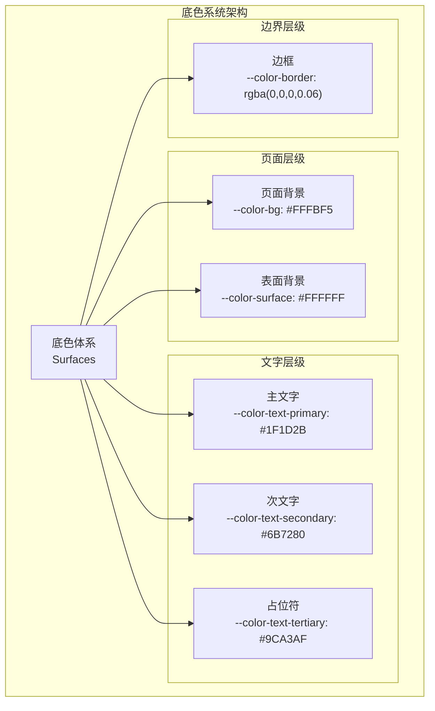
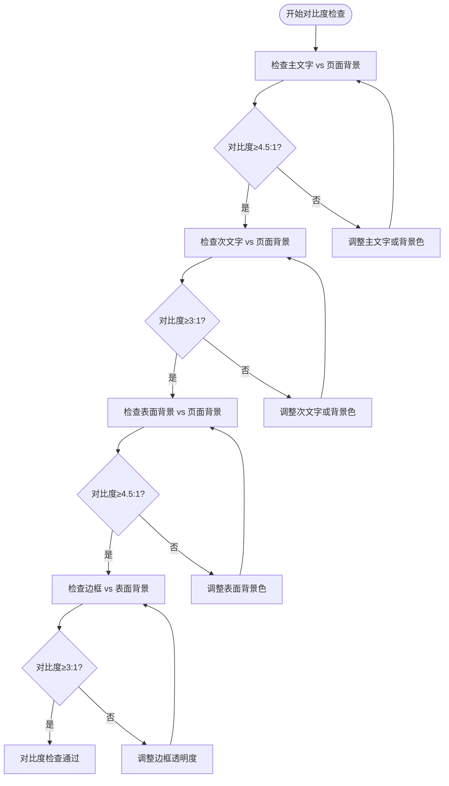
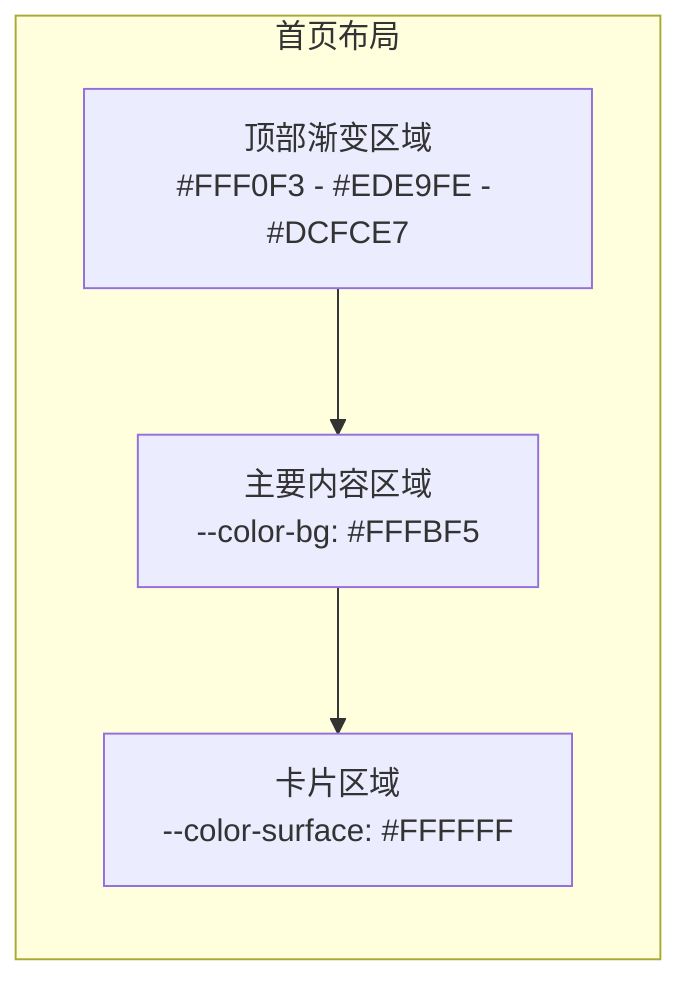
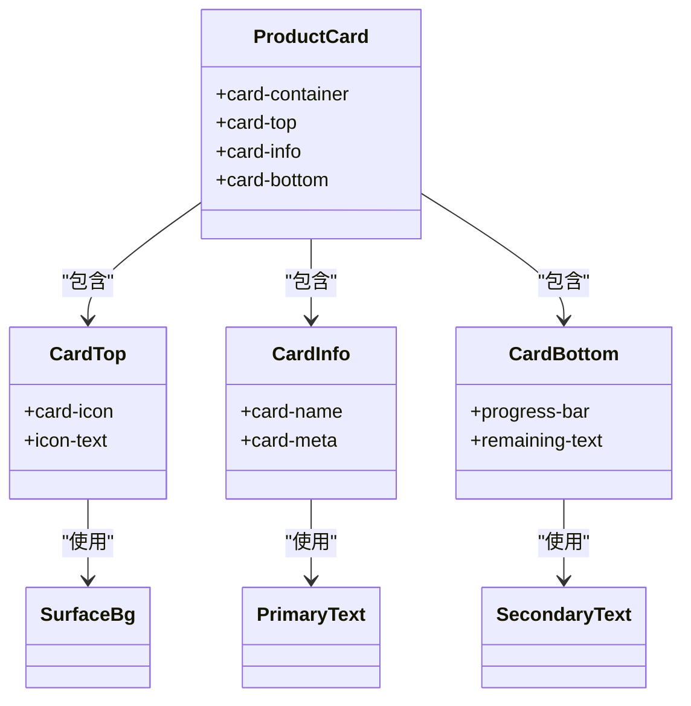

# 底色系统

<cite>
**本文档引用的文件**
- [MASTER.md](file://design-system/MASTER.md)
- [app.wxss](file://miniprogram/app.wxss)
- [product-card.wxss](file://miniprogram/components/product-card/product-card.wxss)
- [home.wxss](file://miniprogram/pages/home/home.wxss)
- [detail.wxss](file://miniprogram/pages/detail/detail/detail.wxss)
- [home.md](file://design-system/pages/home.md)
- [detail.md](file://design-system/pages/detail.md)
- [design-system.html](file://.superpowers/brainstorm/2203-1774970558/design-system.html)
</cite>

## 目录
1. [简介](#简介)
2. [设计理念](#设计理念)
3. [底色体系架构](#底色体系架构)
4. [核心底色规范](#核心底色规范)
5. [视觉层次与对比度](#视觉层次与对比度)
6. [应用场景与搭配](#应用场景与搭配)
7. [组件应用规范](#组件应用规范)
8. [暖色调设计哲学](#暖色调设计哲学)
9. [最佳实践指南](#最佳实践指南)
10. [总结](#总结)

## 简介

CosmeticBox 底色系统是整个设计体系的核心组成部分，采用"清新柔和"的设计理念，通过精心挑选的暖色调营造温馨舒适的使用体验。该系统以页面背景色 `--color-bg: #FFFBF5` 为核心，配合卡片背景色 `--color-surface: #FFFFFF`，构建出层次分明、对比适中的视觉环境。

底色系统不仅定义了具体的色彩数值，更重要的是建立了完整的色彩使用规范和应用原则，确保在不同页面布局和组件中都能保持一致的视觉体验和良好的可读性。

## 设计理念

### 三大核心支柱

底色系统的设计建立在三个核心理念之上：

1. **极简几何**（Monument Valley）— 纯净、有序、呼吸感，用圆、三角、方作为装饰语言
2. **激励反馈**（Duolingo）— 进度条、统计数字、成就感，让管理库存像完成游戏任务  
3. **清新柔和** — 暖调用色，年轻不幼稚，精致不严肃

### 暖色调选择原则

系统避免使用传统管理软件的冷蓝色调，坚持使用温暖、有活力的色彩方案。这种选择不仅符合产品的美妆定位，更能够营造出温馨、舒适的用户体验。

**章节来源**
- [MASTER.md:5-11](file://design-system/MASTER.md#L5-L11)

## 底色体系架构

### 整体架构图



**图表来源**
- [MASTER.md:50-59](file://design-system/MASTER.md#L50-L59)
- [app.wxss:30-36](file://miniprogram/app.wxss#L30-L36)

### 层级关系矩阵

| 层级 | 色彩变量 | 色值 | 用途 | 对比度要求 |
|------|----------|------|------|------------|
| 页面背景 | `--color-bg` | #FFFBF5 | 整体页面背景 | 无限制 |
| 表面背景 | `--color-surface` | #FFFFFF | 卡片、输入框背景 | ≥4.5:1 |
| 主文字 | `--color-text-primary` | #1F1D2B | 标题、主要内容 | ≥4.5:1 |
| 次文字 | `--color-text-secondary` | #6B7280 | 说明文字 | ≥3:1 |
| 占位符 | `--color-text-tertiary` | #9CA3AF | 辅助信息 | ≥3:1 |
| 边框 | `--color-border` | rgba(0,0,0,0.06) | 分隔线、边框 | ≥3:1 |

**章节来源**
- [MASTER.md:50-59](file://design-system/MASTER.md#L50-L59)
- [app.wxss:30-36](file://miniprogram/app.wxss#L30-L36)

## 核心底色规范

### 页面背景色 --color-bg

**色彩规范**
- 色值：`#FFFBF5`
- 类型：暖白色
- 特性：比纯白色更加温暖，避免冰冷感
- 用途：所有页面的主背景色

**视觉效果**
- 营造温馨、舒适的阅读环境
- 减少眼睛疲劳，适合长时间使用
- 为其他色彩提供良好的基底

**章节来源**
- [MASTER.md:54](file://design-system/MASTER.md#L54)
- [app.wxss:31](file://miniprogram/app.wxss#L31)

### 卡片背景色 --color-surface

**色彩规范**
- 色值：`#FFFFFF`
- 类型：纯白色
- 特性：标准卡片背景，提供清晰的内容展示区域
- 用途：产品卡片、输入框、对话框等

**视觉效果**
- 提供清晰的内容层次
- 与页面背景形成适度对比
- 支持阴影效果的呈现

**章节来源**
- [MASTER.md:55](file://design-system/MASTER.md#L55)
- [app.wxss:32](file://miniprogram/app.wxss#L32)

### 文字颜色体系

#### 主文字 --color-text-primary

**色彩规范**
- 色值：`#1F1D2B`
- 类型：暖黑色
- 特性：比纯黑更加柔和，减少视觉压力
- 用途：页面标题、主要内容、重要信息

**视觉效果**
- 提供最佳的可读性
- 与暖白色背景形成理想对比
- 适合长文本阅读

**章节来源**
- [MASTER.md:56](file://design-system/MASTER.md#L56)
- [app.wxss:33](file://miniprogram/app.wxss#L33)

#### 次文字 --color-text-secondary

**色彩规范**
- 色值：`#6B7280`
- 类型：中性灰色
- 特性：用于说明文字和辅助信息
- 用途：描述性文字、标签、注释

**视觉效果**
- 与主文字形成层次区分
- 不会抢夺主要内容的注意力
- 适合各种辅助信息展示

**章节来源**
- [MASTER.md:57](file://design-system/MASTER.md#L57)
- [app.wxss:34](file://miniprogram/app.wxss#L34)

#### 占位符 --color-text-tertiary

**色彩规范**
- 色值：`#9CA3AF`
- 类型：浅灰色
- 特性：用于占位符和弱化信息
- 用途：输入框提示文字、辅助标签

**视觉效果**
- 保持界面整洁，不干扰主要信息
- 提供适当的视觉层次
- 适合弱化的重要信息

**章节来源**
- [MASTER.md:58](file://design-system/MASTER.md#L58)
- [app.wxss:35](file://miniprogram/app.wxss#L35)

### 边框颜色 --color-border

**色彩规范**
- 色值：`rgba(0,0,0,0.06)`
- 类型：半透明黑色
- 特性：轻量级边框，避免视觉重量
- 用途：分隔线、输入框边框、卡片边框

**视觉效果**
- 提供清晰的区域分隔
- 不会破坏整体的简洁感
- 支持hover和active状态变化

**章节来源**
- [MASTER.md:59](file://design-system/MASTER.md#L59)
- [app.wxss:36](file://miniprogram/app.wxss#L36)

## 视觉层次与对比度

### 对比度分析

底色系统严格遵循可访问性标准，确保不同层级的颜色具有合适的对比度：



**图表来源**
- [app.wxss:73-74](file://miniprogram/app.wxss#L73-L74)

### 层次关系设计

底色系统通过合理的色彩层次构建信息架构：

1. **页面背景** - 最低层级，提供整体氛围
2. **表面背景** - 中间层级，承载具体内容
3. **文字层级** - 最高层级，传达信息内容
4. **边界层级** - 介于中间，提供结构分隔

这种层次设计确保了信息的清晰传达和视觉的和谐统一。

**章节来源**
- [MASTER.md:69-78](file://design-system/MASTER.md#L69-L78)

## 应用场景与搭配

### 页面布局中的应用

#### 首页布局应用

首页采用渐变背景与底色系统的完美结合：



**图表来源**
- [home.md:33](file://design-system/pages/home.md#L33)
- [home.wxss:12-17](file://miniprogram/pages/home/home.wxss#L12-L17)

#### 详情页布局应用

详情页通过底色系统营造专业而友好的信息展示环境：

- **头部区域**：使用语义色背景突出重要信息
- **内容区域**：保持页面背景的一致性
- **操作区域**：使用表面背景提供清晰的操作空间

**章节来源**
- [detail.md:34-44](file://design-system/pages/detail.md#L34-L44)

### 组件搭配规范

#### 产品卡片搭配

产品卡片通过底色系统实现信息层次的清晰表达：



**图表来源**
- [product-card.wxss:5-79](file://miniprogram/components/product-card/product-card.wxss#L5-L79)

**章节来源**
- [product-card.wxss:5-79](file://miniprogram/components/product-card/product-card.wxss#L5-L79)

## 组件应用规范

### 卡片组件规范

#### 基础卡片样式

卡片组件严格遵循底色系统规范：

- **背景色**：使用 `var(--color-surface)` (#FFFFFF)
- **圆角**：使用 `var(--radius-card)` (20px)
- **阴影**：使用 `var(--shadow-card)` (0 2px 12px rgba(0,0,0,0.06))
- **内边距**：使用 `var(--space-lg)` (16px)

#### 产品卡片特例

产品卡片在遵循基础规范的同时，增加了状态标识：

- **状态标签**：使用语义色背景 (`--color-safe-bg`, `--color-warning-bg`, `--color-danger-bg`)
- **图标容器**：使用渐变背景增强视觉吸引力
- **进度条**：使用语义色渐变体现状态变化

**章节来源**
- [app.wxss:131-136](file://miniprogram/app.wxss#L131-L136)
- [product-card.wxss:73-99](file://miniprogram/components/product-card/product-card.wxss#L73-L99)

### 输入组件规范

#### 输入框样式

输入组件通过底色系统实现一致的交互体验：

- **背景色**：使用 `var(--color-surface)` (#FFFFFF)
- **边框色**：使用 `var(--color-border)` (rgba(0,0,0,0.06))
- **圆角**：使用 `var(--radius-input)` (12px)
- **高度**：固定 44px，符合触摸目标要求

#### 按钮组件样式

按钮组件在底色系统基础上增加交互状态：

- **基础状态**：使用主色背景 (`var(--color-primary)`)
- **悬停状态**：使用主色浅色变体 (`var(--color-primary-light)`)
- **按下状态**：使用内阴影模拟按压效果

**章节来源**
- [app.wxss:156-165](file://miniprogram/app.wxss#L156-L165)
- [app.wxss:139-149](file://miniprogram/app.wxss#L139-L149)

## 暖色调设计哲学

### 色彩心理学应用

底色系统采用暖色调设计，体现了深层的心理学考量：

#### 温暖色调的优势

1. **情感连接**：暖色调能够唤起积极的情感反应
2. **舒适感**：比冷色调更易于长时间观看
3. **亲和力**：营造友好、可信赖的品牌形象
4. **美妆定位**：符合化妆品行业的色彩偏好

#### 色彩平衡策略

系统通过精确的色彩搭配实现了以下平衡：

- **页面背景** (`#FFFBF5`) 与 **表面背景** (`#FFFFFF`) 形成微妙差异
- **主文字** (`#1F1D2B`) 与 **页面背景** 形成充足对比
- **次文字** (`#6B7280`) 与 **主文字** 形成层次区分
- **占位符** (`#9CA3AF`) 与 **次文字** 形成弱化对比

### 设计原则体现

#### 避免传统管理软件感

系统明确避免使用传统的冷蓝色调（如 `#2196F3`, `#00BCD4`），因为这些颜色会带来"传统管理软件感"，与产品定位不符。

#### 年轻但不幼稚

通过精心选择的暖色调，系统实现了"年轻但不幼稚"的设计目标。珊瑚粉色 (`#FF6B8A`) 和薰衣草紫色 (`#8B5CF6`) 都是既年轻又有质感的选择。

**章节来源**
- [MASTER.md:185-186](file://design-system/MASTER.md#L185-L186)

## 最佳实践指南

### 色彩使用原则

#### 一致性原则

1. **全局统一**：所有页面和组件必须使用相同的底色变量
2. **层级明确**：严格按照层级使用相应的色彩
3. **状态一致**：相同状态下的颜色表现应保持一致

#### 可访问性优先

1. **对比度保证**：始终满足 WCAG 2.1 的对比度要求
2. **颜色盲友好**：避免仅用颜色传达重要信息
3. **动态字体支持**：支持系统字体缩放设置

### 常见问题与解决方案

#### 问题：颜色看起来过于相似

**解决方案**：
- 检查页面背景与表面背景的对比度
- 确认主文字与背景的对比度是否达标
- 调整透明度或色相微调

#### 问题：某些状态颜色不够明显

**解决方案**：
- 使用语义色的深色变体
- 增加颜色的饱和度
- 结合图标和文字双重表达

#### 问题：在不同设备上显示不一致

**解决方案**：
- 使用 CSS 变量而非硬编码色值
- 测试不同屏幕的显示效果
- 考虑设备的色彩配置

### 开发注意事项

#### CSS 变量使用

所有底色必须通过 CSS 变量使用，不得直接写入具体色值：

```css
/* ✅ 正确做法 */
.card {
    background-color: var(--color-surface);
    color: var(--color-text-primary);
}

/* ❌ 错误做法 */
.card {
    background-color: #FFFFFF;
    color: #1F1D2B;
}
```

#### 组件复用原则

1. **通用组件**：使用基础底色变量
2. **状态组件**：在基础变量上增加状态样式
3. **主题组件**：通过 CSS 变量实现主题切换

**章节来源**
- [app.wxss:78-92](file://miniprogram/app.wxss#L78-L92)

## 总结

CosmeticBox 底色系统通过精心设计的暖色调组合，成功营造了温馨、舒适且专业的用户体验。系统不仅提供了完整的色彩规范，更重要的是建立了一套完整的应用原则和最佳实践。

### 核心价值

1. **用户体验优化**：通过暖色调和合适的对比度，提供舒适的阅读和操作体验
2. **品牌一致性**：统一的色彩体系强化了品牌形象和识别度
3. **开发效率提升**：标准化的 CSS 变量使用简化了开发流程
4. **可访问性保障**：严格遵循可访问性标准，确保所有用户都能良好使用

### 设计成果

底色系统成功实现了"清新柔和"的设计理念，在保持专业性的同时不失亲和力，为美妆库存管理应用创造了独特的视觉语言。通过合理的色彩层次和对比度设计，系统确保了信息的有效传达和用户的良好体验。

这一底色体系为整个 CosmeticBox 设计系统奠定了坚实的基础，为后续的功能扩展和界面优化提供了可靠的色彩支撑。